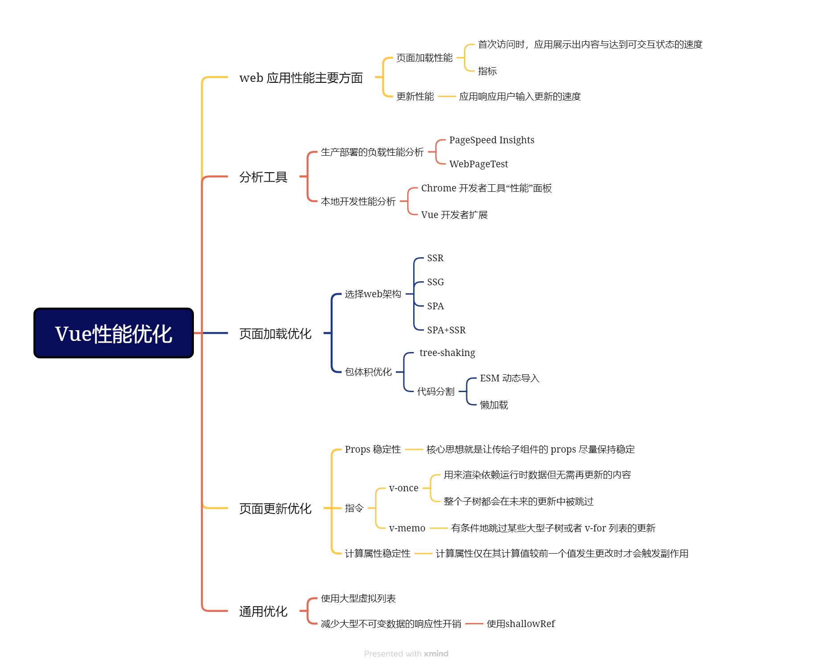

# Vue性能优化

## 大纲

> 参考官方文档：[性能优化 | Vue.js (vuejs.org)](https://cn.vuejs.org/guide/best-practices/performance.html#performance)

## Vue 性能优化方法总结

| 优化类别     | 方法                                                         | 描述                                                 |
| ------------ | ------------------------------------------------------------ | ---------------------------------------------------- |
| 分析工具     | - PageSpeed Insights - WebPageTest - Chrome 开发者工具性能面板 - Vue 开发者扩展 | 使用工具来衡量和分析应用性能                         |
| 页面加载优化 | - 选用正确的架构 - 包体积与 Tree-shaking 优化 - 代码分割 | 针对页面加载性能进行优化                             |
| 更新性能     | - Props 稳定性 - 使用 `v-once` - 使用 `v-memo` - 计算属性稳定性 | 优化应用响应用户输入的速度                           |
| 通用优化     | - 大型虚拟列表 - 减少大型不可变数据的响应性开销 - 避免不必要的组件抽象 | 同时改善页面加载和更新性能                           |
| 架构选择     | - 服务器端渲染 (SSR) - 静态站点生成 (SSG) - 客户端渲染增强 | 根据应用类型选择合适的架构以提升性能                 |
| 包体积优化   | - 使用构建步骤 - 注意包体积膨胀 - 使用 ES 模块格式的依赖 - 使用 petite-vue（渐进式增强场景） | 减小打包产物体积以提升页面加载速度                   |
| 代码分割     | - 使用动态导入语法进行代码分割 - 与 Vue 的异步组件搭配使用 | 按需或并行加载代码块，减少页面初次加载时的资源加载   |
| Props 优化   | - 使 props 保持稳定 - 避免不必要的 prop 更新              | 减少不必要的组件更新，提高更新性能                   |
| 内置指令     | - 使用 `v-once` 跳过子树更新 - 使用 `v-memo` 有条件地跳过更新 | 提高性能，减少不必要的计算和渲染                     |
| 计算属性     | - 计算属性仅在其计算值变化时触发副作用                       | 减少非必要副作用的触发                               |
| 列表虚拟化   | - 使用虚拟滚动列表库                                         | 只渲染用户视口中能看到的部分，提升渲染大型列表的性能 |
| 浅层响应式   | - 使用 `shallowRef` 和 `shallowReactive`                     | 减少对大型数据的响应式追踪，提高性能                 |
| 组件抽象     | - 避免在大型列表中创建不必要的组件实例                       | 减少组件实例数量，提高性能                           |