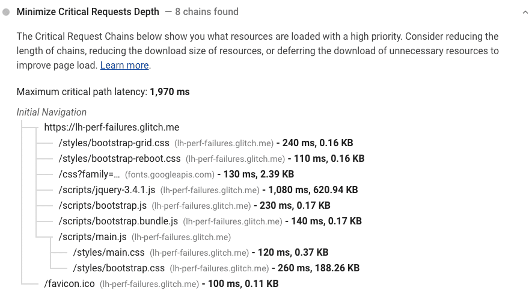
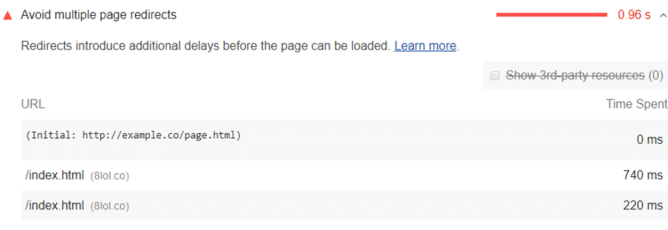
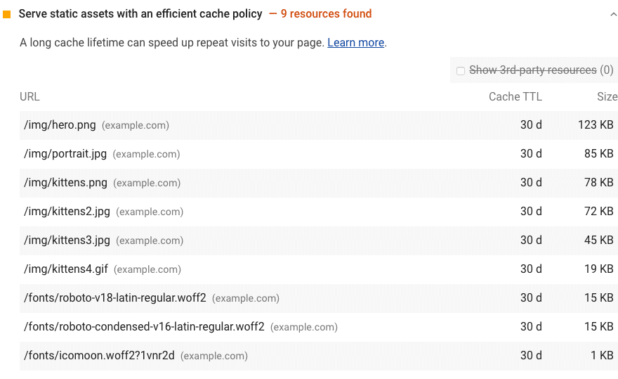
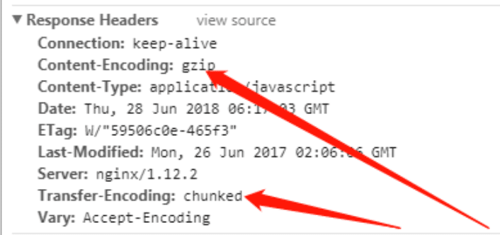
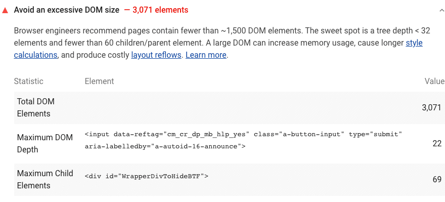
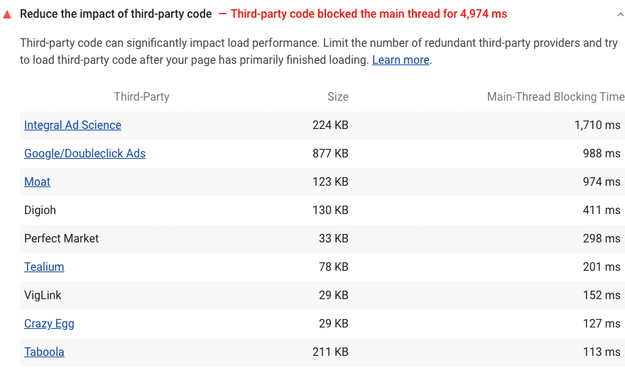

# 前端性能优化方案

## 总览


## 前端性能优化方案

### 构建和开发体验优化

| 优化点           | 说明                                           |
| ---------------- | ---------------------------------------------- |
| 缩小文件搜索范围 | 减少构建系统需要搜索的文件数量                 |
| 使用 DIIPlugin   | 提高构建速度                                   |
| 优化构建速度     | 通过各种构建工具插件来优化构建过程             |
| 使用 HappyPack   | 并行处理构建任务以提高构建速度                 |
| 开启模块热替换   | 允许在不重载页面的情况下替换模块，提升开发体验 |

### 网络层优化

| 优化点                    | 说明                                              |
| ------------------------- | ------------------------------------------------- |
| 预解析DNS(DNS-Prefetch)   | 提前解析DNS，减少域名解析时间                     |
| 预连接(Preconnect)        | 预先建立与关键第三方域的连接                      |
| 预获取(Prefetching)       | 预加载用户可能访问的资源                          |
| 预载入(Preload)           | 预加载某些关键资源以加快页面渲染                  |
| 使用 ParallelUglifyPlugin | 并行压缩JavaScript文件以提高构建速度              |
| CDN加速                   | 使用内容分发网络来加速资源加载                    |
| 减少HTTP请求              | 合并文件、使用CSS Sprites等                       |
| 启用长期缓存              | 通过设置合适的HTTP缓存头来减少服务器请求          |
| 使用HTTP2                 | 利用HTTP2的特性，如头部压缩、多路复用等来提升性能 |

### 浏览器和代码层优化

| 优化点                      | 说明                                             |
| --------------------------- | ------------------------------------------------ |
| 提升代码性能                | 优化JavaScript执行效率                           |
| 使用服务端渲染(SSR)         | 服务器直接输出HTML，减少客户端渲染时间           |
| 开启 Scope Hoisting         | 通过作用域提升来减少函数创建                     |
| async方式                   | 异步加载非关键资源，不阻塞页面渲染               |
| 图片懒加载                  | 仅在用户滚动到相应位置时加载图片                 |
| 使用字体图标                | 使用字体图标代替图片图标，减少HTTP请求           |
| 使用响应式图片              | 根据视口大小加载合适尺寸的图片                   |
| 延迟非关键CSS加载           | 将非关键CSS放在页面底部或异步加载                |
| 调整图片大小                | 确保图片实际尺寸与显示尺寸一致，避免不必要的缩放 |
| 降低图片质量                | 使用压缩率更高的图片格式，如WebP                 |
| 使用Web Workers             | 将复杂计算放在Web Workers中，避免阻塞主线程      |
| 使用`requestAnimationFrame` | 优化动画，提高性能                               |
| CSS3效果代替图片            | 使用CSS3属性来实现一些视觉效果，减少图片使用     |

### 服务器端优化

| 优化点          | 说明                                      |
| --------------- | ----------------------------------------- |
| 配置Gzip压缩    | 在服务器端压缩文本资源，减少传输大小      |
| Nginx优化       | 配置Nginx服务器以提高性能                 |
| 删除未使用的CSS | 移除未使用的CSS代码，减少样式表大小       |
| 编码优化        | 使用更高效的编码方式                      |
| 减少布局次数    | 优化CSS和JavaScript以减少浏览器重排和重绘 |

### 其他优化

| 优化点                 | 说明                                                    |
| ---------------------- | ------------------------------------------------------- |
| 使用Tree Shaking       | 移除未使用的代码以减少包大小                            |
| PWA应用骨架屏          | 通过Service Workers缓存关键资源，提升离线访问和加载性能 |
| 按需加载               | 仅在需要时加载组件或资源                                |
| service worker缓存     | 使用Service Workers进行缓存管理                         |
| 使用Prepack            | 优化JavaScript代码的执行顺序，提高运行效率              |
| 使用Beacon进行数据上报 | 通过Beacon API无阻塞地上报分析数据                      |

## 网络加载优化

### 资源提示

此规范定义了 HTML 的 `<Link>` 元素的 rel 属性值，包括 dns-prefetch、preconnect、prefetch 和 prerender。我们可以使用这些资源提示让用用户代理帮助我们预解析 DNS、预链接、预加载资源以及预处理资源以提高页面性能。

#### **DNS 预解析 (DNS-Prefetch)：**

* 通过 DNS 预解析来告诉浏览器未来我们可能从某个特定的 URL 获取资源，当浏览器真正使用到该域中的某个资源时就可以尽快地完成 DNS 解析。
* 方法： `<link rel="dns-prefetch" href="//example.com">`

#### **预连接 (Preconnect)：**

* 与 DNS 预解析类似，preconnect 不仅完成 DNS 预解析，同时还将进行 TCP 握手和建立传输层协议

* 方法： `<link rel="preconnect" href="http://example.com">`

  

* 应用：

  * 只对一些立即用到的第三方站点添加 preconnect 处理，要节省用 preconnect。
  * 用 preconnect 给所有的第三方站点都做提前链接很低效，可以为重要的第三方站点做 preconnect ,其余的都做 dns-prefetch. 可节约20-120ms。

  

#### **预获取 (Prefetching)：**

* 告诉浏览器获取下一次导航可能需要的资源。大多数情况下，这意味着将以极低的优先级来获取资源（因为浏览器知道当前页面中需要的所有内容比我们认为在下一页中需要的资源更重要）。这意味着 prefetch 的主要用处是加快下一个导航的速度，而不是当前的导航。
* 方法：`<link rel="prefetch" href="image.png">`
* 与预解析DNS区别：与 DNS 预解析不同，预获取真正请求并下载了资源，并储存在缓存中。但预获取还依赖于一些条件，某些预获取可能会被浏览器忽略，例如从一个非常缓慢的网络中获取一个庞大的字体文件。并且，Firefox 只会在浏览器闲置时进行资源预获取。

#### **子资源 (Subresources)：**

* 另一个预获取方式，这种方式指定的预获取资源具有最高的优先级，在所有 prefetch 项之前进行
* 方法：`<link rel="subresource" href="styles.css">`
* rel=prefetch 为将来的页面提供了一种低优先级的资源预加载方式，而 rel=subresource 为当前页面提供了一种高优先级的资源预加载。所以，如果资源是当前页面必须的，或者资源需要尽快可用，那么最好使用 subresource 而不是 prefetch

#### **预渲染 (Prerender)：**

* prerender 可以预先加载文档的所有资源。这类似于在一个隐藏的 tab 页中打开了某个链接 – 将下载所有资源、创建 DOM 结构、完成页面布局、应用 CSS 样式和执行 JavaScript 脚本等。当用户真正访问该链接时，隐藏的页面就切换为可见，使页面看起来就是瞬间加载完成一样
* 方法：`<link rel="prerender" href="http://example.com">`
* 注意：不要滥用该特性，当你知道用户一定会点击某个链接时才可以进行预渲染，否则浏览器将无条件地下载所有预渲染需要的资源，所有预加载技术都存在一个潜在的风险：对资源预测错误，而预加载的开销（抢占 CPU 资源，消耗电池，浪费带宽等）是高昂的，所以必须谨慎行事。虽然很难确定用户下一步将访问哪些资源，但高可信的场景确实存在：
  * 如果用户完成一个带有明显结果的搜索，那么结果页面很可能会被加载
  * 如果用户进入到登陆页面，那么登陆成功的页面很可能会被加载
  * 如果用户阅读一个多页的文章或访问一个分页的结果集，那么下一页很可能会被加载

#### **预加载(Preload)：**

* 告诉用户代理预读取资源而不必执行它们，允许将资源加载与执行分离，细粒度控制资源何时和如何加载。

* 方法：`<link rel="preload" href="image.png">`

* 示例：应用程序可以使用 preload 关键字启动 CSS 资源的早期、高优先级和非呈现阻塞获取，然后应用程序可以在适当的时间应用这些获取：

  ```js
  Using markup
  <!-- preload stylesheet resource via declarative markup -->
  <link rel="preload" href="/styles/other.css" as="style">
  
  <!-- or, preload stylesheet resource via JavaScript -->
  <script>
  var res = document.createElement("link");
  res.rel = "preload";
  res.as = "style";
  res.href = "styles/other.css";
  document.head.appendChild(res);
  </script>
  
  Using HTTP Header
  Link: <https://example.com/other/styles.css>; rel=preload; as=style
  ```

* 假设您页面的[关键请求链](https://web.dev/critical-request-chains)如下所示：

  ```
  index.html
  |--app.js   
  	|--styles.css   
  	|--ui.js
  ```

  * `index.html`文件声明`<script src="app.js">`. 当`app.js`运行时，它调用`fetch()`以下载`styles.css`和`ui.js`。在下载、解析和执行最后 2 个资源之前，页面不会显示完整。使用上面的示例，Lighthouse 将标记`styles.css`和`ui.js`作为候选。

  * 潜在的节省取决于如果您声明了预加载链接，浏览器可以提前多长时间启动请求。例如，如果`app.js`下载、解析和执行需要 200 毫秒，则每个资源的潜在节省为 200 毫秒，因为`app.js`不再是每个请求的瓶颈。

  * 无预加载过程： app.js 加载后再加载 ui.js 和 style.css

  * 使用预加载过程：app.js 、 ui.js 和 style.css 同时加载

    

#### preload 与 prefetch比较

* prefetch 和 preload 都可以声明一个资源及其获取属性，但在用户代理获取资源的方式和时间上有所不同：
* prefetch 是可选的，通常是用于后续导航可能使用的资源的低优先级获取；
  * preload 是当前导航所必需的资源的强制获取。开发人员应该合理使用它们来最小化资源争用和优化加载性能。
  * 在 preload 中 as 属性对于保证正确的优先级、请求匹配、请求对应正确的内容安全策略（[Content-Security-Policy](http://www.html5rocks.com/en/tutorials/security/content-security-policy/) ）指令以及基于资源类型发送正确的 Accept 首部是必需的。

### 避免链关键请求

* [关键请求链](https://developers.google.com/web/fundamentals/performance/critical-rendering-path)是一系列对页面渲染很重要的依赖网络请求。链的长度越大，下载量越大，对页面加载性能的影响就越大。

* [Lighthouse](https://developers.google.com/web/tools/lighthouse/)报告加载了高优先级的关键请求：



* [Lighthouse 如何识别关键请求链](https://web.dev/critical-request-chains/#how-lighthouse-identifies-critical-request-chains)：
  * Lighthouse 使用网络优先级作为识别阻塞渲染的关键资源的代理。有关[Chrome](https://docs.google.com/document/d/1bCDuq9H1ih9iNjgzyAL0gpwNFiEP4TZS-YLRp_RuMlc/edit)如何定义这些优先级的更多信息，请参阅 Google 的[Chrome 资源优先级和调度](https://docs.google.com/document/d/1bCDuq9H1ih9iNjgzyAL0gpwNFiEP4TZS-YLRp_RuMlc/edit)。
  * 有关关键请求链、资源大小和下载资源所用时间的数据是从[Chrome 远程调试协议中](https://github.com/ChromeDevTools/devtools-protocol)提取的。

* [如何减少关键请求链对性能的影响](https://web.dev/critical-request-chains/#how-to-reduce-the-effect-of-critical-request-chains-on-performance)：
  * 使用关键请求链审计结果首先定位对页面加载影响最大的资源：
    * 尽量减少关键资源的数量：消除它们、推迟下载、将它们标记为`async`，等等。
    * 优化关键字节数以减少下载时间（往返次数）。
    * 优化剩余关键资源的加载顺序：尽早下载所有关键资产，缩短关键路径长度。

### 减少http请求

* HTTP连接产生的开销：域名解析—TCP连接—发送请求—等待—下载资源—解析时间。中间有个等待和下载资源，这些都比较消耗时间，所以我们为了解决http产生的开销，尽量让他减少http连接。

  * 
    * Queueing: 在请求队列中的时间。
    * Stalled: 从TCP 连接建立完成，到真正可以传输数据之间的时间差，此时间包括代理协商时间。
    * Proxy negotiation: 与代理服务器连接进行协商所花费的时间。
    * DNS Lookup: 执行DNS查找所花费的时间，页面上的每个不同的域都需要进行DNS查找。
    * Initial Connection / Connecting: 建立连接所花费的时间，包括TCP握手/重试和协商SSL。
    * SSL: 完成SSL握手所花费的时间。
    * Request sent: 发出网络请求所花费的时间，通常为一毫秒的时间。
    * Waiting(TFFB): TFFB 是发出页面请求到接收到应答数据第一个字节的时间。
    * Content Download: 接收响应数据所花费的时间。

* [Lighthouse 审计网络负载](https://web.dev/total-byte-weight/#how-the-lighthouse-network-payload-audit-fails)

  * [Lighthouse](https://developers.google.com/web/tools/lighthouse/)显示页面请求的所有资源的总大小（以[千字节 (KiB)](https://en.wikipedia.org/wiki/Kibibyte)为单位[）](https://en.wikipedia.org/wiki/Kibibyte)。最大的请求首先呈现：

  

  * 根据[HTTP 存档数据](https://httparchive.org/reports/state-of-the-web?start=latest#bytesTotal)，网络有效负载的中位数在 1,700 到 1,900 KiB 之间。为了帮助显示最高的有效负载，Lighthouse 会标记总网络请求超过 5,000 KiB 的页面。

* 减少HTTP请求的方式：
  
  * 推迟请求，直到需要它们。
  * 资源压缩。
  * 使用缓存。
  * 减少页面中的元素：网页中的的图片、form、flash等等元素都会发出HTTP请求，尽可能的减少页面中非必要的元素，可以减少HTTP请求的次数
  * 图片地图（Image Maps）：也就是图像热点，图像地图就是把一张图片分成若干区域,每个区域指向不同的URL地址，这些区域也称为热点。Image Maps只适用于连续的图标
  * CSS Sprites(CSS精灵)：图片是增加HTTP请求的最大可能者，把全站的图标都放在一个图像文件中，然后用CSS的background-image和background-position属性定位来显示其中的一小部分
  * 合并css：合并脚本和CSS文件，可以减少了HTTP请求
  * 合并js：少用location.reload()，使用location.reload() 会刷新页面，刷新页面时页面所有资源（css，js，img等）会重新请求服务器；建议使用 `location.href="当前页url"` 代替 location.reload() ，使用 location.href 浏览器会读取本地缓存资源。
  * 动态页面静态化：动态网页实际上并不是独立存在于服务器上的网页文件，只有当用户请求时服务器才返回一个完整的网页
    用户访问动态页面需要与数据库服务器进行数据交换

### 避免重定向

* 重定向会降低页面加载速度。当浏览器请求已重定向的资源时，服务器通常会返回这样的 HTTP 响应：

  ```http
  HTTP/1.1 301 Moved Permanently
  Location: /path/to/new/location
  ```

  * 然后浏览器必须在新位置发出另一个 HTTP 请求以检索资源。跨网络的这种额外行程可能会延迟数百毫秒的资源加载。

* [Lighthouse](https://developers.google.com/web/tools/lighthouse/)标记具有多个重定向的页面：

  

  * 当页面有两个或多个重定向时，该页面无法通过此审核。

* [如何消除重定向](https://web.dev/redirects/#how-to-eliminate-redirects):

  * 将指向标记资源的链接指向资源的当前位置。避免重定向[关键渲染路径](https://developers.google.com/web/fundamentals/performance/critical-rendering-path/)所需的资源尤为重要。

  * 如果您使用重定向将移动用户转移到您页面的移动版本，请考虑重新设计您的网站以使用[响应式设计](https://developers.google.com/web/fundamentals/design-and-ux/responsive/)

### 使用 HTTP2

* HTTP2 相比 HTTP1.1 有如下几个优点：

  * 解析速度快：服务器解析 HTTP1.1 的请求时，必须不断地读入字节，直到遇到分隔符 CRLF 为止。而解析 HTTP2 的请求就不用这么麻烦，因为 HTTP2 是基于帧的协议，每个帧都有表示帧长度的字段。
  * 多路复用：HTTP1.1 如果要同时发起多个请求，就得建立多个 TCP 连接，因为一个 TCP 连接同时只能处理一个 HTTP1.1 的请求。在 HTTP2 上，多个请求可以共用一个 TCP 连接，这称为多路复用。同一个请求和响应用一个流来表示，并有唯一的流 ID 来标识。 多个请求和响应在 TCP 连接中可以乱序发送，到达目的地后再通过流 ID 重新组建。

  * 首部压缩：HTTP2 提供了首部压缩功能。
  * 优先级：HTTP2 可以对比较紧急的请求设置一个较高的优先级，服务器在收到这样的请求后，可以优先处理。
  * 流量控制：由于一个 TCP 连接流量带宽（根据客户端到服务器的网络带宽而定）是固定的，当有多个请求并发时，一个请求占的流量多，另一个请求占的流量就会少。流量控制可以对不同的流的流量进行精确控制。
  * 服务器推送：HTTP2 新增的一个强大的新功能，就是服务器可以对一个客户端请求发送多个响应。除了对最初请求的响应外，服务器还可以额外向客户端推送资源，而无需客户端明确地请求。

### 静态资源使用 CDN

* 通过将静态资源(例如javascript，css，图片等等）缓存到离用户很近的相同网络运营商的CDN节点上
* 使用 CDN 优势：不但能提升用户的访问速度，还能节省服务器的带宽消耗，降低负载
* 过程：其实这是CDN服务商在全国各个省份部署计算节点，CDN加速将网站的内容缓存在网络边缘,不同地区的用户就会访问到离自己最近的相同网络线路上的CDN节点，当请求达到CDN节点后，节点会判断自己的内容缓存是否有效，如果有效，则立即响应缓存内容给用户，从而加快响应速度。如果CDN节点的缓存失效，它会根据服务配置去我们的内容源服务器获取最新的资源响应给用户，并将内容缓存下来以便响应给后续访问的用户。因此，一个地区内只要有一个用户先加载资源，在CDN中建立了缓存，该地区的其他后续用户都能因此而受益

### HTTP 缓存

* HTTP 缓存可以加快重复访问时的页面加载时间。
* 当浏览器请求资源时，提供资源的服务器可以告诉浏览器它应该临时存储或*缓存*资源多长时间。对于该资源的任何后续请求，浏览器使用其本地副本而不是从网络获取它。

**[Lighthouse 如何审计缓存](https://web.dev/uses-long-cache-ttl/#how-the-lighthouse-cache-policy-audit-fails)**

* [Lighthouse](https://developers.google.com/web/tools/lighthouse/)标记所有未缓存的静态资源：



* 如果满足以下所有条件，Lighthouse 会认为资源可缓存：
  * 资源是字体、图像、媒体文件、脚本或样式表。
  * 资源拥有`200`，`203`或`206` [HTTP状态代码](https://developer.mozilla.org/en-US/docs/Web/HTTP/Status)。
  * 该资源没有明确的无缓存策略。

* 当页面未通过审核时，Lighthouse 会将结果列在一个包含三列的表格中：

| **网址**    | 可缓存资源的位置                                   |
| ----------- | -------------------------------------------------- |
| **缓存TTL** | 资源的当前缓存持续时间                             |
| **尺寸**    | 如果标记的资源已被缓存，您的用户将保存的数据的估计 |


**缓存实现**

* 现代浏览器都实现了 HTTP 缓存机制。浏览器在初次获取资源后，会根据 HTTP 响应头部的 `Cache-Control` 和 `ETag` 字段，来决定该资源的缓存策略。
* `Cache-Control` 有多个可能的字段值：
  * `no-store`：表明任何缓存不得存储该资源，每次请求都会从服务端返回完整的内容。
  * `no-cache`：表明必须向服务端发一次请求，该请求头部带有 `If-None-Match` 等资源校验信息。服务端将会验证该资源是否被修改过，详细见下文 `ETag` 的描述。
  * `public`：表明该资源可以被 CDN 或代理等中间人缓存。
  * `private`：与 `public` 相反，表明任何中间人不得缓存该资源，资源可能与隐私信息相关。
  * `max-age`：指定了资源缓存的过期时间（秒），仅当缓存过期后才会向服务端发送请求。
* `ETag` 是由服务端决定的一个资源校验字段。如果浏览器缓存已经过期，那么会向服务端询问该资源是否被修改过。服务端会将 HTTP 请求头部的 `If-None-Match` 与 `ETag` 进行比对。如果相等，则表明资源并没有被修改过，服务端返回 `304 Not Modified`，浏览器可以直接从缓存获取资源，并刷新缓存过期时间。否则就需要返回该资源的完整内容。
* 为了达到最佳缓存效果，常用的做法是：
  * 对于 HTML 文件，设置 `Cache-Control: no-cache`。
  * 对于 CSS 和 JavaScript 等静态资源，上线构建的时候在文件名中插入一段仅与文件内容相关的哈希值，并使用 `Cache-Control: max-age=31536000` 进行长缓存。
  * 这样的效果是，对于绝大多数静态资源的请求都可以使用缓存来响应，并且仅在文件内容变更时刷新缓存。


**[如何在 Chrome DevTools 中验证缓存的响应](https://web.dev/uses-long-cache-ttl/#how-to-verify-cached-responses-in-chrome-devtools)**

* 要查看浏览器从其缓存中获取哪些资源，请在 Chrome DevTools 中打开**网络**选项卡：
  * 按`Control+Shift+J`（或`Command+Option+J`在 Mac 上）打开 DevTools。
  * 单击**网络**选项卡。

* Chrome DevTools 中的**Size**列可以帮助您验证资源是否已被缓存：
  * 
  * Chrome 从内存缓存中提供请求最多的资源，速度非常快，但在浏览器关闭时会被清除。

* 要验证资源的`Cache-Control`标头是否按预期设置，请检查其 HTTP 标头数据：
  * 单击请求表的**名称**列下的请求URL 。
  * 单击**标题**选项卡。
    * 
    * `Cache-Control`通过“**标题”**选项卡检查标题。


### 渲染优化

#### 渲染机制优化

##### 创建 PWA 应用

##### 使用 App Shell

##### 添加 骨架屏

##### 使用 service worker 缓存

##### 服务端渲染 SSR

#### 浏览器渲染优化

浏览器渲染时 [关键渲染路径](####关键渲染路径) 构成首屏渲染所必须的关键资源，因此通过缩短关键渲染路径来优化首屏性能。

##### 消除渲染阻塞资源

Lighthouse 报告的“机会”部分列出了阻止页面首次绘制的所有 URL。目标是通过内联关键资源、推迟非关键资源和删除任何未使用的资源来减少这些阻止渲染的 URL 的影响


[Lighthouse](https://developers.google.com/web/tools/lighthouse/)标记了两种阻止渲染的 URL：脚本和样式表。

一个`<script>`标签：

- 是在`<head>`文档中。
- 没有`defer`属性。
- 没有`async`属性。

一个`<link rel="stylesheet">`标签：

- 没有`disabled`属性。当此属性存在时，浏览器不会下载样式表。
- 没有`media`专门匹配用户设备的属性。`media="all"`被认为是渲染阻塞。

###### [如何识别关键资源](https://web.dev/render-blocking-resources/#how-to-identify-critical-resources)

减少渲染阻塞资源影响的第一步是确定什么是关键的，什么不是。使用Chrome DevTools 中的[Coverage 选项卡](https://developer.chrome.com/docs/devtools/coverage/)来识别非关键 CSS 和 JS。当您加载或运行页面时，该选项卡会告诉您使用了多少代码，以及加载了多少代码：


通过仅加载所需的代码和样式来减小页面大小。单击 URL 以在“源”面板中检查该文件。CSS 文件中的样式和 JavaScript 文件中的代码用两种颜色标记：

- **绿色（关键）：**首次绘制所需的样式；对页面核心功能至关重要的代码。
- **红色（非关键）：**适用于不立即可见的内容的样式；代码未在页面的核心功能中使用。

##### 非核心代码异步加载

*  `<script/> ` 标签 **async 属性：** 异步加载脚本，加载后立即执行。
  * 当浏览器解析到 `<script async>` 时，会对该 JavaScript 文件发起异步请求。请求成功后才会暂停 HTML 解析，并立即执行 JavaScript。
  * 在实际项目中容易发现，多个 `<script async>` 的执行顺序是不确定的。而且在 JavaScript 执行时，页面的 DOM 可能还未全部构建完成。
* `<script/> ` 标签  **defer 属性：** 立即加载脚本，加载完成后不执行，延迟至渲染完成执行脚本。
  * 浏览器同样会发起异步请求，但 JavaScript 会延迟到 HTML 解析完毕后依次执行。此时 JavaScript 已经能和完整的 DOM 进行交互了。
* 动态创建 script 标签替代 `<script/> `

##### 延迟非关键 CSS 加载

* 通过 `<link rel="stylesheet">` 引用的 CSS 都会在加载时阻塞页面渲染。但 Web 应用中往往会有一些首屏渲染时用不到的 CSS，如弹框的样式等。为了使这些非关键 CSS 不阻塞页面渲染，我们可以通过别的途径声明 CSS 的加载。

* 通过 `<link rel="preload">` 预加载我们所需的资源。这里仅需稍作改动，就能满足我们的要求。

  * ```html
    <!DOCTYPE HTML>
    <html>
    <head>
      <!-- ... -->
      <link rel="preload" as="style" href="/dist/index.css" onload="this.onload=null;this.rel='stylesheet'">
      <!-- ... -->
    </head>
    </html>
    ```

  * 在 `<link rel="preload">` 中监听了 `onload` 事件，并在 CSS 加载完成后，通过修改 `rel` 为 `stylesheet` 来将 CSS 应用到页面上，这就绕过了 CSS 会阻塞页面渲染的限制了。在需要考虑浏览器兼容性的情况下，推荐使用 [loadCSS](https://github.com/filamentgroup/loadCSS) 来实现非关键 CSS 的加载。

  * 对于首屏渲染所必须的关键 CSS，可以考虑通过 `<style>` 内联，或使用 HTTP/2 服务端推送的方式来加载，可以节省一次网络请求。

##### 使用 [requestAnimationFrame()](https://developer.mozilla.org/zh-CN/docs/Web/API/Window/requestAnimationFrame)

* 用户对于不流畅的滚动或动画十分敏感，一般要求页面帧率应达到每秒 60 帧。在这个帧率下，每帧的渲染需要在 16ms 内完成。但浏览器还需要花费大约 6ms 的时间将一帧绘制到屏幕上，从而只给我们留下了 10ms 时间生成一帧。

* JavaScript 可以进行样式更新，而动画则是以 16ms 为间隔的一连串的样式更新组成。最直接的想法是，可以通过 `setInterval()` 或递归调用 `setTimeout()` 来编写动画，如下代码所示。

  ```js
  function render () {
    element.style.top = element.offsetTop + 1 + 'px'
    element.style.left = element.offsetLeft + 1 + 'px'
    setTimeout(render, 16)
  }
  
  setTimeout(render, 16)
  ```

  * 上述代码实现了一个性能非常差劲的动画，其效果是使一个绝对定位的元素，从页面左上至右下漂浮。但我们用肉眼就能发现，动画产生了卡顿和掉帧的现象。这是由于 `setTimeout` 和 `setInterval` 的回调函数会在浏览器渲染两帧之间的任何时间点执行，而定时器的 16ms 又不是特别精确，从而有可能使一次样式变更错过浏览器渲染。

  * 为了实现平滑流畅的动画效果，我们应该使用 `requestAnimationFrame()` 方法来代替定时器

* `requestAnimationFrame()` 方法接收一个回调函数为参数，其回调函数不在浏览器事件循环中调度，而是在浏览器渲染下一帧之前执行，这可以确保动画不会掉帧。`requestAnimationFrame` 的回调函数接收一个高精度时间戳 `timestamp`，类似于 `performance.now()` 的返回值，代表回调被执行的精确时间，其用法通常如下代码所示。

  ```js
  function render (timestamp) {
    // 执行渲染的具体逻辑
    // ...
    requestAnimationFrame(render)
  }
  
  requestAnimationFrame(render)
  ```

* 对于需要长时间执行的任务，我们可以尝试把它拆分成多个小任务，然后通过 `requestAnimationFrame()` 进行调度，以确保页面的流畅性。上文提到生成一帧的时间应该在 10ms 内，所以保守估计，帧间任务的执行时间最好不要超过 3 ~ 4ms，通常做法如下代码所示。

  ```js
  function scheduleWork (timestamp) {
    let currentTimestamp
    while (currentTimestamp - timestamp < 4 && tasks.length > 0) {
      performWork(tasks.pop())
      currentTimestamp = performance.now()
    }
    tasks.length > 0 && requestAnimationFrame(scheduleWork)
  }
  ```

**参考资料**

[window.requestAnimationFrame MDN](https://developer.mozilla.org/zh-CN/docs/Web/API/Window/requestAnimationFrame	)

##### 使用 requestIdleCallback()

* **`window.requestIdleCallback()`**方法将在浏览器的空闲时段内调用的函数排队。这使开发者能够在主事件循环上执行后台和低优先级工作，而不会影响延迟关键事件，如动画和输入响应。函数一般会按先进先调用的顺序执行，然而，如果回调函数指定了执行超时时间`timeout`，则有可能为了在超时前执行函数而打乱执行顺序。

* `requestIdleCallback` 的回调函数接收一个参数 `deadline`，包含 `timeRemaining()` 方法和 `didTimeout` 属性。`timeRemaining()` 返回一个高精度时间戳，表示还剩多少时间执行任务。事件应该在 50ms 内处理，所以 `timeRemaining()` 的初始值为 50ms。

  ```js
  function scheduleWork (deadline) {
    while (deadline.timeRemaining() > 5 && tasks.length > 0) {
      performWork(tasks.pop())
    }
    tasks.length > 0 && requestIdleCallback(scheduleWork)
  }
  
  requestIdleCallback(scheduleWork)
  ```

  * 假设每个任务都能在 5ms 内完成，那么我们可以设定，当剩余空闲时间大于 5ms 时，继续处理剩余任务，否则就优先确保页面能及时响应用户操作，并将剩余的任务重新调度。

  * 由于我们并不知道浏览器何时才会空闲，因此 `requestIdleCallback` 回调函数的执行时机是不确定的。但它提供了一个超时机制，能确保在等待超时后执行回调函数，此时 `timeRemaining()` 为 `0`，而 `didTimeout` 为 `true`。

    ```js
    requestIdleCallback(scheduleWork, {timeout: 2000})
    ```

    不过我们最好不要指定超时时间，因为这还是有可能导致页面无法及时响应用户操作。另外，由于不确定的执行时机，我们绝不应该在回调函数里操作 DOM，或进行任何样式变更，而应该放在 `requestAnimationFrame` 的回调函数中执行。

##### 使用 Web Workers

* 对于需要长时间执行的任务，另一个解决方案是使用 Web Workers

##### 优化绘制与合成

* 优化绘制与合成减少重绘。修改元素几何形态相关的样式属性，会触发页面重新布局。
* 对于绘制来说，修改绝大多数样式属性都会导致页面重绘，这很难避免。仅有的例外是 `transform` 和 `opacity`，这是由于它们可以仅由合成器操作图层来实现。另外，合成器运行在单独的线程里，即使浏览器主线程被阻塞，其效果也不会受到影响。所以，`transform` 和 `opacity` 非常适合用于实现动画效果，但我们仍需要通过 `will-change` 为它们创建独立的图层，避免影响其他图层的绘制。

```css
.moving-element {
  will-change: transform, opacity;
}
```

请参阅[坚持只使用合成器的属性并管理层数](https://developers.google.com/web/fundamentals/performance/rendering/stick-to-compositor-only-properties-and-manage-layer-count)和[高性能动画](https://www.html5rocks.com/en/tutorials/speed/high-performance-animations/)。

##### 延迟加载插件

* [插件/第三方资源](https://web.dev/third-party-javascript/)通常用于展示广告或视频以及与社交媒体集成。默认方法是在页面加载后立即加载第三方资源，但这可能会不必要地减慢页面加载速度。如果第三方内容不重要，可以通过[延迟加载](https://web.dev/fast/#lazy-load-images-and-video)来降低这种性能成本。

* Lighthouse 如何检测可延迟的插件嵌入:

  * Lighthouse 寻找可以延迟的第三方插件，例如社交按钮小部件或视频嵌入（例如，YouTube 嵌入式播放器）。有关可延期产品和可用外观的数据[在第三方网络中维护](https://github.com/patrickhulce/third-party-web/)。

  * 如果页面加载属于这些第三方嵌入之一的资源，审核将失败。

    

* [如何延迟加载插件](https://web.dev/third-party-facades/#how-to-defer-third-parties-with-a-facade)

  * 不要将第三方嵌入直接添加到您的 HTML，而是使用看起来类似于实际嵌入的插件的静态元素替换插件样式。当发生交互时加载实际插件，过程：
    * 加载时：向页面添加插件样式的静态元素。
    * 鼠标悬停时：预连接到第三方资源。
    * 单击时：用第三方插件替换静态元素。

* 示例：使用 youtube 图片替代实际视频，当鼠标悬停时加载视频资源，单击时才使用视频替换图片

  

**参考资料**

[渲染性能](https://lavas-project.github.io/pwa-book/chapter08/2-rendering-performance.html)

## 服务端优化

Lighthouse 报告的 Opportunities 部分报告 Time to First Byte，即用户浏览器接收页面内容的第一个字节所需的时间：


* [缓慢的服务器响应时间会影响性能](https://web.dev/time-to-first-byte/#slow-server-response-times-affect-performance)
  * 当浏览器等待服务器响应主文档请求的时间超过 600 毫秒时，此审核将失败。用户不喜欢页面加载时间过长。服务器响应时间慢是页面加载时间过长的可能原因之一。
  * 当用户在 Web 浏览器中导航到某个 URL 时，浏览器会发出网络请求以获取该内容。您的服务器接收请求并返回页面内容。
  * 服务器可能需要做很多工作才能返回包含用户想要的所有内容的页面。例如，如果用户正在查看他们的订单历史记录，服务器需要从数据库中获取每个用户的历史记录，然后将该内容插入到页面中。
  * 优化服务器以尽快完成这样的工作是减少用户等待页面加载时间的一种方法。

### Nginx 开启Gzip 压缩

* Nginx实现资源压缩的原理是通过ngx_http_gzip_module模块拦截请求，并对需要做gzip的类型做gzip，ngx_http_gzip_module是Nginx默认集成的，不需要重新编译，直接开启即可。

* Nginx 配置：在nginx.conf中加入以下内容。保存并重启 nginx。

  ```nginx
  server{
      gzip on;
      gzip_buffers 32 4K;
      gzip_comp_level 6;
      gzip_min_length 100;
      gzip_types application/javascript text/css text/xml;
      gzip_disable "MSIE [1-6]\."; #配置禁用gzip条件，支持正则。此处表示ie6及以下不启用gzip（因为ie低版本不支持）
      gzip_vary on;
  }
  ```

  >gzip配置的常用参数:
  >
  >gzip on|off; #是否开启gzip
  >
  >gzip_buffers 32 4K| 16 8K #缓冲(压缩在内存中缓冲几块? 每块多大?)
  >
  >gzip_comp_level [1-9] #推荐6 压缩级别(级别越高,压的越小,越浪费CPU计算资源)
  >
  >gzip_disable #正则匹配UA 什么样的Uri不进行gzip
  >
  >gzip_min_length 200 # 开始压缩的最小长度
  >
  >gzip_http_version 1.0|1.1 # 开始压缩的http协议版本(可以不设置,目前几乎全是1.1协议)
  >
  >gzip_proxied # 设置请求者代理服务器,该如何缓存内容
  >
  >gzip_types text/plain application/xml # 对哪些类型的文件用压缩 如txt,xml,html ,css
  >
  >gzip_vary on|off # 是否传输gzip压缩标志

* 检查：通过F12看请求的响应头部，强制刷新页面（为了避免缓存，需要强制刷新）

  * 
    * Content-Encoding:gzip 说明开启了gzip压缩
    * Transfet-Encoding:chunked 说明压缩后分块传输

**参考资料**

[nginx中如何设置gzip](https://www.cnblogs.com/Renyi-Fan/p/11047490.html)

## 构建优化

### 代码分包

#### **什么是分包？**

**分包是将项目中的代码和资源分割成多个小的包（chunks），以便在浏览器中进行更高效的加载和缓存**。

这种分包策略通常用于优化单页面应用（SPA）的加载性能。


#### **为什么需要分包呢？**

主要和浏览器的缓存策略有关。

对于静态文件资源，如果文件名未发生变化，浏览器通常不会重新请求，而是直接使用缓存的资源。

打包工具在进行打包时，会在文件名中添加一个与文件内容相关的hash值。当文件内容发生变化时，hash值也会发生变化，从而触发浏览器重新请求新的资源。

通过分包，可以将不常变动的库或框架代码与经常变动的业务代码分开打包，可以更充分地利用浏览器的缓存机制，提高加载性能。


#### **如何分包？**

**1. Vite 配置分包：**

在Vite中，你可以通过配置Rollup（Vite的底层打包工具）来实现分包。

具体来说，你可以在`vite.config.js`文件中使用`build.rollupOptions.output`来配置分包规则。

另外，你还可以使用`import.meta.glob`或`import.meta.globEager`来动态导入模块，并使用`build.rollupOptions.manualChunks`来指定分包策略。

示例：vite 配置如下

```js
    build: {
      rollupOptions: {
        output: {
          // 根据不同的格式设置不同的目录  
          entryFileNames: '[name].[format].js', // 为每种格式指定不同的文件名模板  
          chunkFileNames: '[name]-[hash].[format].js', // 同样为chunks指定不同的文件名模板  
        },
        // 配置manualChunks 表示进行分包，可以使用对象或函数
        manualChunks(id) {
          // 将node_modules 目录的包打包到 xw-element-vendor 文件下
          if (id.includes('node_modules')) {
            return 'xw-element-vendor'
          }
        }
      }
    }
```


**2. Webpack 配置分包：**

webpack 配置 `optimization.splitChunks.chunks` 变量进行分包，示例如下：

```js
const path = require('path');  
  
module.exports = {  
  entry: {  
    // 配置多个入口点  
    app: './src/app.js', // 主应用入口  
    vendor: ['react', 'react-dom'] // 第三方库作为单独的入口点  
  },  
  output: {  
    filename: '[name].bundle.js', // 使用 [name] 占位符来根据入口点名称生成文件名  
    path: path.resolve(__dirname, 'dist')  
  },  
  optimization: {  
    splitChunks: {  
      chunks: 'all', // 将所有类型的代码块都分割成单独的文件  
    },  
  },  
  module: {  
    // ... 其他 loader 配置  
  },  
  plugins: [  
    // ... 插件配置  
  ],  
};
```


**3. 动态导入分包：**

在 JavaScript 代码中，你可以使用 `import()` 语法来动态地加载模块。Vite/Webpack 会自动将这些模块分割成单独的代码块，并在需要时加载它们。

```javascript
// app.js  
  
button.addEventListener('click', event => {  
  import('./dynamicModule.js')  
    .then(module => {  
      // 使用 dynamicModule.js 中的功能  
    })  
    .catch(err => {  
      // 加载失败处理  
    });  
});
```


#### **分包原理？**

**1. Vite 分包原理：**

**Vite 分包主要依赖于Rollup的代码分割功能和 ESM 动态导入原理。**

Rollup会分析你的代码依赖关系，并根据你的配置将代码分割成多个小的包。这些包在浏览器中可以通过异步加载的方式按需加载，从而实现更高效的资源利用和加载性能优化。

同时，Vite还利用了ES6的import语法和浏览器的ESM（ES Modules）特性来实现模块的动态导入和加载，进一步提高了分包的灵活性和效率。


**2. Webpack 分包原理：**

Webpack 的分包原理主要基于以下几点：

1. **依赖图（Dependency Graph）**：Webpack 会构建一个包含应用所有依赖的依赖图。
2. **入口点（Entry Points）**：Webpack 从入口点开始，递归地解析出应用的所有依赖。
3. **代码分割（Code Splitting）**：Webpack 支持两种方式的代码分割。
   - **基于入口点的分割**：通过配置多个入口点，Webpack 可以将代码分割成多个 bundle。
   - **基于动态导入的分割**：使用 JavaScript 的 `import()` 语法（动态导入），Webpack 可以在运行时按需加载代码块。


### 图片资源优化

Lighthouse 报告的“机会”部分列出了所有未优化的图像，并可能以[千字节 (KiB) 为单位](https://en.wikipedia.org/wiki/Kibibyte)节省。优化这些图像，使页面加载速度更快并消耗更少的数据：


* [Lighthouse 如何将图像标记为可优化](https://web.dev/uses-optimized-images/#how-lighthouse-flags-images-as-optimizable)
  * Lighthouse 收集页面上所有的 JPEG 或 BMP 图片，将每张图片的压缩级别设置为 85，然后将原始版本与压缩版本进行比较。如果潜在节省为 4KiB 或更大，Lighthouse 会将图像标记为可优化。

**常见的图片格式及使用场景**

* **BMP**，是无损的、既支持索引色也支持直接色的点阵图。这种图片格式几乎没有对数据进行压缩，所以BMP格式的图片通常是较大的文件。

* **GIF**是无损的、采用索引色的点阵图。采用LZW压缩算法进行编码。文件小，是GIF格式的优点，同时，GIF格式还具有支持动画以及透明的优点。但是GIF格式仅支持8bit的索引色，所以GIF格式适用于对色彩要求不高同时需要文件体积较小的场景。

* **JPEG**是有损的、采用直接色的点阵图。JPEG的图片的优点是采用了直接色，得益于更丰富的色彩，JPEG非常适合用来存储照片，与GIF相比，JPEG不适合用来存储企业Logo、线框类的图。因为有损压缩会导致图片模糊，而直接色的选用，又会导致图片文件较GIF更大。

* **PNG-8**是无损的、使用索引色的点阵图。PNG是一种比较新的图片格式，PNG-8是非常好的GIF格式替代者，在可能的情况下，应该尽可能的使用PNG-8而不是GIF，因为在相同的图片效果下，PNG-8具有更小的文件体积。除此之外，PNG-8还支持透明度的调节，而GIF并不支持。除非需要动画的支持，否则没有理由使用GIF而不是PNG-8。

* **PNG-24**是无损的、使用直接色的点阵图。PNG-24的优点在于它压缩了图片的数据，使得同样效果的图片，PNG-24格式的文件大小要比BMP小得多。当然，PNG24的图片还是要比JPEG、GIF、PNG-8大得多。

* **SVG**是无损的矢量图。SVG是矢量图意味着SVG图片由直线和曲线以及绘制它们的方法组成。当放大SVG图片时，看到的还是线和曲线，而不会出现像素点。这意味着SVG图片在放大时，不会失真，所以它非常适合用来绘制Logo、Icon等。

* **WebP**是谷歌开发的一种新图片格式，WebP是同时支持有损和无损压缩的、使用直接色的点阵图。从名字就可以看出来它是为Web而生的，什么叫为Web而生呢？就是说相同质量的图片，WebP具有更小的文件体积。现在网站上充满了大量的图片，如果能够降低每一个图片的文件大小，那么将大大减少浏览器和服务器之间的数据传输量，进而降低访问延迟，提升访问体验。目前只有Chrome浏览器和Opera浏览器支持WebP格式，兼容性不太好。

**图片格式比较**

- 在无损压缩的情况下，相同质量的WebP图片，文件大小要比PNG小26%；
- 在有损压缩的情况下，具有相同图片精度的WebP图片，文件大小要比JPEG小25%~34%；
- WebP图片格式支持图片透明度，一个无损压缩的WebP图片，如果要支持透明度只需要22%的格外文件大小。

#### 图片懒加载

#### 字体图标代替图片图标

#### 用视频替换动画 GIF

Lighthouse 报告的“机会”部分列出了所有动画 GIF，以及通过将这些 GIF 转换为视频所实现的估计节省的秒数：


* 请参阅[Lighthouse 性能评分](https://web.dev/performance-scoring)帖子，了解如何计算页面的整体性能评分。

* [为什么你应该用视频替换动画 GIF](https://web.dev/efficient-animated-content/#why-you-should-replace-animated-gifs-with-video)
  * 大型 GIF 无法提供动画内容。通过将大型 GIF 转换为视频，您可以节省大量用户的带宽。考虑将 MPEG4/WebM 视频用于动画，将 PNG/WebP 用于静态图像而不是 GIF，以节省网络字节。

* 参考：[为动画内容使用视频格式](https://web.dev/efficient-animated-content/)

#### 调整图片大小

Lighthouse 报告的“机会”部分列出了页面中尺寸不合适的所有图像，以及以[千字节 (KiB)](https://en.wikipedia.org/wiki/Kibibyte)为单位的潜在节省。调整这些图像的大小以保存数据并缩短页面加载时间：


* [Lighthouse 如何计算超大图像](https://web.dev/uses-responsive-images/#how-lighthouse-calculates-oversized-images)
  * 对于页面上的每个图像，Lighthouse 会将渲染图像的大小与实际图像的大小进行比较。渲染大小还考虑了设备像素比。如果渲染的大小至少比实际大小小 4KiB，则图像未通过审核。

##### [图像 CDN](https://web.dev/image-cdns/)

* 将图像 CDN 视为用于转换图像的 Web 服务 API

##### 响应式图片

* 响应式图片的优点是浏览器能够根据屏幕大小自动加载合适的图片。
  * 通过 `picture` 实现

    ```html
    <picture>
        <source srcset="banner_w1000.jpg" media="(min-width: 801px)">
        <source srcset="banner_w800.jpg" media="(max-width: 800px)">
        
    </picture>
    ```

  * 通过 `@media` 实现

    ```css
    @media (min-width: 769px) {
        .bg {
            background-image: url(bg1080.jpg);
        }
    }
    @media (max-width: 768px) {
        .bg {
            background-image: url(bg768.jpg);
        }
    }
    ```

  * 参阅提供[响应式图像](https://web.dev/serve-responsive-images)以了解更多信息。

##### 图片压缩

* 例如 JPG 格式的图片，100% 的质量和 90% 质量的通常看不出来区别，尤其是用来当背景图的时候。我经常用 PS 切背景图时， 将图片切成 JPG 格式，并且将它压缩到 60% 的质量，基本上看不出来区别。

* 压缩方法有两种：
  * 一是通过 webpack 插件 `image-webpack-loader`
  * 二是通过在线网站进行压缩。
    * tinypng

##### 使用基于矢量的图像格式

* 使用基于矢量的图像格式，如 SVG。使用有限数量的代码，SVG 图像可以缩放到任何大小。请参阅[用 SVG 替换复杂图标](https://developers.google.com/web/fundamentals/design-and-ux/responsive/images#replace_complex_icons_with_svg)以了解更多信息。

#### [使用 WebP 图像](https://web.dev/serve-images-webp)

* WebP 的优势体现在它具有更优的图像数据压缩算法，能带来更小的图片体积，而且拥有肉眼识别无差异的图像质量；同时具备了无损和有损的压缩模式、Alpha 透明以及动画的特性，在 JPEG 和 PNG 上的转化效果都相当优秀、稳定和统一。
* AVIF 和 WebP 是图像格式，与较旧的 JPEG 和 PNG 对应物相比，它们具有出色的压缩和质量特性。以这些格式而不是 JPEG 或 PNG 对您的图像进行编码意味着它们将加载得更快并消耗更少的蜂窝数据。

**参考资料：**

[WebP 相对于 PNG、JPG 有什么优势？](https://www.zhihu.com/question/27201061)

### JS 编码优化

#### 减少 JavaScript 执行时间

* 当您的 JavaScript 需要很长时间来执行时，它会以多种方式降低您的页面性能：
  * **网络成本**

    更多的字节等于更长的下载时间。

  * **解析和编译成本**

    JavaScript 在主线程上被解析和编译。当主线程繁忙时，页面无法响应用户输入。

  * **执行成本**

    JavaScript 也在主线程上执行。如果您的页面在真正需要之前运行了大量代码，这也会延迟您的[Time To Interactive](https://web.dev/interactive)，这是与用户如何看待您的页面速度相关的关键指标之一。

  * **内存成本**

    如果您的 JavaScript 持有大量引用，则可能会消耗大量内存。页面在消耗大量内存时会出现卡顿或缓慢。内存泄漏会导致您的页面完全冻结。

* [如何加快 JavaScript 执行速度](https://web.dev/bootup-time/#how-to-speed-up-javascript-execution)

  * [通过实现代码拆分，只发送用户需要的代码](https://web.dev/reduce-javascript-payloads-with-code-splitting)。
  * [缩小和压缩您的代码](https://web.dev/reduce-network-payloads-using-text-compression)。
  * [删除未使用的代码](https://web.dev/remove-unused-code)。
  * [通过使用 PRPL 模式缓存您的代码来减少网络旅行](https://web.dev/apply-instant-loading-with-prpl)。

* [Lighthouse 如何审计 JavaScript 执行时间](https://web.dev/bootup-time/#how-the-lighthouse-javascript-execution-time-audit-fails)

  * 当 JavaScript 执行时间超过 2 秒时，[Lighthouse 会](https://developers.google.com/web/tools/lighthouse/)显示警告。当执行时间超过 3.5 秒时审计失败：

  

#### 避免过大的 DOM

大型 DOM 树可以通过多种方式降低页面性能：

- **网络效率和负载性能**

  大型 DOM 树通常包含许多在用户首次加载页面时不可见的节点，这会不必要地增加用户的数据成本并减慢加载时间。

- **运行时性能**

  当用户和脚本与您的页面交互时，浏览器必须不断[重新计算节点的位置和样式](https://developers.google.com/web/fundamentals/performance/rendering/reduce-the-scope-and-complexity-of-style-calculations?utm_source=lighthouse&utm_medium=cli)。大型 DOM 树与复杂的样式规则相结合会严重减慢渲染速度。

- **内存性能**

  如果您的 JavaScript 使用通用查询选择器，例如`document.querySelectorAll('li')`，您可能会在不知不觉中存储对大量节点的引用，这可能会压倒用户设备的内存容量。


[Lighthouse 如何审查 DOM 大小](https://web.dev/dom-size/#how-the-lighthouse-dom-size-audit-fails)

* [Lighthouse](https://developers.google.com/web/tools/lighthouse/)报告页面的总 DOM 元素、页面的最大 DOM 深度及其最大子元素：
  * Lighthouse 使用 DOM 树标记页面：
    * 总共有 1,500 多个节点。
    * 具有大于 32 个节点的深度。
    * 有一个超过 60 个子节点的父节点。

* [如何优化 DOM 大小](https://web.dev/dom-size/#how-to-optimize-the-dom-size)

  * 一般来说，寻找方法只在需要时创建 DOM 节点，并在不再需要时销毁节点。

  * 如果您当前正在传送大型 DOM 树，请尝试加载您的页面并手动注意显示哪些节点。也许您可以从最初加载的文档中删除未显示的节点，并仅在相关的用户交互（例如滚动或单击按钮）之后创建它们。

  * 如果您在运行时创建 DOM 节点，[Subtree Modification DOM Change Breakpoints](https://developers.google.com/web/tools/chrome-devtools/javascript/breakpoints#dom)可以帮助您确定节点何时被创建。

  * 如果您无法避免使用大型 DOM 树，另一种提高渲染性能的方法是简化您的 CSS 选择器。有关更多信息，请参阅 Google 的[减少样式计算的范围和复杂性](https://developers.google.com/web/fundamentals/performance/rendering/reduce-the-scope-and-complexity-of-style-calculations)

### CSS 编码优化

#### 压缩CSS

缩小 CSS 文件可以提高页面加载性能。CSS 文件通常比它们需要的要大。例如：

```css
/* Header background should match brand colors. */
h1 {  background-color: #000000;}
h2 {  background-color: #000000;}
```

可以简化为：

```css
h1, h2 { background-color: #000000; }
```

从浏览器的角度来看，这两个代码示例在功能上是等效的，但第二个示例使用的字节更少。Minifiers 可以通过删除空格进一步提高字节效率：

```css
h1,h2{background-color:#000000;}
```

一些压缩器使用巧妙的技巧来最小化字节。例如，颜色值`#000000`可以进一步减少到`#000`，这是它的速记等价物。

Lighthouse 根据它在您的 CSS 中找到的注释和空白字符来估计潜在的节省。这是一个保守的估计。如前所述，缩小器可以执行巧妙的优化（例如减少`#000000`到`#000`）以进一步减小文件大小。因此，如果您使用压缩器，您可能会看到比 Lighthouse 报告的更多的节省。

### 其他编码优化

#### 优化 JS 第三方库引入

* 要将广告网络、社交媒体按钮、A/B 测试或分析服务添加到您的页面，您通常需要将第三方脚本添加到您的 HTML 中。这些[第三方脚本会显着影响您的页面加载性能](https://web.dev/third-party-javascript/)。

* [第三方代码的 Lighthouse 审计如何失败](https://web.dev/third-party-summary/#how-the-lighthouse-audit-for-third-party-code-fails)
  * Lighthouse 标记具有阻止[主线程](https://developer.mozilla.org/en-US/docs/Glossary/Main_thread)250 毫秒或更长时间的第三方代码的页面：
  * 第三方脚本是托管在与您使用 Lighthouse 审核的 URL 域不同的域上的任何脚本。随着页面加载，Lighthouse 计算每个第三方脚本阻塞主线程的时间。如果总阻塞时间大于 250 毫秒，则审计失败。
* 优化第三方引入脚本方式：
  * 在标签上使用`async` 或`defer`属性`<script>`
  * 使用预链接和预加载
  * 懒加载
  * 第三方 CDN 托管
    * 第三方供应商通常会提供他们托管的 JavaScript 文件的 URL，通常位于[内容交付网络 (CDN) 上](https://en.wikipedia.org/wiki/Content_delivery_network)。这种方法的好处是您可以快速开始——只需复制和粘贴 URL——并且没有维护开销。第三方供应商处理服务器配置和脚本更新。
    * 但是因为它们与您的其他资源不在同一来源，所以从公共 CDN 加载文件会产生网络成本。浏览器需要执行 DNS 查找，建立新的 HTTP 连接，并在安全来源上与供应商的服务器执行 SSL 握手。
    * 当使用来自第三方服务器的文件时，您几乎无法控制缓存。依赖其他人的缓存策略可能会导致不必要地频繁从网络重新获取脚本
  * 自托管第三方脚本：自托管第三方脚本是一个选项，可让您更好地控制脚本的加载过程。
    * 优点：
      * 减少 DNS 查找和往返时间。
      * 改进[HTTP 缓存](https://developers.google.com/web/fundamentals/performance/optimizing-content-efficiency/http-caching)标头。
      * 利用[HTTP/2 服务器推送](https://developers.google.com/web/fundamentals/performance/http2/)。
    * 缺点：脚本可能会过时，并且在 API 更改或安全修复时不会自动更新。
  * 使用 service worker 缓存来自第三方服务器的脚本

**参考资料**

[Reduce the impact of third-party code](https://web.dev/third-party-summary/)

#### Beacon  数据上报

* 我们经常需要尝试在卸载（unload）文档之前向 Web 服务上报性能数据。过早的发送数据可能导致错过收集数据的机会。但对于开发者来说保证在文档卸载期间发送数据一直是一个困难，因为用户代理通常会忽略在 unload 事件处理器中产生的异步 XMLHttpRequest。

* 为了解决这个问题，通常要在 unload 或者 beforeunload 事件处理器中发起一个同步 XMLHttpRequest 来发送数据。同步的 XMLHttpRequest 迫使用户代理延迟卸载文档，使得下一个导航出现的更晚，而下一个页面对于这种较差的载入表现无能为力。
  
* 使用 [navigator.sendBeacon()](https://developer.mozilla.org/zh-CN/docs/Web/API/Beacon_API) 方法会使用户代理在有机会时异步地向服务器发送数据，同时不会延迟页面的卸载或影响下一导航的载入性能。

  ```js
  window.addEventListener('unload', logData, false);
  
  function logData() {
      navigator.sendBeacon("/log", analyticsData);
  }
  ```

* 考虑到此方法的兼容性，应该在浏览器不支持 navigator.sendBeacon 时使用其他方法发送数，例如同步的 XMLHttpRequest。

**参考资料**

[Fast load times](https://web.dev/fast/)

[前端性能优化指南](https://juejin.cn/post/6844904153869713416#heading-15)

[前端性能优化 24 条建议](https://zhuanlan.zhihu.com/p/121056616)

## 性能优化实践

**参考资料**

[从页面加载到数据请求，前端页面性能优化实践分享](https://mp.weixin.qq.com/s/_7Mk39yWEkxOrnyYU_wvpQ)

[从实际项目入手，如何监测性能问题、如何解决](https://mp.weixin.qq.com/s/YqHHbsxg8SbbtrY8gwhS9w)

[深入浅出 webpack-优化](http://webpack.wuhaolin.cn/4%E4%BC%98%E5%8C%96/)