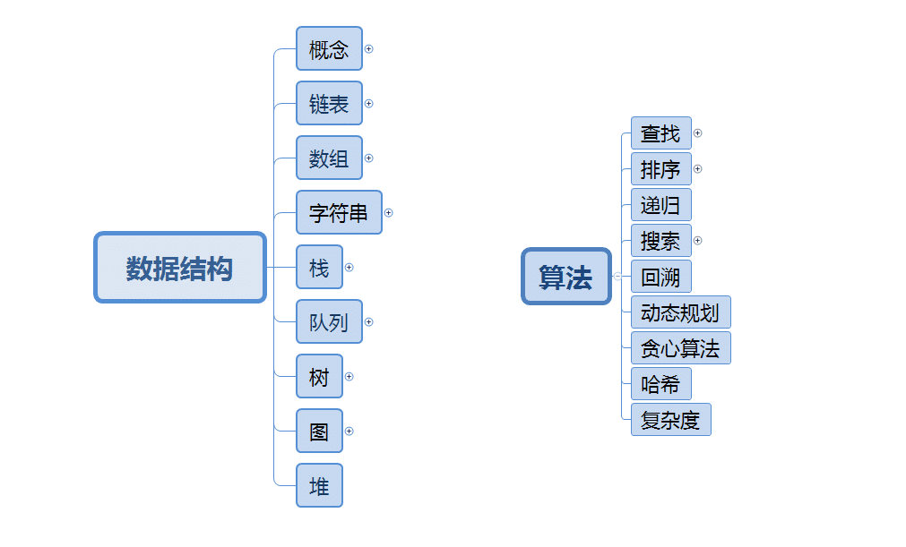
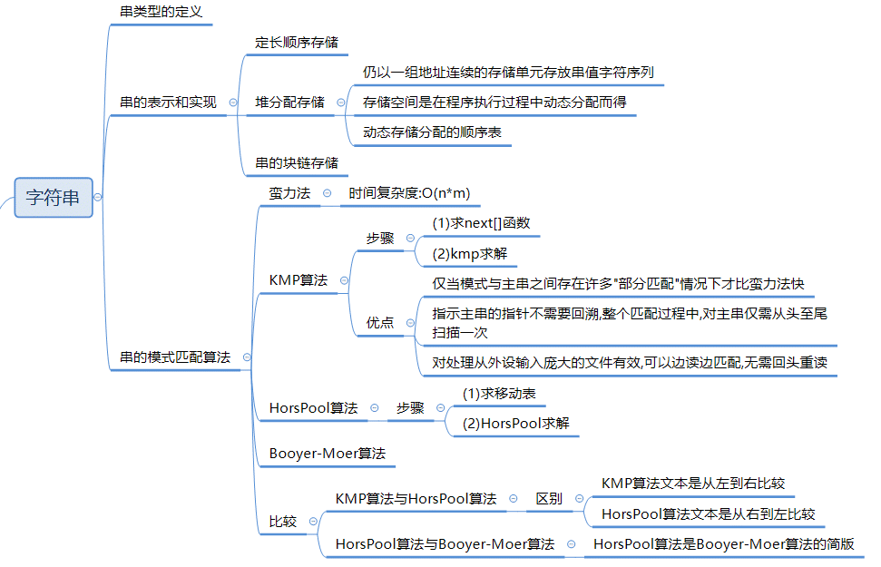

---
category:
  - 数据结构和算法
tag:
  - 数据结构
  - 算法
---
# 数据结构/算法

## 分类

## 基础概念

### 数据结构

* 根据数据结构，可以分为线性表、字符串、树、图。

### 线性表

### 字符串

### 树结构

### 图结构

### 时间复杂度

* 一个算法的时间复杂度反映了程序运行从开始到结束所需要的时间。
* 把算法中基本操作重复执行的次数（频度）作为算法的时间复杂度。
  * 没有循环语句，记作`O(1)`，也称为常数阶。
  * 只有一重循环，则算法的基本操作的执行频度与问题规模n呈线性增大关系，记作`O（n）`，也叫线性阶。

* 常见的时间复杂度有：
  * `O(1)`: Constant Complexity: Constant 常数复杂度：表示算法的执行时间不随输入规模的增长而变化，即执行时间是固定的。例如，访问一个数组的任意一个元素，无论数组的大小是多少，都只需要一步操作。
  * `O(log n)`: Logarithmic Complexity: 对数复杂度：表示算法的执行时间随输入规模呈对数增长。例如，二分查找算法，在每次比较后都能将搜索范围减半，所以执行时间随着输入规模的增大而缩小。
  * `O(n)`: Linear Complexity: 线性时间复杂度：表示算法的执行时间与输入规模成线性关系。例如，遍历一个包含n个元素的数组，需要执行n次操作。
  * `O(n^2)`: N square Complexity 平⽅方：表示算法的执行时间随输入规模的平方增长。例如，嵌套循环遍历一个包含n个元素的数组，总共需要执行n^2次操作。
  * `O(n^3)`: N square Complexity ⽴立⽅方：三层嵌套循环遍历一个包含n个元素的数组，总共需要执行n^2次操作。
    * 对于n层嵌套的循环，时间复杂度的计算方法与三层循环类似。我们需要分析每一层循环的执行次数，并将它们相乘。
  * `O(2^n)`: Exponential Growth 指数
  * `O(n!)`: Factorial 阶乘

### 空间复杂度

* 一个程序的空间复杂度是指运行完一个程序所需内存的大小。
* 利用程序的空间复杂度，可以对程序的运行所需要的内存多少有个预先估计。

* 一个程序执行时除了需要存储空间和存储本身所使用的指令、常数、变量和输入数据外，还需要一些对数据进行操作的工作单元和存储一些为现实计算所需信息的辅助空间。

****

## 参考资料

### [算法通关手册](https://algo.itcharge.cn/)
