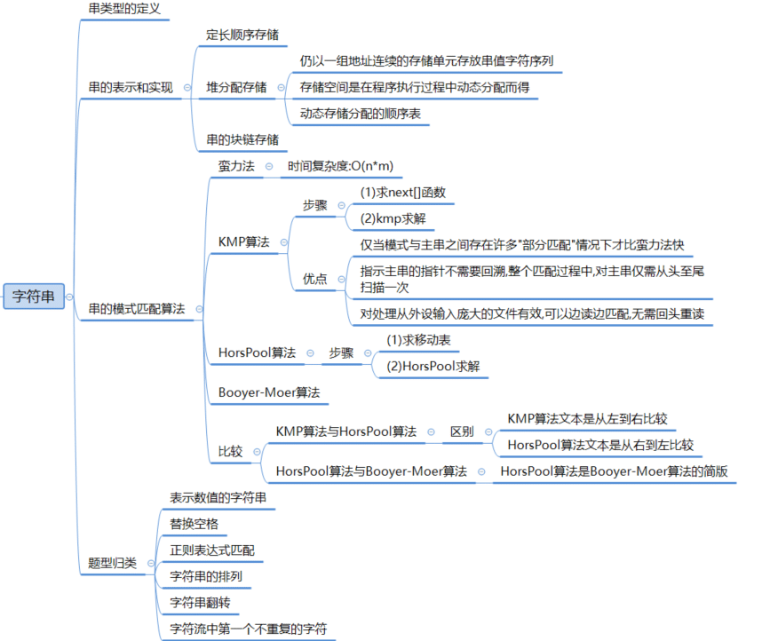
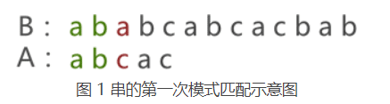
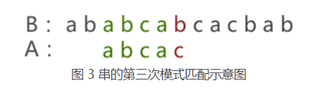
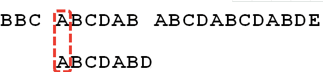
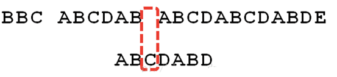
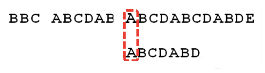
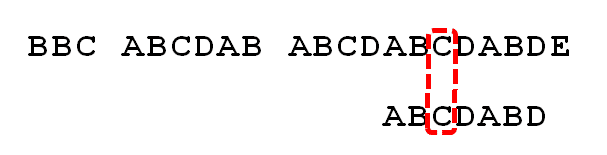
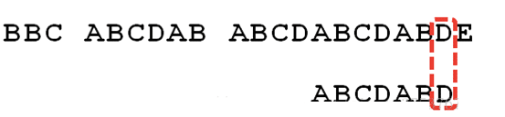
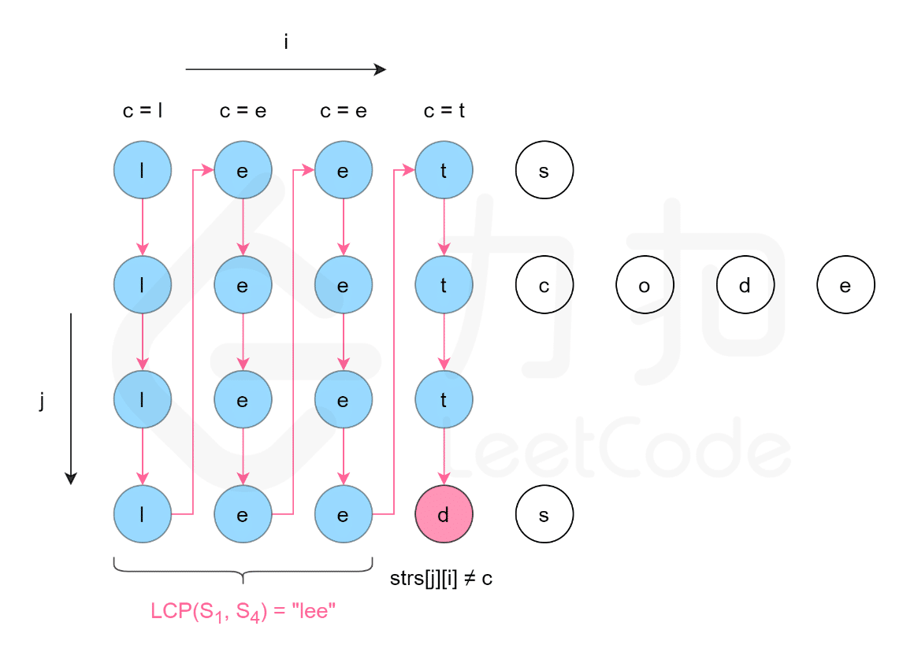

# 字符串




## 定义

* 空串：空串指的是未存储任何字符的串，整个串的长度为 0。

* 空格串：空格串指的是由多个（＞0）空格字符组成的串结构，整个串的长度为包含空格字符的个数。

* 子串和主串：

  ```js
  假设有以下两个串 A 和 B：
  
  A：shujujiegou
  B：shuju
  ```

  在串 A 中可以找到几个连续的字符，它们和串 B 相同。我们可以这样描述它们之间的关系：A 是 B 的主串，B 是 A 的子串。

  * 注意：**子串在主串中的位置，指的是子串首个字符在主串中的位置**。
    * 例如，串 A 为 "shujujiegou"，串 B 为 "jiegou"，通过观察可以判断 A、B 是主串和子串的关系，即在主串 A 中可以找到 B，B 的第一个字符 'j' 是串 A 中的第 6 个字符，因此子串 B 在主串 A 中的位置就是 6。


## [串模式匹配算法](https://leetcode.cn/leetbook/read/array-and-string/cm5e2/)

* 串的模式匹配算法，是一种专门定位子串在主串中位置的方法（方案、思想），整个定位的过程称为模式匹配。
* 此外，在模式匹配的过程中，子串通常又被称为“模式串”。

* 题目：

  > * 给你两个字符串 haystack 和 needle ，请你在 haystack 字符串中找出 needle 字符串的第一个匹配项的下标（下标从 0 开始）。
  > * 如果 needle 不是 haystack 的一部分，则返回  -1 。
  >
  >  
  >
  > * 示例 1：
  >
  >   ```js
  >   输入：haystack = "sadbutsad", needle = "sad"
  >   输出：0
  >   解释："sad" 在下标 0 和 6 处匹配。
  >   第一个匹配项的下标是 0 ，所以返回 0 。
  >   ```
  >
  >   
  >
  > * 示例 2：
  >
  >   ```js
  >   输入：haystack = "leetcode", needle = "leeto"
  >   输出：-1
  >   解释："leeto" 没有在 "leetcode" 中出现，所以返回 -1 。
  >   ```
  >
  >   
  >
  > * 提示：
  >
  >   > 1 <= haystack.length, needle.length <= 104
  >   > haystack 和 needle 仅由小写英文字符组成
  >
  > 

### BF 算法（蛮力法）

* 思路：

* > * 采用 BF 算法定位模式串在主串中的位置，就是简单粗暴的从主串的起始位置开始，不断地将模式串中的字符和主串中的字符进行对比。
  >
  >   * 设置两个指针，分别循环遍历主串和字串，将主串和字串一一对应匹配；
  >
  >     * 如果匹配成功，同时后移一位；
  >     * 如果匹配失败，主串从下个字符开始匹配，字串从头开始匹配；
  >
  >   * 遍历结束，如果字串遍历到末尾，表示匹配成功，返回主串指针位置减去字串长度加1，即为字串的初始位置；否则匹配失败；
  >
  >     
  >
  > * 示例：
  >
  >   * 假设对模式串 A（"abcac"）和主串 B（"ababcabacabab"）进行模式匹配，BF 算法的执行过程如下：	
  >
  >     1) 将模式串 A 与主串 B 的首字符对齐，逐个判断相对的字符是否相等，如
  >
  >     2) 图 1 中，由于模式串 A 与主串 B 的第 3 个字符匹配失败，此时将模式串 A 后移一个字符的位置，采用同样的方法重新匹配，如图 2 所示：
  >
  >        
  >
  >     3) 图 2 中可以看到，两个串依旧匹配失败，模式串 A 继续后移一个字符的位置，如图 3 所示：
  >
  >     4)  图 3 仍然匹配失败，模式串 A 继续向后移动，一直移动至图 4 的位置才匹配成功：
  >
  >        
  >
  >        从图 1 到图 4，模式串 A 与主串 B 共匹配了 6 次才成功，最终定位到模式串 A 位于主串 B 第 6 的位置处，整个模式匹配的过程就称为 BF 算法。
  >
  >   * 示例2：
  >
  > * 时间复杂度：O(n*m)， n为主串长度，m为模式串长度；空间复杂度： O(1);

* 代码:

  ```js
  const BFmate = (str,sub)  => {
      let i=0,j=0;
      while(i< str.length && j<sub.length) {
          if(str[i] === sub[j]) {
              i++;
              j++;
          }else {
  
              i = i-j+1; // 回到 i 的初始位置并前移一位
              j = 0; // 回到初始位置
          }
      }
      //跳出循环有两种可能，i=strlen(str)说明已经遍历完主串，匹配失败；j=strlen(sub),说明模式串遍历完成，在主串中成功匹配
      if(j===sub.length) {// 字串指针走到最后，匹配结束，完成匹配
          return i- sub.length + 1; // 主串位置减去字串位置表示回到珠串匹配成功初始位置
      }
      //运行到此，为 i==strlen(sub) 的情况，模式匹配失败
      return -1;
  }
  ```

  

### KMP（快速匹配算法）

####  KMP匹配过程

> * 在暴力匹配过程中，如果主串和模式串某个字符不匹配，将从模式串的第一个字符和主串的下一个字符开始重新匹配，这种算法时间复杂度则是`O(mn)`；
>
> * KMP算法的核心是利用匹配失败后的信息，尽量减模式串与主串的匹配次数以达到快速匹配的目的。
>
> * 示例：字符串 Str1 = “BBC ABCDAB ABCDABCDABDE”，判断里面是否包含另一个字符串 Str2 = “ABCDABD”：
>
>   * 1、首先，用Str1的第一个字符和Str2的第一个字符去比较，不符合，关键词向后移动一位。
>
>     
>
>     2、重复第一步，还是不符合，再后移。
>
>     
>
>     3、一直重复，直到Str1有一个字符与Str2的第一个字符符合为止。
>
>     
>
>     4、接着比较字符串和搜索词的下一个字符，还是符合。
>
>     
>
>     5、遇到Str1有一个字符与Str2对应的字符不符合。
>
>     
>
>     6、这时候想到的是继续遍历Str1的下一个字符，重复第1步。
>
>     
>
>     7、其实这是很不明智的，因为此时”ABCDAB”已经比较过了，没有必要再做重复的工作，一个基本事实是，当空格与D不匹配时，你其实知道前面六个字符是”ABCDAB”。
>
>     KMP算法的想法是，设法利用这个已知信息，不要把”搜索位置“移回已经比较过的位置，继续把他向后移，这样就提高了效率。
>
>     怎么做到把刚刚重复的步骤省略掉？可以对Str2计算出一张《匹配表》，这张表的产生在后面介绍。
>
>     
>
>     8、已知空格与D不匹配时，前面六个字符”ABCDAB”是匹配的。查表可知，最后一个匹配字符B对应的”部分匹配值”为2，因此我们只需要让模式串Str2的下标移动到对应下标为2的位置，也就是C，此时Str1的下标还是保持不变，在空格处，这样就避免了Str1下标回溯到第6步了，这样就大大减少了Str1的比较次数。
>
>     
>
>     9、因为空格与Ｃ不匹配，搜索词还要继续往后移。这时已匹配的字符串为”AB”，最后一个匹配字符B对应的”部分匹配值”为0。因此我们只需要让模式串Str2的下标移动到对应下标为0的位置，也就是A，此时Str1的下标还是保持不变。
>
>     
>
>     10、因为空格与A不匹配，并且此时并没有匹配的字符，因此只能继续后移一位。
>
>     
>
>     11、然后逐位比较，直到发现C与D不匹配。
>
>     
>
>     12、因为C与D不匹配，这时已匹配的字符串为”ABCDAB”，最后一个匹配字符B对应的”部分匹配值”为2。因此我们只需要让模式串Str2的下标移动到对应下标为2的位置，也就是C，此时Str1的下标还是保持不变。
>
>     
>
>     13、然后逐位比较，直到搜索词的最后一位，发现完全匹配，于是搜索完成。
>
>     


#### KMP的部分匹配表

##### 字符串的前缀和后缀

* 前缀：包含首字母但不包含尾字母的所有子串。
  * 如果字符串A和B，存在A=BS，其中S是任意的非空字符串，那就称B为A的前缀。
  * 例如，”Harry”的前缀包括{”H”, ”Ha”, ”Har”, ”Harr”}，我们把所有前缀组成的集合，称为字符串的前缀集合；
* 后缀：包含尾字母但不包含首字母的所有子串。
  * 后缀A=SB， 其中S是任意的非空字符串，那就称B为A的后缀
  * 例如，”Potter”的后缀包括{”otter”, ”tter”, ”ter”, ”er”, ”r”}，然后把所有后缀组成的集合，称为字符串的后缀集合

##### KMP的部分匹配表

* KMP的部分匹配表：**字符串的前缀集合与后缀集合的交集中最长元素的长度**。

  * > 示例：对于字符串”ababa”，它的前缀集合为{”a”, ”ab”, ”aba”, ”abab”}，它的后缀集合为{”baba”, ”aba”, ”ba”, ”a”}， 两个集合的交集为{”a”, ”aba”}，其中最长的元素为”aba”，长度为3

* 以模式串“ABCAB”为例，逐步获取该模式串的匹配表：

  > - A：	
  >   - 前缀：空；
  >   - 后缀：空；
  >   - 两个集合的交集为空，匹配值为0；
  >
  > - AB：匹配值为0；
  >   - 前缀：{A}；
  >   - 后缀：{B}；
  >   - 两个集合的交集为空，匹配值为0；
  >
  > - ABC：匹配值为0；
  >   - 前缀：{A}、{AB}；
  >   - 后缀：{B}、{BC}；
  >   - 两个集合的交集为空，匹配值为0；
  >
  > - ABCA：匹配值为1;
  >   - 前缀：{A}、{AB}、{ABC}；
  >   - 后缀：{A}、{CA}、{BCA}；
  >   - 两个集合的交集为{A}，最长元素长度为1，匹配值为1；
  >
  > - ABCAB：匹配值为2：
  >
  >   - 前缀：{A}、{AB}、{ABC}、{ABCA}；
  >   - 后缀：{B}、{AB}、{CAB}、{BCAB}；
  >   - 两个集合的交集为{AB}，最长元素长度为2，匹配值为2；
  >
  > - 因此，“ABCAB” 该模式串的匹配表为
  >
  >   
  >
  > - 注意：**模式串中第一个字符对应的 为 0，这是固定不变的。**

##### 部分匹配表算法实现

* 思路：

  > * 构建 next 数组，next[j] 表示**str[j] 字符前面的字符串中最大的公共前后缀的长度**;
  > * **KMP 算法永不回退 模式串 的指针 `j`，而是借助 `next` 数组中储存的信息把 指针 移到正确的位置继续匹配**；
  > * 

* 代码：
  ```js
  function getNext(pattern) {
    const next = new Array(pattern.length);  // 创建一个用于存储next数组的数组
    next[0] = -1;  // 初始化next[0]为-1
    let i = 0;  // i为当前字符的位置
    let j = -1;  // j为当前字符的最长前缀的后缀的位置
  
    while (i < pattern.length - 1) {
      if (j === -1 || pattern[i] === pattern[j]) {
        // 当j为-1（即最长前缀的后缀不存在）或当前字符与最长前缀的后缀相等时
        i++;
        j++;
        next[i] = j;  // 设置next[i]为j
      } else {
        j = next[j];  // 更新j为当前字符的最长前缀的后缀的位置
      }
    }
  
    return next;
  }
  ```
  


##### KMP 算法实现

```js
function kmpSearch(text, pattern) {
  const next = getNext(pattern); // 获取模式字符串的next数组
  let i = 0; // text的索引
  let j = 0; // pattern的索引

  while (i < text.length && j < pattern.length) {
    if (j === -1 || text[i] === pattern[j]) {
      // 当j为-1（即最长前缀的后缀不存在）或当前字符匹配时
      i++;
      j++;
    } else {
      j = next[j]; // 更新j为当前字符的最长前缀的后缀的位置
    }
  }

  if (j === pattern.length) {
    return i - j; // 返回匹配的起始位置
  } else {
    return -1; // 未找到匹配
  }
}

const text = 'ABABDABACDABABCABAB';
const pattern = 'ABABCABAB';
const index = kmpSearch(text, pattern);
console.log(index); // 输出匹配的起始位置
```


## 算法题

### 最长公共前缀

* 题目：

  > * 编写一个函数来查找字符串数组中的最长公共前缀。
  >
  > * 如果不存在公共前缀，返回空字符串 `""`。
  >
  > * 示例：
  >
  >   ```js
  >   输入：strs = ["flower","flow","flight"]
  >   输出："fl"
  >   ```
  >
  >   ```js
  >   输入：strs = ["dog","racecar","car"]
  >   输出：""
  >   解释：输入不存在公共前缀。
  >   ```
  >
  > * **提示：**
  >
  >   - >  `1 <= strs.length <= 200`
  >     >
  >     > `0 <= strs[i].length <= 200`
  >     >
  >     > `strs[i]` 仅由小写英文字母组成

* 解法一：**纵向扫描，逐个单词匹配**

  > * 设定指针 i 指向数组元素，指针 j 指向字符串；
  > * 取数组中第一个字符串的每个字符作为单词 word；
  > * 遍历数组，比较数组中每个字符串对应位置的单词是否等于 word:
  >   * 相等，继续查找下一个字符串的对应位置单词
  >   * 不相等，退出循环
  > * 数组遍历完成后，执行以下操作：
  >   * 重置数组下标，从数组第二个元素开始遍历；
  >   * 字符串单词指针后移一位；
  >   * 拼接单词和公共字符串
  >   * 继续取第一个字符串的每个字符作为单词 word；
  > * 注意：注意边界条件判断；
  > * 
  > * 复杂度：
  >   * 时间复杂度：O(mn)，其中 m是字符串数组中的字符串的平均长度，n 是字符串的数量。最坏情况下，字符串数组中的每个字符串的每个字符都会被比较一次。
  >   * 空间复杂度：O(1)。使用的额外空间复杂度为常数。

  * 代码

    ```js
    /**
     * @param {string[]} strs
     * @return {string}
     */
    var longestCommonPrefix = function(strs) {
        if(strs.length === 0) return ""; // 边界条件：strs为空，返回空
        if(strs.length === 1) return strs[0];// 边界条件：strs长度为1，返回唯一的字符串
        let subStr = "";
        let i=1,j = 0;
        let word = '';
        let flag = true;
        while(flag){
            if(i === strs.length) {
                i=1;
                j++;
                subStr += word;
            }
            word = strs[0][j];
            if(!word) {// 边界条件：空字符串时，退出循环
                flag = false
            }
            if(strs[i][j] === word) {
                i++;
            }else {
                flag = false
            }
        }
        return subStr;
    
    };
    ```

* 解法二：**横向扫描，求解相邻字符串的最长公共前缀**

  > * 假设第一个字符串为最长公共前缀串 prefix；
  >
  > * 依次遍历字符串数组中的每个字符串，对于每个遍历到的字符串：
  >
  >   * 获取当前字符串 strs[i] 和最长公共前缀串 prefix 的 最长公共前缀串;
  >   * 更新最长公共前缀;
  >
  > * 当遍历完所有的字符串以后，即可得到字符串数组中的最长公共前缀
  >
  >   
  >
  > * 复杂度：
  >
  >   * 时间复杂度：O(mn)，其中 m是字符串数组中的字符串的平均长度，n 是字符串的数量。最坏情况下，字符串数组中的每个字符串的每个字符都会被比较一次。
  >   * 空间复杂度：O(1)。使用的额外空间复杂度为常数。
  >
  >   

  * 代码：

    ```js
    var longestCommonPrefix = function(strs) {
    	if(!strs || strs.length ===0) return "";
    	let prefix = strs[0];
        for(let i=1; i< strs.length; i++) {
    		prefix = getLongestCommonPrefix(prefix,strs[i]);
    		if(!prefix) break;
    	}
        return prefix;
    }
    
    var getLongestCommonPrefix = function(prefix, str) {
        let len = Math.min(prefix.length,str.length);
        let i=0;
        while(i<len) {
    		if(prefix[i]===str[i]){
    			i++;
    		}else {
                break;
            }
    	}
        return prefix.slice(0,i);
    }  
    ```

* 解法三：**分治**

  > * 对于问题 LCP(Si⋯Sj)，可以分解成两个子问题 LCP(Si…Smid)与 LCP(Smid+1…Sj)，其中 mid=i+j2。
  >
  > * 递归对两个子问题分别求解，然后对两个子问题的解计算最长公共前缀，即为原问题的解。
  >
  >   

  * 代码

    ```js
    var longestCommonPrefix = function(strs) {
        if(!strs || strs.length==0) return "";
        return splitArray(strs,0,strs.length-1);
    }
    // 拆分数组
    var splitArray = function(strs,start,end) {
    	if(start === end) {
            return strs[start];
    	}else {
            // 注意中间位置要取整
    		let mid = Math.floor((end - start)/2)  + start;
            let left = splitArray(strs,start,mid); // 拆分左侧数组
            let rifht =  splitArray(strs,mid+1,end);// 拆分右侧数组
            return commonPrefix(left,rifht); // 求左右数组字符串最大公共前缀
    	}
    }
    
    var commonPrefix = function(left,right) {
        let len = Math.min(left.length,right.length);
        let i=0;
        while(left[i] === right[i]  && i< len) {
            i++;
        }
        return left.slice(0,i);
    }
    ```

* 解法四：**二分查找**

  > * 最长公共前缀的长度不会超过字符串数组中的最短字符串的长度。
  > * 用 minLength表示字符串数组中的最短字符串的长度，则可以在[0,minLength] 的范围内在第一个字符串上通过二分查找，得到最长公共前缀的长度，最长公共前缀的长度就是查找到的位置 i.
  > * 每次取查找范围的中间值 mid，判断每个字符串的长度为 mid 的前缀是否相同:
  >   * 如果相同则最长公共前缀的长度一定大于或等于 mid;
  >   * 如果不相同则最长公共前缀的长度一定小于 mid;
  >   * 通过上述方式将查找范围缩小一半，直到得到最长公共前缀的长度。
  >
  > 

  * 代码

    ```js
    var longestCommonPrefix = function(strs) {
        if(!strs || strs.length==0) return "";
        let minLength = Infinity;
        // 查找最小长度的字符串长度
        for(let i=0;i<strs.length; i++) {
           	minLength = Math.min(minLength,strs[i].length);
        }
        // 取第一个字符串，从 [0,minLength] 区间查找最长公共前缀的位置
        let low = 0, height = minLength;
        while(low<height) {
            // 取字符串中间位置，二分查找最小长度的字符串长度位置
            let mid = Math.floor((height-low+1)/2) + low;
            if(isCommonPrefix(strs,mid)) { // [0,mid] 是公共前缀串，则说明最长公共前缀的位置在 [mid,minLength]
                low = mid;
            }else {
                height =  mid-1;
            }
        }
        return strs[0].slice(0,low); // 返回第一个字符串截取的最长公共前缀的位置子串
    }
    
    var isCommonPrefix = function(strs,pos) {
    	let prefixStr = strs[0].slice(0,pos);//截取第一个字符串的 [0,pos]位置子串，判断子串是否为公共前缀（注意：不是最长公共前缀）
        // 遍历其他字符串，判断是否 prefixStr 是否为前缀串
        for(let i=1; i< strs.length; i++) {
            let subStr = strs[i].slice(0,pos);
             if(prefixStr != subStr) {
                 return false
             }
        }
        return true
    }
    ```

    

### [最长回文子串](https://leetcode.cn/problems/longest-palindromic-substring/solutions/255195/zui-chang-hui-wen-zi-chuan-by-leetcode-solution/)

* 题目：

  > * 给你一个字符串 s，找到 s 中最长的回文子串。
  >
  > * 如果字符串的反序与原始字符串相同，则该字符串称为回文字符串。
  >
  >  
  >
  > * 示例 1：
  >
  >   ```js
  >   输入：s = "babad"
  >   输出："bab"
  >   解释："aba" 同样是符合题意的答案。
  >   ```
  >
  >   
  >
  > * 示例 2：
  >
  >   ```js
  >   输入：s = "cbbd"
  >   输出："bb"
  >   ```
  >
  >   
  >
  > * 提示：
  >
  > >  1 <= s.length <= 1000
  > > s 仅由数字和英文字母组成

* 解法一：**中心扩展法**

  * 思路

    > * 从每一个位置出发，向两边扩散即可。遇到不是回文的时候结束。
    >
    >   * 举个例子，str=acdbbdaa 我们需要寻找从第一个 b（位置为 333）出发最长回文串为多少。
    >   * 怎么寻找？ 首先往左寻找与当期位置相同的字符，直到遇到不相等为止。
    >   *  然后往右寻找与当期位置相同的字符，直到遇到不相等为止。
    >   *  最后左右双向扩散，直到左和右不相等
    >
    >   
    >
    > * 位置中心有两种情况: 
    >
    >   *  一种是回文子串长度为奇数（如aba，中心是b） 
    >   * 另一种回文子串长度为偶数（如abba，中心是b，b）
    >
    > * 循环遍历字符串 对取到的每个值 都假设他可能成为最后的中心进行判断

  * 代码

    ```js
    /**
     * @param {string} s
     * @return {string}
     */
    var longestPalindrome = function(s) {
            if (s.length<2){
                return s;
            }
            let sub = '';
            for (let i = 0; i < s.length; i++) {
                // 回文子串长度是奇数
                expandAroundCenter(i, i);
                // 回文子串长度是偶数
                expandAroundCenter(i, i + 1);
            }
    
            function expandAroundCenter(left, right) {
                while (left >= 0 && right < s.length && s[left] == s[right]) {
                    left--;
                    right++;
                }
                // 注意此处m,n的值循环完后  是恰好不满足循环条件的时刻
                // 此时m到n的距离为n-m+1，但是mn两个边界不能取 所以应该取m+1到n-1的区间  长度是n-m-1
                // 如果此时回文串比上一个回文串长度大，取较长的回文串
                if (right - left - 1 > sub.length) {
                    // slice也要取[m+1,n-1]这个区间 
                    sub = s.slice(m + 1, n);
                }
            }
            return sub;
    };
    ```

    


### [翻转字符串里的单词](https://leetcode.cn/leetbook/read/array-and-string/crmp5/)

* 题目：

  > * 给你一个字符串 s ，请你反转字符串中 单词 的顺序。
  >
  > * 单词 是由非空格字符组成的字符串。s 中使用至少一个空格将字符串中的 单词 分隔开。
  >
  > * 返回 单词 顺序颠倒且 单词 之间用单个空格连接的结果字符串。
  >
  > * 注意：输入字符串 s中可能会存在前导空格、尾随空格或者单词间的多个空格。返回的结果字符串中，单词间应当仅用单个空格分隔，且不包含任何额外的空格。
  >
  >   
  >
  > * 示例 1：
  >
  >   ```js
  >   输入：s = "the sky is blue"
  >   输出："blue is sky the"
  >   ```
  >
  >   
  >
  > * 示例 2：
  >
  >   ```js
  >   输入：s = "  hello world  "
  >   输出："world hello"
  >   解释：反转后的字符串中不能存在前导空格和尾随空格。
  >   ```
  >
  >   
  >
  > * 示例 3：
  >
  >   ```js
  >   输入：s = "a good   example"
  >   输出："example good a"
  >   解释：如果两个单词间有多余的空格，反转后的字符串需要将单词间的空格减少到仅有一个。
  >   ```
  >
  >   提示：
  >
  >   > 1 <= s.length <= 104
  >   > s 包含英文大小写字母、数字和空格 ' '
  >   > s 中 至少存在一个 单词
  >
  > * 进阶：如果字符串在你使用的编程语言中是一种可变数据类型，请尝试使用 O(1) 额外空间复杂度的 原地 解法。

* 解法一：**使用栈保存单词顺序**

  > * 使用栈保存整个单词顺序，定义单词截取起始点 start；
  > * 遍历字符串，查找空格字符：
  >   * 遇到空格字符，以空格字符为分割点，截取 start 到空格字符前一个位置字符串入栈，start 记录空格字符位置；
  > * 遍历结束，将栈所有单词按顺序出栈，并使用空格拼接；
  > * 注意：
  >   * 遍历到字符串末尾时候，需要判断末尾字符串，截取位置为字符串长度；
  >   * 入栈前需要将字符串去除首尾空格
  > * 时间复杂度：O(n)，空间复杂度：O(n)

  ```js
  /**
   * @param {string} s
   * @return {string}
   */
  var reverseWords = function(s) {
      let str = s.trim();
      let stack = [];
      let start = 0;
      let flipStr = '';
      for(let i=0; i< str.length; i++) {
          if(str[i]== ' ' || i==str.length-1) {
              let end = i==str.length-1? str.length: i//遍历到字符串末尾时候，需要判断末尾字符串，截取位置为字符串长度；
              let subStr = str.slice(start,end).trim();//入栈前需要将字符串去除首尾空格
              if(subStr) {
                  stack.push(subStr);
              }
              start = i;// 记录下一个起始位置
          }
      }
      while(stack.length!==0) {
          flipStr += stack.pop() + ' '
      }
      return flipStr.trim();
  };
  ```


* 解法二：**整体翻转后单个单词翻转**

  > * 去除字符串首尾空格；
  >
  > * 字符串整体翻转；
  >
  > * 遍历字符串再单个单词翻转；
  >
  > * 时间复杂度：O(n)，空间复杂度O(1)
  >
  >   

* 解法三：**使用语言特性**

  > 很多语言对字符串提供了 split（拆分），reverse（翻转）和 join（连接）等方法，因此我们可以简单的调用内置的 API 完成操作：
  >
  > * 使用 split 将字符串按空格分割成字符串数组；
  > * 使用 reverse 将字符串数组进行反转；
  > * 使用 join 方法将字符串数组拼成一个字符串。
  >
  > * **复杂度分析**
  >
  >   - 时间复杂度：O(n)，其中 n为输入字符串的长度。
  >
  >   - 空间复杂度：O(n)，用来存储字符串分割之后的结果。
  >
  > 

  ```js
  var reverseWords = function(s) {
      return s.trim().split(/\s+/).reverse().join(' ');
  };
  ```

  
