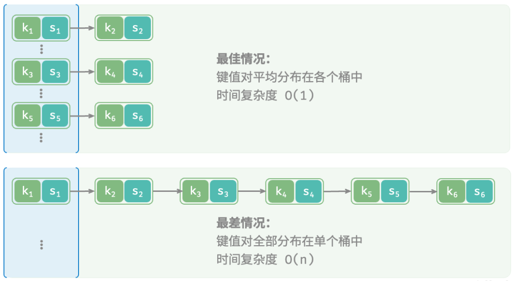

# 哈希表
哈希表（Hash Table）也称为散列表，是一种基于哈希函数（Hashing Function）实现的数据结构，用于存储键值对（key-value pairs）。

哈希函数将键（key）映射为索引（通常称为哈希值或散列值），然后使用该索引在数组中查找或存储值（value）。

## 思想

哈希表的关键思想是使用哈希函数，将键 key 映射到对应表的某个区块中。

可以将算法思想分为两个部分：

- **向哈希表中插入一个关键码值**：哈希函数决定该关键字的对应值应该存放到表中的哪个区块，并将对应值存放到该区块中。
- **在哈希表中搜索一个关键码值**：使用相同的哈希函数从哈希表中查找对应的区块，并在特定的区块搜索该关键字对应的值。

哈希表的原理示例图如下所示：


## 特点

1. **快速访问**：如果哈希函数设计得当且数据分布均匀，哈希表可以在常数时间复杂度（O(1)）内完成查找、插入和删除操作。
2. **无序**：哈希表中的数据是无序的，它们按照哈希值存储，而不是按照键的自然顺序。
3. **动态扩展**：当哈希表中的数据量增加导致冲突（collision）过多时，哈希表可以动态地增加容量（即进行哈希表的扩容），以降低冲突的概率。
4. **空间效率**：哈希表的空间效率取决于哈希函数和负载因子（load factor）。负载因子是哈希表中元素的数量与哈希表大小的比值。较高的负载因子可能导致冲突增加，但可以减少空间浪费；较低的负载因子可以减少冲突，但需要更多的空间。


## **时间复杂度**

- 理想情况下（哈希函数设计得当且数据分布均匀），哈希表的查找、插入和删除操作的时间复杂度都是O(1)。但在实际中，由于冲突的存在，这些操作的时间复杂度可能会增加。在最坏情况下（如所有键的哈希值都相同），时间复杂度可能退化为O(n)，其中n是哈希表中的元素数量。
- 当哈希表进行扩容时，需要重新计算所有元素的哈希值并重新分配位置，这个时间复杂度是O(n)。但扩容操作通常不是频繁发生的，因此平均时间复杂度仍然接近O(1)。

**在哈希表中进行增删查改的时间复杂度都是 𝑂(1)** ，非常高效。

## **空间复杂度**

- 哈希表的空间复杂度是O(n)，其中n是哈希表中的元素数量。这是因为哈希表需要存储所有的键值对。
- 另外，为了处理冲突，哈希表可能会采用链表、红黑树等数据结构来存储具有相同哈希值的元素。这些数据结构会占用额外的空间。但相对于哈希表本身的空间复杂度来说，这些额外空间通常是可以接受的。

注意：以上分析假设哈希函数是确定性的（即对于相同的键总是返回相同的哈希值），并且哈希表的大小是固定的或可以动态调整的。在实际应用中，这些因素可能会影响哈希表的实际性能。


## 哈希表实现

以下以 TypeScript 简单实现：

```typescript
/* 键值对 Number -> String */
class Pair {
    public key: number;
    public val: string;

    constructor(key: number, val: string) {
        this.key = key;
        this.val = val;
    }
}

/* 基于数组实现的哈希表 */
class ArrayHashMap {
    // 桶，用于存储数据
    private readonly buckets: (Pair | null)[];

    constructor() {
        // 初始化数组，包含 100 个桶
        this.buckets = new Array(100).fill(null);
    }

    /* 哈希函数 */
    private hashFunc(key: number): number {
        return key % 100;
    }

    /* 查询操作 */
    public get(key: number): string | null {
        // 第一步：使用哈希函数计算桶的存储 index
        let index = this.hashFunc(key);
        // 第二步：往桶中根据 index 获取数据 
        let pair = this.buckets[index];
        if (pair === null) return null;
        return pair.val;
    }

    /* 添加操作 */
    public set(key: number, val: string) {
        // 使用哈希函数计算桶存储 Index
        let index = this.hashFunc(key);
        this.buckets[index] = new Pair(key, val);
    }

    /* 删除操作 */
    public delete(key: number) {
         // 使用哈希函数计算桶存储 Index
        let index = this.hashFunc(key);
        // 置为 null ，代表删除
        this.buckets[index] = null;
    }

    /* 获取所有键值对 */
    public entries(): (Pair | null)[] {
        let arr: (Pair | null)[] = [];
        for (let i = 0; i < this.buckets.length; i++) {
            if (this.buckets[i]) {
                arr.push(this.buckets[i]);
            }
        }
        return arr;
    }

    /* 获取所有键 */
    public keys(): (number | undefined)[] {
        let arr: (number | undefined)[] = [];
        for (let i = 0; i < this.buckets.length; i++) {
            if (this.buckets[i]) {
                arr.push(this.buckets[i].key);
            }
        }
        return arr;
    }

    /* 获取所有值 */
    public values(): (string | undefined)[] {
        let arr: (string | undefined)[] = [];
        for (let i = 0; i < this.buckets.length; i++) {
            if (this.buckets[i]) {
                arr.push(this.buckets[i].val);
            }
        }
        return arr;
    }

    /* 打印哈希表 */
    public print() {
        let pairSet = this.entries();
        for (const pair of pairSet) {
            console.info(`${pair.key} -> ${pair.val}`);
        }
    }
}
```


## 哈希函数

**哈希函数（Hash Function）**：将哈希表中元素的关键键值映射为元素存储位置的函数。

哈希函数是哈希表中最重要的部分。一般来说，哈希函数会满足以下几个条件：

- 哈希函数应该易于计算，并且尽量使计算出来的索引值均匀分布。
- 哈希函数计算得到的哈希值是一个固定长度的输出值。
- 如果 Hash(key1)≠Hash(key2)，那么 key1、key2 一定不相等。
- 如果 Hash(key1)==Hash(key2)，那么 key1、key2 可能相等，也可能不相等（会发生哈希碰撞）。

在哈希表的实际应用中，关键字的类型除了数字类，还有可能是字符串类型、浮点数类型、大整数类型，甚至还有可能是几种类型的组合。一般我们会将各种类型的关键字先转换为整数类型，再通过哈希函数，将其映射到哈希表中。

### **哈希函数特点**

1. **确定性**：对于相同的输入，哈希函数总是产生相同的输出。这意味着给定相同的数据，哈希函数的输出是确定性的，可以重现和验证。
2. **唯一性**：理论上，不同的输入应该产生不同的哈希值。但在实际应用中，可能会因为哈希函数的设计或数据的特性，导致不同的输入产生相同的哈希值，这种情况称为哈希冲突。然而，好的哈希函数应该尽量减少哈希冲突的可能性。
3. **不可逆性**：从哈希值推导出原始输入是非常困难的，这要求哈希函数必须是单向的。即使知道哈希值，也无法找到与之对应的原始输入。这一特性使得哈希函数在密码学和数据完整性检测中具有重要应用。
4. **高效性**：哈希函数需要在短时间内计算出结果，以便在实际应用中快速处理大量数据。因此，哈希函数的设计通常注重计算效率。
5. **敏感性**：哈希函数对输入数据的微小变化非常敏感，即使是一个字符的改变也会导致哈希值的巨大变化。这种性质称为雪崩效应（Avalanche Effect），它确保了输入数据的细微变化会导致哈希值的显著变化，从而增强了哈希函数的安全性和数据唯一性。
6. **固定输出长度**：无论输入数据的大小如何，哈希函数总是产生固定长度的哈希值。这使得哈希函数适用于需要固定长度标识的场景。

### 哈希函数方法

而关于整数类型的关键字，通常用到的哈希函数方法有：直接定址法、除留余数法、平方取中法、基数转换法、数字分析法、折叠法、随机数法、乘积法、点积法等。

### 常见简单哈希函数

哈希函数的方法有多种，以下是其中几种常见的哈希函数方法，并使用Markdown表示形式进行列举和说明：

#### 1. 直接定址法

**说明**：哈希函数为一次函数，即`H(key) = key` 或 `H(key) = a * key + b`，其中`H(key)`表示关键字为`key`对应的哈希地址，`a`和`b`都为常数。

**举例**：假设有一个从1到100岁的人口数字统计表，其中可以用年龄作为关键字，哈希函数可以取函数自身，即`H(key) = key`。

| 年龄 |  1   |  2   |  3   | ...  |  25  |  26  |  27  | ...  | 100  |
| :--: | :--: | :--: | :--: | :--: | :--: | :--: | :--: | :--: | :--: |
| 人数 | 3000 | 2000 | 5000 | ...  | 1050 | ...  | ...  | ...  | ...  |

#### 2. 数字分析法

**说明**：如果**关键字由多位字符或者数字组成**，就可以考虑抽取其中的2位或者多位作为该关键字对应的哈希地址。在取法上尽量**选择变化较多的位**，避免冲突发生。

**举例**：假设有一组员工ID，形如"EMP001", "EMP002", ...，"EMP999"。由于前三个字符都是"EMP"，且对于哈希地址来说并不重要，我们可以选择抽取后面的三位数字作为哈希地址。

#### 3. 平方取中法

**说明**：对关键字做平方操作，取中间得几位作为哈希地址。

**举例**：假设关键字为123，其平方为15129，取中间的两位或三位数字（如取中间两位为12）作为哈希地址。

#### 4. 折叠法

**说明**：将关键字分割成位数相同的几部分（最后一部分的位数可以不同），然后取这几部分的叠加和（舍去进位）作为哈希地址。此方法适合关键字位数较多的情况。

**举例**：假设关键字为9876543210，可以将其分割为987 654 321 0四部分（最后一部分只有一位），然后叠加求和（987+654+321+0=1962）作为哈希地址。注意这里要舍去进位。

#### 5. 除留余数法

**说明**：若已知整个哈希表的最大长度`m`，可以取一个不大于`m`的数`p`，然后对该关键字`key`做取余运算，即`H(key) = key % p`。如果长度不等，就选用随机数法。

**举例**：假设哈希表的最大长度为1000，我们可以选择一个不大于1000的素数`p`（如997），然后对关键字`key`进行取余运算得到哈希地址。

#### 6. 乘法哈希法

**说明**：将输入乘以一个常数，再取结果的小数部分或整数部分作为哈希值。这种方法能够在一定程度上消除冲突，并且适用于输入数据分布不均匀的情况。

**举例**：假设输入为关键字`key`，我们可以选择一个常数`A`（其值在0到1之间，如0.61803），然后计算`A * key`的小数部分作为哈希值。


### 常见哈希函数

在实际中，我们通常会用一些标准哈希算法，例如 MD5、SHA-1、SHA-2 和 SHA-3 等。它们可以将任意长度的输入数据映射到恒定长度的哈希值。

|       特性       |                             MD5                              |                            SHA-1                             |                            SHA-2                             |                            SHA-3                             |
| :--------------: | :----------------------------------------------------------: | :----------------------------------------------------------: | :----------------------------------------------------------: | :----------------------------------------------------------: |
|   **散列长度**   |                            128位                             |                            160位                             |                  224位、256位、384位、512位                  |                  224位、256位、384位、512位                  |
|    **安全性**    |                 已被广泛认为不安全，存在冲突                 |                 已被广泛认为不安全，存在冲突                 | 比SHA-1更安全，但SHA-224和SHA-256在某些应用中可能被认为不够安全 |              目前认为是**最安全**的哈希算法之一              |
|     **设计**     |                    基于Merkle-Damgård结构                    |                    基于Merkle-Damgård结构                    | 基于Merkle-Damgård结构（SHA-224/256/384/512），但SHA-256b/512b使用不同设计 |             基于海绵函数（Sponge Function）设计              |
|     **速度**     |                              快                              |                             中等                             |                     较慢（与SHA-1相比）                      |             **最慢**（与MD5、SHA-1和SHA-2相比）              |
|     **应用**     | 已被许多系统用于密码存储和数据完整性校验，但不建议用于安全敏感的场景 | 已被广泛用于各种系统，包括TLS/SSL协议和Git版本控制系统，但已逐渐被更安全的算法替代 |      被广泛用于密码存储、数字签名、数据完整性校验等场景      | 越来越被接受为最安全的哈希算法之一，用于密码存储、数字签名等 |
|   **碰撞攻击**   |                       已被发现多个冲突                       |                       已被发现多个冲突                       |            目前未发现实际的冲突攻击，但理论上存在            |                   目前未发现实际的冲突攻击                   |
| **长度扩展攻击** |                    是（易受长度扩展攻击）                    |                    是（易受长度扩展攻击）                    | SHA-256和SHA-512不受长度扩展攻击，但SHA-224和SHA-384可能受影响 |                       不受长度扩展攻击                       |


**键值对的分布情况由哈希函数决定**。回忆哈希函数的计算步骤，先计算哈希值，再对数组长度取模：

```
index = hash(key) % capacity
```

观察以上公式，当哈希表容量 `capacity` 固定时，**哈希算法 `hash()` 决定了输出值**，进而决定了键值对在哈希表中的分布情况。


## 哈希冲突

> **哈希冲突（Hash Collision）**：不同的关键字通过同一个哈希函数可能得到同一哈希地址，即 key1≠key2，而 Hash(key1)==Hash(key2)，这种现象称为哈希冲突。

理想状态下，我们的哈希函数是完美的一对一映射，即一个关键字（key）对应一个值（value），不需要处理冲突。

但是一般情况下，不同的关键字 key 可能对应了同一个值 value，这就发生了哈希冲突。

设计再好的哈希函数也无法完全避免哈希冲突。所以就需要通过一定的方法来解决哈希冲突问题。

常用的哈希冲突解决方法主要是两类：**「开放地址法（Open Addressing）」** 和 **「链地址法（Chaining）」**。

### 哈希冲突解决方法

#### 开放定址法（也称为再散列法）

- 当关键字 `key` 的哈希地址 `p=H(key)` 出现冲突时，以 `p` 为基础，通过某种方式产生另一个哈希地址`p1`，如果`p1`仍然冲突，则继续产生`p2`，直到找出一个不冲突的哈希地址`pi`，将相应元素存入其中。

**冲突探测方法**

##### **线性探测**

**思想：**

冲突发生时，顺序查看表中下一单元，直到找出一个空单元或查遍全表。

**操作：**

性探测采用固定步长的线性搜索来进行探测，其操作方法与普通哈希表有所不同。

- **插入元素**：通过哈希函数计算桶索引，若发现桶内已有元素，则从冲突位置向后线性遍历（步长通常为 1 ），直至找到空桶，将元素插入其中。
- **查找元素**：若发现哈希冲突，则使用相同步长向后进行线性遍历，直到找到对应元素，返回 `value` 即可；如果遇到空桶，说明目标元素不在哈希表中，返回 `None` 。

**缺点：**

**线性探测容易产生“聚集现象”**：具体来说，数组中连续被占用的位置越长，这些连续位置发生哈希冲突的可能性越大，从而进一步促使该位置的聚堆生长，形成恶性循环，最终导致增删查改操作效率劣化。

**实现：**

首先需要定义一个哈希表类，该类将包含一个用于存储元素的数组，以及一个哈希函数用于将键映射到数组索引。

当发生哈希冲突时，线性探测法将按顺序检查数组的下一个位置，直到找到一个空位置或到达数组的末尾并回到开始。

简单的实现不考虑负载因子或动态调整哈希表大小（resize）。在真实的哈希表实现中，当元素数量接近数组容量时，通常会进行 resize 操作以维护性能。

此外，这个实现也没有处理可能的哈希冲突极端情况（如所有键都哈希到同一个索引），这可能导致性能下降。在真实世界的应用中，需要更加复杂的策略来处理这些问题。

使用 TypeScript 实现：

```typescript
class HashTable<K extends string | number, V> {  
    // 用于存储键值对的数组，数组buckets[index][0] 存储 key，buckets[index][1] 存储 value
    private buckets: Array<[K, V] | null>;  
    // 哈希函数，用于将键映射到数组索引  
    private hashFunction: (key: K) => number;  
    // 数组大小  
    private capacity: number;  
  
    // 构造函数  
    constructor(capacity: number, hashFunction: (key: K) => number) {  
        this.capacity = capacity;  
        // 初始化数组，所有位置均为 null  
        this.buckets = new Array(capacity).fill(null);  
        this.hashFunction = hashFunction;  
    }  
  
    // 获取哈希索引  
    private getIndex(key: K): number {  
        // 调用哈希函数，然后对数组长度取模，以确保索引在数组范围内  
        return this.hashFunction(key) % this.capacity;  
    }  
  
    // 插入键值对  
    put(key: K, value: V): void {  
        // 获取初始哈希索引  
        let index = this.getIndex(key);  
  
        // 线性探测直到找到空位置或找到键的现有位置  
        while (this.buckets[index] !== null) {  
            // 如果找到了相同的键，则更新其值  
            if (this.buckets[index][0] === key) {  
                this.buckets[index][1] = value;  
                return;  
            }  
            // 否则，移动到下一个位置  
            index = (index + 1) % this.capacity; // 回到数组开始如果到达末尾  
        }  
  
        // 结束循环后，表示线性探测到空位置，在空位置插入新的键值对  
        this.buckets[index] = [key, value];  
    }  
  
    // 获取键的值  
    get(key: K): V | undefined {  
        // 获取初始哈希索引  
        let index = this.getIndex(key);  
  
        // 线性探测直到找到键的现有位置或空位置  
        while (this.buckets[index] !== null) {  
            // 如果找到了相同的键，则返回其值  
            if (this.buckets[index][0] === key) {  
                return this.buckets[index][1];  
            }  
            // 否则，移动到下一个位置  
            index = (index + 1) % this.capacity; // 回到数组开始如果到达末尾  
        }  
  
        // 结束循环后，表示线性探测没有找到键，则返回 undefined  
        return undefined;  
    }  
  
    // 其他方法，如删除、resize 等可以在此基础上添加  
}  
  
// 示例哈希函数（简单版本）  
function simpleHash(key: string | number): number {  
    let hash = 0;  
    if (typeof key === 'string') {  
        for (let i = 0; i < key.length; i++) {  
            hash = (hash << 5) - hash + key.charCodeAt(i);  
            hash |= 0; // 转换为 32 位整数  
        }  
    } else {  
        hash = key;  
    }  
    return hash;  
}  
  
// 使用示例  
const hashTable = new HashTable<string, number>(10, simpleHash);  
hashTable.put('apple', 1);  
hashTable.put('banana', 2);  
hashTable.put('carrot', 3);  
console.log(hashTable.get('apple')); // 输出: 1  
console.log(hashTable.get('carrot')); // 输出: 3
```


##### **二次探测（平方探测法）**

冲突发生时，在表的左右进行跳跃式探测，减少线性探测的堆积问题。

##### **再哈希法**

同时构造多个不同的哈希函数，等发生哈希冲突时就使用第二个、第三个等其他的哈希函数计算地址，直到不发生冲突为止。

**示例：**

例如，在长度为 11  的哈希表中已经填有关键字分别为 28 、49 、18 的记录（哈希函数为 Hash(key)=key mod  11）。现在将插入关键字为 38  的新纪录。根据哈希函数得到的哈希地址为 5 ，产生冲突。接下来分别使用这三种冲突解决方法处理冲突:

- 使用线性探测法：得到下一个地址 H(1)=(5+1)mod  11=6 ，仍然冲突；继续求出 H(2)=(5+2)mod  11=7 ，仍然冲突；继续求出 H(3)=(5+3)mod  11=8 ，8 对应的地址为空，处理冲突过程结束，记录填入哈希表中序号为 8 的位置。
- 使用二次探测法：得到下一个地址 H(1)=(5+1×1)mod  11=6，仍然冲突；继续求出 H(2)=(5−1×1)mod  11=4，4 对应的地址为空，处理冲突过程结束，记录填入哈希表中序号为 4 的位置。
- 使用伪随机数序列：假设伪随机数为 9，则得到下一个地址 H(1)=(9+5)mod  11=3，3 对应的地址为空，处理冲突过程结束，记录填入哈希表中序号为 3 的位置。

使用这三种方法处理冲突的结果如下图所示：


#### 链地址法（也称为拉链法）

- 在哈希表的每个位置上设置一个链表，当发生冲突时，将元素插入到对应位置的链表中。
- 这种方法能够处理大规模的数据集，但对内存消耗较大。

**过程**：

我们假设哈希函数产生的哈希地址区间为 [0,*m*−1]，哈希表的表长为 m 。则可以将哈希表定义为一个有 m 个头节点组成的链表指针数组 T 。

- **插入操作**： 
  - 只需要通过哈希函数 Hash(key) 计算出对应的哈希地址 i ，然后将其以链表节点的形式插入到以 T[i] 为头节点的单链表中。在链表中插入位置可以在表头或表尾，也可以在中间。如果每次插入位置为表头，则插入操作的时间复杂度为 O(1) 。
- **查询操作**：
  - 只需要通过哈希函数 Hash(key) 计算出对应的哈希地址 i ，然后将对应位置上的链表整个扫描一遍，比较链表中每个链节点的键值与查询的键值是否一致。
  - 查询操作的时间复杂度跟链表的长度 k  成正比，也就是 O(k) 。对于哈希地址比较均匀的哈希函数来说，理论上讲，k=n / m ，其中 n  为关键字的个数，m  为哈希表的表长。
  - 链式地址哈希表，理想情况下键值对均匀分布在各个桶中，达到最佳查询效率；最差情况下所有键值对都存储到同一个桶中，时间复杂度退化至 𝑂(𝑛) 。
  - 
- **删除元素**：根据哈希函数的结果访问链表头部，接着遍历链表以查找目标节点并将其删除。

链式地址存在以下局限性。

- **占用空间增大**：链表包含节点指针，它相比数组更加耗费内存空间。
- **查询效率降低**：因为需要线性遍历链表来查找对应元素。

**示例：**

举个例子来说明如何使用链地址法处理冲突。假设现在要存入的关键字集合 keys=[88,60,65,69,90,39,07,06,14,44,52,70,21,45,19,32] 。再假定哈希函数为 Hash(key)=key mod  13 ，哈希表的表长 m=13 ，哈希地址范围为 [0,*m*−1]。将这些关键字使用链地址法处理冲突，并按顺序加入哈希表中（图示为插入链表表尾位置），最终得到的哈希表如下图所示。


##### **链地址法实现**

实现一个基于链式地址（也称为分离链接法或开放寻址法的链表版本）的哈希表涉及两个主要部分：哈希函数和链表数组。

然而，传统的链式地址实际上是指将哈希冲突的键值对存储在链表中的方法，而不是在数组中直接进行开放寻址。我们可以模拟一个数组，其中每个索引位置都持有一个链表来处理哈希冲突。

使用 TypeScript 实现：

* 实现链表节
* 实现哈希表（包含：哈希值存储、哈希值获取）
* 实现哈希函数，用于计算哈希表存储的 key 值。 

```typescript
// 链表节点类  
class Node<K, V> {  
    key: K; // 键  
    value: V; // 值  
    next: Node<K, V> | null; // 指向下一个节点的指针  
  
    // 构造函数，用于创建新的链表节点  
    constructor(key: K, value: V, next: Node<K, V> | null = null) {  
        this.key = key;  
        this.value = value;  
        this.next = next;  
    }  
}  
  
// 哈希表类  
class HashTable<K extends string | number, V> {  
    // 存储链表头部的数组（桶）  
    private buckets: Array<Node<K, V> | null>;  
    // 哈希函数，用于将键映射到数组索引  
    private hashFunction: (key: K) => number;  
  
    // 构造函数，初始化哈希表  
    constructor(size: number, hashFunction: (key: K) => number) {  
        // 初始化桶数组，每个位置都是 null（没有链表）  
        this.buckets = new Array(size).fill(null);  
        this.hashFunction = hashFunction;  
    }  
  
    // 向哈希表中插入键值对  
    put(key: K, value: V): void {  
        // 计算键的哈希值，并转换为数组索引  
        const index = this.hashFunction(key) % this.buckets.length;  
        // 获取指定索引处的链表头部节点  
        let currentNode = this.buckets[index];  
  
        // 如果该索引处没有链表（即空桶）  
        if (!currentNode) {  
            // 创建一个新节点，并作为链表的头部  
            this.buckets[index] = new Node(key, value);  
        } else {  
            // 遍历链表，查找是否存在相同的键  
            let prevNode = null; // 前一个节点，用于在需要时更新指针  
            while (currentNode) {  
                // 如果找到了相同的键，则更新其值并返回  
                if (currentNode.key === key) {  
                    currentNode.value = value;  
                    return;  
                }  
                // 更新前一个节点  
                prevNode = currentNode;  
                // 移动到下一个节点  
                currentNode = currentNode.next;  
            }  
  
            // 如果链表遍历完仍未找到相同的键，则在链表末尾添加新节点  
            prevNode!.next = new Node(key, value);  
        }  
    }  
  
    // 从哈希表中检索键对应的值  
    get(key: K): V | undefined {  
        // 计算键的哈希值，并转换为数组索引  
        const index = this.hashFunction(key) % this.buckets.length;  
        // 获取指定索引处的链表头部节点  
        let currentNode = this.buckets[index];  
  
        // 遍历链表，查找是否存在相同的键  
        while (currentNode) {  
            if (currentNode.key === key) {  
                // 如果找到了相同的键，则返回其值  
                return currentNode.value;  
            }  
            // 移动到下一个节点  
            currentNode = currentNode.next;  
        }  
  
        // 如果链表遍历完仍未找到相同的键，则返回 undefined  
        return undefined;  
    }  
  
    // 其他方法，如 remove、size 等...（这里省略）  
}  
  
// 示例哈希函数（简单版本，仅用于演示），用于计算哈希表的存储 Key 
function simpleHash(key: string | number): number {  
    let hash = 0;  
    if (typeof key === 'string') {  
        // 如果键是字符串，则遍历其每个字符并计算哈希值  
        for (let i = 0; i < key.length; i++) {  
            hash = (hash << 5) - hash + key.charCodeAt(i);  
            hash |= 0; // 转换为 32 位整数  
        }  
    } else {  
        // 如果键是数字，则直接使用其值作为哈希值（这里可能需要根据具体需求进行调整）  
        hash = key;  
    }  
    return hash;  
}  
  
// 使用示例  
// 创建哈希表，初始化参数为：哈希表大小，哈希函数
const hashTable = new HashTable(10, simpleHash);  
hashTable.put('apple', 'fruit');  
hashTable.put('banana', 'fruit');  
hashTable.put('carrot', 'vegetable');  
console.log(hashTable.get('apple')); // 输出: fruit  
console.log(hashTable.get('carrot')); // 输出: vegetable
```


## 编程题

| 题号          | 标题                                                         | 标签                                               | 难度 | 完成 |
| :------------ | :----------------------------------------------------------- | :------------------------------------------------- | :--- | ---- |
| 0705          | [设计哈希集合](https://leetcode.cn/problems/design-hashset/) | 设计、数组、哈希表、链表、哈希函数                 | 简单 | ✔    |
| 0706          | [设计哈希映射](https://leetcode.cn/problems/design-hashmap/) | 设计、数组、哈希表、链表、哈希函数                 | 简单 | ✔    |
| 0217          | [存在重复元素](https://leetcode.cn/problems/contains-duplicate/) | 数组、哈希表、排序                                 | 简单 | ✔    |
| 0219          | [存在重复元素 II](https://leetcode.cn/problems/contains-duplicate-ii/) | 数组、哈希表、滑动窗口                             | 简单 | ✔    |
| 0220          | [存在重复元素 III](https://leetcode.cn/problems/contains-duplicate-iii/) | 数组、桶排序、有序集合、排序、滑动窗口             | 困难 | ✔    |
| 1941          | [检查是否所有字符出现次数相同](https://leetcode.cn/problems/check-if-all-characters-have-equal-number-of-occurrences/) | 哈希表、字符串、计数                               | 简单 | ✔    |
| 0136          | [只出现一次的数字](https://leetcode.cn/problems/single-number/) | 位运算、数组                                       | 简单 | ❌    |
| 0383          | [赎金信](https://leetcode.cn/problems/ransom-note/)          | 哈希表、字符串、计数                               | 简单 | ❌    |
| 0349          | [两个数组的交集](https://leetcode.cn/problems/intersection-of-two-arrays/) | 数组、哈希表、双指针、二分查找、排序               | 简单 | ❌    |
| 0350          | [两个数组的交集 II](https://leetcode.cn/problems/intersection-of-two-arrays-ii/) | 数组、哈希表、双指针、二分查找、排序               | 简单 | ❌    |
| 0036          | [有效的数独](https://leetcode.cn/problems/valid-sudoku/)     | 数组、哈希表、矩阵                                 | 中等 | ❌    |
| 0001          | [两数之和](https://leetcode.cn/problems/two-sum/)            | 数组、哈希表                                       | 简单 | ❌    |
| 0015          | [三数之和](https://leetcode.cn/problems/3sum/)               | 数组、双指针、排序                                 | 中等 | ❌    |
| 0018          | [四数之和](https://leetcode.cn/problems/4sum/)               | 数组、双指针、排序                                 | 中等 | ❌    |
| 0454          | [四数相加 II](https://leetcode.cn/problems/4sum-ii/)         | 数组、哈希表                                       | 中等 | ❌    |
| 0041          | [缺失的第一个正数](https://leetcode.cn/problems/first-missing-positive/) | 数组、哈希表                                       | 困难 | ❌    |
| 0128          | [最长连续序列](https://leetcode.cn/problems/longest-consecutive-sequence/) | 并查集、数组、哈希表                               | 中等 | ❌    |
| 0202          | [快乐数](https://leetcode.cn/problems/happy-number/)         | 哈希表、数学、双指针                               | 简单 | ❌    |
| 0242          | [有效的字母异位词](https://leetcode.cn/problems/valid-anagram/) | 哈希表、字符串、排序                               | 简单 | ❌    |
| 0205          | [同构字符串](https://leetcode.cn/problems/isomorphic-strings/) | 哈希表、字符串                                     | 简单 | ❌    |
| 0442          | [数组中重复的数据](https://leetcode.cn/problems/find-all-duplicates-in-an-array/) | 数组、哈希表                                       | 中等 | ❌    |
| 剑指 Offer 61 | [扑克牌中的顺子](https://leetcode.cn/problems/bu-ke-pai-zhong-de-shun-zi-lcof/) | 数组、排序                                         | 简单 | ❌    |
| 0268          | [丢失的数字](https://leetcode.cn/problems/missing-number/)   | 位运算、数组、哈希表、数学、二分查找、排序         | 简单 | ❌    |
| 剑指 Offer 03 | [数组中重复的数字](https://leetcode.cn/problems/shu-zu-zhong-zhong-fu-de-shu-zi-lcof/) | 数组、哈希表、排序                                 | 简单 | ❌    |
| 0451          | [根据字符出现频率排序](https://leetcode.cn/problems/sort-characters-by-frequency/) | 哈希表、字符串、桶排序、计数、排序、堆（优先队列） | 中等 | ❌    |
| 0049          | [字母异位词分组](https://leetcode.cn/problems/group-anagrams/) | 数组、哈希表、字符串、排序                         | 中等 | ❌    |
| 0599          | [两个列表的最小索引总和](https://leetcode.cn/problems/minimum-index-sum-of-two-lists/) | 数组、哈希表、字符串                               | 简单 | ❌    |
| 0387          | [字符串中的第一个唯一字符](https://leetcode.cn/problems/first-unique-character-in-a-string/) | 队列、哈希表、字符串、计数                         | 简单 | ❌    |
| 0447          | [回旋镖的数量](https://leetcode.cn/problems/number-of-boomerangs/) | 数组、哈希表、数学                                 | 中等 | ❌    |
| 0149          | [直线上最多的点数](https://leetcode.cn/problems/max-points-on-a-line/) | 几何、数组、哈希表、数学                           | 困难 | ❌    |
| 0359          | [日志速率限制器](https://leetcode.cn/problems/logger-rate-limiter/) | 设计、哈希表                                       | 简单 | ❌    |
| 0811          | [子域名访问计数](https://leetcode.cn/problems/subdomain-visit-count/) | 数组、哈希表、字符串、计数                         | 中等 | ❌    |

### [设计哈希集合](https://leetcode.cn/problems/design-hashset/description/)

#### **题目**

不使用任何内建的哈希表库设计一个哈希集合（HashSet）。

实现 `MyHashSet` 类：

- `void add(key)` 向哈希集合中插入值 `key` 。
- `bool contains(key)` 返回哈希集合中是否存在这个值 `key` 。
- `void remove(key)` 将给定值 `key` 从哈希集合中删除。如果哈希集合中没有这个值，什么也不做。


**示例：**

```
输入：
["MyHashSet", "add", "add", "contains", "contains", "add", "contains", "remove", "contains"]
[[], [1], [2], [1], [3], [2], [2], [2], [2]]
输出：
[null, null, null, true, false, null, true, null, false]

解释：
MyHashSet myHashSet = new MyHashSet();
myHashSet.add(1);      // set = [1]
myHashSet.add(2);      // set = [1, 2]
myHashSet.contains(1); // 返回 True
myHashSet.contains(3); // 返回 False ，（未找到）
myHashSet.add(2);      // set = [1, 2]
myHashSet.contains(2); // 返回 True
myHashSet.remove(2);   // set = [1]
myHashSet.contains(2); // 返回 False ，（已移除）
```


#### 解题

```typescript
class MyHashSet {
    private sets: Set<number>
    constructor() {
        this.sets = new Set<number>()
    }

    add(key: number): void {
        if (this.sets.has(key)) {
            return
        }
        this.sets.add(key)
    }

    remove(key: number): void {
        if (this.sets.has(key)) {
            this.sets.delete(key)
        }
    }

    contains(key: number): boolean {
        return this.sets.has(key)
    }
}
```

> 使用集合 Set 能够创建唯一的值


### 设计哈希映射

#### **题目**

不使用任何内建的哈希表库设计一个哈希映射（HashMap）。

实现 `MyHashMap` 类：

- `MyHashMap()` 用空映射初始化对象
- `void put(int key, int value)` 向 HashMap 插入一个键值对 `(key, value)` 。如果 `key` 已经存在于映射中，则更新其对应的值 `value` 。
- `int get(int key)` 返回特定的 `key` 所映射的 `value` ；如果映射中不包含 `key` 的映射，返回 `-1` 。
- `void remove(key)` 如果映射中存在 `key` 的映射，则移除 `key` 和它所对应的 `value` 。

 

**示例：**

```shell
输入：
["MyHashMap", "put", "put", "get", "get", "put", "get", "remove", "get"]
[[], [1, 1], [2, 2], [1], [3], [2, 1], [2], [2], [2]]
输出：
[null, null, null, 1, -1, null, 1, null, -1]

解释：
MyHashMap myHashMap = new MyHashMap();
myHashMap.put(1, 1); // myHashMap 现在为 [[1,1]]
myHashMap.put(2, 2); // myHashMap 现在为 [[1,1], [2,2]]
myHashMap.get(1);    // 返回 1 ，myHashMap 现在为 [[1,1], [2,2]]
myHashMap.get(3);    // 返回 -1（未找到），myHashMap 现在为 [[1,1], [2,2]]
myHashMap.put(2, 1); // myHashMap 现在为 [[1,1], [2,1]]（更新已有的值）
myHashMap.get(2);    // 返回 1 ，myHashMap 现在为 [[1,1], [2,1]]
myHashMap.remove(2); // 删除键为 2 的数据，myHashMap 现在为 [[1,1]]
myHashMap.get(2);    // 返回 -1（未找到），myHashMap 现在为 [[1,1]]
```


#### 解题

```typescript
class MyHashMap {
    private map: Map<number, number>
    constructor() {
        this.map = new Map<number, number>
    }

    put(key: number, value: number): void {
        this.map.set(key, value)
    }

    get(key: number): number {
        const value = this.map.get(key)
        if (value === undefined) {
            return -1
        }
        return value
    }

    remove(key: number): void {
        this.map.delete(key)
    }
}
```


### 存在重复元素 (217)

#### 题目

给你一个整数数组 `nums` 。如果任一值在数组中出现 **至少两次** ，返回 `true` ；如果数组中每个元素互不相同，返回 `false` 。


**示例 1：**

```
输入：nums = [1,2,3,1]
输出：true
```

**示例 2：**

```
输入：nums = [1,2,3,4]
输出：false
```

**示例 3：**

```
输入：nums = [1,1,1,3,3,4,3,2,4,2]
输出：true
```


#### 解题

```typescript
function containsDuplicate(nums: number[]): boolean {
    let set = new Set(nums)
    return set.size != nums.length
};
```


### 存在重复元素 (219)

#### 题目

给你一个整数数组 `nums` 和一个整数 `k` ，判断数组中是否存在两个 **不同的索引** `i` 和 `j` ，满足 `nums[i] == nums[j]` 且 `abs(i - j) <= k` 。如果存在，返回 `true` ；否则，返回 `false` 。

 

**示例 1：**

```
输入：nums = [1,2,3,1], k = 3
输出：true
```

**示例 2：**

```
输入：nums = [1,0,1,1], k = 1
输出：true
```

**示例 3：**

```
输入：nums = [1,2,3,1,2,3], k = 2
输出：false
```


#### 解法一：遍历

```typescript
function containsNearbyDuplicate(nums: number[], k: number): boolean {
    // 边界情况下无需遍历
    if (nums.length <= 1 || k === 0) return false
    // 注意：不存在重复元素情况下也无需遍历
    let set = new Set(nums)
    if (set.size === nums.length) return false
    for (let i = 0; i < nums.length; i++) {
        for (let j = i + 1; j < nums.length; j++) {
            if (nums[i] === nums[j] && Math.abs(i - j) <= k) {
                return true
            }
        }
    }
    return false
};
```

#### 解法二：哈希表

**思路**

使用哈希表记录每个元素的最大下标。

从左到右遍历数组 nums，当遍历到下标 i 时，进行如下操作：

如果哈希表中已经存在和 nums[i]  相等的元素且该元素在哈希表中记录的下标 j 满足 i−j≤k ，返回 true ；

将 nums[i] 和下标 i  存入哈希表，此时 i  是 nums[i]  的最大下标。

上述两步操作的顺序不能改变，因为当遍历到下标 i  时，只能在下标 i 之前的元素中寻找与当前元素相等的元素及该元素的最大下标。

当遍历结束时，如果没有遇到两个相等元素的下标差的绝对值不超过 k ，返回 false 。

**代码**

```javascript
var containsNearbyDuplicate = function(nums, k) {
    // 使用 map 存储唯一的元素
    const map = new Map();
    const length = nums.length;
    // 遍历元素并判断是否存在元素
    for (let i = 0; i < length; i++) {
        const num = nums[i];
        // map 中存在元素，则计算当前下标和元素的下标值差值是否小于等于 k
        if (map.has(num) && i - map.get(num) <= k) {
            return true;
        }
        // 记录新的元素和下标
        map.set(num, i);
    }
    return false;
};
```

复杂度分析

时间复杂度：O(n) ，其中 n 是数组 nums 的长度。需要遍历数组一次，对于每个元素，哈希表的操作时间都是 O(1) 。

空间复杂度：O(n) ，其中 n  是数组 nums 的长度。需要使用哈希表记录每个元素的最大下标，哈希表中的元素个数不会超过 n 。

#### 解法三：滑动窗口

**思路：**

考虑数组 nums 中的每个长度不超过 k+1 的滑动窗口，同一个滑动窗口中的任意两个下标差的绝对值不超过 k 。

如果存在一个滑动窗口，其中有重复元素，则存在两个不同的下标 i 和 j 满足 nums[i]=nums[j]  且 ∣i−j∣≤k 。

如果所有滑动窗口中都没有重复元素，则不存在符合要求的下标。因此，只要遍历每个滑动窗口，判断滑动窗口中是否有重复元素即可。

如果一个滑动窗口的结束下标是 i ，则该滑动窗口的开始下标是 max⁡(0,i−k) 。可以使用哈希集合存储滑动窗口中的元素。从左到右遍历数组 nums ，当遍历到下标 i 时，具体操作如下：

如果 i>k ，则下标 i−k−1  处的元素被移出滑动窗口，因此将 nums[i−k−1] 从哈希集合中删除；

判断 nums[i] 是否在哈希集合中，如果在哈希集合中则在同一个滑动窗口中有重复元素，返回 true ，如果不在哈希集合中则将其加入哈希集合。

当遍历结束时，如果所有滑动窗口中都没有重复元素，返回 false 。

**代码**

```js
var containsNearbyDuplicate = function(nums, k) {
    // 使用 set 集合构造一个长度不超过 k 的哈希表
    const set = new Set();
    const length = nums.length;
    // 遍历数组长度
    for (let i = 0; i < length; i++) {
        // 如果遍历下标超出滑动窗口长度，则将滑动窗口第一个元素删除
        if (i > k) {
            set.delete(nums[i - k - 1]);
        }
        // 当滑动窗口后移动时，判断新进入窗口的元素是否已经存在
        if (set.has(nums[i])) {
            return true;
        }
        // 窗口后移动
        set.add(nums[i])
    }
    return false;
};
```

**复杂度分析**

时间复杂度：O(n) ，其中 n  是数组 nums 的长度。需要遍历数组一次，对于每个元素，哈希集合的操作时间都是 O(1) 。

空间复杂度：O(k) ，其中 k  是判断重复元素时允许的下标差的绝对值的最大值。需要使用哈希集合存储滑动窗口中的元素，任意时刻滑动窗口中的元素个数最多为 k+1 个。

### 存在重复元素 (220) 

#### 题目

给你一个整数数组 `nums` 和两个整数 `indexDiff` 和 `valueDiff` 。

找出满足下述条件的下标对 `(i, j)`：

- `i != j`,
- `abs(i - j) <= indexDiff`
- `abs(nums[i] - nums[j]) <= valueDiff`

如果存在，返回 `true` *；*否则，返回 `false` 。

 

**示例 1：**

```
输入：nums = [1,2,3,1], indexDiff = 3, valueDiff = 0
输出：true
解释：可以找出 (i, j) = (0, 3) 。
满足下述 3 个条件：
i != j --> 0 != 3
abs(i - j) <= indexDiff --> abs(0 - 3) <= 3
abs(nums[i] - nums[j]) <= valueDiff --> abs(1 - 1) <= 0
```

**示例 2：**

```
输入：nums = [1,5,9,1,5,9], indexDiff = 2, valueDiff = 3
输出：false
解释：尝试所有可能的下标对 (i, j) ，均无法满足这 3 个条件，因此返回 false 。
```


#### 解法一：暴力

最简单但效率最低的解法是暴力遍历所有可能的下标对 `(i, j)`，然后检查是否满足条件。但这种方法在数组较大时会非常慢，因为时间复杂度是 O(n^2)，其中 n 是数组的长度。

JavaScript 代码实现：

```javascript
function containsNearbyAlmostDuplicate(nums, indexDiff, valueDiff) {  
    for (let i = 0; i < nums.length; i++) {  
        for (let j = 0; j < nums.length; j++) {  
            if (i !== j && Math.abs(i - j) <= indexDiff && Math.abs(nums[i] - nums[j]) <= valueDiff) {  
                return true;  
            }  
        }  
    }  
    return false;  
}
```

#### 解法二：使用哈希表（Map）

**解题思路**

为了优化性能，我们可以使用一个哈希表（在 JavaScript 中可以使用 `Map`）来存储数组元素及其索引。我们遍历数组，对于每个元素 `nums[i]`，我们检查哈希表中是否存在一个元素 `nums[j]` 满足 `abs(nums[i] - nums[j]) <= valueDiff`，并且 `abs(i - j) <= indexDiff`。但这里有个小技巧，我们不需要直接比较 `nums[i]` 和 `nums[j]`，而是比较 `nums[i]` 和一个范围 `[nums[i] - valueDiff, nums[i] + valueDiff]` 内的值。

为了快速查找这个范围内的值，我们可以将哈希表中的键存储为 `nums[j]` 的“桶”索引，而不是直接存储 `nums[j]` 的值。桶索引可以通过将 `nums[j]` 除以 `valueDiff + 1` 来计算（这样可以确保范围内的所有值都映射到同一个桶或相邻的桶）。

但是，由于 `nums[i]` 可能是浮点数，我们不能直接使用除法来得到桶索引。因此，我们可以将 `nums[j]` 减去其所在范围的最小值（例如，对于范围 `[nums[i] - valueDiff, nums[i] + valueDiff]`，最小值为 `nums[i] - valueDiff`），然后除以 `valueDiff * 2 + 1`（这是为了确保范围内的值映射到不同的桶索引）。

**JavaScript 代码实现**

```javascript
function containsNearbyAlmostDuplicate(nums, indexDiff, valueDiff) {  
    const map = new Map();  
    for (let i = 0; i < nums.length; i++) {  
        const num = nums[i];  
        // 查找桶索引和相邻桶索引  
        for (let j = -1; j <= 1; j++) {  
            const bucket = Math.floor((num - j * valueDiff) / (valueDiff + 1));  
            if (map.has(bucket)) {  
                // 检查索引差是否满足条件  
                const prevIndex = map.get(bucket);  
                if (Math.abs(i - prevIndex) <= indexDiff) {  
                    return true;  
                }  
            }  
            if (map.has(bucket + 1) && Math.abs(num - map.get(bucket + 1)) <= valueDiff) {  
                // 相邻桶中的元素可能也满足条件  
                const prevIndex = map.get(bucket + 1);  
                if (Math.abs(i - prevIndex) <= indexDiff) {  
                    return true;  
                }  
            }  
        }  
        // 将当前元素添加到哈希表中  
        map.set(Math.floor(num / (valueDiff + 1)), i);  
        // 如果数组长度超过 indexDiff，则需要移除最左边的元素  
        if (map.size > indexDiff) {  
            map.delete(Math.floor(nums[i - indexDiff] / (valueDiff + 1)));  
        }  
    }  
    return false;  
}
```

注意：在这个解法中，我们还需要注意哈希表的大小，确保它不会无限增长。由于我们只关心最近 `indexDiff` 个元素，所以当 `i` 超过 `indexDiff` 时，我们需要从哈希表中删除最旧的元素。

### 检查是否所有字符出现次数相同（1941）

#### **题目**

给你一个字符串 `s` ，如果 `s` 是一个 **好** 字符串，请你返回 `true` ，否则请返回 `false` 。

如果 `s` 中出现过的 **所有** 字符的出现次数 **相同** ，那么我们称字符串 `s` 是 **好** 字符串。

 

**示例 1：**

```
输入：s = "abacbc"
输出：true
解释：s 中出现过的字符为 'a'，'b' 和 'c' 。s 中所有字符均出现 2 次。
```

**示例 2：**

```
输入：s = "aaabb"
输出：false
解释：s 中出现过的字符为 'a' 和 'b' 。
'a' 出现了 3 次，'b' 出现了 2 次，两者出现次数不同。
```

 

#### **解法：哈希表**

使用哈希 map 存储已经出现过的字符字数

```typescript
function areOccurrencesEqual(s: string): boolean {
    let map = new Map()
    for (let i = 0; i < s.length; i++) {
        let time = map.get(s[i])
        if (time === undefined) {
            map.set(s[i], 1)
        } else {
            time++ // 注意必须先进行自增操作，否则会出现自增失败情况
            map.set(s[i], time)
        }
    }
    const times = new Set(map.values())
    return times.size === 1
};
```


### 只出现一次的数字（0136）

#### 题目

给你一个 **非空** 整数数组 `nums` ，除了某个元素只出现一次以外，其余每个元素**均出现两次**。找出那个只出现了一次的元素。

你必须设计并实现线性时间复杂度的算法来解决此问题，且该算法只使用常量额外空间。

 

**示例 1 ：**

```
输入：nums = [2,2,1]
输出：1
```

**示例 2 ：**

```
输入：nums = [4,1,2,1,2]
输出：4
```

**示例 3 ：**

```
输入：nums = [1]
输出：1
```


#### 解法一：哈希表

遍历数组，使用哈希 map 存储元素出现次数，最后遍历 map 中找到出现次数为 1 的值

```typescript
function singleNumber(nums: number[]): number {
    let map = new Map()
    for (let i = 0; i < nums.length; i++) {
        let time = map.get(nums[i])
        if (time === undefined) {
            map.set(nums[i], 1)
        } else {
            time++
            map.set(nums[i], time)
        }
    }
    for (let [key, value] of map) {
        if (value === 1)
            return Number(key)
    }
    return nums[0]
};
```

**复杂度**

时间复杂度为O(n)，其中n是数组nums的长度。

空间复杂度为O(n)，因为使用了Map来存储每个数字出现的次数。


#### 解法二：异或运算

**解题思路**

标签：位运算

本题根据题意，线性时间复杂度 O(n) ，很容易想到使用 Hash 映射来进行计算，遍历一次后结束得到结果，但是在空间复杂度

会达到 O(n) ，需要使用较多的额外空间；

既满足时间复杂度又满足空间复杂度，就要提到位运算中的异或运算 XOR，主要因为异或运算有以下几个特点：

1. 一个数和 0 做 XOR 运算等于本身：a⊕0 = a
2. 一个数和其本身做 XOR 运算等于 0：a⊕a = 0
3. XOR 运算满足交换律和结合律：a⊕b⊕a = (a⊕a)⊕b = 0⊕b = b

故而在以上的基础条件上，将所有数字按照顺序做异或运算，最后剩下的结果即为唯一的数字

时间复杂度：O(n)，空间复杂度：O(1)

**代码实现**

```javascript
/**
 * @param {number[]} nums
 * @return {number}
 */
var singleNumber = function(nums) {
    let ans = 0;
    for(const num of nums) {
        ans ^= num;
    }
    return ans;
};
```


### 赎金信（383）

#### 题目

给你两个字符串：`ransomNote` 和 `magazine` ，判断 `ransomNote` 能不能由 `magazine` 里面的字符构成。

如果可以，返回 `true` ；否则返回 `false` 。

`magazine` 中的每个字符只能在 `ransomNote` 中使用一次。

 

**示例 1：**

```
输入：ransomNote = "a", magazine = "b"
输出：false
```

**示例 2：**

```
输入：ransomNote = "aa", magazine = "ab"
输出：false
```

**示例 3：**

```
输入：ransomNote = "aa", magazine = "aab"
输出：true
```


**题意理解**

题目要求使用字符串 magazine  中的字符来构建新的字符串 ransomNote ，且ransomNote 中的每个字符只能使用一次，只需要满足字符串 magazine  中的每个英文字母 (’a’-’z’) 的统计次数都大于等于 ransomNote 中相同字母的统计次数即可。

#### 解法一：哈希表

1. 分别遍历 ransomNote 和 magazine  ；
2. 分别使用 rMap、mMap 两个 map 表统计 ransomNote 和 magazine 中每个字符出现的次数；
3. 遍历 ransomNote 的 rMap，如果 rMap 中出现的字符，在 mMap 中不存在，说明 magazine 缺少 ransomNote 中的字符，返回 false，如果 mMap 中某个字符出现次数小于rMap中相同字符出现次数，也返回 false

**代码实现**

```typescript
function canConstruct(ransomNote: string, magazine: string): boolean {
    let rMap = new Map() //保存ransomNote出现字符个数
    let mMap = new Map()//保存magazine出现字符个数
	// 遍历统计 magazine 每个字符出现个数
    for (let i = 0; i < magazine.length; i++) {
        let time = mMap.get(magazine[i])
        if (time === undefined) {
            mMap.set(magazine[i], 1)
        } else {
            time++
            mMap.set(magazine[i], time)
        }
    }
    // 遍历统计 ransomNote 每个字符出现个数
    for (let i = 0; i < ransomNote.length; i++) {
        let time = rMap.get(ransomNote[i])
        if (time === undefined) {
            rMap.set(ransomNote[i], 1)
        } else {
            time++
            rMap.set(ransomNote[i], time)
        }
    }
	//遍历 ransomNote 的 rMap，如果 rMap 中出现的字符，在 mMap 中不存在，说明 magazine 缺少 ransomNote 中的字符，返回 false，如果 mMap 中某个字符出现次数小于rMap中相同字符出现次数，也返回 false
    for (let [key, value] of rMap) {
        const mValue = mMap.get(key)

        if (!mValue || mValue < value) {
            return false
        }
    }
    return true
};
```


#### 解法二：数组

使用数组遍历存储 magazine  每个字符出现个数：

* 如果字符串 magazine 的长度小于字符串 ransomNote  的长度，则我们可以肯定 magazine  无法构成 ransomNote ，此时直接返回 false 。
* 首先统计 magazine  中每个英文字母 aaa 的次数 cnt[a] ，再遍历统计 ransomNote  中每个英文字母的次数，如果发现 ransomNote 中存在某个英文字母 ccc 的统计次数大于 magazine 中该字母统计次数 cnt[c] ，则此时我们直接返回 false 。

**代码实现**

```javascript
var canConstruct = function(ransomNote, magazine) {
    if (ransomNote.length > magazine.length) {
        return false;
    }
    // 构造 26 个字符大小数组
    const cnt = new Array(26).fill(0);
    // 遍历 magazine, 获取每个字母的 ascii 码的位置，统计每个字符出现次数
    for (const c of magazine) {
        cnt[c.charCodeAt() - 'a'.charCodeAt()]++;
    }
     // 遍历 ransomNote, 获取每个字母的 ascii 码的位置
    for (const c of ransomNote) {
        // 在magazin相同字符位置个数减少
        cnt[c.charCodeAt() - 'a'.charCodeAt()]--;
        // 如果 magazin 字符个数出现负数，说明 magazin 字符小于ransomNote
        if(cnt[c.charCodeAt() - 'a'.charCodeAt()] < 0) {
            return false;
        }
    }
    return true;
};
```

**复杂度分析**

* 时间复杂度：O(m+n) ，其中 m  是字符串 ransomNote 的长度，n  是字符串 magazine 的长度，我们只需要遍历两个字符一次即可。
* 空间复杂度：O(∣S∣) ，S  是字符集，这道题中 S  为全部小写英语字母，因此 ∣S∣=26 。


### 两个数组的交集 (343)

#### 题目

给定两个数组 `nums1` 和 `nums2` ，返回 *它们的 交集* 。输出结果中的每个元素一定是 **唯一** 的。我们可以 **不考虑输出结果的顺序** 。

**示例 1：**

```
输入：nums1 = [1,2,2,1], nums2 = [2,2]
输出：[2]
```

**示例 2：**

```
输入：nums1 = [4,9,5], nums2 = [9,4,9,8,4]
输出：[9,4]
解释：[4,9] 也是可通过的
```


#### 解法一：集合

遍历第一个数组，判断第二个数组中是否存在该元素，如果是则存入一个集合中

```typescript
function intersection(nums1: number[], nums2: number[]): number[] {
    let set = new Set<number>()
    nums1.forEach((value) => {
        if (nums2.indexOf(value) > -1) {
            set.add(value)
        }
    })
    return set.size === 0 ? [] : Array.from(set)
};
```

**复杂度分析**

* 时间复杂度：需要 O(m)  的时间，判断 nums1 中的每个元素是否在数组 nums2 中需要 O(n)  的时间，因此总时间复杂度是 O(mn) 。

#### 解法二：双集合

如果使用哈希集合存储元素，则可以在 O(1) 的时间内判断一个元素是否在集合中，从而降低时间复杂度。

首先使用两个集合分别存储两个数组中的元素，然后**遍历较小的集合**，判断其中的每个元素是否在另一个集合中，如果元素也在另一个集合中，则将该元素添加到返回值。该方法的时间复杂度可以降低到 O(m+n) 。

```javascript
const set_intersection = (set1, set2) => {
    // 交换较小的结合为 set1,遍历较小的集合
    if (set1.size > set2.size) {
        return set_intersection(set2, set1);
    }
    const intersection = new Set();
    for (const num of set1) {
        if (set2.has(num)) {
            intersection.add(num);
        }
    }
    return [...intersection];
}

var intersection = function(nums1, nums2) {
    const set1 = new Set(nums1);
    const set2 = new Set(nums2);
    return set_intersection(set1, set2);
};
```

**复杂度分析**

* 时间复杂度：O(m+n) ，其中 m  和 n 分别是两个数组的长度。使用两个集合分别存储两个数组中的元素需要 O(m+n)  的时间，遍历较小的集合并判断元素是否在另一个集合中需要 O(min⁡(m,n)) 的时间，因此总时间复杂度是 O(m+n) 。
* 空间复杂度：O(m+n) ，其中 m  和 n 分别是两个数组的长度。空间复杂度主要取决于两个集合。

#### 方法二：排序 + 双指针

如果两个数组是有序的，则可以使用双指针的方法得到两个数组的交集。

1. 首先对两个数组进行排序；
2. 然后使用两个指针遍历两个数组。
3. 可以预见的是加入答案的数组的元素一定是递增的，为了保证加入元素的唯一性，我们需要额外记录变量 pre 表示上一次加入答案数组的元素。
4. 初始时，两个指针分别指向两个数组的头部。
5. 每次比较两个指针指向的两个数组中的数字，如果两个数字不相等，则将指向较小数字的指针右移一位，如果两个数字相等，且该数字不等于 pre ，将该数字添加到答案并更新 pre 变量，同时将两个指针都右移一位。
6. 当至少有一个指针超出数组范围时，遍历结束。


```javascript
var intersection = function(nums1, nums2) {
    // 排序数组
    nums1.sort((x, y) => x - y);
    nums2.sort((x, y) => x - y);
    const length1 = nums1.length, length2 = nums2.length;
    // 两个数组的指针
    let index1 = 0, index2 = 0;
    // 两个数组的交集集合
    const intersection = [];
    // 遍历两个数组
    while (index1 < length1 && index2 < length2) {
        const num1 = nums1[index1], num2 = nums2[index2];
        if (num1 === num2) {
            // 保证加入元素的唯一性，如果集合中最后一个数字不等于要加入集合的数字，说明不重复
            if (!intersection.length || num1 !== intersection[intersection.length - 1]) {
                intersection.push(num1);
            }
            index1++;
            index2++;
        } else if (num1 < num2) {
            index1++;
        } else {
            index2++;
        }
    }
    return intersection;
};
```


**复杂度分析**

* 时间复杂度：O(mlog⁡m+nlog⁡n) ，其中 m  和 n 分别是两个数组的长度。对两个数组排序的时间复杂度分别是 O(mlog⁡m) 和 O(nlog⁡n) ，双指针寻找交集元素的时间复杂度是 O(m+n) ，因此总时间复杂度是 O(mlog⁡m+nlog⁡n) 。
* 空间复杂度：O(log⁡m+log⁡n) ，其中 m 和 n 分别是两个数组的长度。空间复杂度主要取决于排序使用的额外空间。


