# 图


## 图的分类

* **无向图**：图中任意两个顶点之间的边都是没有方向的。

  * 无向完全图：含n个顶点无向图，边数达到最大n(n-1)/2；

  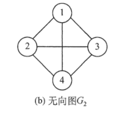

* **有向图**：图中任意两个顶点之间的边都是有方向的。

  * 有向完全图：含n个顶点，弧数达到最大n(n-1)；

  

* **加权图**：图中的每条边都带有一个相关的权重。这里的权重可以是任何一种度量，比如时间，距离，尺寸等。

  * 生活中最常见的「加权图」应该就是我们的地图了。

    在下方的「图 3. 加权图的示例图」中，每条边上都标有距离，它们可以视为每个边上的权重。

    


## 图的定义和术语

* 顶点：在以上无向图中点 1,2,3,4 都是图的顶点。

* 边：顶点之间的连接线称为边。

* 路径：从一个顶点到另一个顶点之间经过的所有顶点的集合。

  * 从 “家” 到“健身房” 的路径为[家, 超市,健身房] 或者[家, 地铁站,健身房]。
  * **注意：**两个顶点之间的路径可以是很多条。

* 路径长度：一条路径上经过的边的数量。从 “家” 到“健身房” 的路径长度为1或者2。

* 环：起点和终点为同一个顶点的路径。[家，超市，健身房]组成了一个环。同理，[家，地铁站，健身房]也组成了一个环。

* 负权环：在「加权图」中，如果一个环的所有边的权重加起来为负数，我们就称之为「负权环」。

  * 在下面的图中，它的所有边的权重和为-3。

    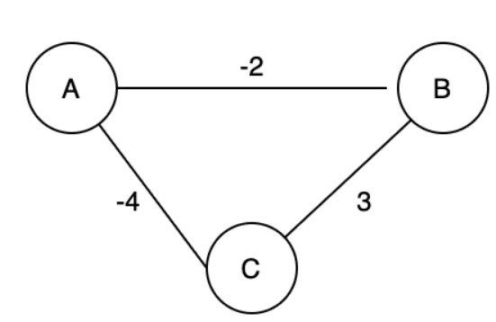

* 连通性：两个不同顶点之间存在至少一条路径，则称这两个顶点是连通的。

  * 从 “家” 到“健身房” 是连通的，因为它们之间至少有一条路径。

* 顶点的度：「度」适用于无向图，指的是和该顶点相连接的所有边数称为顶点的度。

  * 顶点"家"的度为3，因为与它相连接的边有3条。

* 顶点的入度：「入度」适用于有向图，一个顶点的入度为 d，则表示有d条与顶点相连的边指向该顶点。

  * 在上面的有向图中，A的入度为1，由F指向A的边。

* 顶点的出度：「出度」适用于有向图，它与「入度」相反。一个顶点的出度为d，则表示有d条与顶点相连的边以该顶点为起点。

  * 在上面的有向图中，A 的出度为3，分别为，A 指向 B 的边，A 指向 C 的边，和 A 指向 G 的边。

## 图的存储结构

### 邻接矩阵

**图的邻接矩阵(Adjacency Matrix) 存储方式是用两个数组来表示图。一个一维数组存储图中顶点信息，一个二维数组(称为邻接矩阵)存储图中的边或弧的信息。**

#### **无向图的邻接矩阵**
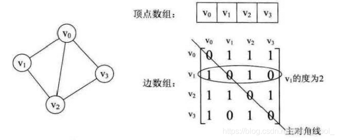

**特征：**

* 无向图的邻接矩阵一定是一个**对称矩阵**(即从矩阵的左上角到右下角的主对角线为轴，右上角的元与左下角相对应的元全都是相等的)。 因此，在实际存储邻接矩阵时只需存储上(或下)三角矩阵的元素。
* 对于无向图，邻接矩阵的第i 行(或第i 列)非零元素的个数正好是第i个顶点的度T 。
* 求顶点 Vi 的所有邻接点就是将矩阵中第 i 行元素扫描一遍， A [ i ] [ j ] 为 1 的就是邻接点。


#### **有向图的邻接矩阵**

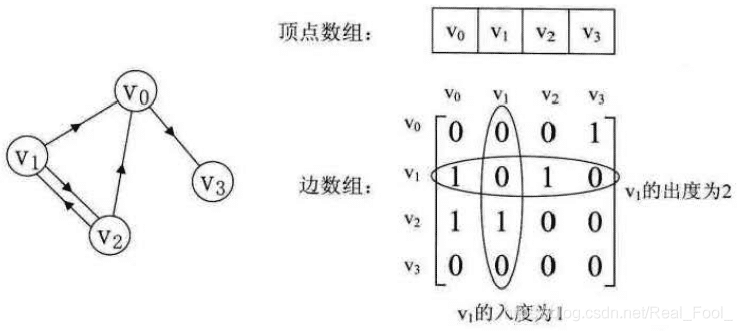

**特征：**

* 主对角线上数值依然为0。但因为是有向图，所以此矩阵并不对称。
* 有向图讲究入度与出度，顶点 V1 的入度为1,正好是第 V1  列各数之和。顶点 V1   的出度为2，即第 V1  行的各数之和。
* 判断顶点 `Vi`   到 `Vj` 是否存在弧，只需要查找矩阵中`A [ i ] [ j ]`是否为1即可。
  

#### **带权图的邻接矩阵**

带权图而言,若顶点 Vi 和 Vj  之间有边相连，则邻接矩阵中对应项存放着该边对应的权值。


劣势：

* 存下一个图需要  `O(n^2)` 的空间复杂度，这在面对点与点之间的连边数远远小于 `O(n^2)` 的稀疏图时，就有很多空间被浪费了

#### 图的邻接矩阵存储

* 无向图的邻接矩阵存储

```js
class Graph {
  constructor(numVertices) {
    this.numVertices = numVertices;
    this.adjMatrix = [];

    // 初始化邻接矩阵
    for (let i = 0; i < numVertices; i++) {
      this.adjMatrix[i] = [];
      for (let j = 0; j < numVertices; j++) {
        this.adjMatrix[i][j] = 0; // 初始时没有边连接
      }
    }
  }

  addEdge(source, destination) {
    // 添加边，将对应位置的矩阵元素设置为1
    this.adjMatrix[source][destination] = 1;
    this.adjMatrix[destination][source] = 1; // 无向图需要设置对称的位置为1
  }

  removeEdge(source, destination) {
    // 移除边，将对应位置的矩阵元素设置为0
    this.adjMatrix[source][destination] = 0;
    this.adjMatrix[destination][source] = 0; // 无向图需要设置对称的位置为0
  }

  printGraph() {
    for (let i = 0; i < this.numVertices; i++) {
      const row = [];
      for (let j = 0; j < this.numVertices; j++) {
        row.push(this.adjMatrix[i][j]);
      }
      console.log(row.join(' '));
    }
  }
}

// 测试示例
const graph = new Graph(5);
graph.addEdge(0, 1);
graph.addEdge(0, 4);
graph.addEdge(1, 3);
graph.addEdge(1, 4);
graph.addEdge(2, 3);
graph.addEdge(3, 4);
graph.printGraph();
```

#### **邻接矩阵操作**

##### **添加一条边**

如果我们想添加一条从` i `连向 `j ` 的边，我们只需要将 `adjMatrix [ i ] [ j ]` 的值设置为 1 即可，因此添加一条边的时间复杂度为 `O(1)`;

##### **判断两个点之间是否有边相连**

如果我们想要知道图中是否存在一条 ` i `连向 `j ` 的边，只需要判断 `adjMatrix [ i ] [ j ]`  的值是否为 1 即可，如果  `adjMatrix [ i ] [ j ]` 的值为 1 说明存在连边，否则不存在。因此判断两个点之间是否有边相连的时间复杂度为  `O(1)`;

##### **遍历一个点的所有出边**

对于点  ` i `，我们并不能直接知道   ` i `与哪些点有连边, ` i `与哪些点没有连边，因此需要遍历其他所有点 `j`，判断 `i` 与 `j`之间是否有连边，如果有，再进行其他操作。因此，遍历一个点的所有出边的复杂度为  `O(n)`; 。 代码如下：

```js
for (int j = 1; j <= n; ++j) {
    if (adjMatrix[i][j] === 1) {
        // i 由一条连向 j 的出边
    }
}
```


### 邻接表

当一个图为稀疏图时（边数相对顶点较少），使用邻接矩阵法显然要浪费大量的存储空间，如下图所示:


而图的邻接表法结合了顺序存储和链式存储方法，大大减少了这种不必要的浪费。

* 所谓邻接表，是指对图G 中的每个顶点 `Vi` 建立一个单链表，第 i个单链表中的结点表示依附于顶点 `Vi` 的边(对于有向图则是以顶点 `Vi`  为尾的弧)，这个单链表就称为顶点 `Vi` 的边表(对于有向图则称为出边表)。

  * 边表的头指针和顶点的数据信息采用顺序存储(称为顶点表)，所以在邻接表中存在两种结点:顶点表结点和边表结点，如下图所示。
    

  * 顶点表结点由顶点域(data)和指向第一条邻接边的指针(firstarc) 构成，边表(邻接表)结点由邻接点域(adjvex)和指向下一条邻接边的指针域(nextarc) 构成。

#### **无向图邻接表**


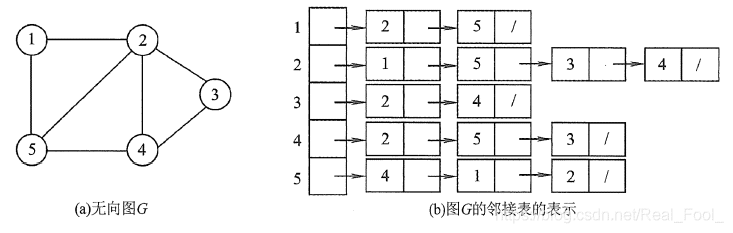

##### **javascript 数据结构**

使用对象记录邻接表，对象key 表示节点值，value 为数组，数组内存储邻接节点值

```js
{
  '1': ['2', '5'],
  '2': ['1', '5','3', '4'],
  '3': ['2', '4'],
  '4': ['2', '5','3'],
  '5': ['4', '1','2'],
}
```

##### **操作**

```js
// 无向图类
class Graph {
  constructor() {
    // 无向图邻接表
    this.adjacencyList = {};
  }
  // 添加节点
  addVertex(vertex) {
    this.adjacencyList[vertex] = [];
  }
   // 添加边
  addEdge(vertex1, vertex2) {
    this.adjacencyList[vertex1].push(vertex2);
    this.adjacencyList[vertex2].push(vertex1);
  }
   // 移除边
  removeEdge(vertex1, vertex2) {
    this.adjacencyList[vertex1] = this.adjacencyList[vertex1].filter(
      (v) => v !== vertex2
    );
    this.adjacencyList[vertex2] = this.adjacencyList[vertex2].filter(
      (v) => v !== vertex1
    );
  }
  // 移除节点
  removeVertex(vertex) {
    while (this.adjacencyList[vertex].length) {
      const adjacentVertex = this.adjacencyList[vertex].pop();
      this.removeEdge(vertex, adjacentVertex);
    }
    delete this.adjacencyList[vertex];
  }
}

// 创建图实例
const graph = new Graph();

// 添加节点
graph.addVertex('A');
graph.addVertex('B');
graph.addVertex('C');
graph.addVertex('D');

// 添加边
graph.addEdge('A', 'B');
graph.addEdge('A', 'C');
graph.addEdge('B', 'D');
graph.addEdge('C', 'D');

console.log(graph.adjacencyList);
```


#### **有向图邻接表**


### 

##### **javascript 数据结构**

使用对象记录邻接表，对象key 表示节点值，value 为数组，数组内存储邻接节点值

```js
{
  '1': ['2', '4'],
  '2': ['5'],
  '3': ['6', '5'],
  '4': ['2'],
  '5': ['4'],
  '6': ['6'],
}
```

##### **操作**

```js
class Graph {
  constructor() {
    this.adjacencyList = {};
  }

  addVertex(vertex) {
    this.adjacencyList[vertex] = [];
  }

  addEdge(startVertex, endVertex) {
    if (!this.adjacencyList[startVertex] || !this.adjacencyList[endVertex]) {
      throw new Error('Vertex does not exist in the graph.');
    }

    this.adjacencyList[startVertex].push(endVertex);
  }

  removeEdge(startVertex, endVertex) {
    if (!this.adjacencyList[startVertex] || !this.adjacencyList[endVertex]) {
      throw new Error('Vertex does not exist in the graph.');
    }

    this.adjacencyList[startVertex] = this.adjacencyList[startVertex].filter(
      (v) => v !== endVertex
    );
  }

  removeVertex(vertex) {
    if (!this.adjacencyList[vertex]) {
      throw new Error('Vertex does not exist in the graph.');
    }

    for (const adjacentVertex in this.adjacencyList) {
      this.adjacencyList[adjacentVertex] = this.adjacencyList[adjacentVertex].filter(
        (v) => v !== vertex
      );
    }

    delete this.adjacencyList[vertex];
  }
}

// 创建图实例
const graph = new Graph();

// 添加节点
graph.addVertex('A');
graph.addVertex('B');
graph.addVertex('C');
graph.addVertex('D');

// 添加有向边
graph.addEdge('A', 'B');
graph.addEdge('A', 'C');
graph.addEdge('B', 'D');
graph.addEdge('C', 'D');

console.log(graph.adjacencyList);
```


## 深度优先搜索（DFS）

### 算法

1. 选择起始节点 u，并将其标记为已访问。

2. 检查当前节点是否为目标节点。

   * 如果当前节点 u 是目标节点，则直接返回结果。

   * 如果当前节点 u 不是目标节点，则遍历当前节点 u 的所有未访问邻接节点。

3. 对每个未访问的邻接节点 v，从节点 v 出发继续进行深度优先搜索（递归）。

4. 如果节点 u 没有未访问的相邻节点，回溯到上一个节点，继续搜索其他路径。

5. 重复 2∼6 步骤，直到遍历完整个图或找到目标节点为止。


> 深度优先搜索算法采用了回溯思想，从起始节点开始，沿着一条路径尽可能深入地访问节点，直到无法继续前进时为止，然后回溯到上一个未访问的节点，继续深入搜索，直到完成整个搜索过程。
>
> 在深度优先遍历的过程中，我们需要将当前遍历节点 u 的相邻节点暂时存储起来，以便于在回退的时候可以继续访问它们。
>
> 遍历到的节点顺序符合「后进先出」的特点，这正是「递归」和「堆栈」所遵循的规律，所以深度优先搜索可以通过「递归」或者「栈」来实现。

### **递归实现**

> 思路：
>
> 1. 创建一个空的集合来存储已访问的节点。
> 2. 创建一个递归函数，接收一个节点作为参数。
> 3. 在递归函数中，将当前节点标记为已访问。
> 4. 处理当前节点（可以输出节点值或执行其他操作）。
> 5. 遍历当前节点的邻居节点：
>    - 如果邻居节点未被访问过，则递归调用该函数，将邻居节点作为参数传递给递归函数。

使用以上无向图的邻接表表示法实现图的深度优先搜索遍历:

```js
class Graph {
  constructor() {
    this.adjacencyList = {};
  }
  //添加节点
  addVertex(vertex) {
    this.adjacencyList[vertex] = [];
  }
  //添加边
  addEdge(vertex1, vertex2) {
    this.adjacencyList[vertex1].push(vertex2);
    this.adjacencyList[vertex2].push(vertex1);
  }
  // 递归遍历
  dfsRecursive(startVertex) {
    const visited = new Set(); // 创建已访问节点的集合
    this.dfsRecursiveHelper(startVertex, visited);
  }
  
  dfsRecursiveHelper(vertex, visited) {
    visited.add(vertex); // 标记节点为已访问
    this.processVertex(vertex); // 处理节点（这里仅输出节点值）
	//获取节点的邻接点
    const neighbors = this.adjacencyList[vertex];
    //遍历节点的邻接点，进行递归遍历
    for (const neighbor of neighbors) {
      if (!visited.has(neighbor)) {
        this.dfsRecursiveHelper(neighbor, visited); // 递归调用
      }
    }
  }

  processVertex(vertex) {
    console.log(vertex);
  }
}

// 创建图实例
const graph = new Graph();

// 添加节点
graph.addVertex('A');
graph.addVertex('B');
graph.addVertex('C');
graph.addVertex('D');

// 添加边
graph.addEdge('A', 'B');
graph.addEdge('A', 'C');
graph.addEdge('B', 'D');
graph.addEdge('C', 'D');

// 执行深度优先搜索遍历
graph.dfsRecursive('A');
```


### **栈实现**

> 思路：
>
> 1. 创建一个空的栈，并将起始节点放入栈中。
> 2. 创建一个空的数组来存储已访问的节点。
> 3. 循环执行以下步骤，直到堆栈为空：
>    - 从栈中弹出一个节点。
>    - 如果该节点尚未被访问过：
>      - 标记该节点为已访问。
>      - 处理该节点（可以输出节点值或执行其他操作）。
>      - 将该节点的未访问的邻居节点按逆序压入栈中（确保先访问最近的邻居）。

使用以上无向图的邻接表表示法实现图的深度优先搜索遍历:

```js
class Graph {
  constructor() {
    this.adjacencyList = {};
  }

  addVertex(vertex) {
    this.adjacencyList[vertex] = [];
  }

  addEdge(vertex1, vertex2) {
    this.adjacencyList[vertex1].push(vertex2);
    this.adjacencyList[vertex2].push(vertex1);
  }

  dfs(startVertex) {
    const stack = []; // 创建栈
    const visited = new Set(); // 创建已访问节点的集合

    stack.push(startVertex); // 将起始节点入栈

    while (stack.length > 0) {
      const vertex = stack.pop(); // 弹出一个节点

      if (!visited.has(vertex)) {
        visited.add(vertex); // 标记节点为已访问
        this.processVertex(vertex); // 处理节点（这里仅输出节点值）

        // 将未访问的邻居节点按逆序入栈
        // 获取邻接点
        const neighbors = this.adjacencyList[vertex];
        for (let i = neighbors.length - 1; i >= 0; i--) {
          const neighbor = neighbors[i];
          // 未访问过的邻接点，放入栈中
          if (!visited.has(neighbor)) {
            stack.push(neighbor);
          }
        }
      }
    }
  }

  processVertex(vertex) {
    console.log(vertex);
  }
}

// 创建图实例
const graph = new Graph();

// 添加节点
graph.addVertex('A');
graph.addVertex('B');
graph.addVertex('C');
graph.addVertex('D');

// 添加边
graph.addEdge('A', 'B');
graph.addEdge('A', 'C');
graph.addEdge('B', 'D');
graph.addEdge('C', 'D');

// 执行深度优先搜索遍历
graph.dfs('A');
```


### **应用**


## 广度优先搜索（BFS）

### **算法**

**广度优先搜索算法（Breadth First Search）：** 英文缩写为 BFS，又译作宽度优先搜索 / 横向优先搜索，是一种用于搜索树或图结构的算法。广度优先搜索算法从起始节点开始，逐层扩展，先访问离起始节点最近的节点，后访问离起始节点稍远的节点。以此类推，直到完成整个搜索过程。

遍历到的节点顺序符合「先进先出」的特点，所以广度优先搜索可以通过「队列」来实现：

1. 将起始节点 u 放入队列中，并标记为已访问。
2. 从队列中取出一个节点，访问它并将其所有的未访问邻接节点 v 放入队列中。
3. 标记已访问的节点 v，以避免重复访问。
4. 重复步骤 2∼3，直到队列为空或找到目标节点。

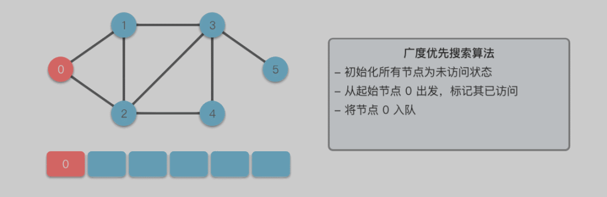


### **队列实现**

> 思路：
>
> 1. 创建一个空的队列，并将起始节点放入队列中。
> 2. 创建一个空的集合来存储已访问的节点。
> 3. 循环执行以下步骤，直到队列为空：
>    - 从队列中取出一个节点。
>    - 如果该节点尚未被访问过：
>      - 标记该节点为已访问。
>      - 处理该节点（可以输出节点值或执行其他操作）。
>      - 将该节点的未访问的邻居节点依次放入队列中。

使用以上无向图的邻接表表示法实现图的广度优先搜索遍历:

```js
class Graph {
  constructor() {
    this.adjacencyList = {};
  }

  addVertex(vertex) {
    this.adjacencyList[vertex] = [];
  }

  addEdge(vertex1, vertex2) {
    this.adjacencyList[vertex1].push(vertex2);
    this.adjacencyList[vertex2].push(vertex1);
  }

  bfs(startVertex) {
    const queue = []; // 创建队列
    const visited = new Set(); // 创建已访问节点的集合

    queue.push(startVertex); // 将起始节点入队

    while (queue.length > 0) {
      const vertex = queue.shift(); // 取出一个节点

      if (!visited.has(vertex)) {
        visited.add(vertex); // 标记节点为已访问
        this.processVertex(vertex); // 处理节点（这里仅输出节点值）

        // 将未访问的邻居节点入队
        const neighbors = this.adjacencyList[vertex];
        for (const neighbor of neighbors) {
          if (!visited.has(neighbor)) {
            queue.push(neighbor);
          }
        }
      }
    }
  }

  processVertex(vertex) {
    console.log(vertex);
  }
}

// 创建图实例
const graph = new Graph();

// 添加节点
graph.addVertex('A');
graph.addVertex('B');
graph.addVertex('C');
graph.addVertex('D');

// 添加边
graph.addEdge('A', 'B');
graph.addEdge('A', 'C');
graph.addEdge('B', 'D');
graph.addEdge('C', 'D');

// 执行广度优先搜索遍历
graph.bfs('A');
```


### **应用**


## 图的拓扑排序

- **环形图（Circular Graph）**：如果图中存在至少一条环路，则该图称为「环形图」。
- **无环图（Acyclic Graph）**：如果图中不存在环路，则该图称为「无环图」。

在有向图中，如果不存在环路，则将该图称为「有向无环图（Directed Acyclic Graph）」，缩写为 DAG。


> 在以上有向无环图中，由于图是有方向的，不能根据路径的方向形成一个环，所以以上图三未有向无环图

### **概念**

> 拓扑排序（Topological Sorting）是一个有向无环图（DAG, Directed Acyclic Graph）的所有顶点的线性序列。
>
> 且该序列必须满足下面两个条件：
>
> * 每个顶点必须出现且只出现一次。
> * 若存在一条从顶点 A 到顶点 B 的路径，那么在序列中顶点 A 出现在顶点 B 的前面。
>
> 图的拓扑排序是针对有向无环图（DAG）来说的，无向图和有向有环图没有拓扑排序，或者说不存在拓扑排序。

示例：

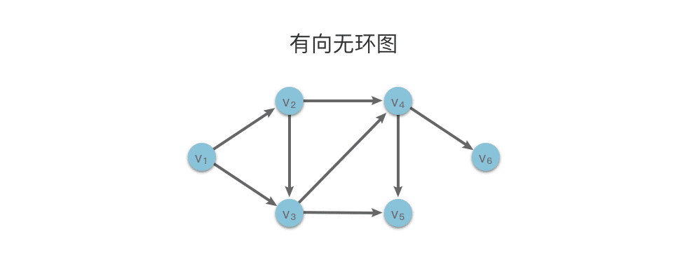

> 如上图中的有向无环图（DAG）所示，v1→v2→v3→v4→v5→v6 是该图的一个拓扑序列。与此同时，v1→v2→v3→v4→v6→v5 也是该图的一个拓扑序列。也就是说，对于一个有向无环图来说，拓扑序列可能不止一个。

###  Kahn 算法

#### **思想**

> **Kahn 算法的基本思想**：
>
> 1. 不断找寻有向图中入度为 0 的顶点，将其输出。
> 2. 然后删除入度为 0 的顶点和从该顶点出发的有向边。
> 3. 重复上述操作直到图为空，或者找不到入度为 0 的节点为止。
> 4. 如果最后图不为空或者存在入度不为0的节点，说明图中存在环，无法进行拓扑排序。

示例：


> 上图得到拓扑排序后的结果是 { 1, 2, 4, 3, 5 }。
>
> 通常，一个有向无环图可以有**一个或多个**拓扑排序序列


#### **队列实现**

> Kahn算法实现拓扑排序的步骤如下：
>
> 1. 创建一个**队列**和一个**空数组**用于存储拓扑排序的结果。
> 2. 计算每个顶点的入度，并将入度为0的顶点放入队列中。
> 3. 当队列不为空时，执行以下步骤：
>    - 从队列中取出一个顶点。
>    - 将该顶点放入拓扑排序的结果数组中。
>    - 遍历该顶点的邻居节点：
>      - 减少邻居节点的入度。
>      - 如果邻居节点的入度变为0，则将其放入队列中。
> 4. 如果拓扑排序的结果数组的长度等于图中顶点的数量，则表示拓扑排序成功，返回结果数组；否则，表示图中存在环，无法进行拓扑排序。

下面是使用JavaScript实现拓扑排序的代码，假设有向图的邻接表表示法已经存在：

```js
class Graph {
  constructor() {
    // 邻接表表示法
    this.adjacencyList = {};
  }
  // 添加顶点
  addVertex(vertex) {
    this.adjacencyList[vertex] = [];
  }
  // 添加边
  addEdge(fromVertex, toVertex) {
    this.adjacencyList[fromVertex].push(toVertex);
  }
  // 拓扑排序
  topologicalSort() {
    const indegree = {}; // 顶点入度
    const queue = []; // 入度为0的顶点放入队列
    const result = []; // 排序结果

    // 初始化所有顶点入度为 0
    for (const vertex in this.adjacencyList) {
      indegree[vertex] = 0;
    }
    // 计算每个顶点的入度
    for (const vertex in this.adjacencyList) {
      for (const neighbor of this.adjacencyList[vertex]) {
        indegree[neighbor]++;
      }
    }

    // 将入度为0的顶点放入队列
    for (const vertex in indegree) {
      if (indegree[vertex] === 0) {
        queue.push(vertex);
      }
    }

    // 拓扑排序
    while (queue.length > 0) {
      // 获取入度为0的顶点
      const vertex = queue.shift();
      result.push(vertex); // 放入排序结果
	  // 获取顶点相邻顶点，出度顶点
      for (const neighbor of this.adjacencyList[vertex]) {
        indegree[neighbor]--; // 顶点的入度减少1
        if (indegree[neighbor] === 0) { // 当顶点入度为0时，入队列
          queue.push(neighbor);
        }
      }
    }
    // 如果拓扑排序的结果数组的长度不等于图中顶点的数量，表示图中存在环，无法进行拓扑排序。
    if (result.length !== Object.keys(this.adjacencyList).length) {
      console.log("图中存在环，无法进行拓扑排序。");
    } else {
      return result;
    }
  }
}

// 创建有向图实例
const graph = new Graph();

// 添加顶点
graph.addVertex('1');
graph.addVertex('2');
graph.addVertex('3');
graph.addVertex('4');
graph.addVertex('5');

// 添加有向边
graph.addEdge('1', '2');
graph.addEdge('1', '4');
graph.addEdge('2', '4');
graph.addEdge('2', '3');
graph.addEdge('4', '3');
graph.addEdge('4', '5');
graph.addEdge('3', '5');
// 执行拓扑排序
const result = graph.topologicalSort();
console.log(result); // ['1', '2', '4', '3', '5']
```

### 基于 DFS 拓扑排序算法

#### **思想**

> **基于 DFS 实现拓扑排序算法的基本思想**：
>
> 1. 对于一个顶点 u，**深度优先遍历**从该顶点出发的有向边 <u,v>。如果从该顶点 u 出发的所有相邻顶点 v  都已经搜索完毕，则回溯到顶点 u 时，该顶点 u  应该位于其所有相邻顶点 v  的前面（拓扑序列中）。
> 2. 当我们对每个顶点进行深度优先搜索，在回溯到该顶点时将其放入栈中，则最终从栈顶到栈底的序列就是一种拓扑排序。


#### **栈实现**

> 根据基于深度优先搜索（DFS）的拓扑排序算法的思想，可以按照以下步骤实现拓扑排序：
>
> 1. 创建一个**空栈**用于存储拓扑排序的结果。
> 2. 创建一个空集合用于存储已访问的顶点。
> 3. 对于图中的每个顶点，如果该顶点尚未被访问，则调用深度优先搜索函数进行遍历。
> 4. 在深度优先搜索函数中：
>    - 将当前顶点标记为已访问。
>    - 对于当前顶点的每个未访问的邻居顶点，递归调用深度优先搜索函数。
>    - 将当前顶点压入栈中。
> 5. 当深度优先搜索结束后，栈中的元素从顶部到底部的顺序即为拓扑排序的结果。

使用JavaScript实现基于DFS的拓扑排序算法的代码，假设有向图的邻接表表示法已经存在：

```js
class Graph {
  constructor() {
    // 邻接矩阵表示
    this.adjacencyList = {};
  }
  // 添加顶点
  addVertex(vertex) {
    if (!this.adjacencyList[vertex]) {
      this.adjacencyList[vertex] = [];
    }
  }
  // 添加边
  addEdge(fromVertex, toVertex) {
    this.adjacencyList[fromVertex].push(toVertex);
  }
  // 拓扑排序
  topologicalSort() {
    // 访问节点
    const visited = new Set();
    const stack = []; // 栈，保存排序反序结果
	// 遍历所有节点，只要节点未被访问过，则进行深度遍历
    for (const vertex in this.adjacencyList) {
      if (!visited.has(vertex)) {
        this.dfs(vertex, visited, stack);
      }
    }
    // 返回排序结果
    return stack.reverse();
  }
  // 深度遍历获取拓扑排序结果
  dfs(vertex, visited, stack) {
    visited.add(vertex);
	// 遍历当前节点的出度节点
    for (const neighbor of this.adjacencyList[vertex]) {
      if (!visited.has(neighbor)) { // 出度节点未被访问，则访问并进行出度节点深度遍历
        this.dfs(neighbor, visited, stack);
      }
    }

    stack.push(vertex);
  }
}

// 创建有向图实例
const graph = new Graph();

// 添加顶点
graph.addVertex('1');
graph.addVertex('2');
graph.addVertex('3');
graph.addVertex('4');
graph.addVertex('5');

// 添加有向边
graph.addEdge('1', '2');
graph.addEdge('1', '4');
graph.addEdge('2', '4');
graph.addEdge('2', '3');
graph.addEdge('4', '3');
graph.addEdge('4', '5');
graph.addEdge('3', '5');

// 执行拓扑排序
const result = graph.topologicalSort();
console.log(result);//['1', '2', '4', '3', '5']
```


### **应用**


## 图的关键路径

拓扑排序的意义是解决工程的顺序进行问题，关键路径是解决工程完成需要的最短时间问题。

### **AOE 网**

AOE(Activity On Edge)网概念：

* AOE(Activity On Edge)网是有向无环图；
* 图中**顶点表示事件，用有向边表示活动（如<v0,v1> = a1）**，边上的权值表示活动的持续时间；

* 始点或源点： 图中没有入边的顶点称为始点或源点，如顶点V0；
* 终点或汇点：图中没有出边的顶点称为终点或汇点，如顶点V3；


* **最短时间**：在AOE网中某些活动可以并行进行，所以**完成工程的最短时间是从源点到汇点路径的最大长度**(指路径上各活动**持续时间之和最大**，而不是路径上弧的数目最多)。

* **关键路径**： 把从源点到汇点**路径长度最大的路径称作关键路径**(critical path),**关键路径上的活动称作关键活动**。

* 关键活动的长度是整个工程的最短工期，加快关键活动的完成是加快工程进度缩短工期地关键。也就是说只有缩短关键路径上的关键活动时间才可以减少整个工期长度

  

**AOE网的性质：**

1. 只有在进入某顶点的活动都已经结束，该顶点所代表的事件才发生；
   * 例如：a1 和 a2 活动都结束了，顶点 V2 所代表的事件才会发生。

2. 只有在某顶点所代表的事件发生后，从该顶点出发的各活动才开始；
   * 例如：只有顶点 V1 所代表的事件结束之后，活动 a2 和 a4 才会开始。


**事件和活动中概念：**

* 事件的最早发生时间：`ve[k]`

  * 根据 AOE 网的性质，只有进入` Vk ` 的所有活动 `<Vj, Vk> `都结束，`Vk` 代表的事件才能发生，而活动` <Vj, Vk>` 的最早结束时间为 `ve[j]+len<Vj, Vk>`。

    ```
    计算Vk的最早发生时间的方法为：
    ve[0] = 0
    ve[k] = max(ve[j] + len<Vj, Vk>)
    ```

    

* 事件的最迟发生时间：`vl[k]`

  * `vl[k]` 是指在不推迟整个工期的前提下，事件 `Vk` 允许的最迟发生时间。
  * 根据 AOE 网的性质，只有顶点 `Vk` 代表的事件发生，从 `Vk` 出发的活动` <Vk, Vj>` 才能开始，而活动` <Vk, Vj>` 的最晚开始时间为 `vl[j] - len<Vk, Vj>`。

  

* 活动的最早发生时间：`ee[i]`

  * `ai`由有向边 `<Vk, Vj>`，根据 AOE 网的性质，只有顶点 `Vk` 代表的事件发生，活动 `ai` 才能开始，即活动 `ai` 的最早开始时间等于事件`Vk` 的最早开始时间。

  

* 活动的最迟发生时间：`el[i]`
  * `el[i]` 是指在不推迟真个工期的前提下，活动 `ai` 必须开始的最晚时间。若活动 `ai` 由有向边 `<Vk, Vj>` 表示，则 `ai` 的最晚开始时间要保证事件 `vj` 的最迟发生时间不拖后。


示例：

> 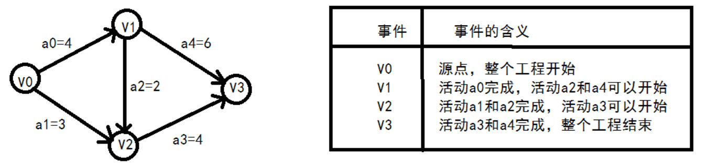
>
> * 事件的最早发生时间：`ve[k]`
>
>   ```js
>   从源点向终点方向计算:
>   ve[0] = 0
>   ve[1] = ve[0] + a0 = 0 + 4 = 4
>   ve[2] = max( ve[0] + a1, ve[1] + a2 ) = max(0 + 3, 4 + 2) = 6
>   ve[3] = max(ve[1] + a4, ve[2] + a3) = max(4 + 6, 3 + 4) = 10
>   ```
>
>   
>
> * 事件的最迟发生时间：`vl[k]`
>
>   ```js
>   从终点向源点方向计算:
>   vl[3] = ve[3] = 10
>   vl[2] = vl[3] - a3 = 10 - 4 = 6
>   vl[1] = min(vl[3] - a4, vl[2] - a2) = min(10 - 6, 6 - 2) = 4
>   vl[0] = min(vl[2] - a1, vl[1] - a0) = min(4 - 4, 4 - 2) = 0 
>   ```
>
>   
>
> * 活动的最早发生时间：`ee[i]`
>
>   ```js
>   共有五个活动：
>   ee[0] = ve[0] = 0
>   ee[1] = ve[0] = 0
>   ee[2] = ve[1] = 4
>   ee[3] = ve[2] = 6
>   ee[4] = ve[1] = 4
>   ```
>
>   
>
> * 活动的最迟发生时间：`el[i]`
>
>   ```js
>   el[0] = v[1] - a0 = 4 - 4 = 0
>   el[1] = vl[2] - a1 = 6 - 3 = 3
>   el[2] = vl[2] - a2 = 6 - 2 = 4
>   el[3] = vl[3] - a3 = 10 - 4 = 6
>   el[4] = vl[3] - a4 = 10 - 6 = 4
>   ```
>
> 活动的最早开始时间和最晚开始时间相等，则说明该活动时属于关键路径上的活动，即关键活动
>
> 经过比较，得出关键活动有：a0, a2, a3, a4：
>
> 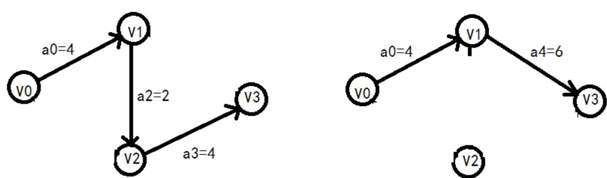


### **关键路径算法**

步骤：

1. **构建项目网络图**：将项目的活动表示为节点，用有向边表示活动之间的依赖关系。活动的持续时间可以作为边的权重。
2. **计算活动的最早开始时间（EST）**：从网络图中的起点开始，按照活动的依赖关系计算每个活动的最早开始时间。对于每个活动，**最早开始时间等于所有前置活动的最早完成时间中的最大值**。
3. **计算活动的最晚开始时间（LST）**：从网络图中的终点开始，按照活动的依赖关系反向计算每个活动的最晚开始时间。对于每个活动，**最晚开始时间等于所有后续活动的最晚完成时间中的最小值**。
4. **计算活动的总时差（Slack）**：通过计算每个活动的最晚开始时间与最早开始时间之差，获得活动的总时差。**总时差表示活动可以延迟的时间，而不会影响项目的最短完成时间**。
5. **确定关键活动和关键路径**：**关键活动是指那些总时差为零的活动**，它们的延迟会导致项目整体延迟。关键路径是由一系列关键活动组成的路径，它们的总时差为零。


```js
class Activity {
  constructor(name, duration) {
    this.name = name; // 活动名称
    this.duration = duration; // 活动持续时间
    this.earliestStart = 0; // 最早开始时间
    this.earliestFinish = 0; // 最早完成时间
    this.latestStart = 0; // 最晚开始时间
    this.latestFinish = 0; // 最晚完成时间
    this.slack = 0; // 总时差
  }
}

// 关键路径类
class CriticalPath {
  constructor() {
    this.activities = new Map(); // 存储活动的映射表，活动表示为节点
    this.networkGraph = new Map(); // 存储网络图的映射表，邻接表表示法存储有向边
  }

  /** 
  * 添加活动，活动表示为节点
  * name：活动名称
  * duration：活动持续时间
  **/
  addActivity(name, duration) {
    const activity = new Activity(name, duration);
    this.activities.set(name, activity);
  }

  // 有向边表示活动之间的依赖关系
  addDependency(activityName, dependsOn) {
    // 映射表中不存在活动，则初始化活动
    if (!this.networkGraph.has(activityName)) {
      this.networkGraph.set(activityName, []);
    }
    // 活动中添加依赖关系，即节点中添加关联的顶点
    this.networkGraph.get(activityName).push(dependsOn);
  }

  // 计算关键路径
  calculate() {
    // 步骤 1: 初始化最早完成时间：假设最早完成时间初始等于活动持续时间
    this.activities.forEach((activity) => {
      activity.earliestFinish = activity.duration;
    });

    // 步骤 2: 计算最早开始时间：最早开始时间等于所有前置活动的最早完成时间中的最大值
    this.activities.forEach((activity) => {
      // 获取顶点连接的所有顶点
      const dependencies = this.networkGraph.get(activity.name) || [];
      // 遍历顶点连接的所有顶点
      dependencies.forEach((dependency) => {
        // 获取连接的下一个顶点(活动)
        const depActivity = this.activities.get(dependency);
        // 获取连接的下一个顶点的最早完成时间
        const depFinish = depActivity.earliestFinish;
        // 下一个顶点的最早完成时间大于当前活动的最早完成时间，则将下一个顶点最早完成时间作为当前活动最早完成时间
        if (depFinish > activity.earliestStart) {
          activity.earliestStart = depFinish;
        }
      });
    });

    // 步骤 3: 初始化最晚开始时间和最晚完成时间：最晚开始时间等于所有后续活动的最晚完成时间中的最小值
    this.activities.forEach((activity) => {
      activity.latestFinish = activity.earliestFinish;
      activity.latestStart = activity.earliestStart;
    });

    // 步骤 4: 计算最晚开始时间
    const activityNames = Array.from(this.activities.keys()).reverse();
    activityNames.forEach((activityName) => {
      const activity = this.activities.get(activityName);
      const dependencies = this.networkGraph.get(activityName) || [];
      dependencies.forEach((dependency) => {
        const depActivity = this.activities.get(dependency);
        const depStart = depActivity.latestStart;
        if (depStart < activity.latestStart || activity.latestStart === 0) {
          activity.latestStart = depStart;
        }
      });
      activity.latestFinish = activity.latestStart + activity.duration;
    });

    // 步骤 5: 计算总时差和确定关键活动和关键路径
    this.activities.forEach((activity) => {
      activity.slack = activity.latestStart - activity.earliestStart;
      if (activity.slack === 0) {
        // 关键活动
        console.log(`Critical Activity: ${activity.name}`);
      }
    });

    console.log("Critical Path:");
    const criticalActivities = Array.from(this.activities.values()).filter(
      (activity) => activity.slack === 0
    );
    const path = this.constructPath(criticalActivities[0]);
    console.log(path.join(" -> "));
  }

  // 构建关键路径
  constructPath(activity) {
    const path = [activity.name];
    const dependencies = this.networkGraph.get(activity.name) || [];
    dependencies.forEach((dependency) => {
      const depActivity = this.activities.get(dependency);
      if (depActivity.slack === 0) {
        path.unshift(...this.constructPath(depActivity));
      }
    });
    return path;
  }
}

// 示例用法:
const cp = new CriticalPath();

// 添加活动
cp.addActivity("A", 2);
cp.addActivity("B", 3);
cp.addActivity("C", 1);
cp.addActivity("D", 4);
cp.addActivity("E", 2);
cp.addActivity("F", 3);
cp.addActivity("G", 2);

// 添加依赖关系
cp.addDependency("B", "A");
cp.addDependency("C", "A");
cp.addDependency("D", "B");
cp.addDependency("E", "C");
cp.addDependency("F", "D");
cp.addDependency("F", "E");
cp.addDependency("G", "D");
cp.addDependency("G", "F");

// 计算关键路径
cp.calculate();
```


## **图的生成树**

### **生成树**

>  **图的生成树（Spanning Tree）**：如果**无向连通图** G 的一个子图是一棵包含图 G **所有顶点的树**，则称该子图为 G 的生成树。
>
> 生成树是连通图的包含图中的所有顶点的极小连通子图。
>
> 图的生成树不惟一。从不同的顶点出发进行遍历，可以得到不同的生成树。
>
> 生成树是原图 G 的一个子图，它包含了原图 G 的所有顶点，并且通过选择图中一部分边连接这些顶点，使得子图中没有环。

特点：

1. **包含所有顶点**：生成树中包含了原图的所有顶点。
2. **连通性**：生成树是原图的一个连通子图，意味着任意两个顶点之间都存在一条路径。
3. **无环图**：生成树一个无环图。
4. **边数最少**：在包含所有顶点的情况下，生成树的边数最少，其边数为顶点数减 1 。


> 如上图所示，左侧图 G  是包含 v1…v6  共 6 个顶点 7  条边在内的有权图。右侧是图 G 的两个生成树，两者都包含了 6 个顶点 5 条边。

### **最小生成树**

> **最小生成树（Minimum Spanning Tree）**：无向连通图 G 的所有生成树中，**边的权值之和最小**的生成树，被称为最小生成树。

最小生成树除了包含生成树的特点之外，还具有一个特点:

* **边的权值之和最小**：在包含所有顶点的情况下，最小生成树的边的权重之和是所有可能的生成树中最小的。

如上图所示，左侧图 G  是包含 v1…v6  共 6  个顶点 7 条边在内的有权图。右侧 "图 G 的生成树2"   是图G的最小生成树，包含了 6  个顶点 5  条边，并且所有边的权值和最小。

为了找到无向图的最小生成树，常用的算法有「Prim 算法」和「Kruskal 算法」


### Kruskal 算法

#### **思想**

> 通过依次选择权重最小的边并判断其两个端点是否连接在同一集合中，从而逐步构建最小生成树。这个过程保证了最终生成的树是无环的，并且总权重最小。

**实现步骤：**

1. 将图中所有边按照权重从小到大进行排序。
2. 将每个顶点看做是一个单独集合，即初始时每个顶点自成一个集合。
3. 按照排好序的边顺序，按照权重从小到大，依次遍历每一条边。
4. 对于每条边，检查其连接的两个顶点所属的集合：
   1. 如果两个顶点属于同一个集合，则跳过这条边，以免形成环路。
   2. 如果两个顶点不属于同一个集合，则将这条边加入到最小生成树中，同时合并这两个顶点所属的集合。
5. 重复第 3∼4  步，直到最小生成树中的变数等于所有节点数减 1  为止。


示例1：

> 
>
> 左侧为图，右侧为将图中所有的边按照权值进行非降序排列，执行以下步骤：
>
> 1. 选择权值最小的边 V4−V7：没有环形成，则添加：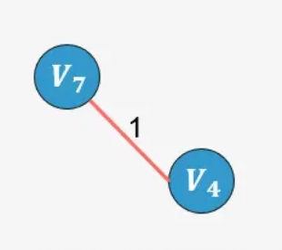
> 2. 选择边 V2−V8：没有形成环，则添加：
> 3. 选择边 V0−V1：没有形成环，则添加：
> 4. 选择边 V0−V5：没有形成环，则添加：
> 5. 选择边 V1−V8：没有形成环，则添加：
> 6. 选择边 V3−V7：没有形成环，则添加：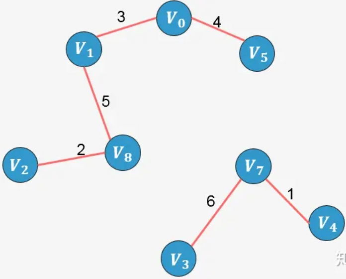
> 7. 选择边 V1−V6：没有形成环，则添加：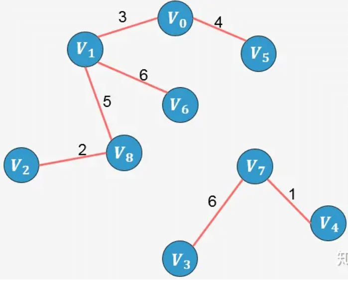
> 8. 选择边 V5−V6：添加这条边将导致形成环，舍弃，不添加；
> 9. 选择边 V1−V2：添加这条边将导致形成环，舍弃，不添加；
> 10. 选择边 V6−V7：没有形成环，则添加：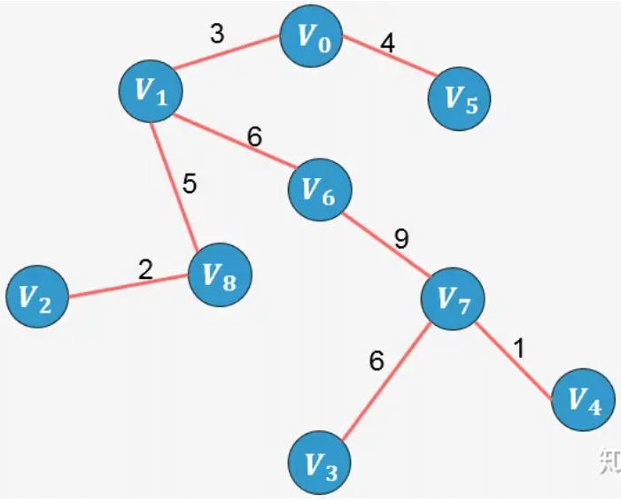

示例2：

> 
>
> 

#### **实现**

> 步骤：
>
> 1. 创建一个空的最小生成树（MST）对象，用于存储最小生成树的顶点集合和边集合。
> 2. 将图中的所有边按照权重从小到大进行排序。
> 3. 创建一个并查集（Disjoint Set），用于判断顶点是否属于同一个集合，初始时每个顶点都是独立的集合。
> 4. 遍历排序后的边集合，对于每条边执行以下步骤：
>    - 获取当前边的源顶点和目标顶点。
>    - 判断源顶点和目标顶点是否属于同一个集合，如果是，则跳过这条边，以免形成环路。
>    - 如果源顶点和目标顶点不属于同一个集合，则将这条边加入到最小生成树的边集合中，同时合并源顶点和目标顶点所属的集合。
> 5. 返回最小生成树 MST。


**Kruskal 最小生成树算法：**

```js
// 创建最小生成树类
class MinimumSpanningTree {
  constructor() {
    this.vertices = new Set(); // 最小生成树的顶点集合
    this.edges = []; // 最小生成树的边集合
  }
  // 添加最小生成树的顶点
  addVertex(vertex) {
    this.vertices.add(vertex);
  }
  // 添加最小生成树的边
  addEdge(edge) {
    this.edges.push(edge);
  }
  // 获取最小生成树
  getMST() {
    const mst = new MinimumSpanningTree(); // 创建最小生成树对象
    const disjointSet = new DisjointSet(); // 创建并查集对象

    // 将图中的所有边按照权重从小到大进行排序
    const sortedEdges = this.edges.sort((a, b) => a.weight - b.weight);

    // 遍历排序后的边集合
    for (const edge of sortedEdges) {
      // 获取边的源顶点和目标顶点
      const { source, target } = edge;

      // 判断源顶点和目标顶点是否属于同一个集合
      if (!disjointSet.isConnected(source, target)) {
        // 如果源顶点和目标顶点不属于同一个集合，则将边加入最小生成树的边集合中
        mst.addEdge(edge);

        // 合并源顶点和目标顶点所属的集合
        disjointSet.union(source, target);
      }
    }

    return mst;
  }
}

// 创建边类
class Edge {
  constructor(source, target, weight) {
    this.source = source; // 源顶点
    this.target = target; // 目标顶点
    this.weight = weight; // 权重
  }
}

// 创建并查集类
class DisjointSet {
  constructor() {
    this.parent = new Map(); // 存储顶点的父节点
    this.rank = new Map(); // 存储顶点的秩
  }

  // 创建一个新的集合，将顶点的父节点设为自身，秩设为 0
  makeSet(vertex) {
    this.parent.set(vertex, vertex);
    this.rank.set(vertex, 0);
  }

  // 查找顶点的根节点并进行路径压缩
  find(vertex) {
    // 如果顶点的父节点不是自身，则递归查找根节点并进行路径压缩
    if (this.parent.get(vertex) !== vertex) {
      this.parent.set(vertex, this.find(this.parent.get(vertex)));
    }
    return this.parent.get(vertex);
  }

  // 合并两个集合
  union(vertex1, vertex2) {
    const root1 = this.find(vertex1); // 查找顶点1的根节点
    const root2 = this.find(vertex2); // 查找顶点2的根节点

    if (root1 !== root2) {
      // 根据秩进行合并，将秩较小的根节点连接到秩较大的根节点上
      if (this.rank.get(root1) < this.rank.get(root2)) {
        this.parent.set(root1, root2);
      } else if (this.rank.get(root1) > this.rank.get(root2)) {
        this.parent.set(root2, root1);
      } else {
        this.parent.set(root2, root1);
        this.rank.set(root1, this.rank.get(root1) + 1);
      }
    }
  }

  // 判断两个顶点是否属于同一个集合
  isConnected(vertex1, vertex2) {
    return this.find(vertex1) === this.find(vertex2);
  }
}


// 创建图实例
const graph = new MinimumSpanningTree();

// 添加顶点
graph.addVertex('A');
graph.addVertex('B');
graph.addVertex('C');
graph.addVertex('D');
graph.addVertex('E');

// 添加边
graph.addEdge(new Edge('A', 'B', 2));
graph.addEdge(new Edge('A', 'C', 3));
graph.addEdge(new Edge('B', 'D', 1));
graph.addEdge(new Edge('C', 'D', 4));
graph.addEdge(new Edge('C', 'E', 5));
graph.addEdge(new Edge('D', 'E', 6));

// 获取最小生成树
const mst = graph.getMST();
console.log(mst.vertices); 
console.log(mst.edges); 
```


****


### **Prim 算法**

#### **思想**

1. 将顶点分为两类，一类是在查找的过程中已经包含在生成树中的顶点（假设为 A 类），剩下的为另一类（假设为 B 类）。
2. 在找最小生成树时，选定任意一个顶点作为起始点，并将之从 B 类移至 A 类；
3. **然后找出 B 类中到 A 类中的顶点之间权值最小的顶点**，将之从 B 类移至 A 类，如此重复，直到 B 类中没有顶点为止。
4. 所走过的顶点和边就是该连通图的最小生成树。

> 每次选择最短边来扩展最小生成树，从而保证生成树的总权重最小。算法通过不断扩展小生成树的顶点集合 MST（最小生成树），逐步构建出最小生成树

**实现步骤：**

1. 将图 G 中所有的顶点 V  分为两个顶点集合 VA  和 VB 。其中 VA  为已经加入到最小生成树的顶点集合，VB  是还未加入生成树的顶点集合。
2. 选择起始顶点 start ，将其加入到最小生成树的顶点集合 VA  中。
3. 从 VA  的顶点集合中选择一个顶点 u ，然后找到连接顶点 u  与 VB  之间的边中权重最小的边。
4. 让上一步中找到的顶点和边加入到 MST  中，更新 MST  的顶点集合和边集合。
5. 重复第 3∼4  步，直到 MST  的顶点集合中包含了图中的所有顶点为止。


参考资料：[图解：什么是最小生成树？ - 知乎 (zhihu.com)](https://zhuanlan.zhihu.com/p/136387766)

#### **队列实现**

> 步骤：
>
> 1. 创建一个空的最小生成树（MST）对象，用于存储最小生成树的顶点集合和边集合。
> 2. 选择一个起始顶点，并将其加入到 MST 的顶点集合中。
> 3. 创建一个优先队列，用于存储顶点之间的边，并初始化为空。
> 4. 将起始顶点的所有边加入到优先队列中。
> 5. 当优先队列不为空时，执行以下步骤：
>    - **从优先队列中取出权重最小的边**，记为 currentEdge。
>    - 如果 currentEdge 的**目标顶点不在 MST 的顶点集合**中：
>      - 将 currentEdge 加入到 MST 的边集合中。
>      - 将 currentEdge 的目标顶点加入到 MST 的顶点集合中。
>      - 将目标顶点的所有边加入到优先队列中。
> 6. 返回最小生成树 MST。

```js
// 创建最小生成树类
class MinimumSpanningTree {
  constructor() {
    this.vertices = new Set(); // 最小生成树的顶点集合
    this.edges = []; // 最小生成树的边集合
  }
  // 添加最小生成树的顶点
  addVertex(vertex) {
    this.vertices.add(vertex);
  }
  // 添加最小生成树的边
  addEdge(edge) {
    this.edges.push(edge);
  }
  // 最小成树集合
  getMST() {
    const mst = new MinimumSpanningTree(); // 创建最小生成树对象
    const visited = new Set(); // 存储已访问的顶点
    const priorityQueue = new PriorityQueue(); // 创建优先队列

    // 选择起始顶点
    const startVertex = this.vertices.values().next().value;
    visited.add(startVertex); // 访问起始顶点
    mst.addVertex(startVertex); // 将起始顶点加入最小生成树

    // 将起始顶点的所有边加入优先队列
    this.edges.forEach(edge => {
      if (edge.source === startVertex) {
        priorityQueue.enqueue(edge);
      }
    });

    // 当优先队列不为空时
    while (!priorityQueue.isEmpty()) {
      const currentEdge = priorityQueue.dequeue(); // 取出权重最小的边
 	// 如果目标顶点不在已访问的顶点集合中
      if (!visited.has(currentEdge.target)) {
       //访问顶点
        visited.add(currentEdge.target);
        mst.addVertex(currentEdge.target); // 将顶点的边加入最小生成树
        mst.addEdge(currentEdge); // 将顶点的边加入最小生成树

        // 将目标顶点的所有边加入优先队列
        this.edges.forEach(edge => {
          if (edge.source === currentEdge.target) {
            priorityQueue.enqueue(edge);
          }
        });
      }
    }

    return mst;
  }
}

// 创建边类
class Edge {
  constructor(source, target, weight) {
    this.source = source; // 出度顶点
    this.target = target; // 入度顶点
    this.weight = weight; // 权重
  }
}

// 创建优先队列类
class PriorityQueue {
  constructor() {
    this.elements = [];
  }
  // 入队列，自动按照权重排序
  enqueue(element) {
    this.elements.push(element);
    this.elements.sort((a, b) => a.weight - b.weight);
  }
  // 出队列
  dequeue() {
    if (this.isEmpty()) {
      return null;
    }
    return this.elements.shift();
  }

  isEmpty() {
    return this.elements.length === 0;
  }
}

// 创建图实例
const graph = new MinimumSpanningTree();

// 添加顶点
graph.addVertex('A');
graph.addVertex('B');
graph.addVertex('C');
graph.addVertex('D');
graph.addVertex('E');

// 添加边
graph.addEdge(new Edge('A', 'B', 2));
graph.addEdge(new Edge('A', 'C', 3));
graph.addEdge(new Edge('B', 'D', 1));
graph.addEdge(new Edge('C', 'D', 4));
graph.addEdge(new Edge('C', 'E', 5));
graph.addEdge(new Edge('D', 'E', 6));

// 获取最小生成树
const mst = graph.getMST();
console.log(mst.vertices); // {'A', 'B', 'D', 'C', 'E'}
console.log(mst.edges); 
/**
 [
 	{source: 'A', target: 'B', weight: 2},
 	{source: 'B', target: 'D', weight: 1},
 	{source: 'A', target: 'C', weight: 3},
 	{source: 'C', target: 'E', weight: 5}
  ] 
**/
 
```

> 以上测试代码中的最小生成树如下：
>
> 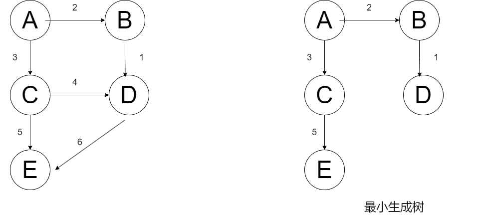


## **图的最短路径**


### **单源最短路径**

> **单源最短路径（Single Source Shortest Path）**：对于一个带权图 `G=(V,E)`，其中每条边的权重是一个实数。
>
> 另外，给定 v  中的一个顶点，称之为源点。则源点到其他所有各个顶点之间的最短路径长度，称为单源最短路径。
>
> 路径长度，指的是路径上各边权之和。

单源最短路径问题的算法包括：

1. **Dijkstra 算法**：
   * 一种贪心算法，用于解决边上权值非负情形的单源最短路径问题
   * 它逐步扩展当前已知最短路径的范围，选择当前距离起始节点最近的节点，并更新与该节点相邻的节点的距离。
2. **Bellman-Ford 算法**：
   * 边上权值非负情形的单源最短路径问题。
   * 它通过多次迭代来逐步逼近最短路径，每次迭代都尝试通过更新边的权重来缩短路径。
3. **SPFA 算法**：
   * 所有顶点之间的最短路径.
   * 优化的 Bellman-Ford 算法，它在每次迭代中不遍历所有的边，而是选择性地更新与当前节点相关的边，从而提高了算法的效率。


### **Dijkstra 算法**

> 问题描述: 给定一个带权有向图 D 与源点 v ，求从 v 到 D 中其它顶点的最短路径。限定**各边上的权值大于或等于 0**

#### **思想**

> 核心思想：通过不断更新节点的最短距离来逐步确定最短路径。它使用贪心策略，每次选择当前最短距离的节点作为中间节点，更新与其相邻节点的最短距离。

1. 首先求出长度最短的一条最短路径
2. 再参照它求出长度次短的一条最短路径
3. 依次类推，直到从顶点 v 到其它各顶点的最短路径全部求出为止。


示例：


#### **实现**

Dijkstra算法的详细步骤：

1. 创建一个辅助数据结构：
   - 创建一个距离数组dist[]，用于保存从源节点到每个节点的当前最短距离。初始时，将源节点的距离设置为0，将所有其他节点的距离设置为无穷大。
   - 创建一个优先队列（最小堆）minHeap，并将源节点及其距离添加到队列中。
2. 初始化距离数组和优先队列后，进入主循环：
   - 从优先队列中取出距离最小的节点，将其标记为当前节点。
   - 遍历当前节点的所有邻居节点：
     - 计算从源节点经过当前节点到达邻居节点的距离：如果该距离小于邻居节点当前保存的最短距离，则更新邻居节点的最短距离为新计算的距离，并将邻居节点加入优先队列。
   - 重复以上步骤，直到优先队列为空。
3. 循环结束后，距离数组dist[]中保存的就是从源节点到各个节点的最短距离。


1. 假设**图以邻接表表示**：

   

   ```js
   // 示例邻接表表示法
   const graph = {
     'V0': { 'V1': 10, 'V4': 100 },
     'V1': { 'V0': 10, 'V2': 50 },
     'V2': { 'V1': 50, 'V4': 10, 'V3': 20 },
     'V3': { 'V2': 20, 'V0': 30, 'V4': 60 },
     'V4': { 'V0': 100,'V2': 10, 'V3': 60 },
   };
   ```

* Dijkstra算法：

  ```js
  // Dijkstra算法
  function dijkstra(graph, source) {
    const dist = {}; // 距离数组，保存从源节点到每个节点的当前最短距离
    const minHeap = new PriorityQueue(); // 优先队列，用于选择当前最短距离的节点
  
    // 初始化距离数组和优先队列
    for (const node in graph) {
      dist[node] = Infinity; // 将所有节点的距离初始化为无穷大
    }
      
    dist[source] = 0; // 源节点的距离初始化为0
    minHeap.enqueue(source, 0); // 将源节点及其距离加入优先队列
  
    // 主循环
    while (!minHeap.isEmpty()) {
      const { node, distance } = minHeap.dequeue(); // 取出距离最小的节点
  
      // 如果取出的节点的距离已经大于等于dist中保存的距离，则跳过该节点
      if (distance > dist[node]) continue;
  
      // 遍历当前节点的邻居节点:  graph[node] 获取前节点的邻居节点
      for (const neighbor in graph[node]) {
        // 计算从源节点经过当前节点到达邻居节点的距离 =   当前节点最短距离 + 邻接节点活动距离
        const newDistance = dist[node] + graph[node][neighbor];
  
       // 如果该距离小于邻居节点当前保存的最短距离，则更新邻居节点的最短距离为新计算的距离，并将邻居节点及其距离加入优先队列
        if (newDistance < dist[neighbor]) {
          dist[neighbor] = newDistance;
          minHeap.enqueue(neighbor, newDistance);
        }
      }
    }
  
    return dist; // 返回最短距离数组
  }
  
  // 定义优先队列类
  class PriorityQueue {
    constructor() {
      this.heap = []; // 使用数组实现最小堆
    }
  
    // 入队
    enqueue(node, distance) {
      this.heap.push({ node, distance }); // 将节点和距离加入堆
      this.bubbleUp(this.heap.length - 1); // 从底部向上调整堆
    }
  
    // 上浮操作
    bubbleUp(index) {
      const node = this.heap[index];
      while (index > 0) {
        const parentIndex = Math.floor((index - 1) / 2);
        const parent = this.heap[parentIndex];
        if (node.distance >= parent.distance) break; // 如果当前节点的距离大于等于父节点的距离，跳出循环
        this.heap[parentIndex] = node;
        this.heap[index] = parent;
        index = parentIndex;
      }
    }
  
    // 出队
    dequeue() {
      const min = this.heap[0]; // 最小距离的节点
      const last = this.heap.pop(); // 移除最后一个节点
      if (this.heap.length > 0) {
        this.heap[0] = last; // 将最后一个节点放到堆顶
        this.sinkDown(0); // 从顶部向下调整堆
      }
      return min;
    }
  
    // 下沉操作
    sinkDown(index) {
      const leftChildIndex = 2 * index + 1;
      const rightChildIndex = 2 * index + 2;
      const length = this.heap.length;
      let smallestIndex = index;
  
      if (
        leftChildIndex < length &&
        this.heap[leftChildIndex].distance < this.heap[smallestIndex].distance
      ) {
        smallestIndex = leftChildIndex;
      }
  
      if (
        rightChildIndex < length &&
        this.heap[rightChildIndex].distance < this.heap[smallestIndex].distance
      ) {
        smallestIndex = rightChildIndex;
      }
  
      if (smallestIndex !== index) {
        const temp = this.heap[smallestIndex];
        this.heap[smallestIndex] = this.heap[index];
        this.heap[index] = temp;
        this.sinkDown(smallestIndex);
      }
    }
  
    // 判断队列是否为空
    isEmpty() {
      return this.heap.length === 0;
    }
  }
  
  
  
  // 测试代码
  const graph = {
    'V0': { 'V1': 10, 'V4': 100 },
    'V1': { 'V0': 10, 'V2': 50 },
    'V2': { 'V1': 50, 'V4': 10, 'V3': 20 },
    'V3': { 'V2': 20, 'V0': 30, 'V4': 60 },
    'V4': { 'V0': 100,'V2': 10, 'V3': 60 },
  };
  
  const sourceNode = 'V0';
  const distances = dijkstra(graph, sourceNode);
  console.log(distances); //{V0: 0, V1: 10, V2: 60, V3: 80, V4: 70}
  ```

  


### **Bellman-Ford 算法**

#### **思想**

> Bellman-Ford算法是一种用于解决带有负权边的单源最短路径问题的算法。它的核心思想是通过对所有边进行松弛操作来逐步逼近最短路径，直到达到最优解。

#### **队列实现**

Bellman-Ford算法的详细实现过程：

1. 初始化：创建两个数组，dist 和 prev，用于保存最短距离和前驱节点信息。将源节点的最短距离 dist[source] 设置为0，其他节点的最短距离 dist[node] 设置为正无穷大，所有节点的前驱节点 prev[node] 设置为null。

2. 进行n-1次松弛操作：重复以下步骤n-1次，其中n为图中节点的数量。

   a. 遍历图中的所有边：对于每条边 (u, v)，其中u为起始节点，v为目标节点。

   b. 松弛操作：如果从源节点到节点 u 的距离 dist[u] 加上边 (u, v) 的权重 w 小于当前记录的从源节点到节点v的最短距离dist[v]，则更新 dist[v] 为新的最短距离。同时，将节点u设置为节点v的前驱节点 prev[v]，表示通过节点u可以到达节点v。

3. 检测负权环：再次遍历图中的所有边，对于每条边 (u, v)，如果从源节点到节点u的距离dist[u]加上边(u, v)的权重w小于当前记录的从源节点到节点v的最短距离dist[v]，则说明存在负权环。因为负权环可以无限次地减小路径长度，所以无法找到最短路径。

4. 返回结果：如果存在负权环，则算法无法找到最短路径，返回null。否则，返回包含最短距离数组dist和前驱节点数组prev的结果。


* 使用邻接表表示图:

  ```js
  // 测试代码
  const graph = {
    A: { B: 4, C: 3 },
    B: { C: -2, D: 4 },
    C: { D: 2, E: 1 },
    D: { B: -1, E: -2 },
    E: {},
  };
  ```

* 代码实现：

  ```js
  // Bellman-Ford算法
  function bellmanFord(graph, source) {
    const dist = {}; // 距离数组，保存从源节点到每个节点的当前最短距离
    const prev = {}; // 前驱节点数组，保存到达每个节点的前驱节点
  
    // 初始化距离数组和前驱节点数组
    for (const node in graph) {
      dist[node] = Infinity; // 将所有节点的距离初始化为无穷大
      prev[node] = null; // 将所有节点的前驱节点初始化为null
    }
    dist[source] = 0; // 源节点的距离初始化为0
  
    // 进行n-1次松弛操作（n为节点数量）
    const nodes = Object.keys(graph);
    const numNodes = nodes.length;
    for (let i = 0; i < numNodes - 1; i++) {
      // 遍历所有边
      for (let j = 0; j < numNodes; j++) {
        const node = nodes[j];
        const edges = graph[node];
  
        // 遍历当前节点的所有邻居节点
        for (const neighbor in edges) {
          const weight = edges[neighbor]; // 边的权重
          const newDistance = dist[node] + weight; // 计算从源节点经过当前节点到达邻居节点的距离
  
          // 如果该距离小于邻居节点当前保存的最短距离，则更新邻居节点的最短距离和前驱节点
          if (newDistance < dist[neighbor]) {
            dist[neighbor] = newDistance;
            prev[neighbor] = node;
          }
        }
      }
    }
  
    // 检测是否存在负权环
    for (let j = 0; j < numNodes; j++) {
      const node = nodes[j];
      const edges = graph[node];
  
      for (const neighbor in edges) {
        const weight = edges[neighbor]; // 边的权重
        const newDistance = dist[node] + weight; // 计算从源节点经过当前节点到达邻居节点的距离
  
        // 如果在n-1次松弛操作后，仍然存在距离更短的路径，则存在负权环
        if (newDistance < dist[neighbor]) {
          return null; // 返回null，表示存在负权环
        }
      }
    }
  
    return { dist, prev }; // 返回最短距离数组dist和前驱节点数组prev
  }
  
  // 测试代码
  const graph = {
    A: { B: 4, C: 3 },
    B: { C: -2, D: 4 },
    C: { D: 2, E: 1 },
    D: { B: -1, E: -2 },
    E: {},
  };
  
  const sourceNode = 'A';
  const result = bellmanFord(graph, sourceNode);
  if (result === null) {
    console.log('存在负权环');
  } else {
    const { dist, prev } = result;
    console.log('最短距离数组：', dist);
    console.log('前驱节点数组：', prev);
  }
  ```

  


### **SPFA 算法**

#### **思想**

> SPFA（Shortest Path Faster Algorithm）算法是一种用于解决带有负权边的单源最短路径问题的算法。它是对Bellman-Ford算法的一种优化，通过使用队列来选择待松弛的节点，减少了不必要的松弛操作，从而提高了算法的效率

#### **队列实现**

SPFA算法的详细实现过程：

1. 初始化：

   * 创建一个队列，用于存储待松弛的节点。
   * 同时创建一个布尔型的数组用于标记节点是否在队列中。
   * 初始化最短距离数组 dist 和前驱节点数组 prev，将源节点的最短距离dist[source]设置为0，其他节点的最短距离dist[node] 设置为正无穷大，所有节点的前驱节点prev[node]设置为null。

2. 将源节点加入队列：将源节点加入队列，并将对应的标记数组中的值设置为true。

3. 队列循环：循环执行以下步骤直到队列为空：

   a. 从队列中取出一个节点current。

   b. 将当前节点的标记数组值设置为false，表示当前节点不在队列中。

   c. 遍历当前节点的邻居节点neighbor。

   d. 松弛操作：

   * 对于每个邻居节点，判断通过当前节点是否可以获得更短的路径。
     * 如果从源节点到当前节点的距离dist[current]加上边的权重小于当前记录的最短距离dist[neighbor]，则更新dist[neighbor]为新的最短距离，并将当前节点设置为邻居节点的前驱节点prev[neighbor]。

   e. 判断是否需要更新：如果对邻居节点进行了更新，且该节点不在队列中，则将该节点加入队列，并将对应的标记数组中的值设置为true。

4. 返回结果：如果存在负权环（即某个节点被松弛操作超过了图中节点的数量），则算法无法找到最短路径，返回null。否则，返回包含最短距离数组dist和前驱节点数组prev的结果。


使用邻接表表示图，使用JavaScript实现SPFA算法的代码示例：

```js
// 图的邻接表表示法
class Graph {
  constructor(vertices) {
    this.vertices = vertices; // 图的顶点数
    this.adjList = new Array(vertices); // 邻接表

    // 初始化邻接表
    for (let i = 0; i < vertices; i++) {
      this.adjList[i] = [];
    }
  }

  // 添加边
  addEdge(source, destination, weight) {
    this.adjList[source].push({ destination, weight });
  }
}

// SPFA算法实现
function SPFA(graph, source) {
  const { vertices, adjList } = graph;
  const dist = new Array(vertices).fill(Infinity); // 最短距离数组
  const prev = new Array(vertices).fill(null); // 前驱节点数组
  const inQueue = new Array(vertices).fill(false); // 标记节点是否在队列中
  const queue = []; // 队列

  dist[source] = 0; // 源节点到自身的距离为0
  queue.push(source); // 将源节点加入队列
  inQueue[source] = true; // 标记源节点在队列中

  while (queue.length > 0) {
    const current = queue.shift(); // 出队一个节点
    inQueue[current] = false; // 将节点标记为不在队列中

    // 遍历当前节点的邻居节点
    for (const neighbor of adjList[current]) {
      const { destination, weight } = neighbor;

      // 松弛操作
      if (dist[current] + weight < dist[destination]) {
        dist[destination] = dist[current] + weight;
        prev[destination] = current;

        // 判断是否需要更新
        if (!inQueue[destination]) {
          queue.push(destination);
          inQueue[destination] = true;
        }
      }
    }
  }

  // 检查是否存在负权环
  for (let i = 0; i < vertices; i++) {
    for (const neighbor of adjList[i]) {
      const { destination, weight } = neighbor;
      if (dist[i] + weight < dist[destination]) {
        // 存在负权环，无法找到最短路径
        return null;
      }
    }
  }

  // 返回最短距离数组和前驱节点数组
  return { dist, prev };
}

// 测试示例
const graph = new Graph(5);
graph.addEdge(0, 1, 6);
graph.addEdge(0, 3, 7);
graph.addEdge(1, 2, 5);
graph.addEdge(1, 3, 8);
graph.addEdge(1, 4, -4);
graph.addEdge(2, 1, -2);
graph.addEdge(3, 2, -3);
graph.addEdge(3, 4, 9);
graph.addEdge(4, 0, 2);
graph.addEdge(4, 2, 7);

const sourceNode = 0;
const result = SPFA(graph, sourceNode);

if (result === null) {
  console.log("存在负权环，无法找到最短路径");
} else {
  const { dist, prev } = result;
  console.log("最短距离数组:", dist);
  console.log("前驱节点数组:", prev);
}
```


## 算法题

### 图的深度优先搜索题目

------

| 题号          | 标题                                                         | 标签                                           | 难度 |
| :------------ | :----------------------------------------------------------- | :--------------------------------------------- | :--- |
| 0797          | [所有可能的路径](https://leetcode.cn/problems/all-paths-from-source-to-target/) | 深度优先搜索、广度优先搜索、图、回溯           | 中等 |
| 0200          | [岛屿数量](https://leetcode.cn/problems/number-of-islands/)  | 深度优先搜索、广度优先搜索、并查集、数组、矩阵 | 中等 |
| 0695          | [岛屿的最大面积](https://leetcode.cn/problems/max-area-of-island/) | 深度优先搜索、广度优先搜索、并查集、数组、矩阵 | 中等 |
| 0133          | [克隆图](https://leetcode.cn/problems/clone-graph/)          | 深度优先搜索、广度优先搜索、图、哈希表         | 中等 |
| 0494          | [目标和](https://leetcode.cn/problems/target-sum/)           | 数组、动态规划、回溯                           | 中等 |
| 0144          | [二叉树的前序遍历](https://leetcode.cn/problems/binary-tree-preorder-traversal/) | 栈、树、深度优先搜索、二叉树                   | 简单 |
| 0094          | [二叉树的中序遍历](https://leetcode.cn/problems/binary-tree-inorder-traversal/) | 栈、树、深度优先搜索、二叉树                   | 简单 |
| 0145          | [二叉树的后序遍历](https://leetcode.cn/problems/binary-tree-postorder-traversal/) | 栈、树、深度优先搜索、二叉树                   | 简单 |
| 0589          | [N 叉树的前序遍历](https://leetcode.cn/problems/n-ary-tree-preorder-traversal/) | 栈、树、深度优先搜索                           | 简单 |
| 0590          | [N 叉树的后序遍历](https://leetcode.cn/problems/n-ary-tree-postorder-traversal/) | 栈、树、深度优先搜索                           | 简单 |
| 0124          | [二叉树中的最大路径和](https://leetcode.cn/problems/binary-tree-maximum-path-sum/) | 树、深度优先搜索、动态规划、二叉树             | 困难 |
| 0199          | [二叉树的右视图](https://leetcode.cn/problems/binary-tree-right-side-view/) | 树、深度优先搜索、广度优先搜索、二叉树         | 中等 |
| 0543          | [二叉树的直径](https://leetcode.cn/problems/diameter-of-binary-tree/) | 树、深度优先搜索、二叉树                       | 简单 |
| 0662          | [二叉树最大宽度](https://leetcode.cn/problems/maximum-width-of-binary-tree/) | 树、深度优先搜索、广度优先搜索、二叉树         | 中等 |
| 0958          | [二叉树的完全性检验](https://leetcode.cn/problems/check-completeness-of-a-binary-tree/) | 树、广度优先搜索、二叉树                       | 中等 |
| 0572          | [另一棵树的子树](https://leetcode.cn/problems/subtree-of-another-tree/) | 树、深度优先搜索、二叉树、字符串匹配、哈希函数 | 简单 |
| 0100          | [相同的树](https://leetcode.cn/problems/same-tree/)          | 树、深度优先搜索、广度优先搜索、二叉树         | 简单 |
| 0111          | [二叉树的最小深度](https://leetcode.cn/problems/minimum-depth-of-binary-tree/) | 树、深度优先搜索、广度优先搜索、二叉树         | 简单 |
| 0841          | [钥匙和房间](https://leetcode.cn/problems/keys-and-rooms/)   | 深度优先搜索、广度优先搜索、图                 | 中等 |
| 0129          | [求根节点到叶节点数字之和](https://leetcode.cn/problems/sum-root-to-leaf-numbers/) | 树、深度优先搜索、二叉树                       | 中等 |
| 0323          | [无向图中连通分量的数目](https://leetcode.cn/problems/number-of-connected-components-in-an-undirected-graph/) | 深度优先搜索、广度优先搜索、并查集、图         | 中等 |
| 0684          | [冗余连接](https://leetcode.cn/problems/redundant-connection/) | 深度优先搜索、广度优先搜索、并查集、图         | 中等 |
| 0802          | [找到最终的安全状态](https://leetcode.cn/problems/find-eventual-safe-states/) | 深度优先搜索、广度优先搜索、图、拓扑排序       | 中等 |
| 0785          | [判断二分图](https://leetcode.cn/problems/is-graph-bipartite/) | 深度优先搜索、广度优先搜索、并查集、图         | 中等 |
| 0886          | [可能的二分法](https://leetcode.cn/problems/possible-bipartition/) | 深度优先搜索、广度优先搜索、并查集、图         | 中等 |
| 0323          | [无向图中连通分量的数目](https://leetcode.cn/problems/number-of-connected-components-in-an-undirected-graph/) | 深度优先搜索、广度优先搜索、并查集、图         | 中等 |
| 0130          | [被围绕的区域](https://leetcode.cn/problems/surrounded-regions/) | 深度优先搜索、广度优先搜索、并查集、数组、矩阵 | 中等 |
| 0417          | [太平洋大西洋水流问题](https://leetcode.cn/problems/pacific-atlantic-water-flow/) | 深度优先搜索、广度优先搜索、数组、矩阵         | 中等 |
| 1020          | [飞地的数量](https://leetcode.cn/problems/number-of-enclaves/) | 深度优先搜索、广度优先搜索、并查集、数组、矩阵 | 中等 |
| 1254          | [统计封闭岛屿的数目](https://leetcode.cn/problems/number-of-closed-islands/) | 深度优先搜索、广度优先搜索、并查集、数组、矩阵 | 中等 |
| 1034          | [边界着色](https://leetcode.cn/problems/coloring-a-border/)  | 深度优先搜索、广度优先搜索、数组、矩阵         | 中等 |
| 剑指 Offer 13 | [机器人的运动范围](https://leetcode.cn/problems/ji-qi-ren-de-yun-dong-fan-wei-lcof/) | 深度优先搜索、广度优先搜索、动态规划           | 中等 |
| 0529          | [扫雷游戏](https://leetcode.cn/problems/minesweeper/)        | 深度优先搜索、广度优先搜索、数组、矩阵         | 中等 |

### 图的广度优先搜索题目

------

| 题号                | 标题                                                         | 标签                                           | 难度 |
| :------------------ | :----------------------------------------------------------- | :--------------------------------------------- | :--- |
| 0797                | [所有可能的路径](https://leetcode.cn/problems/all-paths-from-source-to-target/) | 深度优先搜索、广度优先搜索、图、回溯           | 中等 |
| 0286                | [墙与门](https://leetcode.cn/problems/walls-and-gates/)      | 广度优先搜索、数组、矩阵                       | 中等 |
| 0200                | [岛屿数量](https://leetcode.cn/problems/number-of-islands/)  | 深度优先搜索、广度优先搜索、并查集、数组、矩阵 | 中等 |
| 0752                | [打开转盘锁](https://leetcode.cn/problems/open-the-lock/)    | 广度优先搜索、数组、哈希表、字符串             | 中等 |
| 0279                | [完全平方数](https://leetcode.cn/problems/perfect-squares/)  | 广度优先搜索、数学、动态规划                   | 中等 |
| 0133                | [克隆图](https://leetcode.cn/problems/clone-graph/)          | 深度优先搜索、广度优先搜索、图、哈希表         | 中等 |
| 0733                | [图像渲染](https://leetcode.cn/problems/flood-fill/)         | 深度优先搜索、广度优先搜索、数组、矩阵         | 简单 |
| 0542                | [01 矩阵](https://leetcode.cn/problems/01-matrix/)           | 广度优先搜索、数组、动态规划、矩阵             | 中等 |
| 0322                | [零钱兑换](https://leetcode.cn/problems/coin-change/)        | 广度优先搜索、数组、动态规划                   | 中等 |
| 0323                | [无向图中连通分量的数目](https://leetcode.cn/problems/number-of-connected-components-in-an-undirected-graph/) | 深度优先搜索、广度优先搜索、并查集、图         | 中等 |
| 剑指 Offer 13       | [机器人的运动范围](https://leetcode.cn/problems/ji-qi-ren-de-yun-dong-fan-wei-lcof/) | 深度优先搜索、广度优先搜索、动态规划           | 中等 |
| 0199                | [二叉树的右视图](https://leetcode.cn/problems/binary-tree-right-side-view/) | 树、深度优先搜索、广度优先搜索、二叉树         | 中等 |
| 0662                | [二叉树最大宽度](https://leetcode.cn/problems/maximum-width-of-binary-tree/) | 树、深度优先搜索、广度优先搜索、二叉树         | 中等 |
| 0958                | [二叉树的完全性检验](https://leetcode.cn/problems/check-completeness-of-a-binary-tree/) | 树、广度优先搜索、二叉树                       | 中等 |
| 0572                | [另一棵树的子树](https://leetcode.cn/problems/subtree-of-another-tree/) | 树、深度优先搜索、二叉树、字符串匹配、哈希函数 | 简单 |
| 0100                | [相同的树](https://leetcode.cn/problems/same-tree/)          | 树、深度优先搜索、广度优先搜索、二叉树         | 简单 |
| 0111                | [二叉树的最小深度](https://leetcode.cn/problems/minimum-depth-of-binary-tree/) | 树、深度优先搜索、广度优先搜索、二叉树         | 简单 |
| 剑指 Offer 32 - III | [从上到下打印二叉树 III](https://leetcode.cn/problems/cong-shang-dao-xia-da-yin-er-cha-shu-iii-lcof/) | 树、广度优先搜索、二叉树                       | 中等 |

### 图的拓扑排序题目

------

| 题号 | 标题                                                         | 标签                                     | 难度 |
| :--- | :----------------------------------------------------------- | :--------------------------------------- | :--- |
| 0207 | [课程表](https://leetcode.cn/problems/course-schedule/)      | 深度优先搜索、广度优先搜索、图、拓扑排序 | 中等 |
| 0210 | [课程表 II](https://leetcode.cn/problems/course-schedule-ii/) | 深度优先搜索、广度优先搜索、图、拓扑排序 | 中等 |
| 1136 | [并行课程](https://leetcode.cn/problems/parallel-courses/)   | 图、拓扑排序                             | 中等 |
| 2050 | [并行课程 III](https://leetcode.cn/problems/parallel-courses-iii/) | 图、拓扑排序、数组、动态规划             | 困难 |
| 0802 | [找到最终的安全状态](https://leetcode.cn/problems/find-eventual-safe-states/) | 深度优先搜索、广度优先搜索、图、拓扑排序 | 中等 |
| 0851 | [喧闹和富有](https://leetcode.cn/problems/loud-and-rich/)    | 深度优先搜索、图、拓扑排序、数组         | 中等 |

### 图的最小生成树题目

------

| 题号 | 标题                                                         | 标签                                                         | 难度 |
| :--- | :----------------------------------------------------------- | :----------------------------------------------------------- | :--- |
| 1584 | [连接所有点的最小费用](https://leetcode.cn/problems/min-cost-to-connect-all-points/) | 并查集、图、数组、最小生成树                                 | 中等 |
| 1631 | [最小体力消耗路径](https://leetcode.cn/problems/path-with-minimum-effort/) | 深度优先搜索、广度优先搜索、并查集、数组、二分查找、矩阵、堆（优先队列） | 中等 |
| 0778 | [水位上升的泳池中游泳](https://leetcode.cn/problems/swim-in-rising-water/) | 深度优先搜索、广度优先搜索、并查集、数组、二分查找、矩阵、堆（优先队列） | 困难 |

### 单源最短路径题目

------

| 题号 | 标题                                                         | 标签                                                         | 难度 |
| :--- | :----------------------------------------------------------- | :----------------------------------------------------------- | :--- |
| 0407 | [接雨水 II](https://leetcode.cn/problems/trapping-rain-water-ii/) | 广度优先搜索、数组、矩阵、堆（优先队列）                     | 困难 |
| 0743 | [网络延迟时间](https://leetcode.cn/problems/network-delay-time/) | 深度优先搜索、广度优先搜索、图、最短路、堆（优先队列）       | 中等 |
| 0787 | [K 站中转内最便宜的航班](https://leetcode.cn/problems/cheapest-flights-within-k-stops/) | 深度优先搜索、广度优先搜索、图、动态规划、最短路、堆（优先队列） | 中等 |
| 1631 | [最小体力消耗路径](https://leetcode.cn/problems/path-with-minimum-effort/) | 深度优先搜索、广度优先搜索、并查集、数组、二分查找、矩阵、堆（优先队列） | 中等 |
| 1786 | [从第一个节点出发到最后一个节点的受限路径数](https://leetcode.cn/problems/number-of-restricted-paths-from-first-to-last-node/) | 图、拓扑排序、动态规划、最短路、堆（优先队列）               | 中等 |
