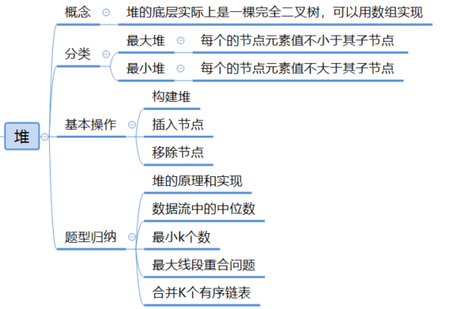
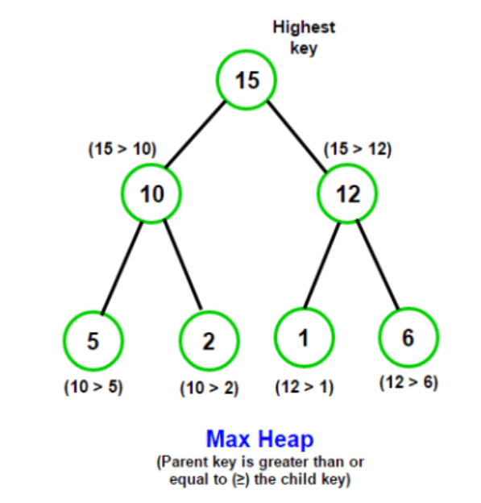
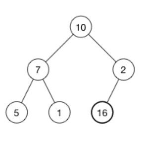
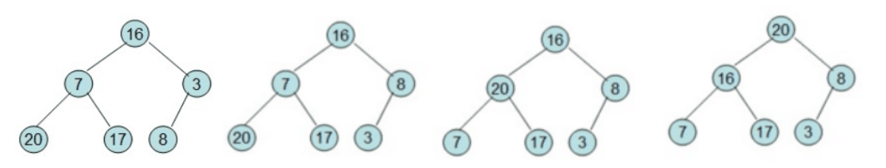
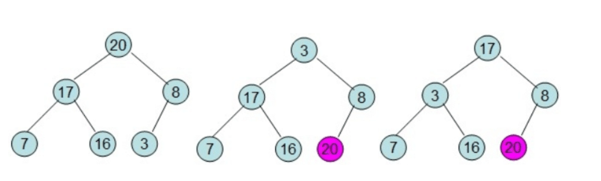
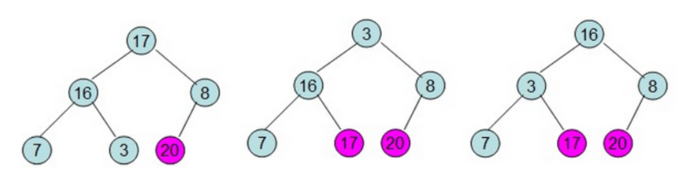
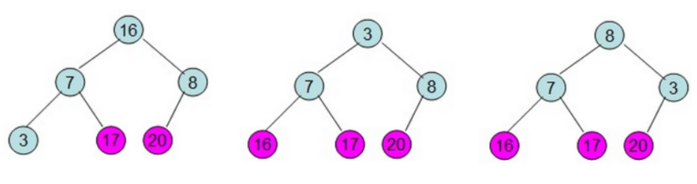
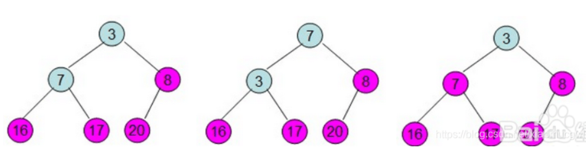

# 堆




## 完全二叉树和满二叉树

* 完全二叉树：若二叉树的深度为h，则除第h层外，其他层的结点全部达到最大值，且第h层的所有结点都集中在左子树。


 

* 满二叉树：满二叉树是一种特殊的的完全二叉树，所有层的结点都是最大值。

## 堆分类

1. 大顶堆（Max Heap）：大顶堆中，**每个节点的值都大于或等于其子节点的值**。堆顶元素是集合中的最大值。

   

2. 小顶堆（Min Heap）：小顶堆中，**每个节点的值都小于或等于其子节点的值**。堆顶元素是集合中的最小值。

   

3. 二叉堆（Binary Heap）：二叉堆是堆的一种常见实现方式，它使用完全二叉树来存储堆结构，并通过数组来表示。它可以分为大顶堆和小顶堆。

4. 斐波那契堆（Fibonacci Heap）：斐波那契堆是一种更高级的堆数据结构，它在某些操作上具有更高的效率，例如合并堆和减小关键字操作。它是由多个最小堆组成的，可以包含相同的关键字。

## 堆特点

堆（Heap）是一种基于完全二叉树的数据结构，用于有效地维护和管理具有优先级或排序要求的元素集合。

特点：

1. **完全二叉树结构**：堆是一种完全二叉树，即**除了最后一层外，其他层的节点都是满的**，且最后一层的节点从左到右依次填入。
2. **堆序性**：堆满足堆序性质，即在大顶堆中，每个节点的值都大于或等于其子节点的值；在小顶堆中，每个节点的值都小于或等于其子节点的值。
3. **最值快速访问**：堆的根节点（堆顶）存储了集合中的最大值（大顶堆）或最小值（小顶堆），因此**可以在常量时间复杂度内访问到最值元素**。
4. **插入和删除高效**：向堆中插入元素和删除堆顶元素的时间复杂度都是 O(log n)，其中 n 是堆中元素的数量。


## 堆操作

### 初始化大顶堆

**堆的存储结构：数组**

初始化过程，可以使用数组来表示堆的结构，并通过堆化操作将数组转化为大顶堆。

>  示例：原始数据为  [4, 1, 3, 2, 16, 9, 10, 14, 8, 7]，采用顺序存储方式，对应的完全二叉树如下图所示：
>
> 

假设树的节点个数为 `n`，以 `1` 为下标开始编号，直到 `n` 结束。对于节点 `i`，其父节点为 `i/2`；左孩子节点为 `2i`，右孩子节点为`2i+1`。最后一个节点的下标为 `n`，其父节点的下标为 `n/2`。

#### Shift-UP

**shift-up 过程**：找到每个非叶子节点与它的叶子比较，将值较大的节点与当前节点交换位置；

> 例如一颗二叉树为：
>
> 找到最后一个非叶子节点 `2` 的子节点为 `16`，堆化当前节点：由于 16 > 2，将 16 与 2 交换位置;
>
> 

#### 一次堆调整

1. 首先找到最后一个节点父节点 `i`，从这个节点开始堆化（节点数量为 `n` 的树，最后一个节点父节点位置为  `n/2`）；
2. 一次堆调整：
   * 记录节点 `i` 位置，作为默认最大值的节点；
   * 获取节点 `i` 的子节点（位置为 `2i`）分别比较当前节点左右子节点与当前节点大小；
   * 记录最大值节点的位置；
   * 将最大值的子节点与当前节点 `i` 的位置替换；
3. 依次按照以上步骤调整`i-1` 的非叶子子节点，直到调整到根节点；
4. 调整到根节点后，此时根节点值为当前所有节点的最大值；

> 示例：原始数据为  [4, 1, 3, 2, 16, 9, 10, 14, 8, 7]，采用顺序存储方式，对应的完全二叉树如下图所示：
>
> 
>
> 对该二叉树堆初始化过程如下：
>
> 


#### 完整堆化

1. 第一步：一次堆调整；
   1. 首先找到最后一个节点父节点 `i`，从这个节点开始堆化（节点数量为 `n` 的树，最后一个节点父节点位置为  `n/2`）；
   2. 一次堆调整：
      * 记录节点 `i` 位置，作为默认最大值的节点；
      * 获取节点 `i` 的子节点（位置为 `2i`）分别比较当前节点左右子节点与当前节点大小；
      * 记录最大值节点的位置；
      * 将最大值的子节点与当前节点 `i` 的位置替换；
   3. 依次按照以上步骤调整`i-1` 的非叶子子节点，直到调整到根节点；
   4. 调整到根节点后，此时根节点值为当前所有节点的最大值；
2. 第二步：将根节点与 第 n 个节点交换位置；
3. 第三步：从位置为 `n-1` 节点的父节点重复以上堆化过程；

> 给定一个整形数组 [16,7,3,20,17,8]，对其进行堆排序。首先根据该数组元素构建一个完全二叉树，具体过程如下 (从左到右，从上到下按顺序一步一步的详细过程)：
>
> * 第一次堆调整：
>
>   ​	
>
> * 第二次堆调整：交换根节点 `20` 与 最后一个节点 `3` 位置，从 `n-1` 个节点开始堆调整；
>
>   
>
> * 第三次堆调整：交换根节点 `17` 与 `n-1` 个节点 `3` 位置，从 `n-2` 个节点开始堆调整；
>
>   
>
> * 第四次堆调整：
>
>   
>
> * 第五次堆调整：
>
>   

实现：

```js
class MaxHeap {
  constructor() {
    this.heap = [];
  }

  // 初始化大顶堆
  buildHeap(arr) {
    this.heap = arr;
    const n = this.heap.length;

    // 从最后一个非叶子节点开始进行堆化
    for (let i = Math.floor(n / 2) - 1; i >= 0; i--) {
      this.heapify(i, n);
    }
  }

  // 堆化函数
  heapify(index, size) {
    const left = 2 * index + 1; // 左孩子节点的索引
    const right = 2 * index + 2; // 右孩子节点的索引
    let largest = index; // 假设当前节点最大

    // 比较当前节点和左孩子节点的值，更新最大值的索引
    if (left < size && this.heap[left] > this.heap[largest]) {
      largest = left;
    }

    // 比较当前节点和右孩子节点的值，更新最大值的索引
    if (right < size && this.heap[right] > this.heap[largest]) {
      largest = right;
    }

    // 如果最大值的索引不是当前节点，交换当前节点与最大值节点的值，并递归地对最大值节点进行堆化
    if (largest !== index) {
      [this.heap[index], this.heap[largest]] = [this.heap[largest], this.heap[index]];
      this.heapify(largest, size);
    }
  }
}

// 示例使用：
const maxHeap = new MaxHeap();
const arr = [4, 10, 3, 5, 1];
maxHeap.buildHeap(arr);
console.log(maxHeap.heap); // 输出大顶堆的数组表示 [10, 5, 3, 4, 1]
```

> 思路描述：
>
> 1. 创建一个大顶堆类 `MaxHeap`，并在构造函数中初始化一个空数组 `heap`，用于存储堆的元素。
> 2. 在 `buildHeap` 方法中接收一个数组 `arr` 作为参数，将其赋值给 `this.heap`。
> 3. 获取堆的长度 `n`。
> 4. 从最后一个非叶子节点开始，向上依次对每个节点进行堆化操作。
> 5. 在 `heapify` 方法中，传入当前节点的索引 `index` 和堆的大小 `size`。
> 6. 计算当前节点的左孩子节点索引 `left` 和右孩子节点索引 `right`。
> 7. 假设当前节点是最大值，将其索引赋值给 `largest`。
> 8. 比较当前节点与左孩子节点的值，如果左孩子节点的值更大，则更新 `largest` 的值为左孩子节点的索引。
> 9. 比较当前节点与右孩子节点的值，如果右孩子节点的值更大，则更新 `largest` 的值为右孩子节点的索引。
> 10. 如果 `largest` 不等于当前节点的索引，说明当前节点不满足大顶堆的性质，交换当前节点与最大值节点的值，并递归地对最大值节点进行堆化操作。
> 11. 在大顶堆初始化完成后，堆的数组表示即为初始化后的大顶堆。

### 大顶堆插入

1. 将新节点添加到堆的末尾（数组末尾）；
2. 进行一次堆调整操作；

```js
class MaxHeap {
  constructor() {
    this.heap = [];
  }

  // 插入节点
  insert(value) {
    this.heap.push(value); // 将新节点添加到堆的末尾
    this.heapifyUp(this.heap.length - 1); // 对新节点进行向上调整操作
  }

  // 向上调整函数
  heapifyUp(index) {
    let parent = Math.floor((index - 1) / 2); // 父节点的索引

    // 如果当前节点不是堆顶且大于父节点的值，交换当前节点与父节点的值，并递归地对父节点进行向上调整
    while (index > 0 && this.heap[index] > this.heap[parent]) {
       // 交换当前节点与父节点的值
      [this.heap[index], this.heap[parent]] = [this.heap[parent], this.heap[index]];
      index = parent; // 记录父节点位置
      parent = Math.floor((index - 1) / 2); // 从父节点上一个节点重新开始调整
    }
  }
}

// 示例使用：
const maxHeap = new MaxHeap();
maxHeap.insert(4);
maxHeap.insert(10);
maxHeap.insert(3);
maxHeap.insert(5);
maxHeap.insert(1);
console.log(maxHeap.heap); // 输出大顶堆的数组表示 [10, 5, 3, 4, 1]
```

> 思路描述：
>
> 1. 创建一个大顶堆类 `MaxHeap`，并在构造函数中初始化一个空数组 `heap`，用于存储堆的元素。
> 2. 在 `insert` 方法中接收一个值 `value` 作为参数。
> 3. 将新节点的值 `value` 添加到堆的末尾，即将其推入 `heap` 数组中。
> 4. 获取新节点的索引 `index`，即为 `heap` 数组的长度减一。
> 5. 调用 `heapifyUp` 方法，传入新节点的索引 `index`，进行向上调整操作。
> 6. 在 `heapifyUp` 方法中，计算新节点的父节点索引 `parent`。
> 7. 如果当前节点不是堆顶且大于父节点的值，交换当前节点与父节点的值，并更新当前节点的索引为父节点的索引，继续向上调整。
> 8. 重复步骤 7，直到当前节点是堆顶或不大于父节点的值为止。
> 9. 在插入节点完成后，堆的数组表示即为插入节点后的大顶堆。

### 大顶堆删除最大值

1. 将堆顶节点与最后一个节点交换；
2. 删除最后一个节点；
3. 进行一次堆调整操作；

```js
class MaxHeap {
  constructor() {
    this.heap = [];
  }

  // 删除堆顶节点
  delete() {
    if (this.heap.length === 0) {
      return null; // 堆为空，返回 null
    }

    const root = this.heap[0]; // 保存堆顶节点的值
    const lastNode = this.heap.pop(); // 移除最后一个节点
    if (this.heap.length > 0) {
      this.heap[0] = lastNode; // 将最后一个节点放置到堆顶
      this.heapifyDown(0); // 对堆顶节点进行向下调整操作
    }

    return root; // 返回堆顶节点的值
  }

  // 向下调整函数
  heapifyDown(index) {
    const n = this.heap.length;
    const left = 2 * index + 1; // 左孩子节点的索引
    const right = 2 * index + 2; // 右孩子节点的索引
    let largest = index; // 假设当前节点最大

    // 比较当前节点和左孩子节点的值，更新最大值的索引
    if (left < n && this.heap[left] > this.heap[largest]) {
      largest = left;
    }

    // 比较当前节点和右孩子节点的值，更新最大值的索引
    if (right < n && this.heap[right] > this.heap[largest]) {
      largest = right;
    }

    // 如果最大值的索引不是当前节点，交换当前节点与最大值节点的值，并递归地对最大值节点进行向下调整
    if (largest !== index) {
      [this.heap[index], this.heap[largest]] = [this.heap[largest], this.heap[index]];
      this.heapifyDown(largest);
    }
  }
}

// 示例使用：
const maxHeap = new MaxHeap();
maxHeap.heap = [10, 5, 3, 4, 1];
const deletedNode = maxHeap.delete();
console.log(deletedNode); // 输出删除的堆顶节点的值
console.log(maxHeap.heap); // 输出大顶堆的数组表示 [5, 4, 3, 1]
```

> 思路描述：
>
> 1. 创建一个大顶堆类 `MaxHeap`，并在构造函数中初始化一个空数组 `heap`，用于存储堆的元素。
> 2. 在 `delete` 方法中检查堆是否为空。如果堆为空，返回 null。
> 3. 保存堆顶节点的值 `root`。
> 4. 移除堆的最后一个节点，并将其保存为 `lastNode`。
> 5. 如果堆还有其他节点，将 `lastNode` 的值放置到堆顶，即将其赋值给 `this.heap[0]`。
> 6. 调用 `heapifyDown` 方法，传入堆顶节点的索引 `0`，进行向下调整操作。
> 7. 在 `heapifyDown` 方法中，计算当前节点的左孩子节点索引 `left` 和右孩子节点索引 `right`。
> 8. 假设当前节点是最大值，将其索引赋值给 `largest`。
> 9. 比较当前节点与左孩子节点的值，如果左孩子节点的值更大，则更新 `largest` 的值为左孩子节点的索引。
> 10. 比较当前节点与右孩子节点的值，如果右孩子节点的值更大，则更新 `largest` 的值为右孩子节点的索引。
> 11. 如果 `largest` 不等于当前节点的索引，说明当前节点不满足大顶堆的性质，交换当前节点与最大值节点的值，并递归地对最大值节点进行向下调整。
> 12. 如果 `largest` 不等于当前节点的索引，说明当前节点不满足大顶堆的性质，交换当前节点与最大值节点的值，并递归地对最大值节点进行向下调整。
> 13. 重复步骤 11，直到当前节点满足大顶堆的性质或没有子节点为止。
> 14. 在删除节点完成后，返回保存的堆顶节点的值 `root`。
> 15. 堆的数组表示即为删除节点后的大顶堆。


## 算法题

### 最小 k 个数字

输入`n`个整数，找出其中最小的K个数。例如输入`4,5,1,6,2,7,3,8`这`8`个数字，则最小的`4`个数字是`1,2,3,4`。

**排序法**

> - 将输入的n个整数进行排序。
> - 取排序后的前K个数即为最小的K个数。

```js
// 排序法
function findKSmallest_Sort(nums, k) {
  nums.sort((a, b) => a - b); // 数组排序
  return nums.slice(0, k); // 取前K个数
}
```


**堆（Heap）法**

> - 使用最大堆（Max Heap）数据结构来保存最小的K个数。
> - 遍历输入的n个整数，将每个数与最大堆的堆顶元素进行比较。
>   - 如果当前数小于堆顶元素，则将堆顶元素替换为当前数，并进行堆的调整（向下调整）。
>   - 如果当前数大于或等于堆顶元素，则继续遍历下一个数。
> - 最终，最大堆中的元素即为最小的K个数。

```js
// 堆（Heap）法
function findKSmallest_Heap(nums, k) {
  const maxHeap = []; // 最大堆
  for (let i = 0; i < nums.length; i++) {
    if (maxHeap.length < k) {
      // 堆未满时，直接插入当前数
      maxHeap.push(nums[i]);
      heapifyUp(maxHeap, maxHeap.length - 1);
    } else if (nums[i] < maxHeap[0]) {
      // 当前数小于堆顶元素时，替换堆顶元素并进行堆调整
      maxHeap[0] = nums[i];
      heapifyDown(maxHeap, 0);
    }
  }
  return maxHeap;
}

// 向上调整最大堆
function heapifyUp(nums, i) {
  const parent = Math.floor((i - 1) / 2);
  if (parent >= 0 && nums[i] > nums[parent]) {
    [nums[i], nums[parent]] = [nums[parent], nums[i]];
    heapifyUp(nums, parent);
  }
}

// 向下调整最大堆
function heapifyDown(nums, i) {
  const left = 2 * i + 1;
  const right = 2 * i + 2;
  let largest = i;

  if (left < nums.length && nums[left] > nums[largest]) {
    largest = left;
  }
  if (right < nums.length && nums[right] > nums[largest]) {
    largest = right;
  }

  if (largest !== i) {
    [nums[i], nums[largest]] = [nums[largest], nums[i]];
    heapifyDown(nums, largest);
  }
}

// 测试示例
const nums = [4, 5, 1, 6, 2, 7, 3, 8];
const k = 4;

console.log(findKSmallest_Sort(nums, k)); // 输出: [1, 2, 3, 4]
console.log(findKSmallest_Heap(nums, k)); // 输出: [1, 2, 3, 4]
```

