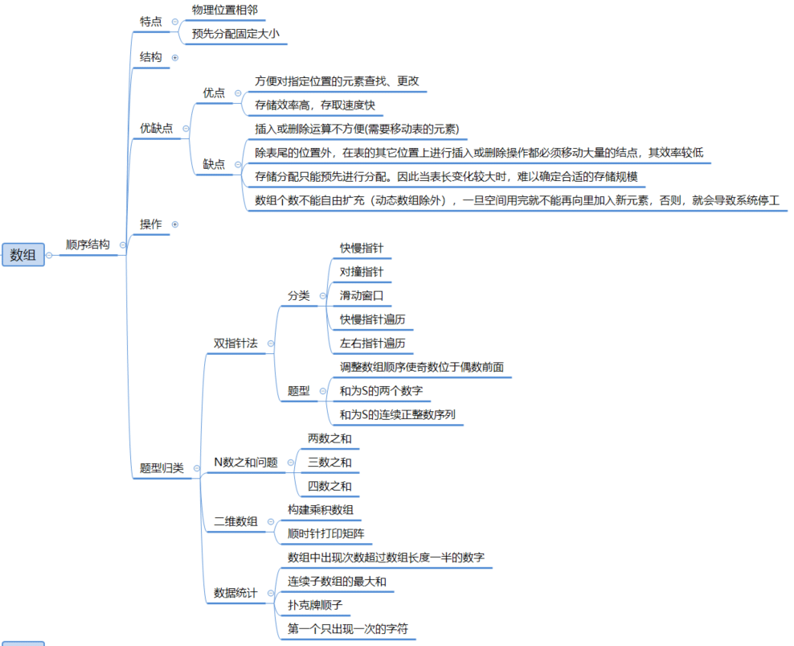
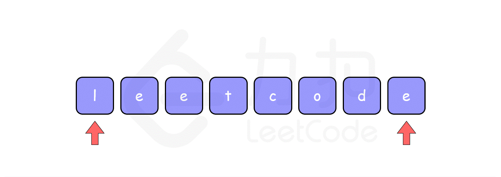

# 数组



## JS 数组 API 实现

### [map()](https://developer.mozilla.org/zh-CN/docs/Web/JavaScript/Reference/Global_Objects/Array/map)

语法

* ```javascript
  var new_array = arr.map(function callback(currentValue[, index[, array]]) {
   // Return element for new_array 
  }[, thisArg])
  ```

注意

* `map`生成一个新数组
* 如果 `thisArg` 参数提供给`map`，则会被用作回调函数的`this`值。否则[`undefined`](https://developer.mozilla.org/zh-CN/docs/Web/JavaScript/Reference/Global_Objects/undefined)会被用作回调函数的`this`值
* `map `不修改调用它的原数组本身

实现

* 遍历数组实现

```javascript
/**
 * array.map(function(currentValue,index,arr), thisValue)方法介绍：
 * 作用：按照原始数组元素顺序依次调用处理函数处理元素
 * @param {Function} fn 元素处理函数
 * @param {Object}  context 可选。对象作为该执行回调时使用，传递给函数，用作 "this" 的值。如果省略了 thisValue，或者传入 null、undefined，那么回调函数的 this 为全局对象
 * @return array 返回一个新数组，数组中的元素为原始数组元素调用函数处理后的值
 */
Array.prototype.myMap = function (fn, context = window) {
  if (typeof fn !== "function") {
    throw new TypeError(`${fn} is not a function`)
  }
  let result = [] 						//返回的新数组
  let arr = this 						//this指向方法调用者，一般方法调用者为数组，所以这里this就是调用该遍历方法的数组
  context = context || window 			//省略context或则context为null、undefined的时候默认使用全局对象
  for (let i = 0; i < arr.length; i++) {
    //往结果数组中添加在context作用域上调用的fn函数的结果,参数为map处理函数的参数：currentValue,index,arr
    result.push(fn.call(context, arr[i], i, arr))
  }
  return result
}
```

* reduce模拟实现

```javascript
Array.prototype.myMap = function (fn, context = window) {
  if (typeof fn !== "function") {
    throw new TypeError(`${fn} is not a function`)
  }
  context = context || window
  //this指向方法调用者,一般该方法调用者为被遍历是数组，所以this指向被遍历的数组
  this.reduce((result, current, index, arr) => {
    result.push(fn.call(context, current, index, arr))
  })
}
```

### [forEach()](https://developer.mozilla.org/zh-CN/docs/Web/JavaScript/Reference/Global_Objects/Array/forEach)

语法

```js
arr.forEach(callback(currentValue [, index [, array]])[, thisArg])
```

注意

* 如果省略了 `thisArg` 参数，或者其值为 `null` 或 `undefined`，`this` 则指向全局对象
* `forEach()` 遍历的范围在第一次调用 `callback` 前就会确定
  * 调用 `forEach` 后添加到数组中的项不会被 `callback` 访问到
  * 如果已经存在的值被改变，则传递给 `callback` 的值是 `forEach()` 遍历到他们那一刻的值
  * 已删除的项不会被遍历到。如果已访问的元素在迭代时被删除了（例如使用 [`shift()`](https://developer.mozilla.org/zh-CN/docs/Web/JavaScript/Reference/Global_Objects/Array/shift)），之后的一个元素将被跳过
* 除了抛出异常以外，没有办法中止或跳出 `forEach()` 循环

实现

```js
Array.prototype.forEach = function(callback, thisArg) {
  if (this == null) {
    throw new TypeError('this is null or not defined');
  }
  if (typeof callback !== "function") {
    throw new TypeError(callback + ' is not a function');
  }
  const O = Object(this);
  const len = O.length >>> 0;
  let k = 0;
  while (k < len) {
    if (k in O) {
      callback.call(thisArg, O[k], k, O);
    }
    k++;
  }
}
```

### [reduce()](https://developer.mozilla.org/zh-CN/docs/Web/JavaScript/Reference/Global_Objects/Array/Reduce)

语法

* ```javascript
  arr.reduce(callback(accumulator, currentValue[, index[, array]])[, initialValue])
  ```

  

注意

* 回调函数第一次执行时，`accumulator` 和`currentValue`的取值有两种情况：
  * 如果调用`reduce()`时提供了`initialValue`，`accumulator`取值为`initialValue`，`currentValue`取数组中的第一个值；
  * 如果没有提供 `initialValue`，那么`accumulator`取数组中的第一个值，`currentValue`取数组中的第二个值。

实现

```javascript
/**
在这个示例中，我们通过 Array.prototype 对象扩展了一个名为 myReduce 的方法。该方法接受两个参数：回调函数 callback 和可选的初始值 initialValue。

在 myReduce 方法内部，我们首先根据 initialValue 的存在与否来确定初始的累加器值 accumulator。如果 initialValue 未提供，则将 accumulator 设置为 undefined，否则将其设置为 initialValue。

然后，我们使用 for 循环遍历原始数组 this（通过 this 可以访问调用 myReduce 方法的数组实例）。在每次循环中，我们将累加器 accumulator 和当前元素应用于回调函数 callback，同时传递当前元素的值、索引和原始数组作为参数。回调函数的返回值将成为下一次迭代的累加器值。

最后，我们返回最终的累加器值 accumulator。
**/
Array.prototype.myReduce = function(callback, initialValue) {
  let accumulator = initialValue === undefined ? undefined : initialValue;

  for (let i = 0; i < this.length; i++) {
    if (accumulator === undefined) {
      accumulator = this[i];
    } else {
      accumulator = callback(accumulator, this[i], i, this);
    }
  }

  return accumulator;
};

```

### [filter()](https://developer.mozilla.org/zh-CN/docs/Web/JavaScript/Reference/Global_Objects/Array/filter)

语法

* ```javascript
  var newArray = arr.filter(callback(element[, index[, array]])[, thisArg])
  ```

注意：

* `filter` 不会改变原数组，它返回过滤后的新数组
* 如果为 `filter` 提供一个 `thisArg` 参数，则它会被作为 `callback` 被调用时的 `this` 值。否则，`callback` 的 `this` 值在非严格模式下将是全局对象，严格模式下为 `undefined`

实现

* 遍历数组实现

```javascript
Array.prototype.myFilter = function (fn, context = window) {
      if (typeof fn !== "function") {
        throw new TypeError(`${fn} is not a function`)
      }
      let result = [] //返回的新数组
      let arr = this //this指向方法调用者，一般方法调用者为数组，所以这里this就是调用该遍历方法的数组
      context = context || window //省略context或则context为null、undefined的时候默认使用全局对象
      for (let i = 0; i < arr.length; i++) {
        if (fn.call(context, arr[i], i, arr)) //调用fn执行，若结果返回为true，将数据放入结果数组
          //往结果数组中添加在context作用域上调用的fn函数的结果,参数为map处理函数的参数：currentValue,index,arr
          result.push(arr[i])
      }
 	return result
}
```

* 使用reduce实现

```javascript
Array.prototype.myFilter = function (fn, context = window) {
  if (typeof fn !== "function") {
    throw new TypeError(`${fn} is not a function`)
  }
  context = context || window
  return this.reduce((result, current, index, arr) => {
    if (fn.call(context, current, index, arr)) {
      result.push(current)
    }
  }, [])
}
```

### [some()](https://developer.mozilla.org/zh-CN/docs/Web/JavaScript/Reference/Global_Objects/Array/some)

语法

* ```javascript
  arr.some(callback(element[, index[, array]])[, thisArg])
  ```

注意

* `some()` 被调用时不会改变数组
* 如果一个`thisArg`参数提供给some()，它将被用作调用的 `callback`的 `this` 值。否则， 它的 `this` value将是 `undefined`

实现

```javascript
Array.prototype.some=function (fn, context = window) {
    let arr = this
    context = context || window
    for(let i=0;i<arr.length;i++){
        if(fn.call(context,this[i],i,arr)) {
            return true
        }
    }
    return false
};
```

### [every()](https://developer.mozilla.org/zh-CN/docs/Web/JavaScript/Reference/Global_Objects/Array/every)

语法

* ```javascript
  arr.every(callback(element[, index[, array]])[, thisArg])
  ```

注意

* `every` 不会改变原数组
* 如果省略 thisArg 参数，则 `callback` 被调用时的 `this` 值，在非严格模式下为全局对象，在严格模式下传入 `undefined`

实现

```javascript
Array.prototype.every=function (fn,context = window) {
    let arr = this
    context  = context || window
    for(let i=0;i<arr.length;i++){
        if(!fn.call(context,this[i],i,arr)) {
            return false
        }
    }
    return true
};
```

### [flat()](https://developer.mozilla.org/zh-CN/docs/Web/JavaScript/Reference/Global_Objects/Array/flat)

* 数组扁平化：指将多维数组转化成一维数组

语法

```javascript
var newArray = arr.flat([depth])
```

实现

* 遍历扁平化

```javascript
/**
 * 使用扩展运算符和some方法
 * some方法：用于检测数组中的元素是否满足指定条件（函数提供）；会依次执行数组的每个元素：
 * 如果有一个元素满足条件，则表达式返回true , 剩余的元素不会再执行检测。如果没有满足条件的元素，则返回false
 * 思想：some检测数组元素中是否含有数组，如果是则扩展这一层数组，循环知道数组中没有数组
 * @param {Array} arr 多维数组
 * @return faltArr 扁平化后的数组
 */
function flatten(arr) {
  while (arr.some(Array.isArray)) {//检测数组中元素是否包含数组
    arr = [].concat(...arr) //扩展这一层数组
  }
  return arr
}
```

* 递归扁平化

```js
// 使用 reduce、concat 和递归展开无限多层嵌套的数组
var arr1 = [1,2,3,[1,2,3,4, [2,3,4]]];

function flatten(arr, d = 1) {
   return d > 0 ? arr.reduce((acc, val) => acc.concat(Array.isArray(val) ? flatten(val, d - 1) : val), [])
                : arr.slice();
};

flatten(arr1, Infinity);
// [1, 2, 3, 1, 2, 3, 4, 2, 3, 4]
```

```js
/**
 * 遍历数组元素，判断元素是否为数组，如果是，则递归扁平并合并到新数组，否则放入新数组
 * @param {Array} arr 多维数组
 * @return 扁平后的一维数组
 */
function flatten(arr) {
  let flatArr = []
  for (let i = 0; i < arr.length; i++) {
    if (Array.isArray(arr[i])) {
      flatArr = flatArr.concat(flatten(arr[i]))
    } else {
      flatArr.push(arr[i])
    }
  }
  return flatArr
}
```

```javascript
/**
递归的方式来处理嵌套数组
**/
function flatten(arr) {
  const flatArr = [];
  
  function flattenHelper(arr) {
    for (let i = 0; i < arr.length; i++) {
      if (Array.isArray(arr[i])) {
        flattenHelper(arr[i]);
      } else {
        flatArr.push(arr[i]);
      }
    }
  }
  
  flattenHelper(arr);
  
  return flatArr;
}
```

## 数组操作

### 数组插入数据

* 题目：在线性表的第i个元素中插入元素e

* 思路：

  * 方法一：将所有第i个元素数据后面元素后移一位，将元素e插入第i个位置
  * 方法二：使用数组的splice(index,howmany,item1,.....,itemX)方法实现

* 分析：时间复杂度O(n)

* 实现：

  ```javascript
  /**
   * 
   * @param { number } i 插入位置
   * @param { ElementType } e 插入元素
   * @param { ElementList } list 元素列表
   */
  function ListInsert(i, e, list) {
    if (i > list.length || i <= 0) {
      return list
    }
    list.length = list.length + 1 //数组增加一个位子
    for (let j = list.length - 2; j >= list.length - i - 1; j--) {
      list[j + 1] = list[j]
    }
    list[i - 1] = e
    return list
  }
  //----------------测试---------------------
  let a = [9, 8, 7, 6, 5, 4, 3, 2, 1]
  let b = ListInsert(3, 10, a)
  console.log(b)
  ```

  

#### 数组删除数据

* 题目：在线性表的删除第i个元素

* 思路：

  * 方法一：将所有第i个元素数据后面元素前移一位
  * 方法二：使用数组的splice(index,howmany,item1,.....,itemX)方法实现

* 分析：时间复杂度O(n)

* 实现：

  ```javascript
  function ListDelete(i, list) {
    if (i <= 0 || i > list.length) {
      return list
    }
    for (let j = i - 1; j < list.length; j++) {
      list[j] = list[j + 1]
    }
    list.length = list.length - 1
    return list
  }
  //------------------测试--------------------
  let a = [1, 2, 3, 4, 5, 6, 6, 7, 8, 9]
  let b = ListDelete(5, a)
  console.log(b)
  ```

  

### 数组去重

#### 使用双层循环

```js
/**
 * 思想：循环遍历数组，循环查找当前数组重复数字
 * 分析：时间复杂度 O(n^2)，空间复杂度 O(1)
 * @param {Array} arr 包含重复元素数组
 * @return array
 */
function unique(arr) {
  for (let i = 0; i < arr.length; i++) {
    for (let j = i + 1; j < arr.length; j++) {
      if (arr[i] === arr[j]) {
        arr.splice(j, 1)
        i-- //删除后后移下标
      }
    }
  }
}
```

#### 使用Array.indexOf()

```js
//indexOf()方法：返回数组中某个元素首次出现的位置
/**
 * 思想：使用indeof()方法判断，遍历数组，当当前数据下标不等于它首次出现位置的下标时，认为重复数据，去除
 * 分析：
时间复杂度分析：

外层循环 for (let i = 0; i < arr.length; i++) 遍历了数组中的每个元素，所以它的时间复杂度是 O(n)，其中 n 是数组的长度。
内层循环中的 arr.indexOf(arr[i]) 调用了 indexOf 方法，它需要在数组中进行线性搜索来查找元素的索引。在最坏的情况下，如果数组中没有重复元素，它需要遍历整个数组，时间复杂度为 O(n)。当删除重复元素后，剩余元素会向前移动，导致后续的 indexOf 调用的时间复杂度也是 O(n)。
splice 方法的时间复杂度是 O(n)，因为它需要移动数组中的元素来填补删除的空位。
综上所述，该算法的时间复杂度是 O(n^2)，其中 n 是数组的长度。

空间复杂度分析：
该算法没有使用额外的空间来存储元素，只是在原地修改数组。因此，它的空间复杂度是 O(1)，即常数级别的空间复杂度。

 * @param {Array} arr 包含重复元素数组
 * @return array
 */
function unique1(arr) {
  for (let i = 0; i < arr.length; i++) {
    if (arr.indexOf(arr[i]) != i) {
      arr.splice(i, 1)
      i--
    }
  }
  return arr
}
```

```js
/**
 * 思想: 使用indexOf方法：遍历数组，判断当前数据下标是否为该数据首次出现下标，如果是，则加入另一个数组；该数组为去重后的数组
 * 分析：时间复杂度O(n^2)，空间复杂度O(n)
 * @param {Array} arr 包含重复元素数组
 * @return uArray
 */
function unique2(arr) {
  let uArr = []
  for (let i = 0; i < arr.length; i++) {
    if (arr.indexOf(arr[i]) === i) { //为数据首次出现下标
      uArr.push(arr[i])
    }
  }
  return uArr
}
```

```js
/**
 * 思想：使用indexOf方法：创建一个数组，该数组为去重数据后的数组；遍历数组，判断去重数据后的数组中是否存在该数据，不存在则添加，否则跳过
 * 分析：时间复杂度O(n^2)，空间复杂度O(n)
 * @param {Array} arr 包含重复元素数组
 * @return uArray
 */
function unique3(arr) {
  let uArr = []
  for (let i = 0; i < arr.length; i++) {
    if (uArr.indexOf(arr[i] == -1)) { //判断数据是否存在
      uArr.push(arr[i])
    }
  }
  return uArr
}
```

#### 使用Array.filter()

```js
//filter():遍历并检测数组，返回一个新的数组，新数组中的元素是通过检查指定数组中符合条件的所有元素
/**
 * 思想：使用filter过滤出数组中元素首次出现的下标与当前遍历的下标值相同的元素
 时间复杂度分析：

filter 方法本身会遍历数组中的每个元素，并对每个元素执行给定的回调函数。因此，它的时间复杂度是 O(n)，其中 n 是数组的长度。
在回调函数中，arr.indexOf(current) 调用了 indexOf 方法来查找当前元素在数组中的索引位置。在最坏的情况下，如果数组中没有重复元素，则需要遍历整个数组，时间复杂度为 O(n)。当数组中有重复元素时，indexOf 方法的时间复杂度依然是 O(n)。
综上所述，该算法的时间复杂度是 O(n^2)，其中 n 是数组的长度。
空间复杂度分析：

该算法创建了一个新的数组作为结果，其大小取决于满足条件的元素数量。在最坏的情况下，当所有元素都满足条件时，新数组的大小与原始数组的大小相同。因此，空间复杂度是 O(n)，其中 n 是数组的长度。
 * @param {Array} arr 包含重复元素数组
 * @return array
 */
function unique(arr) {
  return arr.filter((current, index) => {
    arr.indexOf(current) === index //返回下标与数组首次出现下标位置相同数据
  })
}
```

```js
function unique(arr) {
  return arr.filter((current, index) => {
    arr.indexOf(current) === arr.lastIndexOf(current) //返回首次出现下标和最后一次出现下标相同数据
  })
}
```

```js
//hasOwnProperty()方法返回一个布尔值，该布尔值指示对象是否具有指定的属性作为其自身的属性（而不是继承它）
/**
 * 思想：开辟一个外部存储空间用于标示元素是否出现过，过滤出外部存储空间中没有出现过的元素
 
 时间复杂度分析：

初始化对象 container 的操作是一个常数时间的操作，不会对时间复杂度产生显著影响。
filter 方法本身会遍历数组中的每个元素，并对每个元素执行给定的回调函数。因此，它的时间复杂度是 O(n)，其中 n 是数组的长度。
在回调函数中，container.hasOwnProperty(current) 检查当前元素是否已经存在于 container 对象中。由于对象的查找操作的时间复杂度是 O(1)，所以该检查是一个常数时间的操作。
如果当前元素已经存在于 container 对象中，回调函数返回 false，表示当前元素不满足条件，将被过滤掉。否则，将当前元素添加到 container 对象，并返回 true，表示当前元素满足条件，将被保留在新数组中。
综上所述，该算法的时间复杂度是 O(n)，其中 n 是数组的长度。
空间复杂度分析：

该算法使用了一个对象 container 来存储已经出现过的元素。在最坏的情况下，当数组中的所有元素都是唯一的时候，container 对象的大小将与数组的长度相同。因此，空间复杂度是 O(n)，其中 n 是数组的长度。
额外创建的新数组的大小取决于满足条件的元素数量，但在空间复杂度分析中，通常只考虑额外使用的空间，而不考虑输入和输出的空间占用。
 * @param {Array} arr 包含重复元素数组
 */
function unique(arr) {
  let container = {}
  return arr.filter((current, index) => {
    container.hasOwnProperty(current) ? false : (container[currnet] = true)
  })
}
```

#### 使用Array.includes()

```js
/**
 * includes方法判断一个数组是否包含一个指定元素，是返回true，否则返回false
 * 思想：新建去重数组，遍历原数组判断去重数组是否存在数据，不存在则添加进去重数组
 时间复杂度分析：

循环 for (let i = 0; i < arr.length; i++) 遍历了原始数组中的每个元素，所以它的时间复杂度是 O(n)，其中 n 是数组的长度。
在循环中，使用 includes 方法来检查 uArr 数组是否已经包含当前元素。includes 方法需要遍历 uArr 数组来查找元素，所以在最坏的情况下，它的时间复杂度也是 O(n)。
uArr.push(arr[i]) 操作在每次循环中将元素添加到 uArr 数组中。在最坏的情况下，每个元素都需要被添加到 uArr 数组中，所以这个操作的时间复杂度也是 O(n)。
综上所述，该算法的时间复杂度是 O(n^2)，其中 n 是数组的长度。
空间复杂度分析：

该算法创建了一个新的数组 uArr 来存储去重后的元素。在最坏的情况下，当原始数组中的所有元素都是唯一的时候，uArr 数组的大小将与原始数组的大小相同。因此，空间复杂度是 O(n)，其中 n 是数组的长度。
需要注意的是，该算法没有使用额外的空间来存储其他中间结果，所以除了 uArr 数组外，没有额外的空间开销。
 * @param {Array} arr 包含重复元素数组
 * @return array
 */
function unique(arr) {
  let uArr = []
  for (let i = 0; i < arr.length; i++) {
    if (!uArr.includes(arr[i])) { //去重数据总不包含
      uArr.push(arr[i])
    }
  }
}
```

#### 使用Set()

```js
/**
 * 思想：创建数组的Set集合，将Set结合转化为数组
 
 时间复杂度分析：

创建 Set 对象的时间复杂度是 O(n)，其中 n 是数组的长度。在构建 Set 对象时，它会遍历数组中的每个元素并将其添加到 Set 中。由于 Set 数据结构的特性，它会自动去重，确保只有唯一的元素被保留。
Array.from 方法将 Set 对象转换为数组，时间复杂度也是 O(n)，其中 n 是 Set 中不重复元素的数量。
综上所述，该算法的时间复杂度是 O(n)，其中 n 是数组的长度。
空间复杂度分析：

该算法使用了一个额外的 Set 对象来存储不重复的元素。在最坏的情况下，如果原始数组中的所有元素都是唯一的，Set 对象的大小将与原始数组的大小相同。因此，空间复杂度是 O(n)，其中 n 是数组的长度。
Array.from 方法创建了一个新的数组，其大小与 Set 中不重复元素的数量相同。因此，额外的空间开销也是 O(n)。
需要注意的是，该算法没有使用额外的空间来存储其他中间结果。
总结：
该算法具有线性的时间复杂度和线性的空间复杂度，相对较高效。通过利用 Set 的自动去重特性，以及使用内置的 Array.from 方法，可以快速实现数组去重操作。在处理大型数据集时，该算法通常比较高效。

 * @param {Array} arr 包含重复元素数组
 * @return array
 */
function unique(params) {
  return Array.from(new Set(arr))
}

```

#### 排序后去重

```js
/**
 * 思想：数组排序后比较相邻数组是否相同，不相同时添加进入去重后的数组
 * 分析：时间复杂度O（n），空间复杂度O（n）
 * @param {Array} arr 包含重复元素数组
 * @return array
 */
function unique(arr) {
  let uArr = []
  arr.sort()//将数组排序，使相同值的数据相邻
  uArr.push(arr[0])//保存排序后第一个数据
  for (let i = 1; i < arr.length; i++) {//从数组第二个数据开始遍历，判断是否与前一个数据相同，不相同则保存
    if (arr[i] != arr[i - 1]) {
      uArr.push(arr[i])
    }
  }
  return uArr
}
```

### 类数组转化为数组

* 概念：
  * 类数组是具有**length**属性，但不具有数组原型上的方法
  * 常见的类数组有**arguments**、DOM操作方法返回的结果，比如 `document.getElementsByTagName()`

#### 使用[Array.from](https://developer.mozilla.org/zh-CN/docs/Web/JavaScript/Reference/Global_Objects/Array/from)

```js
Array.from(document.querySelectorAll('div'))
```

#### Array.prototype.slice.call()

* [slice()](https://developer.mozilla.org/zh-CN/docs/Web/JavaScript/Reference/Global_Objects/Array/slice)方法可以用来将一个类数组（Array-like）对象/集合转换成一个新数组。你只需将该方法绑定到这个对象上

```js
Array.prototype.slice.call(arguments)
```

#### 扩展运算符

```js
[...arguments]
```

#### 利用[concat()](https://developer.mozilla.org/zh-CN/docs/Web/JavaScript/Reference/Global_Objects/Array/concat)

```js
Array.prototype.concat.apply([], arguments);
```

## 算法题


## 双指法

双指针问题是数据结构和算法中常见的一类问题，其解题思路和方法可以总结如下：

1. **分离双指针**：两个指针分别属于不同的数组，两个指针分别在两个数组中移动。
2. **快慢指针**：快慢指针是双指针问题中常见的一种形式。一般情况下，快指针每次移动2步，慢指针每次移动1步，通过比较快慢指针所指的元素来解决问题。快慢指针常用于**链表相关问题**，如判断链表是否有环、找到链表的中间节点等。
3. **对撞指针**：对撞指针也称为左右指针，分别从数组或字符串的两端开始向中间移动，通过比较指针所指的元素来解决问题。对撞指针常**用于有序数组或字符串的查找问题**，如两数之和、三数之和、反转字符串等。
4. **滑动窗口**：滑动窗口是一种基于双指针的技巧，用于处理数组或字符串中的子串或子数组问题。滑动窗口由左右指针构成，左指针指向窗口的起始位置，右指针向后移动扩展窗口，通过调整左右指针的位置来滑动窗口。滑动窗口常用于求解**最长子串、最小覆盖子串**等问题。
5. **快慢指针遍历**：在某些情况下，可以使用快慢指针同时遍历数组或链表。快指针每次移动多步，慢指针每次移动一步，通过比较快慢指针所指的元素来解决问题。这种方法常用于**查找链表的倒数第k个节点、判断链表是否有环**等问题。
6. **左右指针遍历**：在某些情况下，可以使用左右指针同时从数组的两端向中间遍历。通过调整左右指针的位置来解决问题，如**反转数组、移除元素**等。

注意：处理好边界条件和循环终止条件，以确保算法的正确性和效率。


### **分离双指针**

使用两个指针分别属于不同的数组，两个指针分别在两个数组中移动。

分离双指针一般用于处理有序数组合并，求交集、并集问题。


#### 分离双指针伪代码模板

```javascript
let nums1 = [/* 这里是你的数组元素 */];  
let nums2 = [/* 这里是你的数组元素 */];  
let left_1 = 0;  
let left_2 = 0;  
  
while (left_1 < nums1.length && left_2 < nums2.length) {  
    if (/* 一定条件 1 */) {  
        left_1 += 1;  
        left_2 += 1;  
    } else if (/* 一定条件 2 */) {  
        left_1 += 1;  
    } else if (/* 一定条件 3 */) {  
        left_2 += 1;  
    }  
      
    // 这里可以添加一些额外的逻辑，比如打印当前索引等  
    // console.log('left_1:', left_1, 'left_2:', left_2);  
}  
  
// 循环结束后，left_1 和 left_2 将是循环结束时的索引值
```

#### **题集**

| 题号 | 标题                                                         | 标签                                 | 难度 |
| ---- | :----------------------------------------------------------- | :----------------------------------- | :--- |
| 0350 | [两个数组的交集 II](https://leetcode.cn/problems/intersection-of-two-arrays-ii/) | 数组、哈希表、双指针、二分查找、排序 | 简单 |
| 0925 | [长按键入](https://leetcode.cn/problems/long-pressed-name/)  | 双指针、字符串                       | 简单 |
| 0844 | [比较含退格的字符串](https://leetcode.cn/problems/backspace-string-compare/) | 栈、双指针、字符串、模拟             | 简单 |
| 1229 | [安排会议日程](https://leetcode.cn/problems/meeting-scheduler/) | 数组、双指针、排序                   | 中等 |
| 0415 | [字符串相加](https://leetcode.cn/problems/add-strings/)      | 数学、字符串、模拟                   | 简单 |
| 0392 | [判断子序列](https://leetcode.cn/problems/is-subsequence/)   | 双指针、字符串、动态规划             | 简单 |

#### **合并有序数组**

**题目：**

已知线性表LA和LB的数据元素按值非递减有序排列，现要求合并LA和LB成一个新的线性表LC，且LC也非递减有序

例如：LA=（3，5，8，11）; LB=（2，6，8，9，11，15，20）

则合并的Lc=(2，3，5，6，8，8，9，11，11，15，20)

**思路：**

>  假设LA中元素为ai,LB中元素为bi,LC中元素为ci,则当ai<=bi时，ci=ai;当ai>bi时，ci=bi

**实现：**

```javascript
/**
 * 合并两个数组
 * @param {Array} La 待合并数组
 * @param {Array} Lb 待合并数组
 * @return {Array} Lc 待合后数组
 */
function mergeList(La, Lb) {
  let i = j = 0;
  let Lc = []
  while (i < La.length || j < Lb.length) {
    if (La[i] <= Lb[j]) {
      Lc.push(La[i])
      i++
    } else {
      Lc.push(Lb[j])
      j++
    }
  }
  while (i < La.length) {
    Lc.push(La[i])
    i++
  }
  while (j < Lb.length) {
    Lc.push(Lb[j])
    j++
  }
  return Lc
}

//-------------------------------测试---------------------
let La = [3, 5, 8, 11]
let Lb = [2, 6, 8, 9, 11, 15, 20]
let Lc = mergeList(La, Lb)
console.log(Lc)
```


#### [两个数组的交集](https://leetcode.cn/problems/intersection-of-two-arrays/description/)

**题目**

给定两个数组 `nums1` 和 `nums2` ，返回 *它们的 交集* 。输出结果中的每个元素一定是 **唯一** 的。我们可以 **不考虑输出结果的顺序** 。

**示例 1：**

```
输入：nums1 = [1,2,2,1], nums2 = [2,2]
输出：[2]
```

**示例 2：**

```
输入：nums1 = [4,9,5], nums2 = [9,4,9,8,4]
输出：[9,4]
解释：[4,9] 也是可通过的
```

**提示：**

- `1 <= nums1.length, nums2.length <= 1000`
- `0 <= nums1[i], nums2[i] <= 1000`

**解法：分离双指针**

> 1. 对数组 𝑛𝑢𝑚𝑠1 、𝑛𝑢𝑚𝑠2  先排序。
> 2. 使用两个指针 𝑙𝑒𝑓𝑡1、𝑙𝑒𝑓𝑡2:
>    * 𝑙𝑒𝑓𝑡1 指向第一个数组的第一个元素，即：𝑙𝑒𝑓𝑡1=0;
>    * 𝑙𝑒𝑓𝑡2 指向第二个数组的第一个元素，即：𝑙𝑒𝑓𝑡‾2=0 
> 3. 如果 𝑛𝑢𝑚𝑠1[𝑙𝑒𝑓𝑡1]=𝑛𝑢𝑚𝑠2[𝑙𝑒𝑓𝑡2]，则将其加入答案数组（注意去重），并将 𝑙𝑒𝑓𝑡‾1*l**e**f**t*1 和 𝑙𝑒𝑓𝑡‾2*l**e**f**t*2 右移。
> 4. 如果 𝑛𝑢𝑚𝑠1[𝑙𝑒𝑓𝑡1]<𝑛𝑢𝑚𝑠2[𝑙𝑒𝑓𝑡2]，则将 𝑙𝑒𝑓𝑡1 右移。
> 5. 如果 𝑛𝑢𝑚𝑠1[𝑙𝑒𝑓𝑡1]>𝑛𝑢𝑚𝑠2[𝑙𝑒𝑓𝑡2]，则将 𝑙𝑒𝑓𝑡2 右移。
> 6. 最后返回答案数组。


```javascript
function intersection(nums1, nums2) {  
    nums1.sort((a, b) => a - b); // 对nums1进行排序  
    nums2.sort((a, b) => a - b); // 对nums2进行排序  
  
    let left1 = 0;  
    let left2 = 0;  
    let result = [];  
  
    while (left1 < nums1.length && left2 < nums2.length) {  
        if (nums1[left1] === nums2[left2]) {  
            // 如果当前元素已经在结果中，则跳过  
            if (!result.includes(nums1[left1])) {  
                result.push(nums1[left1]);  
            }  
            left1++;  
            left2++;  
        } else if (nums1[left1] < nums2[left2]) {  
            left1++;  
        } else {  
            left2++;  
        }  
    }  
  
    return result;  
}  
  
// 示例用法  
const nums1 = [1, 2, 2, 1];  
const nums2 = [2, 2, 3];  
const result = intersection(nums1, nums2);  
console.log(result); // 输出: [2]
```


---


### 对撞指针

#### **题集**

| 题号 | 标题                                                         | 标签                                                   | 难度 |
| :--- | :----------------------------------------------------------- | :----------------------------------------------------- | :--- |
| 0167 | [两数之和 II - 输入有序数组](https://leetcode.cn/problems/two-sum-ii-input-array-is-sorted/) | 数组、双指针、二分查找                                 | 中等 |
| 0344 | [反转字符串](https://leetcode.cn/problems/reverse-string/)   | 双指针、字符串                                         | 简单 |
| 0345 | [反转字符串中的元音字母](https://leetcode.cn/problems/reverse-vowels-of-a-string/) | 双指针、字符串                                         | 简单 |
| 0125 | [验证回文串](https://leetcode.cn/problems/valid-palindrome/) | 双指针、字符串                                         | 简单 |
| 0011 | [盛最多水的容器](https://leetcode.cn/problems/container-with-most-water/) | 贪心、数组、双指针                                     | 中等 |
| 0611 | [有效三角形的个数](https://leetcode.cn/problems/valid-triangle-number/) | 贪心、数组、双指针、二分查找、排序                     | 中等 |
| 0015 | [三数之和](https://leetcode.cn/problems/3sum/)               | 数组、双指针、排序                                     | 中等 |
| 0016 | [最接近的三数之和](https://leetcode.cn/problems/3sum-closest/) | 数组、双指针、排序                                     | 中等 |
| 0018 | [四数之和](https://leetcode.cn/problems/4sum/)               | 数组、双指针、排序                                     | 中等 |
| 0259 | [较小的三数之和](https://leetcode.cn/problems/3sum-smaller/) | 数组、双指针、二分查找、排序                           | 中等 |
| 0658 | [找到 K 个最接近的元素](https://leetcode.cn/problems/find-k-closest-elements/) | 数组、双指针、二分查找、排序、滑动窗口、堆（优先队列） | 中等 |
| 1099 | [小于 K 的两数之和](https://leetcode.cn/problems/two-sum-less-than-k/) | 数组、双指针、二分查找、排序                           | 简单 |
| 0075 | [颜色分类](https://leetcode.cn/problems/sort-colors/)        | 数组、双指针、排序                                     | 中等 |
| 0360 | [有序转化数组](https://leetcode.cn/problems/sort-transformed-array/) | 数组、数学、双指针、排序                               | 中等 |
| 0977 | [有序数组的平方](https://leetcode.cn/problems/squares-of-a-sorted-array/) | 数组、双指针、排序                                     | 简单 |
| 0881 | [救生艇](https://leetcode.cn/problems/boats-to-save-people/) | 贪心、数组、双指针、排序                               | 中等 |
| 0042 | [接雨水](https://leetcode.cn/problems/trapping-rain-water/)  | 栈、数组、双指针、动态规划、单调栈                     | 困难 |
| 0443 | [压缩字符串](https://leetcode.cn/problems/string-compression/) | 双指针、字符串                                         | 中等 |


#### 反转字符串

**题目**

反转数组中的元素。比如数组为 ['l', 'e', 'e', 't', 'c', 'o', 'd', 'e']，反转之后变为 ['e', 'd', 'o', 'c', 't', 'e', 'e', 'l']。

不要给另外的数组分配额外的空间，你必须**[原地](https://baike.baidu.com/item/原地算法)修改输入数组**、使用 O(1) 的额外空间解决这一问题。

**思路：**

> 使用双指针技巧，其思想是分别将两个指针分别指向数组的开头及末尾，然后将其指向的元素进行交换，再将指针向中间移动一步，继续交换，直到这两个指针相遇。
>
> 

```js
/**
 * @param {character[]} s
 * @return {void} Do not return anything, modify s in-place instead.
 */
var reverseString = function(s) {
    if(s.length <=1) return s;
    let start = 0,end = s.length-1;
    let temp = null
    while(start <end) {
        temp     =  s[start];
        s[start] =  s[end];
        s[end]   = temp;
        start ++;
        end --;
    }
    return s;

};
```


#### 调整数组顺序

题目：

输入一个整数数组，实现一个函数来调整该数组中数字的顺序，使得所有的奇数位于数组的前半部分，所有的偶数位于数组的后半部分

**思路：** 

> * 设定两个指针
> * 第一个指针start从数组第一个元素出发，向尾部前进
> * 第二个指针end从数组的最后一个元素出发，向头部前进
> * start遍历到偶数，end遍历到奇数时，交换两个数的位置
> * 当start>end时，完成交换

```javascript
function reOrderArray(arr){
    if(!Array.isArray(arr)) return arr；
    let startIndex = 0；
    let endIndex = arr.length - 1;
    while(startIndex < endIndex) {
        while(startIndex < endIndex && arr[startIndex] % 2 !== 0 ) { //头指针奇数前进
            startIndex ++;
		}
        while(startIndex < endIndex && arr[endIndex] % 2 === 0 ) {// 尾指针偶数后退
        	endIndex --;
        }
        if(startIndex < endIndex) { // 交换奇数和偶数位置
            let temp = arr[startIndex];
            arr[startIndex]  = arr[endIndex];
            arr[endIndex]  = temp;
		}
    }
}

```

#### 和为S的两个数字

**题目：**

输入一个递增排序的数组和一个数字`S`，在数组中查找两个数，使得他们的和正好是`S`，如果有多对数字的和等于`S`，输出两个数的乘积最小的。

**思路：**

> * 使用双指针方法在递增排序的数组中查找两个数，使它们的和等于给定的目标值 `sum`。
> * 其中，`left` 指针指向数组的开头，`right` 指针指向数组的末尾。
> * 在每次循环中，计算当前指针所指向元素的和 `currentSum`。
> * 如果 `currentSum` 等于 `sum`，则表示找到了一对数字，进一步计算它们的乘积 `product`，并与当前最小乘积 `minProduct` 进行比较。
> * 如果 `product` 小于 `minProduct`，则更新 `minProduct` 和结果数组 `result`。
> * 根据递增排序的特性，如果 `currentSum` 小于 `sum`，则将 `left` 指针向右移动，以增加和的值。
> * 如果 `currentSum` 大于 `sum`，则将 `right` 指针向左移动，以减小和的值。
> * 最后，返回结果数组 `result`，其中包含乘积最小的一对数字。
> * 请注意，如果无法找到满足和为 `sum` 的一对数字，则返回的结果数组将为空


```javascript
function findNumbersWidthSum(arr,sum){
    let left = 0;
    let right = arr.length - 1;
    let result = [];
    let minProduct = Infinity;
	while(left < right) {
        let currentSum = arr[left] + arr[right];
        if(currentSum === sum) {
            let product = arr[left] *  arr[right];
            if(product < minProduct) {
                minProduct = product;
                result = [arr[left],arr[right]];
            }
            // 继续计算查找
            right --;
            left ++ ;
        }else if(currentSum < sum) {
            left ++ ;
        }else {
            right --;
        }
    }    
    return [];
}
```


### 快慢指针

#### **题集**

| 题号          | 标题                                                         | 标签                         | 难度 |
| :------------ | :----------------------------------------------------------- | :--------------------------- | :--- |
| 0026          | [删除有序数组中的重复项](https://leetcode.cn/problems/remove-duplicates-from-sorted-array/) | 数组、双指针                 | 简单 |
| 0080          | [删除有序数组中的重复项 II](https://leetcode.cn/problems/remove-duplicates-from-sorted-array-ii/) | 数组、双指针                 | 中等 |
| 0027          | [移除元素](https://leetcode.cn/problems/remove-element/)     | 数组、双指针                 | 简单 |
| 0283          | [移动零](https://leetcode.cn/problems/move-zeroes/)          | 数组、双指针                 | 简单 |
| 0845          | [数组中的最长山脉](https://leetcode.cn/problems/longest-mountain-in-array/) | 数组、双指针、动态规划、枚举 | 中等 |
| 0088          | [合并两个有序数组](https://leetcode.cn/problems/merge-sorted-array/) | 数组、双指针、排序           | 简单 |
| 0719          | [找出第 K 小的数对距离](https://leetcode.cn/problems/find-k-th-smallest-pair-distance/) | 数组、双指针、二分查找、排序 | 困难 |
| 0334          | [递增的三元子序列](https://leetcode.cn/problems/increasing-triplet-subsequence/) | 贪心、数组                   | 中等 |
| 0978          | [最长湍流子数组](https://leetcode.cn/problems/longest-turbulent-subarray/) | 数组、动态规划、滑动窗口     | 中等 |
| 剑指 Offer 21 | [调整数组顺序使奇数位于偶数前面](https://leetcode.cn/problems/diao-zheng-shu-zu-shun-xu-shi-qi-shu-wei-yu-ou-shu-qian-mian-lcof/) | 数组、双指针、排序           | 简单 |


#### 移除元素

**题目：**

给你一个数组 `nums` 和一个值 `val`，你需要 **原地** 移除所有数值等于 `val` 的元素，并返回移除后数组。

**思路**

> **不考虑空间限制：**
>
> * 如果我们没有空间复杂度上的限制，那就更容易了。我们可以初始化一个新的数组来存储答案。如果元素不等于给定的目标值，则迭代原始数组并将元素添加到新的数组中。
>
> **考虑空间限制：**
>
> * 快慢指针的思想：
>
>   * 通过遍历数组，将等于 val 的元素覆盖掉；
>   * 初始化一个快指针 fast 和一个慢指针 slow，fast 每次移动一步，而 slow 只当 fast 指向的值不等于 val 时才移动一步。
>
>   

```js
var removeElement = function(nums,val) {
    let slow = 0;
    for(let fast=0; fast<nums.length; fast++) {
        if(nums[fast] !== val) { // 将不等于 val 的元素覆盖
            nums[slow] = nums[fast];
            slow++;
        }
    }
    nums.length = slow; // 重置数组长度
    return nums;
}     
   
```


#### [最大连续1的个数](https://leetcode.cn/leetbook/read/array-and-string/cd71t/)

**题目：**

给定一个二进制数组 `nums` ， 计算其中最大连续 `1` 的个数。

**示例 1：**

```js
输入：nums = [1,1,0,1,1,1]
输出：3
解释：开头的两位和最后的三位都是连续 1 ，所以最大连续 1 的个数是 3.
```


示例 2:

```js
输入：nums = [1,0,1,1,0,1]
输出：2
```


**提示：**

- `1 <= nums.length <= 105`
- `nums[i]` 不是 `0` 就是 `1`.


解法一：**快慢指针**

> 使用两个指针进行判断：
> * 快慢指针指向起始位置，并移动快指针，不超出数组长度；慢指针保持不动；
> * 判断慢指针值与快指针值是否相同：
> * 当快指针与慢指针数据不相同时：
>   * 此时慢指针指向起始位置，判断慢指针数据是否为1：
>     * 是，计算 `len = fast - slow` 长度，并判断是否为最大长度，是则记录；
>   * 重置慢指针为快指针位置
>   * 继续移动快指针
> * 边界条件，当快指针指向数组最后一个元素：
>   * 判断慢指针元素是否为1，是，计算 `len = fast - slow` 长度，并判断是否为最大长度，是则记录；

```js
 /**
 * @param {number[]} nums
 * @return {number}
 */
var findMaxConsecutiveOnes = function (nums) {

    let maxLen = 0;
    let slow = 0, fast = 0;
    while (fast < nums.length) {
    
        if (nums[fast] != nums[slow]) {
            if (nums[slow] === 1) {
                let len = fast - slow;
                maxLen = len > maxLen ? len : maxLen;
            }
            slow = fast;
        }
        if (fast === nums.length - 1 && nums[slow] === 1) {
            let len = fast - slow + 1;
            maxLen = len > maxLen ? len : maxLen;
        }
        fast++;
    }
    return maxLen;
};
```

解法二：**遍历统计**

> 为了得到数组中最大连续 1 的个数：
>
> 1. 遍历数组，并记录最大的连续 1 的个数和当前的连续 1 的个数。
>    * 如果当前元素是 1，则将当前的连续 1 的个数加 1；
>    * 否则，使用之前的连续 1 的个数更新最大的连续 1 的个数，并将当前的连续  1 的个数清零。
>
> 2. 遍历数组结束之后，需要再次使用当前的连续 1 的个数更新最大的连续 1 的个数，因为数组的最后一个元素可能是 1，且最长连续 1 的子数组可能出现在数组的末尾，如果遍历数组结束之后不更新最大的连续 1 的个数，则会导致结果错误。

```js
var findMaxConsecutiveOnes = function(nums) {
    let maxCount = 0, count = 0;
    const n = nums.length;
    for (let i = 0; i < n; i++) {
        if (nums[i] === 1) {
            count++;
        } else {
            maxCount = Math.max(maxCount, count);
            count = 0;
        }
    }
    maxCount = Math.max(maxCount, count);
    return maxCount;
};

```

---


### 滑动窗口

> **滑动窗口算法（Sliding Window）**：在给定数组 / 字符串上维护一个固定长度或不定长度的窗口。可以对窗口进行滑动操作、缩放操作，以及维护最优解操作。
>
> 在数据结构和算法中，**滑动窗口是指使用左右两个指针来标记窗口的左右边界，然后这两个指针的移动就形成了窗口的滑动**。
>
> 滑动窗口只能**解决连续子串的问题**，即**窗口内的元素在位置上是连续的**。

- **滑动操作**：窗口可按照一定方向进行移动。最常见的是向右侧移动。
- **缩放操作**：对于不定长度的窗口，可以从左侧缩小窗口长度，也可以从右侧增大窗口长度。


**滑动窗口适用范围：**

滑动窗口算法一般用来解决一些查找满足一定条件的连续区间的性质（长度等）的问题。

该算法可以将一部分问题中的嵌套循环转变为一个单循环，因此它可以减少时间复杂度。

按照窗口长度的固定情况，我们可以将滑动窗口题目分为以下两种：

- **固定长度窗口**：窗口大小是固定的。
- **不定长度窗口**：窗口大小是不固定的。
  - 求解最大的满足条件的窗口。
  - 求解最小的满足条件的窗口


滑动窗口问题的题型特征：

* 求解满足某种条件（如满足什么样的计算结果、出现多少次、不包含重复字符、包含特定元素等）的最长或最短的连续子串、子序列或子数组。这些问题通常需要使用双指针或滑动窗口的方法来解决。

在解决滑动窗口问题时，需要注意窗口中的变量（如结果res）随右指针（right）右移的递增性：根据窗口内局部变量res的大小，需要调整左指针（left）和右指针（right）的位置，例如当res过大时，需要左移left来减小res，而当res过小时，需要右移right来增大res。


###  **固定长度滑动窗口**

> **固定长度滑动窗口算法（Fixed Length Sliding Window）**：在给定数组 / 字符串上维护一个固定长度的窗口。可以对窗口进行滑动操作、缩放操作，以及维护最优解操作。


#### **固定长度滑动窗口算法步骤**

假设窗口的固定大小为 `𝑤𝑖𝑛𝑑𝑜𝑤_𝑠𝑖𝑧𝑒` 。

1. 使用两个指针 `𝑙𝑒𝑓𝑡` 、`𝑟𝑖𝑔ℎ𝑡` 。初始时 `𝑙𝑒𝑓𝑡` 、`𝑟𝑖𝑔ℎ𝑡` 都指向序列的第一个元素，即：`𝑙𝑒𝑓𝑡=0` ，`𝑟𝑖𝑔ℎ𝑡=0`  区间 `[𝑙𝑒𝑓𝑡,𝑟𝑖𝑔ℎ𝑡]` 被称为一个「窗口」。
2. 当窗口未达到 `𝑤𝑖𝑛𝑑𝑜𝑤_𝑠𝑖𝑧𝑒`  大小时，不断移动 `𝑟𝑖𝑔ℎ𝑡` ，先将数组前 `𝑤𝑖𝑛𝑑𝑜𝑤_𝑠𝑖𝑧𝑒`   个元素填入窗口中，即 `window.push(nums[right])`。
3. 当窗口达到 `𝑤𝑖𝑛𝑑𝑜𝑤_𝑠𝑖𝑧𝑒` 大小时，即满足: `right - left + 1 >= window_size` 时，判断窗口内的连续元素是否满足题目限定的条件。
   1. 如果满足，再根据要求更新最优解。
   2. 然后向右移动 `𝑙𝑒𝑓𝑡` ，从而缩小窗口长度，即 `left += 1`，使得窗口大小始终保持为 `𝑤𝑖𝑛𝑑𝑜𝑤_𝑠𝑖𝑧𝑒` 。
4. 向右移动`𝑟𝑖𝑔ℎ𝑡` ，将元素填入窗口中，即  `window.push(nums[right])`。
5. 重复 2∼4 步，直到 `𝑟𝑖𝑔ℎ𝑡`  到达数组末尾。


#### **固定长度滑动窗口算法模板**

```javascript
function processWindow(nums, windowSize) {  
    let left = 0;  
    let right = 0;  
    let result = []; // 假设这是用来存储每个窗口处理结果的数组  
  
    while (right < nums.length) {  
        // 当前窗口内的元素（不包括left索引的元素）  
        const window = nums.slice(left, right + 1);  
  
        // 处理窗口内的元素（这里只是一个示例，你可能需要添加具体的逻辑）  
        // ...  
        // 假设我们只是简单地将窗口内的元素和作为一个结果项  
        result.push(window.reduce((a, b) => a + b, 0)); // 计算窗口内元素和  
  
        // 超过窗口大小时，缩小窗口  
        if (right - left + 1 >= windowSize) {  
            left++; // 缩小窗口  
        }  
  
        // 向右侧增大窗口  
        right++;  
    }  
  
    return result; // 返回每个窗口处理后的结果数组  
}  
```


#### **题集**

| 题号 | 标题                                                         | 标签                                           | 难度 |
| :--- | :----------------------------------------------------------- | :--------------------------------------------- | :--- |
| 1343 | [大小为 K 且平均值大于等于阈值的子数组数目](https://leetcode.cn/problems/number-of-sub-arrays-of-size-k-and-average-greater-than-or-equal-to-threshold/) | 数组、滑动窗口                                 | 中等 |
| 0643 | [子数组最大平均数 I](https://leetcode.cn/problems/maximum-average-subarray-i/) | 数组、滑动窗口                                 | 简单 |
| 1052 | [爱生气的书店老板](https://leetcode.cn/problems/grumpy-bookstore-owner/) | 数组、滑动窗口                                 | 中等 |
| 1423 | [可获得的最大点数](https://leetcode.cn/problems/maximum-points-you-can-obtain-from-cards/) | 数组、前缀和、滑动窗口                         | 中等 |
| 1456 | [定长子串中元音的最大数目](https://leetcode.cn/problems/maximum-number-of-vowels-in-a-substring-of-given-length/) | 字符串、滑动窗口                               | 中等 |
| 0567 | [字符串的排列](https://leetcode.cn/problems/permutation-in-string/) | 哈希表、双指针、字符串、滑动窗口               | 中等 |
| 1100 | [长度为 K 的无重复字符子串](https://leetcode.cn/problems/find-k-length-substrings-with-no-repeated-characters/) | 哈希表、字符串、滑动窗口                       | 中等 |
| 1151 | [最少交换次数来组合所有的 1](https://leetcode.cn/problems/minimum-swaps-to-group-all-1s-together/) | 数组、滑动窗口                                 | 中等 |
| 1176 | [健身计划评估](https://leetcode.cn/problems/diet-plan-performance/) | 数组、滑动窗口                                 | 简单 |
| 0438 | [找到字符串中所有字母异位词](https://leetcode.cn/problems/find-all-anagrams-in-a-string/) | 哈希表、字符串、滑动窗口                       | 中等 |
| 0995 | [K 连续位的最小翻转次数](https://leetcode.cn/problems/minimum-number-of-k-consecutive-bit-flips/) | 位运算、队列、数组、前缀和、滑动窗口           | 困难 |
| 0683 | [K 个关闭的灯泡](https://leetcode.cn/problems/k-empty-slots/) | 树状数组、数组、有序集合、滑动窗口             | 困难 |
| 0220 | [存在重复元素 III](https://leetcode.cn/problems/contains-duplicate-iii/) | 数组、桶排序、有序集合、排序、滑动窗口         | 困难 |
| 0239 | [滑动窗口最大值](https://leetcode.cn/problems/sliding-window-maximum/) | 队列、数组、滑动窗口、单调队列、堆（优先队列） | 困难 |
| 0480 | [滑动窗口中位数](https://leetcode.cn/problems/sliding-window-median/) | 数组、哈希表、滑动窗口、堆（优先队列）         | 困难 |


#### 大小为 K 且平均值大于等于阈值的子数组数目

**题目**

给你一个整数数组 `arr` 和两个整数 `k` 和 `threshold` 。

请你返回长度为 `k` 且平均值大于等于 `threshold` 的子数组数目。

**示例 1：**

```
输入：arr = [2,2,2,2,5,5,5,8], k = 3, threshold = 4
输出：3
解释：子数组 [2,5,5],[5,5,5] 和 [5,5,8] 的平均值分别为 4，5 和 6 。其他长度为 3 的子数组的平均值都小于 4 （threshold 的值)。
```

**示例 2：**

```
输入：arr = [11,13,17,23,29,31,7,5,2,3], k = 3, threshold = 5
输出：6
解释：前 6 个长度为 3 的子数组平均值都大于 5 。注意平均值不是整数。
```

**提示：**

- `1 <= arr.length <= 105`
- `1 <= arr[i] <= 104`
- `1 <= k <= arr.length`
- `0 <= threshold <= 104`


**解法：固定长度滑动窗口**

这道题目是典型的固定窗口大小的滑动窗口题目。窗口大小为 𝑘*k*。具体做法如下：

1. `𝑎𝑛𝑠`  用来维护答案数目。`𝑤𝑖𝑛𝑑𝑜𝑤_𝑠𝑢𝑚`  用来维护窗口中元素的和。
2. `𝑙𝑒𝑓𝑡` 、`𝑟𝑖𝑔ℎ𝑡` 都指向序列的第一个元素，即：𝑙𝑒𝑓𝑡=0 ，𝑟𝑖𝑔ℎ𝑡=0 。
3. 向右移动 `𝑟𝑖𝑔ℎ𝑡` ，先将 𝑘  个元素填入窗口中，即 `window_sum += arr[right]`。
4. 当窗口元素个数为 k 时，即满足: `right - left + 1 >= k`时，判断窗口内的元素和平均值是否大于等于阈值 𝑡ℎ𝑟𝑒𝑠ℎ𝑜𝑙𝑑:
   1. 如果满足，则答案数目加  1。
   2. 然后向右移动`𝑙𝑒𝑓𝑡` ，从而缩小窗口长度，即 `left += 1`，使得窗口大小始终保持为 𝑘 。
5. 重复 3∼4  步，直到 `𝑟𝑖𝑔ℎ𝑡` 到达数组末尾。
6. 最后输出答案数目。


###  **不固定长度滑动窗口**

> **不定长度滑动窗口算法（Sliding Window）**：在给定数组 / 字符串上维护一个不定长度的窗口。可以对窗口进行滑动操作、缩放操作，以及维护最优解操作。


#### **不定长度滑动窗口算法步骤**

1. 使用两个指针`𝑙𝑒𝑓𝑡` 、`𝑟𝑖𝑔ℎ𝑡` 。初始时，`𝑙𝑒𝑓𝑡` 、`𝑟𝑖𝑔ℎ𝑡`  都指向序列的第一个元素: 即：𝑙𝑒𝑓𝑡=0 ，`𝑟𝑖𝑔ℎ𝑡=0` ，区间 [`𝑙𝑒𝑓𝑡,𝑟𝑖𝑔ℎ𝑡]` 被称为一个「窗口」。
2. 将区间最右侧元素添加入窗口中，即 `window.push(s[right])`。
3. 然后向右移动`𝑟𝑖𝑔ℎ𝑡` ，从而增大窗口长度，即 `right += 1`。直到窗口中的连续元素满足要求。
4. 此时，停止增加窗口大小。转向不断将左侧元素移出窗口，即 `window.shift(s[left])`。
5. 然后向右移动 `𝑙𝑒𝑓𝑡` ，从而缩小窗口长度，即 `left += 1`。直到窗口中的连续元素不再满足要求。
6. 重复 2 ~ 5 步，直到 𝑟𝑖𝑔ℎ𝑡 到达序列末尾。

#### **不定长度滑动窗口代码模板**

```javascript
let left = 0;  
let right = 0;  
let window = []; // 使用数组来模拟滑动窗口  
let result = 0; // 假设这是用来存储结果的变量  
  
while (right < nums.length) {  
    // 将当前元素添加到窗口中  
    window.push(nums[right]);  
  
    // 检查窗口是否需要缩小（例如，当窗口大小超过某个阈值时）  
    while (window.length > k) { // 假设k是窗口的最大大小  
        // ... 在这里维护答案，比如计算窗口内元素的和、平均值等  
        // 假设我们只是简单地从窗口中移除一个元素  
        window.shift(); // 从窗口的左侧移除一个元素  
        left++;  
    }  
  
    // 在这里可以添加逻辑来处理当前窗口，比如检查是否满足某个条件  
    // ...  
  
    // 向右侧增大窗口  
    right++;  
}  
  
// 在这里返回结果，如果有的话  
// console.log(result);
```


#### **题集**

| 题号 | 标题                                                         | 标签                                                     | 难度 |
| :--- | :----------------------------------------------------------- | :------------------------------------------------------- | :--- |
| 0674 | [最长连续递增序列](https://leetcode.cn/problems/longest-continuous-increasing-subsequence/) | 数组                                                     | 简单 |
| 0485 | [最大连续 1 的个数](https://leetcode.cn/problems/max-consecutive-ones/) | 数组                                                     | 简单 |
| 0487 | [最大连续1的个数 II](https://leetcode.cn/problems/max-consecutive-ones-ii/) | 数组、动态规划、滑动窗口                                 | 中等 |
| 0076 | [最小覆盖子串](https://leetcode.cn/problems/minimum-window-substring/) | 哈希表、字符串、滑动窗口                                 | 困难 |
| 0718 | [最长重复子数组](https://leetcode.cn/problems/maximum-length-of-repeated-subarray/) | 数组、二分查找、动态规划、滑动窗口、哈希函数、滚动哈希   | 中等 |
| 0209 | [长度最小的子数组](https://leetcode.cn/problems/minimum-size-subarray-sum/) | 数组、二分查找、前缀和、滑动窗口                         | 中等 |
| 1004 | [最大连续1的个数 III](https://leetcode.cn/problems/max-consecutive-ones-iii/) | 数组、二分查找、前缀和、滑动窗口                         | 中等 |
| 1658 | [将 x 减到 0 的最小操作数](https://leetcode.cn/problems/minimum-operations-to-reduce-x-to-zero/) | 数组、哈希表、二分查找、前缀和、滑动窗口                 | 中等 |
| 0424 | [替换后的最长重复字符](https://leetcode.cn/problems/longest-repeating-character-replacement/) | 哈希表、字符串、滑动窗口                                 | 中等 |
| 0003 | [无重复字符的最长子串](https://leetcode.cn/problems/longest-substring-without-repeating-characters/) | 哈希表、字符串、滑动窗口                                 | 中等 |
| 1695 | [删除子数组的最大得分](https://leetcode.cn/problems/maximum-erasure-value/) | 数组、哈希表、滑动窗口                                   | 中等 |
| 1208 | [尽可能使字符串相等](https://leetcode.cn/problems/get-equal-substrings-within-budget/) | 字符串、二分查找、前缀和、滑动窗口                       | 中等 |
| 1493 | [删掉一个元素以后全为 1 的最长子数组](https://leetcode.cn/problems/longest-subarray-of-1s-after-deleting-one-element/) | 数组、动态规划、滑动窗口                                 | 中等 |
| 0727 | [最小窗口子序列](https://leetcode.cn/problems/minimum-window-subsequence/) | 字符串、动态规划、滑动窗口                               | 困难 |
| 0159 | [至多包含两个不同字符的最长子串](https://leetcode.cn/problems/longest-substring-with-at-most-two-distinct-characters/) | 哈希表、字符串、滑动窗口                                 | 中等 |
| 0340 | [至多包含 K 个不同字符的最长子串](https://leetcode.cn/problems/longest-substring-with-at-most-k-distinct-characters/) | 哈希表、字符串、滑动窗口                                 | 中等 |
| 0795 | [区间子数组个数](https://leetcode.cn/problems/number-of-subarrays-with-bounded-maximum/) | 数组、双指针                                             | 中等 |
| 0992 | [K 个不同整数的子数组](https://leetcode.cn/problems/subarrays-with-k-different-integers/) | 数组、哈希表、计数、滑动窗口                             | 困难 |
| 0713 | [乘积小于 K 的子数组](https://leetcode.cn/problems/subarray-product-less-than-k/) | 数组、滑动窗口                                           | 中等 |
| 0904 | [水果成篮](https://leetcode.cn/problems/fruit-into-baskets/) | 数组、哈希表、滑动窗口                                   | 中等 |
| 1358 | [包含所有三种字符的子字符串数目](https://leetcode.cn/problems/number-of-substrings-containing-all-three-characters/) | 哈希表、字符串、滑动窗口                                 | 中等 |
| 0467 | [环绕字符串中唯一的子字符串](https://leetcode.cn/problems/unique-substrings-in-wraparound-string/) | 字符串、动态规划                                         | 中等 |
| 1438 | [绝对差不超过限制的最长连续子数组](https://leetcode.cn/problems/longest-continuous-subarray-with-absolute-diff-less-than-or-equal-to-limit/) | 队列、数组、有序集合、滑动窗口、单调队列、堆（优先队列） | 中等 |


#### 和为S的连续正数序列

**题目：**

输入一个正数`S`，打印出所有和为S的连续正数序列。

例如：输入`15`，有序`1+2+3+4+5` = `4+5+6` = `7+8` = `15` 所以打印出3个连续序列`1-5`，`5-6`和`7-8`。

**解法一：滑动窗口**

> * 创建一个子集合容器 child，用于搜索和计算集合和；
>
> * 创建一个连续正数序列（使用子集合搜索过程边搜索边创建），假设初始集合 child 为`[1,2]`;
>
>   * 使用双指针进行搜索：
>     * small 指针在有序集合最左侧，用于左移缩小集合搜索范围；初始指向 child 集合 1；
>     * big 指针在有序集合最右侧，用于右移扩大搜索范围；初始指向 child 集合 2;
>
>   * 计算子集合 child 的和 sum；
>     * 当sum < S，big 指针左移，扩大子集合；并重新计算子集合 child 的和 sum;
>     * 当 sum > S，small 左移，缩小子集合；并重新计算子集合 child 的和 sum;
>
> * 边界条件：
>   * 当 big > S 时，结束搜索；

```javascript
/**
解法一
**/
function FindContinuousSequence(S) {
    let child  = [1,2]; //定义子集合
	let small = 1;
    let big = 2 ;
    let sum  = 3;
    let result = [];//保存计算结果
    while(big < S) {//边界条件：当集合最大值大于 S 时，跳出搜索
        while(big < S && sum < S) { //移动指针，边界条件：子集合之和大于 S，停止移动指针
            big++; // 指针右移动，扩大搜索范围
            child.push(big); // 扩大子集合内容
            sum += big; //重新计算子集合之和    
        }
        while(small < big & sum > S) {
            child.shift(); //子集合缩小，去除第一个数
            sum -= small ; //去除结果中第一个数
            small++; //指针右移动，缩小集合范围
            
        }
        if(sum === S && child.length > 1) {
            result.push(child.slice());
            big++;
            child.push(big);
            sum += big;
        }
        
    }
    return result;
}
```


**解法二：滑动窗口**

> * 通过维护一个窗口（由`start`和`end`表示）和当前窗口内数字的和（由`sum`表示），逐步向右移动窗口以寻找连续序列。
>   * 当`sum`等于S时，将窗口内的序列添加到结果数组中，并更新`start`和`sum`；
>   * 当`sum`小于S时，增加`end`并将新数字加入窗口；
>   * 当`sum`大于S时，减少`start`并将窗口左侧数字移出。
> * 循环终止条件是`start < end`和`end <= Math.ceil(S/2) + 1`，这是为了确保窗口的右边界不会超过S的一半加一，以避免不必要的计算

```javascript
/**
解法二
**/
function findContinuousSequence(S) {
  let result = [];
  let start = 1;
  let end = 2;
  let sum = start + end;
  
  while (start < end && end <= Math.ceil(S/2) + 1) {
    if (sum === S) {
      let sequence = [];
      for (let i = start; i <= end; i++) {
        sequence.push(i);
      }
      result.push(sequence);
      sum -= start;
      start++;
    } else if (sum < S) {
      end++;
      sum += end;
    } else {
      sum -= start;
      start++;
    }
  }
  
  return result;
}

// 示例测试
console.log(findContinuousSequence(15)); // 输出 [[1, 2, 3, 4, 5], [4, 5, 6], [7, 8]]
```


#### [长度最小的子数组](https://leetcode.cn/leetbook/read/array-and-string/c0w4r/)

**题目：**

给定一个含有 n 个正整数的数组和一个正整数 target 。

找出该数组中满足其总和大于等于 target 的长度最小的 连续子数组 [numsl, numsl+1, ..., numsr-1, numsr] ，并返回其长度。如果不存在符合条件的子数组，返回 0 。


* 示例 1：

  ```js
  输入：target = 7, nums = [2,3,1,2,4,3]
  输出：2
  解释：子数组 [4,3] 是该条件下的长度最小的子数组。
  ```

* 示例 2：

  ```js
  输入：target = 4, nums = [1,4,4]
  输出：1
  ```

* 示例 3：

  ```js
  输入：target = 11, nums = [1,1,1,1,1,1,1,1]
  输出：0
  ```


* 提示：

  ```js
  1 <= target <= 109
  1 <= nums.length <= 105
  1 <= nums[i] <= 105
  ```


* 进阶：

  * 如果你已经实现 O(n) 时间复杂度的解法, 请尝试设计一个 O(n log(n)) 时间复杂度的解法。
  
  

解法一：**滑动窗口**

> * 定义两个指针 start和 end 分别表示子数组（滑动窗口窗口）的开始位置和结束位置，维护变量 sum 存储子数组中的元素和（即从 nums[start] 到 nums[end] 的元素和）。
>
> * 初始状态下，start和 end 都指向下标 0，sum 的值为 0。
>
> * 每一轮迭代，将 nums[end] 加到 sum，如果 sum≥s，则更新子数组的最小长度（此时子数组的长度是 end−start+1），然后将 nums[start] 从 sum 中减去并将 start 右移，直到 sum<s，在此过程中同样更新子数组的最小长度。在每一轮迭代的最后，将 end 右移。
> * 

```js
/**
 * @param {number} target
 * @param {number[]} nums
 * @return {number}
 */
var minSubArrayLen = function (target, nums) {
    if (nums.length === 0) return 0;
    let start = 0, end = 0, sum = 0, ans = Infinity;
    while (end < nums.length) {
        sum += nums[end]
        while (sum >= target) {
            ans = Math.min(ans, end - start + 1);
            sum -= nums[start];
            start++
        }
        end++;
    }
    return ans === Infinity ? 0 : ans;
};
```

解法二：**暴力求解**

> * 初始化子数组的最小长度为无穷大，枚举数组 nums 中的每个下标作为子数组的开始下标
> * 对于每个开始下标 i，需要找到大于或等于 i 的最小下标 j，使得从 nums[i]到 nums[j] 的元素和大于或等于 s，并更新子数组的最小长度（此时子数组的长度是 j−i+1）。
> * 复杂度分析:
>   * 时间复杂度：O(n^2)，其中 n 是数组的长度。需要遍历每个下标作为子数组的开始下标，对于每个开始下标，需要遍历其后面的下标得到长度最小的子数组。
>   * 空间复杂度：O(1)。

```js
/**
 * @param {number} target
 * @param {number[]} nums
 * @return {number}
 */
var minSubArrayLen = function (target, nums) {
    if (nums.length === 0) return 0;
    let ans = Infinity;
    for (let i = 0; i < nums.length; i++) {
        let sum = 0;
        for (let j = i; j < nums.length; j++) {
            sum += nums[j];
            if (sum >= target) {
                ans = Math.min(ans, j - i + 1);
                break;
            }
        }
    }
    return ans === Infinity ? 0 : ans;
};
```

解法三：**前缀和+二分查找**

> * 为了使用二分查找，需要额外创建一个数组 sums 用于存储数组 nums  的前缀和，其中 sums[i] 表示从 nums[0] 到 nums[i−1] 的元素和。
> * 得到前缀和之后，对于每个开始下标 i，可通过二分查找得到大于或等于 i  的最小下标 bound ，使得 sums[bound]−sums[i−1]≥s ，并更新子数组的最小长度（此时子数组的长度是 bound−(i−1) ）。
> * 因为这道题保证了数组中每个元素都为正，所以前缀和一定是递增的，这一点保证了二分的正确性。如果题目没有说明数组中每个元素都为正，这里就不能使用二分来查找这个位置了。

```javascript
function minSubArrayLen(nums, target) {  
    // 初始化最小子数组长度为 Infinity（正无穷大），表示尚未找到满足条件的子数组  
    let minLength = Infinity;  
      
    // 创建一个数组 sums 用于存储数组 nums 的前缀和  
    const sums = [0]; // 初始元素为 0，方便后续计算  
      
    // 计算前缀和并存储在 sums 数组中  
    for (let i = 0; i < nums.length; i++) {  
        sums[i + 1] = sums[i] + nums[i];  
    }  
      
    // 遍历数组 nums 的每个位置作为子数组的起始位置  
    for (let i = 0; i < nums.length; i++) {  
        // 使用二分查找找到满足 sums[bound] - sums[i] >= target 的最小下标 bound  
        // 注意：因为 sums[i] 是已知的，我们实际上在查找 sums[bound] >= sums[i] + target  
        let left = i + 1; // 从 i+1 开始查找，因为 sums[i] 已经被用作起始和  
        let right = nums.length; // 查找的右边界是数组长度  
        let bound = -1; // 初始化 bound 为 -1，表示尚未找到满足条件的下标  
          
        // 二分查找，由于 s[i]>0, s[0] 的前缀和一定是递增的数组
        while (left <= right) {  
            const mid = Math.floor((left + right) / 2);  
            // sum[i,mid] = sums[mid] - sums[i], 如果 sum[i,mid]>=target,说明查找的数在左侧
            if (sums[mid] - sums[i] >=target) {  
                bound = mid; // 更新 bound 为当前满足条件的最小下标  
                right = mid - 1; // 继续向左查找，看是否有更小的下标也满足条件  
            } else {  
                left = mid + 1; // 当前下标不满足条件，向右查找  
            }  
        }  
          
        // 如果找到了满足条件的 bound，则更新最小子数组长度  
        if (bound !== -1) {  
            minLength = Math.min(minLength, bound - i);  
        }  
          
        // 如果当前起始位置已经不可能构成更小的子数组（即剩余元素之和都小于 target），则提前退出循环  
        if (sums[nums.length] - sums[i] < target) {  
            break;  
        }  
    }  
      
    // 如果最小子数组长度仍然是 Infinity，则说明不存在满足条件的子数组  
    return minLength === Infinity ? 0 : minLength;  
}  
```


---


### N 数之和（双指针法）

> N 数之和的题型规律和解题思路规律如下：
>
> 1. **题型规律**：N 数之和问题是一类常见的问题，其中最经典的是两数之和和三数之和。N 数之和问题可以扩展到任意 N 个数之和。通常，题目要求找出满足特定条件的 N 元组。
> 2. **解题思路规律**：N 数之和问题的解题思路可以归纳为以下步骤：
>    - **排序数组**：通常先对给定的数组进行排序，以便后续操作。
>    - **定义递归函数**：定义一个递归函数，该函数接受多个参数，包括当前递归层级、目标和、当前起始下标、当前层级已选的元素数组以及用于存储结果的数组。
>    - **递归终止条件**：在递归函数内部，判断当前递归层级的值。如果递归到了最底层，可以使用**双指针法**或其他方法找到满足条件的元组。如果递归层级大于最底层，需要在当前起始下标到数组末尾之间进行递归调用。
>    - **双指针查找**：在递归到最底层时，使用双指针法在当前起始下标到数组末尾之间查找满足条件的元组。根据当前和与目标和的大小关系来移动指针。
>    - **递归调用**：如果递归层级大于最底层，需要在当前起始下标到数组末尾之间进行递归调用，更新递归层级、目标和和起始下标等参数。
>    - **去重处理**：在遍历过程中，需要避免重复元素的影响，可以使用条件判断和指针移动来跳过重复元素。
>    - **返回结果**：递归函数结束后，返回满足条件且不重复的 N 元组的结果数组。
> 3. **注意事项**：
>    - 在解决 N 数之和问题时，排序数组是常用的前提条件，可以通过排序将问题转化为更简单的问题。
>    - 需要注意去重处理，避免产生重复的 N 元组。
>    - 在使用双指针法时，需要根据当前和与目标和的大小关系来移动指针，以逼近目标和。
>
> 以上是针对 N 数之和问题的一般性规律和解题思路规律。具体问题可能会有一些变化和特殊要求，但可以借鉴以上思路进行解题。


#### 两数之和

**题目：**

给定一个整数数组 `nums` 和一个目标值 `target`，请你在该数组中找出和为目标值的那两个整数，并返回他们的数组下标。

你可以假设每种输入只会对应一个答案。但是，你不能重复利用这个数组中同样的元素。

示例:

```js
给定 nums = [2, 7, 11, 15], target = 9

因为 nums[0] + nums[1] = 2 + 7 = 9
所以返回 [0, 1]
```


思路一：**map结合折半查找**

> 使用一个`map`将遍历过的数字存起来，值作为`key`，下标作为值。
>
> 对于每一次遍历：
>
> - 取`map`中查找是否有`key`为`target-nums[i]`的值
> - 如果取到了，则条件成立，返回。
> - 如果没有取到，将当前值作为`key`，下标作为值存入`map`
>
> 时间复杂度：`O(n)`
>
> 空间复杂度`O(n)`

```javascript
    var twoSum = function (nums, target) {
      const map = {};
      if (Array.isArray(nums)) {
        for (let i = 0; i < nums.length; i++) {
          if (map[target - nums[i]] != undefined) {
            return [map[target - nums[i]], i];
          } else {
            map[nums[i]] = i;
          }
        }
      }
      return [];
    };

```

> * * 


#### 三数之和

**题目：**

给定一个包含 `n` 个整数的数组`nums`，判断 `nums` 中是否存在三个元素`a，b，c` ，使得 `a + b + c = 0 ？`找出所有满足条件且不重复的三元组。

注意：答案中不可以包含重复的三元组。

```
例如, 给定数组 nums = [-1, 0, 1, 2, -1, -4]，判断是否存在三个元素和等于 0 的三元组。

满足要求的三元组集合为：
[
[-1, 0, 1],
[-1, -1, 2]
]
```


**思路**

> 可以使用双指针和排序的思路来找到满足条件的三元组。以下是详细的解题思路和步骤：
>
> 1. **排序数组**：首先，对给定的数组 `nums` 进行排序，以便后续操作。
> 2. **遍历固定一个数**：使用一层循环遍历数组 `nums`，选择当前固定的数 `nums[i]`。
> 3. **双指针查找另外两个数**：在固定的数的基础上，使用双指针法查找另外两个数 `nums[left]` 和 `nums[right]`，其中 `left` 指针初始值为 `i + 1`，`right` 指针初始值为数组末尾。
> 4. **计算三数之和**：计算固定的三个数的和 `sum = nums[i] + nums[left] + nums[right]`。
> 5. **根据三数之和进行判断**：
>    - 如果 `sum == 0`，则将三个数 `[nums[i], nums[left], nums[right]]` 加入结果数组中，并将 `left` 指针右移，`right` 指针左移，继续寻找下一组满足条件的三元组。
>    - 如果 `sum > 0`，则说明当前和过大，需要将 `right` 指针左移，减小和的值。
>    - 如果 `sum < 0`，则说明当前和过小，需要将 `left` 指针右移，增大和的值。
> 6. **去重处理**：在遍历过程中，遇到重复的数需要跳过，避免产生重复的三元组。
> 7. **返回结果**：遍历完成后，返回包含所有满足条件且不重复的三元组的结果数组。

**代码**

```javascript
function threeSum(nums) {
  const result = [];
  const n = nums.length;
  
  if (n < 3) {
    return result; // 如果数组长度小于3，无法找到三个元素的和为0
  }
  
  nums.sort((a, b) => a - b); // 将数组排序
  
  for (let i = 0; i < n - 2; i++) {
    if (i > 0 && nums[i] === nums[i - 1]) {
      continue; // 避免重复元素
    }
    
    let left = i + 1;
    let right = n - 1;
    
    while (left < right) {
      const sum = nums[i] + nums[left] + nums[right];
      
      if (sum === 0) {
        result.push([nums[i], nums[left], nums[right]]);
        
        while (left < right && nums[left] === nums[left + 1]) {
          left++; // 避免重复元素
        }
        while (left < right && nums[right] === nums[right - 1]) {
          right--; // 避免重复元素
        }
        
        left++;
        right--;
      } else if (sum < 0) {
        left++;
      } else {
        right--;
      }
    }
  }
  
  return result;
}

// 示例用法
const nums = [-1, 0, 1, 2, -1, -4];
const result = threeSum(nums);

console.log(result);
```


#### 四数之和

**题目：**

给定一个包含 `n` 个整数的数组`nums`，判断 `nums` 中是否存在四个元素`a，b，c，d` ，使得 `a + b + c + d = 0 ？`找出所有满足条件且不重复的四元组。

注意：答案中不可以包含重复的四元组。

```
给定数组 nums = [1, 0, -1, 0, -2, 2]，和 target = 0。

满足要求的四元组集合为：
[
[-1,  0, 0, 1],
[-2, -1, 1, 2],
[-2,  0, 0, 2]
]
```


**思路：**

> 可以使用双指针和排序的思路来找到满足条件的四元组。以下是详细的解题思路和步骤：
>
> 1. **排序数组**：首先，对给定的数组 `nums` 进行排序，以便后续操作。
> 2. **遍历固定两个数**：使用两层循环遍历数组 `nums`，选择当前固定的两个数 `nums[i]` 和 `nums[j]`。
> 3. **双指针查找另外两个数**：在固定的两个数的基础上，使用双指针法查找另外两个数 `nums[left]` 和 `nums[right]`，其中 `left` 指针初始值为 `i + 1`，`right` 指针初始值为数组末尾。
> 4. **计算四数之和**：计算固定的四个数的和 `sum = nums[i] + nums[j] + nums[left] + nums[right]`。
> 5. **根据四数之和进行判断**：
>    - 如果 `sum == 0`，则将四个数 `[nums[i], nums[j], nums[left], nums[right]]` 加入结果数组中，并将 `left` 指针右移，`right` 指针左移，继续寻找下一组满足条件的四元组。
>    - 如果 `sum > 0`，则说明当前和过大，需要将 `right` 指针左移，减小和的值。
>    - 如果 `sum < 0`，则说明当前和过小，需要将 `left` 指针右移，增大和的值。
> 6. **去重处理**：在遍历过程中，遇到重复的数需要跳过，避免产生重复的四元组。
> 7. **返回结果**：遍历完成后，返回包含所有满足条件且不重复的四元组的结果数组。

**代码:**

```javascript
function fourSum(nums, target) {
  const result = [];
  const n = nums.length;
  if (n < 4) return result; // 如果数组长度小于4，则无法找到四元组

  nums.sort((a, b) => a - b); // 对数组进行排序

  for (let i = 0; i < n - 3; i++) {
    if (i > 0 && nums[i] === nums[i - 1]) continue; // 去重处理

    for (let j = i + 1; j < n - 2; j++) {
      if (j > i + 1 && nums[j] === nums[j - 1]) continue; // 去重处理

      let left = j + 1;
      let right = n - 1;

      while (left < right) {
        const sum = nums[i] + nums[j] + nums[left] + nums[right];

        if (sum === target) {
          result.push([nums[i], nums[j], nums[left], nums[right]]);
          while (left < right && nums[left] === nums[left + 1]) left++; // 去重处理
          while (left < right && nums[right] === nums[right - 1]) right--; // 去重处理
          left++;
          right--;
        } else if (sum < target) {
          left++;
        } else {
          right--;
        }
      }
    }
  }

  return result;
}

// 示例用法
const nums = [1, 0, -1, 0, -2, 2];
const target = 0;
const result = fourSum(nums, target);

console.log(result);
```


#### 五数之和

**题目：**

给定一个包含 n 个整数的数组nums，判断 nums 中是否存在五个元素a，b，c ，d，e使得 a + b + c + d + e= 0 ？找出所有满足条件且不重复的五元组。

**思路:**

> 可以使用递归和双指针的思路来找到满足条件的五元组。以下是详细的解题思路和步骤：
>
> 1. **排序数组**：首先，对给定的数组 `nums` 进行排序，以便后续操作。
> 2. **定义递归函数**：定义一个递归函数 `kSum`，该函数接受五个参数：当前递归层级 `k`、目标和 `target`、当前起始下标 `start`、当前层级已选的元素数组 `current`、以及用于存储结果的数组 `result`。
> 3. **递归终止条件**：在递归函数 `kSum` 内部，需要判断当前递归层级 `k` 的值。如果 `k` 等于 2，则表示递归到了最底层，此时可以使用双指针法找到两个数的和等于目标和 `target`。如果 `k` 大于 2，则需要在当前起始下标 `start` 到数组末尾之间进行递归调用。
> 4. **双指针查找**：在递归到了最底层时，使用双指针法在当前起始下标 `start` 到数组末尾之间查找两个数的和等于目标和 `target`。左指针 `left` 的初始值为 `start`，右指针 `right` 的初始值为数组末尾。
> 5. **计算两数之和**：计算左右指针指向的两个数的和 `sum = nums[left] + nums[right]`。
> 6. **根据两数之和进行判断**：
>    - 如果 `sum === target`，则将当前层级已选的元素数组 `current` 添加上 `nums[left]` 和 `nums[right]`，并将 `current` 添加到结果数组 `result` 中。
>    - 如果 `sum < target`，则说明当前和过小，需要将 `left` 指针右移，增大和的值。
>    - 如果 `sum > target`，则说明当前和过大，需要将 `right` 指针左移，减小和的值。
> 7. **递归调用**：如果 `k` 大于 2，则在当前起始下标 `start` 到数组末尾之间进行递归调用 `kSum` 函数，其中 `k` 的值减 1，目标和 `target` 减去当前选定的数 `nums[i]`，起始下标 `start` 更新为 `i + 1`，当前层级已选的元素数组 `current` 添加上 `nums[i]`。
> 8. **去重处理**：在遍历过程中，遇到重复的数需要跳过，避免产生重复的五元组。
> 9. **返回结果**：递归函数结束后，返回包含所有满足条件且不重复的五元组的结果数组。

**代码：**

```javascript
function fiveSum(nums) {
  const result = [];
  const n = nums.length;

  if (n < 5) {
    return result; // 如果数组长度小于5，无法找到五个元素的和为0
  }

  nums.sort((a, b) => a - b); // 将数组排序

  function kSum(k, target, start, current) {
    if (k === 2) {
      let left = start;
      let right = n - 1;

      while (left < right) {
        const sum = nums[left] + nums[right];

        if (sum === target) {
          result.push([...current, nums[left], nums[right]]);

          while (left < right && nums[left] === nums[left + 1]) {
            left++; // 避免重复元素
          }
          while (left < right && nums[right] === nums[right - 1]) {
            right--; // 避免重复元素
          }

          left++;
          right--;
        } else if (sum< target) {
          left++;
        } else {
          right--;
        }
      }
    } else {
      for (let i = start; i < n - k + 1; i++) {
        if (i > start && nums[i] === nums[i - 1]) {
          continue; // 避免重复元素
        }

        kSum(k - 1, target - nums[i], i + 1, [...current, nums[i]]);
      }
    }
  }

  kSum(5, 0, 0, []);

  return result;
}

// 示例用法
const nums = [-1, 0, 1, 2, -1, -4];
const result = fiveSum(nums);

console.log(result);
```


---


## 矩阵

### 二维数组（矩阵思维）

#### 矩阵基础

* [线性代数知识点总结](https://zhuanlan.zhihu.com/p/453305373)

#### 顺时针打印矩阵

**题目：**

> 输入一个矩阵，按照从外向里以顺时针的顺序依次打印出每一个数字。
>
> 例如，如果输入如下4 X 4矩阵：
>
> ```text
> 1 2 3 4 
> 5 6 7 8
> 9 10 11 12 
> 13 14 15 16 
> ```
>
> 则依次打印出数字`1,2,3,4,8,12,16,15,14,13,9,5,6,7,11,10.`

**思路：**

> 要按照从外向里以顺时针的顺序打印矩阵的元素，可以使用模拟螺旋遍历的方法。以下是详细的解题思路和步骤：
>
> 1. **确定边界**：定义四个变量 `top`、`bottom`、`left` 和 `right`，分别表示当前遍历的上边界、下边界、左边界和右边界。
> 2. **初始化结果数组**：创建一个结果数组 `result` 用于存储按顺序打印的数字。
> 3. **按螺旋顺序遍历**：使用一个循环，不断按照顺时针的顺序遍历矩阵。每次迭代，按照从左到右、从上到下、从右到左、从下到上的顺序遍历矩阵的边界。
> 4. **将遍历的数字添加到结果数组**：在每个方向上的遍历过程中，将遍历到的数字依次添加到结果数组 `result` 中。

**代码**

```javascript
function spiralOrder(matrix) {
  if (matrix.length === 0) {
    return [];
  }

  const m = matrix.length;
  const n = matrix[0].length;
  const result = [];

  let top = 0;
  let bottom = m - 1;
  let left = 0;
  let right = n - 1;

  while (result.length < m * n) {
    // 从左到右
    for (let i = left; i <= right && result.length < m * n; i++) {
      result.push(matrix[top][i]);
    }
    top++;

    // 从上到下
    for (let i = top; i <= bottom && result.length < m * n; i++) {
      result.push(matrix[i][right]);
    }
    right--;

    // 从右到左
    for (let i = right; i >= left && result.length < m * n; i--) {
      result.push(matrix[bottom][i]);
    }
    bottom--;

    // 从下到上
    for (let i = bottom; i >= top && result.length < m * n; i--) {
      result.push(matrix[i][left]);
    }
    left++;
  }

  return result;
}

// 示例用法
const matrix = [
  [1, 2, 3, 4],
  [5, 6, 7, 8],
  [9, 10, 11, 12],
  [13, 14, 15, 16]
];

const result = spiralOrder(matrix);
console.log(result);
```


#### 构建乘积数组

**题目：**

给定一个数组A`[0,1,...,n-1]`,请构建一个数组B`[0,1,...,n-1]`,其中B中的元素`B[i]=A[0]*A[1]*...*A[i-1]*A[i+1]*...*A[n-1]`。不能使用除法。

**思路：**

> 要构建数组 B，使得 B[i] 等于数组 A 中除了 A[i] 之外的所有元素的乘积，可以使用两次遍历来实现。
>
> 解题思路如下：
>
> 1. 初始化结果数组 B，长度与数组 A 相同。
> 2. 第一次遍历：从左到右计算 B[i] 的部分乘积。对于每个 B[i]，将 A[i] 左侧的元素的乘积累积到 B[i] 上。即 B[i] = A[0] * A[1] * ... * A[i-1]。
> 3. 第二次遍历：从右到左计算 B[i] 的剩余乘积。对于每个 B[i]，将 A[i] 右侧的元素的乘积累积到 B[i] 上。即 B[i] *= A[i+1] * A[i+2] * ... * A[n-1]。


**代码：**

```javascript
function constructArray(A) {
  const n = A.length;
  const B = new Array(n).fill(1);

  // 第一次遍历，计算左侧乘积
  let leftProduct = 1;
  for (let i = 0; i < n; i++) {
    B[i] *= leftProduct;
    leftProduct *= A[i];
  }

  // 第二次遍历，计算右侧乘积
  let rightProduct = 1;
  for (let i = n - 1; i >= 0; i--) {
    B[i] *= rightProduct;
    rightProduct *= A[i];
  }

  return B;
}

// 示例用法
const A = [1, 2, 3, 4, 5];
const result = constructArray(A);
console.log(result);
```


#### [零矩阵](https://leetcode.cn/problems/zero-matrix-lcci/solution/ling-ju-zhen-by-leetcode-solution-7ogg/)

**题目：**

> 编写一种算法，若M × N矩阵中某个元素为0，则将其所在的行与列清零。
>
> * 示例：
>
>   ```js
>   输入：
>   [
>     [1,1,1],
>     [1,0,1],
>     [1,1,1]
>   ]
>   输出：
>   [
>     [1,0,1],
>     [0,0,0],
>     [1,0,1]
>   ]
>   ```
>
> * 示例：
>
>   ```js
>   输入：
>   [
>     [0,1,2,0],
>     [3,4,5,2],
>     [1,3,1,5]
>   ]
>   输出：
>   [
>     [0,0,0,0],
>     [0,4,5,0],
>     [0,3,1,0]
>   ]
>                         
>   ```

解法一：**记录出现行列**

> 1. 遍历矩阵，使用两个 set 集合记录数据出现零的行和列；
> 2. 分别遍历零行和零列 set，给矩阵赋值为 0;
> 3. 时间复杂度： O(m*n)，空间复杂度 O(n+m);

**代码：**

```js
/**
 * @param {number[][]} matrix
 * @return {void} Do not return anything, modify matrix in-place instead.
 */
var setZeroes = function(matrix) {
    let row = matrix.length;
    let col = matrix[0].length;
    let zeroRow = new Set();// 零行集合
    let zeroCol = new Set();// 零列集合
    for(let i=0; i<row; i++) { // 遍历数组，获取零的行列集合
        for(let j=0; j<col; j++) {
            if(matrix[i][j] ===0) {
                zeroRow.add(i);
                zeroCol.add(j);
            }
        }
    }
    // 遍历零行集合，矩阵行赋值为 0
    Array.from(zeroRow).forEach(rows => {
        for(let j=0; j<col; j++) {
            matrix[rows][j] = 0;
        }
    })
 	// 遍历零列集合，矩阵列赋值为 0
    Array.from(zeroCol).forEach(cols => {
        for(let i=0; i<row; i++) {
            matrix[i][cols] = 0;
        }
    })
};
```


#### [旋转矩阵](https://leetcode.cn/leetbook/read/array-and-string/clpgd/)

#### [对角线遍历](https://leetcode.cn/leetbook/read/array-and-string/cuxq3/)

**题目：**

> 给你一个大小为 `m x n` 的矩阵 `mat` ，请以对角线遍历的顺序，用一个数组返回这个矩阵中的所有元素。
>
> * 示例：
>
>   
>
>   ```js
>   输入：mat = [[1,2,3],[4,5,6],[7,8,9]]
>   输出：[1,2,4,7,5,3,6,8,9]
>   ```
>
>   ```js
>   输入：mat = [[1,2],[3,4]]
>   输出：[1,2,3,4]
>   ```

解法一：**对角线坐标规律**

> * 根据题目要求，矩阵按照对角线进行遍历。
> * 设矩阵的行数为 m, 矩阵的列数为 n, 我们仔细观察对角线遍历的规律可以得到如下信息:
>   * 一共有 ` m+n−1 ` 条对角线 （注意观察对象线必定经过第一个和最后一列每一个元素的对角线，第一行最后一个元素和最后一列第一个元素重合），相邻的对角线的遍历方向不同，当前遍历方向为从左下到右上，则紧挨着的下一条对角线遍历方向为从右上到左下；
>   * 设对角线从上到下的编号为 i,  `i∈[0,m+n−2]`：
>     * 当 i 为偶数时，则第 i 条对角线的走向是从下往上遍历；
>     * 当 i 为奇数时，则第 i 条对角线的走向是从上往下遍历；
>   * 当第 i 条对角线从下往上遍历时，每次行索引减 1，列索引加  1，直到矩阵的边缘为止：
>     * 当  i<m 时，则此时对角线遍历的起点位置为 `(i,0)`；
>     * 当 i≥m 时，则此时对角线遍历的起点位置为 `(m−1,i−m+1)`；
>   * 当第 i 条对角线从上往下遍历时，每次行索引加 1，列索引减 1，直到矩阵的边缘为止：
>     * 当 i<n 时，则此时对角线遍历的起点位置为 `(0,i)`；
>     * 当  i≥n 时，则此时对角线遍历的起点位置为 `(i−n+1,n−1)`；

**代码：**

```js
var findDiagonalOrder = function(mat) {
    const m = mat.length;
    const n = mat[0].length;
    const res = new Array(m * n).fill(0);
    let pos = 0;
    for (let i = 0; i < m + n - 1; i++) {
        if (i % 2 === 1) {
            let x = i < n ? 0 : i - n + 1;
            let y = i < n ? i : n - 1;
            while (x < m && y >= 0) {
                res[pos] = mat[x][y];
                pos++;
                x++;
                y--;
            }
        } else {
            let x = i < m ? i : m - 1;
            let y = i < m ? 0 : i - m + 1;
            while (x >= 0 && y < n) {
                res[pos] = mat[x][y];
                pos++;
                x--;
                y++;
            }
        }
    }
    return res;
};

```


## 前缀和

#### 寻找数组的中心索引

题目：

给你一个整数数组 nums ，请计算数组的 中心下标 。

数组 中心下标 是数组的一个下标，其左侧所有元素相加的和等于右侧所有元素相加的和。

如果中心下标位于数组最左端，那么左侧数之和视为 0 ，因为在下标的左侧不存在元素。这一点对于中心下标位于数组最右端同样适用。

如果数组有多个中心下标，应该返回 最靠近左边 的那一个。如果数组不存在中心下标，返回 -1 。

> * 示例 1：
>
>   ```js
>    输入：nums = [1, 7, 3, 6, 5, 6]
>   输出：3
>    解释：
>   中心下标是 3 。
>    左侧数之和 sum = nums[0] + nums[1] + nums[2] = 1 + 7 + 3 = 11 ，
>   右侧数之和 sum = nums[4] + nums[5] = 5 + 6 = 11 ，二者相等。
>  ```
> 
> * 示例 2：
> 
>   ```js
>   输入：nums = [1, 2, 3]
>   输出：-1
>   解释：
>   数组中不存在满足此条件的中心下标。
>  ```
> 
>* 示例 3：
> 
>   ```js
>   输入：nums = [2, 1, -1]
>   输出：0
>   解释：
>   中心下标是 0 。
>    左侧数之和 sum = 0 ，（下标 0 左侧不存在元素），
>   右侧数之和 sum = nums[1] + nums[2] = 1 + -1 = 0 。
>  ```
> 
> 
> 
> * 提示：
> 
> 
> > 1 <= nums.length <= 104
> > -1000 <= nums[i] <= 1000

解法一：**前缀和**

> * 记数组的全部元素之和为 total，当遍历到第 i 个元素时，设其左侧元素之和为 sum，则其右侧元素之和为 `total−nums[i]−sum`；
> * 左右侧元素相等即为 ` sum=total−nums[i]−sum` 即  `2* sum + sums[i] = total`。
> * 当中心索引左侧或右侧没有元素时，即为零个项相加，这在数学上称作「空和」（empty sum）。在程序设计中我们约定「空和是零」。
> * 时间复杂度：O(n)，其中 n 为数组的长度。
> * 空间复杂度：O(1)。

**代码:**

```js
var pivotIndex = function(nums) {
    // 累加求和
    const total = nums.reduce((a, b) => a + b, 0);
    let sum = 0;
    // 遍历查找前缀和
    for (let i = 0; i < nums.length; i++) {
        if (2 * sum + nums[i] === total) {
            return i;
        }
        sum += nums[i];
    }
    return -1;
};

```

解法二：**暴力求解**

> 1. 在数组前后各加上一个 0，用于求解空和；
> 2. 循环遍历数组，求前 i 个数组和 leftTotal ；
> 3. 循环遍历 i 后面的数组，求 [i, nums.length] 之和 rightTotal；
> 4. 判断 leftTotal  === rightTotal:
>   * 相等，找到 中位数，返回 i-1;
> 5. 复杂度：时间复杂度 O( n^2)，空间复杂度 O(n);

**代码：**

```js
/**
 * @param {number[]} nums
 * @return {number}
 */
var pivotIndex = function(nums) {
    let leftTotal = 0;
    let rightTotal = 0;
    nums.unshift(0);// 数组前后添加 0，用于计算空和
    nums.push(0);
    for(let i=1; i< nums.length-1; i++) {
        leftTotal += nums[i-1];
        for(let j=i+1; j<nums.length-1; j++) {
            rightTotal += nums[j];
        }
        if(leftTotal === rightTotal) {
            return i-1;
        }else {
            rightTotal = 0;
        }
    }
    return -1;
};
```


#### 合并区间

**题目：**

以数组 intervals 表示若干个区间的集合，其中单个区间为 intervals[i] = [starti, endi] 。请你合并所有重叠的区间，并返回 一个不重叠的区间数组，该数组需恰好覆盖输入中的所有区间 。

> * 示例1：
>
>   ```js
>  输入：intervals = [[1,3],[2,6],[8,10],[15,18]]
>   输出：[[1,6],[8,10],[15,18]]
>   解释：区间 [1,3] 和 [2,6] 重叠, 将它们合并为 [1,6].
>   ```
> 
> * 示例2:
>
>   ```js
>  输入：intervals = [[1,4],[4,5]]
>   输出：[[1,5]]
>   解释：区间 [1,4] 和 [4,5] 可被视为重叠区间。
>   ```
> 
> * 提示：
>
>   > 1 <= intervals.length <= 104
>  > intervals[i].length == 2
>   > 0 <= starti <= endi <= 104

解法：**排序后合并**

> 1. 数组 merged 存储最终的答案。
>
> 2. 首先，我们将列表中的区间按照左端点升序排序。
>
> 3. 然后我们将第一个区间加入 merged 数组中，并按顺序依次考虑之后的每个区间：
>
>   * 如果当前区间的左端点在数组 merged 中最后一个区间的右端点之后，那么它们不会重合，我们可以直接将这个区间加入数组 merged 的末尾；
>
>   * 否则，它们重合，我们需要用当前区间的右端点更新数组 merged 中最后一个区间的右端点，将其置为二者的较大值。
>
>     

**代码：**

```js
/**
 * @param {number[][]} intervals
 * @return {number[][]}
 */
var merge = function(intervals) {
	if(intervals.length <=1) return intervals;
    let merged = []
    //按照左节点排序
    intervals.sort((prev,next) => prev[0] - next[0] );
    for(let i=0; i<intervals.length; i++) {
        let left = intervals[i][0];
        let right = intervals[i][1];
        let mergedTop = merged.length ==0? null:  merged[merged.length-1];
        if(merged.length ==0 || mergedTop[1] < left) {
            merged.push(intervals[i]);
        }else {
            merged[merged.length-1][1] = Math.max(right,mergedTop[1])
        }
    }
    return merged;

}
```

