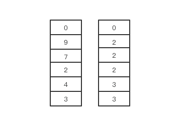
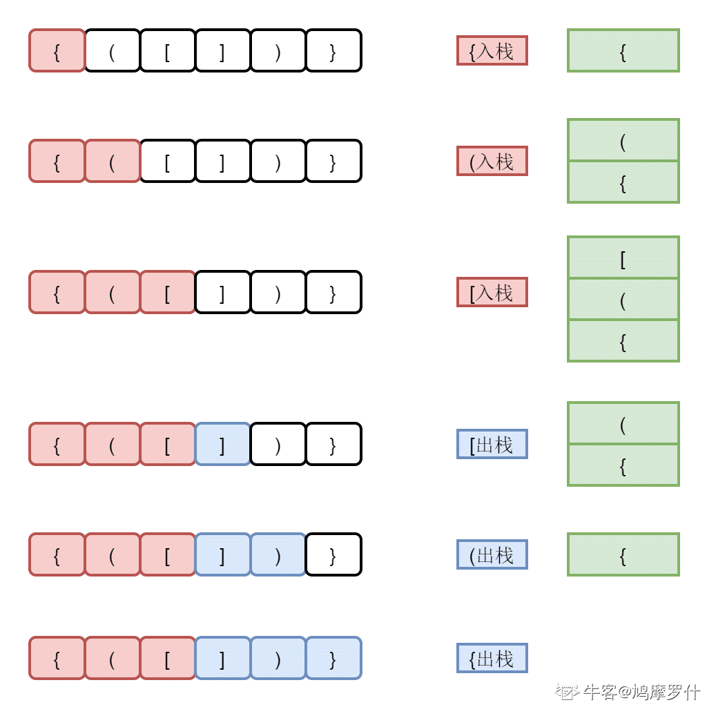

# 栈


## 定义和特点

* 栈是一种线性数据结构，具有后进先出（LIFO）的特性。
*  可以类比为一叠盘子，只能从顶部放入和取出元素。
* 可以使用数组的`push()`和`pop()`方法来实现。


## 分类

**「顺序栈」**：即堆栈的顺序存储结构。利用一组地址连续的存储单元依次存放自栈底到栈顶的元素，同时使用指针 𝑡𝑜𝑝 指示栈顶元素在顺序栈中的位置。


**「链式栈」**：即堆栈的链式存储结构。利用单链表的方式来实现堆栈。栈中元素按照插入顺序依次插入到链表的第一个节点之前，并使用栈顶指针 𝑡𝑜𝑝 指示栈顶元素，𝑡𝑜𝑝 永远指向链表的头节点位置。


## 基本操作

**顺序栈**

* 入栈（Push）：将元素放入栈顶。
* 出栈（Pop）：从栈顶移除元素，并返回移除的元素。
*  获取栈顶元素（Top）：返回栈顶的元素，并不移除该元素。
* 判断栈是否为空（isEmpty）：检查栈是否为空。

```javascript
class Stack {  
    constructor(size = 100) {  
        this.stack = [];  
        this.maxSize = size; // 注意这里我们使用maxSize而不是size，因为我们实际上不限制数组的大小  
        this.top = -1;  
    }  
  
    // 判断栈是否为空  
    isEmpty() {  
        return this.top === -1;  
    }  
  
    // 判断栈是否已满（但在这个实现中，我们实际上不限制栈的大小）  
    // 如果需要限制，可以在push方法中添加逻辑  
    isFull() {  
        return this.stack.length === this.maxSize;  
    }  
  
    // 入栈操作  
    push(value) {  
        if (this.isFull()) {  
            throw new Error('Stack is full');  
        } else {  
            this.stack.push(value);  
            this.top = this.stack.length - 1; // 直接使用stack.length - 1来获取顶部索引  
        }  
    }  
  
    // 出栈操作  
    pop() {  
        if (this.isEmpty()) {  
            throw new Error('Stack is empty');  
        } else {  
            this.stack.pop();  
            this.top = this.stack.length - 1; // 更新顶部索引  
        }  
    }  
  
    // 获取栈顶元素  
    peek() {  
        if (this.isEmpty()) {  
            throw new Error('Stack is empty');  
        } else {  
            return this.stack[this.stack.length - 1]; // 直接使用stack.length - 1来获取顶部元素  
        }  
    }  
}  
  
// 使用示例  
let stack = new Stack();  
stack.push(1);  
stack.push(2);  
console.log(stack.peek()); // 输出 2  
stack.pop();  
console.log(stack.peek()); // 输出 1
```


**链式栈**

```javascript
class Node {  
    constructor(value) {  
        this.value = value;  
        this.next = null;  
    }  
}  
  
class Stack {  
    constructor() {  
        this.top = null;  
    }  
  
    // 判断栈是否为空  
    isEmpty() {  
        return this.top === null;  
    }  
  
    // 入栈操作  
    push(value) {  
        const cur = new Node(value);  
        cur.next = this.top;  
        this.top = cur;  
    }  
  
    // 出栈操作  
    pop() {  
        if (this.isEmpty()) {  
            throw new Error('Stack is empty');  
        } else {  
            const cur = this.top;  
            this.top = this.top.next;  
            // 在JavaScript中，不需要显式地删除对象（通过del关键字），因为垃圾回收器会处理它  
        }  
    }  
  
    // 获取栈顶元素  
    peek() {  
        if (this.isEmpty()) {  
            throw new Error('Stack is empty');  
        } else {  
            return this.top.value;  
        }  
    }  
}  
  
// 使用示例  
let stack = new Stack();  
stack.push(1);  
stack.push(2);  
console.log(stack.peek()); // 输出 2  
stack.pop();  
console.log(stack.peek()); // 输出 1
```


## 应用场景

* 逆序输出、括号匹配、函数调用和递归等。


## 单调栈

> **单调栈（Monotone Stack）**：一种特殊的栈。在栈的「先进后出」规则基础上，要求「从 **栈顶** 到 **栈底** 的元素是单调递增（或者单调递减）」。其中满足从栈顶到栈底的元素是单调递增的栈，叫做「单调递增栈」。满足从栈顶到栈底的元素是单调递减的栈，叫做「单调递减栈」。

注意：这里定义的顺序是从「栈顶」到「栈底」。有的文章里是反过来的。本文全文以「栈顶」到「栈底」的顺序为基准来描述单调栈。

### **单调递增栈**

> **单调递增栈**：只有比栈顶元素小的元素才能直接进栈，否则需要先将栈中比当前元素小的元素出栈，再将当前元素入栈。
>
> 这样就保证了：栈中保留的都是比当前入栈元素大的值，并且从栈顶到栈底的元素值是单调递增的。
>
> 

单调递增栈的入栈、出栈过程如下：

- 假设当前进栈元素为 𝑥，如果 𝑥 比栈顶元素小，则直接入栈。
- 否则从栈顶开始遍历栈中元素，把小于 𝑥 或者等于 𝑥 的元素弹出栈，直到遇到一个大于 𝑥 的元素为止，然后再把 𝑥 压入栈中。

```javascript
function monotoneIncreasingStack(nums) {  
    let stack = [];  
    for (let num of nums) {  
        while (stack.length > 0 && num >= stack[stack.length - 1]) {  
            stack.pop();  // 弹出的元素不属于单调递增栈
        }  
        stack.push(num);  
    }  
    return stack; // 如果需要返回最终的栈内容，可以添加这一行  
}  
  
// 使用示例  
let nums = [1, 3, 2, 4, 5, 4, 6];  
let result = monotoneIncreasingStack(nums);  
console.log(result); // 打印结果（如果return语句包含在函数中）  
// 或者，如果你只想在控制台中看到栈的变化，可以在循环内部打印stack
```


下面我们以数组 [2,7,5,4,6,3,4,2] 为例，模拟一下「单调递增栈」的进栈、出栈过程。具体过程如下：

- 数组元素： [2, 7, 5, 4, 6, 3, 4, 2] ，遍历顺序为从左到右。

| 第 i 步 | 待插入元素 | 操 作                  | 结 果（左侧为栈底） | 作 用                                 |
| ------- | ---------- | ---------------------- | ------------------- | ------------------------------------- |
| 1       | 2          | 2 入栈                 | [2]                 | 元素 2 的左侧无比 2 大的元素          |
| 2       | 7          | 2 出栈，7 入栈         | [7]                 | 元素 7 的左侧无比 7 大的元素          |
| 3       | 5          | 5 入栈                 | [7, 5]              | 元素 5 的左侧第一个比 5 大的元素为：7 |
| 4       | 4          | 4 入栈                 | [7, 5, 4]           | 元素 4 的左侧第一个比 4 大的元素为：5 |
| 5       | 6          | 4 出栈，5 出栈，6 入栈 | [7, 6]              | 元素 6 的左侧第一个比 6 大的元素为：7 |
| 6       | 3          | 3 入栈                 | [7, 6, 3]           | 元素 3 的左侧第一个比 3 大的元素为：6 |
| 7       | 4          | 3 出栈，4 入栈         | [7, 6, 4]           | 元素 4 的左侧第一个比 4 大的元素为：6 |
| 8       | 2          | 2 入栈                 | [7, 6, 4, 2]        | 元素 2 的左侧第一个比 2 大的元素为：4 |

最终栈中元素为 [7,6,4,2]。因为从栈顶（右端）到栈底（左侧）元素的顺序为 2,4,6,7，满足递增关系，所以这是一个单调递增栈。

我们以上述过程第 5 步为例，所对应的图示过程为：


### **单调递减栈**

> **单调递减栈**：只有比栈顶元素大的元素才能直接进栈，否则需要先将栈中比当前元素大的元素出栈，再将当前元素入栈。
>
> 这样就保证了：栈中保留的都是比当前入栈元素小的值，并且从栈顶到栈底的元素值是单调递减的。

单调递减栈的入栈、出栈过程如下：

- 假设当前进栈元素为 𝑥，如果 𝑥 比栈顶元素大，则直接入栈。
- 否则从栈顶开始遍历栈中元素，把大于 𝑥 或者等于 𝑥 的元素弹出栈，直到遇到一个小于 𝑥 的元素为止，然后再把 𝑥 压入栈中。

```javascript
function monotoneDecreasingStack(nums) {  
    let stack = [];  
    for (let num of nums) {  
        while (stack.length > 0 && num <= stack[stack.length - 1]) {  
            stack.pop();  
        }  
        stack.push(num);  
    }  
    return stack; // 如果需要返回最终的栈内容，可以添加这一行  
}  
  
// 使用示例  
let nums = [1, 3, 2, 4, 5, 4, 6];  
let result = monotoneDecreasingStack(nums);  
console.log(result); // 打印结果（如果return语句包含在函数中）
```

下面我们以数组 [4,3,2,5,7,4,6,8] 为例，模拟一下「单调递减栈」的进栈、出栈过程。具体过程如下：

- 数组元素： [4, 3, 2, 5, 7, 4, 6, 8] ，遍历顺序为从左到右。

| 第 i 步 | 待插入元素 | 操 作                  | 结 果（左侧为栈底） | 作用                                  |
| ------- | ---------- | ---------------------- | ------------------- | ------------------------------------- |
| 1       | 4          | 4 入栈                 | [4]                 | 元素 4 的左侧无比 4 小的元素          |
| 2       | 3          | 4 出栈，3 入栈         | [3]                 | 元素 3 的左侧无比 3 小的元素          |
| 3       | 2          | 3 出栈，2 入栈         | [2]                 | 元素 2 的左侧无比 2 小的元素          |
| 4       | 5          | 5 入栈                 | [2, 5]              | 元素 5 的左侧第一个比 5 小的元素是：2 |
| 5       | 7          | 7 入栈                 | [2, 5, 7]           | 元素 7 的左侧第一个比 7 小的元素是：5 |
| 6       | 4          | 7 出栈，5 出栈，4 入栈 | [2, 4]              | 元素 4 的左侧第一个比 4 小的元素是：2 |
| 7       | 6          | 6 入栈                 | [2, 4, 6]           | 元素 6 的左侧第一个比 6 小的元素是：4 |
| 8       | 8          | 8 入栈                 | [2, 4, 6, 8]        | 元素 8 的左侧第一个比 8 小的元素是：6 |

最终栈中元素为 [2,4,6,8]。因为从栈顶（右端）到栈底（左侧）元素的顺序为 8,6,4,2，满足递减关系，所以这是一个单调递减栈。

我们以上述过程第 6 步为例，所对应的图示过程为：


### **单调栈适用场景**

单调栈可以在时间复杂度为 𝑂(𝑛) 的情况下，求解出某个元素左边或者右边第一个比它大或者小的元素。

所以单调栈一般用于解决一下几种问题：

**寻找左侧第一个比当前元素大的元素:**

- 从左到右遍历元素，构造单调递增栈（从栈顶到栈底递增）：
  - 一个元素左侧第一个比它大的元素就是将其「插入单调递增栈」时的栈顶元素。
  - 如果插入时的栈为空，则说明左侧不存在比当前元素大的元素。

**寻找左侧第一个比当前元素小的元素:**

- 从左到右遍历元素，构造单调递减栈（从栈顶到栈底递减）：
  - 一个元素左侧第一个比它小的元素就是将其「插入单调递减栈」时的栈顶元素。
  - 如果插入时的栈为空，则说明左侧不存在比当前元素小的元素。

**寻找右侧第一个比当前元素大的元素:**

- 从左到右遍历元素，构造单调递增栈（从栈顶到栈底递增）：

  - 一个元素右侧第一个比它大的元素就是将其「弹出单调递增栈」时即将插入的元素。
  - 如果该元素没有被弹出栈，则说明右侧不存在比当前元素大的元素。

**寻找右侧第一个比当前元素小的元素:**

* 从左到右遍历元素，构造单调递减栈（从栈顶到栈底递减）：

  - 一个元素右侧第一个比它小的元素就是将其「弹出单调递减栈」时即将插入的元素。

  - 如果该元素没有被弹出栈，则说明右侧不存在比当前元素小的元素。

**总结：**

- 查找 **「比当前元素大的元素」** 就用 **单调递增栈**，查找 **「比当前元素小的元素」** 就用 **单调递减栈**。
- 从 **「左侧」** 查找就看 **「插入栈」** 时的栈顶元素，从 **「右侧」** 查找就看 **「弹出栈」** 时即将插入的元素。


## 算法题

## 顺序栈题集

| 题号          | 标题                                                         | 标签                   | 难度 |
| :------------ | :----------------------------------------------------------- | :--------------------- | :--- |
| 1047          | [删除字符串中的所有相邻重复项](https://leetcode.cn/problems/remove-all-adjacent-duplicates-in-string/) | 栈、字符串             | 简单 |
| 0155          | [最小栈](https://leetcode.cn/problems/min-stack/)            | 栈、设计               | 中等 |
| 0020          | [有效的括号](https://leetcode.cn/problems/valid-parentheses/) | 栈、字符串             | 简单 |
| 0227          | [基本计算器 II](https://leetcode.cn/problems/basic-calculator-ii/) | 栈、数学、字符串       | 中等 |
| 0739          | [每日温度](https://leetcode.cn/problems/daily-temperatures/) | 栈、数组、单调栈       | 中等 |
| 0150          | [逆波兰表达式求值](https://leetcode.cn/problems/evaluate-reverse-polish-notation/) | 栈、数组、数学         | 中等 |
| 0232          | [用栈实现队列](https://leetcode.cn/problems/implement-queue-using-stacks/) | 栈、设计、队列         | 简单 |
| 剑指 Offer 09 | [用两个栈实现队列](https://leetcode.cn/problems/yong-liang-ge-zhan-shi-xian-dui-lie-lcof/) | 栈、设计、队列         | 简单 |
| 0394          | [字符串解码](https://leetcode.cn/problems/decode-string/)    | 栈、递归、字符串       | 中等 |
| 0032          | [最长有效括号](https://leetcode.cn/problems/longest-valid-parentheses/) | 栈、字符串、动态规划   | 困难 |
| 0946          | [验证栈序列](https://leetcode.cn/problems/validate-stack-sequences/) | 栈、数组、模拟         | 中等 |
| 剑指 Offer 06 | [从尾到头打印链表](https://leetcode.cn/problems/cong-wei-dao-tou-da-yin-lian-biao-lcof/) | 栈、递归、链表、双指针 | 简单 |
| 0071          | [简化路径](https://leetcode.cn/problems/simplify-path/)      | 栈、字符串             | 中等 |


### 用两个队列实现一个栈（简单）

题目：用两个队列实现一个栈

思路

> 1. 创建两个队列，分别命名为 `queue1` 和 `queue2`。
> 2. 入栈操作：
>    - 将元素添加到非空的队列中（初始时选择其中一个队列）。
>    - 如果两个队列都为空，可以选择任意一个队列添加元素。
> 3. 出栈操作：
>    - 将非空队列中的元素逐个出队并入队到另一个空队列，直到队列中只剩下一个元素。
>    - 移除最后剩下的元素并返回，即为出栈的元素。
> 4. 获取栈顶元素操作：
>    - 同出栈操作，将非空队列中的元素逐个出队并入队到另一个空队列，直到队列中只剩下一个元素。
>    - 返回最后剩下的元素，即为栈顶元素。

代码：

```javascript
class Stack {
  constructor() {
    this.queue1 = [];
    this.queue2 = [];
  }

  push(element) {
    if (this.queue1.length === 0) {
      this.queue2.push(element);
    } else {
      this.queue1.push(element);
    }
  }

  pop() {
    if (this.queue1.length === 0 && this.queue2.length === 0) {
      return null;
    }

    let nonEmptyQueue, emptyQueue;
    if (this.queue1.length === 0) {
      nonEmptyQueue = this.queue2;
      emptyQueue = this.queue1;
    } else {
      nonEmptyQueue = this.queue1;
      emptyQueue = this.queue2;
    }

    while (nonEmptyQueue.length > 1) {
      emptyQueue.push(nonEmptyQueue.shift());
    }

    return nonEmptyQueue.shift();
  }

  top() {
    if (this.queue1.length === 0 && this.queue2.length === 0) {
      return null;
    }

    let nonEmptyQueue, emptyQueue;
    if (this.queue1.length === 0) {
      nonEmptyQueue = this.queue2;
      emptyQueue = this.queue1;
    } else {
      nonEmptyQueue = this.queue1;
      emptyQueue = this.queue2;
    }

    while (nonEmptyQueue.length > 1) {
      emptyQueue.push(nonEmptyQueue.shift());
    }

    const topElement = nonEmptyQueue.shift();
    emptyQueue.push(topElement);

    return topElement;
  }

  isEmpty() {
    return this.queue1.length === 0 && this.queue2.length === 0;
  }
}

// 示例用法
const stack = new Stack();
stack.push(1);
stack.push(2);
stack.push(3);
console.log(stack.top()); // 输出 3
console.log(stack.pop()); // 输出 3
console.log(stack.isEmpty()); // 输出 false
```


### 两个栈来实现一个队列（简单）

题目：两个栈来实现一个队列

思路：

> 1. 创建两个栈，分别命名为 `stack1` 和 `stack2`。
> 2. 入队操作：
>    - 将元素压入 `stack1` 栈中。
> 3. 出队操作：
>    - 如果 `stack2` 不为空，直接从 `stack2` 栈顶弹出元素并返回。
>    - 如果 `stack2` 为空，将 `stack1` 中的元素逐个弹出并压入 `stack2`，然后从 `stack2` 栈顶弹出元素并返回。
> 4. 获取队头元素操作：
>    - 如果 `stack2` 不为空，返回 `stack2` 栈顶元素。
>    - 如果 `stack2` 为空，将 `stack1` 中的元素逐个弹出并压入 `stack2`，然后返回 `stack2` 栈顶元素。

代码：

```javascript
class Queue {
  constructor() {
    this.stack1 = [];
    this.stack2 = [];
  }

  enqueue(element) {
    this.stack1.push(element);
  }

  dequeue() {
    if (this.stack2.length === 0) {
      while (this.stack1.length > 0) {
        this.stack2.push(this.stack1.pop());
      }
    }
    return this.stack2.pop() || null;
  }

  front() {
    if (this.stack2.length === 0) {
      while (this.stack1.length > 0) {
        this.stack2.push(this.stack1.pop());
      }
    }
    return this.stack2[this.stack2.length - 1] || null;
  }

  isEmpty() {
    return this.stack1.length === 0 && this.stack2.length === 0;
  }
}

// 示例用法
const queue = new Queue();
queue.enqueue(1);
queue.enqueue(2);
queue.enqueue(3);
console.log(queue.front()); // 输出 1
console.log(queue.dequeue()); // 输出 1
console.log(queue.isEmpty()); // 输出 false
```


### 包含min函数的栈（简单）

题目：

定义栈的数据结构，请在该类型中实现一个能够得到栈中所含最小元素的min函数（时间复杂度应为O（1））。

思路：

> 题意理解：min 函数能够获取栈中最小元素，在栈进行入栈和出栈操作后，都能获取当前栈最小元素；
>
> 1. 创建两个栈，一个称为 `dataStack` 存储数据元素，另一个称为 `minStack` 存储最小元素。
>
> 2. 入栈操作：
>
>    - 将元素压入 `dataStack` 栈中。
>    - 如果 `minStack` 为空，或者新入栈的元素小于等于 `minStack` 栈顶元素，则将新元素也压入 `minStack` 栈中。
>
> 3. 出栈操作：
>
>    - 从 `dataStack` 栈顶弹出元素，并将其返回。
>    - 如果弹出的元素等于 `minStack` 栈顶元素，则也从 `minStack` 栈顶弹出元素。
>
> 4. 获取栈中最小元素操作：
>
>    - 直接返回 `minStack` 栈顶元素，即为栈中的最小元素。
>
> 5. 以数据[3,4,2,7,9,0]为例，让这组数字依次如栈，则栈和其对应的最小值栈如下：
>
>    

代码

```javascript
class MinStack {
  constructor() {
    this.dataStack = []; // 存储数据元素的栈
    this.minStack = []; // 存储最小元素的栈
  }

  push(element) {
    this.dataStack.push(element);

    if(minStack.length === 0 ||  element < this.min()){
        minStack.push(element);
    }else{
        minStack.push(this.min());
    }
  }

  pop() {
    const poppedElement = this.dataStack.pop();

    if (poppedElement === this.minStack[this.minStack.length - 1]) {
      this.minStack.pop();
    }

    return poppedElement;
  }

  min() {
    return this.minStack[this.minStack.length - 1];
  }
}

// 示例用法
const stack = new MinStack();
stack.push(3);
stack.push(2);
stack.push(5);
console.log(stack.min()); // 输出 2
stack.pop();
console.log(stack.min()); // 输出 2
stack.push(1);
console.log(stack.min()); // 输出 1
```

### 栈的压入、弹出序列（简单）

题目：

> 输入两个整数序列，第一个序列表示栈的压入顺序，请判断第二个序列是否可能为该栈的弹出顺序。假设压入栈的所有数字均不相等。例如序列`1,2,3,4,5`是某栈的压入顺序，序列`4,5,3,2,1`是该压栈序列对应的一个弹出序列，但`4,3,5,1,2`就不可能是该压栈序列的弹出序列。（注意：这两个序列的长度是相等的）

思路：

> 题意理解：
>
> * 栈的弹出顺序并是指在栈的压入过程中，任意一次压入时再弹出，记录的弹出的顺序；
> * 题中只要求判断第二个栈是否为第一个栈的可能弹出顺序，并未要求列出弹出顺序，第一个栈的弹出顺序有很多种；
>
> 解题思路：
>
> * 使用辅助栈和模拟的方法来解决：
>   1. 初始化一个辅助栈和一个指针 `pushIndex`，`pushIndex`指向辅助栈，初始时 `pushIndex` 的值为 0，既辅助栈为空。
>   2. 遍历弹出序列，依次取出每一个元素：
>      - 如果辅助栈的栈顶元素（起始辅助栈为空）不等于当前弹出序列的元素，表示还需要继续压栈，将压栈序列中 `pushIndex` 之前的元素依次压入辅助栈，直到找到与当前弹出序列元素相等的元素为止。
>      - 如果辅助栈的栈顶元素等于当前弹出序列的元素，表示可以直接弹出，将栈顶元素弹出，然后继续遍历下一个弹出序列元素。
>   3. 如果弹出序列遍历完成后，辅助栈为空，表示该弹出序列是可能的，否则不可能。
>
> 举例：
>
> * 例如序列`1,2,3,4,5`是某栈的压入顺序，序列`4,5,3,2,1`是该压栈序列对应的一个弹出序列，判断过程如下：
>   * 起始辅助栈为空，弹出序列第一个元素为 4，序列 `1,2,3`,入栈，每次栈顶元素不等于 4，继续入栈直到 4 入辅助栈顶，此时辅助栈为：`1,2,3,4`；
>   * 栈顶 4 等于辅助栈栈顶 4，辅助栈 4 出栈，记录出栈数字 4，弹出序列下移动一个；
>   * 此时弹出栈栈顶为 3，弹出序列为 5，不相等，辅助栈继续将剩余元素 5 入栈；
>   * 此时辅助栈栈顶元素 5 等于 弹出序列当前指针指向元素 5， 辅助栈出栈 5，弹出序列下移动一个；
>   * 此时辅助栈剩余元素与弹出序列剩余元素顺序相同，辅助栈出栈，弹出序列下移动；直到辅助栈为空并且没有需要入栈的元素，则序列`4,5,3,2,1`是该压栈序列对应的一个弹出序列。

代码：

```javascript
function isPopOrder(pushSequence, popSequence) {
  if (pushSequence.length !== popSequence.length) {
    return false;
  }

  const stack = [];
  let pushIndex = 0;//指向栈序列

  for (let i = 0; i < popSequence.length; i++) {//遍历弹出序列
    const current = popSequence[i];//获取弹出序列第一个元素
	// 栈为空或栈顶元素不等于弹出序列
    while (stack.length === 0 || stack[stack.length - 1] !== current) {
      if (pushIndex >= pushSequence.length) { //栈指针超出序列，退出
        return false;
      }

      stack.push(pushSequence[pushIndex]); // 入栈序列元素入栈
      pushIndex++;
    }
	// 栈顶元素等于弹出序列顶部元素，栈顶出栈
    if (stack[stack.length - 1] === current) {
      stack.pop();
    }
  }

  return stack.length === 0; 
}

// 示例用法
console.log(isPopOrder([1, 2, 3, 4, 5], [4, 5, 3, 2, 1])); // 输出 true
console.log(isPopOrder([1, 2, 3, 4, 5], [4, 3, 5, 1, 2])); // 输出 false
```

### 有效括号序列（简单）

题目：

> 给出一个仅包含字符'(',')','{','}','['和']',的字符串，判断给出的字符串是否是合法的括号序列
> 括号必须以正确的顺序关闭，"()"和"()[]{}"都是合法的括号序列，但"(]"和"([)]"不合法。
>
> 数据范围：字符串长度 0≤n≤10000
>
> 要求：空间复杂度O*(*n*)，时间复杂度 O*(*n*)

思路一：

> 解题思路：
>
> 1. 创建一个空栈。
> 2. 遍历输入的字符串，对于每个字符：
>    - 如果是左括号（'(', '{', '['），将其推入栈中。
>    - 如果是右括号（')', '}', ']'），检查栈是否为空：
>      - 如果栈为空，说明右括号多于左括号，返回 false。
>      - 如果栈不为空，将栈顶元素出栈，并与当前右括号进行匹配：
>        - 如果匹配成功，继续遍历下一个字符。
>        - 如果匹配失败，返回 false。
> 3. 遍历完字符串后，检查栈是否为空：
>    - 如果栈为空，说明所有括号都匹配成功，返回 true。
>    - 如果栈不为空，说明左括号多于右括号，返回 false。
>    - 

代码一：

```js
function isValidParentheses(s) {
  if(s.length<0 || s.length > 10000) return false;
  const stack = []; // 创建空栈

  for (let i = 0; i < s.length; i++) {
    const char = s[i];
    if (char === '(' || char === '{' || char === '[') {
      stack.push(char); // 左括号入栈
    } else {
      if (stack.length === 0) {
        return false; // 右括号多于左括号，返回 false
      }
      const top = stack.pop(); // 弹出栈顶元素
      if (
        (char === ')' && top !== '(') ||
        (char === '}' && top !== '{') ||
        (char === ']' && top !== '[')
      ) {
        return false; // 括号不匹配，返回 false
      }
    }
  }

  return stack.length === 0; // 栈为空则括号匹配成功，返回 true，否则返回 false
}

module.exports = {
    isValid: isValidParentheses,
};
```

代码二：使用栈和 map 代替 if 判断

```js
/**
  * 
  * @param s string字符串 
  * @return bool布尔型
  */
function isValid( s ) {
  let stack = [];
  let pair = {
    '{': '}',
    '(': ')',
    '[': ']'
  };
  for (let i = 0; i < s.length; i++) {
    if (pair[s[i]]) stack.push(s[i]);    // 左括号入栈
    else if (pair[stack[stack.length - 1]] !== s[i]) return false; // 匹配到右括号，栈顶元素是否与当前括号不匹配，返回false
    else stack.pop();// 匹配到右括号，栈顶元素是否与当前括号匹配，栈顶出栈
  }
  return stack.length <= 0;
}
module.exports = {
    isValid : isValid
};
```


思路二：

> * 分析：题目中仅包含字符串，如果是合法字符串，那么括号内部一定有一个正确的左右括号，因此可以使用正则匹配，将最中心的左右括号去除，剩余的括号依然可以组成合法的左右括号的话，那么就可以继续正则去除；
> * 注意：
>   * 该代码的思路是通过不断替换括号对来判断合法性，但并没有使用栈这种数据结构。
>   * 相比使用栈的方法，该方法的时间复杂度较高，因为每次替换都需要遍历整个字符串。
>   * 同时，该方法也无法处理括号嵌套的情况，例如 "(())" 是合法的括号序列，但该方法无法正确判断。
>   * 因此，建议使用栈的方法来解决该题目。

代码：

```js
function isValid(s) {
    // write code here
    let len = s.length
    for (let i = 0; i < len / 2; i++){
        s = s.replace("{}", "").replace("()", "").replace("[]", "");
        console.log(s)
    }
     
    return s === ''
}

module.exports = {
    isValid: isValid,
};

```


### 数制转换（简单）

题目：

> 编写一个函数，实现十进制数转换任意进制数

解法一：使用队列：

> 1. 定义一个队列，用于存储转换后的数字的每一位。
>
> 2. 定义一个变量 `num`，用于保存待转换的十进制数。
>
> 3. 定义一个变量 `base`，表示目标进制数。
>
> 4. 进入循环，直到 num 等于 0：
>
>    - 求余数：将 `num` 对 `base` 取余，得到当前位的数字。
>    - 将余数入队：将余数入队，表示当前位的数字。
>    - 更新 `num`：将 `num` 除以 `base`，向下取整，更新 `num` 的值。
>
> 5. 循环结束后，队列中的每个元素就是转换后的数字的每一位。
>
> 6. 弹出队列元素：从队列中依次弹出元素，组成转换后的数值。
>
> 7. 返回转换后的数值。
>
>    
>
>    

代码：

```js
class Queue {
  constructor() {
    this.items = [];
  }

  enqueue(item) {
    this.items.push(item);
  }

  dequeue() {
    return this.items.shift();
  }

  isEmpty() {
    return this.items.length === 0;
  }
}

/**
 * params {} decimal 十进制数
 * params {} base 转换进制
**/
function decimalToBase(decimal, base) {
  const queue = new Queue();
  let num = decimal;

  if (num === 0) { // 商结果为0，出队列
    queue.enqueue(num);
  }

  while (num !== 0) {
    const remainder = num % base; // 取模获得余数
    queue.enqueue(remainder); // 余数入队列
    num = Math.floor(num / base); // 除法获得商
  }

  let result = "";

  while (!queue.isEmpty()) {
    result += queue.dequeue();
  }

  return result;
}

// 示例用法
const decimalNumber = 123; // 十进制数
const base = 2; // 目标进制数

const convertedNumber = decimalToBase(decimalNumber, base);
console.log(convertedNumber); // 输出: "1111011"
```


解法二：使用数组

> * 定义一个空字符串或数组，用于存储转换后的结果。
> * 使用循环，将输入的十进制数不断除以目标进制数，直到商为 0。
> * 在每一次循环中，将当前的余数添加到结果中，并将商更新为上一步的商。
> * 当商为 0 时，循环结束。
> * 将结果反转，得到最终转换后的任意进制数。

代码：


  ```js
  /**
   * params {} decimal 十进制数
   * params {} base 转换进制
  **/
  function decimalToArbitraryBase(decimal, base) {
    if (decimal === 0) {
      return "0"; // 十进制数为 0，则结果为 "0"
    }
  
    const digits = "0123456789ABCDEFGHIJKLMNOPQRSTUVWXYZ"; // 可用的数字字符
  
    let result = "";
    let quotient = Math.abs(decimal); // 取绝对值，以处理负数的情况
  
    while (quotient > 0) {
      const remainder = quotient % base; // 取模获取当前的余数
      result = digits[remainder] + result; // 根据余数获取数字，并拼接结果
      quotient = Math.floor(quotient / base); // 获取商：更新商为上一步的商
    }
  
    return decimal < 0 ? "-" + result : result; // 处理负数的情况
  }
  
  // 示例用法
  const decimal = 123; // 十进制数
  const base = 16; // 目标进制数
  
  const result = decimalToArbitraryBase(decimal, base);
  console.log(result); // 输出: "7B"
  ```

  

### 表达式求值（中等）

题目：

> 请写一个整数计算器，支持加减乘三种运算和括号。
>
> 数据范围：0≤∣s∣≤100，保证计算结果始终在整型范围内
>
> 要求：空间复杂度：O*(*n)，时间复杂度O(n)

思路：

> 对于上述两个要求，我们要考虑的是两点，一是处理运算优先级的问题，二是处理括号的问题。
>
> 1. 处理优先级问题：那必定是乘号有着优先运算的权利，加号减号先一边看
>    * 我们甚至可以把减号看成加一个数的相反数，则这里只有乘法和加法，那我们优先处理乘法；
>    * 遇到乘法，把前一个数和后一个数乘起来；
>    * 遇到加法就把这些数字都暂时存起来；
>    * 最后乘法处理完了，就剩余加法，把之前存起来的数字都相加就好了。
>
> 2. 处理括号的问题：
>    * 我们可以将括号中的部分看成一个新的表达式，即一个子问题，因此可以将新的表达式递归地求解，得到一个数字，再运算；
>    * **终止条件：** 每次遇到左括号意味着进入括号子问题进行计算，那么遇到右括号代表这个递归结束。
>    * **返回值：** 将括号内部的计算结果值返回。
>    * **本级任务：** 遍历括号里面的字符，进行计算。
>
> **具体做法：**
>
> 1. 使用栈辅助处理优先级，默认符号为加号。
> 2. 遍历字符串，遇到数字，则将连续的数字字符部分转化为 number 数字。
> 3. 遇到左括号，则将括号后的部分送入递归，处理子问题；遇到右括号代表已经到了这个子问题的结尾，结束继续遍历字符串，将子问题的加法部分相加为一个数字，返回。
> 4. 当遇到符号的时候如果是+，得到的数字正常入栈，如果是-，则将其相反数入栈，如果是*，则将栈中内容弹出与后一个元素相乘再入栈。
> 5. 最后将栈中剩余的所有元素，进行一次全部相加。

代码：

```js
/** 
 * 代码中的类名、方法名、参数名已经指定，请勿修改，直接返回方法规定的值即可
 * 返回表达式的值
 * @param s string字符串 待计算的表达式
 * @return int整型
 */
function solve( s ) {//递归会出现深浅拷贝的问题，每次重新调用所有同名变量将改变
    // write code here
    let stack=[]; //辅助栈，记录数字和乘法计算结果
    let sign='+'; // 符号记录
    let i=0; // 遍历下标
    let num=0; // 记录遍历到的数字
    while(i<s.length){ // 遍历字符串
        if(s[i]=='('){ // 遇到左括号，遍历查找该左括号对应的右括号
            let flag=1; // flag 用于查找当前左括号对应的右括号
            let star=i+1; //记录左括号内部字符串的开始下标
            while(flag>0){ // 查找当前左括号对应的右括号, 当 flag == 0 表示找到
                i++;
                if(s[i]=='('){flag++;}
                if(s[i]==')'){flag--;}
            }
            let end=i; // end 表示左括号对应的右括号下标，括号内为一个子表达式
            let arr=s.slice(star,i); // 截取子表达式子串
            num=solve(arr); // 递归计算子表达式
            i=end; // 子表达式后一个下表开始重新遍历
        }
        else if(s[i]>='0'&&s[i]<='9'){ // 遍历字符串，遇到数字，则将连续的数字字符部分转化为int型数字。
            num=num*10+Number(s[i])
        }
        if(s[i]<'0'||s[i]>'9'||i==s.length-1){ // 遇到非数字，则计算后入栈
          
            if(sign=='+'){stack.push(num);} // 遇到加号直接入栈
            if(sign=='-'){stack.push(num*(-1));} // 减法，则将数字转化为负数入栈
            if(sign=='*'){stack.push(stack.pop()*num);} // 乘法，将栈顶元素和当前数字相乘后入栈
            sign=s[i]; // 记录当前计算符号
            num=0; // 重置数字记录
        }
        i++; // 指针后移
    }
    // 将栈内剩余元素全部累加
    return stack.reduce(function(a,b){
        return a+b;
    })
}
module.exports = {
    solve : solve
};

```


### 迷宫求解（教难）

题目：

> * 给定一个`M * N `的迷宫图，求一条从指定入口到出口的迷宫路径。
>
>   * 假设一个迷宫图如图所示(这里M=8,N=8),其中的每个方块用空白表示通道，用蓝色阴影表示障碍物。
>   * 一般情况下,所求迷宫路径是简单路径，即在求得的迷宫路径上不会重复出现同一方块。
>   * 一个迷官图的迷宫路径可能有多条，这些迷宫路径有长有短，
>   * 这里仅仅考虑用栈求一条从指定入口到出口的迷宫路径。
>
>   

思路：

> 1. 定义一个栈，用于**存储当前的路径**。
>
> 2. 定义一个二维数组或矩阵来表示迷宫图，其中空白方块表示通道，蓝色阴影方块表示障碍物。
>
> 3. 定义一个二维数组或矩阵来标记已经访问过的方块，初始化为全部为 false。
>
> 4. 定义一个对象或元组来表示入口坐标，将入口坐标压入栈中。
>
> 5. 进入循环，直到栈为空或找到出口坐标：
>
>    - 弹出栈顶元素，表示当前所在位置。
>    - 如果当前位置是出口坐标，表示找到了一条路径，循环结束。
>    - 否则，标记当前位置为已访问，并根据当前位置的四个相邻方块（上、下、左、右）进行判断：
>      - 如果**相邻方块是通道且未访问过**，将其坐标压入栈中。
>
> 6. 如果栈为空，表示没有找到从入口到出口的路径；否则，栈中的元素就是路径的顺序，可以按照栈中元素的顺序输出路径。
>
>    
>
> 

代码：

```js
class Stack {
  constructor() {
    this.items = [];
  }

  push(item) {
    this.items.push(item);
  }

  pop() {
    return this.items.pop();
  }

  isEmpty() {
    return this.items.length === 0;
  }
}

//`maze` 代表迷宫图的二维数组，`start` 代表入口坐标的数组 `[row, col]`，`end` 代表出口坐标的数组 `[row, col]`。
function findMazePath(maze, start, end) {
  const stack = new Stack(); //用于存储当前的路径
  const visited = [];//`visited`，用于标记已经访问过的方块
  const directions = [[-1, 0], [1, 0], [0, -1], [0, 1]]; // 上下左右四个方向,用于在迷宫中移动

  // 初始化 visited 数组，全部置为 false
  for (let i = 0; i < maze.length; i++) {
    visited[i] = [];
    for (let j = 0; j < maze[i].length; j++) {
      visited[i][j] = false;
    }
  }

  stack.push(start);// 入口坐标入栈
  // 循环查找栈内位置四个方便，直到栈内元素为空
  while (!stack.isEmpty()) {
    const current = stack.pop();//弹出栈顶元素，表示当前所在位置

    if (current[0] === end[0] && current[1] === end[1]) {
      // 找到出口坐标，返回路径
      return stack.items;
    }
	// 标记当前位置已经访问过
    visited[current[0]][current[1]] = true;
	// 按照上下左右依次访问四个方向位置
    for (const direction of directions) {
      const newRow = current[0] + direction[0];
      const newCol = current[1] + direction[1];
	 //相邻方块是通道且未访问过，将其坐标压入栈中
      if (isValidMove(maze, newRow, newCol) && !visited[newRow][newCol]) {
        stack.push([newRow, newCol]);
      }
    }
  }

  // 栈为空，表示没有找到路径
  return null;
}

function isValidMove(maze, row, col) {
  const numRows = maze.length;
  const numCols = maze[0].length;

  return row >= 0 && row < numRows && col >= 0 && col < numCols && maze[row][col] === " ";
}

// 示例用法
const maze = [
  [" ", " ", " ", " ", " ", " ", " ", " "],
  [" ", "X", "X", " ", " ", "X", "X", " "],
  [" ", " ", " ", "X", " ", " ", " ", " "],
  [" ", "X", " ", "X", " ", "X", " ", "X"],
  [" ", " ", " ", " ", " ", " ", " ", " "],
  [" ", "X", "X", "X", " ", "X", "X", " "],
  [" ", " ", " ", " ", " ", " ", " ", " "],
  [" ", " ", "X", "X", " ", "X", "X", " "]
];

const start = [0, 0]; // 入口坐标
const end = [7, 7]; // 出口坐标

/**
路径的函数是 `findMazePath`，它接受三个参数：`maze` 代表迷宫图的二维数组，`start` 代表入口坐标的数组 `[row, col]`，`end` 代表出口坐标的数组 `[row, col]`。

首先，我们定义一个栈 `stack`，用于存储当前的路径。我们还定义了一个二维数组 `visited`，用于标记已经访问过的方块。`directions` 是一个表示四个方向的数组，用于在迷宫中移动。

接下来，我们初始化 `visited` 数组，将其全部置为 `false`。

然后，将入口坐标 `start` 压入栈中。

在循环中，我们不断弹出栈顶元素，表示当前所在位置。如果当前位置是出口坐标 `end`，则表示找到了一条路径，循环结束，我们返回栈中的元素，即路径的顺序。

否则，我们将当前位置标记为已访问，并根据四个方向进行判断。对于每个方向，我们计算出相邻方块的坐标，如果该方块是通道且未访问过，则将其坐标压入栈中。

如果循环结束，栈为空，表示没有找到路径，我们返回 `null`。

示例用法展示了如何使用以上代码来找到从入口 `[0, 0]` 到出口 `[7, 7]` 的迷宫路径。
请注意，这只是一种基于栈的解法，可能存在多条从入口到出口的路径，该解法只返回其中一条路径。如果需要找到所有路径，可以使用递归或其他搜索算法。
**/

```


## 单调栈题集

| 题号 | 标题                                                         | 标签                                                         | 难度 |
| :--- | :----------------------------------------------------------- | :----------------------------------------------------------- | :--- |
| 0739 | [每日温度](https://leetcode.cn/problems/daily-temperatures/) | 栈、数组、单调栈                                             | 中等 |
| 0496 | [下一个更大元素 I](https://leetcode.cn/problems/next-greater-element-i/) | 栈、数组、哈希表、单调栈                                     | 简单 |
| 0503 | [下一个更大元素 II](https://leetcode.cn/problems/next-greater-element-ii/) | 栈、数组、单调栈                                             | 中等 |
| 0901 | [股票价格跨度](https://leetcode.cn/problems/online-stock-span/) | 栈、设计、数据流、单调栈                                     | 中等 |
| 0084 | [柱状图中最大的矩形](https://leetcode.cn/problems/largest-rectangle-in-histogram/) | 栈、数组、单调栈                                             | 困难 |
| 0316 | [去除重复字母](https://leetcode.cn/problems/remove-duplicate-letters/) | 栈、贪心、字符串、单调栈                                     | 中等 |
| 0042 | [接雨水](https://leetcode.cn/problems/trapping-rain-water/)  | 栈、数组、双指针、动态规划、单调栈                           | 困难 |
| 0085 | [最大矩形](https://leetcode.cn/problems/maximal-rectangle/)  | 栈、数组、动态规划、矩阵、单调栈                             | 困难 |
| 0862 | [和至少为 K 的最短子数组](https://leetcode.cn/problems/shortest-subarray-with-sum-at-least-k/) | 队列、数组、二分查找、前缀和、滑动窗口、单调队列、堆（优先队列） | 困难 |


### 下一个更大元素 I

**题目**

`nums1` 中数字 `x` 的 **下一个更大元素** 是指 `x` 在 `nums2` 中对应位置 **右侧** 的 **第一个** 比 `x` 大的元素。

给你两个 **没有重复元素** 的数组 `nums1` 和 `nums2` ，下标从 **0** 开始计数，其中`nums1` 是 `nums2` 的子集。

对于每个 `0 <= i < nums1.length` ，找出满足 `nums1[i] == nums2[j]` 的下标 `j` ，并且在 `nums2` 确定 `nums2[j]` 的 **下一个更大元素** 。如果不存在下一个更大元素，那么本次查询的答案是 `-1` 。

返回一个长度为 `nums1.length` 的数组 `ans` 作为答案，满足 `ans[i]` 是如上所述的 **下一个更大元素** 。

 

**示例 1：**

```
输入：nums1 = [4,1,2], nums2 = [1,3,4,2].
输出：[-1,3,-1]
解释：nums1 中每个值的下一个更大元素如下所述：
- 4 ，用加粗斜体标识，nums2 = [1,3,4,2]。不存在下一个更大元素，所以答案是 -1 。
- 1 ，用加粗斜体标识，nums2 = [1,3,4,2]。下一个更大元素是 3 。
- 2 ，用加粗斜体标识，nums2 = [1,3,4,2]。不存在下一个更大元素，所以答案是 -1 。
```

**示例 2：**

```
输入：nums1 = [2,4], nums2 = [1,2,3,4].
输出：[3,-1]
解释：nums1 中每个值的下一个更大元素如下所述：
- 2 ，用加粗斜体标识，nums2 = [1,2,3,4]。下一个更大元素是 3 。
- 4 ，用加粗斜体标识，nums2 = [1,2,3,4]。不存在下一个更大元素，所以答案是 -1 。
```

 

**提示：**

- `1 <= nums1.length <= nums2.length <= 1000`
- `0 <= nums1[i], nums2[i] <= 104`
- `nums1`和`nums2`中所有整数 **互不相同**
- `nums1` 中的所有整数同样出现在 `nums2` 中


**解法一：暴力求解**

- 遍历 𝑛𝑢𝑚𝑠1 中的每一个元素。
- 对于 𝑛𝑢𝑚𝑠1 的每一个元素 𝑛𝑢𝑚𝑠1[𝑖]，再遍历一遍 𝑛𝑢𝑚𝑠2，查找 𝑛𝑢𝑚𝑠2 中对应位置右边第一个比 𝑛𝑢𝑚𝑠1[𝑖] 大的元素。
- 这种解法的时间复杂度是 𝑂(𝑛2)。


**解法二：单调递增栈**

1. 因为 𝑛𝑢𝑚𝑠1 是 𝑛𝑢𝑚𝑠2 的子集，所以我们可以先遍历一遍 𝑛𝑢𝑚𝑠2，并构造单调递增栈，求出 𝑛𝑢𝑚𝑠2 中每个元素右侧下一个更大的元素。
2. 然后将其存储到哈希表中。
3. 然后再遍历一遍 𝑛𝑢𝑚𝑠1，从哈希表中取出对应结果，存放到答案数组中。
4. 这种解法的时间复杂度是 𝑂(𝑛)。

具体做法如下：

1. 使用数组 𝑟𝑒𝑠 存放答案。使用 𝑠𝑡𝑎𝑐𝑘 表示单调递增栈。使用哈希表 𝑛𝑢𝑚_𝑚𝑎𝑝 用于存储 𝑛𝑢𝑚𝑠2 中下一个比当前元素大的数值，映射关系为 **当前元素值：下一个比当前元素大的数值**。
2. 遍历数组 𝑛𝑢𝑚𝑠2，对于当前元素：
   - 如果当前元素值较小，则直接让当前元素值入栈。
   - 如果当前元素值较大，则一直出栈，直到当前元素值小于栈顶元素。
     - 出栈时，出栈元素是第一个大于当前元素值的元素。则将其映射到 𝑛𝑢𝑚_𝑚𝑎𝑝   中。
3. 遍历完数组 𝑛𝑢𝑚𝑠2，建立好所有元素下一个更大元素的映射关系之后，再遍历数组 𝑛𝑢𝑚𝑠1。
4. 从 𝑛𝑢𝑚_𝑚𝑎𝑝  中取出对应的值，将其加入到答案数组中。
5. 最终输出答案数组 𝑟𝑒𝑠。

```javascript
function nextGreaterElement(nums1, nums2) {  
        let res = [];  // 存放结果
        let stack = [];   // 单调递增栈
        let numMap = new Map();  // nums1中每个元素对应的单调递增栈
  		// 构造 nums2 的单调递增栈
        for (let num of nums2) {  
            while (stack.length > 0 && num > stack[stack.length - 1]) {  
                // 栈中弹出的元素更小，num 即为栈中弹出元素的下一个更大元素
                numMap.set(stack.pop(), num);  
            }  
            stack.push(num);  
        }  
  
        for (let num of nums1) {  
            res.push(numMap.has(num) ? numMap.get(num) : -1);  
        }  
  
        return res;  
    };  
```


### **每日温度**

**题目**

给定一个整数数组 `temperatures` ，表示每天的温度，返回一个数组 `answer` ，其中 `answer[i]` 是指对于第 `i` 天，下一个更高温度出现在几天后。如果气温在这之后都不会升高，请在该位置用 `0` 来代替。

**示例 1:**

```
输入: temperatures = [73,74,75,71,69,72,76,73]
输出: [1,1,4,2,1,1,0,0]
```

**示例 2:**

```
输入: temperatures = [30,40,50,60]
输出: [1,1,1,0]
```

**示例 3:**

```
输入: temperatures = [30,60,90]
输出: [1,1,0]
```

**提示：**

- `1 <= temperatures.length <= 105`
- `30 <= temperatures[i] <= 100`


**解法一：暴力求解**

1. 

**解法二：单调递增栈**

1. 首先，将答案数组 𝑎𝑛𝑠 全部赋值为 0。然后遍历数组每个位置元素。
2. 如果栈为空，则将当前元素的下标入栈。
3. 如果栈不为空，且当前数字大于栈顶元素对应数字，则栈顶元素出栈，并计算下标差。
   * 此时当前元素就是栈顶元素的下一个更高值，将其下标差存入答案数组 𝑎𝑛𝑠 中保存起来，判断栈顶元素。
4. 直到当前数字小于或等于栈顶元素，则停止出栈，将当前元素下标入栈。
5. 最后输出答案数组 𝑎𝑛𝑠。

```javascript
dailyTemperatures = function(T) {  
    const n = T.length;  
    const stack = [];  
    const ans = new Array(n).fill(0);  
  
    for (let i = 0; i < n; i++) {  
        //当前数字大于栈顶元素对应数字，则栈顶元素出栈，并计算下标差
        while (stack.length > 0 && T[i] > T[stack[stack.length - 1]]) {  
            const index = stack.pop();  
            ans[index] = i - index;  
        }
        //将当前元素的下标入栈
        stack.push(i);  
    }  
  
    return ans;  
};  
```

