# 树


## 树结构

不同于我们上面介绍的线性结构，树是一种非线性结构。

图：

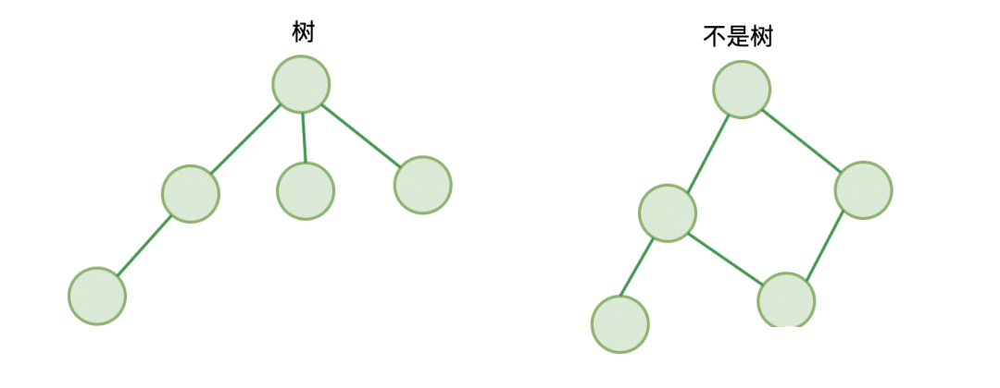

它遵循：

- 仅有唯一一个根节点，没有节点则为空树
- 除根节点外，每个节点都有并仅有唯一一个父节点
- 节点间不能形成闭环

树有几个概念：

- 拥有相同父节点的节点，互称为兄弟节点
- **节点的深度** ：从根节点到该节点所经历的边的个数
- **节点的高度** ：节点到叶节点的最长路径
- 树的高度：根节点的高度

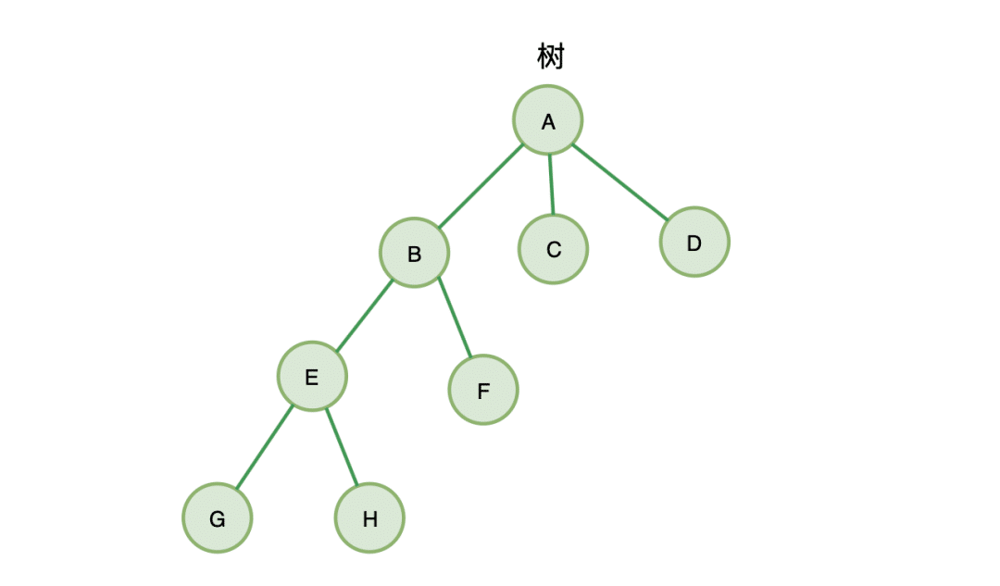

B、C、D就互称为兄弟节点，其中，节点B的高度为2，节点B的深度为 1，树的高度为3

#### 高度

树的高度计算公式：


下图每个节点值都代表来当前节点的高度：

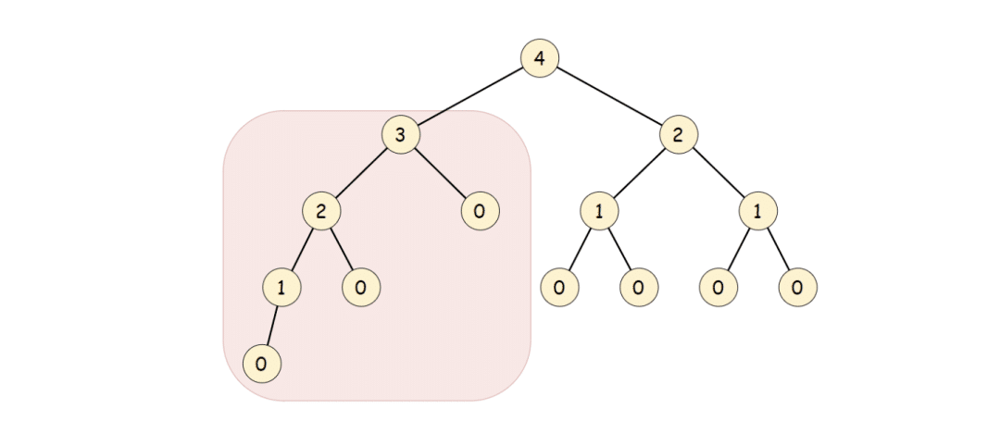

## 二叉树

二叉树，故名思义，最多仅有两个子节点的树（最多能分两个叉的树 ）：

图：

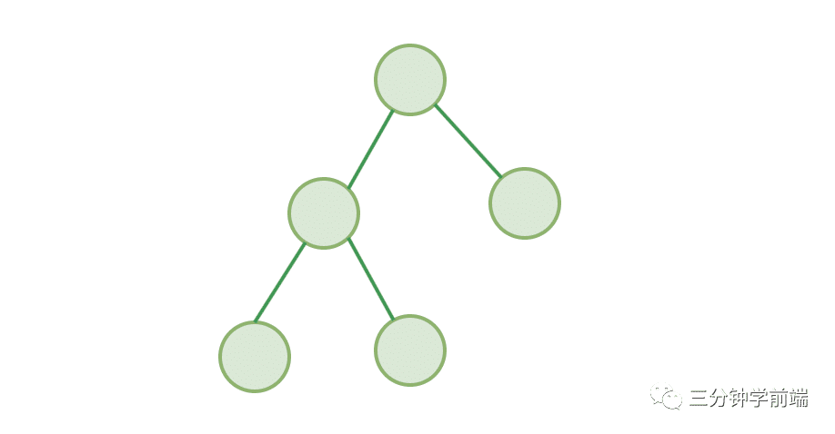

## 平衡二叉树

二叉树中，每一个节点的左右子树的高度相差不能大于 1，称为平衡二叉树。

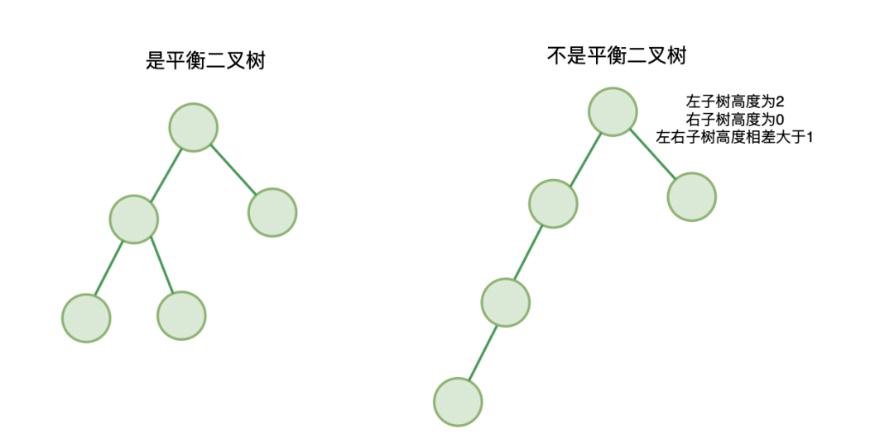

另外还有满二叉树、完全二叉树等：

- **满二叉树**：除了叶结点外每一个结点都有左右子叶且叶子结点都处在最底层的二叉树
- **完全二叉树**：深度为h，除第 h 层外，其它各层 (1～h-1) 的结点数都达到最大个数，第h 层所有的结点都连续集中在最左边

## 在代码中如何去表示一棵二叉树

### 链式存储法

二叉树的存储很简单，在二叉树中，我们看到每个节点都包含三部分：

- 当前节点的 val
- 左子节点 left
- 右子节点 right

所以我们可以将每个节点定义为：

```js
function Node(val) {
    // 保存当前节点 key 值
    this.val = val
    // 指向左子节点
    this.left = null
    // 指向右子节点
    this.right = null
}
```

一棵二叉树可以由根节点通过左右指针连接起来形成一个树。

```js
function BinaryTree() {
  let Node = function (val) {
    this.val = val
    this.left = null
    this.right = null
  }
  let root = null
}
```

### 数组存储法（适用于完全二叉树）

下图就是一棵完全二叉树，

如果我们把根节点存放在位置 `i=1` 的位置，则它的左子节点位置为 `2i = 2` ，右子节点位置为 `2i+1 = 3` 。

如果我们选取 B 节点 `i=2` ，则它父节点为 `i/2 = 1` ，左子节点 `2i=4` ，右子节点  `2i+1=5` 。

以此类推，我们发现所有的节点都满足这三种关系：

- 位置为 i 的节点，它的父节点位置为 `i/2`
- 它的左子节点 `2i`
- 它的右子节点  `2i+1`

因此，如果我们把完全二叉树存储在数组里（从下标为 1 开始存储），我们完全可以通过下标找到任意节点的父子节点。从而完整的构建出这个完全二叉树。这就是数组存储法。

以下树的数组存储为： `[1,9,2,8,3,7,4,6,5,null,null,null,null,null,null]`

数组存储法相对于链式存储法不需要为每个节点创建它的左右指针，更为节省内存。

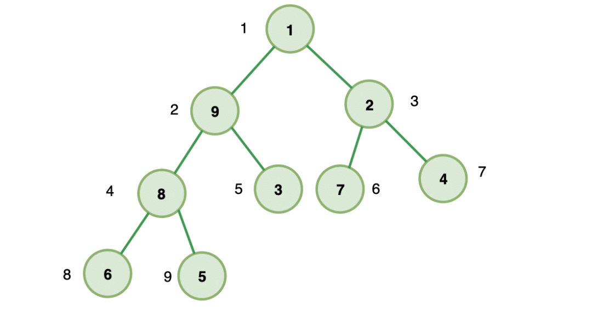

## 二叉树的遍历

二叉树的遍历可分为：

- 前序遍历
- 中序遍历
- 后序遍历

所谓前、中、后，不过是**根的顺序**，即也可以称为先根遍历、中根遍历、后根遍历

#### 前序遍历

对于二叉树中的任意一个节点，先打印该节点，然后是它的左子树，最后右子树

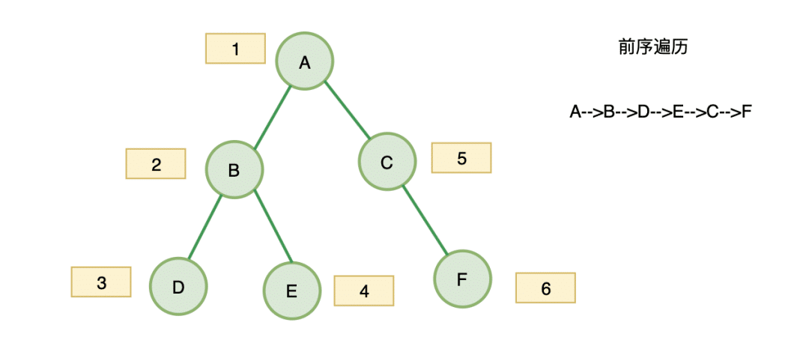

#### 中序遍历

对于二叉树中的任意一个节点，先打印它的左子树，然后是该节点，最后右子树


#### 后序遍历

对于二叉树中的任意一个节点，先打印它的左子树，然后是右子树，最后该节点

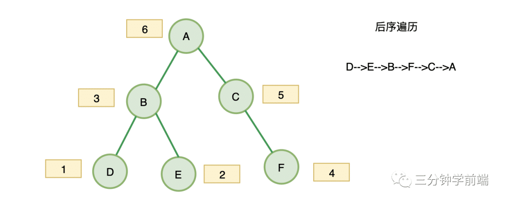


#### 前序遍历实现

>  遍历二叉树的过程也就是一个递归的过程，例如前序遍历，先遍历根节点，然后是根的左子树，最后右子树；遍历根节点的左子树的时候，又是先遍历左子树的根节点，然后左子树的左子树，左子树的右子树…….

##### 递归实现

```js
// 前序遍历
const preorderTraversal = (root) => {
    let result = []
    preOrderTraverseNode(root,result)
    return result
};

const preOrderTraverseNode = (node,result) => {
    if(node) {
        // 先根节点
        result.push(node.val)
        // 然后遍历左子树
        preOrderTraverseNode(node.left,result)
        // 再遍历右子树
        preOrderTraverseNode(node.right,result)
    }
}
```

##### 迭代实现

>  利用栈来记录遍历的过程，实际上，递归就使用了调用栈，所以这里我们可以使用栈来模拟递归的过程
>
> - 首先根入栈
> - 将根节点出栈，将根节点值放入结果数组中
> - 然后遍历左子树、右子树，因为栈是先入后出，所以，我们先右子树入栈，然后左子树入栈
> - 继续出栈（左子树被出栈）…….
>
> 依次循环出栈遍历入栈，直到栈为空，遍历完成

```js
// 前序遍历
const preorderTraversal = (root) => {
    const list = [];
    const stack = [];
    
    // 当根节点不为空的时候，将根节点入栈
    if(root) stack.push(root)
    while(stack.length > 0) {
        const curNode = stack.pop()
        // 第一步的时候，先访问的是根节点
        list.push(curNode.val)
        
        // 我们先打印左子树，然后右子树
        // 所以先加入栈的是右子树，然后左子树
        if(curNode.right !== null) {
            stack.push(curNode.right)
        }
        if(curNode.left !== null) {
            stack.push(curNode.left)
        }
    }
    return list
}
```

> ##### 复杂度分析：
>
> 空间复杂度：O(n)
>
> 时间复杂度：O(n)


#### 中序遍历

> * 遍历左子树
> * 遍历当前节点
> * 遍历右子树

##### 递归实现

````js
// 中序遍历
const indorderTraversal = (root) => {
    let result = []
    indorderTraversal(root,result)
    return result
};
const indOrderTraverseNode = (node,result) => {
    if(node) {
        // 遍历左子树
        indOrderTraverseNode(node.left,result)
        // 根节点
        result.push(node.val)
        // 再遍历右子树
        indOrderTraverseNode(node.right,result)
    }
}
````

##### 迭代实现

> * 将当前节点指针指向根节点，循环当前节点不为空或栈不为空
>   * 循环找查找左子树，并将左子树入栈，直到左子树为空
>   * 栈顶元素出栈，访问当前节点
>   * 将当前节点右子树入栈

```js
const inorderTraversal = (root) => {
  const result = [];
  const stack = [];

  let current = root;

  while (current || stack.length > 0) {
    // 将左子树的所有左节点入栈
    while (current) {
      stack.push(current);
      current = current.left;
    }

    // 弹出栈顶节点，并将其值加入结果数组
    current = stack.pop();
    result.push(current.val);

    // 处理右子树
    current = current.right;
  }

  return result;
};
```


#### 后序遍历

> * 遍历左子树
> * 遍历右子树
> * 遍历当前节点

##### 递归实现

```js
const postOrderTraversal = (root)=> {
	let result = [];
    postOderTraverNode(root,result); 
    return result;
}
const postOderTraverNode = (node,result)=> {
    if(node) {
        // 遍历左子树
        postOderTraverNode(node.left,result);
        // 遍历右子树
        postOderTraverNode(node.right,result);
        // 遍历当前节点
        result.push(node.value)
    }
}
```


##### 迭代实现

> * 将当前节点指针指向根节点，循环当前节点不为空或栈不为空
>   * 循环查找左子树，并将左子树入栈，直到左子树为空
>   * 访问当前节点栈顶元素
>   * 如果`current`的右子树为空或者已经遍历过右子树（通过变量`prev`进行判断），则将`current`的值加入结果数组`result`，将`current`出栈，将`prev`更新为`root`，并将`root`设为`null`，以便继续处理栈中的下一个节点。
>   * 如果`current`的右子树不为空且还未遍历过右子树，则将`current`的右子树赋值给`current`，继续遍历右子树。

```js
const postorderTraversal = (root) => {
  const result = [];
  const stack = [];

  let current = root;
  let prev = null;
  while (current || stack.length > 0) {
    // 将左子树的所有左节点入栈
    while (current) {
      stack.push(current);
      current = current.left;
    }

    // 获取栈顶元素
    current = stack[stack.length-1]
     // 如果右子树为空或已经遍历过右子树
    if(!current.right || prev === current) {   
      result.push(current.val); // 将当前节点值加入结果数组
      stack.pop(); // 将当前节点出栈
      prev = current; // 记录上一个已遍历的节点
      current = null; // 继续遍历栈中的下一个节点
    }else {
        // 处理右子树
    	current = current.right;
    }
  }

  return result;
};
```


#### 层次遍历

给定一个二叉树，返回其节点值自底向上的层次遍历。（即按从叶子节点所在层到根节点所在的层，逐层从左向右遍历）

例如：给定二叉树 `[3,9,20,null,null,15,7]` ,

```js
    3
   / \
  9  20
    /  \
   15   7
```

返回其自底向上的层次遍历为：

```js
[
  [15,7],
  [9,20],
  [3]
]
```

##### BFS（广度优先遍历）

> BFS 是按层层推进的方式，遍历每一层的节点。题目要求的是返回每一层的节点值，所以这题用 BFS 来做非常合适。BFS 需要用队列作为辅助结构，我们先将根节点放到队列中，然后不断遍历队列。
>
> * 使用两个队列存储：
>   * 当前遍历数据队列 `queue`：保存当前遍历的数据
>   * 下一层数据队列 `tempQueue`: 保存节点的子节点
> * 根节点入队列，循环遍历当前数据队列 queue:
>   * 节点出队列，访问节点，将节点左右子节点入  `tempQueue`；
>   * 替换当前 `queue` 为 `tempQueue`；

```js
const levelOrderBottom = function(root) {
    if(!root) return []
    let res = [], 
        queue = [root] 
    while(queue.length) {
        let curr = [], // 每层数组
            tempQueue = [] // 临时队列，存储 queue 下一层数据的队列
        while(queue.length) {
            let node = queue.shift()
            curr.push(node.val)
            if(node.left) tempQueue.push(node.left)
            if(node.right) tempQueue.push(node.right)
        }
        res.push(curr)
        queue = tempQueue // 将当前队列替换为下一层数据的临时队列
    }
    return res.reverse()
};
```

> **复杂度分析**
>
> - 时间复杂度：O(n)
> - 空间复杂度：O(n)

##### DFS（深度优先遍历）

>  DFS 是沿着树的深度遍历树的节点，尽可能深地搜索树的分支
>
> DFS 做本题的主要问题是：DFS 不是按照层次遍历的。为了让递归的过程中同一层的节点放到同一个列表中，在递归时要记录每个节点的深度 `depth` 。递归到新节点要把该节点放入 `depth` 对应列表的末尾。
>
> 当遍历到一个新的深度 `depth` ，而最终结果 `res` 中还没有创建 `depth` 对应的列表时，应该在 `res` 中新建一个列表用来保存该 `depth` 的所有节点。


```js
const levelOrderBottom = function(root) {
    const res = []
    dfs(root, 0)
    return res.reverse()   
};
const dfs = function (node, depth){
    if(!node) return
    res[depth] = res[depth]||[] // 取出深度 depth 的数组
    res[depth].push(node.val) //将当前节点存入深度  depth 的数组
    dfs(node.left, depth + 1) // 深度遍历左节点
    dfs(node.right, depth + 1) // 深度遍历右节点
}
```

> **复杂度分析：**
>
> - 时间复杂度：O(n)
> - 空间复杂度：O(h)，h为树的高度

#### 层序遍历

给你一个二叉树，请你返回其按 **层序遍历** 得到的节点值。（即逐层地，从左到右访问所有节点）。

**示例：**二叉树：`[3,9,20,null,null,15,7]` ,

```js
    3
   / \
  9  20
    /  \
   15   7
```

返回其层次遍历结果：

```js
[
  [3],
  [9,20],
  [15,7]
]
```


这道题和二叉树的层次遍历相似，只需要把 `reverse()` 去除就可以了

##### **BFS 广度优先遍历**

```js
const levelOrder = function(root) {
    if(!root) return []
    let res = [], 
        queue = [root]
    while(queue.length) {
        let curr = [],
            temp = []
        while(queue.length) {
            let node = queue.shift()
            curr.push(node.val)
            if(node.left) temp.push(node.left)
            if(node.right) temp.push(node.right)
        }
        res.push(curr)
        queue = temp
    }
    return res
};
```

##### **DFS 深度优先遍历**

```js
const levelOrderBottom = function(root) {
    const res = []
    dfs(root, 0)
    return res 
};
const dfs = function (node, depth){
    if(!node) return
    res[depth] = res[depth]||[] // 取出深度 depth 的数组
    res[depth].push(node.val) //将当前节点存入深度  depth 的数组
    dfs(node.left, depth + 1) // 深度遍历左节点
    dfs(node.right, depth + 1) // 深度遍历右节点
}
```


## **二叉树还原**

> **二叉树的还原**：指的是通过二叉树的遍历序列，还原出对应的二叉树。

从二叉树的遍历过程可以看出，给定一棵非空二叉树，它的前序、中序、后续遍历所得到的遍历序列都是唯一的。那么反过来，如果已知节点的某种遍历序列，能否确定这棵二叉树呢？并且确定的二叉树是否是唯一的呢？

我们先来回顾一下二叉树的前序遍历、中序遍历、后序遍历规则。

- 非空二叉树的前序遍历规则：
  1. 访问根节点。
  2. 以前序遍历的方式遍历根节点的左子树。
  3. 以前序遍历的方式遍历根节点的右子树。
- 非空二叉树的中序遍历规则：
  1. 以中序遍历的方式遍历根节点的左子树。
  2. 访问根节点。
  3. 以中序遍历的方式遍历根节点的右子树。
- 非空二叉树的后序遍历规则：
  1. 以后序遍历的方式遍历根节点的左子树。
  2. 以后序遍历的方式遍历根节点的右子树。
  3. 访问根节点。


**给出单个二叉树遍历顺序能否还原二叉树？**

先来看二叉树的前序遍历：

* 前序遍历过程中首先访问的是根节点，所以通过前序遍历序列，我们可以确定序列的第 1 个节点肯定是根节点。
* 但是从第 2 个节点开始就不确定它是根节点的左子树还是根节点的右子树了。
* 所以单凭前序遍历序列是无法恢复一棵二叉树的。

再来看二叉树的后序遍历：

* 后序遍历也是只能确定序列的最后一个节点为根节点，而无法确定其他节点在二叉树中的位置。
* 所以单凭后序遍历序列也是无法恢复一棵二叉树的。

最后我们来看二叉树的中序遍历：

* 中序遍历是先遍历根节点的左子树，然后访问根节点，最后遍历根节点的右子树。
* 这样，根节点在中序遍历序列中必然将中序序列分割成前后两个子序列，其中前一个子序列是根节点的左子树的中序遍历序列，后一个子序列是根节点的右子树的中序遍历序列。
* 当然单凭中序遍历序列也是无法恢复一棵二叉树的。


将「前序遍历序列」和「中序遍历序列」相结合：

1. 那么我们可以通过上面中序遍历序列中的两个子序列，在前序遍历序列中找到对应的左子序列和右子序列。
2. 在前序遍历序列中，左子序列的第 1 个节点是左子树的根节点，右子序列的第 1 个节点是右子树的根节点。
3. 这样，就确定了二叉树的 3 个节点。
4. 同时，左子树和右子树的根节点在中序遍历序列中又可以将左子序列和右子序列分别划分成两个子序列。
5. 如此递归下去，当确定了前序遍历序列中的所有节点时，我们就得到了一棵二叉树。


### **结论**

- **如果已知一棵二叉树的前序序列和中序序列，可以唯一地确定这棵二叉树**
- **如果已知一棵二叉树的中序序列和后序序列，可以唯一地确定这棵二叉树。** 
- **已知二叉树的「中序遍历序列」和「层序遍历序列」，可以唯一地确定一棵二叉树**
- **如果已知二叉树的「前序遍历序列」和「后序遍历序列」，是不能唯一地确定一棵二叉树的**

既可以还原的二叉树遍历顺序组合为：

* 「前序序列」 + 「中序序列」
* 「后序序列」 + 「中序序列」 
* 「中序序列」 + 「层序序列」


### 前序+中序遍历序列构造二叉树

输入某二叉树的前序遍历和中序遍历的结果，请重建该二叉树。假设输入的前序遍历和中序遍历的结果中都不含重复的数字。

**注意:**你可以假设树中没有重复的元素。

例如，给出

```
前序遍历 preorder = [3,9,20,15,7]
中序遍历 inorder = [9,3,15,20,7]
```

返回如下的二叉树：

```js
    3
   / \
  9  20
    /  \
   15   7
```

**限制：**

```
0 <= 节点个数 <= 5000
```

**思路**

>  * 前序遍历的顺序是：根节点 - 左子树 - 右子树。
>  * 中序遍历的顺序是：左子树 - 根节点 - 右子树。
>
>  思路：
>
>  1. **查找根节点**：根据前序遍历的顺序，可以找到根节点位置。
>  2. **查找根节点的左右子树**：在中序遍历的结果中可以找到对应的根节点位置，就可以从根节点位置将二叉树分割成左子树、右子树。同时能得到左右子树的节点个数。
>
>  3. **构建子树**：此时构建当前节点，并递归建立左右子树，在左右子树对应位置继续递归遍历进行上述步骤，直到节点为空。
>
>  具体操作步骤如下：
>
>  1. 从前序遍历顺序中得到当前根节点的位置在 𝑝𝑜𝑠𝑡𝑜𝑟𝑑𝑒𝑟[0]。
>  2. 通过在中序遍历中查找上一步根节点对应的位置 𝑖𝑛𝑜𝑟𝑑𝑒𝑟[𝑘]，从而将二叉树的左右子树分隔开，并得到左右子树节点的个数。
>  3. 从上一步得到的左右子树个数将前序遍历结果中的左右子树分开。
>  4. 构建当前节点，并递归建立左右子树，在左右子树对应位置继续递归遍历并执行上述三步，直到节点为空
>
>  以题目为例：
>
>  1. 前序遍历的第一个元素一定是根节点，这里是`3`
>  2. 找到根节点之后，根节点在中序遍历中把数组一分为二，即两个数组`[9]`和`[15, 20, 7]`，这两个数组分别是根节点`3`的左子树和右子树的中序遍历。
>  3. 前序遍历数组去掉根节点之后是`[9,20,15,7]`，而这个数组的第1项`[9]`（左子树的大小）和后3项`[20, 15, 7]`（右子树的大小）又分别是左子树和右子树的前序遍历 到这里已经很明显了，用递归

```js
function TreeNode(val) {
    this.val   =  val;
    this.left  =  null;
    this.right =  null;
}
const buildTree = function (preorder, inorder) {
    if (preorder.length) {
        let head = new TreeNode(preorder.shift());
        let index = inorder.indexOf(head.val);
        head.left = buildTree(
            preorder.slice(0, index),
            inorder.slice(0, index)
        );
        head.right = buildTree(preorder.slice(index), inorder.slice(index + 1));
        // 这里要注意，preorder前面shift一次长度比inorder小1
        return head;
    } else {
        return null;
    }
};
```


### **中序+后序遍历序列构造二叉树**

- **描述**：已知一棵二叉树的中序遍历序列和后序遍历序列。
- **要求**：构造出该二叉树。
- **注意**：假设树中没有重复的元素。

**思路**

> * 中序遍历的顺序是：左子树 - 根节点 - 右子树。
> * 后序遍历的顺序是：左子树 - 右子树 - 根节点。
>
> 思路：
>
> 1. **查找根节点**：根据后序遍历的顺序，可以找到根节点位置。
> 2. **查找根节点的左右子树**：在中序遍历的结果中可以找到对应的根节点位置，就可以从根节点位置将二叉树分割成左子树、右子树。同时能得到左右子树的节点个数。
>
> 3. **构建子树**：此时构建当前节点，并递归建立左右子树，在左右子树对应位置继续递归遍历进行上述步骤，直到节点为空，
>
> 具体操作步骤如下：
>
> 1. 从后序遍历顺序中当前根节点的位置在 𝑝𝑜𝑠𝑡𝑜𝑟𝑑𝑒𝑟[𝑛−1]。
> 2. 通过在中序遍历中查找上一步根节点对应的位置 𝑖𝑛𝑜𝑟𝑑𝑒𝑟[𝑘]，从而将二叉树的左右子树分隔开，并得到左右子树节点的个数。
> 3. 从上一步得到的左右子树个数将后序遍历结果中的左右子树分开。
> 4. 构建当前节点，并递归建立左右子树，在左右子树对应位置继续递归遍历并执行上述三步，直到节点为空。


```javascript
// 假设 TreeNode 类已经定义  
// class TreeNode {  
//     constructor(val, left = null, right = null) {  
//         this.val = (val === undefined ? 0 : val);  
//         this.left = left;  
//         this.right = right;  
//     }  
// }  
  
function buildTree(inorder, postorder) {  
    function createTree(inorderStart, inorderEnd, postorderStart, postorderEnd) {  
        if (inorderStart > inorderEnd || postorderStart > postorderEnd) {  
            return null;  
        }  
  
        // 后序遍历的最后一个节点是根节点  
        const rootVal = postorder[postorderEnd];  
        let k = inorderStart;  
        // 在中序遍历中找到根节点的索引  
        while (inorder[k] !== rootVal) {  
            k++;  
        }  
  
        // 递归地构建右子树  
        const rightSubtree = createTree(k + 1, inorderEnd, postorderStart + (k - inorderStart), postorderEnd - 1);  
        // 递归地构建左子树  
        const leftSubtree = createTree(inorderStart, k - 1, postorderStart, postorderStart + (k - inorderStart) - 1);  
  
        // 创建新的根节点，并连接左右子树  
        const node = new TreeNode(rootVal);  
        node.right = rightSubtree;  
        node.left = leftSubtree;  
  
        return node;  
    }  
  
    return createTree(0, inorder.length - 1, 0, postorder.length - 1);  
}  
  
// 使用示例（假设你已经有了一个 TreeNode 类和对应的 inorder、postorder 数组）  
// let root = buildTree(inorder, postorder);  
// // 在这里可以对 root 进行操作，例如遍历或打印
```


### **前序+后序遍历序列构造二叉树**

**已知二叉树的前序遍历序列和后序遍历序列，是不能唯一地确定一棵二叉树的。**

而如果不要求构造的二叉树是唯一的，只要求构造出一棵二叉树，还是可以进行构造的。

- **描述**：已知一棵二叉树的前序遍历序列和后序遍历序列。
- **要求**：重构并返回该二叉树。
- **注意**：假设树中没有重复的元素。如果存在多个答案，则可以返回其中任意一个。

**思路**

> * 前序遍历的顺序是：根节点 -左子树 - 右子树 。
> * 后序遍历的顺序是：左子树 - 右子树 - 根节点。
>
> 我们可以默认指定前序遍历序列的第 2 个值为左子树的根节点，由此递归划分左右子序列。具体操作步骤如下：
>
> 1. 从前序遍历序列中可知当前根节点的位置在 𝑝𝑟𝑒𝑜𝑟𝑑𝑒𝑟[0]。
> 2. 前序遍历序列的第 2 个值为左子树的根节点，即 𝑝𝑟𝑒𝑜𝑟𝑑𝑒𝑟[1]。
> 3. 通过在后序遍历中查找上一步根节点对应的位置 𝑝𝑜𝑠𝑡𝑜𝑟𝑑𝑒𝑟[𝑘]（该节点右侧为右子树序列），从而将二叉树的左右子树分隔开，并得到左右子树节点的个数。
> 4. 从上一步得到的左右子树个数将后序遍历结果中的左右子树分开。
> 5. 构建当前节点，并递归建立左右子树，在左右子树对应位置继续递归遍历并执行上述步骤，直到节点为空。


```javascript
function constructFromPrePost(preorder, postorder) {  
        function createTree(preorder, postorder, n) {  
            if (n === 0) {  
                return null;  
            }  
            //前序遍历序列中,当前根节点的位置在 𝑝𝑟𝑒𝑜𝑟𝑑𝑒𝑟[0]
            const node = new TreeNode(preorder[0]);  
            if (n === 1) {  
                return node;  
            }  
             
            //在后序遍历中查找根节点对应的位置 𝑝𝑜𝑠𝑡𝑜𝑟𝑑𝑒𝑟[𝑘],该节点将后序遍历分为左右子树
            let k = 0;  
            while (postorder[k] !== preorder[1]) {  
                k++;  
            }  
            // 递归构建根节点左子树
            node.left = createTree(preorder.slice(1, k + 2), postorder.slice(0, k + 1), k + 1);  
            // 递归构建根节点右子树
            node.right = createTree(preorder.slice(k + 2), postorder.slice(k + 1, n - 1), n - k - 2);  
              
            return node;  
        }  
          
        return createTree(preorder, postorder, preorder.length);  
    }
```


### 题目

| 题号 | 标题                                                         | 标签                           | 难度 |
| :--- | :----------------------------------------------------------- | :----------------------------- | :--- |
| 0105 | [从前序与中序遍历序列构造二叉树](https://leetcode.cn/problems/construct-binary-tree-from-preorder-and-inorder-traversal/) | 树、数组、哈希表、分治、二叉树 | 中等 |
| 0106 | [从中序与后序遍历序列构造二叉树](https://leetcode.cn/problems/construct-binary-tree-from-inorder-and-postorder-traversal/) | 树、数组、哈希表、分治、二叉树 | 中等 |
| 0889 | [根据前序和后序遍历构造二叉树](https://leetcode.cn/problems/construct-binary-tree-from-preorder-and-postorder-traversal/) | 树、数组、哈希表、分治、二叉树 | 中等 |


---


## **二叉树深度**

###  二叉树的最大深度

给定一个二叉树，找出其最大深度。

二叉树的深度为根节点到最远叶子节点的最长路径上的节点数。

**说明:** 叶子节点是指没有子节点的节点。

**示例：**给定二叉树 `[3,9,20,null,null,15,7]` ，

```
    3
   / \
  9  20
    /  \
   15   7
```

返回它的最大深度 3


#### **递归**

> * 使用递归深度遍历左子树的高度和右子树深度
> * 比较左子树和右子树深度，获取最大深度
> * 返回最大深度加1；

```js
const maxDepth = function(root) {
    if(!root) return 0 
    return 1 + Math.max(maxDepth(root.left), maxDepth(root.right))
};
```

**复杂度分析：**

- 时间复杂度：O(n)
- 空间复杂度：O(log⁡n)

#### **层次遍历获取层数（广度优先搜索）**

> 二叉树层次即为二叉树最大深度，使用层序遍历（广度优先搜索）的方式：
>
> * 使用队列存储每一层节点；
> * 获取每一层的节点数（队列长度即为节点数）；
> * 遍历每一层的节点，将节点的左子树和右子树入队列；
> * 遍历完成一层，树深度加1；

```js
class TreeNode {
  constructor(value) {
    this.value = value;
    this.left = null;
    this.right = null;
  }
}

function maxDepth(root) {
  if (root === null) {
    return 0;
  }

  let depth = 0;
  const queue = [root]; //队列存储每一层节点

  while (queue.length > 0) {
    // 获取每一层的节点数（队列长度即为节点数）
    const levelSize = queue.length;
	// 遍历每一层的节点，将节点的左子树和右子树入队列
    for (let i = 0; i < levelSize; i++) {
      const current = queue.shift();

      if (current.left !== null) {
        queue.push(current.left);
      }

      if (current.right !== null) {
        queue.push(current.right);
      }
    }
	// 遍历完成一层，树深度加1
    depth++;
  }

  return depth;
}

// 示例用法
// 创建二叉树
const root = new TreeNode(3);
root.left = new TreeNode(9);
root.right = new TreeNode(20);
root.right.left = new TreeNode(15);
root.right.right = new TreeNode(7);

const result = maxDepth(root);
console.log(result); // 输出: 3
```


#### **深度优先搜索**

> 先序遍历（深度优先搜索）子树，并使用 maxDep 记录最大深度
>
> * 使用栈保存遍历的节点；
> * 循环遍历栈，直到栈为空；
> * 深度遍历左子树，将左子树入栈，深度加一，并比较当前深度是否为最大深度，如果是，保存最大深度；
> * 出栈，深度减一，指针指向右子树

```js
const maxDepth = (root) => {
  if (!root) return 0;
  let stack = [];
  let cur = root;
  let dep = 0, maxDep = 0; // 修正初始值为0
  stack.push(root);
  while (stack.length) {
    while (cur) { // 深度遍历左子树
      dep++; //深度加1
      if (dep > maxDep) { // 更新maxDep
        maxDep = dep;
      }
      stack.push(cur.left);
      cur = cur.left;
    }
    cur = stack.pop(); // 出栈遍历节点右节点
    dep--; //出栈后深度减1
    cur = cur.right; // 遍历节点右节点
  }
  return maxDep;
};
```


### 二叉树最小深度

给定一个二叉树，找出其最小深度。

最小深度是从根节点到最近叶子节点的最短路径上的节点数量。

说明: 叶子节点是指没有子节点的节点。

示例:

给定二叉树 `[3,9,20,null,null,15,7]`,

```js
    3
   / \
  9  20
    /  \
   15   7
```

返回它的最小深度 2


#### **递归**

> 深度优先 + 分治
>
> - 左右子树都不为空：左子树深度和右子树最小深度的最小值 + 1
> - 左树为空：右子树最小深度的最小值 + 1
> - 右树为空：左子树最小深度 + 1

```js
    var minDepth = function (root) {
      if (!root) {
        return 0;
      }
      if (!root.left) {
        return 1 + minDepth(root.right);
      }
      if (!root.right) {
        return 1 + minDepth(root.left);
      }
      return Math.min(minDepth(root.left), minDepth(root.right)) + 1
    };

```


## 二叉查找树（BST树）

* 二叉查找树木又称二叉搜索树

* 二叉搜索树上的每个节点都需要满足：

  - 左子节点值小于该节点值

  - 右子节点值大于等于该节点值


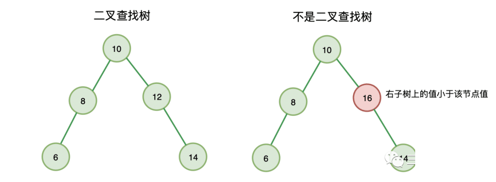

在二叉树中，所有子节点值都是没有固定规律的，所以使用二叉树存储结构存储数据时，查找数据的时间复杂度为 O(n)，因为它要查找每一个节点。

而使用二叉查找树就不同了，例如上图，我们如果要查找 6 ，先从根节点 10 比较，6 比 10 小，则查找左子树，再与 8 比较，6 比 8 小，继续查找 8 的左子树，也就是 6，我们找到了元素，结束。


### 基本操作

```js
function BinarySearchTree() {
  let Node = function (key) {
    this.key = key
    this.left = null
    this.right = null
  }
  let root = null
  
  // 插入
  this.insert = function(key){}
  
  // 查找
  this.search = function(key){}
  
  // 删除
  this.remove = function(key){}
  
  // 最大值
  this.max = function(){}
  
  // 最小值
  this.min = function(){}
  
  // 中序遍历
  this.inOrderTraverse = function(){}
  
  // 先序遍历
  this.preOrderTraverse = function(){}
  
  // 后序遍历
  this.postOrderTraverse = function(){}
}
```

### **插入**

- 首先创建一个新节点
- 判断树是否为空，为空则设置插入的节点为根节点，插入成功，返回
- 如果不为空，则比较该节点与根结点，比根小，插入左子树，否则插入右子树

```js
function insert(key) {
  // 创建新节点
  let newNode = new Node(key)
  // 判断是否为空树
  if(root === null) {
    root = newNode
  } else {
    insertNode(root, newNode)
  }
}

// 将 insertNode 插入到 node 子树上
function insertNode(node, newNode) {
  if(newNode.key < node.key) {
    // 插入 node 左子树
    if(node.left === null) {
      node.left = newNode
    } else {
      // 递归插入左子树
      insertNode(node.left, newNode)
    }
  } else {
    // 插入 node 右子树
    if(node.right === null) {
      node.right = newNode
    } else {
      // 递归插入右子树
      insertNode(node.right, newNode)
    }
  }
}
```

### **最值**

**最小值：树最左端的节点**

**最大值：树最右端的节点**

```js
// 最小值
function min() {
  let node = root
  if(node) {
    while(node && node.left !== null) {
      node = node.left
    }
    return node.key
  }
  return null
}

// 最大值
function max() {
  let node = root
  if(node) {
    while(node && node.right !== null) {
      node = node.right
    }
    return node.key
  }
  return null
}
```

### **查找**

```js
function search(key) {
  return searchNode(root, key)
}

function searchNode(node, key) {
  if(node === null) 
    return false
  if(key < node.key) {
    // 递归搜索左子树
    return searchNode(node.left, key)
  } else if(key > node.key) {
    // 递归搜索右子树
    return searchNode(node.right, key)
  } else {
    return true
  }
}
```

### **删除**

二叉查找树（Binary Search Tree，BST）的删除节点操作可以分为三种情况：
1. 删除的节点是叶子节点（没有子节点）：直接删除即可。

   > * 示例：删除元素 27
   >
   > 

2. 删除的节点有一个子节点：将子节点替代要删除的节点。

   > * 示例：删除元素 50
   >
   > 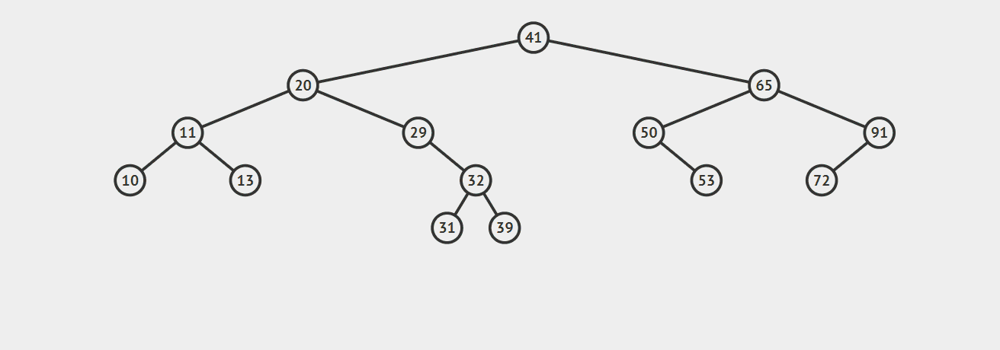

3. 删除的节点有两个子节点：需要找到该节点的后继节点或前驱节点来替代要删除的节点。

   > * 前驱节点与后继节点：
   >
   >   * 该节点的后继节点：排在该节点值的下一个位置的节点，在该节点右子树的最小节点（上图中 20 的后继节点是29）
   >   * 该节点的前驱节点：排在该节点值的上一个位置的节点，在该节点左子树的最大节点（上图中 20 的前驱节点是13）
   >
   > * 使用后继节点代替删除节点，需要考虑两种情况：
   >
   >   * 后继节点没有子节点：直接使用后继节点代替当前节点，后删除后继节点；
   >
   >     
   >
   >   * 后继节点有子节点：使用后继节点代替当前节点后，将后继节点的子节点代替后继节点
   >
   >     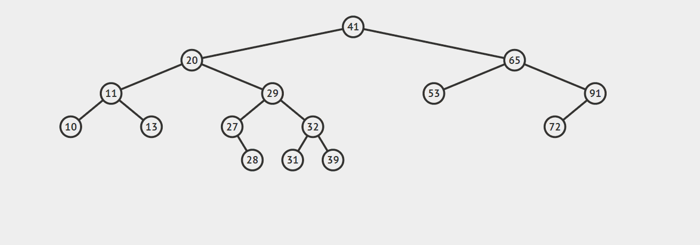
   >
   > 

```js
function remove(key) {
  root = removeNode(root, key)
}

function removeNode(node, key) {
  if(node === null) 
    return null
  if(key < node.key) {
    // 递归查找左子树
    return removeNode(node.left, key)
  } else if(key > node.key) {
    // 递归查找右子树
    return removeNode(node.right, key)
  } else { // 找到删除节点
    // key = node.key 删除
    //被删除节点是叶子节点：直接删除
    if(node.left === null && node.right === null) {
      node = null
      return node
    }
    // 被删除节点只有一个子节点，用子节点代替被删除节点
    if(node.left === null) {
      node = node.right
      return node
    }
    // 被删除节点只有一个子节点，用子节点代替被删除节点
    if(node.right === null) {
      node = node.left
      return node
    }
    // 被删除节点有两个子节点
    // 获取前驱节点替代当前节点：右子树的最小值替换当前节点
    let minRight = findMinNode(node.right)
    node.key = minRight.key
    // 移出删除节点的右子节点
    node.right = removeNode(node.right, minRight.key)
    return node
  }
}

// 获取 node 树最小节点
function findMinNode(node) {
  if(node) {
    while(node && node.right !== null) {
      node = node.right
    }
    return node
  }
  return null
}
```

### 遍历

#### **中序遍历**

> 中序遍历就是把根放在中间的遍历，即按先左节点、然后根节点、最后右节点（左根右）的遍历方式。
>
> 由于BST树任意节点都大于左子节点值小于等于右子节点值的特性，所以 **中序遍历其实是对树进行排序操作 ，并且是按从小到大的顺序排序**。
>
> 


```js
function inOrderTraverse(callback) {
  inOrderTraverseNode(root, callback)
}

function inOrderTraverseNode(node, callback) {
  if(node !== null) {
    // 先遍历左子树
    inOrderTraverseNode(node.left, callback)
    // 然后根节点
    callback(node.key)
    // 再遍历右子树
    inOrderTraverseNode(node.right, callback)
  }
}

// callback 每次将遍历到的结果打印到控制台
function callback(key) {
  console.log(key)
}
```

#### **先序遍历**

>  已经实现的中序遍历，先序遍历就很简单了，它是按根左右的顺序遍历

```js
function preOrderTraverse() {
  preOrderTraverseNode(root, callback)
}

function preOrderTraverseNode(node, callback) {
  if(node !== null) {
    // 先根节点
    callback(node.key)
    // 然后遍历左子树
    preOrderTraverseNode(node.left, callback)
    // 再遍历右子树
    preOrderTraverseNode(node.right, callback)
  }
}

// callback 每次将遍历到的结果打印到控制台
function callback(key) {
  console.log(key)
}
```

#### **后序遍历**

> 后序遍历按照左右根的顺序遍历，实现也很简单。

```js
function postOrderTraverse() {
  postOrderTraverseNode(root, callback)
}

function postOrderTraverseNode(node, callback) {
  if(node !== null) {
    // 先遍历左子树
    postOrderTraverseNode(node.left, callback)
    // 然后遍历右子树
    postOrderTraverseNode(node.right, callback)
    // 最后根节点
    callback(node.key)
  }
}

// callback 每次将遍历到的结果打印到控制台
function callback(key) {
  console.log(key)
}
```


### [**判断是否为二叉搜索树**](https://www.nowcoder.com/practice/a69242b39baf45dea217815c7dedb52b?tpId=295&tqId=2288088&ru=/exam/oj&qru=/ta/format-top101/question-ranking&sourceUrl=%2Fexam%2Foj%3Fpage%3D1%26tab%3D%25E7%25AE%2597%25E6%25B3%2595%25E7%25AF%2587%26topicId%3D295)

给定一个二叉树根节点，请你判断这棵树是不是二叉搜索树。

二叉搜索树满足每个节点的左子树上的所有节点均小于当前节点且右子树上的所有节点均大于当前节点。

> 例1：
>
> 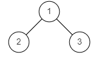
>
> 输入：
>
> ```
> {1,2,3}
> ```
>
> 返回值：false
>
> 
>
> 输入：
>
> ```
> {2,1,3}
> ```
>
> 返回值：true

**思路：**

>  **二叉搜索树的特性就是中序遍历是递增序**。
>
>  既然是判断是否是二叉搜索树，那我们可以使用中序递归遍历。
>
>  只要之前的节点是二叉树搜索树，那么如果当前的节点小于上一个节点值那么就可以向下判断。

**递归:中序遍历**

```js
/*
 * function TreeNode(x) {
 *   this.val = x;
 *   this.left = null;
 *   this.right = null;
 * }
 */
/**
 * 代码中的类名、方法名、参数名已经指定，请勿修改，直接返回方法规定的值即可
 *
 * 
 * @param root TreeNode类 
 * @return bool布尔型
 */
function isValidBST( root ) {
  
    let preVal = Math.Infinity; //保存上一个遍历节点的值
    if(root == null) return true;
    //递归遍历左子树，判断左子树中序遍历是否为升序
    if(!isValidBST(root.left)) return false; 
    //判断当前节点与先前节点值的大小，中序遍历中当前节点是小于先序节点的值，则不是搜索二叉树
    if(root.val < preVal) return false;
    //记录当前节点的值
    preVal =  root.val; 
    //先序遍历右子树
    return isValidBST(root.right);
}
module.exports = {
    isValidBST : isValidBST
};
```


### BST树的局限

* 二叉搜索树的查找效率取决于树的高度，因此保持树的高度最小，即可保证树的查找效率。

* 在理想情况下，二叉树每多一层，可以存储的元素都增加一倍。也就是说 n 个元素的二叉搜索树，对应的树高为 O(logn)。所以我们查找元素、插入元素的时间也为 O(logn)。

* 但在实际应用中，并不是那么理想，例如一直递增或递减的给一个二叉查找树插入数据，那么所有插入的元素就会一直出现在一个树的左节点上，数型结构就会退化为链表结构，时间复杂度就会趋于 O(n)

而我们上面的平衡树就可以很好的解决这个问题，所以平衡二叉查找树由此诞生。

## 平衡二叉查找树（AVL树）

概念：左右子树高度差不大于 1， 任意节点值大于它的左子节点值，小于等于它的右子节点值。

### **特点**

* **高度平衡**：平衡二叉树的左右子树的高度差不超过1，这意味着树的高度相对较低，使得查找、插入和删除等操作的时间复杂度可以在较低的范围内保持平衡。
* **快速查找**：由于平衡二叉树的结构特点，可以通过比较根节点的值与目标值的大小来确定向左子树或右子树进行查找，从而在平均情况下实现快速的查找操作。
* **平衡性维护**：平衡二叉树在插入或删除节点时会自动进行平衡调整，通过旋转操作可以保持树的平衡性，避免出现极端情况下树的高度过大或过小，导致查找性能下降。
* **操作复杂度保持较低**：在平衡二叉树中，插入、删除和查找等操作的平均时间复杂度为O(log n)，其中n是树中节点的数量。这使得平衡二叉树在处理大量数据时具有较高的效率。

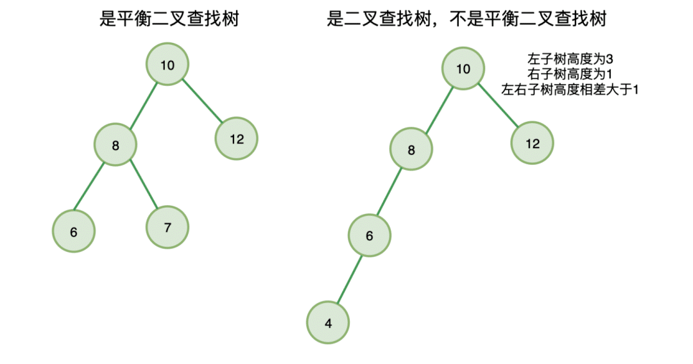


### 平衡因子

**定义：**某节点的左子树与右子树的高度(深度)差即为该节点的平衡因子（BF,Balance Factor）。

平衡二叉树中不存在平衡因子大于 1 的节点。

在一棵平衡二叉树中，节点的平衡因子只能取 0 、1 或者 -1 ，分别对应着左右子树等高，左子树比较高，右子树比较高

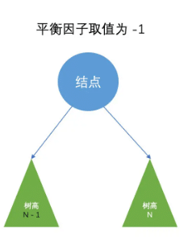

### **创建平衡二叉树**

1. 定义平衡二叉树节点的结构：节点应包含值、左子树和右子树的引用。
2. 实现**计算节点高度的函数**：编写一个函数来计算节点的高度，即以该节点为根的子树的高度。节点的高度可以定义为左子树和右子树中较高的那个子树的高度加1。
3. 实现**平衡因子计算函数**：平衡因子是指左子树高度与右子树高度之间的差值。编写一个函数来计算平衡因子，即左子树高度减去右子树高度。
4. 实现**节点旋转操作**：平衡二叉树通过旋转操作来保持平衡。根据情况，可能需要进行左旋、右旋或双旋转。这些旋转操作可以通过调整节点的指针来实现。
5. 实现**插入节点操作**：编写一个函数来插入新节点到平衡二叉树中。首先，按照二叉查找树的规则找到插入位置。然后，通过旋转操作来调整树的平衡性。

```js
// 定义平衡二叉树节点
class TreeNode {
  constructor(value) {
    this.value = value;
    this.left = null;
    this.right = null;
  }
}

// 计算节点高度
function getHeight(node) {
  if (node === null) {
    return -1;
  }
  return Math.max(getHeight(node.left), getHeight(node.right)) + 1;
}

// 计算平衡因子
function getBalanceFactor(node) {
  return getHeight(node.left) - getHeight(node.right);
}

// 左旋转操作
function rotateLeft(node) {
  // 获取节点的右子树根节点
  const newRoot = node.right;
  // 右子树的左子树作为旋转点的右子树(递增)
  node.right = newRoot.left;
  // 旋转节点作为该节点右子树的左节点
  newRoot.left = node;
  return newRoot;
}

// 右旋转操作
function rotateRight(node) {
  const newRoot = node.left;
  node.left = newRoot.right;
  newRoot.right = node;
  return newRoot;
}

// 插入节点
function insertNode(root, value) {
  if (root === null) {
    return new TreeNode(value);
  }

  if (value < root.value) {
    // 递归查找左子树
    root.left = insertNode(root.left, value);
  } else if (value > root.value) {
    // 递归查找右子树
    root.right = insertNode(root.right, value);
  } else {
    // 值已存在，不进行插入
    return root;
  }
  // 计算平衡因子
  const balanceFactor = getBalanceFactor(root);

  // 左子树的左侧插入情况，需要进行右旋转
  if (balanceFactor > 1 && value < root.left.value) {
    return rotateRight(root);
  }

  // 右子树的右侧插入情况，需要进行左旋转
  if (balanceFactor < -1 && value > root.right.value) {
    return rotateLeft(root);
  }

  // 左子树的右侧插入情况，需要进行先左旋后右旋
  if (balanceFactor > 1 && value > root.left.value) {
    root.left = rotateLeft(root.left);
    return rotateRight(root);
  }

  // 右子树的左侧插入情况，需要进行先右旋后左旋
  if (balanceFactor < -1 && value < root.right.value) {
    root.right = rotateRight(root.right);
    return rotateLeft(root);
  }

  return root;
}

// 创建平衡二叉树
function createBalancedBinaryTree(values) {
  let root = null;
  for (let i = 0; i < values.length; i++) {
    root = insertNode(root, values[i]);
  }
  return root;
}

// 示例用法
const values = [3, 7, 4, 2, 1, 5, 6];
const root = createBalancedBinaryTree(values);
console.log(root);
```


### 判断平衡二叉树

给定一个二叉树，判断它是否是高度平衡的二叉树。

一棵高度平衡二叉树定义为：

> 一个二叉树每个节点 的左右两个子树的高度差的绝对值不超过1。

**示例 1:**

给定二叉树 `[3,9,20,null,null,15,7]`

```
    3
   / \
  9  20
    /  \
   15   7
```

返回 `true` 。

**示例 2:**

给定二叉树 `[1,2,2,3,3,null,null,4,4]`

```
      1
     / \
    2   2
   / \
  3   3
 / \
4   4
```

返回 `false` 。

#### **自顶向下（递归+深度优先搜索）**

> **解题思路：** 
>
> 自顶向下的比较每个节点的左右子树的最大高度差：如果二叉树中每个节点的左右子树最大高度差小于等于 `1` ，即每个子树都平衡时，此时二叉树才是平衡二叉树
>
> 先计算深度，再判断是否平衡

**代码实现：**

```js
const isBalanced = function (root) {
  if(!root) return true
  //通过递归地判断每个节点的左右子树的深度差是否小于等于1，并且递归地判断左右子树是否也是平衡的二叉树
  return Math.abs(depth(root.left) - depth(root.right)) <= 1
        && isBalanced(root.left)
        && isBalanced(root.right)
}
//计算左右节点的深度
const depth = function (node) {
    if(!node) return -1
    return 1 + Math.max(depth(node.left), depth(node.right))
}
```

> **复杂度分析：**
>
> - 时间复杂度：O(nlogn)，计算 `depth` 存在大量冗余操作
> - 空间复杂度：O(n)

#### **自底向上（递归计算优化）**

> **解题思路：** 
>
> * 利用后续遍历二叉树（左右根），从底至顶返回子树最大高度，判定每个子树是不是平衡树 ，如果平衡，则使用它们的高度判断父节点是否平衡，并计算父节点的高度，如果不平衡，返回 `-1` 。
> * 遍历比较二叉树每个节点 的左右子树深度：
>   * 比较左右子树的深度，若差值大于 `1` 则返回一个标记 `-1` ，表示当前子树不平衡
>   * 左右子树有一个不是平衡的，或左右子树差值大于 `1` ，则二叉树不平衡
>   * 若左右子树平衡，返回当前树的深度（左右子树的深度最大值 `+1` ）
> * 优化分析：
>   * 该解法中，在计算深度的同时判断是否平衡：
>     * 先递归地判断左右子树是否平衡，再计算深度差。该方法在计算深度的同时，就可以判断子树是否平衡，避免了重复计算深度的过程，这样在某些情况下可以提高效率

**代码实现：**

```js
const isBalanced = function (root) {
    return balanced(root) !== -1
};
//计算以当前节点为根节点的子树的深度
const balanced = function (node) {
    if (!node) return 0
    const left = balanced(node.left)//递归地计算左右子树的深度
    const right = balanced(node.right)//递归地计算左右子树的深度
    //判断左右子树是否平衡,当前节点的左右子树的深度差是否小于等于1
    if (left === -1 || right === -1 || Math.abs(left - right) > 1) {
        return -1
    }
    return Math.max(left, right) + 1
}
```

> **复杂度分析：**
>
> - 时间复杂度：O(n)
> - 空间复杂度：O(n)


## 完全二叉树

* 完全二叉树的定义：若二叉树的深度为 h，除第 h 层外，其它各层的结点数都达到最大个数，第 h 层所有的叶子结点都连续集中在最左边，这就是完全二叉树。（第 h 层可能包含 [1~2h] 个节点）

### 判断是否为完全二叉树

给定一个二叉树，确定他是否是一个完全二叉树。

完全二叉树的定义：若二叉树的深度为 h，除第 h 层外，其它各层的结点数都达到最大个数，第 h 层所有的叶子结点都连续集中在最左边，这就是完全二叉树。（第 h 层可能包含 [1~2h] 个节点）

> 样例图1：
>
> 
>
> * 输入：
>
> ```js
> {1,2,3,4,5,6}
> ```
>
> * 返回值：true
>
> 样例图2：
>
> 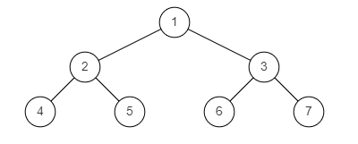
>
> * 输入：
>
> ```js
> {1,2,3,4,5,6,7}
> ```
>
> * 返回值：true
>
> 样例图3：
>
> 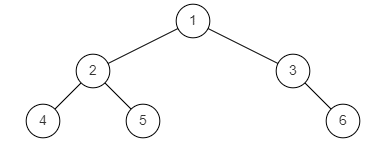
>
> 输入：
>
> ```js
> {1,2,3,4,5,null,6}
> ```
>
> 返回值：false

思路：**层次遍历**

> 对完全二叉树最重要的定义就是叶子节点只能出现在最下层和次下层，所以我们想到可以使用队列辅助进行层次遍历
>
> 从上到下遍历所有层，每层从左到右，只有次下层和最下层才有叶子节点，其他层出现叶子节点就意味着不是完全二叉树
>
> **具体做法：**
>
> - step 1：先判断空树一定是完全二叉树。
> - step 2：初始化一个队列辅助层次遍历，将根节点加入。
> - step 3：
>   - 逐渐从队列中弹出元素访问节点，如果遇到某个节点为空，进行标记（代表访问到了叶子节点）；
>   - 若是后续还有访问，则说明叶子节点左子节点为空，右子节点不为空，不符合完全二叉树的性质。
> - step 4：否则，继续加入左右子节点进入队列排队，等待访问。

```js
/*
 * function TreeNode(x) {
 *   this.val = x;
 *   this.left = null;
 *   this.right = null;
 * }
 */
/**
 * 代码中的类名、方法名、参数名已经指定，请勿修改，直接返回方法规定的值即可
 *
 * 
 * @param root TreeNode类 
 * @return bool布尔型
 */
function isCompleteTree( root ) {
    let isEmptyNode = false; // 记录左子节点是否为空
    if(root == null) return true;
    const queue = [];
    queue.push(root);
    while(queue.length > 0) {
        const cur = queue.shift();
        if(cur === null) {
            isEmptyNode = true;
        }else {
            if(isEmptyNode) return false; // 上一个节点为空节点，而当前节点不为空，则表示左子节点为空，不符合
            queue.push(cur.left);
            queue.push(cur.right);
        }
    }
    return true;
}
module.exports = {
    isCompleteTree : isCompleteTree
};
```


## 红黑树

红黑树也是一种特殊的「二叉查找树」。

到目前为止我们学习的 AVL 树和即将学习的红黑树都是二叉查找树的变体，可见二叉查找树真的是非常重要基础二叉树，如果忘了它的定义可以先回头看看。

红黑树是一种比较难的数据结构，面试中很少有面试官让你手写一个红黑树，最多的话是考察你是否理解红黑树，以及为什么有了 AVL 树还需要红黑树，本部分就主要介绍这块。

### 什么是红黑树

红黑树是一种自平衡（并不是绝对平衡）的二叉查找树，它除了满足二分查找树的特点外，还满足以下条件：

- 节点是红色或黑色
- 根节点必须是黑色节点
- 所有的叶子节点都必须是值为 NULL 的黑节点
- 如果一个节点是红色的，则它两个子节点都是黑色的
- 从任一节点到达它的每个叶子节点的所有的路径，都有相同数目的黑色节点

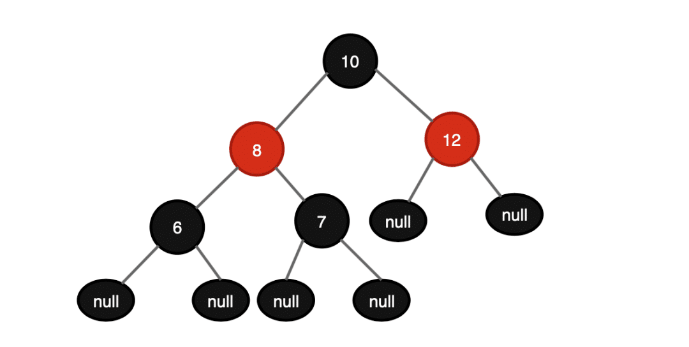

这些条条框框保证红黑树的自平衡，保证红黑树从根节点到达每一个叶子节点的最长路径不会超过最短路径的 2 倍。

而节点的路径长度决定着对节点的查询效率，这样我们确保了，最坏情况下的查找、插入、删除操作的时间复杂度不超过 O(logn) ，并且有较高的插入和删除效率。

### 红黑树 VS 平衡二叉树（AVL树）

- 插入和删除操作，一般认为红黑树的删除和插入会比 AVL 树更快。因为，红黑树不像 AVL 树那样严格的要求平衡因子小于等于1，这就减少了为了达到平衡而进行的旋转操作次数，可以说是牺牲严格平衡性来换取更快的插入和删除时间。
- 红黑树不要求有不严格的平衡性控制，但是红黑树的特点，使得任何不平衡都会在三次旋转之内解决。而 AVL 树如果不平衡，并不会控制旋转操作次数，旋转直到平衡为止。
- 查找操作，AVL树的效率更高。因为 AVL 树设计比红黑树更加平衡，不会出现平衡因子超过 1 的情况，减少了树的平均搜索长度。

## 前缀树

### 什么是字典树

Trie 树，也称为字典树或前缀树，顾名思义，它是用来处理字符串匹配问题的数据结构，以及用来解决集合中查找固定前缀字符串的数据结构。

### Trie树的应用：字符串匹配

在搜索引擎中输入关键字，搜索引擎都会弹出下拉框，显示各种关键字提示，例如必应：


必应是如何处理这一过程的喃？

或者，假设我们有n个单词的数据集，任意输入一串字符，如何在数据集中快速匹配出具有输入字符前缀的单词？

这样类似的问题还有很多，在日常开发中，遇到类似的问题，我们应该如何去处理？选择怎样的数据结构与算法？尤其是遇到大规模数据时，如何更高效的处理？

最简单的方法就是暴力，将数据集中的每个字符串，逐个字符的匹配输入字符，所有字符都匹配上则前缀匹配成功。这种方式也是我们开发当中最常用，最简单的方式，时间复杂度为 `O(m*n)` ，其中 `m` 为输入字符串长度， `n` 为数据集规模。

这个时间复杂度是很高的，当 `n` 很大时，暴力法性能就会很差，此时必须重新寻找合适的算法。

我们知道在树上查找、插入都比较方便，一般时间复杂度只与树的高度相关，我们可以通过树结构来处理，也就是我们要说的 Trie 树。其实，引擎搜索关键字提示底层也是通过 Trie 树实现的。

举个例子：假设数据集有：`are` 、 `add` 、 `adopt` 、`set` 、`so` ，它构键过程：

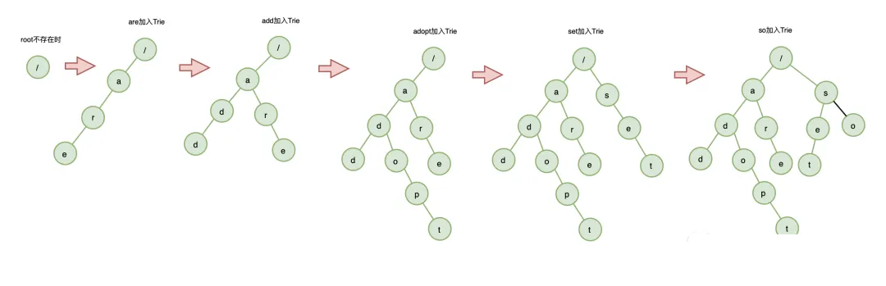

当所以的字符串插入完成，Trie树就构建完成了。

**Trie树的本质**是利用字符串的公共前缀，将重复的前缀合并在一起，其中根节点不包含任何信息，每个节点表示一个字符串中的字符，从根节点到叶节点的路径，表示一个字符串。

在字符串匹配的时候，我们只要按照树的结构从上到下匹配即可。

### 实现 Trie（前缀树）

实现一个 Trie (前缀树)，包含 `insert` , `search` , 和 `startsWith` 这三个操作。

**示例:**

```js
Trie trie = new Trie();

trie.insert("apple");
trie.search("apple");   // 返回 true
trie.search("app");     // 返回 false
trie.startsWith("app"); // 返回 true
trie.insert("app");   
trie.search("app");     // 返回 true
```

**说明:**

- 你可以假设所有的输入都是由小写字母 a-z 构成的。
- 保证所有输入均为非空字符串。

**解答：**

我们可以搭建一个初始 Trie 树结构：

```js
// Trie 树
var Trie = function() {};
// 插入
Trie.prototype.insert = function(word) {};
// 搜索
Trie.prototype.search = function(word) {};
// 前缀匹配
Trie.prototype.startsWith = function(prefix) {};
```

#### **如何存储一个 Trie 树**

首先，我们需要实现一个 Trie 树，我们知道，二叉树的存储（链式存储）是通过左右指针来实现的，即二叉树中的节点：

```js
function BinaryTreeNode(key) {
    // 保存当前节点 key 值
    this.key = key
    // 指向左子节点
    this.left = null
    // 指向右子节点
    this.right = null
}
```

在这里，它不止有两个字节点，它最多有 a-z 总共有26个子节点。最简单的实现是把她们保存在一个字典里：

- `isEnd` ：当前是否是结束节点
- `children` ：当前节点的子节点，这里我们使用 `key:value` 形式实现，`key` 为子节点字符，`value` 指向子节点的孩子节点

```json
var TrieNode = function() {
    // next 放入当前节点的子节点
    this.next = {};
    // 当前是否是结束节点
    this.isEnd = false;
};
```

所以：

```js
// Trie 树
var Trie = function() {
    this.root = new TrieNode()
};
```

#### **插入**

> - 首先判断插入节点是否为空，为空则返回
> - 遍历待插入字符，从根节点逐字符查找 Trie 树，如果字符查找失败则插入，否则继续查找下一个字符
> - 待插入字符遍历完成，设置最后字符的 `isEnd` 为 `true`
> - 返回插入成功

```js
Trie.prototype.insert = function(word) {
    if (!word) return false
    let node = this.root
    for (let i = 0; i < word.length; i++) {
        // 字符节点不存在，创建单词的节点
        if (!node.next[word[i]]) {
            node.next[word[i]] = new TrieNode()
        }
        // 指针指向下一个字符节点
        node = node.next[word[i]]
    }
    node.isEnd = true
    return true
};
```

#### **搜索**

> - 首先判断插入节点是否为空，为空则返回
> - 遍历待插入字符，从根节点逐字符查找 Trie 树，如果字符查找失败则返回false，否则继续查找下一个字符
> - 待插入字符遍历完成，返回最后一个节点 isEnd

```js
Trie.prototype.search = function(word) {
    if (!word) return false
    let node = this.root
    for (let i = 0; i < word.length; ++i) {
        // 单词节点存在，进入该节点的子节点
        if (node.next[word[i]]) {
            node = node.next[word[i]]
        } else {
            return false
        }
    }
    return node.isEnd
};
```

#### **前缀匹配**

```js
Trie.prototype.startsWith = function(prefix) {
    if (!prefix) return true
    let node = this.root
    for (let i = 0; i < prefix.length; ++i) {
        // 单词节点存在，进入该节点的子节点
        if (node.next[prefix[i]]) {
            node = node.next[prefix[i]]
        } else {
            return false
        }
    }
    return true
};
```


## 10 B 树、B+ 树

### 多叉查找树

既然二叉查找树已经理解了，那多叉查找树就很好理解了，它与二叉查找树唯一不同的是，它是多叉的。也就是说，多叉查找树允许一个节点存储多个元素，并且可以拥有多个子树。

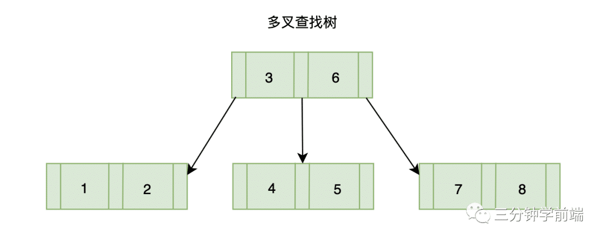

为什么在有二叉查找树的情况下，还要有多叉查找树？

我们知道树的深度越高，时间复杂度越高，性能越差，多叉查找树相对于二叉查找树来说，每个节点不止能拥有两个子节点，每层存放的节点数可比二叉查找树多，自然多叉查找树的的深度就要更小，性能也就更好。例如主要用于各大存储文件系统与数据库系统中的 B 树。

### B 树(B-tree)

B 树，又称平衡多叉查找树。它是一种自平衡的多叉查找树。

如果一棵多路查找树满足以下规则，则称之为 B 树：

- 排序方式：所有节点关键字是按递增次序排列，并遵循左小右大原则；
- 子节点数：非叶节点的子节点数>1，且<=M ，且M>=2，空树除外（注：M阶代表一个树节点最多有多少个查找路径，M=M叉（或路），当M=2则是2叉树，M=3则是3叉）；
- 关键字数：枝节点（非根非叶）的关键字数量（K）应满足 (M+1)/2  < K < M
- 所有叶子节点均在同一层、叶子节点除了包含了关键字和关键字记录的指针外也有指向其子节点的指针只不过其指针地址都为null对应下图最后一层节点的空格子;

最后，我们使用一张图加深一下理解：

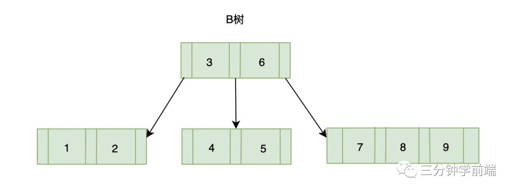

### B+树

B+树与B树一样都是多叉平衡查找树（又名多路平衡查找树），B+树与B树不同的是：

- B+树改进了B树，让内结点（非叶节点）只作索引使用，去掉了其中指向data的指针，使得每个结点中能够存放更多的key， 因此能有更大的出度。

  这有什么用？这样就意味着存放同样多的key，树的层高能进一步被压缩，使得检索的时间更短

- 中间节点的元素数量与子树一致，而B树子树数量与元素数量多1

- 叶子节点是一个链表，可以通过指针顺序查找

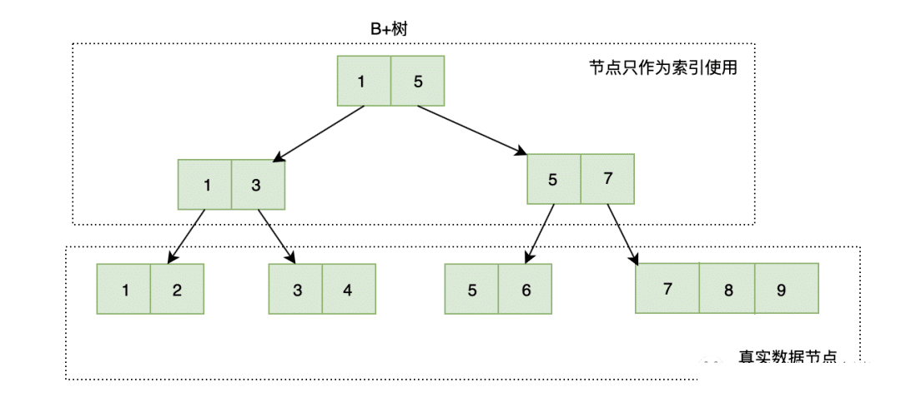

---

## 线段树

> - 线段树是一棵平衡二叉树，树上的每个节点维护一个区间。
> - 根节点维护的是整个区间，每个节点维护的是父亲节点的区间二等分之后的其中一个子区间。

当有 𝑛 个元素时，对区间的操作（单点更新、区间更新、区间查询等）可以在 𝑂(log2⁡𝑛) 的时间复杂度内完成。

如下图所示，这是一棵区间为 [0,7] 的线段树：

![区间 [0, 7] 对应的线段树](../../images/线段树.png)

### **线段树的特点**

根据上述描述，我们可以总结一下线段树的特点：

1. 线段树的每个节点都代表一个区间。
2. 线段树具有唯一的根节点，代表的区间是整个统计范围，比如 [1,𝑛]。
3. 线段树的每个叶子节点都代表一个长度为 1 的单位区间 [𝑥,𝑥]。
4. 对于每个内部节点 [𝑙𝑒𝑓𝑡,𝑟𝑖𝑔ℎ𝑡]，它的左子节点是 [𝑙𝑒𝑓𝑡,𝑚𝑖𝑑]，右子节点是 [𝑚𝑖𝑑+1,𝑟𝑖𝑔ℎ𝑡]。其中 𝑚𝑖𝑑=(𝑙𝑒𝑓𝑡+𝑟𝑖𝑔ℎ𝑡)/2（向下取整）。


### **线段树的存储结构**

之前我们学习过二叉树的两种存储结构，一种是「链式存储结构」，另一种是「顺序存储结构」。

线段树也可以使用这两种存储结构来实现。

由于线段树近乎是完全二叉树，所以很适合用「顺序存储结构」来实现。

我们可以采用与完全二叉树类似的编号方法来对线段树进行编号，方法如下：

- 根节点的编号为 0。
- 如果某二叉树节点（非叶子节点）的下标为 𝑖，那么其左孩子节点下标为 2×𝑖+1，右孩子节点下标为 2×𝑖+2。
- 如果某二叉树节点（非根节点）的下标为 𝑖，那么其父节点下标为 (𝑖−1) /2，`/` 表示整除。

这样我们就能使用一个数组来保存线段树。

### **线段树的构建**

下标为 𝑖 的节点的孩子节点下标为 2×𝑖+1 和 2×𝑖+2，所以线段树十分适合采用递归的方法来创建。

具体步骤如下：

1. 如果是叶子节点（ left == right ），则节点的值就是对应位置的元素值。
2. 如果是非叶子节点，则递归创建左子树和右子树。
3. 节点的区间值（区间和、区间最大值、区间最小值）等于该节点左右子节点元素值的对应计算结果。

```javascript
// 线段树的节点类  
class TreeNode {  
    constructor(val = 0) {  
        this.left = -1; // 区间左边界  
        this.right = -1; // 区间右边界  
        this.val = val; // 节点值（区间值）  
        this.lazy_tag = null; // 区间和问题的延迟更新标记  
    }  
}  
  
// 线段树类  
class SegmentTree {  
    constructor(nums, function_) {  
        this.size = nums.length;  
        this.tree = new Array(4 * this.size).fill(null).map(() => new TreeNode()); // 维护 TreeNode 数组  
        this.nums = nums; // 原始数据  
        this.function = function_; // function 是一个函数，左右区间的聚合方法  
        if (this.size > 0) {  
            this.__build(0, 0, this.size - 1);  
        }  
    }  
  
    // 构建线段树，节点的存储下标为 index，节点的区间为 [left, right]  
    __build(index, left, right) {  
        this.tree[index].left = left;  
        this.tree[index].right = right;  
        if (left === right) { // 叶子节点，节点值为对应位置的元素值  
            this.tree[index].val = this.nums[left];  
            return;  
        }  
  
        const mid = left + Math.floor((right - left) / 2); // 左右节点划分点  
        const left_index = 2 * index + 1; // 左子节点的存储下标  
        const right_index = 2 * index + 2; // 右子节点的存储下标  
        this.__build(left_index, left, mid); // 递归创建左子树  
        this.__build(right_index, mid + 1, right); // 递归创建右子树  
        this.__pushup(index); // 向上更新节点的区间值  
    }  
  
    // 向上更新下标为 index 的节点区间值，节点的区间值等于该节点左右子节点元素值的聚合计算结果  
    __pushup(index) {  
        const left_index = 2 * index + 1; // 左子节点的存储下标  
        const right_index = 2 * index + 2; // 右子节点的存储下标  
        this.tree[index].val = this.function(this.tree[left_index].val, this.tree[right_index].val);  
    }  
}  
  
// 使用示例  
// 假设 function 是求和函数  
function sum(a, b) {  
    return a + b;  
}  
  
const nums = [1, 3, 5, 7, 9];  
const segmentTree = new SegmentTree(nums, sum);  
  
// 此时 segmentTree 已经构建完成，可以进行后续的查询、更新等操作
```


### 线段树的基本操作

线段树的基本操作主要涉及到单点更新、区间查询和区间更新操作

#### **线段树的单点更新**

> **线段树的单点更新**：修改区间中一个元素的值，例如将 𝑛𝑢𝑚𝑠[𝑖] 修改为 𝑣𝑎𝑙。

我们可以采用递归的方式进行单点更新，具体步骤如下：

1. 如果是叶子节点，满足 𝑙𝑒𝑓𝑡==𝑟𝑖𝑔ℎ𝑡，则更新该节点的值。
2. 如果是非叶子节点，则判断应该在左子树中更新，还是应该在右子树中更新。
3. 在对应的左子树或右子树中更新节点值。
4. 左右子树更新返回之后，向上更新节点的区间值（区间和、区间最大值、区间最小值等），区间值等于该节点左右子节点元素值的聚合计算结果。

线段树的单点更新实现代码如下：

```javascript
// ...（省略了之前定义的 TreeNode 和 SegmentTree 类）  
  
// 在 SegmentTree 类中添加单点更新方法  
class SegmentTree {  
    // ...（省略了之前的方法）  
  
    // 单点更新，将 nums[i] 更改为 val  
    updatePoint(i, val) {  
        this.nums[i] = val;
        // 从根节点开始查找更新区间
        this.__updatePoint(i, val, 0, 0, this.size - 1);  
    }  
  
    // 单点更新，将 nums[i] 更改为 val。节点的存储下标为 index，节点的区间为 [left, right]  
    __updatePoint(i, val, index, left, right) {  
        if (this.tree[index].left === this.tree[index].right) {  
            this.tree[index].val = val; // 叶子节点，节点值修改为 val  
            return;  
        }  
  
        const mid = left + Math.floor((right - left) / 2); // 左右节点划分点  
        const left_index = 2 * index + 1; // 左子节点的存储下标  
        const right_index = 2 * index + 2; // 右子节点的存储下标  
  
        if (i <= mid) { // 在左子树中更新节点值  
            this.__updatePoint(i, val, left_index, left, mid);  
        } else { // 在右子树中更新节点值  
            this.__updatePoint(i, val, right_index, mid + 1, right);  
        }  
  
        this.__pushup(index); // 向上更新节点的区间值  
    }  
}  
  
// 使用示例  
// 假设 function 是求和函数  
function sum(a, b) {  
    return a + b;  
}  
  
const nums = [1, 3, 5, 7, 9];  
const segmentTree = new SegmentTree(nums, sum);  
  
// 单点更新 nums[2] 为 10  
segmentTree.updatePoint(2, 10);  
  
// 此时 segmentTree 的相应部分已经更新
```


#### **线段树的区间查询**

> **线段树的区间查询**：查询一个区间为 `[𝑞_𝑙𝑒𝑓𝑡,𝑞_𝑟𝑖𝑔ℎ𝑡]` 的区间值。

我们可以采用递归的方式进行区间查询，具体步骤如下：

1. 如果区间 `[𝑞_𝑙𝑒𝑓𝑡,𝑞_𝑟𝑖𝑔ℎ𝑡]` 完全覆盖了当前节点所在区间 `[𝑙𝑒𝑓𝑡,𝑟𝑖𝑔ℎ𝑡]` （  `[𝑙𝑒𝑓𝑡,𝑟𝑖𝑔ℎ𝑡]` 是`[𝑞_𝑙𝑒𝑓𝑡,𝑞_𝑟𝑖𝑔ℎ𝑡]` 的子集），即 `𝑙𝑒𝑓𝑡≥𝑞_𝑙𝑒𝑓𝑡` 并且 `𝑟𝑖𝑔ℎ𝑡≤𝑞_𝑟𝑖𝑔ℎ𝑡`，则返回该节点的区间值。
2. 如果区间 `[𝑞_𝑙𝑒𝑓𝑡,𝑞_𝑟𝑖𝑔ℎ𝑡]` 与当前节点所在区间 `[𝑙𝑒𝑓𝑡,𝑟𝑖𝑔ℎ𝑡]` 没有交集，即 `𝑟𝑖𝑔ℎ𝑡<𝑞_𝑒𝑓𝑡` 或者 `𝑙𝑒𝑓𝑡>𝑞_𝑟𝑖𝑔ℎ𝑡`，则返回 0。
3. 如果区间 `[𝑞_𝑙𝑒𝑓𝑡,𝑞_𝑟𝑖𝑔ℎ𝑡]` 与当前节点所在区间有交集，则：
   1. 如果区间 `[𝑞_𝑙𝑒𝑓𝑡,𝑞_𝑟𝑖𝑔ℎ𝑡]` 与左子节点所在区间 `[𝑙𝑒𝑓𝑡,𝑟𝑖𝑔ℎ𝑡]`  有交集，即 `𝑞_𝑙𝑒𝑓𝑡≤𝑚𝑖𝑑`，则在当前节点的左子树中进行查询并保存查询结果 `𝑟𝑒𝑠_𝑙𝑒𝑓𝑡`。
   2. 如果区间 `[𝑞_𝑙𝑒𝑓𝑡,𝑞_𝑟𝑖𝑔ℎ𝑡]`  与右子节点所在区间 `[𝑚𝑖𝑑+1,𝑟𝑖𝑔ℎ𝑡]` 有交集，即 `𝑞_𝑟𝑖𝑔ℎ𝑡>𝑚𝑖𝑑`，则在当前节点的右子树中进行查询并保存查询结果 `𝑟𝑒𝑠_𝑟𝑖𝑔ℎ𝑡`。
   3. 最后返回左右子树元素区间值的聚合计算结果。

线段树的区间查询代码如下：

```javascript
// ...（假设已经定义了 SegmentTree 类和 TreeNode 类，并且 function 是作为构造函数参数传入的一个聚合函数）  
  
// 在 SegmentTree 类中添加区间查询方法  
class SegmentTree {  
    // ...（其他已有的方法）  
  
    // 区间查询，查询区间为 [q_left, q_right] 的区间值  
    queryInterval(q_left, q_right) {  
        return this.__queryInterval(q_left, q_right, 0, 0, this.size - 1);  
    }  
  
    // 区间查询，在线段树的 [left, right] 区间范围中搜索区间为 [q_left, q_right] 的区间值  
    __queryInterval(q_left, q_right, index, left, right) {  
        if (left >= q_left && right <= q_right) { // 节点所在区间被 [q_left, q_right] 所覆盖  
            return this.tree[index].val; // 直接返回节点值  
        }  
        if (right < q_left || left > q_right) { // 节点所在区间与 [q_left, q_right] 无关  
            return 0;  
        }  
  
        // 假设这里没有 pushdown 操作（因为通常线段树不支持 lazy propagation，所以这里省略了 __pushdown 方法）  
  
        const mid = left + Math.floor((right - left) / 2); // 左右节点划分点  
        const left_index = 2 * index + 1; // 左子节点的存储下标  
        const right_index = 2 * index + 2; // 右子节点的存储下标  
  
        let res_left = 0; // 左子树查询结果  
        let res_right = 0; // 右子树查询结果  
  
        if (q_left <= mid) { // 在左子树中查询  
            res_left = this.__queryInterval(q_left, q_right, left_index, left, mid);  
        }  
        if (q_right > mid) { // 在右子树中查询  
            res_right = this.__queryInterval(q_left, q_right, right_index, mid + 1, right);  
        }  
  
        // 假设 function 是一个已经定义好的聚合函数，例如求和、求最大值等  
        return this.function(res_left, res_right); // 返回左右子树元素值的聚合计算结果  
    }  
}  
  
// 使用示例  
// 假设 function 是求和函数  
function sum(a, b) {  
    return a + b;  
}  
  
const nums = [1, 3, 5, 7, 9];  
const segmentTree = new SegmentTree(nums, sum); // 假设构造函数接受 nums 和 function 作为参数  
  
// 区间查询 [1, 3] 的区间值  
const result = segmentTree.queryInterval(1, 3);  
console.log(result); // 输出应该是 15 (3 + 5 + 7)
```


#### **线段树的区间更新**

> **线段树的区间更新**：对 `[𝑞_𝑙𝑒𝑓𝑡,𝑞_𝑟𝑖𝑔ℎ𝑡]` 区间进行更新，例如将 `[𝑞_𝑙𝑒𝑓𝑡,𝑞_𝑟𝑖𝑔ℎ𝑡]` 区间内所有元素都更新为 𝑣𝑎𝑙。

##### **延迟标记**

线段树在进行单点更新、区间查询时，区间 `[𝑞_𝑙𝑒𝑓𝑡,𝑞_𝑟𝑖𝑔ℎ𝑡]`在线段树上会被分成 𝑂(log2⁡𝑛) 个小区间（节点），从而在 𝑂(log2⁡𝑛) 的时间复杂度内完成操作。

而在「区间更新」操作中:

* 如果某个节点区间`[𝑙𝑒𝑓𝑡,𝑟𝑖𝑔ℎ𝑡]` 被修改区间 `[𝑞_𝑙𝑒𝑓𝑡,𝑞_𝑟𝑖𝑔ℎ𝑡]` 完全覆盖 (即 `[𝑙𝑒𝑓𝑡,𝑟𝑖𝑔ℎ𝑡]` 是 `[𝑞_𝑙𝑒𝑓𝑡,𝑞_𝑟𝑖𝑔ℎ𝑡]`  的子集)，则以该节点为根的整棵子树中所有节点的区间值都要发生变化
* 如果逐一进行更新的话，将使得一次区间更新操作的时间复杂度增加到 𝑂(𝑛)。

* 设想这一种情况：
  * 如果我们在一次执行更新操作时，发现当前节点区间`[𝑙𝑒𝑓𝑡,𝑟𝑖𝑔ℎ𝑡]`被修改区间 `[𝑞_𝑙𝑒𝑓𝑡,𝑞_𝑟𝑖𝑔ℎ𝑡]`  完全覆盖;
  * 然后逐一更新了区间 `[𝑙𝑒𝑓𝑡,𝑟𝑖𝑔ℎ𝑡]`对应子树中的所有节点，但是在后续的区间查询操作中却根本没有用到`[𝑙𝑒𝑓𝑡,𝑟𝑖𝑔ℎ𝑡]`作为候选答案，则更新`[𝑙𝑒𝑓𝑡,𝑟𝑖𝑔ℎ𝑡]` 对应子树的工作就是徒劳的。

如果我们减少更新的次数和时间复杂度，应该怎么办？

1. 我们可以向线段树的节点类中增加一个 **「延迟标记」**，标识为 **「该区间曾经被修改为 𝑣𝑎𝑙，但其子节点区间值尚未更新」**。
2. 也就是说除了在进行区间更新时，将区间子节点的更新操作延迟到 **「在后续操作中递归进入子节点时」** 再执行。
3. 这样一来，每次区间更新和区间查询的时间复杂度都降低到了 𝑂(log2⁡𝑛)。

使用「延迟标记」的区间更新步骤为：

1. 如果区间`[𝑞_𝑙𝑒𝑓𝑡,𝑞_𝑟𝑖𝑔ℎ𝑡]` 完全覆盖了当前节点所在区间`[𝑙𝑒𝑓𝑡,𝑟𝑖𝑔ℎ𝑡]`  ，即 `𝑙𝑒𝑓𝑡≥𝑞_𝑙𝑒𝑓𝑡` 并且 `𝑟𝑖𝑔ℎ𝑡≤𝑞_𝑟𝑖𝑔ℎ𝑡`，则更新当前节点所在区间的值，并将当前节点的延迟标记为区间值。
2. 如果区间 `[𝑞_𝑙𝑒𝑓𝑡,𝑞_𝑟𝑖𝑔ℎ𝑡]` 与当前节点所在区间 `[𝑙𝑒𝑓𝑡,𝑟𝑖𝑔ℎ𝑡]` 毫无关系，即 `𝑟𝑖𝑔ℎ𝑡<𝑞_𝑙𝑒𝑓𝑡` 或者 `𝑙𝑒𝑓𝑡>𝑞_𝑟𝑖𝑔ℎ𝑡`，则直接返回。
3. 如果区间`[𝑞_𝑙𝑒𝑓𝑡,𝑞_𝑟𝑖𝑔ℎ𝑡]`  与当前节点所在区间有交集，则：
   1. 如果当前节点使用了「延迟标记」，即延迟标记不为 𝑁𝑜𝑛𝑒，则将当前区间的更新操作应用到该节点的子节点上（即向下更新）。
   2. 如果区间`[𝑞_𝑙𝑒𝑓𝑡,𝑞_𝑟𝑖𝑔ℎ𝑡]` 与左子节点所在区间 [𝑙𝑒𝑓𝑡,𝑚𝑖𝑑] 有交集，即 `𝑞_𝑙𝑒𝑓𝑡≤𝑚𝑖𝑑`，则在当前节点的左子树中更新区间值。
   3. 如果区间`[𝑞_𝑙𝑒𝑓𝑡,𝑞_𝑟𝑖𝑔ℎ𝑡]` 与右子节点所在区间 `[𝑚𝑖𝑑+1,𝑟𝑖𝑔ℎ𝑡]` 有交集，即 `𝑞_𝑟𝑖𝑔ℎ𝑡>𝑚𝑖𝑑`，则在当前节点的右子树中更新区间值。
   4. 左右子树更新返回之后，向上更新节点的区间值（区间和、区间最大值、区间最小值），区间值等于该节点左右子节点元素值的对应计算结果。

##### **向下更新**

上面提到了如果当前节点使用了「延迟标记」，即延迟标记不为 𝑁𝑜𝑛𝑒，则将当前区间的更新操作应用到该节点的子节点上（即向下更新）。这里描述一下向下更新的具体步骤：

1. 更新左子节点值和左子节点懒惰标记为 𝑣𝑎𝑙。
2. 更新右子节点值和右子节点懒惰标记为 𝑣𝑎𝑙。
3. 将当前节点的懒惰标记更新为 𝑁𝑜𝑛𝑒。

使用「延迟标记」的区间更新实现代码如下：

```javascript
class SegmentTree {
  constructor(size) {
    this.size = size;
    // 初始化线段树，使用数组来表示线段树
    this.tree = new Array(2 * size).fill(null).map(() => ({
      val: 0, // 存储区间的值
      left: 0, // 区间左端点
      right: 0, // 区间右端点
      lazy_tag: null, // 懒惰标记
    }));
  }

  // 区间更新，将区间为 [q_left, q_right] 上的元素值修改为 val
  update_interval(q_left, q_right, val) {
    this.__update_interval(q_left, q_right, val, 0, 0, this.size - 1);
  }

  // 区间更新递归函数
  __update_interval(q_left, q_right, val, index, left, right) {
    if (left >= q_left && right <= q_right) { // 节点所在区间被 [q_left, q_right] 所覆盖
      const interval_size = right - left + 1; // 当前节点所在区间大小
      this.tree[index].val = interval_size * val; // 当前节点所在区间每个元素值改为 val
      this.tree[index].lazy_tag = val; // 将当前节点的延迟标记为区间值
      return;
    }
    if (right < q_left || left > q_right) { // 节点所在区间与 [q_left, q_right] 无关
      return;
    }

    this.__pushdown(index);

    const mid = left + Math.floor((right - left) / 2); // 左右节点划分点
    const left_index = index * 2 + 1; // 左子节点的存储下标
    const right_index = index * 2 + 2; // 右子节点的存储下标

    if (q_left <= mid) this.__update_interval(q_left, q_right, val, left_index, left, mid);
    if (q_right > mid) this.__update_interval(q_left, q_right, val, right_index, mid + 1, right);

    this.__pushup(index);
  }

  // 向下更新下标为 index 的节点所在区间的左右子节点的值和懒惰标记
  __pushdown(index) {
    const lazy_tag = this.tree[index].lazy_tag;
    if (!lazy_tag) return;

    const left_index = index * 2 + 1;
    const right_index = index * 2 + 2;

    this.tree[left_index].lazy_tag = lazy_tag; // 更新左子节点懒惰标记
    const left_size = this.tree[left_index].right - this.tree[left_index].left + 1;
    this.tree[left_index].val = lazy_tag * left_size; // 更新左子节点值

    this.tree[right_index].lazy_tag = lazy_tag; // 更新右子节点懒惰标记
    const right_size = this.tree[right_index].right - this.tree[right_index].left + 1;
    this.tree[right_index].val = lazy_tag * right_size; // 更新右子节点值

    this.tree[index].lazy_tag = null; // 清除当前节点的懒惰标记
  }

  // 上推操作，更新当前节点的值
  __pushup(index) {
    if (this.tree[index].lazy_tag !== null) {
      this.tree[index].val = (
        this.tree[index * 2 + 1].val + this.tree[index * 2 + 2].val
      );
      this.tree[index].lazy_tag = null;
    }
  }
}

// 使用示例
const segmentTree = new SegmentTree(5); // 假设大小为 5
segmentTree.update_interval(1, 3, 10); // 更新区间 [1, 3] 的元素值为 10
```

> **注意**：有些题目中不是将 `[𝑞_𝑙𝑒𝑓𝑡,𝑞_𝑟𝑖𝑔ℎ𝑡]` 区间更新为 𝑣𝑎𝑙，而是将  `[𝑞_𝑙𝑒𝑓𝑡,𝑞_𝑟𝑖𝑔ℎ𝑡]`  区间中每一个元素值在原值基础增加或减去 𝑣𝑎𝑙。
>
> 对于这种情况，我们可以更改一下「延迟标记」的定义。改变为： **「该区间曾经变化了 𝑣𝑎𝑙，但其子节点区间值尚未更新」**。并更改对应的代码逻辑。

使用「延迟标记」的区间增减更新实现代码如下：

```javascript
class SegmentTree {
  constructor(size) {
    this.size = size;
    this.tree = new Array(2 * size).fill(null).map(() => ({
      val: 0,    // 当前节点的值
      lazy_tag: null,  // 懒惰标记
      left: 0,   // 区间左端点
      right: 0,  // 区间右端点
    }));

    // 初始化线段树的叶子节点和内部节点
    for (let i = 0; i < size; i++) {
      this.tree[i + size] = {
        val: 0,
        lazy_tag: null,
        left: i,
        right: i,
      };
    }
  }

  // 区间更新，将区间为 [q_left, q_right] 上的元素值修改为 val
  update_interval(q_left, q_right, val) {
    this.__update_interval(q_left, q_right, val, 0, 0, this.size - 1);
  }

  // 区间更新递归函数
  __update_interval(q_left, q_right, val, index, left, right) {
    if (left >= q_left && right <= q_right) {
      if (this.tree[index].lazy_tag !== null) {
        this.tree[index].lazy_tag += val;
      } else {
        this.tree[index].lazy_tag = val;
      }
      const interval_size = right - left + 1;
      this.tree[index].val += val * interval_size;
      return;
    }
    if (right < q_left || left > q_right) {
      return;
    }

    this.__pushdown(index);

    const mid = Math.floor((left + right) / 2);
    const left_index = index * 2 + 1;
    const right_index = index * 2 + 2;

    if (q_left <= mid) {
      this.__update_interval(q_left, q_right, val, left_index, left, mid);
    }
    if (q_right > mid) {
      this.__update_interval(q_left, q_right, val, right_index, mid + 1, right);
    }

    this.__pushup(index);
  }

  // 向下更新下标为 index 的节点所在区间的左右子节点的值和懒惰标记
  __pushdown(index) {
    const lazy_tag = this.tree[index].lazy_tag;
    if (!lazy_tag) return;

    const left_index = index * 2 + 1;
    const right_index = index * 2 + 2;
    const left_size = this.tree[left_index].right - this.tree[left_index].left + 1;
    const right_size = this.tree[right_index].right - this.tree[right_index].left + 1;

    if (this.tree[left_index].lazy_tag !== null) {
      this.tree[left_index].lazy_tag += lazy_tag;
    } else {
      this.tree[left_index].lazy_tag = lazy_tag;
    }
    this.tree[left_index].val += lazy_tag * left_size;

    if (this.tree[right_index].lazy_tag !== null) {
      this.tree[right_index].lazy_tag += lazy_tag;
    } else {
      this.tree[right_index].lazy_tag = lazy_tag;
    }
    this.tree[right_index].val += lazy_tag * right_size;

    this.tree[index].lazy_tag = null;
  }

  // 上推操作，更新当前节点的值
  __pushup(index) {
    const left_index = index * 2 + 1;
    const right_index = index * 2 + 2;
    this.tree[index].val = this.tree[left_index].val + this.tree[right_index].val;
  }
}

// 使用示例
const segmentTree = new SegmentTree(10); // 假设大小为 10
segmentTree.update_interval(1, 5, 10); // 更新区间 [1, 5] 的元素值为 10
```

### 线段树题型

#### **RMQ 问题**

> **RMQ 问题**：也就是求区间最大（最小）值问题。
>
> Range Maximum / Minimum Query 的缩写，指的是对于长度为 𝑛 的数组序列 𝑛𝑢𝑚𝑠，回答若干个询问问题 `RMQ(nums, q_left, q_right)`，要求返回数组序列 𝑛𝑢𝑚𝑠 在区间 `[𝑞_𝑙𝑒𝑓𝑡,𝑞_𝑟𝑖𝑔ℎ𝑡]` 中的最大（最小）值。。

假设查询次数为 𝑞，则使用朴素算法解决 RMQ 问题的时间复杂度为 𝑂(𝑞×𝑛)。而使用线段树解决 RMQ 问题的时间复杂度为 `𝑂(𝑞×𝑛)∼𝑄(𝑞×log2⁡𝑛)` 之间。


#### **单点更新，区间查询问题**

> **单点更新，区间查询问题**：
>
> 1. 修改某一个元素的值。
> 2. 查询区间为 `[𝑞_𝑙𝑒𝑓𝑡,𝑞_𝑟𝑖𝑔ℎ𝑡]` 的区间值。

**单点更新题目**

| 题号 | 标题                                                         | 标签                           | 难度 |
| :--- | :----------------------------------------------------------- | :----------------------------- | :--- |
| 0303 | [区域和检索 - 数组不可变](https://leetcode.cn/problems/range-sum-query-immutable/) | 设计、数组、前缀和             | 简单 |
| 0307 | [区域和检索 - 数组可修改](https://leetcode.cn/problems/range-sum-query-mutable/) | 设计、树状数组、线段树、数组   | 中等 |
| 0354 | [俄罗斯套娃信封问题](https://leetcode.cn/problems/russian-doll-envelopes/) | 数组、二分查找、动态规划、排序 | 困难 |


#### **区间更新，区间查询问题**

> **区间更新，区间查询问题**：
>
> 1. 修改某一个区间的值。
> 2. 查询区间为 `[𝑞_𝑙𝑒𝑓𝑡,𝑞_𝑟𝑖𝑔ℎ𝑡]`  的区间值。

**区间更新题目**

| 题号 | 标题                                                         | 标签                                         | 难度 |
| :--- | :----------------------------------------------------------- | :------------------------------------------- | :--- |
| 0370 | [区间加法](https://leetcode.cn/problems/range-addition/)     | 数组、前缀和                                 | 中等 |
| 1109 | [航班预订统计](https://leetcode.cn/problems/corporate-flight-bookings/) | 数组、前缀和                                 | 中等 |
| 1450 | [在既定时间做作业的学生人数](https://leetcode.cn/problems/number-of-students-doing-homework-at-a-given-time/) | 数组                                         | 简单 |
| 0673 | [最长递增子序列的个数](https://leetcode.cn/problems/number-of-longest-increasing-subsequence/) | 树状数组、线段树、数组、动态规划             | 中等 |
| 1310 | [子数组异或查询](https://leetcode.cn/problems/xor-queries-of-a-subarray/) | 位运算、数组、前缀和                         | 中等 |
| 1851 | [包含每个查询的最小区间](https://leetcode.cn/problems/minimum-interval-to-include-each-query/) | 数组、二分查找、排序、扫描线、堆（优先队列） | 困难 |


#### **区间合并问题**

> **区间合并，区间查询问题**：
>
> 1. 修改某一个区间的值。
> 2. 查询区间为 `[𝑞_𝑙𝑒𝑓𝑡,𝑞_𝑟𝑖𝑔ℎ𝑡]`  中满足条件的连续最长区间值。

| 题号 | 标题                                                         | 标签                             | 难度 |
| :--- | :----------------------------------------------------------- | :------------------------------- | :--- |
| 0729 | [我的日程安排表 I](https://leetcode.cn/problems/my-calendar-i/) | 设计、线段树、二分查找、有序集合 | 中等 |
| 0731 | [我的日程安排表 II](https://leetcode.cn/problems/my-calendar-ii/) | 设计、线段树、二分查找、有序集合 | 中等 |
| 0732 | [我的日程安排表 III](https://leetcode.cn/problems/my-calendar-iii/) | 设计、线段树、二分查找、有序集合 | 困难 |

#### **扫描线问题**

> **扫描线问题**：虚拟扫描线或扫描面来解决欧几里德空间中的各种问题，一般被用来解决图形面积，周长等问题。
>
> 主要思想为：想象一条线（通常是一条垂直线）在平面上扫过或移动，在某些点停止。几何操作仅限于几何对象，无论何时停止，它们都与扫描线相交或紧邻扫描线，并且一旦线穿过所有对象，就可以获得完整的解。

这类问题通常坐标跨度很大，需要先对每条扫描线的坐标进行离散化处理，将 𝑦 坐标映射到 0,1,2,... 中。然后将每条竖线的端点作为区间范围，使用线段树存储每条竖线的信息（x 坐标、是左竖线还是右竖线等），然后再进行区间合并，并统计相关信息。

| 题号 | 标题                                                         | 标签                                                         | 难度 |
| :--- | :----------------------------------------------------------- | :----------------------------------------------------------- | :--- |
| 0218 | [天际线问题](https://leetcode.cn/problems/the-skyline-problem/) | 树状数组、线段树、数组、分治、有序集合、扫描线、堆（优先队列） | 困难 |
| 0391 | [完美矩形](https://leetcode.cn/problems/perfect-rectangle/)  | 数组、扫描线                                                 | 困难 |
| 0850 | [矩形面积 II](https://leetcode.cn/problems/rectangle-area-ii/) | 线段树、数组、有序集合、扫描线                               | 困难 |


---


## 编程题

### 二叉树路径总和

给定一个二叉树和一个目标和，判断该树中是否存在根节点到叶子节点的路径，这条路径上所有节点值相加等于目标和。

**说明:** 叶子节点是指没有子节点的节点。

**示例:** 给定如下二叉树，以及目标和 `sum = 22` ，

```
          5
         / \
        4   8
       /   / \
      11  13  4
     /  \      \
    7    2      1
```

返回 `true` , 因为存在目标和为 `22` 的根节点到叶子节点的路径 `5->4->11->2`。

>  **解题思路：**
>
> * 只需要遍历整棵树
>
>   - 如果当前节点不是叶子节点，递归它的所有子节点，传递的参数就是 sum 减去当前的节点值；
>
>   - 如果当前节点是叶子节点，判断参数 sum 是否等于当前节点值，如果相等就返回 true，否则返回 false。

**代码实现：**

```js
var hasPathSum = function(root, sum) {
  // 根节点为空
  if (root === null) return false;
  
  // 叶节点 同时 sum 参数等于叶节点值
  if (root.left === null && root.right === null) return root.val === sum;

  // 总和减去当前值，并递归
  sum = sum - root.val
  return hasPathSum(root.left, sum) || hasPathSum(root.right sum);
};
```


### 翻转二叉树

给定一棵二叉树的根节点 `root`，请左右翻转这棵二叉树，并返回其根节点。

> 示例：
>
> 
>
> ```js
> 输入：root = [5,7,9,8,3,2,4]
> 输出：[5,9,7,4,2,3,8]
> ```

思路：**递归**

> * 二叉树的先序遍历
> * 当前节点为空,返回null
> * 交换左右子树
> * 依次遍历左右节点

```js
var mirrorTree = function(root) {
    if(root == null){
        return null
    }
    [ root.left,root.right ] = [ root.right,root.left ]
    mirrorTree(root.left)
    mirrorTree(root.right)
    return root
};
```


### 对称二叉树

给定一个二叉树，检查它是否是镜像对称的。

例如，二叉树 `[1,2,2,3,4,4,3]` 是对称的。

```js
    1
   / \
  2   2
 / \ / \
3  4 4  3
```

但是下面这个 `[1,2,2,null,3,null,3]` 则不是镜像对称的:

```js
    1
   / \
  2   2
   \   \
   3    3
```

**进阶：**

你可以运用递归和迭代两种方法解决这个问题吗？

**解答：**

一棵二叉树对称，则需要满足：根的左右子树是镜像对称的

也就是说，每棵树的左子树都和另外一颗树的右子树镜像对称，左子树的根节点值与右子树的根节点值相等

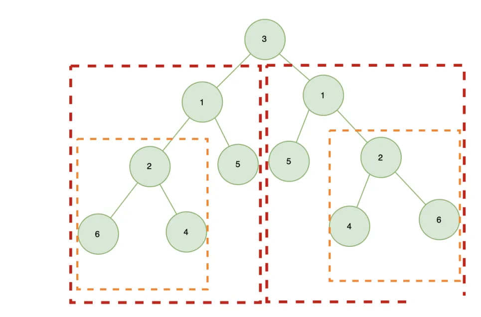

所以，我们需要比较：

- 左右子树的根节点值是否相等
- 左右子树是否镜像对称

边界条件：

- 左右子树都为 `null` 时，返回 `true`
- 左右子树有一个 `null` 时，返回 `false`

**解法一：递归**

```js
const isSymmetric = function(root) {
    // 根节点为空，为对称二叉树
    if(!root) return true
    // 判断是否为对称二叉树
    var isEqual = function(left, right) { 
        // 左右子树为空，为对称二叉树
        if(!left && !right) return true
        // 左右子树有一个为空，则不为对称二叉树
        if(!left || !right) return false
        // 根节点值相等，并且左右子树都相等，则为对称二叉树
        return left.val === right.val
         && isEqual(left.left, right.right) // 左子节点的左子树 与 右子节点的右子树相等
         && isEqual(left.right, right.left) // 左子节点的右子树 与 右子节点的左子树相等
    }
    return isEqual(root.left, root.right)
};
```

>  **复杂度分析：**
>
> - 时间复杂度：O(n)
> - 空间复杂度：O(n)

**解法二：迭代**

> 利用栈来记录比较的过程，实际上，递归就使用了调用栈，所以这里我们可以使用栈来模拟递归的过程
>
> - 首先根的左右子树入栈
> - 将左右子树出栈，比较两个数是否互为镜像：
>   - 如果左右子树的根节点值相等，则将左子树的 `left` 、右子树的 `right` 、左子树的 `right` 、右子树的 `left` 依次入栈
>   - 注意入栈顺序，判断镜像对称，需要比较的是 左子树的 `left` 与 右子树的 `right`  ，左子树的 `right` 与 右子树的 `left` ，根据栈的先进后出特点，先入栈 左子树的 `left` 、右子树的 `right`  ，因此在出栈时，这两个才会进行对比；
>
> - 继续出栈（一次出栈两个进行比较）…….
>
> 依次循环出栈入栈，直到栈为空

```js
const isSymmetric = function(root) {
    if(!root) return true
    // 根节点左右子树入栈
    let stack = [root.left, root.right]
    // 使用栈层次遍历树
    while(stack.length) {
        // 第一次出栈右子树根节点
        let right = stack.pop()
        // 第二个出栈左子树根节点
        let left = stack.pop()
        if(left && right) {
            // 左右子树根节点值不相等，不为镜像
            if(left.val !== right.val) return false
            stack.push(left.left) // 注意：先入栈左节点左子树（根据栈特点，先进后出）
            stack.push(right.right)//  入栈右节点右子树（与左节点左子树 比较）
            stack.push(left.right)// 先入栈左节点右子树（根据栈特点，先进后出）
            stack.push(right.left)//  入栈右节点左子树（与左节点右子树 比较）
        } else if(left || right) {
            return false
        }
    }
    return true
};
```

>  **复杂度分析：**
>
> - 时间复杂度：O(n)
> - 空间复杂度：O(n)


### [合并二叉树](https://leetcode.cn/problems/merge-two-binary-trees/)

给你两棵二叉树： `root1` 和 `root2` 。

想象一下，当你将其中一棵覆盖到另一棵之上时，两棵树上的一些节点将会重叠（而另一些不会）。你需要将这两棵树合并成一棵新二叉树。

合并的规则是：

* 如果两个节点重叠，那么将这两个节点的值相加作为合并后节点的新值；
* 否则，**不为** null 的节点将直接作为新二叉树的节点。
* 返回合并后的二叉树。

**注意:** 合并过程必须从两个树的根节点开始。

>  **示例 1：**
>
> 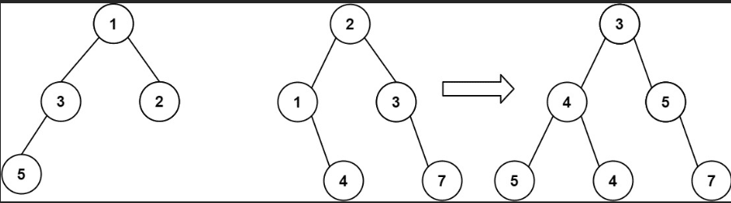
>
> ```
> 输入：root1 = [1,3,2,5], root2 = [2,1,3,null,4,null,7]
> 输出：[3,4,5,5,4,null,7]
> ```
>
> **示例 2：**
>
> ```
> 输入：root1 = [1], root2 = [1,2]
> 输出：[2,2]
> ```
>
>  
>
> **提示：**
>
> - 两棵树中的节点数目在范围 `[0, 2000]` 内
> - `-104 <= Node.val <= 104`

方法一：**递归（深度优先搜索）**

> 可以使用深度优先搜索合并两个二叉树。从根节点开始同时遍历两个二叉树，并将对应的节点进行合并。
>
> 两个二叉树的对应节点可能存在以下三种情况，对于每种情况使用不同的合并方式。
>
> - 如果两个二叉树的对应节点都为空，则合并后的二叉树的对应节点也为空；
>
> - 如果两个二叉树的对应节点只有一个为空，则合并后的二叉树的对应节点为其中的非空节点；
>
> - 如果两个二叉树的对应节点都不为空，则合并后的二叉树的对应节点的值为两个二叉树的对应节点的值之和，此时需要显性合并两个节点。
>
>
> 对一个节点进行合并之后，还要对该节点的左右子树分别进行合并。这是一个递归的过程。

```js
/**
 * Definition for a binary tree node.
 * function TreeNode(val, left, right) {
 *     this.val = (val===undefined ? 0 : val)
 *     this.left = (left===undefined ? null : left)
 *     this.right = (right===undefined ? null : right)
 * }
 */
/**
 * @param {TreeNode} root1
 * @param {TreeNode} root2
 * @return {TreeNode}
 */
var mergeTrees = function(root1, root2) {
    if(root1 == null) return root2; // root1 为空，合并节点为 root2
    if(root2 == null) return root1;// root2 为空，合并节点为 root1
    // 都不为空，创建新的节点，合并 root1, root2
    const node = new TreeNode(root1.val + root2.val);
    // 递归新节点的子节点
    node.left = mergeTrees(root1.left, root2.left); 
    node.right = mergeTrees(root1.right, root2.right);
    return node;
};
```

方法二：**广度优先搜索**

> * 首先判断两个二叉树是否为空，如果两个二叉树都为空，则合并后的二叉树也为空
> * 如果只有一个二叉树为空，则合并后的二叉树为另一个非空的二叉树。
> * 如果两个二叉树都不为空，则首先计算合并后的根节点的值，然后从合并后的二叉树与两个原始二叉树的根节点开始广度优先搜索，从根节点开始同时遍历每个二叉树，并将对应的节点进行合并。
>
> 具体过程：
>
> * 使用三个队列分别存储合并后的二叉树的节点以及两个原始二叉树的节点。
>
> * 初始时将每个二叉树的根节点分别加入相应的队列。
>
> * 每次从每个队列中取出一个节点，判断两个原始二叉树的节点的左右子节点是否为空。
>
>   * 如果两个原始二叉树的当前节点中至少有一个节点的左子节点不为空，则合并后的二叉树的对应节点的左子节点也不为空。对于右子节点同理。
>
> * 如果合并后的二叉树的左子节点不为空，则需要根据两个原始二叉树的左子节点计算合并后的二叉树的左子节点以及整个左子树。考虑以下两种情况：
>
>   * 如果两个原始二叉树的左子节点都不为空，则合并后的二叉树的左子节点的值为两个原始二叉树的左子节点的值之和，在创建合并后的二叉树的左子节点之后，将每个二叉树中的左子节点都加入相应的队列；
>
>   * 如果两个原始二叉树的左子节点有一个为空，即有一个原始二叉树的左子树为空，则合并后的二叉树的左子树即为另一个原始二叉树的左子树，此时也不需要对非空左子树继续遍历，因此不需要将左子节点加入队列。
>
> * 对于右子节点和右子树，处理方法与左子节点和左子树相同。
>
> 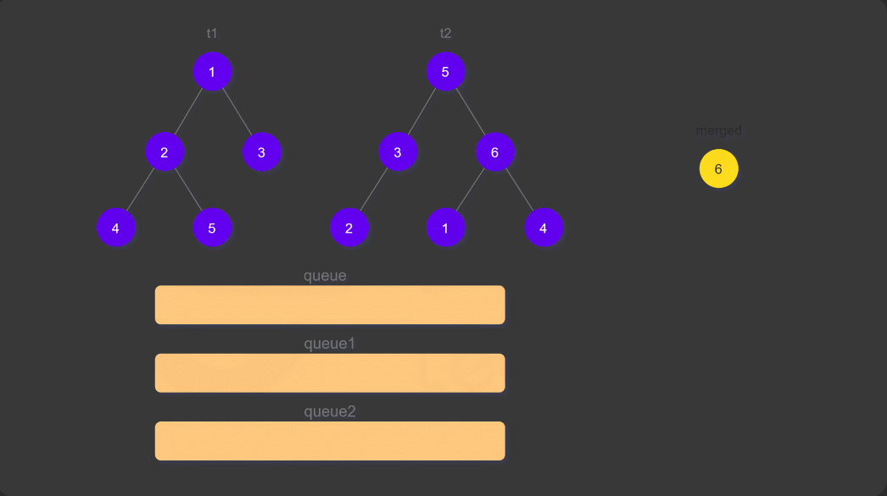

```js
/**
 * Definition for a binary tree node.
 * function TreeNode(val, left, right) {
 *     this.val = (val===undefined ? 0 : val)
 *     this.left = (left===undefined ? null : left)
 *     this.right = (right===undefined ? null : right)
 * }
 */
/**
 * @param {TreeNode} root1
 * @param {TreeNode} root2
 * @return {TreeNode}
 */
var mergeTrees = function (root1, root2) {
    if (root1 == null) return root2;
    if (root2 == null) return root1;
    // 创建合并节点
    const mergedNode = new TreeNode(root1.val + root2.val);
    let queue = [], queue1 = [], queue2 = []; //创建三个队列分别存储合并节点和原始左右节点
    queue.push(mergedNode); // 存储节点
    queue1.push(root1);
    queue2.push(root2);
    // 遍历队列，直到队列为空，即为层次遍历结束
    while (queue1.length > 0 && queue2.length > 0) {
        // 获取队列节点，即合并节点和对比两棵树的对比节点
        const node = queue.shift(), node1 = queue1.shift(), node2 = queue2.shift();
        // 获取两个树的对比节点的左右子节点
        const left1 = node1.left, left2 = node2.left, right1 = node1.right, right2 = node2.right;
        // 对两棵树的左节点进行对比
        if (left1 != null || left2 != null) {
            // 左节点左右节点都不为空，合并两个节点内容，并将三个树左节点入队列
            if (left1 != null && left2 != null) {
                const left = new TreeNode(left1.val + left2.val);
                node.left = left;
                queue.push(left);
                queue1.push(left1);
                queue2.push(left2);
            } else if (left1 != null) { // 树2 左节点为空，则将树1 左节点作为新树左节点
                node.left = left1;
            } else if (left2 != null) {// 树1 左节点为空，则将树2 左节点作为新树左节点
                node.left = left2;
            }
        }
        // 对两棵树的右节点进行对比
        if (right1 != null || right2 != null) {
               // 右节点左右节点都不为空，合并两个节点内容，并将三个树左节点入队列
            if (right1 != null && right2 != null) {
                const right = new TreeNode(right1.val + right2.val);
                node.right = right;
                queue.push(right);
                queue1.push(right1);
                queue2.push(right2);
            } else if (right1 != null) { // 树2 右节点为空，则将树1 右节点作为新树左节点
                node.right = right1;
            } else if (right2 != null) {// 树1 右节点为空，则将树2 右节点作为新树左节点
                node.right = right2;
            }
        }
       
    }
     return mergedNode;
};
```


### [二叉树的最近公共祖先](https://leetcode.cn/problems/er-cha-shu-de-zui-jin-gong-gong-zu-xian-lcof/solutions/531784/er-cha-shu-de-zui-jin-gong-gong-zu-xian-6fdt7/)

给定一个二叉树, 找到该树中两个指定节点的最近公共祖先。

最近公共祖先的定义为：“对于有根树 T 的两个结点 p、q，最近公共祖先表示为一个结点 x，满足 x 是 p、q 的祖先且 x 的深度尽可能大（一个节点也可以是它自己的祖先）。”

例如，给定如下二叉树: root = [3,5,1,6,2,0,8,null,null,7,4]


**示例 1:**

```js
输入: root = [3,5,1,6,2,0,8,null,null,7,4], p = 5, q = 1
输出: 3
解释: 节点 5 和节点 1 的最近公共祖先是节点 3。
```

**示例 2:**

```js
输入: root = [3,5,1,6,2,0,8,null,null,7,4], p = 5, q = 4
输出: 5
解释: 节点 5 和节点 4 的最近公共祖先是节点 5。因为根据定义最近公共祖先节点可以为节点本身。
```

**说明**:

- 所有节点的值都是唯一的。
- p、q 为不同节点且均存在于给定的二叉树中。

**解法一：递归实现**

> 如果树为空树或 `p` 、 `q` 中任一节点为根节点，那么 `p` 、 `q` 的最近公共节点为根节点
>
> 如果不是，即二叉树不为空树，且 `p` 、 `q` 为非根节点，则递归遍历左右子树，获取左右子树的最近公共祖先，
>
> - 情况一：左子树和右子树均包含  p 节点或  q 节点.
>
>   - 如果左子树包含的是  p 节点，那么右子树只能包含  q 节点，反之亦然;
>   - 因为 p  节点和 q 节点都是不同且唯一的节点，因此如果满足这个判断条件即可说明 x  就是我们要找的最近公共祖先；
> - 情况二：x 恰好是 p 节点或 q 节点且它的左子树或右子树有一个包含了另一个节点的情况，因此如果满足这个判断条件亦可说明 x 就是我们要找的最近公共祖先
> - 情况三：p 节点和q节点都分布在 x 的左子树或右子树，则 x 是 p 节点和q 节点的最近公共祖先。
>
>   
>
> 示例：搜索树中两个节点 `9` 和 `11` 的最近公共祖先

**代码实现：**

```js
var lowestCommonAncestor = function(root, p, q) {
    let ans;
    const dfs = (root, p, q) => {
        if (root === null) return false;// 根节点为空，不存在公共祖先
        const lson = dfs(root.left, p, q); // 深度搜索左子树p、q 的公共祖先,其中 lson 代表 x 节点的左孩子
        const rson = dfs(root.right, p, q);// 深度搜索右子树p、q 的公共祖先,其中 Rson 代表 x 节点的右孩子
        //左子树和右子树均包含  p 节点或  q 节点
        //root 恰好是 p 节点或 q 节点且它的左子树或右子树有一个包含了另一个节点的情况
        if ((lson && rson) || ((root.val === p.val || root.val === q.val) && (lson || rson))) {
            ans = root;
        } 
     
        return lson || rson || (root.val === p.val || root.val === q.val);
    }
    dfs(root, p, q);
    return ans;
};

```

>  **复杂度分析：**
>
>  - 时间复杂度：O(N)，其中 N是二叉树的节点数。二叉树的所有节点有且只会被访问一次，因此时间复杂度为 O(N)。
>  - 空间复杂度：O(N)，其中 N 是二叉树的节点数。递归调用的栈深度取决于二叉树的高度，二叉树最坏情况下为一条链，此时高度为 N，因此空间复杂度为 O(N)。


**解法二：哈希表存储父节点**

> * 我们可以用哈希表存储所有节点的父节点，然后我们就可以利用节点的父节点信息从 p 结点开始不断往上跳，并记录已经访问过的节点，再从 q 节点开始不断往上跳，如果碰到已经访问过的节点，那么这个节点就是我们要找的最近公共祖先。
>
> * 算法
>   * 从根节点开始遍历整棵二叉树，用哈希表记录每个节点的父节点指针。
>   * 从 p 节点开始不断往它的祖先移动，并用数据结构记录已经访问过的祖先节点。
>   * 同样，我们再从 q 节点开始不断往它的祖先移动，如果有祖先已经被访问过，即意味着这是 p 和 q 的深度最深的公共祖先，即 LCA 节点。

```js
var lowestCommonAncestor = function(root,p,q) {
    const parents = new Map() // 使用map存储访每一个节点的父节点
    const visited = new Set() // 使用 set 存储p、q 访问的父节点查找链
    // 深度搜索，遍历每一个节点，并存储其父节点
    const dfs = function(root) {
        if(root.left !=null) {
            parents.set(root.left.value,root) // 保存当前值和它对应的根节点
            dfs(root.left)
        }
        if(root.right !=null) {
            parents.set(root.right.value,root) // 保存当前值和它对应的根节点
            dfs(root.right)
        }
    }
    
    const getLowestCommonAncestor = function(root,p,q){
        dfs(root) // 深度优先搜索记录每一个节点的父节点链条
        while(p!=null) {// 逆向查找 p 的父节点链条
            visited.push(p.value) // 保存p的访问路径
            p = parents.get(p.value) // 获取 p 的父亲节点
        }
        while(q!=null) {
            // p 的父节点访问路径中存在 q 节点，则 q 是最近公共祖先
            if(visited.has(q.value)) {
                return q
            }
            q = parents.get(q.value)
        }
        return null
    }
    getLowestCommonAncestor(root,p,q)
}
```

> * 复杂度分析
>
>   * 时间复杂度：O(N)，其中 N 是二叉树的节点数。二叉树的所有节点有且只会被访问一次，从 p 和 q 节点往上跳经过的祖先节点个数不会超过 N，因此总的时间复杂度为 O(N)。
>
>   * 空间复杂度：O(N) ，其中 N 是二叉树的节点数。递归调用的栈深度取决于二叉树的高度，二叉树最坏情况下为一条链，此时高度为 N，因此空间复杂度为 O(N)，哈希表存储每个节点的父节点也需要 O(N)的空间复杂度，因此最后总的空间复杂度为 O(N)。


### 二叉树指定节点间的最短距离

* 给定一个二叉树, 找到该树中两个指定节点间的最短距离

> **解答：**
>
> 1. 求最近公共祖先节点；
> 2. 然后再求最近公共祖先节点到两个指定节点的路径；
> 3. 再求两个节点的路径之和

```js
const shortestDistance = function(root, p, q) {
    // 最近公共祖先
    let lowestCA = lowestCommonAncestor(root, p, q)
    // 分别求出公共祖先到两个节点的路经
    let pDis = [], qDis = []
    getPath(lowestCA, p, pDis)
    getPath(lowestCA, q, qDis)
    // 返回路径之和
    return (pDis.length + qDis.length)
}

// 最近公共祖先
const lowestCommonAncestor = function(root, p, q) {
    if(root === null || root === p || root === q) return root
    const left = lowestCommonAncestor(root.left, p, q)
    const right = lowestCommonAncestor(root.right, p, q)
    if(left === null) return right
    if(right === null) return left
    return root
}

const getPath = function(root, p, paths) {
    // 找到节点，返回 true
    if(root === p) return true
    // 当前节点加入路径中
    paths.push(root)
    let hasFound = false
    // 先找左子树
    if (root.left !== null)
        hasFound = getPath(root.left, p, paths)
    // 左子树没有找到，再找右子树
    if (!hasFound && root.right !== null)
        hasFound = getPath(root.right, p, paths)
    // 没有找到，说明不在这个节点下面，则弹出
    if (!hasFound)
        paths.pop()
    return hasFound
}
```

### 二叉搜索树中第K小的元素

给定一个二叉搜索树，编写一个函数 `kthSmallest` 来查找其中第 `k` 个最小的元素。

**说明：** 你可以假设 k 总是有效的，1 ≤ k ≤ 二叉搜索树元素个数。

**示例 1:**

```
输入: root = [3,1,4,null,2], k = 1
   3
  / \
 1   4
  \
   2
输出: 1
```

**示例 2:**

```
输入: root = [5,3,6,2,4,null,null,1], k = 3
       5
      / \
     3   6
    / \
   2   4
  /
 1
输出: 3
```

**进阶：** 如果二叉搜索树经常被修改（插入/删除操作）并且你需要频繁地查找第 k 小的值，你将如何优化 kthSmallest 函数？

**解答：**

我们知道：中序遍历其实是对树进行排序操作 ，并且是按从小到大的顺序排序，所以本题就很简单了

**解题思路：** 中序遍历二叉搜索树，输出第 k 个既可

**代码实现（递归）：**

```js
const kthSmallest = function(root, k) {
    let res = null
    let inOrderTraverseNode = function(node) {
        if(node !== null && k > 0) {
            // 先遍历左子树
            inOrderTraverseNode(node.left)
            // 然后根节点
            if(--k === 0) {
                res = node.val
                return 
            }
            // 再遍历右子树
            inOrderTraverseNode(node.right)
        }
    }
    inOrderTraverseNode(root)
    return res
}
```

> **复杂度分析：**
>
> - 时间复杂度：O(k)
> - 空间复杂度：不考虑递归栈所占用的空间，空间复杂度为 O(1)


**代码实现（迭代）：**

```js
const kthSmallest = function(root, k) {
    let stack = []
    let node = root
    
    while(node || stack.length) {
        // 遍历左子树
        while(node) {
            stack.push(node)
            node = node.left
        }
      
        node = stack.pop()
        if(--k === 0) {
            return node.val
        }
        node = node.right
    }
    return null
}
```

> **复杂度分析：**
>
> - 时间复杂度：O(H+K)
> - 空间复杂度：空间复杂度为 O(H+K)


## 二叉树遍历题

| 题号 | 标题                                                         | 标签                                                 | 难度 |
| :--- | :----------------------------------------------------------- | :--------------------------------------------------- | :--- |
| 0144 | [二叉树的前序遍历](https://leetcode.cn/problems/binary-tree-preorder-traversal/) | 栈、树、深度优先搜索、二叉树                         | 简单 |
| 0094 | [二叉树的中序遍历](https://leetcode.cn/problems/binary-tree-inorder-traversal/) | 栈、树、深度优先搜索、二叉树                         | 简单 |
| 0145 | [二叉树的后序遍历](https://leetcode.cn/problems/binary-tree-postorder-traversal/) | 栈、树、深度优先搜索、二叉树                         | 简单 |
| 0102 | [二叉树的层序遍历](https://leetcode.cn/problems/binary-tree-level-order-traversal/) | 树、广度优先搜索、二叉树                             | 中等 |
| 0103 | [二叉树的锯齿形层序遍历](https://leetcode.cn/problems/binary-tree-zigzag-level-order-traversal/) | 树、广度优先搜索、二叉树                             | 中等 |
| 0107 | [二叉树的层序遍历 II](https://leetcode.cn/problems/binary-tree-level-order-traversal-ii/) | 树、广度优先搜索、二叉树                             | 中等 |
| 0104 | [二叉树的最大深度](https://leetcode.cn/problems/maximum-depth-of-binary-tree/) | 树、深度优先搜索、广度优先搜索、二叉树               | 简单 |
| 0111 | [二叉树的最小深度](https://leetcode.cn/problems/minimum-depth-of-binary-tree/) | 树、深度优先搜索、广度优先搜索、二叉树               | 简单 |
| 0124 | [二叉树中的最大路径和](https://leetcode.cn/problems/binary-tree-maximum-path-sum/) | 树、深度优先搜索、动态规划、二叉树                   | 困难 |
| 0101 | [对称二叉树](https://leetcode.cn/problems/symmetric-tree/)   | 树、深度优先搜索、广度优先搜索、二叉树               | 简单 |
| 0112 | [路径总和](https://leetcode.cn/problems/path-sum/)           | 树、深度优先搜索、广度优先搜索、二叉树               | 简单 |
| 0113 | [路径总和 II](https://leetcode.cn/problems/path-sum-ii/)     | 树、深度优先搜索、回溯、二叉树                       | 中等 |
| 0236 | [二叉树的最近公共祖先](https://leetcode.cn/problems/lowest-common-ancestor-of-a-binary-tree/) | 树、深度优先搜索、二叉树                             | 中等 |
| 0199 | [二叉树的右视图](https://leetcode.cn/problems/binary-tree-right-side-view/) | 树、深度优先搜索、广度优先搜索、二叉树               | 中等 |
| 0226 | [翻转二叉树](https://leetcode.cn/problems/invert-binary-tree/) | 树、深度优先搜索、广度优先搜索、二叉树               | 简单 |
| 0958 | [二叉树的完全性检验](https://leetcode.cn/problems/check-completeness-of-a-binary-tree/) | 树、广度优先搜索、二叉树                             | 中等 |
| 0572 | [另一棵树的子树](https://leetcode.cn/problems/subtree-of-another-tree/) | 树、深度优先搜索、二叉树、字符串匹配、哈希函数       | 简单 |
| 0100 | [相同的树](https://leetcode.cn/problems/same-tree/)          | 树、深度优先搜索、广度优先搜索、二叉树               | 简单 |
| 0116 | [填充每个节点的下一个右侧节点指针](https://leetcode.cn/problems/populating-next-right-pointers-in-each-node/) | 树、深度优先搜索、广度优先搜索、链表、二叉树         | 中等 |
| 0117 | [填充每个节点的下一个右侧节点指针 II](https://leetcode.cn/problems/populating-next-right-pointers-in-each-node-ii/) | 树、深度优先搜索、广度优先搜索、链表、二叉树         | 中等 |
| 0297 | [二叉树的序列化与反序列化](https://leetcode.cn/problems/serialize-and-deserialize-binary-tree/) | 树、深度优先搜索、广度优先搜索、设计、字符串、二叉树 | 困难 |
| 0114 | [二叉树展开为链表](https://leetcode.cn/problems/flatten-binary-tree-to-linked-list/) | 栈、树、深度优先搜索、链表、二叉树                   | 中等 |


## 二叉搜索树题目

| 题号          | 标题                                                         | 标签                                                     | 难度 |
| :------------ | :----------------------------------------------------------- | :------------------------------------------------------- | :--- |
| 0098          | [验证二叉搜索树](https://leetcode.cn/problems/validate-binary-search-tree/) | 树、深度优先搜索、二叉搜索树、二叉树                     | 中等 |
| 0173          | [二叉搜索树迭代器](https://leetcode.cn/problems/binary-search-tree-iterator/) | 栈、树、设计、二叉搜索树、二叉树、迭代器                 | 中等 |
| 0700          | [二叉搜索树中的搜索](https://leetcode.cn/problems/search-in-a-binary-search-tree/) | 树、二叉搜索树、二叉树                                   | 简单 |
| 0701          | [二叉搜索树中的插入操作](https://leetcode.cn/problems/insert-into-a-binary-search-tree/) | 树、二叉搜索树、二叉树                                   | 中等 |
| 0450          | [删除二叉搜索树中的节点](https://leetcode.cn/problems/delete-node-in-a-bst/) | 树、二叉搜索树、二叉树                                   | 中等 |
| 0703          | [数据流中的第 K 大元素](https://leetcode.cn/problems/kth-largest-element-in-a-stream/) | 树、设计、二叉搜索树、二叉树、数据流、堆（优先队列）     | 简单 |
| 剑指 Offer 54 | [二叉搜索树的第k大节点](https://leetcode.cn/problems/er-cha-sou-suo-shu-de-di-kda-jie-dian-lcof/) | 树、深度优先搜索、二叉搜索树、二叉树                     | 简单 |
| 0230          | [二叉搜索树中第K小的元素](https://leetcode.cn/problems/kth-smallest-element-in-a-bst/) | 树、深度优先搜索、二叉搜索树、二叉树                     | 中等 |
| 0235          | [二叉搜索树的最近公共祖先](https://leetcode.cn/problems/lowest-common-ancestor-of-a-binary-search-tree/) | 树、深度优先搜索、二叉搜索树、二叉树                     | 中等 |
| 0426          | [将二叉搜索树转化为排序的双向链表](https://leetcode.cn/problems/convert-binary-search-tree-to-sorted-doubly-linked-list/) | 栈、树、深度优先搜索、二叉搜索树、链表、二叉树、双向链表 | 中等 |
| 0108          | [将有序数组转换为二叉搜索树](https://leetcode.cn/problems/convert-sorted-array-to-binary-search-tree/) | 树、二叉搜索树、数组、分治、二叉树                       | 简单 |
| 0110          | [平衡二叉树](https://leetcode.cn/problems/balanced-binary-tree/) | 树、深度优先搜索、二叉树                                 | 简单 |
