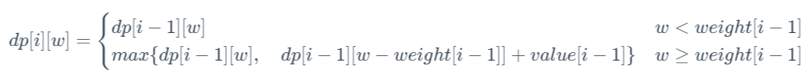
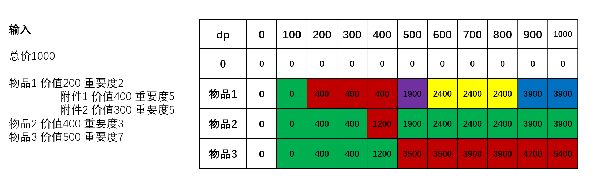

# 背包问题

## 背包问题的定义

> **背包问题**：背包问题是线性 DP 问题中一类经典而又特殊的模型。背包问题可以描述为：给定一组物品，每种物品都有自己的重量、价格以及数量。再给定一个最多能装重量为 𝑊 的背包。现在选择将一些物品放入背包中，请问在总重量不超过背包载重上限的情况下，能装入背包的最大价值总和是多少？


根据物品限制条件的不同，背包问题可分为：

* 0-1 背包问题
* 完全背包问题
* 多重背包问题
* 分组背包问题
* 混合背包问题

## 背包问题的暴力解题思路

假设有 𝑛  件物品：

1. 枚举出这 𝑛  件物品所有可能的组合。
2. 然后再判断这些组合中的物品是否能放入背包，以及是否能得到最大价值。

这种做法的时间复杂度是 `𝑂(2^𝑛)` 。

背包问题暴力解法的时间复杂度是指数级别的，我们可以利用动态规划算法减少一下时间复杂度。

```typescript
interface Item {  
  weight: number; // 物品重量  
  price: number; // 物品价格  
  quantity: number; // 物品数量  
}  
  
function knapsackBruteForce(items: Item[], W: number): number {  
  let maxPrice = 0; // 最大价值  
  
  // 定义一个辅助函数来递归地尝试所有可能的组合  
  function tryCombinations(index: number, currentWeight: number, currentPrice: number): void {  
    // 如果当前重量超过背包载重或已经处理完所有物品，返回  
    if (currentWeight > W || index >= items.length) {  
      return;  
    }  
  
    // 不选择当前物品，继续处理下一个物品  
    tryCombinations(index + 1, currentWeight, currentPrice);  
  
    // 尝试选择当前物品（如果还有剩余且不会超过背包载重）  
    const maxToAdd = Math.min(items[index].quantity, Math.floor((W - currentWeight) / items[index].weight));  
    for (let i = 1; i <= maxToAdd; i++) {  
      const newWeight = currentWeight + i * items[index].weight;  
      const newPrice = currentPrice + i * items[index].price;  
      // 更新最大价值  
      if (newPrice > maxPrice && newWeight <= W) {  
        maxPrice = newPrice;  
      }  
      // 递归地尝试其他组合  
      tryCombinations(index + 1, newWeight, newPrice);  
    }  
  }  
  
  // 从第一个物品开始尝试所有组合  
  tryCombinations(0, 0, 0);  
  
  return maxPrice;  
}  
  
// 示例使用  
const items: Item[] = [  
  { weight: 10, price: 60, quantity: 2 },  
  { weight: 20, price: 100, quantity: 1 },  
  { weight: 30, price: 120, quantity: 1 },  
];  
const W = 50;  
console.log(knapsackBruteForce(items, W)); // 输出最大价值
```

----


##  0-1 背包问题基本思路

> **0-1 背包问题的特点**：每种物品有且仅有 1 件，可以选择不放入背包，也可以选择放入背包。

### 思路 1：动态规划 + 二维基本思路

#### 1. 划分阶段

按照物品的序号、当前背包的载重上限进行阶段划分。

#### 2. 定义状态

定义状态 `𝑑𝑝[𝑖][𝑤]` 表示为：前 𝑖 件物品放入一个最多能装重量为 𝑤 的背包中，可以获得的最大价值。

状态 `𝑑𝑝[𝑖][𝑤]` 是一个二维数组，其中第一维代表「当前正在考虑的物品」，第二维表示「当前背包的载重上限」，二维数组值表示「可以获得的最大价值」。

#### 3. 状态转移方程

对于「`将前 𝑖 件物品放入一个最多能装重量为 𝑤 的背包中，可以获得的最大价值` 」这个子问题，如果我们只考虑第 𝑖−1 件物品（前 𝑖 件物品中最后一件物品）的放入策略（放入背包和不放入背包两种策略）。

则问题可以转换为一个只跟前 𝑖−1 件物品相关的问题:

1. **第 𝑖−1 件物品不放入背包**：问题转换为「`前 𝑖−1  件物品放入一个最多能装重量为 𝑤 的背包中 ，可以获得的最大价值`」为 `𝑑𝑝[𝑖−1][𝑤]` 。
2. **第 𝑖−1 件物品放入背包**：问题转换为「`前 𝑖−1 件物品放入一个最多能装重量为 𝑤−𝑤𝑒𝑖𝑔ℎ𝑡[𝑖−1]  的背包中，可以获得的最大价值`」为 `𝑑𝑝[𝑖−1][𝑤−𝑤𝑒𝑖𝑔ℎ𝑡[𝑖−1]]` ，再加上「`放入的第 𝑖−1 件物品的价值`」为 `𝑣𝑎𝑙𝑢𝑒[𝑖−1]` ，则此时可以获得的最大价值为 `𝑑𝑝[𝑖−1][𝑤−𝑤𝑒𝑖𝑔ℎ𝑡[𝑖−1]] + 𝑣𝑎𝑙𝑢𝑒[𝑖−1]` 。

接下来我们再来考虑一下第 𝑖−1  件物品满足什么条件时才能考虑是否放入背包，并且在什么条件下一定不能放入背包:

1. **如果当前背包的载重不足时（即 `𝑤<𝑤𝑒𝑖𝑔ℎ𝑡[𝑖−1]` ）**：第 𝑖−1 件物品一定不能放入背包，此时背包的价值 `𝑑𝑝[𝑖][𝑤]` 仍为 `𝑑𝑝[𝑖−1][𝑤]` 时的价值，即 `𝑑𝑝[𝑖][𝑤]=𝑑𝑝[𝑖−1][𝑤]` 。
2. **如果当前背包的载重足够时（即 `𝑤≥𝑤𝑒𝑖𝑔ℎ𝑡[𝑖−1]` ）**：第 𝑖−1 件物品可以考虑放入背包，或者不放入背包，此时背包的价值取两种情况下的最大值，即 `𝑑𝑝[𝑖][𝑤]=𝑚𝑎𝑥{𝑑𝑝[𝑖−1][𝑤],𝑑𝑝[𝑖−1][𝑤−𝑤𝑒𝑖𝑔ℎ𝑡[𝑖−1]]+𝑣𝑎𝑙𝑢𝑒[𝑖−1]}` 。

则状态转移方程为：



#### 4. 初始条件

- 如果背包载重上限为 0 ，则无论选取什么物品，可以获得的最大价值一定是 0 ，即 `𝑑𝑝[𝑖][0]=0,0≤𝑖≤𝑠𝑖𝑧𝑒` 。
- 无论背包载重上限是多少，前 0 件物品所能获得的最大价值一定为 0，即 `𝑑𝑝[0][𝑤]=0,0≤𝑤≤𝑊` 。

#### 5. 最终结果

根据我们之前定义的状态，`𝑑𝑝[𝑖][𝑤]` 表示为：前 𝑖 件物品放入一个最多能装重量为 𝑤 的背包中，可以获得的最大价值。则最终结果为 `𝑑𝑝[𝑠𝑖𝑧𝑒][𝑊]` ，其中 `𝑠𝑖𝑧𝑒` 为物品的件数，𝑊 为背包的载重上限。

```typescript
  // 思路 1：动态规划 + 二维基本思路  
    zeroOnePackMethod1(weight: number[], value: number[], W: number): number {  
        const size = weight.length; // 物品的数量  
        const dp: number[][] = new Array(size + 1); // 创建一个二维数组来保存动态规划的状态  
  
        // 初始化二维数组  
        for (let i = 0; i <= size; i++) {  
            dp[i] = new Array(W + 1).fill(0);  
        }  
  
        // 枚举前 i 种物品  
        for (let i = 1; i <= size; i++) {  
            // 枚举背包装载重量  
            for (let w = 0; w <= W; w++) {  
                // 第 i - 1 件物品装不下  
                if (w < weight[i - 1]) {  
                    // dp[i][w] 取「前 i - 1 件物品装入载重为 w 的背包中的最大价值」  
                    dp[i][w] = dp[i - 1][w];  
                } else {  
                    // dp[i][w] 取「前 i - 1 件物品装入载重为 w 的背包中的最大价值」与「前 i - 1 件物品装入载重为 w - weight[i - 1] 的背包中，再装入第 i - 1 物品所得的最大价值」两者中的最大值  
                    dp[i][w] = Math.max(dp[i - 1][w], dp[i - 1][w - weight[i - 1]] + value[i - 1]);  
                }  
            }  
        }  
  
        // 返回最终的结果，即所有物品都考虑进去，且背包重量为 W 时的最大价值  
        return dp[size][W];  
    }  
```


#### 复杂度分析

- **时间复杂度**：𝑂(𝑛×𝑊) ，其中 𝑛  为物品数量，𝑊  为背包的载重上限。
- **空间复杂度**：𝑂(𝑛×𝑊) 。


### 0-1 背包问题算法题

### [HJ16 购物单](https://www.nowcoder.com/practice/f9c6f980eeec43ef85be20755ddbeaf4?tpId=37&tqId=21239&rp=1&ru=%2Fexam%2Foj%2Fta&qru=%2Fexam%2Foj%2Fta&sourceUrl=%2Fexam%2Foj%2Fta%3FtpId%3D37&difficulty=undefined&judgeStatus=undefined&tags=&title=%E8%B4%AD%E7%89%A9%E5%8D%95&dayCountBigMember=365%E5%A4%A9)

> 题目描述：[购物单_牛客题霸_牛客网 (nowcoder.com)](https://www.nowcoder.com/practice/f9c6f980eeec43ef85be20755ddbeaf4?tpId=37&tqId=21239&rp=1&ru=%2Fexam%2Foj%2Fta&qru=%2Fexam%2Foj%2Fta&sourceUrl=%2Fexam%2Foj%2Fta%3FtpId%3D37&difficulty=undefined&judgeStatus=undefined&tags=&title=购物单&dayCountBigMember=365天)

对于同一个物品，现在它的价格、重要度都是可变的
那么我们只需要对每一个主件尝试如下四种情况：

1. 仅购买一个主件；
2. 购买主件和第一个附件；
3. 购买主件和第二个附件；
4. 购买主件和两个附件；

在以上四种情况中找到最大值就能回归到0-1背包问题。

所以我们先考虑一下普通的0-1背包问题

对于一个可承重C的背包，我们假设所有物品的重量数据保存在`w[]`，所有价值数据保存在`v[]`。那么我们有以下的推导式：
$$
dp[i][j]=max(dp[i−1][j],dp[i−1][j−w[j]]+v[j])
$$
那么对于“购物单”这道题，我们可以有如下抽象：
$$
不购买该物品: f[i−1][j]
$$

$$
仅购买一个主件: f[i−1][j−w[i]]+v[i]  
$$

$$
购买主件和第一个附件: f[i][j]=max(f[i−1][j],f[i−1][j−w[i]−w[a 
1
​
 ]]+v[i]+v[a 
1
​
 ])  
$$

$$
购买主件和第二个附件: f[i][j]=max(f[i−1][j],f[i−1][j−w[i]−w[a 
2
​
 ]]+v[i]+v[a 
2
​
 ])
$$

$$
购买主件和两个附件: f[i][j]=max(f[i−1][j],f[i−1][j−w[i]−w[a 
1
​
 ]−w[a 
2
​
 ]]+v[i]+v[a 
1
​
 ]+v[a 
2
​
 ])
$$

用一个示例来说明，各个颜色表示最优方案，其中白块表示初始化区域，绿块表示不取物品最大，红块表示只取物品主件，紫块表示取物品主件和附件1，黄块表示取物品主件和附件2，蓝块表示取物品主件和两个附件 

```typescript
import * as readline from 'readline';

class Goods {
  v: number;
  p: number;
  main: boolean;
  a1: number;
  a2: number;

  constructor() {
    this.v = 0;
    this.p = 0;
    this.main = false;
    this.a1 = -1;
    this.a2 = -1;
  }
}

class Main {
  public static main(args: string[]) {
    const rl = readline.createInterface({
      input: process.stdin,
      output: process.stdout
    });

    const sc = rl.questionAsync('');
    sc.then((N) => {
      const m = parseInt(N, 10);
      const goods = new Array(m).fill(0).map(() => new Goods());

      for (let i = 0; i < m; i++) {
        const v = parseInt(rl.question('')!, 10);
        const p = parseInt(rl.question('')!, 10);
        const q = parseInt(rl.question('')!, 10);
        goods[i].v = v;
        goods[i].p = p * v;
        if (q === 0) {
          goods[i].main = true;
        } else {
          if (goods[q - 1].a1 === -1) {
            goods[q - 1].a1 = i;
          } else {
            goods[q - 1].a2 = i;
          }
        }
      }

      const dp = Array.from({ length: m + 1 }, () =>
        Array(N + 1).fill(0)
      );

      for (let i = 1; i <= m; i++) {
        for (let j = 0; j <= N; j++) {
          dp[i][j] = dp[i - 1][j];
          if (!goods[i - 1].main) {
            continue;
          }
          if (j >= goods[i - 1].v) {
            dp[i][j] = Math.max(dp[i][j], dp[i - 1][j - goods[i - 1].v] + goods[i - 1].p);
          }
          // ... 其他 if 条件分支与上面的类似，根据原始 Java 代码进行转换
        }
      }
      console.log(dp[m][N]);
    });
  }
}

Main.main([]);
```

