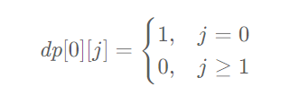
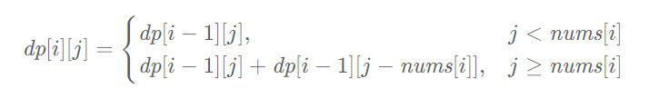

# 记忆化搜索

> **记忆化搜索（Memoization Search）**：是一种通过存储已经遍历过的状态信息，从而避免对同一状态重复遍历的搜索算法。

记忆化搜索是动态规划的一种实现方式。

在记忆化搜索中，当算法需要计算某个子问题的结果时，它首先检查是否已经计算过该问题。如果已经计算过，则直接返回已经存储的结果；否则，计算该问题，并将结果存储下来以备将来使用。

举个例子，比如「斐波那契数列」的定义是：𝑓(0)=0,𝑓(1)=1,𝑓(𝑛)=𝑓(𝑛−1)+𝑓(𝑛−2) 。如果我们使用递归算法求解第 𝑛  个斐波那契数，则对应的递推过程如下：

 

从图中可以看出：如果使用普通递归算法，想要计算 𝑓(5) ，需要先计算 f*(3) 和  f*(4)，而在计算  f*(4) 时还需要计算  f*(3)。这样 𝑓(3) 就进行了多次计算，同理 f*(0)、 f*(1)、 f(2) 都进行了多次计算，从而导致了重复计算问题。

为了避免重复计算，在递归的同时，我们可以使用一个缓存（数组或哈希表）来保存已经求解过的 f*(*k*) 的结果。*

如上图所示，当递归调用用到 f*(*k ) 时，先查看一下之前是否已经计算过结果，如果已经计算过，则直接从缓存中取值返回，而不用再递推下去，这样就避免了重复计算问题。

使用「记忆化搜索」方法解决斐波那契数列的代码如下：

```typescript
function fib(n: number): number {
    // 使用数组缓存计算过的结果
    const memo: number[] = new Array(n + 1).fill(null);  
    return myFib(n, memo);  
}  
  
function myFib(n: number, memo: number[]): number {  
    if (n === 0) {  
        return 0;  
    }  
    if (n === 1) {  
        return 1;  
    }  
   	// 缓存中存在结果，返回结果
    if (memo[n] !== null) {  
        return memo[n];  
    }  
  	// 计算斐波那契数列
    memo[n] = myFib(n - 1, memo) + myFib(n - 2, memo);  
    return memo[n];  
}  
```


## 记忆化搜索与递推区别

「记忆化搜索」与「递推」都是动态规划的实现方式，但是两者之间有一些区别。

> **记忆化搜索**：「自顶向下」的解决问题，采用自然的递归方式编写过程，在过程中会保存每个子问题的解（通常保存在一个数组或哈希表中）来避免重复计算。
>
> - 优点：代码清晰易懂，可以有效的处理一些复杂的状态转移方程。有些状态转移方程是非常复杂的，使用记忆化搜索可以将复杂的状态转移方程拆分成多个子问题，通过递归调用来解决。
> - 缺点：可能会因为递归深度过大而导致栈溢出问题。
>
> **递推**：「自底向上」的解决问题，采用循环的方式编写过程，在过程中通过保存每个子问题的解（通常保存在一个数组或哈希表中）来避免重复计算。
>
> - 优点：避免了深度过大问题，不存在栈溢出问题。计算顺序比较明确，易于实现。
> - 缺点：无法处理一些复杂的状态转移方程。有些状态转移方程非常复杂，如果使用递推方法来计算，就会导致代码实现变得非常困难。

根据记忆化搜索和递推的优缺点，我们可以在不同场景下使用这两种方法。

适合使用「记忆化搜索」的场景：

1. 问题的状态转移方程比较复杂，递推关系不是很明确。
2. 问题适合转换为递归形式，并且递归深度不会太深。

适合使用「递推」的场景：

1. 问题的状态转移方程比较简单，递归关系比较明确。
2. 问题不太适合转换为递归形式，或者递归深度过大容易导致栈溢出。

## 记忆化搜索解题步骤

我们在使用记忆化搜索解决问题的时候，其基本步骤如下：

1. 写出问题的动态规划「状态」和「状态转移方程」。
2. 定义一个缓存（数组或哈希表），用于保存子问题的解。
3. 定义一个递归函数，用于解决问题。在递归函数中，首先检查缓存中是否已经存在需要计算的结果，如果存在则直接返回结果，否则进行计算，并将结果存储到缓存中，再返回结果。
4. 在主函数中，调用递归函数并返回结果。

## 算法题

| 题号 | 标题                                                         | 标签                                                         | 难度 |
| :--- | :----------------------------------------------------------- | :----------------------------------------------------------- | :--- |
| 1137 | [第 N 个泰波那契数](https://leetcode.cn/problems/n-th-tribonacci-number/) | 记忆化搜索、数学、动态规划                                   | 简单 |
| 0494 | [目标和](https://leetcode.cn/problems/target-sum/)           | 数组、动态规划、回溯                                         | 中等 |
| 0375 | [猜数字大小 II](https://leetcode.cn/problems/guess-number-higher-or-lower-ii/) | 数学、动态规划、博弈                                         | 中等 |
| 0576 | [出界的路径数](https://leetcode.cn/problems/out-of-boundary-paths/) | 动态规划                                                     | 中等 |
| 0087 | [扰乱字符串](https://leetcode.cn/problems/scramble-string/)  | 字符串、动态规划                                             | 困难 |
| 0403 | [青蛙过河](https://leetcode.cn/problems/frog-jump/)          | 数组、动态规划                                               | 困难 |
| 0552 | [学生出勤记录 II](https://leetcode.cn/problems/student-attendance-record-ii/) | 动态规划                                                     | 困难 |
| 0913 | [猫和老鼠](https://leetcode.cn/problems/cat-and-mouse/)      | 图、拓扑排序、记忆化搜索、数学、动态规划、博弈               | 困难 |
| 0329 | [矩阵中的最长递增路径](https://leetcode.cn/problems/longest-increasing-path-in-a-matrix/) | 深度优先搜索、广度优先搜索、图、拓扑排序、记忆化搜索、数组、动态规划、矩阵 | 困难 |


### [第 N 个泰波那契数](https://leetcode.cn/problems/n-th-tribonacci-number/)

#### 题目

泰波那契序列 Tn 定义如下： 

T0 = 0, T1 = 1, T2 = 1, 且在 n >= 0 的条件下 Tn+3 = Tn + Tn+1 + Tn+2

给你整数 `n`，请返回第 n 个泰波那契数 Tn 的值。

 

**示例 1：**

```
输入：n = 4
输出：4
解释：
T_3 = 0 + 1 + 1 = 2
T_4 = 1 + 1 + 2 = 4
```

**示例 2：**

```
输入：n = 25
输出：1389537
```


#### 解法一：动态规划+记忆化搜索

根据题目递归公式，直接从 n 到 0 开始遍历，计算每一项的值，并将每一项目的值存入 map 数组中，避免重复计算。

```typescript
function tribonacci(n: number): number {
  // 注意： 构造数组长度为 n+1,避免边界 n 时存储数据为 undefine
  let map = new Array(n + 1).fill(0)
  return tribonaccis(n, map)
};

function tribonaccis(n: number, map: Array<number>): number {

  if (n === 0) return 0
  if (n == 1 || n == 2) return 1
  // map 数组中存在值，直接返回
  if (map[n] !== 0) {
    return map[n]
  }
  //自顶向下搜索， 从 n 到 3 开始遍历，根据递推公式进行计算
  for (let i = n; i >= 3; i--) {
    map[i] = tribonaccis(i - 1, map) + tribonaccis(i - 2, map) + tribonaccis(i - 3, map)
    // 返回计算结果
    return map[i]
  }
  // 最终返回第n项结果
  return map[n]
}
```

该记忆化搜索是一种「自顶向下」的解决问题，采用自然的递归方式编写过程。

#### 解法二：动态规划+滚动数组

泰波那契数的边界条件是 `T(0)=0,T(1)=1,T(2)=1` 。

当 n>2 时，每一项的和都等于前三项的和，因此有如下递推关系： `T(n)=T(n−1)+T(n−2)+T(n−3)` 

由于泰波那契数存在递推关系，因此可以使用动态规划求解。动态规划的状态转移方程即为上述递推关系，边界条件为 T(0) 、T(1)  和 T(2) 。

根据状态转移方程和边界条件，可以得到时间复杂度和空间复杂度都是 O(n)  的实现。由于 T(n) 只和前三项有关，因此可以使用「滚动数组思想」将空间复杂度优化成 O(1)。


如下的代码中给出的就是这种实现。

```javascript
var tribonacci = function(n) {
    if (n === 0) {
        return 0;
    }
    if (n <= 2) {
        return 1;
    }
    // p、q、r、s 分别是第 n-1，n-2，n-3,n 项 
    let p = 0, q = 0, r = 1, s = 1;
    // 自底向上循环递推
    for (let i = 3; i <= n; ++i) {
        p = q;
        q = r;
        r = s;
        s = p + q + r;
    }
    return s;
}; 
```

滚动数组是一种「自底向上」的解决问题，采用循环的方式编写过程，在过程中通过保存每个子问题的解。

 


### [目标和](https://leetcode.cn/problems/target-sum/)

#### 题目

给你一个非负整数数组 `nums` 和一个整数 `target` 。

向数组中的每个整数前添加 `'+'` 或 `'-'` ，然后串联起所有整数，可以构造一个 **表达式** ：

- 例如，`nums = [2, 1]` ，可以在 `2` 之前添加 `'+'` ，在 `1` 之前添加 `'-'` ，然后串联起来得到表达式 `"+2-1"` 。

返回可以通过上述方法构造的、运算结果等于 `target` 的不同 **表达式** 的数目。

 

**示例 1：**

```
输入：nums = [1,1,1,1,1], target = 3
输出：5
解释：一共有 5 种方法让最终目标和为 3 。
-1 + 1 + 1 + 1 + 1 = 3
+1 - 1 + 1 + 1 + 1 = 3
+1 + 1 - 1 + 1 + 1 = 3
+1 + 1 + 1 - 1 + 1 = 3
+1 + 1 + 1 + 1 - 1 = 3
```

**示例 2：**

```
输入：nums = [1], target = 1
输出：1
```


#### 解法一：动态规划

**问题分析**

记数组的元素和为 `sum` ，添加  `-`  号的元素之和为 `neg` ，则其余添加 `+` 的元素之和为 `sum−neg` ，得到的表达式的结果为：

`(sum−neg)−neg=sum−2⋅neg=targe` 即： `neg = (sum−target) / 2`。

由于数组 `nums` 中的元素都是非负整数，`neg`  也必须是非负整数，所以上式成立的前提是 `sum − target` 是非负偶数。若不符合该条件可直接返回 0。

**问题转换**

若上式成立，问题转化成在数组 `nums`  中选取若干元素，使得这些元素之和等于 `neg` ，计算选取元素的方案数。

我们可以使用动态规划的方法求解。

**动态规划求解**

定义二维数组 `dp` ，其中 `dp[i][j]` 表示在数组 `nums` 的前 `i` 个数中选取元素，使得这些元素之和等于 `j` 的方案数。

假设数组 `nums` 的长度为 `n` ，则最终答案为 `dp[n][neg]`。

**边界条件**

当没有任何元素可以选取时，元素和只能是 0 ，对应的方案数是 1 ，因此动态规划的边界条件是：





当 `1≤i≤n` 时，对于数组 `nums`  中的第 `i` 个元素 `num` （i 的计数从 1 开始），遍历 `0≤j≤neg` ，计算 `dp[i][j]` 的值：

* 如果 `j<num` ，则不能选 `num` ，此时有 `dp[i][j]=dp[i−1][j]`；

* 如果 `j≥num` ，则如果不选 `num` ，方案数是 `dp[i−1][j]`，如果选 `num` ，方案数是 `dp[i−1][j−num]`，此时有 `dp[i][j]=dp[i−1][j]+dp[i−1][j−num]`。

因此状态转移方程如下：





最终得到 `dp[n][neg]` 的值即为答案。

由此可以得到空间复杂度为 `O(n×neg)` 的实现。

 ```javascript
 var findTargetSumWays = function(nums, target) {
     let sum = 0;
     // 计算所有数和
     for (const num of nums) {
         sum += num;
     }
     // 计算总和与目标值差值
     const diff = sum - target;
     // 总和小于目标值，表示无法计算出目标值； 差值不为偶数，表示也无法计算出目标值
     if (diff < 0 || diff % 2 !== 0) {
         return 0;
     }
     // 计算数组长度和问题转化： dp[i][j] 表示在数组 nums 的前 i 个数中选取元素，使得这些元素之和等于 j 的方案数
     const n = nums.length, neg = diff / 2;
     const dp = new Array(n + 1).fill(0).map(() => new Array(neg + 1).fill(0));
     dp[0][0] = 1;
     for (let i = 1; i <= n; i++) {
         const num = nums[i - 1];
         for (let j = 0; j <= neg; j++) {
             dp[i][j] = dp[i - 1][j];
             if (j >= num) {
                 dp[i][j] += dp[i - 1][j - num];
             }
         }
     }
     return dp[n][neg];
 };
 ```


#### 方法二：回溯

数组 `nums`  的每个元素都可以添加符号 `+` 或 `-` ，因此每个元素有  2 种添加符号的方法，n  个数共有 `2^n` 种添加符号的方法，对应 `2^n`   种不同的表达式。

当 n 个元素都添加符号之后，即得到一种表达式，如果表达式的结果等于目标数 target ，则该表达式即为符合要求的表达式。

可以使用回溯的方法遍历所有的表达式，回溯过程中维护一个计数器 count ，当遇到一种表达式的结果等于目标数 target 时，将 count 的值加  1。

遍历完所有的表达式之后，即可得到结果等于目标数 target 的表达式的数目。

```typescript
var findTargetSumWays = function(nums, target) {
    let count = 0;
    const backtrack = (nums, target, index, sum) => {
        if (index === nums.length) { //一次遍历完成
            if (sum === target) { // 查看计算结果是否等于 target
                count++;
            }
        } else {
            // 回溯计算
            backtrack(nums, target, index + 1, sum + nums[index]);
            backtrack(nums, target, index + 1, sum - nums[index]);
        }
    }
    // 
    backtrack(nums, target, 0, 0);
    return count;
};
```

**复杂度分析**

* 时间复杂度： `O(2^n)` ，其中 n  是数组 nums 的长度。回溯需要遍历所有不同的表达式，共有 `2^n` 种不同的表达式，每种表达式计算结果需要 O(1) 的时间，因此总时间复杂度是 `O(2^n)` 。

* 空间复杂度：O(n) ，其中 n  是数组 nums 的长度。空间复杂度主要取决于递归调用的栈空间，栈的深度不超过 n 。

 

 