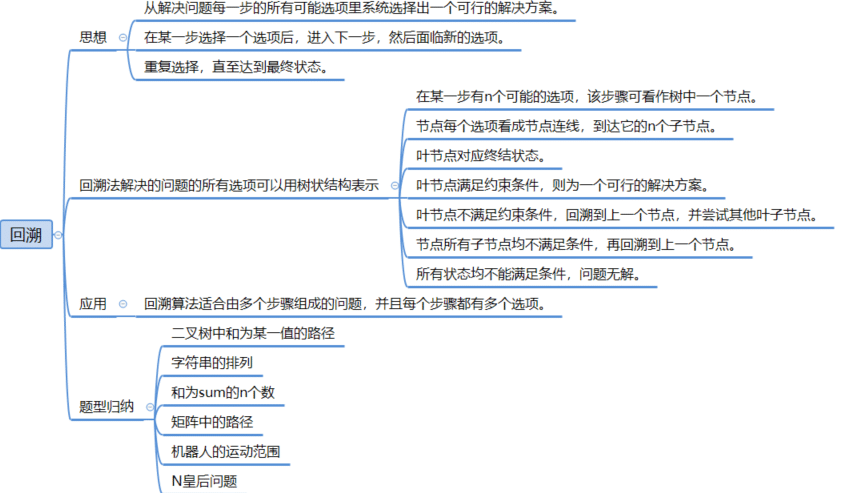
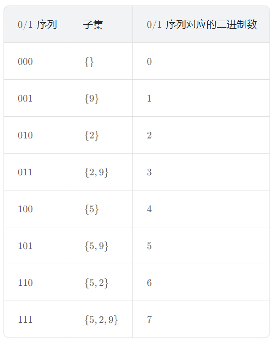

# 回溯算法



## 思想

采用试错的思想，在搜索尝试过程中寻找问题的解，当探索到某一步时，发现原先的选择并不满足求解条件，或者还需要满足更多求解条件时，就退回一步（回溯）重新选择，这种走不通就退回再走的技术称为「回溯法」，而满足回溯条件的某个状态的点称为「回溯点」。

回溯算法采用了一种 **「走不通就回退」** 的算法思想。

回溯算法通常用简单的递归方法来实现，在进行回溯过程中更可能会出现两种情况：

1. 找到一个可能存在的正确答案；
2. 在尝试了所有可能的分布方法之后宣布该问题没有答案。

## 回溯算法解题步骤

回溯算法的基本思想是：**以深度优先搜索的方式，根据产生子节点的条件约束，搜索问题的解。当发现当前节点已不满足求解条件时，就「回溯」返回，尝试其他的路径。**

在写回溯算法时具体步骤如下：

1. **定义问题解空间**：
   - 明确问题的解空间，即所有可能的解或候选解的集合。
   - 解空间树是回溯法求解过程中组织搜索的一个数据结构。树上的每一个节点表示问题求解过程中可能到达的一个中间状态，它包含有关搜索路径和求得中间解的全部信息。
2. **确定搜索策略：**
   - 选择合适的搜索策略，如**深度优先搜索或广度优先搜索。**在回溯法中，通常使用深度优先搜索。
   - 确定搜索的起始点和结束条件。
3. **设计递归函数：**
   - 设计一个或多个递归函数，用于遍历解空间树。
   - 递归函数应接收当前路径（当前解的部分表示）和当前搜索状态（如当前节点的索引）作为参数。
4. **剪枝优化：**
   - 在搜索过程中，如果发现当前搜索路径的某个节点不可能导出问题的解，则应及时停止对该节点的进一步搜索，即“剪枝”。
   - 剪枝可以显著提高算法的效率，减少不必要的搜索。
5. **回溯：**
   - 当搜索到某一节点时，如果已不满足求解条件，就“退回”一步（即回溯），尝试其他可能。
   - 回溯操作通常涉及撤销在当前节点所做的选择，并返回到其父节点或前一个状态。
6. **存储和输出结果：**
   - 当找到一个有效解时，将其存储起来（例如，添加到结果列表中）。
   - 在所有可能的解都被找到后，输出或返回结果。
7. **处理边界条件和特殊情况：**
   - 在编写回溯算法时，要注意处理边界条件和特殊情况。
   - 例如，当搜索到解空间的边界时，可能需要特殊处理；当某些选择无效或导致重复解时，需要跳过这些选择。

## 回溯算法的通用模板

```javascript
// 假设有一个目标函数用于判断某个路径是否满足条件  
function isValid(path, currentChoice) {  
    // 在这里编写你的逻辑，判断当前选择是否有效  
    // 返回true表示有效，返回false表示无效  
    // 例如，如果我们在解决组合问题，可能会检查路径是否已包含当前选择  
}  
  
/* 
 回溯函数 
 choices：表示当前层可以选择的选项列表。
 path：表示从根节点到当前节点的路径。默认为空数组。
 start：表示从哪个索引开始选择。默认为0，但在某些问题中，你可能希望从某个特定的索引开始以避免重复。
**/
function backtrack(choices, path = [], start = 0) {  
    //这是一个你需要定义的函数或逻辑，用于判断何时停止在当前路径上进一步探索
    // 如果满足某种条件（例如，路径长度达到目标长度），则记录或处理路径  
    if (满足结束条件(path)) {  
        // 例如，将路径添加到结果集中  
        results.push(path.slice()); // 注意：使用slice()创建路径的副本，避免直接修改原数组  
    }  

    //遍历当前层的所有选择
    for (let i = start; i < choices.length; i++) {  
        // 做选择  
        const currentChoice = choices[i];  
        // 判断当前选择是否有效  
        if (isValid(path, currentChoice)) {  
            // 将当前选择添加到路径中  
            path.push(currentChoice);  
            // 进入下一层决策树  
            backtrack(choices, path, i + 1); // 注意：在某些问题中，可能需要从i+1开始以避免重复  
            // 撤销选择,无论是否进入下一层，都需要撤销当前选择，以便在for循环的下一轮尝试其他选择。  
            path.pop();  
        }  
    }  
}  
  
// 初始化结果集和选择列表  
let results = [];  
let choices = [...]; // 填充你的选择列表  
  
// 调用回溯函数  
backtrack(choices);  
  
// 打印结果  
console.log(results);
```

**详细解释**：

1. **isValid函数**：这是一个辅助函数，用于判断某个选择在当前路径下是否有效。你需要根据问题的具体需求来实现这个函数。
2. **backtrack函数**：这是回溯算法的核心函数。
   - 参数：
     - `choices`：表示当前层可以选择的选项列表。
     - `path`：表示从根节点到当前节点的路径。默认为空数组。
     - `start`：表示从哪个索引开始选择。默认为0，但在某些问题中，你可能希望从某个特定的索引开始以避免重复。
   - **满足结束条件**：这是一个你需要定义的函数或逻辑，用于判断何时停止在当前路径上进一步探索。例如，在组合问题中，你可能希望当路径长度达到某个目标值时停止。
   - for循环：遍历当前层的所有选择。
     - **做选择**：将当前选择添加到路径中。
     - **判断有效性**：使用`isValid`函数检查当前选择是否有效。
     - **递归调用**：如果当前选择有效，则进入下一层决策树。注意，在某些问题中，你可能需要从`i+1`开始以避免重复选择。
     - **撤销选择**：无论是否进入下一层，都需要撤销当前选择，以便在for循环的下一轮尝试其他选择。
3. **结果集和选择列表**：在调用`backtrack`函数之前，你需要初始化结果集和选择列表。结果集用于存储所有满足条件的路径，选择列表包含所有可能的选项。
4. **调用回溯函数并打印结果**：最后，调用`backtrack`函数并打印结果集。


## 算法题

| 题号 | 标题                                                         | 标签                                   | 难度 |
| :--- | :----------------------------------------------------------- | :------------------------------------- | :--- |
| 0046 | [全排列](https://leetcode.cn/problems/permutations/)         | 数组、回溯                             | 中等 |
| 0047 | [全排列 II](https://leetcode.cn/problems/permutations-ii/)   | 数组、回溯                             | 中等 |
| 0051 | [N皇后](https://leetcode.cn/problems/n-queens/)              | 数组、回溯                             | 困难 |
| 0037 | [解数独](https://leetcode.cn/problems/sudoku-solver/)        | 数组、哈希表、回溯、矩阵               | 困难 |
| 0022 | [括号生成](https://leetcode.cn/problems/generate-parentheses/) | 字符串、动态规划、回溯                 | 中等 |
| 0017 | [电话号码的字母组合](https://leetcode.cn/problems/letter-combinations-of-a-phone-number/) | 哈希表、字符串、回溯                   | 中等 |
| 0784 | [字母大小写全排列](https://leetcode.cn/problems/letter-case-permutation/) | 位运算、字符串、回溯                   | 中等 |
| 0039 | [组合总和](https://leetcode.cn/problems/combination-sum/)    | 数组、回溯                             | 中等 |
| 0040 | [组合总和 II](https://leetcode.cn/problems/combination-sum-ii/) | 数组、回溯                             | 中等 |
| 0078 | [子集](https://leetcode.cn/problems/subsets/)                | 位运算、数组、回溯                     | 中等 |
| 0090 | [子集 II](https://leetcode.cn/problems/subsets-ii/)          | 位运算、数组、回溯                     | 中等 |
| 0473 | [火柴拼正方形](https://leetcode.cn/problems/matchsticks-to-square/) | 位运算、数组、动态规划、回溯、状态压缩 | 中等 |
| 1593 | [拆分字符串使唯一子字符串的数目最大](https://leetcode.cn/problems/split-a-string-into-the-max-number-of-unique-substrings/) | 哈希表、字符串、回溯                   | 中等 |
| 1079 | [活字印刷](https://leetcode.cn/problems/letter-tile-possibilities/) | 哈希表、字符串、回溯、计数             | 中等 |
| 0093 | [复原 IP 地址](https://leetcode.cn/problems/restore-ip-addresses/) | 字符串、回溯                           | 中等 |
| 0079 | [单词搜索](https://leetcode.cn/problems/word-search/)        | 数组、回溯、矩阵                       | 中等 |
| 0679 | [24 点游戏](https://leetcode.cn/problems/24-game/)           | 数组、数学、回溯                       | 困难 |

### [全排列](https://leetcode.cn/problems/permutations/)

#### 题目

给定一个不含重复数字的数组 `nums` ，返回其 *所有可能的全排列* 。你可以 **按任意顺序** 返回答案。

**示例 1：**

```
输入：nums = [1,2,3]
输出：[[1,2,3],[1,3,2],[2,1,3],[2,3,1],[3,1,2],[3,2,1]]
```

**示例 2：**

```
输入：nums = [0,1]
输出：[[0,1],[1,0]]
```

**示例 3：**

```
输入：nums = [1]
输出：[[1]]
```


#### 解法一：回溯

**思路**

以求解  [1,2,3]  的全排列为例，我们来讲解一下回溯算法的过程：

1. 选择以 1  为开头的全排列：
   1. 选择以 2 为中间数字的全排列，则最后数字只能选择 3 。即排列为： [1,2,3]。
   2. 撤销选择以 3  为最后数字的全排列，再撤销选择以 2  为中间数字的全排列。
   3. 然后选择以 3  为中间数字的全排列，则最后数字只能选择 2 ，即排列为 [1,3,2]。
2. 撤销选择以 2 为最后数字的全排列，再撤销选择以 3 为中间数字的全排列，再撤销选择以 1为开头的全排列。然后选择以 2 开头的全排列：
   1. 选择以 1  为中间数字的全排列，则最后数字只能选择 3 。即排列为： [2,1,3]。
   2. 撤销选择以 3 为最后数字的全排列，再撤销选择以 1 为中间数字的全排列。
   3. 然后选择以 3 为中间数字的全排列，则最后数字只能选择 1 ，即排列为： [2,3,1]。
3. 撤销选择以 1 为最后数字的全排列，再撤销选择以 3 为中间数字的全排列，再撤销选择以 2 为开头的全排列，选择以 3 开头的全排列：
   1. 选择以 1 为中间数字的全排列，则最后数字只能选择 2 。即排列为： [3,1,2]。
   2. 撤销选择以 2 为最后数字的全排列，再撤销选择以 1  为中间数字的全排列。
   3. 然后选择以 2  为中间数字的全排列，则最后数字只能选择 1 ，即排列为： [3,2,1]。

总结一下全排列的回溯过程：

- **按顺序枚举每一位上可能出现的数字，之前已经出现的数字在接下来要选择的数字中不能再次出现。**
- 对于每一位 进行如下几步：
  1. **选择元素**：从可选元素列表中选择一个之前没有出现过的元素。
  2. **递归搜索**：从选择的元素出发，一层层地递归搜索剩下位数，直到遇到边界条件时，不再向下搜索。
  3. **撤销选择**：一层层地撤销之前选择的元素，转而进行另一个分支的搜索。直到完全遍历完所有可能的路径。

对于上述决策过程，我们也可以用一棵决策树来表示：


从全排列的决策树中我们可以看出：

- 每一层中有一个或多个不同的节点，这些节点以及节点所连接的分支代表了「不同的选择」。
- 每一个节点代表了求解全排列问题的一个「状态」，这些状态是通过「不同的值」来表现的。
- 每向下递推一层就是在「可选元素列表」中选择一个「元素」加入到「当前状态」。
- 当一个决策分支探索完成之后，会逐层向上进行回溯。
- 每向上回溯一层，就是把所选择的「元素」从「当前状态」中移除，回退到没有选择该元素时的状态（或者说重置状态），从而进行其他分支的探索。


**实现**

```typescript
function permute(nums: number[]): number[][] {
  const results: number[][] = []; // 存储所有排列结果的数组  
  const used: boolean[] = new Array(nums.length).fill(false); // 标记数组，用于追踪元素是否被使用  

  // 回溯函数 
  function backtrack(path: number[]): void {
    // 如果路径长度等于 nums 长度，说明找到了一种排列，将其添加到结果中  
    if (path.length === nums.length) {
      results.push(path.slice()); // 使用 slice() 创建新数组，避免后续修改影响结果  
      return;
    }
	
    for (let i = 0; i < nums.length; i++) {
      // 如果当前元素没有被使用过  
      if (!used[i]) {
        // 将当前元素添加到路径中  
        path.push(nums[i]);
        // 标记当前元素为已使用  
        used[i] = true;
        // 继续回溯，尝试下一个位置,使用深度优先搜索查找未使用的数字，组成一个全排列
        backtrack(path);
        // 回溯到上一个状态：移除当前元素，并标记为未使用  
        path.pop();
        used[i] = false;
      }
    }
  }

  // 调用回溯函数，从空路径开始  
  backtrack([]);

  // 返回所有排列结果  
  return results;

}
```


**复杂度分析**

* 时间复杂度为 O(n!)：

  * 时间复杂度主要取决于递归的调用次数和每次递归所做的操作。因为对于长度为 `n` 的数组 `nums`，我们需要生成 `n!`（n 的阶乘）个排列。在回溯过程中，对于每个位置，我们都有 `n` 个选择（在第一次递归时），然后是 `n-1` 个选择（在第二次递归时），依此类推，直到没有选择。因此，总的递归调用次数是 `n!`。

  * 每次递归调用中，我们都需要遍历数组 `nums` 来查找未使用的元素，这个操作的时间复杂度是 O(n)。但是，由于递归树的深度是 n，并且每次递归都会遍历数组的一部分（从 n 到 1），所以我们可以将遍历的总时间视为 O(n * n!)。然而，考虑到主要的开销在于递归调用本身（即生成所有排列），我们通常只考虑 `n!` 的部分，因此时间复杂度为 O(n!)。

* 空间复杂度为 O(n * n!)：

  * 空间复杂度主要由递归调用栈和存储结果的数组决定。
    1. **递归调用栈**：在最坏的情况下（即生成所有排列时），递归调用栈的深度可以达到 n。因此，递归调用栈的空间复杂度是 O(n)。
    2. **存储结果的数组**：我们需要一个二维数组来存储所有的排列。在最坏的情况下，这个数组将包含 `n!` 个长度为 n 的一维数组。因此，存储结果的空间复杂度是 O(n * n!)。但是，由于 `n!` 是主导项，我们通常只考虑 `n!` 的部分。
    3. **临时变量和标记数组**：`path` 数组和 `used` 数组的大小都是 O(n)，但它们不随输入规模的增长而呈指数级增长，因此可以忽略不计。


#### 解法二：枚举

**思路**

记原序列中元素的总数为 n 。原序列中的每个数字的状态可能有两种，即「在子集中」和「不在子集中」。

我们用 1 表示「在子集中」，0  表示不在子集中，那么每一个子集可以对应一个长度为 n 的 0/1 序列，第 i 位表示  `a[i]` 是否在子集中。例如:`n=3`  ，`a={5,2,9}`  时：



可以发现 0/1  序列对应的二进制数正好从 0 到 `2^n - 1` 。

我们可以枚举 `mask∈[0,2^n−1]`， mask 的二进制表示是一个 0/1  序列，我们可以按照这个 0/1 序列在原集合当中取数。当我们枚举完所有 `2^n` 个 mask ，我们也就能构造出所有的子集。

 **解题思路**：

1. **二进制掩码**：为了生成一个数组的所有子集，我们可以使用一个二进制掩码（即一个整数）。这个掩码的每一位都对应于数组 `nums` 的一个元素。如果掩码的某一位是 1，那么 `nums` 中对应位置的元素就是当前子集的一部分。
2. **遍历所有掩码**：我们遍历从 0 到 `2^n - 1` 的所有整数，其中 n 是 `nums` 的长度。这些整数在二进制表示下可以看作是不同的掩码。例如，当 n=3 时，我们遍历 000, 001, 010, 011, 100, 101, 110, 111，分别对应于空集，只包含第一个元素，只包含第二个元素，包含第一和第二个元素，以此类推。
3. **生成子集**：对于每个掩码，我们遍历 `nums` 数组，并使用位运算来检查掩码的每一位。如果某一位是 1，则将对应的元素添加到当前子集中。
4. **收集结果**：将每个生成的子集添加到结果数组 `ans` 中，并在遍历完所有掩码后返回 `ans`。

这种方法利用了位运算和二进制掩码的概念，以高效的方式生成了数组的所有子集。

**实现**

```typescript
// 定义函数 subsets，它接受一个数组 nums 作为参数，并返回 nums 的所有子集  
var subsets = function(nums) {  
    // 初始化一个空数组 ans，用于存储所有子集  
    const ans = [];  
  
    // 获取 nums 数组的长度  
    const n = nums.length;  
  
    // 遍历从 0 到 2^n - 1 的所有整数（二进制表示），因为每个整数都可以看作是一个二进制掩码  
    // 这些二进制掩码用于选择 nums 中的元素以生成不同的子集  
    for (let mask = 0; mask < (1 << n); ++mask) {  
        // 初始化一个空数组 t，用于存储当前掩码对应的子集  
        const t = [];  
  
        // 遍历 nums 数组的每个元素  
        for (let i = 0; i < n; ++i) {  
            // 使用位运算来检查 mask 的第 i 位是否为 1  
            // 如果是 1，则 nums[i] 是当前子集的一部分  
            if (mask & (1 << i)) {  
                // 将 nums[i] 添加到当前子集 t 中  
                t.push(nums[i]);  
            }  
        }  
  
        // 将当前子集 t 添加到结果数组 ans 中  
        ans.push(t);  
    }  
  
    // 返回包含所有子集的数组 ans  
    return ans;  
};
```

> `1<<n` 和 `1<<i` 是位运算符在编程中的使用，特别是左移（`<<`）运算符。
>
> 在这些表达式中，`1` 是一个二进制数，具体表示为 `000...0001`（假设有足够的前导零以匹配 `n` 或 `i` 的位数）。
>
> 左移运算符 `<<` 将数字的所有位向左移动指定的位数。
>
> **原理**
>
> 1. **1 的二进制表示**：在二进制中，数字 `1` 通常表示为 `000...0001`，其中只有一个位是 `1`，其余都是 `0`。这个 `1` 通常位于最低位（也称为最右边）。
> 2. **左移运算符（`<<`）**：左移运算符将数字的所有位向左移动指定的位数。在左侧空出的位置用 `0` 填充。
>
> **示例**
>
> 假设我们有一个 8 位的二进制数，并且我们想要将 `1` 左移 `3` 位（即 `1<<3`）。
>
> 原始的 `1`（8 位表示）：00000001 
>
> 左移 3 位后：00100000
>
> 在这个例子中，`1` 被移动到了左侧 3 位的位置，并且在左侧空出的位置填充了 `0`。
>
> 对于 `1<<n` 或 `1<<i`，`n` 或 `i` 就是你要将 `1` 左移的位数。因此，`1<<n` 将产生一个二进制数，其中只有第 `n` 位（从右边开始计数，从 0 开始）是 `1`，其余都是 `0`。这个数在十进制下等于 (2^n)。
>
> 这种操作在编程中经常用于生成位掩码（bitmask）或执行位操作，特别是当你需要快速地设置、清除或检查某个特定位时。


### [全排列 II](https://leetcode.cn/problems/permutations-ii/)

#### 题目

给定一个可包含重复数字的序列 `nums` ，***按任意顺序*** 返回所有不重复的全排列。

 

**示例 1：**

```
输入：nums = [1,1,2]
输出：
[[1,1,2],
 [1,2,1],
 [2,1,1]]
```

**示例 2：**

```
输入：nums = [1,2,3]
输出：[[1,2,3],[1,3,2],[2,1,3],[2,3,1],[3,1,2],[3,2,1]]
```


#### 解法：回溯

为了解决这个问题，我们可以使用回溯算法（也称为深度优先搜索DFS）来生成所有可能的全排列。

但是，由于输入序列 `nums` 可能包含重复数字，我们需要一种方法来避免生成重复的全排列。

解题思路如下：

1. **排序**：首先，对数组 `nums` 进行排序。这一步不是必需的，但它可以帮助我们更容易地跳过重复的全排列。
2. **回溯**：使用回溯算法来生成所有可能的全排列。
3. **跳过重复的全排列**：在回溯过程中，当我们选择一个数字加入当前排列时，我们需要检查这个数字是否与它前面的数字（在同一个层级，而不是递归的父层级）相同，并且前一个数字没有被使用过。如果这两个条件都满足，我们就跳过这个数字，因为它会导致一个与前面已经生成的全排列相同的结果。

**实现**

```typescript
function permuteUnique(nums: number[]): number[][] {  
  // 排序数组，以便更容易地跳过重复的全排列  
  nums.sort((a, b) => a - b);  
  // 全排列结果
  const result: number[][] = [];
  // 标记 nums[i] 是否被使用
  const used: boolean[] = new Array(nums.length).fill(false);  
  // 从空数组开始回溯
  backtrack(nums, [], used, result);  
  
  return result;  
}  
  
function backtrack(nums: number[], path: number[], used: boolean[], result: number[][]) {  
  // 当当前排列的长度等于原始数组的长度时，将其添加到结果中  
  if (path.length === nums.length) {  
    result.push([...path]); // 注意这里需要使用展开运算符来复制数组  
    return;  
  }  
  // 每次回溯时，从第一个数字开始搜素未被使用的数字进行回溯
  for (let i = 0; i < nums.length; i++) {  
    // 跳过已经使用过的数字  
    if (used[i]) continue;  
  
    // 跳过重复的数字（只比较相邻的未使用过的数字）  
    if (i > 0 && nums[i] === nums[i - 1] && !used[i - 1]) continue;  
  
    // 选择当前数字  
    used[i] = true;  
    path.push(nums[i]);  
  
    // 递归生成下一个位置的全排列  
    backtrack(nums, path, used, result);  
  
    // 回溯，撤销选择  
    used[i] = false;  
    path.pop();  
  }  
}
```

