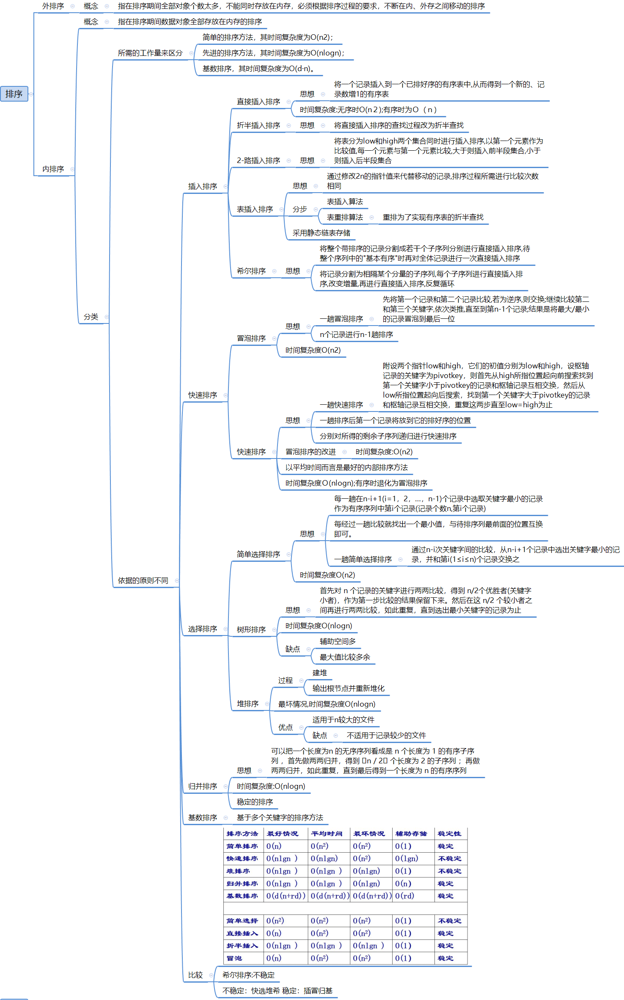
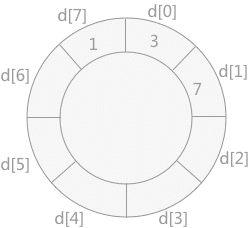
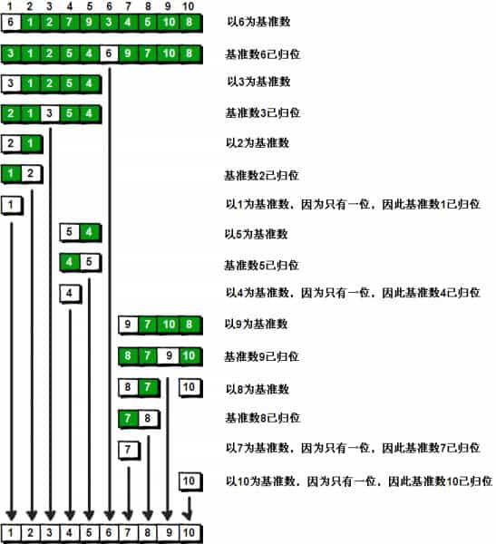
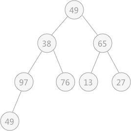
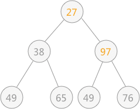
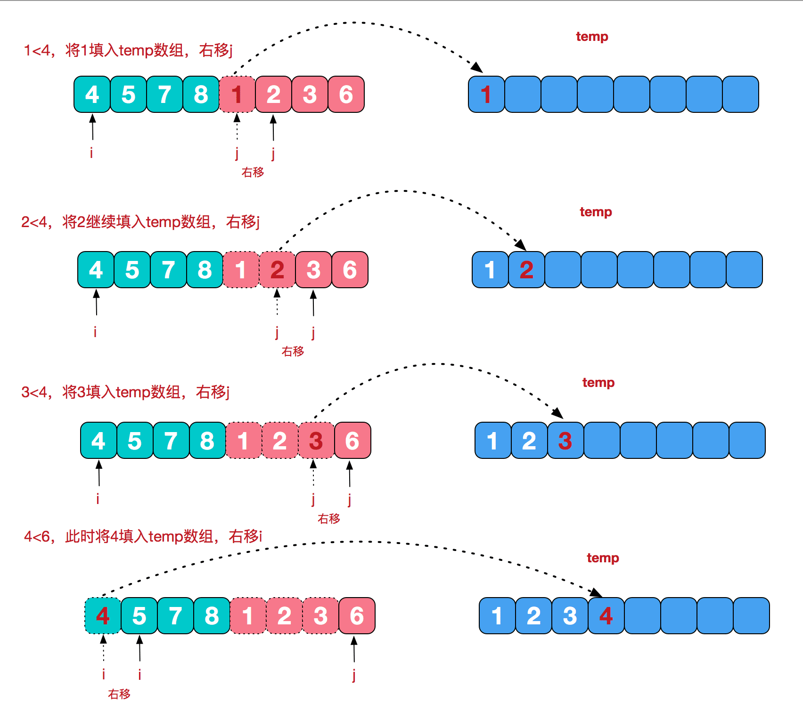
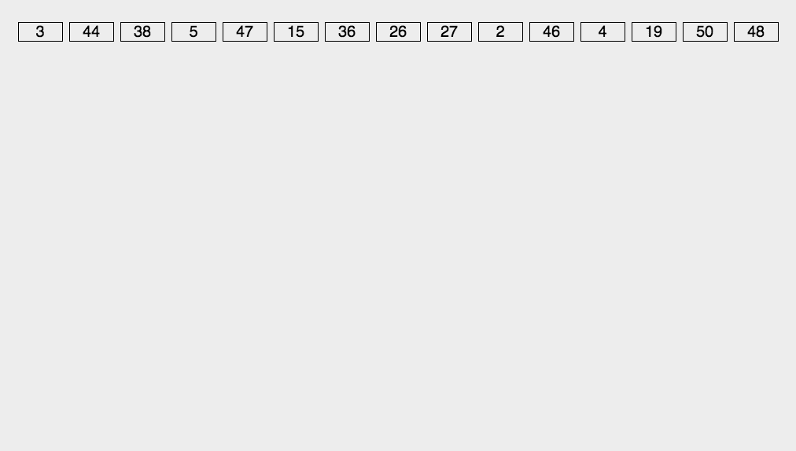

# 排序算法

## 分类





* 按照存储类型分类：
  * 内排序
  * 外排序
* 按照是否比较分类
  * 比较类排序：通过比较来决定元素间的相对次序，由于其时间复杂度不能突破O(nlogn)，因此也称为非线性时间比较类排序。
  * 非比较类排序：不通过比较来决定元素间的相对次序，它可以突破基于比较排序的时间下界，以线性时间运行，因此也称为线性时间非比较类排序。 

* 内排序分类

  * 插入排序

  * 快速排序

  * 选择排序

  * 归并排序

  * 基排序

## 概念

- **稳定**：如果a原本在b前面，而a=b，排序之后a仍然在b的前面。
- **不稳定**：如果a原本在b的前面，而a=b，排序之后 a 可能会出现在 b 的后面。
- **时间复杂度**：对排序数据的总的操作次数。反映当n变化时，操作次数呈现什么规律。
- **空间复杂度：**是指算法在计算机

内执行时所需存储空间的度量，它也是数据规模n的函数

---


## 插入排序


---


### 直接插入排序

思想：将左侧序列看成一个有序序列，每次将一个数字插入该有序序列，插入时，从有序序列最右侧开始比较，若比较的数较大，后移一位


实现：从小到大排序插入排序

```javascript
function insertionSort(arr) {  
    for (let i = 1; i < arr.length; i++) {  
        let key = arr[i];  
        let j = i - 1;  
  
        // Move elements of arr[0..i-1], that are  
        // greater than key, to one position ahead  
        // of their current position  
        while (j >= 0 && arr[j] > key) {  
            arr[j + 1] = arr[j];  
            j = j - 1;  
        }  
        arr[j + 1] = key;  
    }  
    return arr;  
}  
```

复杂度

* 时间复杂度 O(n2)
* 空间复杂度 O(1)

稳定性：稳定 

---


### 折半插入排序

思想：

1. 从数组的第二个元素开始（`i = 1`），将其作为关键字（`key`）。
2. 然后，在已排序的部分（从`arr[0]`到`arr[i-1]`）中使用二分查找来找到关键字应该插入的位置。
3. 一旦找到插入位置（`left`），我们就将大于关键字的元素向后移动一个位置，为关键字腾出空间，并将关键字插入到正确的位置。
4. 最后，当数组中的所有元素都已排序时，算法结束。

实现

```javascript
function binaryInsertionSort(arr) {  
    for (let i = 1; i < arr.length; i++) {  
        let key = arr[i];  
        let left = 0;  
        let right = i - 1;  
  
        // 使用二分查找找到key的插入位置  
        while (left <= right) {  
            let mid = Math.floor((left + right) / 2);  
            if (arr[mid] > key) {  
                right = mid - 1;  
            } else {  
                left = mid + 1;  
            }  
        }  
  
        // 将大于key的元素向后移动  
        for (let j = i - 1; j >= left; j--) {  
            arr[j + 1] = arr[j];  
        }  
  
        // 插入key  
        arr[left] = key;  
    }  
    return arr;  
}  
```

复杂度

* 时间复杂度O(n2) ： 折半查找仅仅减少关键字的比较次数，而记录移动次不变
* 空间复杂度 O(1)

稳定性：稳定

---


### 2-路插入排序

思想

* 2-路插入排序算法是在折半插入排序的基础上对其进行改进，减少其在排序过程中移动记录的次数从而提高效率。

* 具体实现思路为：另外设置一个同存储记录的数组大小相同的数组 d，将数组d 看作头尾相接的环状结构；将无序表中第一个记录添加进 d[0] 的位置上，然后从无序表中第二个记录开始，同 d[0] 作比较：如果该值比 d[0] 大，则添加到其右侧；反之添加到其左侧。

> 示例:
>
> 使用 2-路插入排序算法对无序表`{3,1,7,5,2,4,9,6}`排序的过程如下：
>
> 1. 将记录 3 添加到数组 d 中：
>
> 2. 然后将 1 插入到数组 d 中，如下所示：
>
> 3. 将记录 7 插入到数组 d 中，如下图所示：
>
> 4. 将记录 5 插入到数组 d 中，由于其比 7小，但是比 3 大，所以需要移动 7 的位置，然后将 5 插入，如下图所示：
>
> 5. 将记录 2 插入到数组 d 中，由于比 1大，比 3 小，所以需要移动 3、7、5 的位置，然后将 2 插入，如下图所示：
>
> 6. 将记录 4 插入到数组 d 中，需要移动 5 和 7 的位置，如下图所示：
>
> 7. 将记录 9 插入到数组 d 中，如下图所示：
>
> 8. 将记录 6 插入到数组 d 中，如下图所示：
>
> 9. 最终存储在原数组时，从 d[7] 开始依次存储。

实现

```javascript
function twoWayInsertionSort(array) {  
    if (array.length <= 1) return array; // 如果数组为空或只有一个元素，直接返回  
  
    let sorted = [array[0]]; // 已排序部分的数组  
    let maxIndex = 0; // 已排序部分的最大索引（同时也是下一个插入位置）  
  
    for (let i = 1; i < array.length; i++) {  
        let value = array[i];  
  
        // 如果当前值小于已排序部分的最小值  
        if (value < sorted[0]) {  
            // 插入到已排序部分的最前面  
            sorted.unshift(value);  
        } else if (value > sorted[maxIndex]) {  
            // 插入到已排序部分的最后面  
            sorted.push(value);  
            maxIndex++; // 更新最大索引  
        } else {  
            // 在已排序部分中找到合适的位置插入  
            let j = maxIndex; // 从已排序部分的末尾开始向前搜索  
            while (j > 0 && sorted[j - 1] > value) {  
                sorted[j] = sorted[j - 1]; // 向后移动元素  
                j--;  
            }  
            // 插入元素  
            sorted[j] = value;  
            // 如果插入位置不是末尾，则更新最大索引  
            if (j >= maxIndex) {  
                maxIndex++;  
            }  
        }  
    }  
  
    return sorted;  
}  
```

复杂度

* 时间复杂度 O(n2)：2-路插入排序相比于折半插入排序，只是减少了移动记录的次数，没有根本上避免

* 空间复杂度 O(n)

稳定性：

---


### 表插入排序

表插入排序则是在排序过程中不移动记录，只改变存储结构，使用一张表指针记录数字 index 的排序顺序的过程；

具体做法：

1. 使用静态链表类型作为待排记录序列的存储结构，并且设置数组下标为0的分量为头结点。
2. 将静态链表中数组下标为1的分量和表头节点构成一个循环链表，然后依次将下标为2到n的分量按记录的关键字非递减有序插入到循环链表中。

表插入排序的基本操作还是将一个记录插入到已排好序的有序表中；

表插入排序和直接插入排序相比，不同之处是仅以修改2n次指针代替记录的移动，排序过程中所需进行的关键字之间的比较次数相同，所以表插入排序的时间复杂度是O(n);

表插入排序的结果只是求得一个有序链表（静态），则只能对进行顺序查找，而不能进行随机查找，如果要实现折半之类的查找，则需要对记录进行重排。

**过程分析：**

> 现排序 [49，38 ，65，97，76，13，27，49] 为例，next 指针指向当前数字下一个排序数字的下标。
>
> 1. 初始状态：
>
> |           | 0      | 1    | 2    | 3    | 4    | 5    | 6    | 7    | 8    |
> | --------- | ------ | ---- | ---- | ---- | ---- | ---- | ---- | ---- | ---- |
> |           | MAXINT | 49   | 38   | 65   | 97   | 76   | 13   | 27   | 49^  |
> | next 指针 | 1      | 0    | -    | -    | -    | -    | -    | -    | -    |
>
> 2. `i=2`：
>
> |           | 0      | 1    | 2    | 3    | 4    | 5    | 6    | 7    | 8    |
> | --------- | ------ | ---- | ---- | ---- | ---- | ---- | ---- | ---- | ---- |
> |           | MAXINT | 49   | 38   | 65   | 97   | 76   | 13   | 27   | 49^  |
> | next 指针 | 2      | 0    | 1    | -    | -    | -    | -    | -    | -    |
>
> 3. `i=3`:
>
> |           | 0      | 1    | 2    | 3    | 4    | 5    | 6    | 7    | 8    |
> | --------- | ------ | ---- | ---- | ---- | ---- | ---- | ---- | ---- | ---- |
> |           | MAXINT | 49   | 38   | 65   | 97   | 76   | 13   | 27   | 49^  |
> | next 指针 | 2      | 3    | 1    | 0    | -    | -    | -    | -    | -    |
>
> 4. `i=4`:
>
> |           | 0      | 1    | 2    | 3    | 4    | 5    | 6    | 7    | 8    |
> | --------- | ------ | ---- | ---- | ---- | ---- | ---- | ---- | ---- | ---- |
> |           | MAXINT | 49   | 38   | 65   | 97   | 76   | 13   | 27   | 49^  |
> | next 指针 | 2      | 3    | 1    | 4    | 0    | -    | -    | -    | -    |
>
> 5. `i=5`:
>
> |           | 0      | 1    | 2    | 3    | 4    | 5    | 6    | 7    | 8    |
> | --------- | ------ | ---- | ---- | ---- | ---- | ---- | ---- | ---- | ---- |
> |           | MAXINT | 49   | 38   | 65   | 97   | 76   | 13   | 27   | 49^  |
> | next 指针 | 2      | 3    | 1    | 5    | 0    | 4    | -    | -    | -    |
>
> 6. `i=6`:
>
> |           | 0      | 1    | 2    | 3    | 4    | 5    | 6    | 7    | 8    |
> | --------- | ------ | ---- | ---- | ---- | ---- | ---- | ---- | ---- | ---- |
> |           | MAXINT | 49   | 38   | 65   | 97   | 76   | 13   | 27   | 49^  |
> | next 指针 | 6      | 3    | 1    | 5    | 0    | 4    | 2    | -    | -    |
>
> 7. `i=7`:
>
> |           | 0      | 1    | 2    | 3    | 4    | 5    | 6    | 7    | 8    |
> | --------- | ------ | ---- | ---- | ---- | ---- | ---- | ---- | ---- | ---- |
> |           | MAXINT | 49   | 38   | 65   | 97   | 76   | 13   | 27   | 49^  |
> | next 指针 | 6      | 3    | 1    | 5    | 0    | 4    | 7    | 2    | -    |
>
> 8. `i=8`:
>
> |           | 0      | 1    | 2    | 3    | 4    | 5    | 6    | 7    | 8    |
> | --------- | ------ | ---- | ---- | ---- | ---- | ---- | ---- | ---- | ---- |
> |           | MAXINT | 49   | 38   | 65   | 97   | 76   | 13   | 27   | 49^  |
> | next 指针 | 6      | 8    | 1    | 5    | 0    | 4    | 7    | 2    | 3    |


**实现思路：**

1. **初始化**：创建一个额外的数组（表），用于记录最小值和最大值的位置。

2. **外层循环**：遍历整个待排序数组，从第二个元素开始，因为我们假设第一个元素已经排序。

3. **内层循环**：
   - 如果当前元素小于表中的最小值，更新最小值的位置，并在表中插入当前元素。
   - 如果当前元素大于表中的最大值，更新最大值的位置，并在表中插入当前元素。
   - 如果当前元素位于最小值和最大值之间，从最大值位置向前遍历表，找到合适的插入位置，并插入当前元素。

4. **更新表**：根据当前元素的位置，更新表中的最小值和最大值。

5. **返回结果**：排序完成后，返回排序后的数组。

**JavaScript 实现代码：**

```javascript
function tableInsertionSort(array) {
  // 已知数组长度
  const n = array.length;

  // 初始化表（next 指针数组），假设第一个元素最小且最大， 
  let table = [0];

  // 外层循环从第二个元素开始
  for (let i = 1; i < n; i++) {
    let current = array[i];
    // 如果当前元素小于表中的最小值
    if (current < array[table[0]]) {
      // 将最小值位置更新为当前元素索引
      table.unshift(i);
    } else {
      // 从最大值位置向前遍历表
      let j = table.length - 1;
      // 找到当前元素应该插入的位置
      while (j >= 1 && array[table[j]] > current) {
        // 将较大的元素的索引向右移动
        table[j + 1] = table[j];
        j--;
      }
      // 插入当前元素
      table[j + 1] = i;
    }
  }

  // 使用表来重构排序后的数组
  let sortedArray = array.slice(); // 创建数组副本
  for (let i = 0; i < n; i++) {
    sortedArray[i] = array[table[i]];
  }

  return sortedArray;
}

// 示例
const unsortedArray = [3, 1, 7, 5, 2, 4, 9, 6];
const sortedArray = tableInsertionSort(unsortedArray);
console.log(sortedArray); // 输出: [1, 2, 3, 4, 5, 6, 7, 9]
```

**详细注释：**

- `table` 数组用于记录排序过程中的最小值和最大值的位置。
- 在外层循环中，我们从数组的第二个元素开始，因为我们假设第一个元素是已经排序的。
- 如果当前元素小于表中的最小值，我们更新最小值的位置。
- 如果当前元素大于表中的最大值，我们不需要做任何操作，因为表会自动扩展。
- 如果当前元素位于最小值和最大值之间，我们从最大值位置向前遍历表，找到合适的插入位置。
- 最后，我们使用表来重构排序后的数组，而不是直接在原数组上进行操作，这样可以避免原数组的值被覆盖。


---


### 希尔排序

希尔排序（缩小增量排序）属于插入排序

**思想**

1. 先将整体待排序记录分割成若干个子序列分别进行直接插入排序
2. 选择一个增量序列 t1,t2,t3....tk,其中t1>t2>...，tk=1；
3. 按增量序列个数k，对序列进行 k 趟排序；
4. 每趟排序，根据对应的增量ti，将待排序列分割成若干长度为 m 的子序列，分别对各子表进行直接插入排序;
5. 仅增量因子为 1 时，整个序列作为一个表来处理，表长度即为整个序列的长度;

**示例**

> * 示例1：
>
> 
>
> * 示例2：
>
>   

**实现**

```javascript
//一趟希尔排序
function ShellInsert(array,gap) {								//数组分为 gap+1 ... array.length 组
	for(let i=gap+1; i<array.length; i++) {						//从增量后一位开始作为插入值
		let target = array[i]								
		for(j=i-gap; array[j]>array[target] && j>0; j-=gap) {	//按组插入排序
			array[j+gap] = array[j]								//记录后移，查找插入位置
		}
		array[j] = target 										//目标插入相应位置
	}
}

//按照增量 gap 进行排序
function ShellSort(array) {
	for(let gap=Math.floor(array.length/2); gap>0; gap=Math.floor(gap/2)) { //gap 趟希尔排序
		ShellInsert(array,gap)
	}
	return array
}
```

复杂度

* 时间复杂度 O(nlogn)
* 空间复杂度

----


## 快速排序


### 冒泡排序

思想

* 一趟冒泡排序：先将第一个记录和第二个记录比较,若为逆序,则交换;继续比较第二和第三个关键字,依次类推,直至到第n-1个记录;
  结果是将最大/最小的记录冒泡到最后一位
* n个记录一共执行 n-1 趟冒泡排序

示例


实现

* 基本实现

```javascript
function BubbleSort(array) {
	for(let i=array.length-1;  i>0; i--) {							// 进行 n-1 趟冒泡排序
		for(let j=0; j<i; j++) {									//	一趟冒泡排序
			if(array[j] < array[j+1]) {								//	逆序，转换位置
				[ array[j+1], array[j] ] = [ array[j], array[j+1] ]
			}
		}
	}
	return array
}
```

* 优化：当一次循环没有发生冒泡，说明已经排序完成，停止循环

```javascript
function BubbleSort(array) {
	for(let i=array.length; i>0; i--) {
		let complete=true												//假设完成一趟排序
		for(let j=0; j<i; j++) {
			if(array[j] < array[j+1]) {
				[ array[j+1], array[j] ] = [ array[j], array[j+1] ]		//发生冒泡，表示该趟未排序
				complete=false											
			}
			if(complete) 												//未发生过冒泡，表示该趟有序
				break
		}
	}
	return array
}
```

复杂度

* 时间复杂度 O(n2)
* 空间复杂度O(1)

稳定性

* 稳定

### 快速排序

**思想**

* 通过一趟排序将要排序的数据分割成独立的两部分，其中一部分的所有数据比另一部分的所有数据要小，再按这种方法对这两部分数据分别进行快速排序，整个排序过程可以递归进行，使整个数据变成有序序列
* 步骤：
  * 选择一个基准元素`target`（一般选择第一个数）
  * 将比`target`小的元素移动到数组左边，比`target`大的元素移动到数组右边
  * 分别对`target`左侧和右侧的元素进行快速排序
* 快速排序也利用了分治的思想（将问题分解成一些小问题递归求解）

**示例**

* 下面是对序列`6、1、2、7、9、3、4、5、10、8`排序的过程：

  

  

**实现**

#### **实现：递归**

* 单独开辟两个存储空间`left`和`right`来存储每次递归比`target`小和大的序列
* 每次递归直接返回`left、target、right`拼接后的数组
* 浪费大量存储空间，写法简单

```javascript
function quickSort(array) {
      if (array.length < 2) {							//	个数小于2时递归结束
        return array;
      }
      const target = array[0]							//	以每次分割前第一个数组作为分割点
      const left = []
      const right = []
      for (let i = 1; i < array.length; i++) {			// 遍历数组分割数组
        if (array[i] < target) {
          left.push(array[i])							// 小于分割点的数组
        } else {
          right.push(array[i])							// 大于分割点的数组
        }
      }
      return quickSort(left).concat([target], quickSort(right))	// 递归分割左右两边数组
}
```

#### **实现：递归+双指针**

* 附设两个指针 `left` 和 `right`，它们的初值分别为 数组第一个 和 最后一个值，设枢轴记录的关键字为 target
* 首先从 `left` 所指位置起向前搜索找到第一个关键字大于 target 的记录和 target 记录互相交换
* 然后从 `right` 所指位置起向后搜索，找到第一个关键字小于 target 的记录和 target 记录互相交换
* 重复这两步直至 `left` = `right`为止, 此时左侧的值全部小于`target`，右侧的值全部小于`target`，将`target`放到该位置

```javascript
   function quickSort(array, start, end) {
      if (end - start < 1) { 					// 递归结束条件
        return
      }
      const target = array[start]				
      let l = start								// 起始 start 为 0
      let r = end								// 起始 end 为 0
      
      while (l < r) {							// l往前搜索，r往后搜索；当 l=r 表明数组遍历完成
        while (l < r && array[r] >= target) {	// 从右侧往左侧查找小于 target 的值
          r--						
        }
        array[l] = array[r]					 	// 将右侧小于 target 的值和 target 值交换
        while (l < r && array[l] < target) {	//从左侧往右侧查找大于 target 的值
          l++
        }
         array[r] = array[l]					  // 将左侧大于 target 的值和 target 值交换
      }
      array[l] = target								// 当 l=r 时的位置为 target 的位置,完成一趟快排
      quickSort(array, start, l - 1)				// 快速排序左侧数据
      quickSort(array, l + 1, end)					// 快速排序右侧数据
      return array
    }
```

**复杂度**

* 时间复杂度：平均`O(nlogn)`，最坏`O(n2)`，实际上大多数情况下小于`O(nlogn)`

* 空间复杂度:`O(logn)`（递归调用消耗）

**稳定性**

* 不稳定


---


## 选择排序


### 简单选择排序

**思想**

* 一趟选择：从数组中 n-i+1 ( n 为数组长度 )个记录中选择一个最小/最大的数与第 i 个数据交换位置
* 长度为 n 数组循环选择 n-1 趟

**示例**


```javascript
function SelectSort(array) {								// 从小到大选择排序
	for(let i=0; i<array.length-1; i++) {					// n-1 趟循环选择
		let min=i											// 选择最小值下标
		for(let j=i+1; j<array.length; j++) {				// 遍历查找最小值下标
			if(array[j] < array[min]) {
				min = j										//	记录最小值下标
			}
		}
		[ array[min], array[j] ] =  [ array[j], array[min] ] // 交换最小值
	}
	return array
}
```

**复杂度**

* 时间复杂度 O(n2)
* 空间复杂度 O(1)

**稳定性**

* 不稳定

### 树形选择排序

**思想**

* 树形选择排序（又称“锦标赛排序”），是一种按照锦标赛的思想进行选择排序的方法
* 即所有记录采取两两分组，筛选出较小（较大）的值；
* 然后从筛选出的较小（较大）值中再两两分组选出更小（更大）值，依次类推，直到最后选出一个最小（最大）值。
* 同样可以采用此方式筛选出次小（次大）值等
* 整个排序的过程，可以用一棵具有 n 个叶子结点的完全二叉树表示

**示例**

> 对无序表`{49，38，65，97，76，13，27，49}`采用树形选择的方式排序，过程如下：
>
> 1. 首先将无序表中的记录采用两两分组，筛选出各组中的较小值（如图1 中的（a）过程）；
>
> 2. 然后将筛选出的较小值两两分组，筛选出更小的值，以此类推（如图 1 中的（b）（c）过程）
>
> 3. 最终整棵树的根结点中的关键字即为最小关键字：
>
>    
>    																	图 1 树形选择排序（一）
>
> 4. 筛选出关键字 13 之后，继续重复此方式找到剩余记录中的最小值，此时由于关键字 13 已经筛选完成，需要将关键字 13 改为“最大值”，继续重复此过程，如图 2 所示：
>
>    
>    															图 2 树形选择排序（二)
>
>    
>
> 5. 通过不断地重复此过程，可依次筛选出从小到大的所有关键字


**复杂度**

* 时间复杂度 O(nlogn)
* 空间复杂度

----


## 堆排序

> 详细参考：[堆 | Sewen 博客 (sewar-x.github.io)](https://sewar-x.github.io/myblog/article/算法和数据结构/数据结构/堆.html)

堆的含义：在含有 n 个元素的序列中，如果序列中的元素满足下面其中一种关系时，此序列可以称之为堆。

* **小顶堆：**`k[i]` ≤ `k[2i]` 且`k[i]`≤ `k[2i+1]`（在 n 个记录的范围内，第 i 个关键字的值小于第 `2i` 个关键字，同时也小于第 `2i+1` 个关键字）

* **大顶堆：**`k[i]` ≥ `k[2i]` 且 `k[i]` ≥`k[2i+1]`（在 n 个记录的范围内，第 i 个关键字的值大于第 `2i` 个关键字，同时也大于第 `2i+1` 个关键字）


对于堆的定义也可以使用完全二叉树来解释，因为在完全二叉树中第 i 个结点的左孩子恰好是第 2i 个结点，右孩子恰好是 2i+1 个结点。如果该序列可以被称为堆，则使用该序列构建的完全二叉树中，每个根结点的值都必须不小于（或者不大于）左右孩子结点的值。

**示例：**

以无序表`{49，38，65，97，76，13，27，49}`来讲，其对应的堆用完全二叉树来表示为：


						图 3 无序表对应的堆

提示：堆用完全二叉树表示时，其表示方法不唯一，但是可以确定的是树的根结点要么是无序表中的最小值，要么是最大值。

堆排序: 通过将无序表转化为堆，可以直接找到表中最大值或者最小值，然后将其提取出来，令剩余的记录再重建一个堆，取出次大值或者次小值，如此反复执行就可以得到一个有序序列，此过程为堆排序。

**堆排序:**

> 将无序序列转化为一个堆
>
> * 假设无序表`{49，38，65，97，76，13，27，49}`初步建立的完全二叉树，如下图所示：
>
> 
>
> * 在对上图做筛选工作时，规律是从底层结点开始，一直筛选到根结点。
> * 对于具有 n 个结点的完全二叉树，筛选工作开始的结点为第 ⌊n/2⌋个结点（此结点后序都是叶子结点，无需筛选）
> * 所以，对于有 9 个结点的完全二叉树，筛选工作从第 4 个结点 97 开始，由于 97 > 49 ,所以需要相互交换，交换后如下图所示：
>
> 
>
> * 然后再筛选第 3 个结点 65 ，由于 65 比左右孩子结点都大，则选择一个最小的同 65 进行交换，交换后的结果为：
>
> 
>
> * 然后筛选第 2 个结点，由于其符合要求，所以不用筛选；最后筛选根结点 49 ，同 13 进行交换，交换后的结果为：
>
> 
>
> * 交换后，发现破坏了其右子树堆的结构，所以还需要调整，最终调整后的结果为：
>
> 
>
> 在输出堆顶元素之后（完全二叉树的树根结点），调整剩余元素构建一个新的堆
>
> * 图 3 所示为一个完全二叉树，若去除堆顶元素，即删除二叉树的树根结点，此时用二叉树中最后一个结点 97 代替,如图所示：
>
> 
>
> * 此时由于结点 97 比左右孩子结点的值都大，破坏了堆的结构，所以需要进行调整：首先以 堆顶元素 97 同左右子树比较，同值最小的结点交换位置，即 27 和 97 交换位置：
>
> 
>
> * 由于替代之后破坏了根结点右子树的堆结构，所以需要进行和上述一样的调整，即令 97 同 49 进行交换位置：
>
> 
>
> * 通过上述的调整，之前被破坏的堆结构又重新建立。从根结点到叶子结点的整个调整的过程，被称为“筛选“

动态图演示(创建大顶堆，从小到大排序)


**实现**

### **递归实现**

```javascript
//从小到大堆排序
function heapSort(array) {
	createMaxHeap(array)									//	创建一个大顶堆
	for(let i=array.length-1; i>0; i--) {					//  遍历调整堆
		[ array[i], array[0] ]  = [ array[0], array[i] ]	// 	输出最大元素
		adjustHeap(array,0,i)								//	调整剩余堆，第一个元素调整到对应位置
	}
	return array
}

//创建大顶堆
function createHeap(array) {
	let start = array.length/2								// 数组中间值作为初始堆顶元素					
	for(let i=start; i>=0; i--) {							// 调整堆的过程就是创建大顶堆的过程
		adjustHeap(array, i, array.length)								// 调整第i个元素为大顶堆
	}
}

//将 target 元素进行下沉，孩子节点有比 target 元素大的就下沉
function adjustHeap(array, target,len) {
	let left = 2 * targer + 1,								// target 左子节点 
		rigth = 2 * target + 2,								// targer 右子节点	
		max = target										// 假设当前堆顶 target 为最大元素
	if(left < len && array[left] > array[max]) {			// 左子节比堆顶值大，设定左子节点为最大值
		max = left
	}
	if(right < len && array[right] > array[max]) {			// 右子节点比堆顶值大，设定右子节点为最大值
		max = right
	} 
	if(max != i) {											//	最大值不是堆顶
		[ array[max], array[i] ] = [ array[i], array[max] ] // 交换堆顶和最大值
		adjustHeap(array, max,len)
	}
}
```

### **非递归实现**

```javascript
//从小到大堆排序
function heapSort(array) {
	createMaxHeap(array)									//	创建一个大顶堆
	for(let i=array.length-1; i>0; i--) {					//  遍历调整堆
		[ array[i], array[0] ]  = [ array[0], array[i] ]	// 	输出最大元素
		adjustHeap(array,0,i)								//	调整剩余堆，第一个元素调整到对应位置
	}
	return array
}

//创建大顶堆
function createHeap(array) {
	let start = array.length/2								// 数组中间值作为初始堆顶元素					
	for(let i=start; i>=0; i--) {							// 调整堆的过程就是创建大顶堆的过程
		adjustHeap(array, i, array.length)					// 调整第i个元素为大顶堆
	}
}

// 将第target个元素进行下沉，孩子节点有比他大的就下沉
// 已知 array[target ... len] 中记录的关键字除了 array[target] 之外均满足堆的定义，本函数调整 array[target]
// 的关键字，使 array[target ... len]成为一个大顶堆
function adjustHeap(array, target, len) {
      for (let i = 2 * target + 1; i < len; i = 2 * i + 1) { //沿着key较大的孩子节点向下筛选
        if (i + 1 < len && array[i + 1] > array[i]) {    	 // 找到孩子节点中最大的
          i = i + 1;
        }
        if (array[i] > array[target]) {						 // 当子节点大于目标节点，交换位置并将子节点作为新目标
          [array[i], array[target]] = [array[target], array[i]]
          target = i;
        } else {											//	否则推出本次查找
          break;
        }
      }
}
```

**复杂度**

* 时间复杂度  O(nlogn)
* 空间复杂度  O(1)

**稳定性**

* 不稳定

---


## 归并排序

**思想**

归并是采用分治法（`Divide and Conquer`）的一个非常典型的应用。

分治法将问题分成一些小的问题然后递归求解，而治的阶段则将分的阶段得到的各答案"修补"在一起，即分而治之。

1. 将已有序的子序列合并，得到完全有序的序列；
2. 即先使每个子序列有序，再使子序列段间有序；
3. 若将两个有序表合并成一个有序表，称为二路归并；


**步骤**

1. 分割：
  - 将数组从中点进行分割，分为左、右两个数组；
  - 递归分割左、右数组，直到数组长度小于`2`；
2. 合并：
  * 如果需要合并，那么左右两数组已经有序了；
  * 创建一个临时存储数组`temp`，比较两数组第一个元素，将较小的元素加入临时数组；
  * 若左右数组有一个为空，那么此时另一个数组一定大于`temp`中的所有元素，直接将其所有元素加入`temp`；

**示例**

> 假设数组 [8,4,5,7,1,3,6,2]
>
> 1. 分割过程：
>
> 
>
> 2. 合并过程：如上图中的最后一次合并，要将 [4,5,7,8] 和 [1,2,3,6] 两个已经有序的子序列，合并为最终序列[1,2,3,4,5,6,7,8]，来看下实现步骤
>
> 

**实现**

### 实现：递归

分割数组时直接将数组分割为两个数组，合并时直接合并数组。

优点：思路简单，写法简单

缺点：空间复杂度略高，需要复制多个数组

```javascript
function mergeSort(array) {
	if(array.length < 2) 							//	数组个数小于2不能再分割，返回数组
		return	array 
	let mid = Math.floor(array.length/2)			//	以数组中间数据作为分割点
	let left = array.slice(0, mid)					//	分割点左侧数组
	let right = array.slice(mid, array.length)		//	分割点右侧数组
	return merge(mergeSort(left), mergeSort(right))	//	递归分割数组后递归合并数组
}
//从小到大合并数据
function merge(left,right) {						
	let temp = []									//	设定空数组保存合并数组
	while(left.length && right.length ) {			//	左右两侧有数组都不为空表示未合并完成
		if(left[0]<right[0]) {						//	比较数组第一个数据大小
			temp.push( left.shift() )				//	移出较小数据放入新数组
		}else {
			temp.push( right.shift() )
		}
	}
	while(left.length) {							//	未合并完成，剩余数据放入新数组
		temp.push( left.shift() )
	}
	while(right.length) {							//	未合并完成，剩余数据放入新数组
		temp.push( right.shift() )
	}
	return temp
}
```


### **实现：递归+双指针**

记录数组的索引，使用`left、right`两个索引来限定当前分割的数组。

优点：空间复杂度低，只需一个`temp`存储空间，不需要拷贝数组

缺点：写法复杂

```javascript
    function mergeSort(array, left, right, temp) {
      if (left < right) {
        const mid = Math.floor((left + right) / 2);
        mergeSort(array, left, mid, temp) // 递归分割左侧数组
        mergeSort(array, mid + 1, right, temp) // 递归分割右侧数组
        merge(array, left, right, temp); // 合并左侧和右侧数组
      }
      return array;
    }

    function merge(array, left, right, temp) {
      const mid = Math.floor((left + right) / 2);
      let leftIndex = left;
      let rightIndex = mid + 1;
      let tempIndex = 0;
      while (leftIndex <= mid && rightIndex <= right) {
        if (array[leftIndex] < array[rightIndex]) {
          temp[tempIndex++] = array[leftIndex++]
        } else {
          temp[tempIndex++] = array[rightIndex++]
        }
      }
      while (leftIndex <= mid) {
        temp[tempIndex++] = array[leftIndex++]
      }
      while (rightIndex <= right) {
        temp[tempIndex++] = array[rightIndex++]
      }
      tempIndex = 0; // 重置
      for (let i = left; i <= right; i++) {
        array[i] = temp[tempIndex++];
      }
    }
```

**复杂度**

* 时间复杂度：`O(nlogn)`

* 空间复杂度:`O(n)`

**稳定性**

* 稳定

---


## 桶排序

**桶排序（Bucket Sort）** 是一种分配式排序算法，它将待排序的数据分到有限数量的桶子里。每个桶子再个别排序（有可能再使用别的排序算法或是以递归方式继续使用桶排序进行排序）。

桶排序是鸽巢排序的一种归纳结果。当要被排序的数组内的数值是均匀分配的时候，桶排序使用线性时间（Θ(n)）。但桶排序并不是比较排序，它不受到 O(n log n) 下限的影响。

以下是桶排序的基本步骤：

1. **设置桶**：根据待排序数据的范围，设置若干个桶，并初始化桶（可以将桶看作是一个数组或者链表等数据结构）。
2. **数据分配**：遍历待排序数据，将数据放入对应的桶中。
3. **对每个桶中的数据进行排序**：可以使用其他排序算法对每个桶中的数据进行排序，如插入排序、快速排序等。
4. **合并数据**：按照桶的顺序（通常是从桶的索引从小到大），将各个桶中的数据合并起来，形成有序序列。

桶排序的优点在于，当数据分布均匀时，它的时间复杂度可以达到线性。然而，当数据分布极不均匀时，桶排序可能变得低效，因为可能需要大量的桶来存储数据，导致空间复杂度增加，并且在合并数据时的效率也会降低。此外，桶排序不是一种稳定的排序算法，因为相同的元素在排序过程中可能会被分配到不同的桶中，导致它们的相对顺序发生变化。

~桶排序是一种排序的思想，其实现包括计数排序和基数排序两种，冒泡排序、选择排序、插入排序、归并排序、快速排序和堆排序都是基于比较的排序，而桶排序提出了一种新的思路，即基于数据状态的排序。

"桶"是一种容器，这个容器可以用多种数据结构实现，包括数组、队列或者栈

---


### 计数排序

**概念**

* 计数排序不是基于比较的排序算法，其核心在于将输入的数据值转化为键存储在额外开辟的数组空间中。 
* 作为一种线性时间复杂度的排序，计数排序要求输入的数据必须是有确定范围的整数

**思想**

1. 找出待排序的数组中最大和最小的元素；
2. 统计数组中每个值为 i 的元素出现的次数，存入数组C的第 i 项；
3. 对所有的计数累加（从C中的第一个元素开始，每一项和前一项相加）；
4. 反向填充目标数组：将每个元素i放在新数组的第C(i)项，每放一个元素就将C(i)减去1

**示例**

> 以排序数组 `[2,3,8,7,1,2,2,2,7,3,9,8,2,1,4,2,4,6,9,2]` 为例，我们来详细说明计数排序的过程：
>
> 1. 找出最大值和最小值：
>    - 最大值：9
>    - 最小值：1
> 2. 计算值域：
>    - 值域 = 最大值 - 最小值 + 1 = 9 - 1 + 1 = 9
> 3. 初始化计数数组：
>    - 创建一个长度为9的数组`C`，并将所有元素初始化为0。`C`的索引代表原始数组中的元素值减去最小值（在这里是1），所以`C[0]`对应值1，`C[1]`对应值2，以此类推直到`C[8]`对应值9。
> 4. 统计每个元素出现的次数：
>    - 遍历原始数组，对于数组中的每个元素`A[i]`，增加`C[A[i] - 1]`的值。
>    - 例如，对于第一个元素2，增加`C[1]`的值，即`C[1] = C[1] + 1`。
>    - 遍历完成后，`C`数组中的值将表示每个元素出现的次数。
> 5. 计算每个元素的前缀和：
>    - 遍历`C`数组，将每个元素替换为其与前面所有元素之和。这样，`C[i]`将表示值`i + 1`（因为索引从0开始）应该放置在新数组中的位置。
>    - 例如，`C[0]`仍然是0，但`C[1]`将是`C[0] + C[1]`，即0 + 1 = 1，以此类推。
> 6. 构建输出数组：
>    - 创建一个新的输出数组`B`，用于存放排序后的结果。
>    - 从右向左遍历原始数组`A`（从右向左是为了保持稳定性，即相同元素的相对顺序不变）。
>    - 对于每个元素`A[i]`，将其放置在`B`的`C[A[i] - 1]`位置上，并递减`C[A[i] - 1]`的值。
>    - 例如，对于第一个元素2，将其放置在`B[C[1] - 1]`（即`B[0]`）的位置上，并递减`C[1]`的值。
> 7. 得到排序后的数组：
>    - 遍历输出数组`B`，此时它已包含排序后的元素。
>
> 对于给定的数组 `[2,3,8,7,1,2,2,2,7,3,9,8,2,1,4,2,4,6,9,2]`，经过上述步骤后，排序后的数组为 `[1, 1, 2, 2, 2, 2, 2, 2, 2, 3, 3, 4, 4, 6, 7, 7, 8, 8, 9, 9]`。
>
> 


**实现**

```javascript
//从小到大计数排序
/**
* array 待排序数组
* maxValue 数组最大值
**/
function countingSort(array, maxValue) {
    let bucket = newArray(maxValue + 1), 			// 创建计数数组，保存数组计数，数据大小作为数组下标记录
        sortedIndex = 0,							// 待排序下标
        arrLen = arr.length,
        bucketLen = maxValue + 1					// 空数组长度
 
    for(let i = 0; i < arrLen; i++) {				// 遍历数组，统计数组每个数据出现次数
        if(!bucket[array[i]]) {						// 未出现的数据出现次数为0
            bucket[array[i]] = 0
        }
        bucket[array[i]]++						   //  统计数组每个数据出现次数	
    }
 
    for(let j = 0; j < bucketLen; j++) {			// 遍历计数数组
        while(bucket[j] > 0) {
            array[sortedIndex++] = j				//	将数组填充回原数组
            bucket[j]--								//	计数值减1
        }
    }
 
    return array
}
```

**复杂度**

* 当输入的元素是 n 个 0到 k 之间的整数时，时间复杂度是O(n+k)，空间复杂度也是O(n+k)，其排序速度快于任何比较排序算法。
* 当k不是很大并且序列比较集中时，计数排序是一个很有效的排序算法

**稳定性**

* 稳定

---


### 桶排序

**概念**

桶排序是计数排序的升级版。

它利用了函数的映射关系，高效与否的关键就在于这个映射函数的确定。

为了使桶排序更加高效，我们需要做到这两点：
1. 在额外空间充足的情况下，尽量增大桶的数量；
2. 使用的映射函数能够将输入的 N 个数据均匀的分配到 K 个桶中；

同时，对于桶中元素的排序，选择何种比较排序算法对于性能的影响至关重要：

* 当输入的数据可以均匀的分配到每一个桶中时，桶排序最快；
* 当输入的数据被分配到了同一个桶中时，桶排序最慢；

**思想**

1. 设置一个定量的数组当作空桶；
2. 遍历输入数据，并且把数据一个一个放到对应的桶里去；
3. 对每个不是空的桶进行排序；
4. 从不是空的桶里把排好序的数据拼接起来。 

**示例**

> 1. 元素分布在桶中
>
> 
>
> 2. 然后，元素在每个桶中排序：
>
> 

**实现**

```javascript
function bucketSort(arr, bucketSize) {
    if (arr.length === 0) {
      return arr;
    }

    let i;
    let minValue = arr[0]; // 假定第一个值为最小值
    let maxValue = arr[0]; // 假定第一个值为最大值
    for (i = 1; i < arr.length; i++) { // 查找最小值和最大值
      if (arr[i] < minValue) {
          minValue = arr[i];                // 输入数据的最小值
      } else if (arr[i] > maxValue) {
          maxValue = arr[i];                // 输入数据的最大值
      }
    }

    //桶的初始化
    let DEFAULT_BUCKET_SIZE = 5;            // 设置桶的默认数量为5
    bucketSize = bucketSize || DEFAULT_BUCKET_SIZE;
    // 计算桶数量
    let bucketCount = Math.floor((maxValue - minValue) / bucketSize) + 1;  
    // 创建桶
    let buckets = new Array(bucketCount);
    // 将所有桶初始化为空数组
    for (i = 0; i < buckets.length; i++) {
        buckets[i] = [];
    }

    //利用映射函数将数据分配到各个桶中
    for (i = 0; i < arr.length; i++) {
        // 获取桶下标
        let bucketIndex = Math.floor((arr[i] - minValue) / bucketSize)
        // 将数据放置对应的桶中
        buckets[bucketIndex].push(arr[i]);
    }

    arr.length = 0;
    for (i = 0; i < buckets.length; i++) {
        insertionSort(buckets[i]);                      // 对每个桶进行排序，这里使用了插入排序
        for (let j = 0; j < buckets[i].length; j++) {
            arr.push(buckets[i][j]);                      
        }
    }

    return arr;
}
```

**复杂度**

* 时间复杂度：遍历数组求最大值最小值为O(n)，遍历数组放入"桶"中复杂度为O(n)，遍历桶取出每个值的复杂度为O(n)，最终的时间复杂度为O(3n)，也就是O(n)
* 空间复杂度：额外的空间取决于元素的取值范围，总的来说为O(n)

**稳定性**

* 桶排序是否稳定取决于"桶"用什么数据结构实现
* 如果是队列，那么可以保证相同的元素"取出去"后的相对位置与"放进来"之前是相同的，即排序是稳定的
* 而如果用栈来实现"桶"，则排序一定是不稳定的，因为桶排序可以做到稳定，所以桶排序是稳定的排序算法


----


### 基数排序

**概念**

基数排序是一种多关键字排序

多关键字排序：

* 一般情况下，假设有n个记录的序列：
  * {R1,R2, ... , Rn}
  * 且每个记录 Ri 含有 d 个关键字,且 d 个关键字也有序,最大关键字称为主关键字, 最小关键字称为次关键字;

基数排序有两种方法：

* MSD 从高位关键字开始进行排序

* LSD 从低位关键字开始进行排序
  * LSD 基数排序是按照低位先排序，然后收集；再按照高位排序，然后再收集；依次类推，直到最高位

**示例**

> 假设一组数组中每个数据要求按照个位和十位两个关键字排序
>
> 在基数排序中，我们通常是从最低位（个位）开始排序，然后逐步向高位排序，而不是直接对十位数进行排序。
>
> 此外，在排序的过程中，我们需要维护元素的相对顺序（即稳定性），这通常通过稳定排序算法（如计数排序或桶排序）来实现对每一位的排序。
>
> 以数组 `[3, 44, 38, 5, 47, 15, 36, 26, 27, 2, 46, 4, 19, 50, 48]` 为例，详细说明LSD基数排序的过程：
>
> **第一步：按个位数排序（最低位）**
>
> 1. 提取每个数的个位数，得到数组 `[3, 4, 8, 5, 7, 5, 6, 6, 7, 2, 6, 4, 9, 8]`。
> 2. 使用一个稳定排序算法（如计数排序）对这个数组进行排序。
> 3. 创建一个与原数组相同大小的辅助数组，用于存放排序后的结果。
> 4. 遍历排序后的个位数数组，将原数组中对应个位数的元素放入辅助数组的正确位置。注意保持稳定性。
>
> 排序后（仅按个位数）的辅助数组可能是这样的（具体顺序取决于使用的稳定排序算法）：`[2, 4, 4, 5, 15, 26, 27, 3, 36, 38, 44, 46, 47, 48, 50]`。
>
> **第二步：按十位数排序（次低位）**
>
> 现在我们已经按照个位数对数组进行了排序，但十位数还没有排序。为了进行十位数排序，我们需要考虑每个元素的十位数，并重复上述过程，但这次是将排序后的元素根据十位数放入辅助数组。
>
> 1. 提取每个数的十位数（没有十位数的数视为0），得到数组 `[0, 4, 3, 0, 4, 1, 3, 2, 2, 0, 4, 0, 5, 4]`。
> 2. 再次使用稳定排序算法对这个数组进行排序。
> 3. 遍历排序后的十位数数组，将原数组中对应十位数的元素放入辅助数组的正确位置。这次排序时，如果两个数的十位数相同，我们需要参考它们的个位数（已经排好序）来确定它们的顺序。
>
> 排序后（按十位数和个位数）的数组就是最终的结果：`[2, 3, 4, 5, 15, 19, 26, 27, 36, 38, 44, 46, 47, 48, 50]`。
>
> 这样，我们就得到了按非递减顺序排序的数组。
>
> LSD基数排序动画演示
>
> 

**实现**

```javascript
//LSD Radix Sort
let counter = [];
function radixSort(arr, maxDigit) {
    let mod = 10; // 取模大小
    let dev = 1; // 除数大小
    
    for (let i = 0; i < maxDigit; i++, dev *= 10, mod *= 10) {
        for(let j = 0; j < arr.length; j++) {
            // 计算桶大小
            let bucket = parseInt((arr[j] % mod) / dev);
            if(counter[bucket]==null) {
                counter[bucket] = [];
            }
            counter[bucket].push(arr[j]);
        }
        let pos = 0;
        for(let j = 0; j < counter.length; j++) {
            let value = null;
            if(counter[j]!=null) {
                while ((value = counter[j].shift()) != null) {
                      arr[pos++] = value;
                }
          }
        }
    }
    return arr;
}
```

**复杂度**

* 时间复杂度 O(d*2n) ：*
  * 每一次关键字的桶分配都需要O(n)的时间复杂度，而且分配之后得到新的关键字序列又需要O(n)的时间复杂度。假如待排数据可以分为d个关键字，则基数排序的时间复杂度将是O(d*2n) 
* 空间复杂度 O(n+k)： 
  * 其中k为桶的数量。一般来说n>>k，因此额外空间需要大概n个左右

稳定性

* 基数排序基于分别排序，分别收集，所以是稳定的


---


### 基数排序 vs 计数排序 vs 桶排序

* 基数排序：根据键值的每位数字来分配桶；
* 计数排序：每个桶只存储单一键值；
* 桶排序：每个桶存储一定范围的数值；

## 排序比较

* 复杂度和稳定性比较
  


## 参考

[MDN](https://developer.mozilla.org/zh-CN/docs/Web/JavaScript/Reference/Global_Objects/Array/sort)

[sort原理](https://zhuanlan.zhihu.com/p/33626637)

