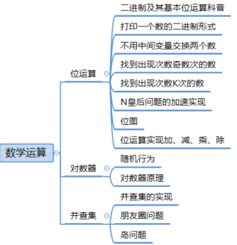

# 数学运算



## 质数

> 质数（Prime Number）又称素数，是指在**大于1的自然数中，除了1和它本身以外不再有其他因数的自然数**。
>
> 换句话说，一个大于1的自然数，如果除了1和它自身外，不能被其他自然数整除的数叫作质数；否则称为合数（Composite Number）。

例如，前几个质数是：2，3，5，7，11，13，17，19，23，29，31，37，41，43，47，53，59，61，67，71，73，79，83，89，97...

质数的几个基本性质：

1. **质数只有两个正因数：1和它本身**。
2. 最小的质数是2，它也是唯一的偶数质数。
3. 除了2以外，所有的质数都是奇数。
4. 任何大于1的自然数不是质数就是合数（1既不是质数也不是合数）。
5. 质数分布定理：一个大于1的自然数N，其不大于√N的质数的乘积能整除N的(√N)以内的约数（含1）。


### 判断一个数是否为质数

```javascript
// 判断一个数是否为质数  
function isPrime(num) {  
  if (num <= 1) return false;  
  // 如果 num 能被小于 num 的数字整除，则不是质数
  for (let i = 2; i <= Math.sqrt(num); i++) {  
    if (num % i === 0) return false;  
  }  
  return true;  
}
```


### 求解小于 n 的所有质数

输入一个数字 n，求解 小于 n 是所有质数

```javascript
function findPrimes(n) {  
    if (n < 2) return []; // 1不是质数，小于1的数也没有质数  
  
    let primes = [2]; // 初始化质数列表，先加入2  
  
    for (let i = 3; i <= n; i += 2) { // 从3开始，只检查奇数（偶数除了2都不是质数）  
        let isPrime = true;  
  
        // 检查i是否可以被primes列表中的质数整除  
        // 条件primes[j] * primes[j] <= i，这是为了优化算法的效率。如果一个数i有一个因子小于或等于它的平方根，那么它必然还有一个大于或等于它的平方根的因子。因此，我们只需要检查到i的平方根即可。由于primes列表中的质数是递增的，所以当我们检查到primes[j] * primes[j] > i时，我们就可以停止内层循环了
        for (let j = 0; j < primes.length && primes[j] * primes[j] <= i; j++) {  
            if (i % primes[j] === 0) {  
                isPrime = false;  
                break;  
            }  
        }  
  
        if (isPrime) {  
            primes.push(i);  
        }  
    }  
  
    return primes;  
}  
  
// 示例  
let n = 30;  
let primes = findPrimes(n);  
console.log(primes); // 输出1到30之间的所有质数
```

### [HJ6 质数因子](https://www.nowcoder.com/practice/196534628ca6490ebce2e336b47b3607?tpId=37&tqId=21229&toPageTab=solution&dayCountBigMember=365%E5%A4%A9)

**描述：** 

功能:输入一个正整数，按照从小到大的顺序输出它的所有质因子（重复的也要列举）（如180的质因子为2 2 3 3 5 ） 

**输出描述：** 

按照从小到大的顺序输出它的所有质数的因子，以空格隔开。 


**解题思路：**

1. 首先，我们需要一个函数来判断一个数是否为质数。质数是指只有1和它本身两个正因数的数。
2. 然后，我们可以编写一个主函数来处理输入的整数。主函数将从2开始，逐步尝试整除输入的整数，如果可以被整除，那么该数就是一个质因子，我们将其输出并继续用该质因子去除原数，直到原数无法再被该质因子整除。
3. 接着，我们将除数增加1，并重复上述步骤，直到除数大于或等于输入的整数（此时整数已经分解为1，无法再分解）

```javascript
// 判断一个数是否为质数  
function isPrime(num) {  
  if (num <= 1) return false;  
  // 如果 num 能被小于 num 的数字整除，则不是质数
  for (let i = 2; i <= Math.sqrt(num); i++) {  
    if (num % i === 0) return false;  
  }  
  return true;  
}  
  
// 找出并输出一个正整数的所有质因子  
function findPrimeFactors(n) {  
  let factors = [];  // 保存所有小于 n 的质数
  for (let i = 2; i <= n; i++) {  // 查找所有小于 n 的质数
    while (n % i === 0) {  // 如果 n 能整除 i，说明 i 可能是 n 的一个质因数
      if (isPrime(i)) {   // 再次判断 i 是否为质数，是质数则是质因数
        factors.push(i);  
        n /= i; // 求 n/i 商的质因数
      }  
    }  
    // 如果n已经被分解为1，则退出循环  
    if (n === 1) break;  
  }  
  return factors.join(' '); // 以空格分隔返回所有质因子  
}  
  
// 示例  
const input = 180;  
const output = findPrimeFactors(input);  
console.log(output); // 输出: 2 2 3 3 5
```

