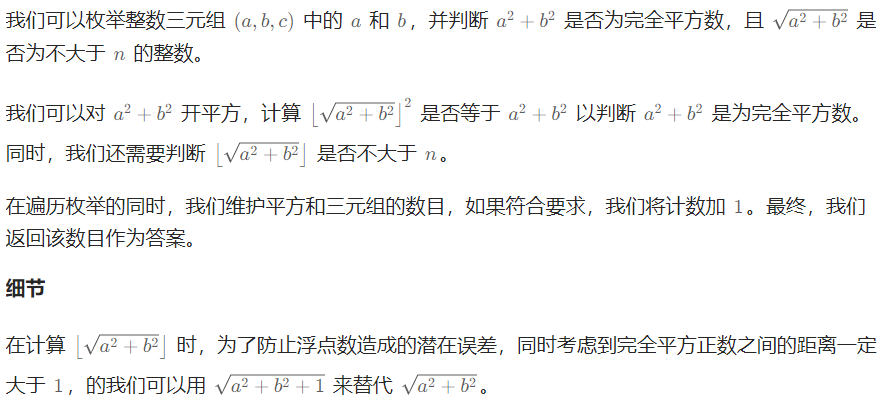
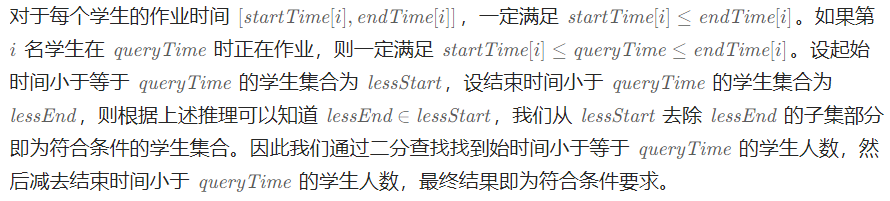
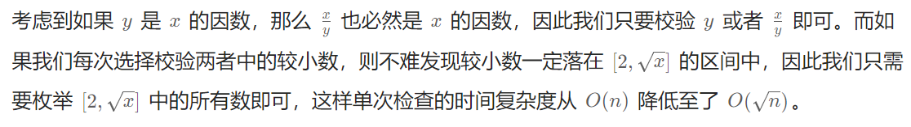

# 枚举算法

枚举算法（也称为穷举算法）是一种通过列举问题所有可能的解来求解问题的算法。这种算法会一一考察问题所有可能的解，并判断每一种可能是否满足问题的全部条件。如果满足全部条件，则找到了问题的解；否则，继续考察下一种可能。

枚举算法的解题思路主要包括以下几个步骤：

1. **确定问题的解空间**：首先，需要明确问题的所有可能解，即解空间。这通常涉及对问题的深入理解，以便能够列举出所有可能的情况。
2. **列举所有可能解**：在确定了解空间之后，接下来就需要通过循环或递归等方式，将解空间中的所有可能解一一列举出来。
3. **验证解的合法性**：对于每一个可能的解，都需要通过某种方式验证其是否满足问题的条件。这通常涉及将解代入到问题的条件中进行检验。
4. **输出结果**：如果找到了满足条件的解，就将其输出。如果没有找到满足条件的解，则可能需要调整搜索策略或重新审视问题的定义。

需要注意的是，枚举算法虽然简单直观，但在处理大规模问题时可能会因为需要考察的解空间太大而变得效率低下。因此，在实际应用中，通常需要根据问题的特点来选择合适的算法策略，以提高解题效率。

另外，枚举算法通常与其他算法或数据结构结合使用，以便更有效地搜索解空间。例如，可以使用优先队列（通常基于堆实现）来按照某种优先级顺序处理可能的解，或者使用回溯法来在搜索过程中剪枝，以减少不必要的搜索。


## 算法题

| 题号               | 标题                                                         | 标签                   | 难度 |
| :----------------- | :----------------------------------------------------------- | :--------------------- | :--- |
| 0001               | [两数之和](https://leetcode.cn/problems/two-sum/)            | 数组、哈希表           | 简单 |
| 0204               | [计数质数](https://leetcode.cn/problems/count-primes/)       | 数组、数学、枚举、数论 | 中等 |
| 1925               | [统计平方和三元组的数目](https://leetcode.cn/problems/count-square-sum-triples/) | 数学、枚举             | 简单 |
| 1450               | [在既定时间做作业的学生人数](https://leetcode.cn/problems/number-of-students-doing-homework-at-a-given-time/) | 数组                   | 简单 |
| 1620               | [网络信号最好的坐标](https://leetcode.cn/problems/coordinate-with-maximum-network-quality/) | 数组、枚举             | 中等 |
| 剑指 Offer 57 - II | [和为s的连续正数序列](https://leetcode.cn/problems/he-wei-sde-lian-xu-zheng-shu-xu-lie-lcof/) | 数学、双指针、枚举     | 简单 |
| 0800               | [相似 RGB 颜色](https://leetcode.cn/problems/similar-rgb-color/) | 数学、字符串、枚举     | 简单 |
| 0221               | [最大正方形](https://leetcode.cn/problems/maximal-square/)   | 数组、动态规划、矩阵   | 中等 |
| 0560               | [和为 K 的子数组](https://leetcode.cn/problems/subarray-sum-equals-k/) | 数组、哈希表、前缀和   | 中等 |

### [两数之和](https://leetcode.cn/problems/two-sum/)

#### 题目

给定一个整数数组 `nums` 和一个整数目标值 `target`，请你在该数组中找出 **和为目标值** *`target`* 的那 **两个** 整数，并返回它们的数组下标。

你可以假设每种输入只会对应一个答案。但是，数组中同一个元素在答案里不能重复出现。

你可以按任意顺序返回答案。

 

**示例 1：**

```
输入：nums = [2,7,11,15], target = 9
输出：[0,1]
解释：因为 nums[0] + nums[1] == 9 ，返回 [0, 1] 。
```

**示例 2：**

```
输入：nums = [3,2,4], target = 6
输出：[1,2]
```

**示例 3：**

```
输入：nums = [3,3], target = 6
输出：[0,1]
```


#### 方法一：枚举

最容易想到的方法是枚举数组中的每一个数 x，寻找数组中是否存在 `target - x`。

当我们使用遍历整个数组的方式寻找 `target - x` 时，需要注意到每一个位于 x 之前的元素都已经和 x 匹配过，因此不需要再进行匹配。而每一个元素不能被使用两次，所以我们只需要在 x 后面的元素中寻找 `target - x`。

```typescript
function twoSum(nums: number[], target: number): number[] {
  let len = nums.length
  for (let i = 0; i < len; i++) {
    for (let j = i + 1; j < len; j++) {
      if (nums[i] + nums[j] === target) {
        return [i, j]
      }
    }
  }
  return []
};
```

**复杂度分析**

- 时间复杂度：O(N2) ，其中 N 是数组中的元素数量。最坏情况下数组中任意两个数都要被匹配一次。

- 空间复杂度：O(1) 。


#### 方法二：哈希表

使用哈希表，可以将寻找 `target - x` 的时间复杂度降低到从 O(N) 降低到 O(1) 。

这样我们创建一个哈希表，对于每一个 x，我们首先查询哈希表中是否存在 `target - x`，然后将 x 插入到哈希表中，即可保证不会让 x 和自己匹配。

```typescript
function twoSum(nums: number[], target: number): number[] {
  let map = new Map<number, number>()
  let len = nums.length
  for (let i = 0; i < len; i++) {
    let other = target - nums[i]
    // 查找哈希表中是否存在差值，存在则返回对应差值的下标和当前下标
    if (map.has(other)) {
      return [map.get(other), i]
    }
    // 注意：存储当前遍历的值和下标
    map.set(nums[i], i)
  }
  return []
};
```


 **复杂度分析**

- 时间复杂度：O(N) ，其中 N 是数组中的元素数量。对于每一个元素 x，我们可以 O(1) 地寻找 `target - x`。

- 空间复杂度：O(N) ，其中 N  是数组中的元素数量。主要为哈希表的开销。


### [统计平方和三元组的数目](https://leetcode.cn/problems/count-square-sum-triples/description/)

#### 题目

一个 **平方和三元组** `(a,b,c)` 指的是满足 `a2 + b2 = c2` 的 **整数** 三元组 `a`，`b` 和 `c` 。

给你一个整数 `n` ，请你返回满足 `1 <= a, b, c <= n` 的 **平方和三元组** 的数目。

 

**示例 1：**

```
输入：n = 5
输出：2
解释：平方和三元组为 (3,4,5) 和 (4,3,5) 。
```

**示例 2：**

```
输入：n = 10
输出：4
解释：平方和三元组为 (3,4,5)，(4,3,5)，(6,8,10) 和 (8,6,10) 。
```

 

#### 方法一：枚举

```typescript
function countTriples(n: number): number {
  let num = 0
  for (let a = 1; a <= n; a++) {
    for (let b = 1; b <= n; b++) {
      for (let c = 1; c <= n; c++) {
        if (a * a + b * b === c * c) {
          num++
        }
      }
    }
  }
  return num
};
```

**复杂度分析**

* 时间复杂度：O(N^3)
* 空间复杂度：O(1)


#### 方法二：枚举优化



```typescript
function countTriples(n: number): number {
  let num = 0
  for (let a = 1; a <= n; a++) {
    for (let b = 1; b <= n; b++) {
      let c = Math.floor(Math.sqrt(a * a + b * b + 1))
      if (c <= n && (c * c === a * a + b * b)) {
        num++
      }
    }
  }
  return num
};
```

**复杂度分析**

- 时间复杂度： O(n^2) ，其中 n 为三元组元素的上界。即为遍历 a 与 b 的时间复杂度。

- 空间复杂度：O(1) 。


###  [在既定时间做作业的学生人数](https://leetcode.cn/problems/number-of-students-doing-homework-at-a-given-time/description/)

#### 题目

给你两个整数数组 `startTime`（开始时间）和 `endTime`（结束时间），并指定一个整数 `queryTime` 作为查询时间。

已知，第 `i` 名学生在 `startTime[i]` 时开始写作业并于 `endTime[i]` 时完成作业。

请返回在查询时间 `queryTime` 时正在做作业的学生人数。形式上，返回能够使 `queryTime` 处于区间 `[startTime[i], endTime[i]]`（含）的学生人数。

 

**示例 1：**

```
输入：startTime = [1,2,3], endTime = [3,2,7], queryTime = 4
输出：1
解释：一共有 3 名学生。
第一名学生在时间 1 开始写作业，并于时间 3 完成作业，在时间 4 没有处于做作业的状态。
第二名学生在时间 2 开始写作业，并于时间 2 完成作业，在时间 4 没有处于做作业的状态。
第三名学生在时间 3 开始写作业，预计于时间 7 完成作业，这是是唯一一名在时间 4 时正在做作业的学生。
```

**示例 2：**

```
输入：startTime = [4], endTime = [4], queryTime = 4
输出：1
解释：在查询时间只有一名学生在做作业。
```

**示例 3：**

```
输入：startTime = [4], endTime = [4], queryTime = 5
输出：0
```

**示例 4：**

```
输入：startTime = [1,1,1,1], endTime = [1,3,2,4], queryTime = 7
输出：0
```

**示例 5：**

```
输入：startTime = [9,8,7,6,5,4,3,2,1], endTime = [10,10,10,10,10,10,10,10,10], queryTime = 5
输出：5
```

 

#### 方法一：枚举

```typescript
function busyStudent(startTime: number[], endTime: number[], queryTime: number): number {
  let num = 0
  let len = startTime.length
  for (let i = 0; i < len; i++) {
    if (queryTime >= startTime[i] && queryTime <= endTime[i]) {
      num++
    }
  }
  return num
};
```

**复杂度分析**

- 时间复杂度： O(n^2) ，其中 n 为三元组元素的上界。即为遍历 a 与 b 的时间复杂度。
- 空间复杂度：O(1) 。

#### 方法二：二分查找



 ```javascript
 var busyStudent = function(startTime, endTime, queryTime) {
     startTime.sort((a, b) => a - b); // 从小到大排序开始时间
     endTime.sort((a, b) => a - b); // 从小到大排序
     // 二分查找开始时间小于等于查询时间的数
     const lessStart = upperbound(startTime, 0, startTime.length - 1, queryTime);
     // 二分查找结束时间小于查询时间的数
     const lessEnd = lowerbound(endTime, 0, endTime.length - 1, queryTime);
     return lessStart - lessEnd;
 }
 
 const upperbound = (arr, l, r, target) => {
     let ans = r + 1;
     while (l <= r) {
         const mid = l + ((r - l) >> 1);
         if (arr[mid] > target) {
             ans = mid;
             r = mid - 1;
         } else {
             l = mid + 1;
         }
     }
     return ans;
 }
 
 const lowerbound = (arr, l, r, target) => {
     let ans = r + 1;
     while (l <= r) {
         let mid = l + ((r - l) >> 1);
         if (arr[mid] >= target) {
             ans = mid;
             r = mid - 1;
         } else {
             l = mid + 1;
         }
     }
     return ans;
 };
 ```


### [计数质数](https://leetcode.cn/problems/count-primes/description/)

#### 题目

给定整数 `n` ，返回 *所有小于非负整数 `n` 的质数的数量* 。

 

**示例 1：**

```
输入：n = 10
输出：4
解释：小于 10 的质数一共有 4 个, 它们是 2, 3, 5, 7 。
```

**示例 2：**

```
输入：n = 0
输出：0
```

**示例 3：**

```
输入：n = 1
输出：0
```


#### **思路**

解题关键是在于如何判断一个数是否为质数。

质数的定义：在大于 1  的自然数中，除了 1  和它本身以外不再有其他因数的自然数。

计算质数方法一：

对于每个数 x ，我们可以从小到大枚举  [2,x−1] 中的每个数 y ，判断 y 是否为 x 的因数。但这样判断一个数是否为质数的时间复杂度最差情况下会到 O(n) ，无法通过所有测试数据（？）。

计算质数方法二：



判断一个数是否为质数

* 方法一：

```javascript
// 判断一个数是否为质数
const isPrime = (x) => {
    for (let i = 2; i * i <= x; ++i) {
        if (x % i == 0) {
            return false;
        }
    }
    return true;
}
```

* 方法二：

```javascript
function isPrime(num) {  
    // 小于等于1的数不是质数  
    if (num <= 1) {  
        return false;  
    }  
  
    // 2是最小的质数  
    if (num === 2) {  
        return true;  
    }  
  
    // 质数一定是奇数，所以只需要检查到sqrt(num)的奇数  
    // 这是因为如果num有一个大于sqrt(num)的因子，那么它必定还有一个小于sqrt(num)的对应因子  
    // 所以我们只需要检查到sqrt(num)即可  
    for (let i = 3; i <= Math.sqrt(num); i += 2) {  
        if (num % i === 0) {  
            // 如果num能被i整除，那么它不是质数  
            return false;  
        }  
    }  
  
    // 如果num不能被2到sqrt(num)之间的任何数整除，那么它是质数  
    return true;  
}  
```


#### 方法一：枚举

```javascript
// 判断一个数是否为质数
const isPrime = (x) => {
    for (let i = 2; i * i <= x; ++i) {
        if (x % i == 0) {
            return false;
        }
    }
    return true;
}

var countPrimes = function(n) {
    let ans = 0;
    for (let i = 2; i < n; ++i) {
        ans += isPrime(i);
    }
    return ans;
};
```


