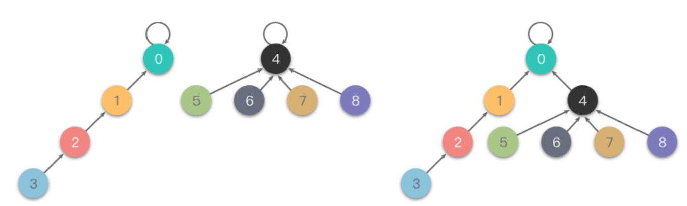
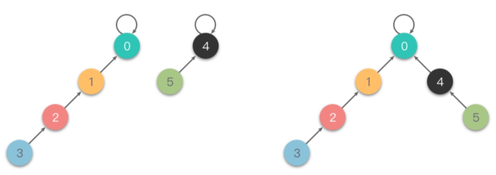

# 查并集

并查集（Union-Find）是一种数据结构，用于处理一些不交集（Disjoint Sets）的合并及查询问题。

在并查集中，每个元素被分配到一个唯一的集合（或称为“分区”或“组件”），这些集合之间互不相交。

简单来说，并查集就是用来处理集合的合并和集合的查询。

- 并查集中的「集」指的是不相交的集合，即一系列没有重复元素的集合。
- 并查集中的「并」指的就是集合的并集操作，将两个集合合并之后就变成一个集合。合并操作如下所示：

```
{1, 3, 5, 7} U {2, 4, 6, 8} = {1, 2, 3, 4, 5, 6, 7, 8}
```

- 并查集中的「查」是对于集合中存放的元素来说的，通常我们需要查询两个元素是否属于同一个集合。


「并查集」结构所支持的操作接口：

- **合并 `union(x, y)`**：将集合 𝑥 和集合 𝑦 合并成一个集合。
- **查找 `find(x)`**：查找元素 𝑥 属于哪个集合。
- **查找 `is_connected(x, y)`**：查询元素 𝑥 和 𝑦 是否在同一个集合中。

## 并查集的两种实现思路

* 一种是使用「快速查询」思路、基于数组结构实现的并查集；
* 一种是使用「快速合并」思路、基于森林实现的并查集。


## 快速查询：基于数组实现

如果我们希望并查集的查询效率高一些，那么我们就可以侧重于查询操作。

在使用「快速查询」思路实现并查集时，我们可以使用一个「数组结构」来表示集合中的元素。数组元素和集合元素是一一对应的，我们可以将数组的索引值作为每个元素的集合编号，称为 𝑖𝑑。然后可以对数组进行以下操作来实现并查集：

- **当初始化时**：将数组下标索引值作为每个元素的集合编号。所有元素的 𝑖𝑑 都是唯一的，代表着每个元素单独属于一个集合。
- **合并操作时**：需要将其中一个集合中的所有元素 𝑖𝑑 更改为另一个集合中的 𝑖𝑑，这样能够保证在合并后一个集合中所有元素的 𝑖𝑑 均相同。
- **查找操作时**：如果两个元素的 𝑖𝑑 一样，则说明它们属于同一个集合；如果两个元素的 𝑖𝑑 不一样，则说明它们不属于同一个集合。

举个例子来说明一下，我们使用数组来表示一系列集合元素`{0},{1},{2},{3},{4},{5},{6},{7}`，初始化时如下图所示：


从上图中可以看出：数组的每个下标索引值对应一个元素的集合编号，代表着每个元素单独属于一个集合。

当我们进行一系列的合并操作后，比如合并后变为 `{0},{1,2,3},{4},{5,6},{7}` ，合并操作的结果如下图所示。


从上图中可以看出，在进行一系列合并操作后，下标为 1 、2 、3  的元素集合编号是一致的，说明这 3  个元素同属于一个集合。同理下标为 5  和  6 的元素则同属于另一个。

```javascript
class UnionFind {  
    constructor(n) {  
        // 初始化：将每个元素的集合编号初始化为数组下标索引  
        this.ids = Array.from({length: n}, (_, i) => i);  
    }  
    // 查找元素的集合 id
    find(x) {  
        // 查找元素所属集合编号内部实现方法  
        // 这里使用路径压缩技术，将查询路径上的所有节点都直接指向根节点  
        if (this.ids[x] !== x) {  
            this.ids[x] = this.find(this.ids[x]);  
        }  
        return this.ids[x];  
    }  
  	// 合并元素 x,y 到同一个集合
    union(x, y) {  
        // 合并操作：将集合 x 和集合 y 合并成一个集合  
        let x_id = this.find(x);  
        let y_id = this.find(y);  
  
        if (x_id === y_id) {  
            // x 和 y 已经同属于一个集合  
            return false;  
        }  
  
        // 将两个集合的集合编号改为一致  
        for (let i = 0; i < this.ids.length; i++) {  
            if (this.ids[i] === y_id) {  
                this.ids[i] = x_id;  
            }  
        }  
        return true;  
    }  
    // 查询两个数是否属于同一个集合
    isConnected(x, y) {  
        // 查询操作：判断 x 和 y 是否同属于一个集合  
        return this.find(x) === this.find(y);  
    }  
}  
  
// 使用示例  
let uf = new UnionFind(5);  
uf.union(0, 1);  
uf.union(1, 2);  
console.log(uf.isConnected(0, 2)); // 输出 true  
console.log(uf.isConnected(3, 4)); // 输出 false
```

**复杂度分析：**

* 时间复杂度：
  * 单次查询操作的时间复杂度是 𝑂(1)
  * 而单次合并操作的时间复杂度为 𝑂(𝑛) （每次合并操作需要遍历数组）。


## 快速合并：基于森林实现

因为快速查询的实现思路中，合并操作的效率比较低。所以我们现在的重点是提高合并操作的效率。

在使用「快速合并」思路实现并查集时，我们可以使用「一个森林（若干棵树）」来存储所有集合。每一棵树代表一个集合，树上的每个节点都是一个元素，树根节点为这个集合的代表元素。

> **注意**：与普通的树形结构（父节点指向子节点）不同的是，基于森林实现的并查集中，树中的**子节点是指向父节点的**。
>
> * 属于同一个根节点的多个元素属于同一个集合
>
> * 通过子节点指向父节点，可以快速找到一个节点的集合。

**存储结构：**

此时，我们仍然可以使用一个**数组** 𝑓𝑎 来记录这个森林。

我们用 𝑓𝑎[𝑥] 来保存 𝑥 的父节点的集合编号，代表着元素节点 𝑥 指向父节点 𝑓𝑎[𝑥]。

对数组 𝑓𝑎 进行以下操作来实现并查集：

- **当初始化时**：将数组 𝑓𝑎 的下标索引作为每个元素的集合编号。所有元素的根节点的集合编号都不一样，代表着每个元素单独属于一个集合。
- **合并操作时**：需要将两个集合的树根节点相连接。即令其中一个集合的树根节点指向另一个集合的树根节点（`fa[root1] = root2`），这样合并后当前集合中的所有元素的树根节点均为同一个。
- **查找操作时**：分别从两个元素开始，通过数组 𝑓𝑎 存储的值，不断递归访问元素的父节点，直到到达树根节点。（根节点特征：下标索引 = 父节点编号）
  - 如果两个元素的树根节点一样，则说明它们属于同一个集合；
  - 如果两个元素的树根节点不一样，则说明它们不属于同一个集合。


**示例：**

我们使用数组来表示一系列集合元素 `{0},{1},{2},{3},{4},{5},{6},{7}` ，初始化时如下图所示。

  

从上图中可以看出：𝑓𝑎 数组的每个下标索引值对应一个元素的集合编号，代表着每个元素属于一个集合。

当我们进行一系列的合并操作后，比如 `union(4, 5)`、`union(6, 7)`、`union(4, 7)` 操作后变为 `{0},{1},{2},{3},{4,5,6,7}` ，合并操作的步骤及结果如下图所示：

> 第一步：
>
> - 合并 (4,5) ：令 4  的根节点指向 5 ，即将 𝑓𝑎[4]  更改为 5 。
>
> 
>
> 第二步：
>
> - 合并 (6,7) ：令 6  的根节点指向 7，即将 𝑓𝑎[6]  更改为 7 。
>
> 
>
> 第三步：
>
> - 合并 (4,7) ：令 4 的的根节点指向 7 ，即将 `𝑓𝑎[𝑓𝑎[4]]`（也就是 𝑓𝑎[5] ）更改为 7 。
>
> 
>
> 在进行一系列合并操作后，`fa[fa[4]] == fa[5] == fa[6] == f[7]`，即 4 、5 、6 、7 的元素根节点编号都是 4 ，说明这 4  个元素同属于一个集合。


```javascript
class UnionFind {  
    constructor(n) {  
        // 初始化：将每个元素的集合编号初始化为数组 fa 的下标索引  
        this.fa = Array.from({ length: n }, (_, i) => i);  
    }  
    // 查找元素 x 的集合
    find(x) {  
        // 查找元素根节点的集合编号内部实现方法  
        // 递归查找元素的父节点，直到根节点  
        if (this.fa[x] !== x) {  
            this.fa[x] = this.find(this.fa[x]); // 路径压缩，优化查找效率  
        } 
        //当查找到根节点时，返回根节点编号（根节点特征：下标索引 = 父节点编号）
        return this.fa[x]; // 返回元素根节点的集合编号  
    }  
   // 将元素 x,y 合并成一个集合
    union(x, y) {  
        // 合并操作：令其中一个集合的树根节点指向另一个集合的树根节点  
        const rootX = this.find(x);  
        const rootY = this.find(y);  
        if (rootX === rootY) {  
            // x 和 y 的根节点集合编号相同，说明 x 和 y 已经同属于一个集合  
            return false;  
        }  
        this.fa[rootX] = rootY; // x 的根节点连接到 y 的根节点上，成为 y 的根节点的子节点  
        return true;  
    }  
    // 判断 x,y 是否属于同一个集合
    isConnected(x, y) {  
        // 查询操作：判断 x 和 y 是否同属于一个集合  
        return this.find(x) === this.find(y);  
    }  
}
```


---

## 查询优化（基于森林实现）

### 路径压缩

在集合很大或者树很不平衡时，使用上述「快速合并」思路实现并查集的代码效率很差，最坏情况下，树会退化成一条链，单次查询的时间复杂度高达 𝑂(𝑛)。并查集的最坏情况如下图所示。

 

为了避免出现最坏情况，一个常见的优化方式是「路径压缩」。

> **路径压缩（Path Compression）**：在从底向上查找根节点过程中，如果此时访问的节点不是根节点，则我们可以把这个节点尽量向上移动一下，从而减少树的层树。这个过程就叫做路径压缩。

路径压缩有两种方式：

* 一种叫做「隔代压缩」；
* 另一种叫做「完全压缩」。

### 隔代压缩

> **隔代压缩**：在查询时，两步一压缩，一直循环执行「把当前节点指向它的父亲节点的父亲节点」这样的操作，从而减小树的深度。

下面是一个「隔代压缩」的例子。

 

隔代压缩的查找代码如下：

```javascript
class UnionFind {  
    constructor() {  
        // 假设我们有一个字典或映射来存储每个元素的父节点，初始时每个元素的父节点都是它自己  
        this.fa = {}; // 使用对象来模拟映射  
    }  
  
    find(x) {  
        // 查找元素根节点的集合编号  
        if (!this.fa[x]) {  
            // 如果元素x不存在，可以抛出错误或返回特定值  
            throw new Error('Element not found');  
        }  
  
        // 递归查找元素的父节点，直到根节点  
        while (this.fa[x] !== x) {  
            // 隔代压缩，将当前节点的父节点下标更新为祖父节点下标 
            this.fa[x] = this.fa[this.fa[x]];  
            // 将查找值更新为夫节点值
            x = this.fa[x];  
        }  
  
        // 返回元素根节点的集合编号  
        return x;  
    }  
  
    // 可能还需要其他方法来处理并查集的合并等操作...  
}  
  
// 使用示例  
const uf = new UnionFind();  
uf.fa[1] = 1; // 初始化元素1的父节点为它自己  
uf.fa[2] = 1; // 元素2的父节点是1，表示它们属于同一集合  
  
console.log(uf.find(2)); // 输出: 1，因为元素2和1属于同一集合，集合的根节点是1
```


### 完全压缩

> **完全压缩**：在查询时，把被查询的节点到根节点的路径上的所有节点的父节点设置为根节点，从而减小树的深度。也就是说，在向上查询的同时，把在路径上的每个节点都直接连接到根上，以后查询时就能直接查询到根节点。

相比较于「隔代压缩」，「完全压缩」压缩的更加彻底。下面是一个「完全压缩」的例子。

 

- 完全压缩的查找代码如下：

```javascript
class UnionFind {  
    constructor(n) {  
        // 初始化：将每个元素的集合编号初始化为数组 fa 的下标索引  
        this.fa = Array.from({ length: n }, (_, i) => i);  
    }  
  
    find(x) {  
        // 查找元素根节点的集合编号内部实现方法  
        // 递归查找元素的父节点，直到根节点，并同时进行路径压缩  
        if (this.fa[x] !== x) {  
            this.fa[x] = this.find(this.fa[x]); // 完全压缩优化  
        }  
        return this.fa[x]; // 返回元素根节点的集合编号  
    }  
  
    // 可能还需要其他方法来处理并查集的合并等操作...  
}  
  
// 使用示例  
const uf = new UnionFind(10); // 假设我们有10个元素  
console.log(uf.find(5)); // 输出: 5，因为元素5的初始父节点就是它自己  
  
// 假设我们合并了某些元素（但在此示例中没有实现union方法）  
// ...  
  
// 再次查找同一个元素，由于路径压缩，查找应该更快  
console.log(uf.find(5)); // 输出: 仍然是5或其所在集合的根节点
```


## 合并优化（基于森林实现）

### 按秩合并

因为路径压缩只在查询时进行，并且只压缩一棵树上的路径，所以并查集最终的结构仍然可能是比较复杂的。为了避免这种情况，另一个优化方式是「按秩合并」。

> **按秩合并（Union By Rank）**：指的是在每次合并操作时，都把「秩」较小的树根节点指向「秩」较大的树根节点。

这里的「秩」有两种定义：

* 一种定义指的是树的深度；
* 另一种定义指的是树的大小（即集合节点个数）。

无论采用哪种定义，集合的秩都记录在树的根节点上。

按秩合并也有两种方式：

* 一种叫做「按深度合并」；
* 另一种叫做「按大小合并」。

### 按深度合并

> **按深度合并（Unoin By Rank）**：在每次合并操作时，都把「深度」较小的树根节点指向「深度」较大的树根节点。

1. 我们用一个数组 𝑟𝑎𝑛𝑘 记录每个根节点对应的树的深度（如果不是根节点，其 𝑟𝑎𝑛𝑘 值相当于以它作为根节点的子树的深度）。
2. 初始化时，将所有元素的 𝑟𝑎𝑛𝑘 值设为 1。
3. 在合并操作时，比较两个根节点，把 𝑟𝑎𝑛𝑘 值较小的根节点指向 𝑟𝑎𝑛𝑘 值较大的根节点上合并。

下面是一个「按深度合并」的例子：




```javascript
class UnionFind {  
    constructor(n) {  
        // 初始化：将每个元素的集合编号初始化为数组 fa 的下标索引  
        this.fa = Array.from({ length: n }, (_, i) => i);  
        // 初始化：每个元素的深度初始化为 1  
        this.rank = Array.from({ length: n }, () => 1);  
    }  
  	// 查找元素x根节点的集合编号
    find(x) {  
        // 查找元素根节点的集合编号内部实现方法  
        // 递归查找元素的父节点，直到根节点，并同时进行隔代压缩  
        if (this.fa[x] !== x) {  
            this.fa[x] = this.find(this.fa[x]); // 隔代压缩  
        }  
        return this.fa[x]; // 返回元素根节点的集合编号  
    }  
    // 合并元素x,y
    union(x, y) {  
        // 合并操作：令其中一个集合的树根节点指向另一个集合的树根节点  
        let rootX = this.find(x);  
        let rootY = this.find(y);  
        if (rootX === rootY) {  
            // x 和 y 的根节点集合编号相同，说明 x 和 y 已经同属于一个集合  
            return false;  
        }  
  
        if (this.rank[rootX] < this.rank[rootY]) {  
            // x 的根节点对应的树的深度 小于 y 的根节点对应的树的深度  
            this.fa[rootX] = rootY; // x 的根节点连接到 y 的根节点上(深度较小的连接深度较大的根节点) 
        } else if (this.rank[rootX] > this.rank[rootY]) {  
            // x 的根节点对应的树的深度 大于 y 的根节点对应的树的深度  
            this.fa[rootY] = rootX; // y 的根节点连接到 x 的根节点上  (深度较小的连接深度较大的根节点) 
        } else {  
            // x 的根节点对应的树的深度 等于 y 的根节点对应的树的深度  
            this.fa[rootX] = rootY; // 向任意一方合并即可  
            this.rank[rootY] += 1;  // 因为层数相同，被合并的树必然层数会 +1  
        }  
        return true;  
    }  
  
    isConnected(x, y) {  
        // 查询操作：判断 x 和 y 是否同属于一个集合  
        return this.find(x) === this.find(y);  
    }  
}  
  
// 使用示例  
const uf = new UnionFind(10);  
console.log(uf.isConnected(1, 2)); // 输出: false，因为初始时它们不属于同一个集合  
uf.union(1, 2);  
console.log(uf.isConnected(1, 2)); // 输出: true，因为它们现在属于同一个集合
```

### 按大小合并

> **按大小合并（Unoin By Size）**：这里的大小指的是**集合节点个数**。
>
> 在每次合并操作时，都把「集合节点个数」较少的树根节点指向「集合节点个数」较大的树根节点。

1. 我们用一个数组 𝑠𝑖𝑧𝑒  记录每个根节点对应的集合节点个数（如果不是根节点，其 𝑠𝑖𝑧𝑒 值相当于以它作为根节点的子树的集合节点个数）。
2. 初始化时，将所有元素的 𝑠𝑖𝑧𝑒 值设为 1 。
3. 在合并操作时，比较两个根节点，把 𝑠𝑖𝑧𝑒  值较小的根节点指向 𝑠𝑖𝑧𝑒 值较大的根节点上合并。

下面是一个「按大小合并」的例子：



```javascript
class UnionFind {  
    constructor(n) {  
        // 初始化：将每个元素的集合编号初始化为数组 fa 的下标索引  
        this.fa = Array.from({ length: n }, (_, i) => i);  
        // 初始化：每个集合的元素个数初始化为 1  
        this.size = Array.from({ length: n }, () => 1);  
    }  
    // 查找元素x根节点的集合编号
    find(x) {  
        // 查找元素根节点的集合编号内部实现方法  
        // 递归查找元素的父节点，直到根节点，并同时进行隔代压缩  
        if (this.fa[x] !== x) {  
            this.fa[x] = this.find(this.fa[x]); // 隔代压缩  
        }  
        return this.fa[x]; // 返回元素根节点的集合编号  
    }  
  
    union(x, y) {  
        // 合并操作：令其中一个集合的树根节点指向另一个集合的树根节点  
        let rootX = this.find(x);  
        let rootY = this.find(y);  
        if (rootX === rootY) {  
            // x 和 y 的根节点集合编号相同，说明 x 和 y 已经同属于一个集合  
            return false;  
        }  
  
        if (this.size[rootX] < this.size[rootY]) {  
            // x 对应的集合元素个数 小于 y 对应的集合元素个数  
            this.fa[rootX] = rootY; // x 的根节点连接到 y 的根节点上 (节点数量较小的集合连接到节点数较大的集合)
            this.size[rootY] += this.size[rootX]; // y 的根节点对应的集合元素个数 累加上 x 的根节点对应的集合元素个数  
        } else {//  (节点数量较小的集合连接到节点数较大的集合)
            // x 对应的集合元素个数 大于等于 y 对应的集合元素个数  
            this.fa[rootY] = rootX; // y 的根节点连接到 x 的根节点上  
            this.size[rootX] += this.size[rootY]; // x 的根节点对应的集合元素个数 累加上 y 的根节点对应的集合元素个数  
        }  
        return true;  
    }  
  
    isConnected(x, y) {  
        // 查询操作：判断 x 和 y 是否同属于一个集合  
        return this.find(x) === this.find(y);  
    }  
}  
  
// 使用示例  
const uf = new UnionFind(10);  
console.log(uf.isConnected(1, 2)); // 输出: false，因为初始时它们不属于同一个集合  
uf.union(1, 2);  
console.log(uf.isConnected(1, 2)); // 输出: true，因为它们现在属于同一个集合
```


## 算法题

| 题号 | 标题                                                         | 标签                                                         | 难度 |
| :--- | :----------------------------------------------------------- | :----------------------------------------------------------- | :--- |
| 0990 | [等式方程的可满足性](https://leetcode.cn/problems/satisfiability-of-equality-equations/) | 并查集、图、数组、字符串                                     | 中等 |
| 0547 | [省份数量](https://leetcode.cn/problems/number-of-provinces/) | 深度优先搜索、广度优先搜索、并查集、图                       | 中等 |
| 0684 | [冗余连接](https://leetcode.cn/problems/redundant-connection/) | 深度优先搜索、广度优先搜索、并查集、图                       | 中等 |
| 1319 | [连通网络的操作次数](https://leetcode.cn/problems/number-of-operations-to-make-network-connected/) | 深度优先搜索、广度优先搜索、并查集、图                       | 中等 |
| 0765 | [情侣牵手](https://leetcode.cn/problems/couples-holding-hands/) | 贪心、深度优先搜索、广度优先搜索、并查集、图                 | 困难 |
| 0399 | [除法求值](https://leetcode.cn/problems/evaluate-division/)  | 深度优先搜索、广度优先搜索、并查集、图、数组、最短路         | 中等 |
| 0959 | [由斜杠划分区域](https://leetcode.cn/problems/regions-cut-by-slashes/) | 深度优先搜索、广度优先搜索、并查集、图                       | 中等 |
| 1631 | [最小体力消耗路径](https://leetcode.cn/problems/path-with-minimum-effort/) | 深度优先搜索、广度优先搜索、并查集、数组、二分查找、矩阵、堆（优先队列） | 中等 |
| 0778 | [水位上升的泳池中游泳](https://leetcode.cn/problems/swim-in-rising-water/) | 深度优先搜索、广度优先搜索、并查集、数组、二分查找、矩阵、堆（优先队列） | 困难 |
| 1202 | [交换字符串中的元素](https://leetcode.cn/problems/smallest-string-with-swaps/) | 深度优先搜索、广度优先搜索、并查集、哈希表、字符串           | 中等 |
| 0947 | [移除最多的同行或同列石头](https://leetcode.cn/problems/most-stones-removed-with-same-row-or-column/) | 深度优先搜索、并查集、图                                     | 中等 |
| 0803 | [打砖块](https://leetcode.cn/problems/bricks-falling-when-hit/) | 并查集、数组、矩阵                                           | 困难 |
| 0128 | [最长连续序列](https://leetcode.cn/problems/longest-consecutive-sequence/) | 并查集、数组、哈希表                                         | 中等 |