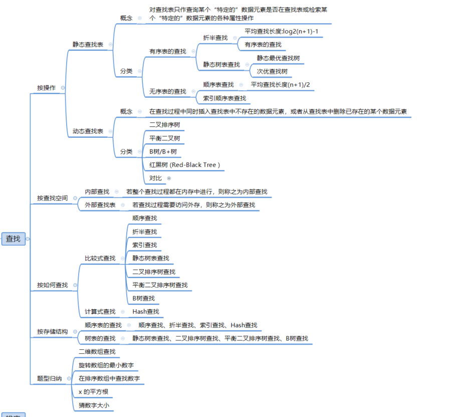
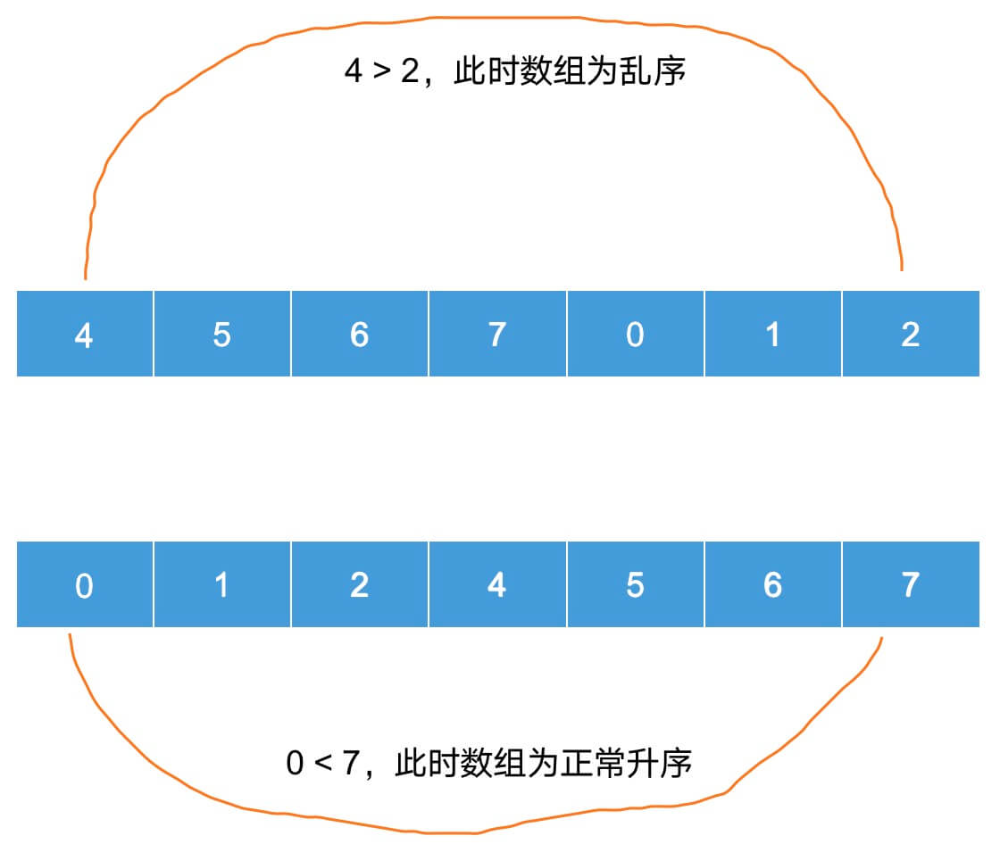

# 查找算法




以下是几种常见的查找算法及其思想和时间、空间复杂度的概述：

|             查找算法             | 思想                                                         |                  时间复杂度                  |          空间复杂度          |
| :------------------------------: | :----------------------------------------------------------- | :------------------------------------------: | :--------------------------: |
|    顺序查找（Linear Search）     | 从列表的一端开始，逐个比较每个元素，直到找到所需元素或遍历完整个列表。 |                     O(n)                     |             O(1)             |
|    二分查找（Binary Search）     | 适用于**已排序的列表**。<br />首先比较列表中间的元素，如果找到所需元素则返回；否则根据中间元素与目标元素的大小关系，在列表的左半部分或右半部分继续查找，如此递归进行。 |                   O(log n)                   |             O(1)             |
| 斐波那契查找（Fibonacci Search） | 利用斐波那契数列的性质，在已排序的列表中查找所需元素。通过斐波那契数列确定查找范围，然后逐步缩小范围，直到找到所需元素。 |                   O(log n)                   |             O(1)             |
| 插值查找（Interpolation Search） | 适用于**已排序且元素分布均匀的列表**。<br />根据要查找的元素在列表中的大致位置，直接计算一个可能的中间位置进行查找，而非简单地取中间位置。 |               O(log n) 到 O(n)               |             O(1)             |
|     跳跃查找（Jump Search）      | 适用于**已排序且可以分组的列表**。<br />首先确定一个步长（跳跃距离），然后按照步长进行查找。当找到所在组时，再使用顺序查找确定具体位置。 |                  O(sqrt(n))                  |             O(1)             |
|  树表查找（Tree Table Search）   | 基于树形数据结构（如二叉查找树、平衡二叉树、B树等）进行查找。通过树的层级结构，可以快速定位到所需元素。 | 取决于树的具体类型和平衡情况，但通常优于O(n) | 取决于树的具体类型和存储结构 |
|       哈希查找（Hashing）        | 通过哈希函数将键映射到表中的一个位置，然后在该位置查找所需元素。哈希查找的平均时间复杂度为常数时间，但最坏情况可能退化到O(n)。 |        平均情况：O(1)，最坏情况：O(n)        | 取决于哈希表的实现和存储需求 |

**注意**：

1. 时间复杂度：上述时间复杂度均为平均或最好/最坏情况下的估计，具体实现和输入数据可能会影响实际性能。
2. 空间复杂度：对于大多数查找算法，空间复杂度通常为O(1)，因为它们通常只需要存储少量变量或指针。但对于某些算法（如树表查找和哈希查找），空间复杂度可能因数据结构的不同而有所变化。
3. 实际应用中，选择哪种查找算法取决于数据的性质、规模、存储结构以及查询的频繁程度等因素。

----


## 折半(二分)查找

**适用范围： 有序表**

**思想：**

* 在有序表中，首先选取有序表的中间值 mid
* 比较中间值 mid 和 目标值 target 大小
  * mid < target:  递归查找左子表
  * mid > target:  递归查找右子表

**示例**

> 对静态查找表`{5,13,19,21,37,56,64,75,80,88,92}`采用折半查找算法查找关键字为  21  的过程为：
>
> 
> 
>
> 如上所示，指针 low 和 high 分别指向查找表的第一个关键字和最后一个关键字，指针 mid 指向处于 low 和 high 指针中间位置的关键字。在查找的过程中每次都同 mid 指向的关键字进行比较，由于整个表中的数据是有序的，因此在比较之后就可以知道要查找的关键字的大致位置。
>
> 例如:
>
> 1. 在查找关键字 21 时，首先同 56 作比较，由于`21 < 56`，而且这个查找表是按照升序进行排序的，所以可以判定如果静态查找表中有 21 这个关键字，就一定存在于 low 和 mid 指向的区域中间。
> 2. 再次遍历时需要更新 high 指针和 mid 指针的位置，令 high 指针移动到 mid 指针的左侧一个位置上，同时令 mid 重新指向 low 指针和 high 指针的中间位置。
>
> 
> 
>
> 3. 用 21 同 mid 指针指向的 19 作比较，`19 < 21`，所以可以判定 21 如果存在，肯定处于 mid 和 high 指向的区域中。所以令 low 指向 mid 右侧一个位置上，同时更新 mid 的位置。
>
> 
>
> 
>
> 4. 当第三次做判断时，发现 mid 就是关键字 21 ，查找结束。
>
> 注意：在做查找的过程中，如果 low 指针和 high 指针的中间位置在计算时位于两个关键字中间，即求得 mid 的位置不是整数，需要统一做取整操作。


**折半查找计算中位数方法**

假设求 l和 r的中位数 mid，则 :

```javascript
 mid = l + ((r - l) >> 1)
```

> 1. **计算差值**：`r - l` 计算出 `r` 和 `l` 之间的差值。
> 2. **计算偏移量（右移操作）**：
>    * `>>` 是 JavaScript 中的无符号右移操作符。它将一个数值的所有位向右移动指定的位数，并在左侧用零填充。
>    * 在这里，右移一位等同于将差值除以 2（但仅限于整数部分，并且结果是一个整数）。
>    * 例如，如果 `r - l` 是 3（在二进制中表示为 `11`），那么右移一位后它变为 `01`，即十进制中的 1。
> 3. **添加起始值**：
>    * `l + ((r - l) >> 1)` 实际上是在将差值的一半加回到起始值 `l` 上。这得到了一个整数中位数，它可能不是严格的平均值（特别是当 `r - l` 是奇数时），但通常用于需要整数结果的情况，例如在数组索引或类似场景中。


**实现**

```javascript
function BinarySearch(array,target,left, right){
	let  mid  
	let  left = 0
	let  right = array.length - 1
	while(left  <= right) {
		mid = (left + right)/2
		if(array[mid] === array[target]){
			return array[mid]
		}else if(array[mid] > array[target]) {
			right = mid - 1 
        }else {
        	left = mid + 1 
        }
	}
	return false
}
```


---


## 插值查找

插值查找（Interpolation Search）是一种基于二分查找的改进算法，主要用于**在已排序的数组中查找某个特定的元素**。

插值查找的基本思想是利用元素在数组中的分布情况，通过计算一个“预测值”来作为比较的基准，而不是简单地取数组的中间值。如果目标值比预测值小，则在数组的左半部分继续查找；反之，则在右半部分查找。

**插值查找的实现思路**：

1. 假设数组已经排序。
2. 计算目标值在数组中的预测位置。这通常是通过一个插值公式来完成的，该公式考虑了目标值和数组边界值的关系。
3. 如果预测位置上的元素就是目标值，则返回该位置。
4. 如果预测位置上的元素比目标值大，则在数组的左半部分继续查找。
5. 如果预测位置上的元素比目标值小，则在数组的右半部分继续查找。
6. 重复步骤 2-5，直到找到目标值或确定目标值不存在于数组中。

**插值查找通过以下公式来计算预测位置：**

```
pos = low + ⌊((high - low) / (arr[high] - arr[low])) * (target - arr[low])⌋
```

>  这个公式的解释如下：
>
> - `low` 和 `high` 是当前查找范围的边界（初始时 `low = 0`，`high = arr.length - 1`）。
> - `arr[high] - arr[low]` 是当前查找范围内元素的最大差值。
> - `target - arr[low]` 是目标值与当前查找范围起始值的差值。
> - 通过将 `(target - arr[low])` 除以 `(arr[high] - arr[low])`，我们得到了一个介于 0 和 1 之间的比例因子。这个比例因子反映了目标值在当前查找范围内的相对位置。
> - 然后，我们将这个比例因子乘以 `(high - low)`，即当前查找范围的长度，得到一个偏移量。
> - 最后，将这个偏移量加到 `low` 上，就得到了预测位置 `pos`。


如果数组中的元素分布均匀，那么插值查找通常会比二分查找更快，因为它能够更精确地定位到目标值可能存在的位置。

然而，如果数组中的元素分布不均匀，或者存在大量的重复元素，那么插值查找可能会退化为线性查找，因为预测位置可能会频繁地指向错误的方向。

```javascript
function interpolationSearch(arr, target) {  
    let low = 0;  
    let high = arr.length - 1;  
  
    // 确保数组不为空  
    if (high >= low) {  
        // 当查找范围不为空时循环  
        while (low <= high && target >= arr[low] && target <= arr[high]) {  
            // 计算预测位置  
            let pos = low + Math.floor(((high - low) / (arr[high] - arr[low])) * (target - arr[low]));  
  
            // 检查预测位置上的元素  
            if (arr[pos] === target) {  
                return pos; // 找到目标值，返回其位置  
            }  
  
            // 如果预测位置上的元素比目标值大，则在左半部分继续查找  
            if (arr[pos] > target) {  
                high = pos - 1;  
            }  
            // 否则，在右半部分继续查找  
            else {  
                low = pos + 1;  
            }  
        }  
    }  
  
    // 如果未找到目标值，返回-1  
    return -1;  
}  
  
// 示例用法  
let arr = [10, 12, 13, 16, 18, 19, 20, 21, 22, 23, 24, 33, 35, 42, 47];  
let target = 18;  
let result = interpolationSearch(arr, target);  
if (result !== -1) {  
    console.log(`目标值 ${target} 在数组中的位置是 ${result}`);  
} else {  
    console.log(`目标值 ${target} 不在数组中`);  
}
```

---


## 跳跃查找

跳跃查找（Jump Search）是一种在有序数组中查找特定元素的搜索算法。

该算法的思想是通过固定大小的步长（或称为“块”）来跳过数组中的某些元素，从而减少了需要检查的元素数量。当搜索的步长过大时，算法会退化为线性搜索；当步长过小时，算法接近于二分搜索。因此，选择适当的步长是跳跃查找的关键。

**跳跃查找的实现思路如下**：

1. 首先，确定一个块大小（步长）。这通常与数组的长度有关，比如可以是 `Math.floor(Math.sqrt(arr.length))`。
2. 从数组的第一个元素开始，以确定的步长向前跳跃，直到找到一个大于或等于目标值的元素，或者超过了数组的末尾。
3. 如果找到了目标值，则返回其索引。
4. 如果没有找到目标值，但在某一步长内发现当前元素大于目标值，则在该步长内的元素中进行线性搜索。
5. 如果在整个数组中都没有找到目标值，则返回 -1。


```javascript
function jumpSearch(arr, target) {  
    // 数组必须是有序的  
    // 初始化左右边界  
    let left = 0;  
    let right = arr.length - 1;  
  
    // 计算步长，通常取数组长度的平方根  
    let step = Math.floor(Math.sqrt(arr.length));  
  
    // 找到目标值可能所在的块  
    while (arr[Math.min(right, left + step)] < target && left < right) {  
        left += step; // 跳跃到下一个块  
    }  
  
    // 现在，在目标值可能所在的块内进行线性搜索  
    while (left <= right && arr[left] < target) {  
        left++; // 逐个检查元素  
    }  
  
    // 如果找到了目标值，返回其索引  
    if (arr[left] === target) {  
        return left;  
    }  
  
    // 如果没有找到目标值，返回 -1  
    return -1;  
}  
  
// 示例用法  
let arr = [2, 3, 4, 10, 40]; // 注意：此数组需要是有序的  
let target = 10;  
let result = jumpSearch(arr, target);  
if (result !== -1) {  
    console.log(`目标值 ${target} 在数组中的位置是 ${result}`);  
} else {  
    console.log(`目标值 ${target} 不在数组中`);  
}
```


---


## 二叉排序树（二叉查找树）

> 详细参考博客：[树 | Sewen 博客 (sewar-x.github.io)](https://sewar-x.github.io/myblog/article/算法和数据结构/数据结构/树.html#二叉查找树-bst树)

## 平衡二叉树（AVL树）

> 详细参考博客：[树 | Sewen 博客 (sewar-x.github.io)](https://sewar-x.github.io/myblog/article/算法和数据结构/数据结构/树.html#平衡二叉查找树-avl树)

---


---

## JavaScript 中查找方法

### 数组中查找方法

###### [find()](https://developer.mozilla.org/zh-CN/docs/Web/JavaScript/Reference/Global_Objects/Array/find)

* 实现

  * ```javascript
    Array.prototype.find = function(fn) {
        for (let i = 0; i < this.length; i++) {
            if (fn(this[i])) 
            	return this[i]
        }
    }
    ```

###### [findIndex()](https://developer.mozilla.org/zh-CN/docs/Web/JavaScript/Reference/Global_Objects/Array/findIndex)

* 实现

  * ```javascript
    Array.prototype.find = function(fn) {
        for (let i = 0; i < this.length; i++) {
            if (fn(this[i])) 
            	return i
        }
    }
    ```

###### [indexOf()](https://developer.mozilla.org/zh-CN/docs/Web/JavaScript/Reference/Global_Objects/Array/indexOf)

* 实现

  * ```javascript
    Array.prototype.indexOf = function(value,start) {
    	if(this === null || !value)								// 不允许null调用或则查找值为空
    		return -1
    	let i = 0,length = this.length
    	if(start && typeof start === 'number') {				// 处理第二个参数
    		if(start > length) return -1
    		i = (start < 0 ? Math.max(0,length+start):start);
    	}
        for(;i<length;i++){										//	从第二个参数位置起从前往后查找
           if(this[i]===value){
               return i;
           }
       	}
       	return -1;
    }
    ```

  * 注意

    * `indexOf` 使用[strict equality](https://developer.mozilla.org/zh-CN/docs/Web/JavaScript/Reference/Operators/Comparison_Operators#Using_the_Equality_Operators) (无论是 ===, 还是 triple-equals操作符都基于同样的方法)进行判断 `searchElement与`数组中包含的元素之间的关系
    * 第二个参数 start (开始查找的位置) 规则:
      * 如果该索引值大于或等于数组长度，意味着不会在数组里查找，返回-1。
      * 如果参数中提供的索引值是一个负值，则将其作为数组末尾的一个抵消，即-1表示从最后一个元素开始查找，-2表示从倒数第二个元素开始查找 ，以此类推。
      * 注意：如果参数中提供的索引值是一个负值，并不改变其查找顺序，查找顺序仍然是从前向后查询数组。
      * 如果抵消后的索引值仍小于0，则整个数组都将会被查询。其默认值为0.

###### [lastIndexOf()](https://developer.mozilla.org/zh-CN/docs/Web/JavaScript/Reference/Global_Objects/Array/lastIndexOf)

* 实现

```javascript
    Array.prototype.lastIndexOf = function(value,start) {
    	if(this === null || !value)	
    		return -1
    	let i=this.length-1
    	if(start && typeof start === 'number') {
    		if(start < 0) {
    			if(Math.abs(start) > i) {
    				return -1
    			}else {
    				i = i+start
    			}
    		}else {
    			i = i-start
    		}
    	}
    	for(;i>=0;i--){										//	从第二个参数位置起从后往前查找
           if(this[i]===value){
               return i;
           }
       	}
       	return -1
    }
```

###### [includes()](https://developer.mozilla.org/zh-CN/docs/Web/JavaScript/Reference/Global_Objects/Array/includes)


## 算法题

### 二维数组查找

 **题目**

在一个二维数组中（每个一维数组的长度相同），每一行都按照从左到右递增的顺序排序，每一列都按照从上到下递增的顺序排序。请完成一个函数，输入这样的一个二维数组和一个整数，判断数组中是否含有该整数。

**思路**

二维数组是有序的，比如下面的数据：

```text
1 2 3
4 5 6
7 8 9
```

假设平面坐标为 [x,y]，从左下角 [arr.length-1,0] 开始比较：

* 目标值大于坐标值: `x坐标 + 1`

* 目标值小于坐标值: `y坐标 - 1`

**实现**

```javascript
function find(arr,target) {
    if(arr.length === 0) return null
    let x = arr.length -1;
    let y = 0;
    return compare(arr,target,x,y)
}

function compare(arr,target,i,j) {
    if (array[i] === undefined || array[i][j] === undefined) {
        return null;
    }
    if(target === arr[i][j]) {
      	return target 
    } else if(target < arr[i][j]) {
      	compare(arr,target, i-1, j)
    }esle if(target > arr[i][j]){
      	compare(arr,target, i, j-1)
    }
}
```


### [寻找旋转排序数组中的最小值](https://leetcode.cn/problems/find-minimum-in-rotated-sorted-array/)

#### **题目**

已知一个长度为 `n` 的数组，预先按照升序排列，经由 `1` 到 `n` 次 **旋转** 后，得到输入数组。例如，原数组 `nums = [0,1,2,4,5,6,7]` 在变化后可能得到：

- 若旋转 `4` 次，则可以得到 `[4,5,6,7,0,1,2]`
- 若旋转 `7` 次，则可以得到 `[0,1,2,4,5,6,7]`

注意，数组 `[a[0], a[1], a[2], ..., a[n-1]]` **旋转一次** 的结果为数组 `[a[n-1], a[0], a[1], a[2], ..., a[n-2]]` 。

给你一个元素值 **互不相同** 的数组 `nums` ，它原来是一个升序排列的数组，并按上述情形进行了多次旋转。请你找出并返回数组中的 **最小元素** 。

你必须设计一个时间复杂度为 `O(log n)` 的算法解决此问题。

 

**示例 1：**

```
输入：nums = [3,4,5,1,2]
输出：1
解释：原数组为 [1,2,3,4,5] ，旋转 3 次得到输入数组。
```

**示例 2：**

```
输入：nums = [4,5,6,7,0,1,2]
输出：0
解释：原数组为 [0,1,2,4,5,6,7] ，旋转 3 次得到输入数组。
```

**示例 3：**

```
输入：nums = [11,13,15,17]
输出：11
解释：原数组为 [11,13,15,17] ，旋转 4 次得到输入数组。
```

####  **思路**

目的前提条件是 升序排序、在未知的某个点旋转，如何判断这个数组最后是升序排列还是已经被旋转打乱顺序？ 



根据上面的图，我们可以直观看出一个规律：

* 正常升序的前提条件是 `first element` < `last element` ；
* 乱序的条件则是：`first element` > `last element`

**乱序数组：**


在以黑色虚线为分界点的左右两侧，都是分别升序的，而黑色虚线所在的那个分界点，也就是红色箭头指向的那个 Point 为分界点，用来分界两个升序数组。

乱序数组的分界点的规律：

* 分界点的左侧元素 >= 第一个元素
* 分界点的右侧元素 < 第一个元素


因此，查找最小值可以找分界点，分界点找到了，最小值就在分界点的旁边，最小值就顺便找到了。

**该怎么找分界点 ？**

思路：

第一步：基于二分法的思路，先找 `mid`

第二步：若 `nums[mid]` > `first element`：说明 mid 的左侧是升序，最小值肯定不在 mid 左边，此时需要在mid的右边找，所以 left = mid + 1；

第三步：若`nums[mid]` < `first element` ，说明最小值肯定在 mid 左边，此时需要在mid的左边找，所以 right = mid - 1；

第四步：终止条件分两种情况讨论：

1. 若 `nums[mid]` > `nums[mid + 1]`，此时 `mid + 1`就是最小值，返回结果；
2. 若 `nums[mid]` < `nums[mid - 1]`，此时 `mid` 就是最小值，返回结果；


#### **实现**

```javascript
const findMin = function (nums) {
    if(!nums.length) return null
    if(nums.length === 1) return nums[0]
    let left = 0, right = nums.length - 1, mid
    // 此时数组单调递增，first element就是最小值
    if (nums[right] > nums[left]) return nums[0]
    while (left <= right) {
        mid = left + ((right - left) >> 1)
        // 终止条件: 若  mid  >  mid + 1 ，此时  mid + 1 就是最小值，返回结果
        if (nums[mid] > nums[mid + 1]) {
            return nums[mid + 1]
        }
        // 终止条件: 若 mid  <  mid - 1 ，此时 mid + 1 就是最小值，返回结果
        if (nums[mid] < nums[mid - 1]) {
            return nums[mid]
        }
        // mid > first element,说明 mid 的左侧是升序,最小值不在左侧
        if (nums[mid] > nums[0]) {
            left = mid + 1
        } else {
            // mid < first element,说明 mid 的左侧是乱序,最小值肯定在左侧
            right = mid - 1
        }
    }
    return null
}
```


### [搜索旋转排序数组](https://leetcode-cn.com/problems/search-in-rotated-sorted-array/)

#### **题目**

整数数组 `nums` 按升序排列，数组中的值 **互不相同** 。

在传递给函数之前，`nums` 在预先未知的某个下标 `k`（`0 <= k < nums.length`）上进行了 **旋转**，使数组变为 `[nums[k], nums[k+1], ..., nums[n-1], nums[0], nums[1], ..., nums[k-1]]`（下标 **从 0 开始** 计数）。例如， `[0,1,2,4,5,6,7]` 在下标 `3` 处经旋转后可能变为 `[4,5,6,7,0,1,2]` 。

给你 **旋转后** 的数组 `nums` 和一个整数 `target` ，如果 `nums` 中存在这个目标值 `target` ，则返回它的下标，否则返回 `-1` 。

你必须设计一个时间复杂度为 `O(log n)` 的算法解决此问题。

 

**示例 1：**

```
输入：nums = [4,5,6,7,0,1,2], target = 0
输出：4
```

**示例 2：**

```
输入：nums = [4,5,6,7,0,1,2], target = 3
输出：-1
```

**示例 3：**

```
输入：nums = [1], target = 0
输出：-1
```

 

#### **思路**

由上题可以得知： 

* 若 `nums[mid]` > `first element`，说明 `mid` 的左侧是升序的；
* 若 `mid` <  `first element`，说明 `mid` 的右侧是升序的;

通过这规律，就可以区分两段升序的数组，然后在对应的升序区间内，进行二分查找，然后不断调整left和right的位置:

第一步：基于二分法的思路，先找 mid

第二步：判断 `nums[mid]` 和 `first element` 的大小关系，确立 mid 所在的区间

第三步：分两部分讨论：

* 若 `nums[mid]` > `first element`，说明 `mid` 的左侧是升序的:
  * 在左侧升序区间中，若 `target` >= `nums[left]` 且  `target` < `nums[mid]`: 说明 `target` 在 `mid` 的左侧，在 [left, mid] 之间，此时执行 right = mid - 1；
  * 否则 target 在 mid 的右侧，在 [mid, right] 之间找,  此时 left = mid + 1;
* 若 `nums[mid]` <  `first element`，说明 `mid` 的右侧是升序的:
  * 在右侧升序区间中，若 `target` > `nums[mid]` 同时  `target` <= `nums[right]` , 说明 target 在 mid 的右侧，在[mid, right]之间找，此时执行left = mid + 1；
  * 否则 target 在 mid 的左侧，应该在 [left, mid] 之间找，此时right = mid -1
* 终止条件: `nums[mid]` === target ；


#### **实现**

```typescript
function search(nums: number[], target: number): number {
  if (!nums.length) return -1
  let left = 0, right = nums.length - 1, mid
  while (left <= right) {
    // 计算中间
    mid = left + ((right - left) >> 1)
    // 找到目标值
    if (nums[mid] === target) {
      return mid
    }
    // nums[mid] >= nums[left])，则 mid 的左侧是升序的，从升序的位置查找
    if (nums[mid] >= nums[left]) {
      // 目标值在 [left,mid] 区间
      if (target >= nums[left] && target < nums[mid]) {
        right = mid - 1
      } else {
        left = mid + 1
      }
    // nums[mid] < nums[left])，则 mid 的右侧是升序的，从升序的位置查找
    } else {
      // 目标值在 [mid,right] 区间
      if (target > nums[mid] && target <= nums[right]) {
        left = mid + 1
      } else {
        right = mid - 1
      }
    }
  }
  return -1

};
```


### [搜索旋转排序数组 II](https://leetcode-cn.com/problems/search-in-rotated-sorted-array-ii/)

#### **题目**

已知存在一个按非降序排列的整数数组 `nums` ，数组中的值不必互不相同。

在传递给函数之前，`nums` 在预先未知的某个下标 `k`（`0 <= k < nums.length`）上进行了 **旋转** ，使数组变为 `[nums[k], nums[k+1], ..., nums[n-1], nums[0], nums[1], ..., nums[k-1]]`（下标 **从 0 开始** 计数）。例如， `[0,1,2,4,4,4,5,6,6,7]` 在下标 `5` 处经旋转后可能变为 `[4,5,6,6,7,0,1,2,4,4]` 。

给你 **旋转后** 的数组 `nums` 和一个整数 `target` ，请你编写一个函数来判断给定的目标值是否存在于数组中。如果 `nums` 中存在这个目标值 `target` ，则返回 `true` ，否则返回 `false` 。

你必须尽可能减少整个操作步骤。

 

**示例 1：**

```
输入：nums = [2,5,6,0,0,1,2], target = 0
输出：true
```

**示例 2：**

```
输入：nums = [2,5,6,0,0,1,2], target = 3
输出：false
```

 


#### **思路**

这个题目是上面的变形，思路类似。

不同的点在于这里的数组是含有重复元素的，怎么排除重复元素的干扰呢？

比如 [1,3,1,1,1] 这种的数组，很难通过 `nums[mid]` 和 `left element` 的比较界定两个升序区间，不过可以通过不断比较 `nums[mid]` 和 `nums[left]` 是否相同，来排除重复的干扰项。

* 如果 `nums[mid]`  === `left element`: 此时说明具有重复项目，应该调整left指针，使 left 向右移动，用以去除重复干扰

#### **实现**

```javascript
const search = function(nums, target) {
    if (!nums.length) return false
    let left = 0, right = nums.length - 1, mid
    while (left <= right) {
        mid = left + ((right - left) >> 1)
        if (nums[mid] === target) {
            return true
        }
        // 第一个元素与中间值相同，说明有重复项，让左侧指针右移动，调整左侧指针位置
        if (nums[left] === nums[mid]) {
            ++left
            continue
        }
        // nums[mid] >= nums[left])，则 mid 的左侧是升序的，从升序的位置查找
        if (nums[mid] >= nums[left]) {
            // 目标值在 [left,mid] 区间
            if (target >= nums[left] && target < nums[mid]) {
                right = mid - 1
            } else {
                left = mid + 1
            }
        // nums[mid] < nums[left])，则 mid 的右侧是升序的，从升序的位置查找
        } else {
            // 目标值在 [mid,right] 区间
            if (target > nums[mid] && target <= nums[right]) {
                left = mid + 1
            } else {
                right = mid - 1
            }
        }
    }
    return false
}
```

