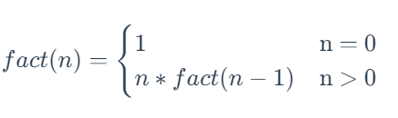
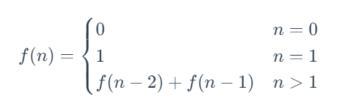

# 递归算法

> **递归（Recursion）**：指的是一种通过重复将原问题分解为同类的子问题而解决的方法。在绝大数编程语言中，可以通过在函数中再次调用函数自身的方式来实现递归。

举个简单的例子来了解一下递归算法。比如阶乘的计算方法在数学上的定义为：



根据阶乘计算方法的数学定义，我们可以使用调用函数自身的方式来实现阶乘函数 fact(n) ，其实现代码可以写作：

```javascript
function fact(n) {
    if (n == 0)
        return 1
    return n * fact(n - 1)
}
```

以 n=6  为例，上述代码中阶乘函数 fact(6)  的计算过程如下：

```python
fact(6)
= 6 * fact(5)
= 6 * (5 * fact(4))
= 6 * (5 * (4 * fact(3)))
= 6 * (5 * (4 * (3 * fact(2))))
= 6 * (5 * (4 * (3 * (2 * fact(1)))))
= 6 * (5 * (4 * (3 * (2 * (1 * fact(0))))))
= 6 * (5 * (4 * (3 * (2 * (1 * 1)))))
= 6 * (5 * (4 * (3 * (2 * 1))))
= 6 * (5 * (4 * (3 * 2)))
= 6 * (5 * (4 * 6))
= 6 * (5 * 24)
= 6 * 120
= 720
```

根据上面的描述，我们可以把阶乘函数的递归计算过程分为两个部分：

1. 先逐层向下调用自身，直到达到结束条件（即 n==0 ） 
2. 然后再向上逐层返回结果，直到返回原问题的解,即返回 fact(6)==720 。

这两个部分也可以叫做「递推过程」和「回归过程」，如下面两幅图所示：


如上面所说，我们可以把「递归」分为两个部分：「递推过程」和「回归过程」。

- **递推过程**：指的是将原问题一层一层地分解为与原问题形式相同、规模更小的子问题，直到达到结束条件时停止，此时返回最底层子问题的解。
- **回归过程**：指的是从最底层子问题的解开始，逆向逐一回归，最终达到递推开始时的原问题，返回原问题的解。

「递推过程」和「回归过程」是递归算法的精髓。从这个角度来理解递归，递归的基本思想就是： **把规模大的问题不断分解为子问题来解决。**

## 递归实现步骤

上面我们提到，递归的基本思想就是： **把规模大的问题不断分解为子问题来解决。** 那么，在写递归的时候，我们可以按照这个思想来书写递归，具体步骤如下：

1. **写出递推公式**：找到将原问题分解为子问题的规律，并且根据规律写出递推公式。
2. **明确终止条件**：推敲出递归的终止条件，以及递归终止时的处理方法。
3. 将递推公式和终止条件翻译成代码：
   1. 定义递归函数（明确函数意义、传入参数、返回结果等）。
   2. 书写递归主体（提取重复的逻辑，缩小问题规模）。
   3. 明确递归终止条件（给出递归终止条件，以及递归终止时的处理方法）

## 递归的注意点

### 免栈溢出

在程序执行中，递归是利用堆栈来实现的。每一次递推都需要一个栈空间来保存调用记录，每当进入一次函数调用，栈空间就会加一层栈帧。每一次回归，栈空间就会减一层栈帧。由于系统中的栈空间大小不是无限的，所以，如果递归调用的次数过多，会导致栈空间溢出。

为了避免栈溢出，我们可以在代码中限制递归调用的最大深度来解决问题。当递归调用超过一定深度时（比如 100）之后，不再进行递归，而是直接返回报错。

当然这种做法并不能完全避免栈溢出，也无法完全解决问题，因为系统允许的最大递归深度跟当前剩余的占空间有关，事先无法计算。

如果使用递归算法实在无法解决问题，我们可以考虑将递归算法变为非递归算法（即递推算法）来解决栈溢出的问题。

### 避免重复运算

在使用递归算法时，还可能会出现重复运算的问题。

比如斐波那契数列的定义是：



其对应的递归过程如下图所示：


从图中可以看出：想要计算 f(5) ，需要先计算 f(3) 和 f(4) ，而在计算 f(4) 时还需要计算 f(3) ，这样 f(3) 就进行了多次计算。同理 f(0) 、f(1) 、f(2)  都进行了多次计算，就导致了重复计算问题。

为了避免重复计算，我们可以使用一个缓存（哈希表、集合或数组）来保存已经求解过的 f(k) 的结果，这也是动态规划算法中的做法。当递归调用用到 f(k) 时，先查看一下之前是否已经计算过结果，如果已经计算过，则直接从缓存中取值返回，而不用再递推下去，这样就避免了重复计算问题。


## 递归算法转化为非递

将递归算法转化为非递归过程通常涉及到使用**栈（Stack）来模拟递归的调用栈**。

递归函数在每次调用自身时，都会将局部变量和返回地址压入调用栈中，而非递归方法则使用显式栈来手动管理这些信息。

以下是将递归算法转化为非递归过程的一般步骤：

1. **理解递归算法**：
   首先，你需要深入理解递归算法的工作原理。理解它如何分割问题、如何保存中间状态以及如何组合子问题的解来得到最终解。
2. **确定需要保存的信息**：
   递归函数通常会在每次调用时保存一些状态或信息。在转化为非递归形式时，你需要确定哪些信息需要保存下来以便后续使用。这些信息通常包括局部变量、参数和可能的返回地址（虽然对于非递归方法，我们不需要实际的返回地址，但可能需要保存中间结果）。
3. **创建栈**：
   使用栈来模拟递归的调用栈。栈是一种后进先出（LIFO）的数据结构，非常适合用来保存函数调用过程中的信息。
4. **初始化**：
   设置非递归过程的初始状态。这可能包括初始化栈、设置循环变量或其他必要的变量。
5. **循环和迭代**：
   使用一个循环（如while循环）来迭代地执行原本递归函数会做的操作。在每次迭代中，你都会从栈中取出信息，执行相应的操作，然后将需要的信息压回栈中（如果需要的话）。
6. **处理栈顶元素**：
   在每次循环迭代中，从栈顶取出元素（这通常是上一次递归调用中的信息）。根据这些信息执行相应的操作，并更新其他必要的状态或变量。
7. **更新栈**：
   如果算法还需要进一步的迭代或计算（即，如果原递归函数还会调用自身），那么就需要将新的信息压入栈中。这些信息可能包括新的参数、局部变量或中间结果。
8. **终止条件**：
   确定非递归过程的终止条件。这通常是基于栈是否为空、是否达到某个特定的迭代次数或是否满足某个特定的条件。
9. **返回结果**：
   当非递归过程达到终止条件时，返回结果。这个结果可能是栈顶元素的值，也可能是基于栈中所有元素计算得到的值。
10. **测试和调试**：
    最后，你需要测试和调试你的非递归过程以确保它与原始的递归函数有相同的行为和结果。

注意：虽然将递归算法转化为非递归过程在某些情况下可能是有益的（例如，为了优化性能或避免栈溢出），但它也可能使代码更加复杂和难以理解。因此，在决定是否进行这种转换时，需要权衡利弊。

---


## 应用

### ElementUI 级联选择器选中对象匹配

**题目：**

在 [elements-ui 级联选择器](https://element.eleme.cn/#/zh-CN/component/cascader) 选择器中，级联选项的下拉配置项 `options` 是一个含有 `children` 属性的递归数组对象，结构如下：

```js
 options: [{
          value: 'zhinan',
          label: '指南',
          children: [{
            value: 'shejiyuanze',
            label: '设计原则',,
            other: '其他附加字段1'
            children: [{
              value: 'yizhi',
              label: '一致',
               other: '其他附加字段2'
            }, {
              value: 'fankui',
              label: '反馈',
               other: '其他附加字段3'
            }, {
              value: 'xiaolv',
              label: '效率',
               other: '其他附加字段4'
            }, {
              value: 'kekong',
              label: '可控',
               other: '其他附加字段5'
            }]
          }, 
          {
            value: 'daohang',
            label: '导航',,
             other: '其他附加字段6'
            children: [{
              value: 'cexiangdaohang',
              label: '侧向导航',
              children: [
                {
                  value: 'cexiangdaohang1',
                  label: '侧向导航1',
                  other: '其他附加字段7'
                },
                {
                  value: 'cexiangdaohang2',
                  label: '侧向导航2',
                  other: '其他附加字段8'
                }
             ],
            }, 
            {
              value: 'dingbudaohang',
              label: '顶部导航',
              other: '其他附加字段9'
            }]
          }]
```

级联选项 `options` 可以通过后端接口返回，嵌套层级动态变化，级联组件 `change` 事件回调中，传入参数为选中值的 value 数组，并且按照级联层级返回，如，选中以上选项中的 `侧向导航1` 后，  `change` 事件回调参数为:

```js
['daohang','cexiangdaohang', 'cexiangdaohang1']
```

请根据以上内容，获取级联选择器中选中值对象的 `other` 字段内容。

**思路一： 栈**

>   `change` 事件回调参数中无法直接获取 `options` 选项中的对象，要想获取 `options` 选项中选中值的 `other` 字段内容，必须先通过遍历 `options` 获取选中值的对象；
>
> 根据  `change` 事件回调参数，通过深度遍历，递归 `options` 选项对象，获取选中对象：
>
> 1. 初始化栈，保存 `options`  的对象；
> 2. 初始化  `change` 事件回调参数回调队列 `values`;
> 3. 循环遍历栈，判断栈是否为空，不为空执行以下操作：
>    1. 弹出栈内容，获取选项`opt`;
>    2. 队列 `values`出队列，获取 `val;
>    3. 过滤查找 `opt` 数组中的 value 属性等于 val 的对象 `opts` ；
>    4. 判断对象 `opts[0]` 是否有 `children` ，有，则将  `opts[0]`  入栈；
> 4. 返回 `opt` 对象

```js
    /**获取 other 属性
   	 * select 选中 values 回调参数，数组，内容为选项 value 组成数组
   	 * options 下拉选项
	**/
    getOtherParams(select,options) {
      const opt = this.selectedOption(
        JSON.parse(JSON.stringify(options)),
        JSON.parse(JSON.stringify(select))
      );
      if (opt && opt.length > 0) {
        return opt[0]?.other;
      }
      return null;
    },

    // 获取部门下拉对象
    selectedOption(options, select) {
      // 初始化栈，为初始下拉选项数据
      const stacks = [options];
      // 选中值数组队列
      let ids = select; 
      let opts = null;
      // 栈不为空或 id不为空，
      while (stacks.length > 0 && ids && ids.length > 0) {
        let opt = stacks.pop();
        let id = ids.shift();
        opts = opt && opt.filter((o) => o.id === id);
        if (opts && opts[0].children) {
          stacks.push(opts[0].children);
        }
      }
      return opts;
    },
```


## 算法题

| 题号          | 标题                                                         | 标签                             | 难度 |
| :------------ | :----------------------------------------------------------- | :------------------------------- | :--- |
| 0024          | [两两交换链表中的节点](https://leetcode.cn/problems/swap-nodes-in-pairs/) | 递归、链表                       | 中等 |
| 0118          | [杨辉三角](https://leetcode.cn/problems/pascals-triangle/)   | 数组、动态规划                   | 简单 |
| 0119          | [杨辉三角 II](https://leetcode.cn/problems/pascals-triangle-ii/) | 数组、动态规划                   | 简单 |
| 0206          | [反转链表](https://leetcode.cn/problems/reverse-linked-list/) | 递归、链表                       | 简单 |
| 0021          | [合并两个有序链表](https://leetcode.cn/problems/merge-two-sorted-lists/) | 递归、链表                       | 简单 |
| 0509          | [斐波那契数](https://leetcode.cn/problems/fibonacci-number/) | 递归、记忆化搜索、数学、动态规划 | 简单 |
| 0050          | [Pow(x, n)](https://leetcode.cn/problems/powx-n/)            | 递归、数学                       | 中等 |
| 0779          | [第K个语法符号](https://leetcode.cn/problems/k-th-symbol-in-grammar/) | 位运算、递归、数学               | 中等 |
| 剑指 Offer 62 | [圆圈中最后剩下的数字](https://leetcode.cn/problems/yuan-quan-zhong-zui-hou-sheng-xia-de-shu-zi-lcof/) | 递归、数学                       | 简单 |


### [斐波那契数](https://leetcode.cn/problems/fibonacci-number/description/)

#### 题目

**斐波那契数** （通常用 `F(n)` 表示）形成的序列称为 **斐波那契数列** 。该数列由 `0` 和 `1` 开始，后面的每一项数字都是前面两项数字的和。也就是：

```
F(0) = 0，F(1) = 1
F(n) = F(n - 1) + F(n - 2)，其中 n > 1
```

给定 `n` ，请计算 `F(n)` 。

 

**示例 1：**

```
输入：n = 2
输出：1
解释：F(2) = F(1) + F(0) = 1 + 0 = 1
```

**示例 2：**

```
输入：n = 3
输出：2
解释：F(3) = F(2) + F(1) = 1 + 1 = 2
```

**示例 3：**

```
输入：n = 4
输出：3
解释：F(4) = F(3) + F(2) = 2 + 1 = 3
```


#### 方法一：递归

1. 根据题意可知，fib(n) 的值依赖 fib(n-1) 和 fib(n-2) 的结果，因此使用递归可以计算出；
2. 递归终止条件：当 (n <= 1) 时，fib(n) = n;

```typescript
function fib(n: number): number {
  if (n <= 1) return n
  return fib(n - 1) + fib(n - 2)
};
```

这个递归函数对于较小的n值可以工作得很好，但是对于较大的n值，它会非常慢，因为它进行了大量的重复计算。

#### 方法二：动态规划

为了避免重复计算和递归调用栈的开销，我们可以使用迭代算法和动态规划的思想来存储中间结果。


```javascript
function fibonacciIterative(n) {  
    if (n <= 1) {  
        return n;  
    }  
      
    let prev = 0;  // 前一个值，初始值为 f(0) 的值
    let curr = 1;   // 滚动到的当前值，初始值为 f(1) 的值
    let result = 0;  // 计算结果
	// 当大于二时候，滚动计算所有 [2,n] 的值
    for (let i = 2; i <= n; i++) {  
        result = prev + curr;  // 斐波那契数 第n个值：F(n) = F(n - 1) + F(n - 2)
        prev = curr;  // 往后滚动，当前值变为后一个值
        curr = result;  // 结果值变化为当前值
    }  
  
    return result;  
}  
  
console.log(fibonacciIterative(10)); // 输出：55
```

在这个非递归版本中，我们使用两个变量`prev`和`curr`来存储前两个斐波那契数，并在每次迭代中计算下一个斐波那契数。这种方法只需要O(n)的时间和O(1)的额外空间（不考虑结果存储）来计算第n个斐波那契数，比递归方法要高效得多。应用


### [杨辉三角](https://leetcode.cn/problems/pascals-triangle/description/)

#### 题目

给定一个非负整数 *`numRows`，*生成「杨辉三角」的前 *`numRows`* 行。

在「杨辉三角」中，每个数是它左上方和右上方的数的和。


 

**示例 1:**

```
输入: numRows = 5
输出: [[1],[1,1],[1,2,1],[1,3,3,1],[1,4,6,4,1]]
```

**示例 2:**

```
输入: numRows = 1
输出: [[1]]
```


#### 解法：递推法

观察杨辉三角可以发现以下规律：

* 大小为 numRows 的杨辉三角有 numRows 行；
* 每一行的第一位和最后一位数字一定为 1；
* 当 numRows 大于 3 时，第i行的每一个数组的第 j 个数字等于第 i-1 行的第 j-1 和第 j 个数字和
  * 既 `  triangle[i][j] = triangle[i - 1][j - 1] + triangle[i - 1][j]`;

```javascript
function generate(numRows: number): number[][] {
  // 构造numRows大小的二维数组,每一个数组都为空数组
  let triangle = new Array(numRows).fill([])
  for (let i = 0; i < numRows; i++) {
    // 所有数组填充初始值0
    triangle[i] = new Array(i + 1).fill(0)
    // 第i行数组的第一个和第 i 个数为 1
    triangle[i][0] = 1
    triangle[i][i] = 1
    // 当大于第三行时，第i行的每一个数组的第 j 个数字等于第 i-1 行的第 j-1 和第 j 个数字和 
    for (let j = 1; j < i; j++) {
      triangle[i][j] = triangle[i - 1][j - 1] + triangle[i - 1][j]
    }
  }
  return triangle
};
```

