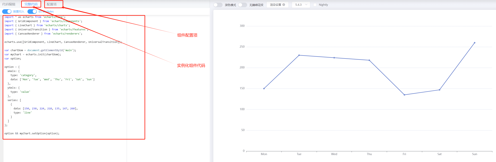
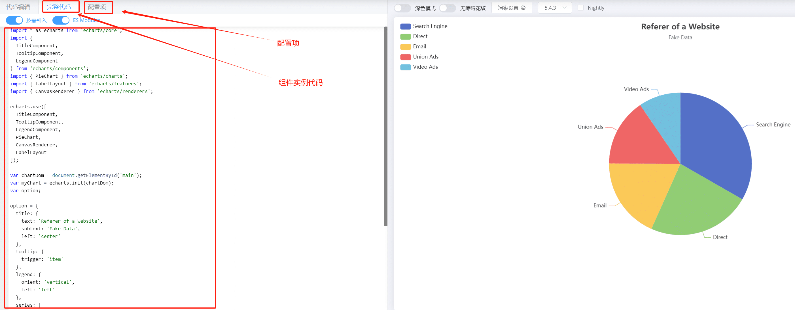

# Echarts 二次封装

## 为什么要对 Echarts 二次封装？

 对Echarts进行二次封装的主要目的是提高开发效率、提供更好的可维护性和可扩展性，以及简化Echarts在项目中的使用。

下面是一些常见的原因：

1. **简化接口和配置：** Echarts本身提供了强大的功能和灵活的配置选项，但有时候配置项较多且复杂，使用起来不够直观。通过二次封装，可以根据具体业务场景，将常用的配置项进行封装，提供简化的接口和配置，使开发者能够更快速地使用Echarts，并减少配置错误的可能性。
2. **提供默认值和样式：** 在项目中使用Echarts时，经常需要设置一些默认的配置和样式，以确保图表的一致性和美观性。通过二次封装，可以在封装组件中设置默认值和样式，避免在每个使用Echarts的地方重复设置，提高代码的复用性。
3. **封装常用交互和动画效果：** Echarts提供了各种交互和动画效果，如图例切换、数据筛选、平滑动画等。在特定项目中，可能需要针对这些交互和动画效果进行封装和定制，以满足项目需求，并提供更好的用户体验。
4. **统一数据处理和数据请求：** 在实际项目中，往往需要通过接口获取数据，然后将数据传递给Echarts进行展示。通过二次封装，可以将数据处理和数据请求的逻辑封装在组件内部，使得使用者只需要关注数据传递和展示，提高开发效率和代码可维护性。
5. **抽象复杂的图表组件：** 在某些场景下，可能需要构建一些复杂的图表组件，包含多个图表类型的组合、联动操作等。通过二次封装，可以将这些复杂的图表组件进行抽象和封装，提供更高级的接口和功能，降低使用的复杂度，并提高代码的可读性和可维护性。

总结来说，对Echarts进行二次封装可以简化接口和配置、提供默认值和样式、封装常用交互和动画效果、统一数据处理和数据请求，以及抽象复杂的图表组件。这样的封装可以减少重复代码、提高开发效率、提供更好的可维护性和可扩展性，同时也可以使得Echarts在项目中更易于使用和管理。

## Echart 封装流程

下面通过分析常见折线图、柱状图和饼状图的 echart 官方示例和配置项，来一步步对 echarts 进行封装

### 官方 demo 分析

下面是一个简单的折线图官方示例：



> Echarts 折线图主要分为 组件代码和 options 配置项两个部分

下面是一个简单的柱状图官方示例：


> Echarts 柱状图主要分为 组件代码和 options 配置项两个部分



> Echarts 饼图主要分为 组件代码和 options 配置项两个部分

通过以上分析可知，一个 echart 组件分为两个部分：

* 组件实例
* 组件配置项

组件实例中，进行了 Echart 组件初始化和设置组件 options 两个动作，组件配置项是配置组件示例展示样式的配置；

因此，可以将组件实例化过程和组件配置化进行解耦，将各自单独封装成一个公共的方法或组件；

下面对折线图、柱状图和饼状图进行封装，详细讲解封装过程

### **文件结构**


```js
├── Echarts
│  ├── mixins // 公共 mixins
│  │	├── common.js // echart 组件公共方法和初始化操作
│  ├── options // 图表公共的 options 配置项
│  │    ├── bar.js // 条形图 options 配置项
│  │    ├── common.js // echart 公共预设 options 配置项
│  │    ├── guage.js // guage图 options 配置项
│  │    ├── line.js // 折线图 options 配置项
│  │    ├── pie.js // 饼状图 options 配置项
│  ├── theme // 图表公共的 options 配置项
│  │    ├── thieme.scss // 主题样式
│  │    ├── trical.json // 主题样式配置
│  ├── Bar.vue // 条形图组件
│  ├── Guage.vue // guage图组件
│  ├── Line.vue // 折线图组件
   └── Pie.vue // 饼图组件
```

### **组件公共操作封装**

在 vue2 中使用 mixins 对组件公共操作进行封装，公共 mixins 主要做以下操作：

* 定义公共属性；
* 初始化 echarts 实例；
* 绑定事件到 echarts 实例；
* 监听数据变化，重置 echarts options 选项；
* 监听屏幕大小变化，动态调整图形大小；


```js
/**
 * 所有 Echart 图表公共方法、属性
 */

import * as echarts from 'echarts/core'
// 引入echart 主题问题件
// import macarons from '../theme/macarons' //原来主题
// 调色后主题
import macarons from '../theme/trical'
import {
  TitleComponent,
  TooltipComponent,
  DatasetComponent,
  TransformComponent,
  LegendComponent,
  MarkLineComponent,
  GridComponent,
  DataZoomComponent,
  ToolboxComponent
} from 'echarts/components'
// 标签自动布局，全局过渡动画等特性
import { LabelLayout, UniversalTransition } from 'echarts/features'
// 引入 Canvas 渲染器，注意引入 CanvasRenderer 或者 SVGRenderer 是必须的一步
import { CanvasRenderer } from 'echarts/renderers'
import { debounce } from '@/utils'
export default {
  props: {
    // 所有 echart 共有属性

    className: {
      type: String,
      default: 'chart'
    },
    width: {
      type: String,
      default: '100%'
    },
    height: {
      type: String,
      default: '100%'
    },
    options: {
      type: Object,
      default: function() {
        return {}
      }
    },
    data: {
      type: [Array, Object],
      default: function() {
        return null
      }
    },
    loading: {
      type: Boolean,
      default: false
    },
    params: {
      type: Object,
      default: () => {}
    },
    // show tips icons
    showTips: {
      type: Boolean,
      default: true
    }
  },

  data() {
    return {
      $_sidebarElm: null, // 侧边栏
      $_resizeHandler: null,
      chart: null, // echart 实例
      tips: null // 图标计算公式提示
    }
  },
  watch: {
    data: {
      handler(value) {
        this.setOption()
        this.setTips(value && value.msg)
      },
      deep: true
    },
    loading(status) {
      if (!this.chart) return
      status
        ? this.chart.showLoading({
          text: '正在加载...',
          maskColor: 'rgba(0, 0, 0,0)',
          color: 'rgb(255,255,255)',
          textColor: '#fff'
        })
        : this.chart.hideLoading()
    }
  },
  beforeCreate() {
    echarts.use([
      // 注册所有图表公共组件
      TitleComponent,
      TooltipComponent,
      CanvasRenderer,
      DatasetComponent,
      LabelLayout,
      TransformComponent,
      UniversalTransition,
      LegendComponent,
      MarkLineComponent,
      GridComponent,
      DataZoomComponent,
      ToolboxComponent
    ])
  },
  mounted() {
    this.initListener() // 初始化尺寸监听器
    this.initCharts() // 初始化 echart
    this.bindEvent()
  },
  activated() {
    if (!this.$_resizeHandler) {
      // avoid duplication init
      this.initListener()
    }

    // when keep-alive chart activated, auto resize
    this.resize()
  },
  beforeDestroy() {
    this.destroyListener() // 销毁尺寸监听器
    this.destroyChartInst() // 销毁 echart
  },
  deactivated() {
    this.destroyListener()
  },
  methods: {
    // 初始化echart 注册 和设置主题颜色：macarons

    initCharts() {
      // 颜色主题
      echarts.registerTheme('macarons', macarons)
      this.chart = echarts.init(document.getElementById(this.id), 'macarons')
      this.charOptions && this.chart && this.chart.setOption && this.chart.setOption(this.charOptions)
    },
    bindEvent() {
      if (!this.chart) return
      const that = this
      const events = [
        'click',
        'dblclick',
        'mousedown',
        'mousemove',
        'mouseup',
        'mouseover',
        'mouseout',
        'globalout',
        'contextmenu',
        'legendselectchanged'
      ]
      events.forEach(eventName => {
        this.chart.on(eventName, function(params) {
          that.$emit(`chart-${eventName}`, params)
        })
      })
    },
    // 设置提示文案
    setTips(tips = null) {
      this.tips = tips
    },
    // use $_ for mixins properties
    // https://vuejs.org/v2/style-guide/index.html#Private-property-names-essential
    $_sidebarResizeHandler(e) {
      if (e.propertyName === 'width') {
        this.$_resizeHandler()
      }
    },
    // 初始化尺寸监听器
    initListener() {
      const that = this
      this.$_resizeHandler = debounce(() => {
        that.resize()
      }, 100)
      window.addEventListener('resize', this.$_resizeHandler)

      this.$_sidebarElm = document.getElementsByClassName(
        'sidebar-container'
      )[0]
      this.$_sidebarElm &&
        this.$_sidebarElm.addEventListener(
          'transitionend',
          this.$_sidebarResizeHandler
        )
    },
    // 销毁尺寸监听器
    destroyListener() {
      window.removeEventListener('resize', this.$_resizeHandler)
      this.$_resizeHandler = null

      this.$_sidebarElm &&
        this.$_sidebarElm.removeEventListener(
          'transitionend',
          this.$_sidebarResizeHandler
        )
    },
    destroyChartInst() {
      if (!this.chart) {
        return
      }
      this.chart.clear()
      this.chart.dispose()
      this.chart = null
    },
    resize() {
      const { chart } = this
      chart && chart.resize()
    },
    setOption() {
      if (!this.chart) return
      this.chart.clear()
      this.charOptions && this.chart.setOption(this.charOptions)
    }
  }
}

```

### **图形组件封装**

通过封装了所有 Echart 图形的公共 mixins 后，在封装单独图形时候，只要在各种图形独自的代码封装到组件即可，各种图形差异除了 mixins 的公共操作外，主要差异是 Echarts 的按需引入的不同组件 和 传入的 options 不同，因此各种图形的组件主要操作为：

* 按需引入图形 Echart 组件
* 引入图形 options 

条形图组件封装`/Bar.vue`  

```vue
<template>
  <div class="container">
    <Tips v-if="showTips && tips" class="tips" :tips="tips" />
    <div :id="id" :style="{ height: height, width: width }" />
  </div>
</template>

<script>
import * as echarts from 'echarts/core'
import { BarChart } from 'echarts/charts'
import { barOptions } from './options/bar.js'
import Tips from './Tips.vue'
import {
  GridComponent,
  ToolboxComponent,
  TooltipComponent,
  LegendComponent,
  MarkLineComponent,
  MarkPointComponent
} from 'echarts/components'
import common from './mixins/common'
export default {
  name: 'Bar',
  components: {
    Tips
  },
  mixins: [common],
  props: {
    id: {
      type: String,
      default: 'BarChart',
      require: true
    }
  },
  computed: {
    charOptions() {
      return barOptions(this)
    }
  },
  created() {
    // 注册必须的组件
    echarts.use([
      BarChart,
      ToolboxComponent,
      TooltipComponent,
      GridComponent,
      LegendComponent,
      MarkLineComponent,
      MarkPointComponent
    ])
  }
}
</script>

<style lang="scss" scoped>
.container {
  position: relative;
  .tips {
    z-index: 1000000000;
    position: absolute;
    right: 5px;
    top: 0;
  }
}
</style>

```


折线图组件封装`/Line.vue`  

```vue
<template>
  <div class="container">
    <Tips v-if="showTips && tips" class="tips" :tips="tips" />
    <div :id="id" :class="className" :style="{ height: height, width: width }" />
  </div>
</template>

<script>
import * as echarts from 'echarts/core'
import { LineChart } from 'echarts/charts'
import common from './mixins/common'
import { lineOptions } from './options/line'
import Tips from './Tips.vue'
import {
  TitleComponent,
  ToolboxComponent,
  TooltipComponent,
  GridComponent,
  LegendComponent,
  MarkPointComponent,
  MarkLineComponent
} from 'echarts/components'
export default {
  components: {
    Tips
  },
  mixins: [common],
  props: {
    id: {
      type: String,
      default: 'lineChart',
      require: true
    }
  },
  computed: {
    charOptions() {
      return lineOptions(this)
    }
  },
  beforeCreate() {
    echarts.use([
      TitleComponent,
      ToolboxComponent,
      TooltipComponent,
      GridComponent,
      LegendComponent,
      MarkPointComponent,
      MarkLineComponent,
      LineChart
    ])
  }
}
</script>
<style lang="scss" scoped>
.container {
  position: relative;
  .tips {
    z-index: 1000000000;
    position: absolute;
    right: 5px;
    top: 0;
  }
}
</style>

```


饼图组件封装`/Pie.vue`  

```vue
<template>
  <div class="container">
    <Tips v-if="showTips && tips" class="tips" :tips="tips" />
    <div :id="id" :class="className" :style="{ height: height, width: width }" />
  </div>
</template>

<script>
import * as echarts from "echarts/core";
import { PieChart } from "echarts/charts";
import common from "./mixins/common";
import { pieOptions } from "./options/pie";
import Tips from "./Tips.vue";

export default {
  mixins: [common],
  props: {
    id: {
      type: String,
      default: "pieChart",
      require: true,
    },
  },
  components: {
    Tips,
  },
  computed: {
    charOptions() {
      return pieOptions(this);
    },
  },
  beforeCreate() {
    echarts.use([PieChart]);
  },
};
</script>
<style lang="scss" scoped>
.container {
  position: relative;
  .tips {
    z-index: 1000000000;
    position: absolute;
    right: 5px;
    top: 0;
  }
}
</style>

```


### **图形配置项 Options 封装**

通过分析官方文档和示例可知，所有 Echarts 统计图的主要差异在于配置项 `options` 配置不同，因此在组件中可以通过配置不同的 options 实现显示不同图形；

Echart 所有的配置项，可以参考文档 [Echart options](https://echarts.apache.org/zh/option.html#title)，通过分析官方示例和文档，可以看到常用 options  为如下(不同图形主要 options 不同)：

*  `toolbox`: 图例提示工具
* `title`： 标题
* `grid`: 网格
* `xAxis`: x轴
* `yAxis` : y轴
* `series` : 图形系列

每种图形的 options 配置不同，可以将以上常用配置设置一些预设样式的配置，在 `./options/common.js` 文件中配置公共的 options：

```js
import echart from '../theme/theme.scss'
import { sumArray } from '@/utils/index.js'
/**
 * 柱状图平均值线配置
 * */
export function getMarkLine(options = {}, data = null) {
  return {
    symbol: options.showAverage ? 'circle' : 'none',
    data: [
      {
        type: 'average',
        label: { // 自定义显示标签
          normal: {
            show: !!options.showAverage,
            color: 'inherit',
            formatter: function(params) {
              if (!data || !data.series) return 0
              const series = data.series[params.seriesIndex]
              const dataSet = series && series.data
              if (!dataSet) return 0
              const average = sumArray(dataSet) / dataSet.length
              return average.toFixed(2)
            },
            type: 'solid'
          }
        },
        lineStyle: {
          normal: {
            width: options.showAverage ? 2 : 0,
            type: 'dashed'
          }
        }
      }
    ]
  }
}

/**
 * 提示工具配置
 */
export function getTooltip(options = {}) {
  return {
    trigger: 'axis',
    axisPointer: {
      type: 'cross'
    },
    formatter: function(params) {
      if (options.dataset) {
        let relVal = params[0].name
        for (let i = 0, l = params.length; i < l; i++) {
          relVal += '<br/>' + params[i].marker + params[i].seriesName + ' : ' + params[i].value[params[i].seriesName] + `' (${options.unit || 'h'})'`
        }
        return relVal
      } else {
        let relVal = ''
        params.forEach(item => {
          if (item.value) {
            relVal += `${item.marker}${item.seriesName}: ${item.value} ${options.unit || '(h)'}` + '<br/>'
          } else {
            relVal += `${item.marker}${item.seriesName}: 暂无数据 <br/>`
          }
        })

        return relVal
      }
    },
    show: true
  }
}

/**
 * 工具栏配置
 */
export function getToolBox(options = {}) {
  return {
    show: options.showToolBox,
    orient: 'horizontal', // 工具栏icon的布局朝向
    itemSize: 16, // 工具栏icon的大小
    itemGap: 18, // item之间的间距
    right: 45, // toolbox的定位位置
    top: 0,
    iconStyle: {
      color: '#fff',
      borderColor: '#000'
    },
    emphasis: {
      iconStyle: {
        borderColor: echart.$fontColor || echart.fontColor// 注意: mac 中无法获取 $变量, mac中直接通过变量名获取
      }
    },
    feature: { // 控制工具栏
      saveAsImage: { show: true, title: '导出图片' } // 导出图片
      // dataView: { show: true, readOnly: false },
      // dataZoom: { show: true, title: { zoom: '区域缩放', back: '区域还原' }}, // 数据区域缩放
      // restore: { show: true, title: '重置' } // 重置
    }
  }
}
/**
 *X轴、Y轴的文字调节显示
 */
export const axisLabel = {
  interval: '0',
  rotate: '0',
  fontSize: 14,
  textStyle: {
    color: '#222222',
    margin: 10
  },
  formatter: function(params) {
    let ytext = params
    if (ytext.length > 14) {
      ytext = ytext.substring(0, 12) + '...'
    }
    return ytext
  }
}
/**
 * Y轴的调节显示
 */
export const yAxis = {
  splitLine: { // 去掉网格线
    lineStyle: {
      type: 'dashed',
      color: '#E8E8E8'
    }
  },
  axisLabel,
  axisLine: {
    show: false
  }
}
export const xAxisFormatter = function(params) {
  let newParamsName = ''// 最终拼接成的字符串
  const paramsNameNumber = params.length// 实际标签的个数
  const provideNumber = 6// 每行能显示的字的个数
  const rowNumber = Math.ceil(paramsNameNumber / provideNumber)// 换行的话，需要显示几行，向上取整
  /**
   * 判断标签的个数是否大于规定的个数， 如果大于，则进行换行处理 如果不大于，即等于或小于，就返回原标签
   */
  // 条件等同于rowNumber>1
  if (paramsNameNumber > provideNumber) {
    /** 循环每一行,p表示行 */
    for (let p = 0; p < rowNumber; p++) {
      let tempStr = ''// 表示每一次截取的字符串
      const start = p * provideNumber// 开始截取的位置
      const end = start + provideNumber// 结束截取的位置
      // 此处特殊处理最后一行的索引值
      if (p === rowNumber - 1) {
        // 最后一次不换行
        tempStr = params.substring(start, paramsNameNumber)
      } else {
        // 每一次拼接字符串并换行
        tempStr = params.substring(start, end) + '\n'
      }
      newParamsName += tempStr// 最终拼成的字符串
    }
  } else {
    // 将旧标签的值赋给新标签
    newParamsName = params
  }
  // 将最终的字符串返回
  return newParamsName
}


```

每种图形的 options 配置不同，各种图形的 options 预设配置放置各自文件中：

条形图 options 配置： `/options/bar.js`

```js
import { recursionObject, isObject } from '@/utils/index.js'
import echart from '../theme/theme.scss'
import { getMarkLine, getTooltip, getToolBox, yAxis, axisLabel } from './common.js'

/**
 *配置series-itemStyle -根据不同的参数配置series
 * @param {*} params 配置参数
 * @returns
 */
class itemStyle {
  constructor({ options, seriesItem }) {
    this.normal = {
      label: {
        show: !options.hiddenLabel,		// 是否隐藏文本
        position: seriesItem?.label?.position || options?.labelPosition || 'top',	// 在上方显示
        textStyle: {
          color: echart.$fontColor || echart.fontColor, // 注意: mac 中无法获取 $变量, mac中直接通过变量名获取
          fontSize: 14
        },
        formatter: function(params) {
          if (options.dataset) { // dataset 形式
            var data = params.data
            if (data[params.seriesName] === null || data[params.seriesName] < 1) return '' // 0不显示
            return data[params.seriesName]// 后续单位需根据不同情况换单位需传参
          } else if (options.labelFormatter) { // 传入自定义label formatter函数
            return options.labelFormatter(params)
          } else {
            return params.value
          }
        }
      }
    }
  }
}

/**
 * 获取条形图默认配置参数
 * @param { Object } options 实例配置参数：
 * {
 *      position: 'top', // 柱状图数字提示位置
 *      isCross: false, // 柱状图是否为横向,
 *      stackIndex: [1, 2], // 堆叠图形下标值
 *      stackLabel: ['label1','label1','label2','label2'] //堆叠图形 label ，相同 label 的图形堆叠在一起
 *      dataset: false, //源数据是否为 dataset 格式
 *      showAverage: true // 是否显示平均线
 * }
  * @param { Object } data 源数据
 */
class defaultOptTemp {
  constructor({ options, data }) {
    this.option = {
      toolbox: getToolBox(options),
      title: { // 标题
        text: options.title || null
      },
      tooltip: getTooltip(options),
      legend: {
        bottom: 0,
        textStyle: {
          color: echart.$fontColor || echart.fontColor, // 注意: mac 中无法获取 $变量, mac中直接通过变量名获取
          fontSize: 16
        },
        show: true
      },
      grid: {
        right: 30
      },
      dataset: (() => {
        if (options.dataset) {
          return {
            dimensions: (() => {
              return Object.keys(data[0])
            })(),
            source: data
          }
        }
        return null
      })(),
      xAxis: {
        data: (() => {
          if (!options.dataset) { // 非数据集格式
            return data && data.xAxis
          }
        })(),
        splitLine: {
          show: options.isCross, // 去掉网格线分割
          lineStyle: {
            type: 'dashed',
            color: '#E8E8E8'
          }
        },
        axisLabel,
        axisLine: {
          lineStyle: {
            color: '#CCCCCC'
          }
        }

      },
      yAxis: options.yAxis || yAxis,
      series: (() => {
        // 数据源使用数据集格式时，series 转换
        if (options.dataset) {
          let seriesLen = 0
          if (data && data[0]) {
            seriesLen = isObject(data[0]) ? Object.keys(data[0]).length - 1 : data[0].length - 1
          }
          // eslint-disable-next-line new-cap
          const seriseArr = []
          for (let i = 0; i < seriesLen; i++) {
            seriseArr.push({
              type: 'bar',
              markLine: getMarkLine(options, data),
              barGap: '20%',
              barCategoryGap: '50%',
              stack: (options.stackIndex && options.stackIndex.indexOf(i) > -1),
              // eslint-disable-next-line new-cap
              itemStyle: new itemStyle({ options })
            })
          }

          return seriseArr
        } else {
          const sameStacksLabel = [] // 相同stack数据,用于判断
          if (!data) {
            return []
          } // 数据源使用常规数据格式时，series 转换
          (data.series && data.series.length > 0) && data.series.forEach((item, index) => {
            item.type = item.type || 'bar'
            item.barMaxWidth = 38
            options.emphasisDsiabled ? null : (item['emphasis'] = {
              focus: 'series'
            })
            item.markLine = getMarkLine(options, data)
            // eslint-disable-next-line new-cap
            item.itemStyle = new itemStyle({ options, seriesItem: item })
            // 使用 stackIndex 指定堆叠下标
            if (options.stackIndex) {
              item.stack = options.stackIndex.indexOf(index) > -1
            }
            if (options.stackLabel) {
              item.stack = options.stackLabel[index]

              // ----------- 堆叠数据添加总数显示 ---------------
              // 查找相同 stack label 的 series
              const sameStacks = data.series.filter(sameStack => sameStack.stack === item.stack)
              // 两个以上相同 stack 的 series，计算所有  series 的总和
              if (sameStacks.length > 1 && sameStacksLabel.indexOf(sameStacks[0].stack) === -1) {
                const totalStack = JSON.parse(JSON.stringify(sameStacks[0]))
                // 保存已经计算总数的 stack
                sameStacksLabel.push(totalStack.stack)
                // 获取总数的 stack
                const totalStackData = [] // 相同 stack 的数据总和
                totalStack.data.forEach((ts, tsIndex) => {
                  let total = 0
                  sameStacks.forEach(st => {
                    total = st.data[tsIndex] + total
                  })
                  totalStackData.push(total)
                })
                totalStack.data = totalStackData
                const totalLabel = {
                  show: true,		// 开启显示
                  position: 'top',
                  offset: options.stackTotalLabelPosion || [0, 0],
                  textStyle: {
                    color: echart.$fontColor || echart.fontColor, // 注意: mac 中无法获取 $变量, mac中直接通过变量名获取
                    fontSize: 16
                  },
                  formatter: function(params) {
                    return '{total|' + `${totalStackData[params.dataIndex].toFixed(1)}}` + `\n ${params.value}`
                  },
                  rich: {
                    total: {
                      color: echart.$standardColor || echart.standardColor, // 注意: mac 中无法获取 $变量, mac中直接通过变量名获取
                      fontSize: 16
                    }
                  }
                }
                // 查找总数 stack 的位置,并将 总数 series 插入
                for (let i = data.series.length - 1; i >= 0; i--) {
                  if (data.series[i].stack === totalStack.stack) {
                    data.series[i].itemStyle.normal.label = totalLabel
                    break
                  }
                }
              }
            }
          })

          return data.series || []
        }
      })()
    }
  }
}

export function barOptions(vue) {
  const { data } = vue._props

  /* eslint-disable */
  const getDefaultOpt = new defaultOptTemp({options: vue._props.params,data}).option


  const opt = recursionObject({},getDefaultOpt, vue._props.options)
  //实例传入自定义 series 配置时，递归合并默认 series 配置和实例配置参数
  if(vue._props.options.series) {
    opt.series = recursionObject([],getDefaultOpt.series , vue._props.options.series )
  }
  if(vue.params.dataset && data.length > 1){
     // 纵向bar
    opt.dataset.source = data.reverse()
    opt.dataset.dimensions = Object.keys(data[0])
    
  }
  
  return opt
}


```

折线图 options 配置： `/options/line.js`

```js
import { recursionObject } from '@/utils/index.js'
import echart from '../theme/theme.scss'
import {
  getMarkLine,
  getTooltip,
  getToolBox,
  yAxis,
  axisLabel
} from './common.js'

function getSeriesConfig({ seriesItem, options, params }) {
  return {
    type: 'line',
    areaStyle: {
      opacity: seriesItem?.areaStyle?.opacity || (params.areaStyleOpacity === 0 ? '0' : params.areaStyleOpacity) || 0.2
    },
    emphasis: {
      focus: 'series'
    },
    markLine: getMarkLine()
  }
}
/**
 * 获取默认配置参数
 * @param { Object } lineParams 实例配置参数：
 * {
 *      position: 'top', // 柱状图数字提示位置
 *      isCross: false, // 柱状图是否为横向,
 *      stackIndex: [1, 2], // 堆叠图形下标值
 *      dataset: false, //源数据是否为 dataset 格式
 *      showAverage: true // 是否显示平均线
 * }
 */
class defaultOpt {
  constructor(lineParams) {
    this.options = {
      toolbox: getToolBox(lineParams),
      tooltip: getTooltip(lineParams),
      title: {
        // 标题
        text: '',
        left: 'center',
        textStyle: {
          color: echart.$fontColor || echart.fontColor // 注意: mac 中无法获取 $变量, mac中直接通过变量名获取
        }
      },
      legend: {
        textStyle: {
          color: echart.$fontColor || echart.fontColor, // 注意: mac 中无法获取 $变量, mac中直接通过变量名获取
          fontSize: 16
        },
        show: true
      },

      grid: {
        top: 50,
        left: 50,
        right: 50,
        bottom: 50
      },
      xAxis: {
        type: 'category',
        splitLine: {
          show: lineParams?.xAxis?.splitLine // 去掉网格线
        },
        data: [],
        axisLabel
      },
      yAxis: {
        type: 'value',
        ...yAxis
      },
      series: []
    }
  }
}

export function lineOptions(vue) {
  const { data } = vue._props
  /* eslint-disable */
  const getDefaultOpt = new defaultOpt(vue._props.params).options;
  const opt = recursionObject({}, getDefaultOpt, vue._props.options);
  //使用数据集处理
  if (vue._props.params.dataset && data.length > 1) {
    const dataset = {
      source: data,
      dimensions: Object.keys(data[0])
    };
    opt.dataset = dataset;
    opt.legend.data = Object.keys(data[0]);
  } else {
    //非数据集处理
    opt.xAxis.data = (data && data.xAxis) || [];
    if (data && data.series) {
      opt.series =
        data.series.map(item =>
          Object.assign(
            {},
            item,
            getSeriesConfig({
              series: item,
              options: opt,
              params: vue._props.params
            })
          )
        ) || [];
    }
  }
  return opt;
}

```

饼图 options 配置： `/options/pie.js`

```js
import { recursionObject, isArray } from '@/utils/index.js'
import { getToolBox } from './common.js'
import echart from '../theme/theme.scss'

/**
 * 获取默认配置参数
 * @param { Object } pieParams 实例配置参数：
 * {
 *      position: 'top', // 柱状图数字提示位置
 *      isCross: false, // 柱状图是否为横向,
 *      stackIndex: [1, 2], // 堆叠图形下标值
 *      dataset: false, //源数据是否为 dataset 格式
 *      showAverage: true // 是否显示平均线
 * }
 */
class defaultOpt {
  constructor(pieParams) {
    this.options = {
      toolbox: getToolBox(pieParams),
      title: {
        text: ''
      },
      tooltip: {
        trigger: 'item',
        formatter: function(params) {
          return `${params.marker}${params.name}: ${
            params.value
          } (${pieParams.unit || 'h'})`
        }
      },
      legend: {
        show: pieParams.showLegend,
        bottom: 0
      },
      dataset: {
        dimensions: [],
        source: []
      },
      series: [
        {
          name: '',
          type: 'pie',
          selectedMode: 'single',
          data: [],
          radius: ['0%', '60%'],
          emphasis: {
            itemStyle: {
              shadowBlur: 10,
              shadowOffsetX: 0
            }
          },
          label: {
            overflow: 'breakAll', // 文字超出宽度是否截断或者换行
            color: echart.$fontColor || echart.fontColor, // 注意: mac 中无法获取 $变量, mac中直接通过变量名获取
            textStyle: {
              color: echart.$fontColor || echart.fontColor, // 注意: mac 中无法获取 $变量, mac中直接通过变量名获取
              fontSize: 16
            },
            formatter: function(params) {
              return params.name + '\n' + params.percent + '%'
            }
          },
          labelLine: {
            show: true,
            length: 15,
            length2: 5,
            smooth: true,
            minTurnAngle: 135
          },
          center: ['50%', '50%']
        }
      ]
    }
    if (pieParams?.isNested?.show) {
      const firstSecond = {
        name: pieParams.isNested.firstSecond.name,
        type: 'pie',
        radius: [0, 70],
        minShowLabelAngle: 1,
        selectedMode: 'single',
        // roseType: 'radius',
        encode: {
          itemName: pieParams.isNested.firstSecond.itemName,
          value: pieParams.isNested.firstSecond.value
        },
        label: {
          color: '#00FFF7'
        },
        labelLine: {
          show: true,
          length: 4
        }
      }
      const seriesSecond = {
        name: pieParams.isNested.seriesSecond.name,
        type: 'pie',
        radius: [90, 150],
        minShowLabelAngle: 1,
        selectedMode: 'single',
        // roseType: 'radius',
        encode: {
          itemName: pieParams.isNested.seriesSecond.itemName,
          value: pieParams.isNested.seriesSecond.value
        },
        label: {
          color: echart.$fontColor || echart.fontColor // 注意: mac 中无法获取 $变量, mac中直接通过变量名获取
        },

        labelLine: {
          show: true,
          length: 4
        }
      }
      const newSeries = [firstSecond, seriesSecond]
      this.options.series = newSeries
    }
  }
}
export function pieOptions(vue) {
  const { data = null } = vue._props
  /* eslint-disable */
  const getDefaultOpt = new defaultOpt(vue._props.params).options;
  const opt = recursionObject({}, getDefaultOpt, vue._props.options);

  if (vue._props.params.dataset && data.length > 1) {
    opt.dataset.source = data.reverse();
    opt.dataset.dimensions = Object.keys(data[0]);
  }
  if (data) {
    const len = opt.series?.length || 0;
    if (len === 1) {
      opt.series[0].data = data;
    }
    if (len > 1 && isArray(data)) {
      opt.series.forEach((item, index) => {
        item[index] = data[index];
      });
    }
  }

  return opt;
}

```

### 数据接口封装

Echarts 图形的数据格式有两种：

* 组件  `series.data` ： 每个组件单独配置 data 数组，每种图形都有独自的 data 格式；
* [数据集](https://echarts.apache.org/handbook/zh/concepts/dataset):`数据集（dataset）`是专门用来管理数据的组件。
  * 每个系列都可以在 `series.data` 中设置数据，但是从 ECharts4 支持数据集开始，更推荐使用数据集来管理数据。因为这样，数据可以被多个组件复用，也方便进行 “数据和其他配置” 分离的配置风格。毕竟，在运行时，数据是最常改变的，而其他配置大多并不会改变。

因为在实际开发过程，虽然前端在处理每种图形的数据集方式更加便捷，但是后台在数据组成数据集格式的时候会增加后台的复杂度和工作量，所以在综合考虑后采用单独封装`series.data` 的方式封装统一的数据接口。

下面来分析一下 组件  `series.data`  差异；

下面是一个官方的[折线图的 options 示例](https://echarts.apache.org/examples/zh/editor.html?c=line-stack)：

```js
option = {
  title: {
    text: 'Stacked Line'
  },
  tooltip: {
    trigger: 'axis'
  },
  legend: {
    data: ['Email', 'Union Ads', 'Video Ads', 'Direct', 'Search Engine']
  },
  grid: {
    left: '3%',
    right: '4%',
    bottom: '3%',
    containLabel: true
  },
  toolbox: {
    feature: {
      saveAsImage: {}
    }
  },
  xAxis: {
    type: 'category',
    boundaryGap: false,
    data: ['Mon', 'Tue', 'Wed', 'Thu', 'Fri', 'Sat', 'Sun']
  },
  yAxis: {
    type: 'value'
  },
  series: [
    {
      name: 'Email',
      type: 'line',
      stack: 'Total',
      data: [120, 132, 101, 134, 90, 230, 210]
    },
    {
      name: 'Union Ads',
      type: 'line',
      stack: 'Total',
      data: [220, 182, 191, 234, 290, 330, 310]
    },
    {
      name: 'Video Ads',
      type: 'line',
      stack: 'Total',
      data: [150, 232, 201, 154, 190, 330, 410]
    },
    {
      name: 'Direct',
      type: 'line',
      stack: 'Total',
      data: [320, 332, 301, 334, 390, 330, 320]
    },
    {
      name: 'Search Engine',
      type: 'line',
      stack: 'Total',
      data: [820, 932, 901, 934, 1290, 1330, 1320]
    }
  ]
};
```

>  折线图:
>
> * y轴数据放在  `series.data` , 不同系列名称放在` series.name`
> * x轴数据放在 `xAxis.data`

通过分析[条形图 options 示例](https://echarts.apache.org/examples/zh/editor.html?c=bar-tick-align)，同样是以上配置；

因此，后端只要返回 x 轴数据和 不同系列的名称和对应 y 轴数据即可。

接口格式设计：


> 通过统一的接口路由和请求参数，返回相同的数据格式
>
> * 请求：路由和请求参数统一，通过 `stat_config_key` 字段区分不同业务图形
> * 返回： 返回统一格式，前端通过统一处理 options 将数据填入图形 options

前端通过统一的 Echarts 请求方法请求后端接口：（使用 vuex 封装 actions）

```js
  // 根据参数获取统计图数据
  GetStatistics({ state, commit }, { type = null, params = {} } = {}) {
    // 获取部门选择器的部门/所室/人员id
    const { department_id, ident, stat_config_keys, user_id } = departmentSelected
    if (!department_id || (department_id.length === 0) || !ident || (ident.length === 0) || !stat_config_keys || (stat_config_keys.length === 0) || !user_id || (user_id.length === 0)) {
      commit('CLEAR_CHARTDATA') // 选择器，清空图表数据
      return null
    }
    commit('SET_STATCONFIGKEYS', stat_config_keys)
    const allRequests = []
    if (type) { // 获取单个图表数据
      getStatisticsDatas({
        commit,
        timeRange,
        ident,
        department_id,
        stat_config_key: type,
        user_id,
        params
      })
    } else {
      // 根据用户选中部门，从下拉中获取部门配置的图表，遍历请求图表数据
      stat_config_keys.forEach(stat_config_key => {
        allRequests.push(new Promise((resolve, reject) =>
          getStatisticsDatas({
            commit,
            timeRange,
            ident,
            department_id,
            stat_config_key,
            user_id,
            params
          })))
      })
    }

    return Promise.all(allRequests)
  }

```

> 该方法主要通过封装统一公共请求参数，请求后端接口：
>
> * 公共参数 `type` ：表示业务图形标识。
>   * 即传给后端的 `stat_config_keys` 字段，用于表示请求的图形数据
>   * 一个图形对应一个 `stat_config_keys`；
>   * 当传入 type 参数时候，表示请求单个图表的数据，否则获取所有 `stat_config_keys`，对所有 `stat_config_keys`遍历然后并发请求所有图形数据


### 组件使用

下面通过创建一个条形图示例，演示如何使用封装的 echart 组件：

1. 创建 store 存储图形数据
2. 引入组件实例，配置传入组件参数

**1. 创建 图形 store **

为什么要用 store? 

在我们业务中，所有图形整合到一个页面，存在大量图表数据和请求，初次加载后没有实时刷新数据情况，并且经常不同统计页面有来回切换需求，为了减少服务器压力，并且在再次切回页面快速加载页面，需要使用 store 将图表存在内存中。

创建 store 存储图表数据：

```js

// state 工厂函数
function getDefaultState() {
  return {
    dqaReport: { // 报告统计数据
      series: null,
      xAxis: null
    },

  }
}

/**
 * 部门工作量分析平台-获取统计数据并保存
 * @param {*}
 */
function getStatisticsDatas({ commit, timeRange, ident, department_id, stat_config_key, user_id, params }) {
  getStatistics({ timeRange, ident, department_id, stat_config_key, user_id, ...params }).then(res => {
    const chartHandlerMap = {
      'dqaReport': 'SET_DQAREPORT', // 统计数据
    }
    const handler = res.data.stat_config_key && chartHandlerMap[res.data.stat_config_key]
    commit(handler, res.data)
  })
}

const mutations = {
  // 统计数据
  SET_DQAREPORT: (state, { data }) => {
    state.dqaReport = data
  }
}

const actions = {

  // 根据参数获取统计图数据
  GetStatistics({ state, commit }, { type = null, params = {} } = {}) {
    // 获取用户选择的部门和时间
    const { departmentSelected, timeRange } = state.selector
    if (!departmentSelected || !timeRange) {
      commit('CLEAR_CHARTDATA') // 部门和时间为空，清空图表数据
      return null
    }
    // 获取部门选择器的部门/所室/人员id
    const { department_id, ident, stat_config_keys, user_id } = departmentSelected
    if (!department_id || (department_id.length === 0) || !ident || (ident.length === 0) || !stat_config_keys || (stat_config_keys.length === 0) || !user_id || (user_id.length === 0)) {
      commit('CLEAR_CHARTDATA') // 清空部门/所室/人员选择器，清空图表数据
      return null
    }
    commit('SET_STATCONFIGKEYS', stat_config_keys)
    const allRequests = []
    if (type) { // 获取单个图表数据
      getStatisticsDatas({
        commit,
        timeRange,
        ident,
        department_id,
        stat_config_key: type,
        user_id,
        params
      })
    } else {
      // 根据用户选中部门，从下拉中获取部门配置的图表，遍历请求图表数据
      stat_config_keys.forEach(stat_config_key => {
        allRequests.push(new Promise((resolve, reject) =>
          getStatisticsDatas({
            commit,
            timeRange,
            ident,
            department_id,
            stat_config_key,
            user_id,
            params
          })))
      })
    }

    return Promise.all(allRequests)
  }

}

const state = getDefaultState()
export default {
  namespaced: true,
  state,
  mutations,
  actions
}
```

通过创建 store 后，数据就可以通过以下方式统一获取请求图表数据或单个图表数据

```js
this.$store.dispatch('statistics/GetStatistics')
```

通过 `this.$store.state.statistics.dqaReport` 获取缓存数据

**组件使用**

```vue
<template>
  <div :id="`${id}Container`" class="dept-container">
    <chart-wapper :title="title" direction="right" class="dept-wrapper">
      <template>
        <bar
          :id="id"
          :height="chartHeight"
          :width="width"
          :options="options"
          :data="chartData"
          :loading="loading"
          :params="chartParams"
          @chart-click="chartClick"
        />
      </template>
    </chart-wapper>
    <dialog-container
      :visible.sync="dialogVisible"
      type="DqaReport"
      :params="listQuery"
    />
  </div>
</template>

<script>
import ChartWapper from '@/views/management/product-chart/components/ChartWapper.vue'
import Bar from '@/components/Echarts/Bar'
import echartConfig from '@/components/Echarts/theme/theme.scss'
import DialogContainer from './DialogContainer.vue'
import { commonOptions } from '@/views/management/product-chart/workload/department/aseets/common.js'

export default {
  name: 'DqaReport',
  components: {
    ChartWapper,
    Bar,
    DialogContainer
  },
  props: {
    id: {
      type: [String, Number],
      default: 'DqaReport'
    },
    title: {
      type: String,
      default: 'DQA 任务分类'
    }
  },
  data() {
    return {
      projectType: 1,
      productType: [1, 2, 3],
      width: '100%',
      height: '500px',
      loading: false,
      ranksType: 1,
      dialogVisible: false,
      listQuery: {
        id: null,
        title: null
      }
    }
  },
  computed: {
    chartHeight() {
      return echartConfig.chartHeight
    },
    chartData() {
      return this.$store.state.statistics.dqaReport
    },
    chartParams() {
      return {
        showToolBox: true, // 显示工具栏
        position: 'top', // 柱状图数字提示位置
        isCross: false // 柱状图是否为横向,
      }
    },
    ranksOption() {
      return [
        {
          value: 1,
          label: 'TOP 10'
        },
        {
          value: 2,
          label: '全部'
        }
      ]
    },

    timeRange() {
      return this.$store.state.statistics.selector.timeRange
    },
    options() {
      return {
        ...commonOptions,
        grid: {
          bottom: 40,
          top: 35,
          left: 25,
          right: 50,
          // grid.left grid.right grid.top grid.bottom grid.width grid.height 决定的是包括了坐标轴标签在内的所有内容所形成的矩形的位置
          // 常用于『防止标签溢出』的场景，标签溢出指的是，标签长度动态变化时，可能会溢出容器或者覆盖其他组件。
          containLabel: true
        },
        tooltip: {},
        dataset: {},
        textStyle: {
          fontSize: 14
        },
        xAxis: {
          type: 'category',
          axisLabel: {
            width: 40,
            hideOverlap: true,
            interval: 0,
            overflow: 'break',
            rotate: 0,
            align: 'center',
            verticalAlign: 'top'
          }
        },
        yAxis: {
          name: '时长(h)',
          type: 'value'
        },
        // 获取指定图例颜色值
        color: (() => {
          return [echartConfig.projectColor] // 项目类
        })()
      }
    }
  },
  created() {},
  mounted() {},
  methods: {
    // 点击图例事件
    chartClick(data) {
      this.listQuery = this.chartData.row[data.dataIndex]
      this.dialogVisible = true
    }
  }
}
</script>


```

> 通过引入 Bar 组件，传入以下参数：
>
> * `id`: 一个图表对应一个唯一 id，id冲突将会导致图表无法渲染！
> * `options`： 图形配置项目，在公共方法使用了默认配置，此处配置主要为了当公共配置项不满足需求时候，可以传入此项覆盖预设配置项。
> * `data`： 服务端返回的图形接口数据
> * `params`： 公共配置项目参数

## 参考资料

[echarts](https://echarts.apache.org/handbook/zh/get-started/)
