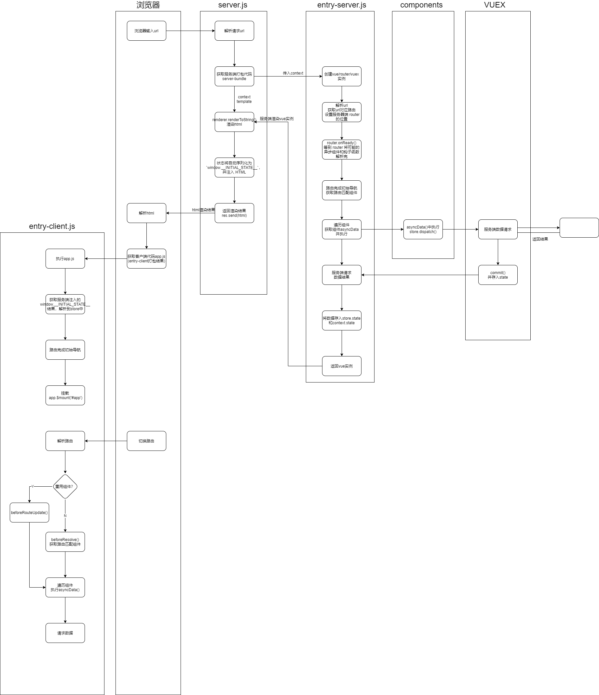
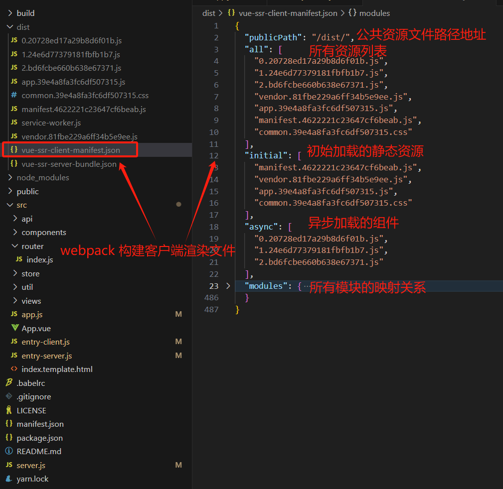

# 从零到一搭建SSR项目

## **SSR是什么**？

Vue.js 是一个用于构建客户端应用的框架。

默认情况下，Vue 组件的职责是在浏览器中生成和操作 DOM。

然而，Vue 也支持将组件在服务端直接渲染成 HTML 字符串，作为服务端响应返回给浏览器，最后在浏览器端将静态的 HTML“激活”(hydrate) 为能够交互的客户端应用。

一个由服务端渲染的 Vue.js 应用也可以被认为是“同构的”(Isomorphic) 或“通用的”(Universal)，因为应用的大部分代码同时运行在服务端和客户端。

> 基础知识参考官方文档[Vue SSR](https://cn.vuejs.org/guide/scaling-up/ssr.html)


## 为什么要用 SSR？

* **更好的 SEO**：搜索引擎爬虫可以直接看到完全渲染的页面。
  * 搜索引擎爬虫是不会等待异步请求数据结束后再抓取信息，SSR 技术在服务器端直接生成 HTML，这意味着爬虫可以直接获取完整的 HTML 页面，而无需等待 JavaScript 代码的执行。

* **更快的首屏加载**：
  * 服务端渲染的 HTML 无需等到所有的 JavaScript 都下载并执行完成之后才显示，所以你的用户将会更快地看到完整渲染的页面。
  * 数据获取过程在首次访问时在服务端完成，相比于从客户端获取，可能有更快的数据库连接。
  * 这通常可以带来更高的[核心 Web 指标](https://web.dev/vitals/)评分、更好的用户体验，而对于那些“首屏加载速度与转化率直接相关”的应用来说，这点可能至关重要。


## **前端渲染架构类型**

前端架构演进方向： **CSR 一> SSR 一> NSR 一> ESR**

具体参考博客：[前端渲染架构 | Sewen 博客 (sewar-x.github.io)](https://sewar-x.github.io/Front-end-Engineering/前端渲染架构/#多页面应用)


## **同构应用原理**

### **组件基于 VNode 渲染**

VNode 本身是 js 对象，**兼容性极强**，不依赖当前的执行的环境，从而可以在服务端渲染及原生渲染。虚拟 DOM 频繁修改，最后比较出真实 DOM 需要更改的地方，可以达到**局部渲染**的目的，**减少性能损耗**。


### **VNode**

VNode是一个虚拟节点，是Virtual Node的缩写。在计算机科学中，VNode是用来描述DOM节点的一种数据结构。

每个VNode对象代表了一个DOM节点，包含了节点的类型、属性、子节点等信息。

在虚拟DOM（Virtual DOM）的概念中，VNode被用作在内存中表示真实DOM的一种方式。例如，当你在浏览器中创建一个新的HTML元素（如`<div>`）时，Vue.js实际上会为这个元素创建一个VNode对象。这个VNode对象就像是一个镜像，它包含了真实DOM元素的所有属性和方法。

**示例**

假设你有一个简单的HTML页面，其中包含一个`<ul>`元素和一个`<li>`元素：

```html
<ul id="app">  
  <li>Item 1</li>  
  <li>Item 2</li>  
</ul>
```

在Vue.js中，当你将这个页面绑定到一个Vue实例时，Vue.js实际上会为每个`<li>`元素创建一个VNode对象。这些VNode对象将用作构建虚拟DOM的基础。当你想在列表中插入一个新的`<li>`元素时，Vue.js会在虚拟DOM中创建一个新的VNode对象，并将其插入到虚拟DOM树中。然后，Vue.js会将这个虚拟DOM树与真实DOM进行同步，从而更新页面上的元素。


## **SSR架构**

> 项目基于 Vue2 SSR 官文 demo 项目 [HackerNews](https://github.com/vuejs/vue-hackernews-2.0/)  进行分析，在阅读之前建议先阅读 [Vue.js 服务器端渲染指南 | Vue SSR 指南 (vuejs.org)](https://v2.ssr.vuejs.org/zh/#什么是服务器端渲染-ssr)


Vue SSR 框架为同构框架，应用代码编译过程 Vue SSR 提供了两个编译入口，服务端应用和客户端应用，作为抹平由于环境不同的代码差异；

由于用例和平台 API 的差异，当运行在不同环境中时，代码将不会完全相同。

对于客户端应用程序和服务器应用程序，我们都要使用 webpack 打包 - 服务器需要「服务器 bundle」然后用于服务器端渲染(SSR)，而「客户端 bundle」会发送给浏览器，用于混合静态标记。


## **项目源码**

SSR 应用包含主要源码：

* 通用代码 `app.js`: 用于服务端渲染和客户端渲染的公共代码。包含应用通用代码、组件、Vuex、路由和页面等。
* 服务端渲染 `Server entry`: 创建返回应用实例，同时还会进行路由匹配和数据的预处理，仅运行于服务器。
* 客户端渲染 `Client entry`:  负责创建应用程序，挂载实例 DOM ，仅运行于浏览器。
* HTTP 服务 `Server.js`:  Node Server，用于接受请求编译服务端渲染的 HTTP 服务。

**通用代码特性**

* 通用代码不可接受特定平台的 API（因此如果你的代码中，直接使用了像 `window` 或 `document`，这种仅浏览器可用的全局变量，则会在 Node.js 中执行时抛出错误，反之也是如此）

**服务端渲染特性**

* 服务器端渲染中**为每个请求创建一个新的根 Vue 实例**，每个请求都是全新的、独立的应用程序实例，以便不会有交叉请求造成的状态污染；
* 将数据进行响应式的过程在服务器上是多余的，所以默认情况下禁用；
* 所有的生命周期钩子函数中，只有 `beforeCreate` 和 `created` 会在服务器端渲染 (SSR) 过程中被调用；
  * 应该避免在 `beforeCreate` 和 `created` 生命周期时产生全局副作用的代码，例如在其中使用 `setInterval` 设置 timer。由于服务端渲染代码在 SSR 期间并不会调用销毁钩子函数，所以 timer 将永远保留下来。
  * 为了避免这种情况，请将副作用代码移动到 `beforeMount` 或 `mounted` 生命周期中。

**客户端渲染特性**

* 任何生命周期钩子函数中的代码（例如 `beforeMount` 或 `mounted`），都会在客户端执行。
* 对于仅浏览器可用的 API，通常方式是，在「纯客户端 (client-only)」的生命周期钩子函数中惰性访问 (lazily access) 它们。


## **源码分析**

> 项目基于 Vue2 SSR 官文 demo 项目 [HackerNews](https://github.com/vuejs/vue-hackernews-2.0/)  进行分析

### **项目目录**


### `app.js`

`app.js` 是我们应用程序的「通用 entry」。

在纯客户端应用程序中，我们将在此文件中创建根 Vue 实例，并直接挂载到 DOM。

在服务器端渲染(SSR)，为每个请求创建一个新的根 Vue 实例，避免请求状态交叉污染。

`app.js` 简单地使用 export 导出一个 `createApp` 函数,该函数在每次调用时创建一个新的 store, router, app实例：

```js
import Vue from 'vue'
import App from './App.vue'
import { createStore } from './store'
import { createRouter } from './router'
import { sync } from 'vuex-router-sync'
import titleMixin from './util/title'
import * as filters from './util/filters'

// 标题 mixin
Vue.mixin(titleMixin)

// 注册全局 utility 过滤器
Object.keys(filters).forEach(key => {
  Vue.filter(key, filters[key])
})
// Node.js 服务器是一个长期运行的进程。当我们的代码进入该进程时，它将进行一次取值并留存在内存中。这意味着如果创建一个单例对象，它将在每个传入的请求之间共享
// 为每个请求创建一个新的根 Vue 实例,避免请求状态交叉污染。暴露一个工厂函数，该函数在每次调用时创建一个新的 store, router, app实例
export function createApp() {
  const store = createStore()
  const router = createRouter()

  // 同步路由和 Vuex 状态，注册 store.state.route
  sync(store, router)

  // create the app instance.
  // here we inject the router, store and ssr context to all child components,
  // making them available everywhere as `this.$router` and `this.$store`.
  // 创建 app 实例,此处注入 router 和 store 和 ssr 上下文到所有子组件,在 vue 实例任何地方可以通过 this.$router 和 this.$store 获取路由和状态对象
  const app = new Vue({
    router,
    store,
    render: h => h(App)
  })
  
  //对外暴露 app,  router 和  store
  // 请注意，我们不在这里挂载应用程序，在浏览器还是在服务器上初始化流程不同
  return { app, router, store }
}

```

### `entry-client.js`

客户端 entry 只需创建应用程序，并且将其挂载到 DOM 中 ，仅运行于浏览器

使用 WebPack 构建后的「客户端 bundle」会发送给浏览器，用于混合静态标记。

客户端 entry 核心代码：

```js
import { createApp } from './app'

// 客户端特定引导逻辑……

const { app } = createApp()

// 这里假定 App.vue 模板中根元素具有 `id="app"`
app.$mount('#app')
```

完整代码：

```js
import Vue from 'vue'
import 'es6-promise/auto'
import { createApp } from './app'
import ProgressBar from './components/ProgressBar.vue'

// 全局进度条
const bar = Vue.prototype.$bar = new Vue(ProgressBar).$mount()
document.body.appendChild(bar.$el)

// 全局 mixin：当组件参数发生变化时，调用组件内的 asyncData，用于预获取路由页面客户端渲染数据 
// 此函数会在组件实例化之前调用，所以它无法访问 this
Vue.mixin({
  beforeRouteUpdate (to, from, next) {
    const { asyncData } = this.$options
    if (asyncData) {
      asyncData({
        store: this.$store,
        route: to
      }).then(next).catch(next)
    } else {
      next()
    }
  }
})

//匹配要渲染的视图后，再获取数据,当路由导航被触发时，可以立即切换视图，因此应用程序具有更快的响应速度
// Vue.mixin({
//   beforeMount () {
//     const { asyncData } = this.$options
//     if (asyncData) {
//       // 将获取数据操作分配给 promise
//       // 以便在组件中，我们可以在数据准备就绪后
//       // 通过运行 `this.dataPromise.then(...)` 来执行其他任务
//       this.dataPromise = asyncData({
//         store: this.$store,
//         route: this.$route
//       })
//     }
//   }
// })

// 获取 app、router 和 store 实例
const { app, router, store } = createApp()

// 当使用 template 时，context.state 将作为 window.__INITIAL_STATE__ 状态，自动嵌入到最终的 HTML 中
if (window.__INITIAL_STATE__) {
  store.replaceState(window.__INITIAL_STATE__)
}

// 等到路由器在钩子和异步组件之前解析了所有的异步
router.onReady(() => {
  // 添加路由钩子函数，用于处理 asyncData.
  // 在初始路由 resolve 后执行，以便我们不会二次预取(double-fetch)已有的数据。
  // 使用 `router.beforeResolve()`，以便确保所有异步组件都 resolve。
  router.beforeResolve((to, from, next) => {
    // 获取路由匹配的进入和离开的异步组件
    const matched = router.getMatchedComponents(to)
    const prevMatched = router.getMatchedComponents(from)
    // 我们只关心非预渲染的组件， 所以我们对比它们，找出两个匹配列表的差异组件
    let diffed = false
    // 比较进入和离开组件是否相同
    const activated = matched.filter((c, i) => {
      return diffed || (diffed = (prevMatched[i] !== c))
    })
    // 过滤获取激活组件异步获取数据钩子
    const asyncDataHooks = activated.map(c => c.asyncData).filter(_ => _)
    // 不存在获取数据钩子，直接进入导航页面
    if (!asyncDataHooks.length) {
      return next()
    }

    bar.start()
    //根据 asyncData 获取数据
    Promise.all(asyncDataHooks.map(hook => hook({ store, route: to })))
      .then(() => {
        bar.finish()
        next()
      })
      .catch(next)
  })

  //挂载 dom 
  app.$mount('#app')
})

// service worker
if ('https:' === location.protocol && navigator.serviceWorker) {
  navigator.serviceWorker.register('/service-worker.js')
}

```

> 客户端渲染主要逻辑：
>
> 1.  获取 app、router 和 store 实例；
> 2.  获取 `window.__INITIAL_STATE__` 状态，注入到store 中；（`window.__INITIAL_STATE__` 是通过服务端渲染预先获取的数据，并注入在 HTML 页面中的 `window.__INITIAL_STATE__`  变量中）；
> 3.  全局 mixin：在客户端激活后，当组件参数发生变化时，调用组件内的 asyncData 钩子，用于预获取路由页面客户端渲染的数据；
> 4.  挂载 dom ；
> 5.  监听路由变化，当路由变化时：
>     * 获取路由匹配的进入和离开的异步组件；
>     * 比较进入和离开组件是否相同；
>     * 过滤获取激活组件获取数据 asyncData  钩子；
>     * 根据 asyncData 获取数据；
> 6.  进入路由页面，客户端渲染页面。


### `entry-server.js`

创建返回应用实例，同时还会进行路由匹配和数据的预处理，仅运行于服务器。

服务端 entry 核心代码：

```js
import { createApp } from './app'

export default context => {
  const { app } = createApp()
  return app
}
```

完整代码：

```js
import { createApp } from './app'

const isDev = process.env.NODE_ENV !== 'production'

// 暴露一个方法用于 bundleRenderer 调用。在服务端渲染时主要执行数据预取，定义应用状态。
// 一旦数据完成同步，该方法将返回一个 Promise app 实例。
export default context => {
  return new Promise((resolve, reject) => {
    const s = isDev && Date.now() // 记录请求时间
    const { app, router, store } = createApp() // 每次请求获取新的 app 、 router、 store  对象
    const { url } = context // 请求 url
    const { fullPath } = router.resolve(url).route // 解析 url 获取路由路径

    if (fullPath !== url) {
      return reject({ url: fullPath })
    }

    // 设置服务器端 router 的位置
    router.push(url)

    // 等到 router 将可能的异步组件和钩子函数解析完
    router.onReady(() => {
      // 获取路由匹配的组件
      const matchedComponents = router.getMatchedComponents()
      // 没有匹配的组件，返回 404
      if (!matchedComponents.length) {
        return reject({ code: 404 })
      }
 
      // 调用路由匹配到的组件的 asyncData 钩子，asyncData 钩子分发 store action，当异步动作完成并 store 同步状态完成则返回 Promise。
      Promise.all(matchedComponents.map(({ asyncData }) => asyncData && asyncData({
        store,
        route: router.currentRoute
      }))).then(() => {
        // 开发环境下控制台输出获取数据时间
        isDev && console.log(`data pre-fetch: ${Date.now() - s}ms`)
        // 在所有预取钩子(preFetch hook) resolve 后，我们的 store 现在已经填充入渲染应用程序所需的状态。
        // 当我们将状态附加到上下文， 并且 `template` 选项用于 renderer 时，
        // 状态将自动序列化为 `window.__INITIAL_STATE__`，并注入 HTML。
        context.state = store.state
        resolve(app)
      }).catch(reject)
    }, reject)
  })
}

```

> 服务端渲染过程主要执行逻辑：
>
> 1. 解析 url 获取路由路径；
> 2. 获取路由匹配的组件；
> 3. 调用路由匹配到的组件的 asyncData 钩子预先获取组件数据；
> 4. 获取异步数据后，将数据填入 store，并自动序列化为 `window.__INITIAL_STATE__`，注入到 HTML。


### `server.js`

 Node Server，用于接受请求进行服务端渲染的 HTTP 服务。

该服务接受 HTTP 请求，并根据请求 URL  匹配路由组件，获取数据并使用 `vue-server-renderer` 创建一个服务器端Vue组件渲染器，渲染静态 HTML 页面返回客户端。

完整代码：

```js
const fs = require('fs')//文件操作
const path = require('path')//处理文件路径
const LRU = require('lru-cache')//缓存机制
const express = require('express')
const favicon = require('serve-favicon')
const compression = require('compression')
const microcache = require('route-cache')//缓存路由响应
const resolve = file => path.resolve(__dirname, file)
const { createBundleRenderer } = require('vue-server-renderer')//创建一个服务器端Vue组件渲染器

const isProd = process.env.NODE_ENV === 'production'
const useMicroCache = process.env.MICRO_CACHE !== 'false'
const serverInfo =
  `express/${require('express/package.json').version} ` +
  `vue-server-renderer/${require('vue-server-renderer/package.json').version}`

const app = express()
/**
 * 创建一个服务器端渲染器（server-side rendering
 * @param {*} bundle 一个已经预先编译好的服务器端 Vue.js 应用程序,这个应用程序已经被打包成一系列的模块，并且可能已经过优化。
 * @param {*} options 
 * @returns 
 */
function createRenderer (bundle, options) {
  // https://github.com/vuejs/vue/blob/dev/packages/vue-server-renderer/README.md#why-use-bundlerenderer
  //通过使用 webpack 的自定义插件，server bundle 将生成为可传递到 bundle renderer 的特殊 JSON 文件
  return createBundleRenderer(bundle, Object.assign(options, {
    // LRU 为最近最近未使用缓存，用于组件缓存
    cache: LRU({
      max: 1000,
      maxAge: 1000 * 60 * 15
    }),
    //只有当 vue-server-renderer 与 npm 链接时才需要这样做
    basedir: resolve('./dist'),
    /**recommended for performance
     * true: 新上下文模式。创建新上下文并重新评估捆绑包在每个渲染上。确保每个应用程序的整个应用程序状态都是新的渲染，但会产生额外的评估成本。
     * false:直接模式。每次渲染时，它只调用导出的函数。而不是在上重新评估整个捆绑包模块评估成本较高，但需要结构化源代码
     * once: 初始上下文模式。 仅用于收集可能的非组件vue样式加载程序注入的样式。
    */
    runInNewContext: false,
    clientManifest // （可选）客户端构建 manifest
  }))
}

let renderer
let readyPromise
// 渲染模板
const templatePath = resolve('./src/index.template.html')
if (isProd) {
  // In production: create server renderer using template and built server bundle.
  // The server bundle is generated by vue-ssr-webpack-plugin.
  const template = fs.readFileSync(templatePath, 'utf-8')
  // 一个已经预先编译好的服务器端 Vue.js 应用程序,这个应用程序已经被打包成一系列的模块，并且可能已经过优化。
  const bundle = require('./dist/vue-ssr-server-bundle.json')
  // 客户端清单,可选。它允许呈现程序自动推断预加载/预取链接，并直接为渲染期间使用的任何异步块添加 < script > 标记，从而避免了瀑布式请求。
  const clientManifest = require('./dist/vue-ssr-client-manifest.json')
  renderer = createRenderer(bundle, {
    template,
    clientManifest
  })
} else {
  // 在开发中: 使用 watch 和 hot-reload 设置 dev 服务器，并在 bundle 索引模板更新上创建一个新的渲染服务。
  readyPromise = require('./build/setup-dev-server')(
    app,
    templatePath,
    (bundle, options) => {
      renderer = createRenderer(bundle, options)
    }
  )
}
// 设置Express服务器静态文件缓存的函数
const serve = (path, cache) => express.static(resolve(path), {
  maxAge: cache && isProd ? 1000 * 60 * 60 * 24 * 30 : 0
})

app.use(compression({ threshold: 0 }))//使用compression中间件：这个中间件用于压缩响应数据，以便在网络传输中减少传输大小。通过这个中间件，客户端可以更快地接收和加载应用程序的内容。
app.use(favicon('./public/logo-48.png'))//使用favicon中间件：这个中间件用于设置网页图标，即在浏览器地址栏中的那个小图标
app.use('/dist', serve('./dist', true))//使用serve中间件,提供静态资源
app.use('/public', serve('./public', true))
app.use('/manifest.json', serve('./manifest.json', true))
app.use('/service-worker.js', serve('./dist/service-worker.js'))
// https://www.nginx.com/blog/benefits-of-microcaching-nginx/
// 实现逻辑为，检查请求是否是用户特定(user-specific)。 只有非用户特定 (non-user-specific) 页面才会缓存。1秒微缓存
app.use(microcache.cacheSeconds(1, req => useMicroCache && req.originalUrl))

function render (req, res) {
  const s = Date.now()//记录请求开始时间
  res.setHeader("Content-Type", "text/html")
  res.setHeader("Server", serverInfo)
  // 错误处理对象
  const handleError = err => {
    if (err.url) {
      res.redirect(err.url)
    } else if(err.code === 404) {
      res.status(404).send('404 | Page Not Found')
    } else {
      // Render Error Page or Redirect
      res.status(500).send('500 | Internal Server Error')
      console.error(`error during render : ${req.url}`)
      console.error(err.stack)
    }
  }
  // 渲染上下文对象,提供插值数据
  const context = {
    title: 'Vue HN 2.0', // default title
    url: req.url
  }
  renderer.renderToString(context, (err, html) => {
    if (err) {
      return handleError(err)
    }
    res.send(html)
    if (!isProd) {
      console.log(`whole request: ${Date.now() - s}ms`)
    }
  })
}

app.get('*', isProd ? render : (req, res) => {
  readyPromise.then(() => render(req, res))
})

const port = process.env.PORT || 8080
app.listen(port, () => {
  console.log(`server started at localhost:${port}`)
})

```

> Node HTTP 服务主要逻辑：
>
> 1. 实例化 HTTP 服务，初始化服务中间件；
> 2. 根据运行环境（开发或生产），使用`vue-server-renderer`创建一个服务器端渲染器：
>    * 在生产环境中：通过 webpack 预先构建以上服务端渲染代码生成名称为 `vue-ssr-server-bundle.json` 的服务端渲染 Bundle，通过 webpack 预先构建以上客户端代码生成名为 `vue-ssr-client-manifest.json` 的客户端清单代码，再获取 HTML 渲染模板，将以上三个参数通过 `vue-server-renderer` 创建一个服务器端渲染器。
>    * 在开发环境中：使用 `setup-dev-server` 启动一个本地开发服务，使用 watch 和 hot-reload 设置 dev 服务器，并在 bundle 索引模板更新上创建一个新的渲染服务。
> 3. 并启动 HTTP 服务，监听请求；
> 4. 当请求到达服务后，通过渲染器的 `renderer.renderToString` 方法，将匹配到的组件渲染成 HTML 页面返回客户端。


## **编译流程**

参考SSR 架构一节的架构图，**SSR 渲染流程如下**：

1. 使用 Webpack 构建服务端渲染和客户端渲染代码，生成 `Server Bundle ` 、 `Client Bundle` 和 HTML 页面；
2. 启动一个 Node HTTP  服务，监听请求；
3. 服务端 `Server Bundle `  运行在 Node HTTP  服务中；
4. 首次请求，将客户端 `Client Bundle` 和 HTML 页面发送到客户端；
5. 二次请求， Node HTTP  服务解析 URL 匹配组件，获取异步数据，注入到 Store 和 HTML 页面中的 `window.__INITIAL_STATE__` 变量中，渲染 HTML 页面；
6. 将渲染的 HTML 页面返回客户端；
7. 客户端接受到 HTML 页面后，进行客户端激活，客户端监听路由，异步获取数据，并解析 `window.__INITIAL_STATE__` 变量，再次渲染 HTML 页面；




> 渲染流程：服务端渲染的主要流程是在服务器端生成完整的HTML页面，并将其发送给浏览器展示。
>
> 1. 客户端请求：用户在浏览器中输入网址或点击链接，发送请求到服务器。
> 2. 服务器接收请求：服务器接收到客户端的请求，并进行处理。
> 3. 数据获取：服务器根据请求的内容，可能需要从数据库、API接口或其他数据源获取所需的数据。
> 4. 模板渲染：服务器使用事先定义好的模板引擎或渲染框架，将数据注入到模板中，生成完整的HTML页面。
>    - 在不同页面之间导航需要下载新的HTML，首页会从缓存中获取已渲染页面，为查找到则服务端重新渲染。
> 5. 生成响应：服务器将渲染好的HTML页面作为响应的一部分，包括设置相应的HTTP状态码和头部信息。
> 6. 响应发送：服务器将生成的响应发送回客户端，通过网络传输到浏览器。
> 7. 客户端激活：浏览器接收到服务器发送的响应后，解析HTML并呈现页面内容。
>    - 客户端所需要做的仅仅是html页面的展现和之后的DOM事件处理。
> 8. 客户端交互：浏览器加载完初始页面后，可以执行JavaScript代码，处理用户交互、数据请求和动态更新等操作。


## **Webpack 构建**

以上渲染流程中，设计客户端和服务端代码的 Webpack 编译过程:

### **服务端构建流程**

* 通过 Wepack 构建 通用代码 `app.js` + 服务端渲染代码 `server-entry.js` + 渲染模板 = `Server Bundle`;

* `Server Bundle` 运行在 `Node Server`。
* 服务端启动一个 Node HTTP 服务监听请求，请求将客户端 `Client Bundle` 和 HTML 页面发送到客户端。

**渲染时机：** 

* 通过 Express 服务渲染：浏览器输入 url 直接定向到某个页面，Express  执行 `entry-server.js` 动态渲染 HTML；

**总体流程：**

* 浏览器输入 `url -> Express 服务接受请求 -> 服务端获取数据 -> 数据注入 store -> SSR Renderer 渲染HTML页面 -> 返回浏览器`

### **客户端构建流程**

* 通过 Wepack 构建 通用代码 `app.js` + 客户端端渲染代码 `client-entry.js` + 渲染模板 = `Client Bundle`;
* 客户端激活：浏览器中 `Client Bundle` + 服务端数据`window.__INITIAL_STATE__` 变量 + HTML 静态页面。

**总体流程：**

* 首次渲染：由服务端渲染输出 HTML 页面发送到浏览器，客户端激活后通过路由导航的页面再次通过客户端渲染。（客户端激活：指的是 Vue 在浏览器端接管由服务端发送的静态 HTML，使其变为由 Vue 管理的动态 DOM 的过程。）
* 二次渲染（客户端渲染）：页面内点击链接 -> 客户端获取数据 -> 浏览器渲染页面。


### **编译产物分析**

经过 webpack 打包之后会有两个 bundle 产物：`Server Bundle` 和 `Client Bundle`。

1. `Server Bundle` 用于生成 `vue-ssr-server-bundle.json`， sourceMap 和需要在服务端运行的代码列表都在这个产物中。

`vue-ssr-server-bundle.json` 简化代码如下：

```js
{ 
  "entry": , 
  "files": {
    A：包含了所有要在服务端运行的代码列表
    B：入口文件
  } 
}
```


2. `Client Bundle` 用于生成`vue-SSR-client-manifest.json`:包含所有的静态资源，首次渲染需要加载的 script 标签，以及需要在客户端运行的代码。

`vue-SSR-client-manifest.json`简化代码如下：

```javascript
{ 
  "publicPath": 公共资源路径文件地址, 
  "all": 资源列表
  "initial":输出 html 字符串
  "async": 异步加载组件集合
  "modules": moduleIdentifier 和 all 数组中文件的映射关系
}
```




## **Webpack 配置**

通过以上 Webpack 构建分析可知，webpack 需要构建两部分代码：客户端渲染和服务端渲染代码，并且在服务端中，分为开发环境和生产环境，开发环境下使用 `webpack-hot-middleware` 启动一个本地 HTTP 服务。

Webpack 构建配置目录如下：


### **`webpack.base.config`**

`webpack.base.config` 配置为服务端渲染和客户端渲染的基本配置，基本配置 (base config) 包含在两个环境共享的配置，例如，输出路径 (output path)，别名 (alias) 和 loader

```js
const path = require('path')
const webpack = require('webpack')
const ExtractTextPlugin = require('extract-text-webpack-plugin')
const FriendlyErrorsPlugin = require('friendly-errors-webpack-plugin')
const { VueLoaderPlugin } = require('vue-loader')

const isProd = process.env.NODE_ENV === 'production'

module.exports = {
  // 是否开启source map，开发模式下开启，生产模式下关闭
  devtool: isProd
    ? false
    : '#cheap-module-source-map',
  // 输出文件的位置
  output: {
    path: path.resolve(__dirname, '../dist'),
    publicPath: '/dist/',
    filename: '[name].[chunkhash].js'
  },
  // 解析模块的别名
  resolve: {
    alias: {
      'public': path.resolve(__dirname, '../public')
    }
  },
  module: {
    // 是否解析es6-promise.js，避免使用webpack的shimming process
    noParse: /es6-promise\.js$/, // avoid webpack shimming process
    rules: [
      {
        test: /\.vue$/,
        loader: 'vue-loader',
        options: {
          compilerOptions: {
            preserveWhitespace: false
          }
        }
      },
      {
        test: /\.js$/,
        loader: 'babel-loader',
        exclude: /node_modules/
      },
      {
        test: /\.(png|jpg|gif|svg)$/,
        loader: 'url-loader',
        options: {
          limit: 10000,
          name: '[name].[ext]?[hash]'
        }
      },
      {
        test: /\.styl(us)?$/,
        use: isProd
          ? ExtractTextPlugin.extract({
              use: [
                {
                  loader: 'css-loader',
                  options: { minimize: true }
                },
                'stylus-loader'
              ],
              fallback: 'vue-style-loader'
            })
          : ['vue-style-loader', 'css-loader', 'stylus-loader']
      },
    ]
  },
  // 是否显示性能提示
  performance: {
    hints: false
  },
  plugins: isProd
    ? [
        new VueLoaderPlugin(), // vue-loader 插件
        new webpack.optimize.UglifyJsPlugin({ // JS 代码压缩插件
          compress: { warnings: false }
        }),
        new webpack.optimize.ModuleConcatenationPlugin(), // 代码优化插件
        new ExtractTextPlugin({ // 提取 CSS 代码插件
          filename: 'common.[chunkhash].css'
        })
      ]
    : [
        new VueLoaderPlugin(),
        new FriendlyErrorsPlugin() // 错误处理插件
      ]
}
```


### **`webpack.server.config`**

```js
const webpack = require('webpack')
const merge = require('webpack-merge')
const base = require('./webpack.base.config')
const nodeExternals = require('webpack-node-externals')
const VueSSRServerPlugin = require('vue-server-renderer/server-plugin')

module.exports = merge(base, {
  // 这允许 webpack 以 Node 适用方式(Node-appropriate fashion)处理动态导入(dynamic import)，
  // 并且还会在编译 Vue 组件时，告知 `vue-loader` 输送面向服务器代码(server-oriented code)。
  target: 'node',
  // 对 bundle renderer 提供 source map 支持
  devtool: '#source-map',
  // 将 entry 指向应用程序的 server entry 文件
  entry: './src/entry-server.js',
  // 此处告知 server bundle 使用 Node 风格导出模块(Node-style exports)
  output: {
    filename: 'server-bundle.js',
    libraryTarget: 'commonjs2'
  },
  // 指定别名
  resolve: {
    alias: {
      'create-api': './create-api-server.js'
    }
  },
  // https://webpack.js.org/configuration/externals/#function
  // https://github.com/liady/webpack-node-externals
  // 外置化应用程序依赖模块。可以使服务器构建速度更快，并生成较小的 bundle 文件。
  externals: nodeExternals({
  	// 不要外置化 webpack 需要处理的依赖模块。
    // 你可以在这里添加更多的文件类型。例如，未处理 *.vue 原始文件，
    // 你还应该将修改 `global`（例如 polyfill）的依赖模块列入白名单
    whitelist: /\.css$/
  }),
  // 这是将服务器的整个输出
  // 构建为单个 JSON 文件的插件。
  // 默认文件名为 `vue-ssr-server-bundle.json`
  plugins: [
    new webpack.DefinePlugin({
      'process.env.NODE_ENV': JSON.stringify(process.env.NODE_ENV || 'development'),
      'process.env.VUE_ENV': '"server"'
    }),
    new VueSSRServerPlugin()
  ]
})
```

通过以上 webpack 构建 `entry-server.js` 文件后，将生成 `vue-ssr-server-bundle.json` 文件。

在生成 `vue-ssr-server-bundle.json` 之后，在 `server.js` 文件中，只需将文件路径传递给 `createBundleRenderer`方法：

```js
const { createBundleRenderer } = require('vue-server-renderer')
const renderer = createBundleRenderer('/path/to/vue-ssr-server-bundle.json', {
  // ……renderer 的其他选项
})
```


### **`webpack.client.config`**

```js
const webpack = require('webpack')
const merge = require('webpack-merge')
const base = require('./webpack.base.config')
const SWPrecachePlugin = require('sw-precache-webpack-plugin')
const VueSSRClientPlugin = require('vue-server-renderer/client-plugin')

// 合并基础配置和当前配置
const config = merge(base, {
  entry: {
    // 客户端入口文件
    app: './src/entry-client.js'
  },
  resolve: {
    // 解析别名
    alias: {
      'create-api': './create-api-client.js'
    }
  },
  plugins: [
    // strip dev-only code in Vue source
    // 定义环境变量
    new webpack.DefinePlugin({
      'process.env.NODE_ENV': JSON.stringify(process.env.NODE_ENV || 'development'),
      'process.env.VUE_ENV': '"client"'
    }),
    // extract vendor chunks for better caching
    // 提取公共代码
    new webpack.optimize.CommonsChunkPlugin({
      name: 'vendor',
      minChunks: function (module) {
        // a module is extracted into the vendor chunk if...
        return (
          // it's inside node_modules
          /node_modules/.test(module.context) &&
          // and not a CSS file (due to extract-text-webpack-plugin limitation)
          !/\.css$/.test(module.request)
        )
      }
    }),
    // 重要信息：这将 webpack 运行时分离到一个引导 chunk 中，以便可以在之后正确注入异步 chunk。
    // 这也为你的 应用程序/vendor 代码提供了更好的缓存。
    new webpack.optimize.CommonsChunkPlugin({
      name: 'manifest'
    }),
    // 此插件在输出目录中生成 `vue-ssr-client-manifest.json`。
    new VueSSRClientPlugin()
  ]
})

// 如果是生产环境，添加service worker
if (process.env.NODE_ENV === 'production') {
  config.plugins.push(
    // auto generate service worker
    // 用于在构建过程中自动生成Service Worker（服务worker）文件
    new SWPrecachePlugin({
      cacheId: 'vue-hn',// 缓存ID，用于识别不同的预缓存配置。
      filename: 'service-worker.js',// 服务worker文件的名称。
      minify: true,// 是否对服务worker文件进行压缩。
      dontCacheBustUrlsMatching: /./,//避免缓存 bust 的 URL 模式。
      staticFileGlobsIgnorePatterns: [/\.map$/, /\.json$/], //忽略的静态文件 glob 模式。
      runtimeCaching: [ //运行时缓存配置。
        {
          urlPattern: '/',
          handler: 'networkFirst'
        },
        {
          urlPattern: /\/(top|new|show|ask|jobs)/,
          urlPattern: '/top',
          handler: 'networkFirst'
        },
        {
          urlPattern: '/new',
          handler: 'networkFirst'
        },
        {
          urlPattern: '/show',
          handler: 'networkFirst'
        },
        {
          urlPattern: '/ask',
          handler: 'networkFirst'
        },
        {
          urlPattern: '/jobs',
          handler: 'networkFirst'
        },
        {
          urlPattern: '/item/:id',
          handler: 'networkFirst'
        },
        {
          urlPattern: '/user/:id',
          handler: 'networkFirst'
        }
      ]
    })
  )
}

module.exports = config
```

> 以下是配置的主要原理：
>
> 1. 原理：这段代码使用了 `webpack-merge` 模块来合并 base 配置和具体的配置项。这样可以确保在合并过程中不会覆盖或添加重复的配置项。
> 2. 注意事项：
>    - 确保已经安装了所需的依赖包，包括 `webpack`、`webpack-merge`、`sw-precache-webpack-plugin` 和 `vue-server-renderer` 等。
>    - 配置文件应该位于项目的 `webpack.config.js` 文件中。
>    - 配置文件应该使用 ES6 的模块导出而不是直接导出。
>    - 对于 `SWPrecachePlugin` 的配置，建议参考其官方文档进行定制。

通过以上客户端构建 `client-entry.js` 文件后，生成客户端构建清单 (client build manifest) `clientManifest`，使用客户端清单 (client manifest) 和服务器 bundle(server bundle)，renderer 现在具有了*服务器和客户端*的构建信息，因此它可以自动推断和注入[资源预加载 / 数据预取指令(preload / prefetch directive) (opens new window)](https://css-tricks.com/prefetching-preloading-prebrowsing/)，以及 css 链接 / script 标签到所渲染的 HTML。

好处是双重的：

1. 在生成的文件名中有哈希时，可以取代 `html-webpack-plugin` 来注入正确的资源 URL。
2. 在通过 webpack 的按需代码分割特性渲染 bundle 时，我们可以确保对 chunk 进行最优化的资源预加载/数据预取，并且还可以将所需的异步 chunk 智能地注入为 `<script>` 标签，以避免客户端的瀑布式请求 (waterfall request)，以及改善可交互时间 (TTI - time-to-interactive)。

通过以上构建出的客户端清单 (client manifest) 以及页面模板，在 `server.js` 中创建渲染器，渲染 HTML 页面：

`server.js` 文件部分代码：

```js
const { createBundleRenderer } = require('vue-server-renderer')

const template = require('fs').readFileSync('/path/to/template.html', 'utf-8')
const serverBundle = require('/path/to/vue-ssr-server-bundle.json')
const clientManifest = require('/path/to/vue-ssr-client-manifest.json')

const renderer = createBundleRenderer(serverBundle, {
  template,
  clientManifest
})
```

通过以上设置，使用代码分割特性构建后的服务器渲染的 HTML 代码，将看起来如下（所有都是自动注入）：

```html
<html>
  <head>
    <!-- 用于当前渲染的 chunk 会被资源预加载(preload) -->
    <link rel="preload" href="/manifest.js" as="script">
    <link rel="preload" href="/main.js" as="script">
    <link rel="preload" href="/0.js" as="script">
    <!-- 未用到的异步 chunk 会被数据预取(prefetch)（次要优先级） -->
    <link rel="prefetch" href="/1.js" as="script">
  </head>
  <body>
    <!-- 应用程序内容 -->
    <div data-server-rendered="true"><div>async</div></div>
    <!-- manifest chunk 优先 -->
    <script src="/manifest.js"></script>
    <!-- 在主 chunk 之前注入异步 chunk -->
    <script src="/0.js"></script>
    <script src="/main.js"></script>
  </body>
</html>
```


### **`setup-dev-server`**

该文件主要用于构建本地开发服务，在 Node HTTP 服务中，使用 ` webpack-dev-middleware` 启动一个本地开发服务。

```js
const fs = require('fs')
const path = require('path')
const MFS = require('memory-fs')//内存文件系统，用于在内存中模拟文件系统，常用于单元测试
const webpack = require('webpack')
const chokidar = require('chokidar')//一个文件监听库，用于在文件发生变化时触发事件。Webpack的watch模式会使用这个库来监听文件变化。
const clientConfig = require('./webpack.client.config')
const serverConfig = require('./webpack.server.config')

const readFile = (fs, file) => {
  try {
    // 使用fs.readFileSync读取文件，并使用utf-8编码
    return fs.readFileSync(path.join(clientConfig.output.path, file), 'utf-8')
  } catch (e) { }
}

module.exports = function setupDevServer(app, templatePath, cb) {
  // 声明变量
  let bundle
  let template
  let clientManifest

  let ready
  /**
   * 创建一个名为 readyPromise 的 Promise 对象，该对象的状态为 pending，并在未来的某个时间点执行 resolve 方法。
   * 这个 Promise 是为了在未来的某个时间点，如果其他依赖这个 Promise 的代码还没有准备好，那么就可以通过 await 或 then 来等待这个 Promise 被执行。
   * 创建一个异步操作，但是在其他代码没有准备好之前，不需要等待其完成。
   * 使用await关键字来等待一个Promise的结果，或者在then方法中处理Promise的成功解决。
   * 作为模块导入时的延迟加载Promise，确保模块在加载时不会因为其他依赖而阻塞。
   */
  const readyPromise = new Promise(r => { ready = r })
  // 判断 bundle 和 clientManifest 是否存在，存在则执行 ready 函数，并调用cb函数，传入 bundle 和 clientManifest
  // 通过 webpack 构建服务端渲染代码生成 bundle，构建客户端代码生成 clientManifest
  const update = () => {
    if (bundle && clientManifest) {
      ready()
      cb(bundle, {
        template,
        clientManifest
      })
    }
  }

  // read template from disk and watch
  template = fs.readFileSync(templatePath, 'utf-8')
  //监听模板变化，在文件发生变化时，读取模板文件
  chokidar.watch(templatePath).on('change', () => {
    template = fs.readFileSync(templatePath, 'utf-8')
    console.log('index.html template updated.')
    update()
  })

  // modify client config to work with hot middleware
  // 修改热更新模块的客户端配置
  clientConfig.entry.app = ['webpack-hot-middleware/client', clientConfig.entry.app]
  clientConfig.output.filename = '[name].js'
  clientConfig.plugins.push(
    new webpack.HotModuleReplacementPlugin(), // 使用热更新插件
    new webpack.NoEmitOnErrorsPlugin()
  )

  // dev middleware
  const clientCompiler = webpack(clientConfig)
  // 使用开发服务插件
  const devMiddleware = require('webpack-dev-middleware')(clientCompiler, {
    publicPath: clientConfig.output.publicPath,
    noInfo: true
  })
  app.use(devMiddleware)
  // 监听插件完成事件，执行回调，更新文件
  clientCompiler.plugin('done', stats => {
    stats = stats.toJson()
    stats.errors.forEach(err => console.error(err))
    stats.warnings.forEach(err => console.warn(err))
    if (stats.errors.length) return
    clientManifest = JSON.parse(readFile(
      devMiddleware.fileSystem,
      'vue-ssr-client-manifest.json'
    ))
    update()
  })

  // hot middleware
  app.use(require('webpack-hot-middleware')(clientCompiler, { heartbeat: 5000 }))

  // watch and update server renderer
  const serverCompiler = webpack(serverConfig)
  const mfs = new MFS()
  serverCompiler.outputFileSystem = mfs
  serverCompiler.watch({}, (err, stats) => {
    if (err) throw err
    stats = stats.toJson()
    if (stats.errors.length) return

    // read bundle generated by vue-ssr-webpack-plugin
    bundle = JSON.parse(readFile(mfs, 'vue-ssr-server-bundle.json'))
    update()
  })

  return readyPromise
}
```

> 以上本地开发服务主要逻辑：
>
> 1. 使用客户端模块热替换插件 `webpack-hot-middleware/client`  和 本地开发服务插件 `webpack-dev-middleware` 启动一个本地开发服务，监听模板文件变化；
> 2. 使用本地开发服务插件 `webpack-dev-middleware` 启动一个本地开发服务，监听模板文件变化服务端文件变化；
> 3. 文件变化后，传入重新编译产物：客户端清单文件`vue-ssr-client-manifest.json` 和  `vue-ssr-server-bundle.json` 服务端构建文件，执行 `update` 方法， `update` 方法中执行回调（回调为 `server.js`  中传入，实际为重新渲染 HTML 页面方法 `createRenderer`）

