# 权限管理

## RBAC权限模型

**Role-Based Access Control**，核心在于用户只和角色关联，而角色代表对了权限，是一系列权限的集合。

**RDAC 思想**：

对系统操作的各种权限不是直接授予具体的用户，而是在用户集合与权限集合之间建立一个角色集合。每一种角色对应一组相应的权限。一旦用户被分配了适当的角色后，该用户就拥有此角色的所有操作权限。

**RBAC 要素：**

1. **角色（Role）**：角色是一组具有相似职责或权限的用户集合。角色可以代表特定的职能、职位或用户组。例如，管理员、编辑员、普通用户等都可以作为角色。
2. **权限（Permission）**：权限是指用户或角色在系统中执行特定操作或访问特定资源的权利。权限可以是系统功能、数据操作、页面访问等。例如，创建、读取、更新、删除数据的权限或特定页面的访问权限。
3. **用户（User）**：用户是系统中的实际操作者，可以被分配一个或多个角色。用户通过角色来获得相应的权限，从而执行特定的操作或访问受限资源。
4. **权限分配（Assignment）**：权限分配是指将角色分配给用户的过程。通过分配角色，用户可以继承该角色所拥有的权限。

​	在**RBAC**中，权限与角色相关联，用户通过成为适当角色的成员而得到这些角色的权限。

​	角色是为了完成各种工作而创造，用户则依据它的责任和资格来被指派相应的角色，用户可以很容易地从一个角色被指派到另一个角色。

​	角色可依新的需求和系统的合并而赋予新的权限，而权限也可根据需要而从某角色中回收。角色与角色的关系同样也存在继承关系防止越权。

**优点**：便于角色划分，更灵活的授权管理；最小颗粒度授权；


**RBAC模型分类：**

**RBAC0**、**RBAC1**、**RBAC2**、**RBAC3** 四个阶段，一般公司使用**RBAC0**的模型就可以。另外，**RBAC0**相当于底层逻辑，后三者都是在**RBAC0**模型上的拔高。

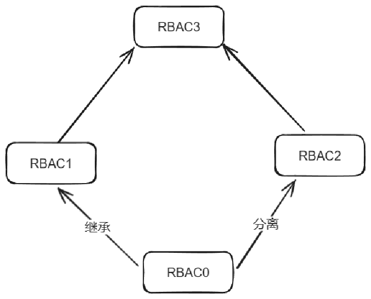

### **RBAC0**

* 用户和角色、角色和权限多对多关系。

* 简单来说就是一个用户拥有多个角色，一个角色可以被多个用户拥有，这是用户和角色的多对多关系；同样的，角色和权限也是如此。

**RBAC0**模型如下图：


### **RBAC1**

* 相对于**RBAC0**模型，增加了**角色分级**的逻辑，类似于树形结构，下一节点继承上一节点的所有权限，如**role1**根节点下有**role1.1**和**role1.2**两个子节点


* 角色分级的逻辑可以有效的规范角色创建（主要得益于权限继承逻辑），BD工具之间就有分级（经理、主管、专员），如果采用RBAC0模型做权限系统，可能需要为经理、主管、专员分别创建一个角色（角色之间权限无继承性），极有可能出现一个问题，由于权限配置错误，主管拥有经理都没有权限。而RBAC1模型就很好解决了这个问题，创建完经理角色并配置好权限后，主管角色的权限继承经理角色的权限，并且支持针对性删减主管权限。

### **RBAC2**

* 基于**RBAC0**模型，对角色增加了更多约束条件。


* 如**角色互斥**，比较经典的案例是财务系统中出纳不得兼管稽核，那么在赋予财务系统操作人员角色时，同一个操作员不能同时拥有出纳和稽核两个角色。

* 如**角色数量限制**，例如：一个角色专门为公司CEO创建的，最后发现公司有10个人拥有CEO角色，一个公司有10个CEO？这就是对角色数量的限制，它指的是有多少用户能拥有这个角色。

* **RBAC2** 模型主要是为了增加角色赋予的限制条件，这也符合权限系统的目标：权责明确，系统使用安全、保密。

### **RBAC3**

* RBAC3 是 RBAC1 与 RBAC2 的合集，所以 RBAC3 包含继承和约束

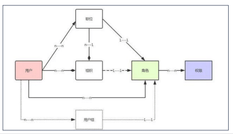

## 权限管理系统

权限系统基于 RBAC3（Role-Based Access Control）的思想设计，角色和权限绑定、角色和用户之间的耦合、 多对多的关系来实现授权和授权的快速变更，从而控制用户对系统的功能使用和数据访问权限。 

RBAC3 优点：便于权限分配，更灵活的授权管理，最小颗粒度授权


###  权限系统架构图

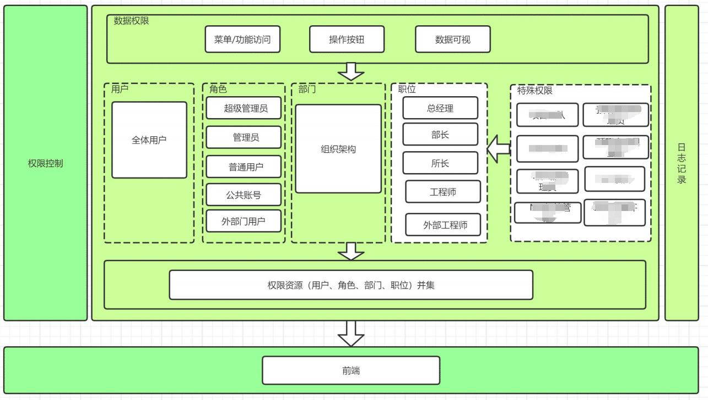

### **主要功能**

* 1、权限主数据管理
  * （1）系统标识：区分使用权限各个系统的标识
  * （2）数据权限：功能/菜单定义、操作功能定义，特殊组定义
* 2、授权管理
  * （1）授权 -> 个人：支持授权到个人
  * （2）授权 -> 角色：支持授权到角色
  * （3）授权 -> 部门：支持授权到部门
  * （4）授权 -> 职位：支持授权到职位
* 3、权限分配
  * （1）权限资源（用户、角色、部门、职位）并集

### **权限模型维度**

结合研发需求业务及未来发展，权限模型维度共3种:

1. 用户：系统的访问者，用户关联的组织机构/用户组。
2. 角色：相关角色的集合。用户可以被分配到一个或多个角色。
3. 权限：可操作或访问的资源。权限与角色/用户关联，通过分配获得相应的权限。


### **权限矩阵关系**


权限矩阵显示用户、角色集合和权限之间的1对1、多对多关系：

1. 合并权限： 用户被赋予所有角色集合的权限。即用户将拥有所属的每个角色集合的权限。
2. 资源权限：基于资源的权限控制，动态计算一个或一组规则，是否满足某种条件来进行授权判断
3. 最小化权限： 用户只被赋予所属的所有角色共同的权限。确保用户只能执行他所有角色共同具有的权限，而不是所有角色的权限总和。

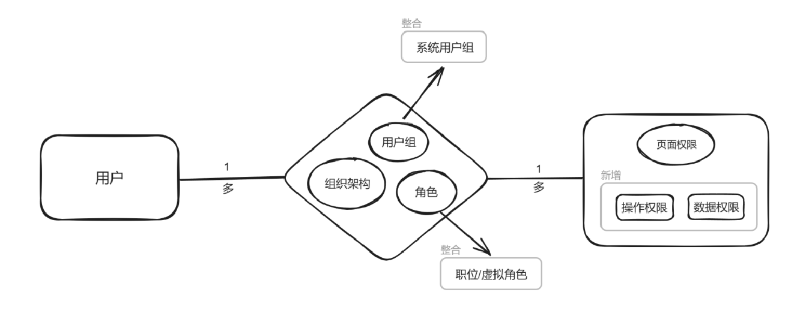

## 权限管理后台

* 操作界面：用户权限分配页面

  `在用户管理 -> 用户管理界面`中 有用户信息，通过点击操作中的权限分配，即可查看所有用户页面和按钮权限


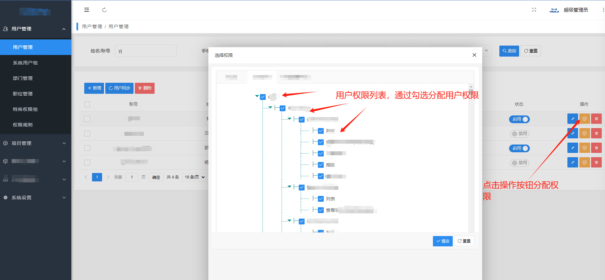

##  权限管理模块图

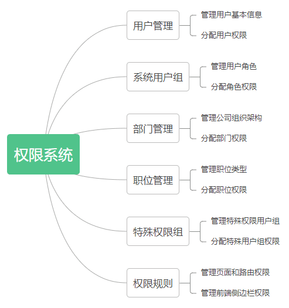

## 用户权限继承关系

* 用户权限是通过求权限资源（用户、角色、部门、职位）并集

  

* 

## 权限控制

权限控制为两种：

* **与项目信息相关的权限**（通过项目相关接口字段控制权限）；

* 与 个人用户/角色 相关的权限（通过后台权限管理系统配置权限）；

此处权限管理系统主要用于 ”与个人/部门/职位 相关的权限“ 管理；

**即当前权限管理系统，只能控制到页面(路由) 权限和按钮显示级别权限，对于跟用户信息挂钩的数据，无法使用该权限系统控制**；对于跟用户信息挂钩的数据，需要服务端返回单独字段控制

### 项目信息相关权限配置

#### **概念**

与项目相关的权限是指：在项目流程管理中，存在与具体数据的状态，用户 相关联系的操作权限。

比如：某项目中，用户操作按钮与数据状态和数据当前用户角色相关联：

* 数据状态：数据存在 未开始、待分配、进行中、待审核、已完成状态；
* 数据角色： 数据中又存在 创建人、项目 leader、项目成员、审核人等多种角色；
* 数据操作： 新增、查看、编辑、分配、审核、领取、关闭等操作；

状态、角色和操作存在以下关系：

| 状态   | 角色和权限                                  | 操作             |
| ------ | ------------------------------------------- | ---------------- |
| 未开始 | 所有用户 （ 新增）                          | 新增             |
| 待分配 | 项目 leader（编辑、分配）、项目成员（领取） | 编辑、分配、领取 |
| 进行中 | 项目 leader（编辑、关闭）、项目成员（编辑） | 编辑、关闭       |
| 待审核 | 项目 leader（审核）                         | 审核             |
| 已完成 | 所有用户 （ 查看）                          | 查看             |

根据以上关系表可知：

* **操作按钮显示 =  数据状态 + 当前用户角色** 组合；
* 列表每一行数据操作按钮的显示跟当前行数据状态和当前用户角色关联；

因此对于以上跟数据相关联的权限控制模块，一般通过服务端返回行数据字段状态和行数据用户id 和当前用户 id 进行判断


#### **实现方案**

1. 通过维护每行数据的状态和操作按钮 map 表 statusButtonsMap ，并维护一个用户角色和操作按钮 map 表 userButtonsMap;
2. 通过服务端返回的行数据的 status  和 statusButtonsMap  获取行数据状态操作 statusOpetors；
3. 通过服务端返回的行数据的 用户角色id（如：leaderId,creatorId） 获取行数据用户操作 userOpetors；
4. 求行数据状态操作statusOpetors 和 userOpetors 交集，即为当前行操作；


### 页面/组件权限开发流程

权限管理系统主要控制粒度分为：

* 页面级权限控制（**页面权限中通过后台配置中的标识返回字符串和前端路由中 name 字段进行匹配**）

* 组件级权限控制（组件级权限分为与项目信息相关的权限 和 与个人/部门/职位 相关的权限，此处讲解 ”与个人/部门/职位 相关的权限“ 开发 ）


1. 配置 限管理后台
   * 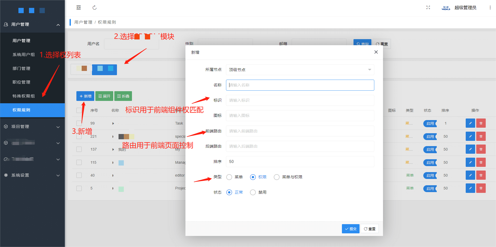
   * **注意:**
     * **前端路由字段：字符串必须为唯一字符串，该字段字符串内容用于标识组件权限；**
     * **标识字段作用：页面权限中通过后台配置中的标识返回字符串和前端路由中 name 字段进行匹配；**
     * 新增的页面和权限的树形结构，必须与前端路由(侧边栏)树形结构一致，否则将导致无法匹配页面路由！（下文讲解原理）；
     * 页面权限类型选择“菜单”，组件权限类型选择“权限”；
2. 前端项目添加权限标识
   * 添加组件权限
     * 在 `src/permission/modules` 目录中找到权限所属模块/新增权限模块，添加前端权限记录（key为权限标识,value为 后台管理系统中配置的前端路由字符串）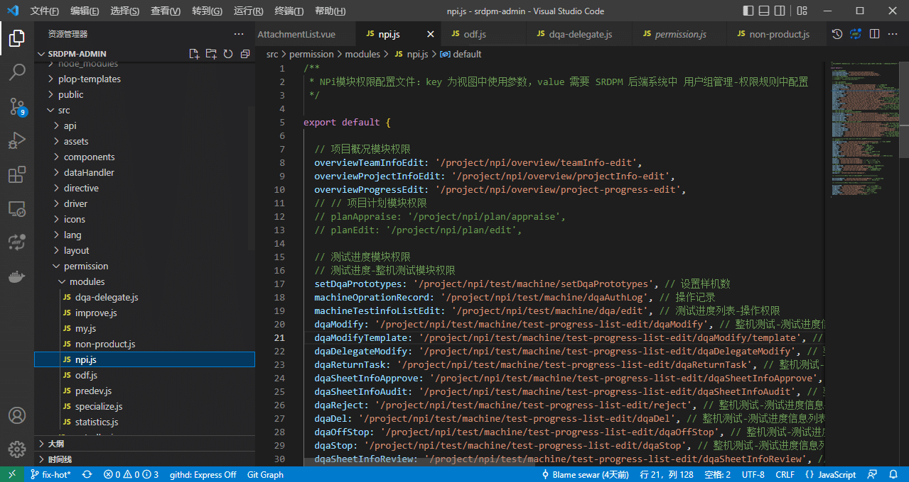
     * 在页面组件中,调用权限 API:
       * 视图 template 中使用 ` this.$hasPermissions({ module: '权限模块文件名', auth: '权限标识key值'})"`
       * 逻辑组件中使用 `this.$hasPermissions({ module:  '权限模块文件名', auth: '权限标识key值' })`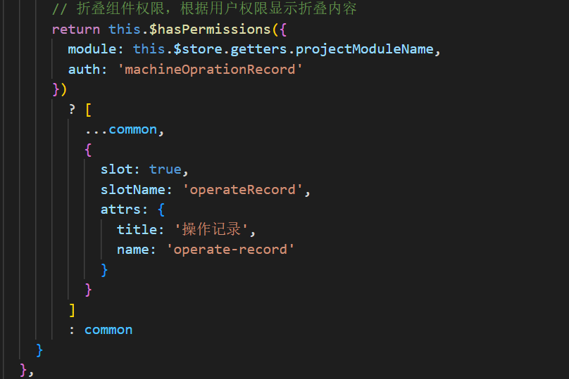
   * 添加页面权限：
     * **页面权限中通过后台配置中的标识返回字符串和前端路由中 name 字段进行匹配**（下文讲解原理）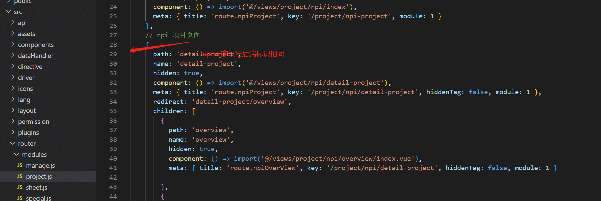

## 权限系统实现原理(前端)

前端权限系统模块主要分为：

* 页面权限模块实现

* 组件权限模块实现

### 页面权限模块实现

#### 思路

1. 在后台权限管理系统 根据侧边栏目录配置侧边栏和菜单、前端项目代码配置路由；
2. 后端接口返回侧边栏树形结构数据；
3. 递归匹配后端路由和前端路由配置，生成异步路由表；
4. 生成路由表：整合异步路由表和常规路由表；
5. 根据生成路由表生成侧边栏菜单；

**第一步：后台配置权限**


> 操作如下：
>
> 1. 后台进入权限管理系统用户管理 -> 权限规则 -> 选择对应系统
> 2. 点击新增，增加路由，选择路由所属节点
>
> 注意：
>
> * 权限管理系统中路由新增的最好以系统侧边栏目录对应，便于管理！
> * 标识字段即为前端 Vue 项目中 路由配置表中 路由名称（由于路由名称是唯一的，因此可以通过路由名称标识唯一路由）


**第二步：后端接口返回侧边栏树形结构数据**

服务端返回接口格式：返回数组，数组内容与前端路由表相同！！


**第三步：前端递归获取路由表，生成异步路由**

**总体思路**

1. 前端请求获取用户权限列表 `leftMenu` 对象；
2. 对比用户权限列表 `leftMenu` 对象与 前端路由表配置，生成异步路由；

**异步路由控制**

**使用`router.beforeEach` API 对全局路由进行访问控制**

* 根据服务端返回路由数据，生成异步路由：

  * 获取本地路由配置

  *  递归后端返回的路由数据，修改本都路由配置

    * 过滤常量路由：过滤没有权限的异步路由;

    * 过滤异步路由：过滤没有权限的异步路由;

  * 重置本地路由

代码实现：

* 获取本地路由配置：

  ```js
  const hasAccessRoutes = store.getters.permission_addRoutes && store.getters.permission_addRoutes.length > 0
  ```

* 生成异步路由 vuex actions 实现：

  ```js
    // 生成异步路由
    generateRoutes({ commit }, routes) {
      return new Promise(resolve => {
        // 过滤常量路由：过滤没有权限的异步路由
        filterConstantRoutes(constantRoutes, routes.leftMenuNames)
        // 过滤异步路由：过滤没有权限的异步路由
        filterAsyncRoutes(asyncRoutes, routes.leftMenuNames)
        asyncRoutes.sort((value1, value2) => value1.order - value2.order)
        commit('SET_ROUTES', {
          asyncFilterRoutes: asyncRoutes,
          constantAsyncRoutes: constantRoutes
        })
        resolve(asyncRoutes)
      })
    }
  
  
  ```

* 过滤常量路由：递归前端路由，**查找 name** 不存在的路由，删除

  ```js
  /**
   * Filter asynchronous routing tables by recursion
   * 过滤没有权限的常量路由路由：递归前端路由，查找 name 不存在的路由，删除
   * @param routes asyncRoutes
   * @param roles
   */
  export function filterConstantRoutes(constantRoute, routes) {
    // 开发环境侧边栏路由不由 srdpm 后端管理系统控制
    if (process.env.NODE_ENV === 'development') return
    // 测试和生产环境下，对常量路由进行过滤
    for (let i = 0; i < constantRoute.length; i++) {
      const route = constantRoute[i]
      if (route.children) {
        filterConstantRoutes(route.children, routes)
      }
      if (route.asyncRoute) {
        if (routes.indexOf(route.name) < 0) {// 注意：递归时使用路由 name 字段进行判断，因此服务端配置路由name必须与本地路由 name 匹配，否则无法查找到对应的路由
          constantRoute.splice(i, 1)
          i--
        }
      }
    }
  }
  ```

* 过滤异步路由：递归前端路由，查找 name 不存在的路由，删除

  ```js
  /**
   * Filter asynchronous routing tables by recursion
   * 过滤没有权限的异步路由：递归前端路由，查找 name 不存在的路由，删除
   * @param routes asyncRoutes
   * @param roles
   */
  export function filterAsyncRoutes(asyncRoutes, routes) {
    // 开发环境侧边栏路由不由 srdpm 后端管理系统控制
    if (process.env.NODE_ENV === 'development') return
    // 测试和生产环境下，对异步路由进行过滤
    for (let i = 0; i < asyncRoutes.length; i++) {
      const route = asyncRoutes[i]
      if (route.children) {
        filterAsyncRoutes(route.children, routes)
      }
      if (routes.indexOf(route.name) < 0) {
        asyncRoutes.splice(i, 1)
        i--
      }
    }
  }
  ```

* 重置本地路由， vuex actions 实现：

  ```js
    /**
     * 设置二级菜单显示的路由
     * @param {} param0
     * @param {*} routes 当前路由对象，包含路由名称 name 或则路由路径
     * @returns
     */
    SetShowRouters({ commit, state }, routes) {
      const { name, matched } = routes
      let topRouteName = name // 二级路由顶部菜单栏名称
      if (matched && matched.length > 0) { // 根据路由匹配路径获取二级顶部菜单栏名称
        topRouteName = matched[0].name
      }
      return new Promise(resolve => {
        const filterRouter = state.routes.map(item => {
          if (item.name !== topRouteName) {
            item.hidden = true
          } else {
            item.hidden = false
          }
          return item
        })
        commit('SET_ROUTE', filterRouter)
        resolve(routes)
      })
    }
  ```

  


**第四步：生成路由表**

将生成的异步路由表加入路由表中

```js
   // 根据用户权限列表，生成异步路由
        const accessRoutes = await store.dispatch('permission/generateRoutes', store.state.user.authority)
        if (accessRoutes.length > 0) {
          // dynamically add accessible routes
          router.options.routes = store.getters.permission_routes
          router.addRoutes(accessRoutes)
          // set the replace: true, so the navigation will not leave a history record
          await store.dispatch('permission/SetShowRouters', to)

          nextRouter(to, from, next, { ...to, replace: true })
        }
```


**第五步：根据生成路由表生成侧边栏菜单**

在此处的后台管理系统中，使用两层菜单栏：

* 顶部菜单栏为一级菜单栏；
* 侧边菜单栏为二级菜单栏；

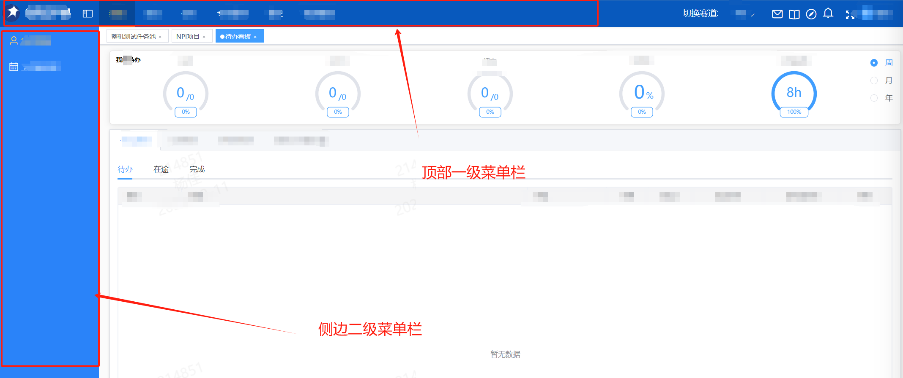

**路由表渲染思路**

在获取异步路由合并同步路由，获取到所有路由表后，通过将路由进行拆分，将路由表一级结构设置为顶部菜单栏，在点击顶部菜单栏后，获取对应路由的子路由表作为二级菜单栏；

顶部菜单栏监听路由表的变化，当路由表变化时，获取对应路由的子路由表作为二级菜单栏：

> 在导航栏组件中，监听路由表数据的变化

```js
  watch: {
    permission_routes: {
      handler(val) {
        const showRoute = val.filter(route => !route.hidden)
        if (showRoute.length > 0) {
          this.$set(this.$data, 'showRouters', showRoute[0].children)
          this.$store.dispatch('app/setHorizonNavActive', showRoute[0].order)
        }
        this.$nextTick(function() {
          this.getAllMenu(this.opendMenu, this.showRouters) // 解决二级菜单不展开 bug
          this.$refs.sideBarMenu.$forceUpdate()
        })
      },
      deep: true,
      immediate: true
    }
  },
```

在导航栏组件中模板遍历`permission_routes` 变量，生成导航栏：

```vue
    <el-scrollbar wrap-class="scrollbar-wrapper">
      <el-menu
        ref="sideBarMenu"
        :default-active="activeMenu"
        :default-openeds="opendMenu"
        :collapse="isCollapse"
        :background-color="variables.menuBg"
        :text-color="variables.menuText"
        :unique-opened="false"
        :active-text-color="variables.menuActiveText"
        :collapse-transition="true"
        mode="vertical"
      >
        <sidebar-item
          v-for="(route,index) in showRouters"
          :key="route.path"
          :item="route"
          :base-path="route.path"
          :index="index"
        />
      </el-menu>
    </el-scrollbar>
```


路由数据变化后，设置侧边栏路由：

```js
  /**
   * 设置二级菜单显示的路由
   * @param {} param0
   * @param {*} routes 当前路由对象，包含路由名称 name 或则路由路径
   * @returns
   */
  SetShowRouters({ commit, state }, routes) {
    const { name, matched } = routes
    let topRouteName = name // 二级路由顶部菜单栏名称
    if (matched && matched.length > 0) { // 根据路由匹配路径获取二级顶部菜单栏名称
      topRouteName = matched[0].name
    }
    return new Promise(resolve => {
      const filterRouter = state.routes.map(item => {
        if (item.name !== topRouteName) {
          item.hidden = true
        } else {
          item.hidden = false
        }
        return item
      })
      commit('SET_ROUTE', filterRouter)
      resolve(routes)
    })
  }
```


#### 结合登录和 token 验证实现页面路由控制

* 根据用户权限获取异步路由，生成异步路由后，通过路由守卫控制用户访问页面权限

* 控制文件：`src/permission/controller.js`

* 实现思路：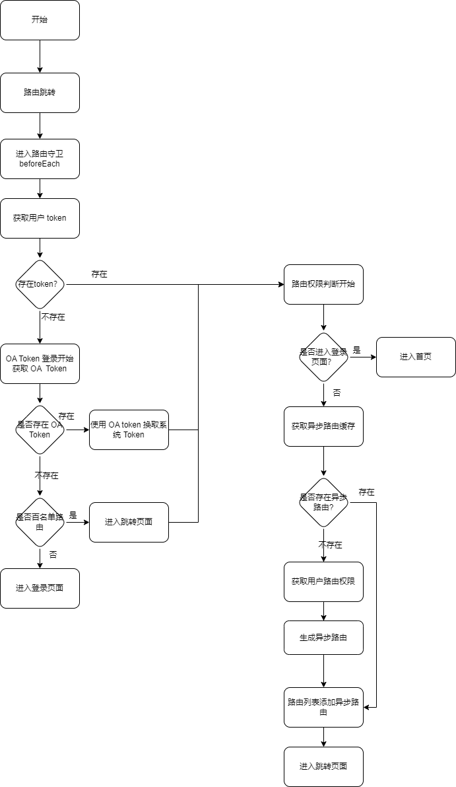

* `controller.js` 使用全局路由守卫**`router.beforeEach` API 对全局路由进行访问控制**，并进行用户登录进行控制：

  ```js
  /**
   * 权限控制器文件：
   * 通过 vue 路由控制页面访问权限
   */
  import router from '../router'
  import store from '../store'
  import { OnlyMessageBox } from '@/plugins/modules/onlyMsgbox.js'
  import NProgress from 'nprogress' // progress bar
  import 'nprogress/nprogress.css' // progress bar style
  import { getToken, getOAToken, getOALoginToken } from '@/utils/auth' // get token from cookie
  import { getPageTitle } from '@/utils/get'
  import { isMobile } from '@/utils/index.js'
  import { mobileRoutePrefix } from '@/router/routeConfig.js'
  NProgress.configure({ showSpinner: false }) // NProgress Configuration
  
  const whiteList = [
    '/login',
    `${mobileRoutePrefix}/login`,
    '/redirect',
    '/single-pages/personal-bill',
    `${mobileRoutePrefix}/single-pages/personal-bill`
  ] // no redirect whitelist
  
  router.beforeEach(async(to, from, next) => {
    // start progress bar
    NProgress.start()
  
    // set page title
    document.title = getPageTitle({ key: to.meta.title, query: to.query })
  
    // determine whether the user has logged in
    const hasToken = getToken()
    if (hasToken) { // 已经登录系统，存在token，进入权限判断
      await routerPermission(to, from, next)
    } else { // 未登录情况下，判断是否存在 oa token，存在 oa token，则直接使用 oa token 刷新token后登录
      /* has no token*/
      // 获取 oa 中的 token
      const { oaToken } = getOAToken()
      if (oaToken) { // oa 存在 token，用户已经登录 oa
        try {
          // 使用 oa token 登录系统
          await store.dispatch('user/CheckOaLogin')
        } catch (err) {
          store.dispatch('user/logout')
        }
        // 进入页面权限判断
  
        await routerPermission(to, from, next)
      } else if (whiteList.includes(to.path)) { // 白名单路由，直接进入
        // in the free login whitelist, go directly
        nextRouter(to, from, next)
      } else { // 返回登录页面
        // other pages that do not have permission to access are redirected to the login page.
        nextRouter(to, from, next, {
          path: getLoginRoute(),
          query: {
            redirect: to.path
          }
        })
      }
    }
  })
  
  /**
   * 路由权限判断函数,根据路由权限进入不同路由
   */
  async function routerPermission(to, from, next) {
    if (to.path === '/login' || to.path === `${mobileRoutePrefix}/login`) {
      // if is logged in, redirect to the home page
  
      nextRouter(to, from, next, { path: '/' })
    } else {
      // determine whether the user has obtained his permission roles through getInfo
      // 已经加载异步路由直接进入页面（在用户退出系统后必须清除 store 中数据）
      const hasAccessRoutes = store.getters.permission_addRoutes && store.getters.permission_addRoutes.length > 0
      if (hasAccessRoutes) {
        await store.dispatch('permission/SetShowRouters', to)
  
        nextRouter(to, from, next)
      } else {
        try {
          // get user info
          // 获取用户信息(包括权限列表)
          await store.dispatch('user/getInfo')
  
          // generate accessible routes map based on roles
          // 根据用户权限列表，生成异步路由
          const accessRoutes = await store.dispatch('permission/generateRoutes', store.state.user.authority)
          if (accessRoutes.length > 0) {
            // dynamically add accessible routes
            router.options.routes = store.getters.permission_routes
            router.addRoutes(accessRoutes)
            // set the replace: true, so the navigation will not leave a history record
            await store.dispatch('permission/SetShowRouters', to)
  
            nextRouter(to, from, next, { ...to, replace: true })
          } else {
            nextRouter(to, from, next)
          }
        } catch (error) {
          // remove token and go to login page to re-login
          await store.dispatch('user/logout')
          OnlyMessageBox.error(error || 'Has Error')
          nextRouter(to, from, next, {
            path: getLoginRoute(),
            query: {
              redirect: to.path
            }
          })
        }
        // 获取新 oa token:LtpaToken, 通过创建 iframe,重定向获取 oa 登录 token
        getOALoginToken()
      }
    }
  }
  
  router.afterEach(() => {
    // finish progress bar
    NProgress.done()
  })
  
  /**
   * 路由 next 移动端封装
   * @param {*} to
   * @param {*} from
   * @param {*} next
   * @param {*} params
   */
  function nextRouter(to, from, next, params) {
    const toPath = params?.path || to.path
    if (isMobile()) { // 移动端设备
      if (toPath.includes(`${mobileRoutePrefix}`)) { // 如果包含 mobile 前缀,则为访问移动端页面，直接进入
        return params ? next(params) : next()
      } else { // 不包含 mobile 前缀,添加 mobile 前缀
        const newPath = params?.path ? `${mobileRoutePrefix}${params.path}` : `${mobileRoutePrefix}${to.path}`
        const nextPamras = { ...params, path: newPath, fullPath: newPath }
        return next(nextPamras)
      }
    } else { // PC 设备
      if (!toPath.includes(`${mobileRoutePrefix}`)) { // 如果不包含 mobile 前缀,则为访问PC，直接进入
        return params ? next(params) : next()
      } else { // 去除 /mobile 路径前缀
        const newPath = toPath.replace(`${mobileRoutePrefix}`, '')
        return next({ ...param
                     s, path: newPath, fullPath: newPath })
      }
    }
  }
  
  function getLoginRoute() {
    return isMobile() ? `${mobileRoutePrefix}/login` : '/login'
  }
  
  ```

以上代码包括登录和单点登录逻辑混合：

> * 登录逻辑：获取本地 token，如果有，直接进入页面，否则跳转入登录页面；

> * 单点登录逻辑：
>   * 获取本地 token:
>     * 如果本地 token 不存在，则获取本地 OA token（判断是否从 oa 中登录系统）;
>     * 如果本地 OA token 存在，则请求拿本地 OA token 请求换取本系统 token
>     * 如果本地 OA token 不存在，说明本系统和 OA 都未登录，直接退出系统。


### 按钮/组件权限控制实现

#### 思路

> * 用户登录，登录成功后获取用户信息;
> * 用户信息中返回 `按钮/组件` 权限字段集合;
> * 前端本地存储  `按钮/组件` 权限字段集合;
> * 前端视图权限判断使用自定义指令 `v-permission` 判断是否显示 `按钮/组件` ；
> * 前端逻辑权限判断使用自定义方法  `this.hasPermission` 判断是否显示 `按钮/组件` ；

#### 自定义权限指令

**实现思路：**

1. 获取服务端返回的用户权限集合；
2. 获取本地权限标识配置列表；
3. 根据传入参数，获取判断的权限标识
4. 判断用户权限集合中，是否包含当前传入的权限标识；

* 核心代码实现：`permission.js`

  ```js
  /**
   * 权限指令
   * 使用： v-permission="{module:'模块名称',auth:'权限key值'}"
   */
  import store from '@/store'
  import permissionList from '@/permission'
  
  /**
   * 全局权限判断方法
   * @param {*} permission 权限对象，格式 {module:'模块名称',auth:'权限key值'}
   * @param {*} callback 权限回调函数，有权限则执行回调
   * @returns
   */
  export function hasPermissions(permission, callback = null) {
    // 获取服务端权限
    const permissions = store.getters && store.getters.permissions
    if (permission.module && permission.auth) {
      // 根据传入参数获取本地权限表示
      const value = permissionList[permission.module][permission.auth]
      const haspermiss = permissions.includes(value)
      haspermiss && callback && callback()
      return haspermiss
    }
    return false
  }
  
  function checkPermission(el, binding) {
    if (!hasPermissions(binding.value)) {
      el.style.display = 'none'
    }
  }
  
  export default {
    inserted(el, binding) {
      checkPermission(el, binding)
    },
    update(el, binding) {
      checkPermission(el, binding)
    }
  }
  
  ```

* vue2 权限指令注册：

  ```js
  import permission from './permission'
  import { hasPermissions } from './permission'
  
  const install = function(Vue) {
    Vue.prototype.$hasPermissions = hasPermissions
    Vue.directive('permission', permission)
  }
  
  if (window.Vue) {
    window['permission'] = permission
    Vue.use(install); // eslint-disable-line
  }
  
  permission.install = install
  export default permission
  
  ```

* 视图中使用 权限指令：使用 `v-permission`

  ```vue
      <el-button
          v-permission="{module:moduleName,auth:权限key }"
          size="mini"
          type="text"
          @click="deleteRow"
       />
  ```

  > * `v-permission` 参数说明：
  >   * `module` 表示模块名称，即文件名称
  >   * `auth` 为权限标识的 key 值，表示哪个权限

* 权限标识实现：

  * 使用对象标识权限标识，对象 key 为 ` v-permission` 指令获取的 key, 对象 value 为权限 auth 标识，与后端返回的权限集合中标识对应；

    ```js
    export default {
      del: '/project/del', // 删除权限
      add: '/project/add', //项目新增权限
    }
    ```

  * module 为文件名称，按文件划分模块管理权限： `/modules` 下文件存储为各个模块权限标识对象

    

    

  

#### 自定义权限判断方法

**实现思路**

通过以上 `hasPermissions` 方法，在注册指令时候，将`hasPermissions` 挂载到 Vue 实例对象，可以在所有 Vue 组件中调用

使用：参数与指令参数相同

```js
this.$hasPermissions({ module: 文件名, auth: 权限key值 })
```


## 前端路由权限实现方案总结

### 定义

路由权限，在此处是指用户是否有权力访问某个页面路由的权限，必须是拥有路由路径的页面；

在后台管理系统中，路由权限一般是指侧边栏路由的访问权限，指某个用户或角色是否具有某个路由的访问权限；

在后台管理系统中，路由权限实现方案有：

* 静态路由（简单实现）：
  * 实现效果：后台管理系统向展示所有路由，仅当用户点击页面时，没有权限的页面才拦截提示；
* 动态路由：
  * 实现效果：根据后台配置的权限，动态显示用户拥有权限的路由；没有权限的页面不会显示到侧边栏中；


### 静态路由

#### 实现效果

后台管理系统向展示所有路由，仅当用户点击页面时，没有权限的页面才拦截提示；


 #### 实现思路

1. 请求接口获取用户路由列表； 
2. 使用 `router.beforeEach` 全局路由拦截；
3. `router.beforeEach` 回调中拦截路由，判断当前访问路由是否在用户路由列表，不在则提示用户无权限，否则进入页面；

### 动态路由

#### 实现效果

根据后台配置的权限，动态显示用户拥有权限的路由；没有权限的页面不会显示到侧边栏中；

#### 实现思路

1. 使用 `router.beforeEach` 全局路由拦截；
2. 请求接口获取用户路由列表；
3. 根据路由列表，过滤前端路由表；
4. 侧边栏动态监听路由表变化，动态遍历生成侧边栏；


## 问题

### Vue3 刷新页面不触发  `router.beforeEach` 回调

#### **问题描述**

在使用 Vue3 实现的后台管理系统中，发现在刷新页面时，不会触发  `router.beforeEach` 回调函数，导致刷新时无法请求用户权限列表和更新动态路由，因此在动态路由页面刷新时，导致页面空白；

#### **原因分析**

#### **解决方案**

**方案一**

监听页面刷新，刷新后调用  `router.beforeEach` 回调，解决刷新不触发  `router.beforeEach` 回调

在 Vue3 项目中 `main.ts` 文件添加以下代码，用于监听页面刷新后状态，在刷新后重新获取用户权限和生成异步路由：

```js
/**
 * 解决刷新不触发 router.beforeEach 回调bug
 * @returns 
 */
export function reloadHacker() {
    //监听页面重载事件
    window.addEventListener('load', async function () {
        // 判断执行类型，类型为重载即刷新和首次进入时候
        if (window.performance.navigation.type === window.performance.navigation.TYPE_RELOAD) {
            // 用户进行了刷新动作
            if (!getToken()) return false
            try {
                let accessRoutes = userStore.getAuthority || {}
                if (accessRoutes?.menuNames && accessRoutes?.menuNames?.length === 0) {
                    accessRoutes = await userStore.GetAuthority()
                    routeStore.GenerateRoutes(accessRoutes?.menuNames || [])
                }
            } catch (err) {
                return false
            }
        }
    });
}
```


## 参考资料

[RBAC权限模型](http://t.zoukankan.com/shamo89-p-6684578.html)

