# SSG 移动端项目实践

## 项目特点

概述：面向多个国家的媒体网站，提供图像，视频，评级和比较，新闻，评论，指南。

特点：

* 面向多个国家
* 内容密集型页面，偏静态的内容展示场景（资讯，新闻）
* 项目的 SEO 和 首屏渲染是评价项目的关键指标 

国家及语言代码：

> 马来西亚英语：my-en  
> 印尼语：id-id   
> 印度英语：in-en  
> 泰语：th-th 
>
> 菲律宾： 

涉及端：

## 技术栈

* wap 端: 使用 `Vue + Webpack` 构建的 PWA 应用
  * 技术栈：`vue-cli3 + vue2.x + vue-router + vue-ssr + vant + i18n + amp + webpack + scss `
* 多国方案： 
  * 多国主要区别：
    * 多语言：`vue-i18n  `
    * 主题颜色： `scss` 管理
    * 图标： 工厂模式获取
    * webpack 配置：添加 `config` 配置 `webpack` 打包输出；
  * TDK 管理：添加 config 配置 webpack 打包时注入输出；
  * 结构化数据管理

  * amp：谷歌搜索引擎优化
* 页面模式: 

  * 单页面 + 多页面静态化 结合方式  
    * 单页面 SPA: 
      * 目的： 动态加载的内容的页面，且不需要 SEO 优化的页面；
      * 开发：常规 vue 单页面应用开发模式
    * 多页面静态化：
      * 目的：静态页面，需要被搜索引擎搜索的页面。 用于 SEO 优化，解决首屏白屏，加快首次加载
      * 开发：编写 webpack 打包脚本 + `vue-server-renderer ` 渲染模板 
* 开发： 使用脚本静态化， 使用 nginx 配置代理路由转发静态页面
* SEO目标引擎： google。

## 项目开发

### 项目目录  


* 目录中涉及业务的主要几个目录：

  * amp：构建 amp 页面相关目录

  * create-html: 页面静态化脚本配置相关目录

  * create-sitemap: 创建站点地图目录

  * src: 开发单页面相关目录

  * ssr: 开发静态化页面相关业务组件目录

    

### 静态页面开发流程

* 在单页模式中 src/router 添加路由：

  * 添加路由目的： 用于本地开发，方便本地开发时进行预览，本地静态页面开发完成后删除对应静态页面路由，静态页面路由由 Nginx 配置。

  

  * 存在问题： 
    * 单页面应用路由和 ssr 静态化页面路由耦合
    * 优化：分离单页面路由和静态化页面路由配置文件

* 使用 npm run serve 启动本地服务：用于本地开发预览页面。

  

  使用 test 模式，将加载 .env.test 文件下的所有变量，作为 webpack 打包时的初始值

  

  * 存在问题：开发完成后静态化页面无法再使用本地开发服务预览

* 在 ssr/view 目录下开发页面 

  * 在 ssr/view 目录下新增目录开发新页面；
  * 页面开发完成后，在 create-html 目录下新增页面目录(以introduce 页面开发为例 )：创建模板 html、App.vue 页面根组件、main.js 页面打包/依赖文件入口
    * 所有页面写成组件形式，最终组件外层使用 App.vue 文件中的套壳 ,套壳目的： 使wap端在pc端下显示移动模式样式 
    * 存在问题： 每新增页面，新增模板、入口文件、跟组件文件；项目开发流程复杂化；

* 页面开发完成后在 create-html目录下编写打包脚本（创建 Introduce.js）：

  

* 去除单页模式中的路由，使用静态化脚本构建页面


## 项目路由管理

* 静态化页面路由使用 nginx 转发
  * Nginx 路由路径为 html 文件输出目录路径，在项目中 `create-html/config/页面名/en.js` 中配置 webpack 打包文件输出的路径，不同国家输出路径不同。

* 动态页面使用 vue-router 动态匹配


## 静态化构建原理

### **构建流程**


### 构建组件文件和客户端激活文件

**构建组件文件：**

* web components 文件构建介绍：
  * web  components 组件入口应该是一个 `*.vue` 文件。项目中 `create-html/introduce/App.vue` 为 introduce 页面组件入口。 
  * 通过 webpack 将会把这个组件自动包裹并注册为 Web Components 组件，该构建将会产生一个单独的 JavaScript 文件 (及其压缩后的版本) 将所有的东西都内联起来。无需在 `main.js` 里自行注册。项目中构建出的 app.js 为 web 组件。
  * 当这个脚本被引入网页时，会注册自定义组件 `<my-element>`，其使用 `@vue/web-component-wrapper` 包裹了目标的 Vue 组件。这个包裹器会自动代理属性、特性、事件和插槽。请查阅 [`@vue/web-component-wrapper` 的文档](https://github.com/vuejs/vue-docs-zh-cn/blob/master/vue-web-component-wrapper/README.md)了解更多细节。

* 目的： 文件组件实例 app.js 作为服务端渲染 renderer.renderToString()方法的参数，作为服务端中Vue实例的组件,渲染成html模板内容。
* 通过 webpack 将页面和组件打包成 app.js 文件。
* 打包 app.js 配置：最终输出 app.js 文件  
  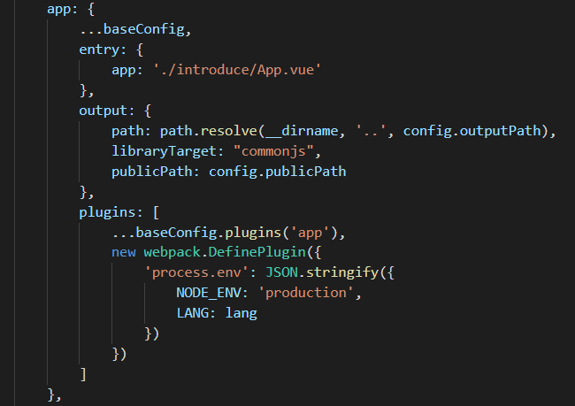
  * 被打包的文件内容为页面组件实例(不存在vue实例!)  
    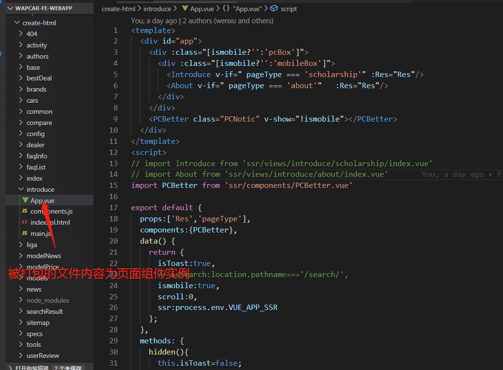


**构建客户端激活文件**

* 目的：用于客户端激活 。在加载页面时候会加载 main.js 文件，然后执行该文件进行客户端激活。

  * [客户端激活](https://ssr.vuejs.org/zh/guide/hydration.html):指的是 Vue 在浏览器端接管由服务端发送的静态 HTML，使其变为由 Vue 管理的动态 DOM 的过程。

* 创建客户端实例 main.js： 通过webpack 打包的 main.js 文件

* webpack 打包main.js ,输入main.js 用户客户端激活  （输出结果为 main.js 文件）

  * 在 main.js  文件中 （create-html/introduce/main.js）创建客户端 vue 实例，并将 App.vue 作为根组件进行渲染，并通过解构 `window.__initData__`

  * 获取组件 props 数据,并将渲染的实例挂载到 id=app 的dom中

      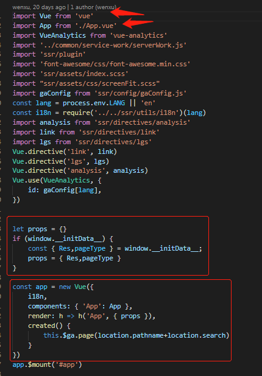

#### 创建渲染实例

* 模板渲染实例通过 `require('vue-server-renderer').createRenderer()` 方法创建，传入模板，返回渲染实例。

* 创建 服务端渲染模板

  * 服务端渲染模板为 ( `create-html/introduce/index.tpl.html`)  

  * html 模板打包 webpack 配置 （`create-html/config/webpack.base.config.js`） 

    

#### 获取数据并配置渲染上下文

1. 然后引入模板作为参数创建 render 实例, 并引入被打包的组件文件 app.js  

2. 通过脚本获取服务端渲染数据，并将接口数据结果处理后作为服务端渲染组件 props 传入 `context.window.__initData__ `

3. 创建模板渲染的 context，并序列化 App.vue 组件 props 属性注入 `window.__initData__` 对象 

4. 创建 vue 实例作为服务端渲染实例,将webpack打包的组件 ( app.js ) 作为服务端渲染的vue实例组件和 context 数据一起渲染成html模板 

#### 模板渲染输出文件

将服务端渲染的 html 模板写入文件 


---


## 移动端屏幕适配方案


单位转换:

* 开发使用像素单位： px
* 打包结果使用像素： rem
* 使用插件： `postcss-px2rem`
* 配置： 
  * 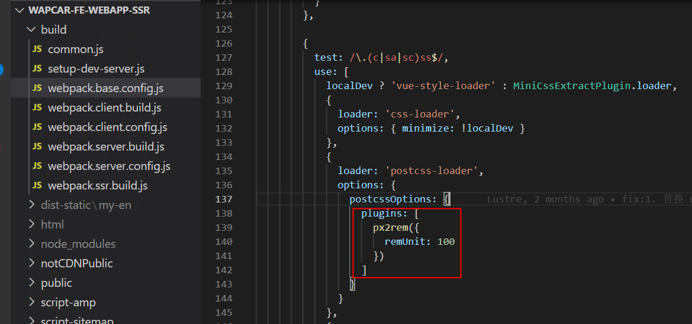

根元素 html 设置：

* 当屏幕宽度大于 416px 时， html 元素设置 `font-size:100px；`
* 当屏幕宽度大于 416px 时， html 元素设置 `font-size:26.666666667vw;`
  * 


---


## 用户管理

### 用户注册

* 背景：因为网站用户主要面向于东南亚用户，账号注册统一使用 google 或 facebook（国外的主流社交应用）

* 注册方式：使用 google 或 facebook 用户账号授权登录，登录成功后在本地后台注册用户。

#### 登录判断

在任何需要登录操作的地方（如：评论功能，个人信息）点击后会进入登录判断逻辑。

* 定义变量：在 `windows.$local` 中 添加 用户信息、登录状态、用户 `uuid`，登录状态判断直接在 `windows.$local` 变量中获取，定义在 `ssr/plugin/index.js` 中 

  

  * 登录判断逻辑：当本地存有 token 和用户信息时，表示已经登录

#### 登录组件封装

登录组件模板封装： 定义在`ssr/components/LoginPanel.vue`

* 主要逻辑：

  * 根据判断当前调用组件平台，根据平台显示对应登录按钮。

  * 点击登录后进行创建登录对象并调用登录初始化。

    

* 登录组件二次封装：使用函数式组件封装，创建 Login 组件实例，挂载到 vue 原型中。定义在 `ssr/components/Login/index.js`

  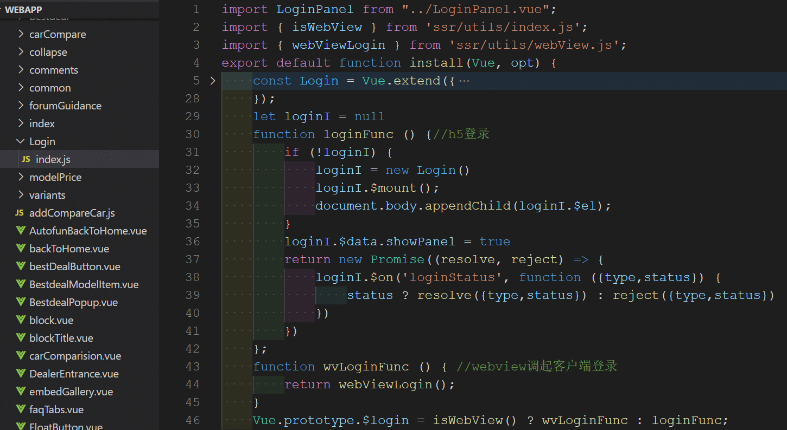

  * 调用方式：`this.$login().then(() => {})`
  * 二次封装原因：
    * 通过挂载到 vue 原型中方便调用，不需要在相关需要登录的组件中引入 登录组件；
    * 兼容安卓内嵌页面登录。android 中 需要通过 WebView Javascript Bridge 方式调用 js 中的方法。

#### 登陆流程

* 使用 google 或 facebook 登陆，授权登录后立即注册用户。

* 兼容平台：

  * facebook 应用中的 facebook webview
  * android 系统
  * ios 系统

* 登陆流程： 定义在`ssr/utils/otherLogin.js`

* 

  

* 流程： 动态加载 sdk -> 初始化数据 -> 授权登陆 -> 获取 google / facebook 用户数据 -> 根据  google / facebook 用户数据 获取 wapcar 用户数据 -> 本地存储用户数据

#### 登录数据管理

* 用户数据管理: `src/utils/loginStorage.js`
* 用户数据本地存储： Android 平台使用 `localStorage`+ iframe，IOS平台使用 `Cookies`。
  *  Android: 	使用 `localStorage`
     * 存在问题：
       * 论坛和帖子的域名为二级域名，与主站域名不一致，localStorage 存储受到同源策略限制不能跨域存储；但在论坛和帖子页面中登陆数据需要同步到主站域名的页面下
     * 解决方案：
       * 方案一：片段识别符
       * 方案二： ` window.name`
       * 方案三： `window.postMessage`：通过动态创建 iframe，进行主域和论坛域名通信，封装一个 sendMsg 方法在主域和论坛域名同步保存用户数据 ，每次保存用户数据时，将用户数据同时保存到两个域下。最后采用该方案。
  *  IOS： 使用 `Cookies`
     *  IOS 使用 `localStorage` 问题： IOS 不支持 iframe 共享登录态给 forum 域名
     *  解决方案：使用 `Cookies` 存储。两个网页一级域名相同，只是二级域名不同，浏览器允许通过设置`document.domain`共享 Cookie；这种方法只适用于 Cookie 和 iframe 窗口。LocalStorage 和 IndexDB 无法通过这种方法，规避同源政策。
     *  使用 Cookies 优点： [顶级域名和子级域名之间的cookie共享和相互修改、删除](https://www.cnblogs.com/cag2050/p/7283927.html)
  *  问题: 为什么 Android 和 IOS 用不同存储方式？
     * A: 刚开始都是用 `localStorage`，但是 IOS 不支持 iframe 共享登录态给 forum 域名，所以将 IOS 改成 Cookies 保存
  *  问题： Android 和 IOS 是否可以都用 Cookies 存储？
     * 可以。 都用  Cookies 存储 Android 就不需要 localStorage + iframe 通信
* 用户数据读取：
  * 用户数据存储在 `window.$local` 对象中，通过 `window.$local` 对象获取用户登陆状态和用户数据， `window.$local` （`src/plugin/index.js`）通过客户端入口初始化 (`entry-client.js`中引入)
* 参考资料：
  * [浏览器同源政策及其规避方法](https://www.ruanyifeng.com/blog/2016/04/same-origin-policy.html)

## 多国方案

### 多国区别

* 语言变量和环境管理
* 语言文案
* 皮肤主题
* 国家域名
* 资源输出目录
* 路由配置
* SEO相关配置：tdk、结构化数据等

### 多国变量和环境管理

**多国变量**

* 国家及语言代码：

  >马来西亚英语：en  
  >印尼语：id   
  >印度英语：in-en  
  >泰语：th-th 

* 作用：通过多国变量标识进行接口请求，判断等操作。

* 本地开发和单页面模式下多国变量标识注入方式：

  * 在 `package.json` 文件中 script 脚本配置启动模式,模式中查找相应变量配置文件,配置文件中变量将注入 `process.env`中 (参考[环境变量和模式](https://cli.vuejs.org/zh/guide/mode-and-env.html#%E6%A8%A1%E5%BC%8F))	

  * 

  * 环境变量配置文件

  * 使用示例：

    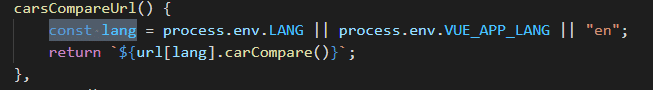

  * 单页面模式下，通过配置文件中配置注入 `process.env`，获取`process.env.VUE_APP_LANG` 语言变量，但在静态化页面中  `process.env.VUE_APP_LANG` 为 undefined

* 静态化页面过程多国家变量管理：

  * 首先在运行打包脚本时，通过 node 命令参数 `--lang=语言标记` 获取。（ introduce 页面中在 `create-html/introduce.js` ）

    ```js
    const {
        lang = "en",
        env = "production",
        pageType = "scholarship"
    } = require('yargs').argv;
    ```

  * 然后在打包 web components 组件文件时候，通过 lang 传入参数

    

  * 在脚本文件中通过传入的 lang 参数获取国家不同接口数据；

  * 在静态化页面中通过 webpack 注入组件的`process.env.LANG` 变量判断语言国家 ；

**环境变量**

* 环境分类：
  * 开发环境、生产环境
* 区分目的： 涉及域名和接口等需要根据环境区分
* 环境变量注入方式：
  * 单页面模式下：同多国变量注入方式相同，在 `package.json` 文件中 script 脚本配置。、
  * 静态化页面模式下： 同静态化方式多国变量注入方式相同，通过 node 命令行参数注入和 webpack 注入。

#### 语言管理

* 多语言插件： [vue-i18n](http://kazupon.github.io/vue-i18n/zh/introduction.html)

  * 全局默认导出一个 i18n 实例:`ssr/utils/i18n.js`

    

  * 静态化：每个静态化的页面都是一个单独的 vue 实例，main.js 中引入默认实例，并获取 webpack 打包时传入语言，最后作为 vue 实例参数传入

    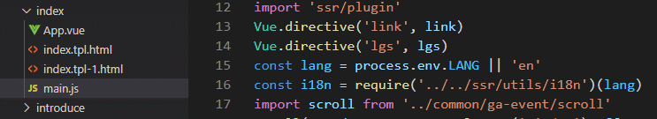

  * SPA单页:  单独实例化i18n，`src/main.js`

     


* 问题： 有些国家存在多种语言文案，如：马来西亚主要使用 马来英语，也有使用 马来语（马来本地语）和 中文（马来亚洲人使用）
  * 解决方案：
    * 静态化页面中：通过 node 命令行参数 seconedLang 传入
    * SPA单页应用和服务端渲染中，在使用第二语言的路由对象中的 meta 添加 secondLang 字段
      * 路由配置 
      * 第二语言使用： 

#### 主题管理

主题区别主要为 主题皮肤颜色 和 图标

**皮肤主题管理：** 

* 方案：使用 scss 变量定义主题颜色，在组件编写时使用变量替换颜色值 。

* 分类：目前主要有两个主题，主站(马来)使用蓝色主题 (main)，泰国和印尼使用 黄色 ( autofun ) 主题。

* 主题颜色变量定义：使用 scss 变量定义主题颜色，在 `ssr/assets/scss/variables` 文件中定义颜色变量

  

* 静态化页面中：webpack 引入 scss 主题时使用 `sass-loader` 中 `options.data` 引入对象 scss 主题文件，在 `create-html/config/webpack.base.config.js` 文件

  

  getStyleVarByLang() 方法定义：

  ```javascript
    getStyleVarByLang(lang) {
      switch (lang) {
        case "th-th":
        case "id":
          return "autofun";
        default:
          return "main";
      }
    }
  ```

* SPA 单页和本地开发中使用 `vue.config.js` 文件 配置 scss,vue-cli 中 [scss 配置参考](https://cli.vuejs.org/zh/guide/css.html#%E5%90%91%E9%A2%84%E5%A4%84%E7%90%86%E5%99%A8-loader-%E4%BC%A0%E9%80%92%E9%80%89%E9%A1%B9)

  

   

**图标管理：**

* 图标分为： 所有主题公共图标、主题图标。

* 方案：

  * 首先，在 `ssr/config/iconConfig.js` 中暴露公共方法 `getIcon` 获取主题图标，使用对象保存图标，key为名称，value 为图标对象。

  * 然后，组件中直接引入该方法使用 `getIcon('图标名')` 获取图标。

    

#### 资源管理

* 生产环境：
  * 上传至各国域名 CDN
* 测试环境：
  * 统一上传至 s3 
* 本地：
  * 输出目录： dist-static/国家标识/...

#### 数据管理

数据管理分为：静态化页面数据管理和 SSR/SPA 页面数据管理

**静态化页面数据管理**

使用 localStorage 和 sessionStorage 封装 Storage 对象 

**SSR/SPA 数据管理**

* 使用库： Vuex

* 问题和解决方案
  * Q: 多页面（静态化页面）之间 vuex 数据能否共享？
    * A： 不能。静态化页面数据 Vuex 只能获取当前页面中数据，通过 Chrome 调试工具中 console ->  输入`__INITIAL_STATE__`  可以查看当前页面可以获取的 Vuex 数据

#### axios 封装

## 埋点上报

埋点上报平台：

* 自建平台
* facebook pixel

### 自建上报系统

* 作用： 统计上报浏览数据

* 打点脚本文件目录： `ssr/lgs/dot.js`

* 上报类型：

  * 主动上报埋点：用于点击事件，使用 `commit()`
  * 落地页的埋点:  `pageview()`
  * 滚动上报： `scroll()`

* 上报数据重构原因：

  * 规则修改：产品重新定制了上报数据规则
  * 原有上班系统存在问题：
    *  传统的ajax请求，如果我们在监听中直接发送ajax请求，就会发现请求被浏览器abort了，无法发送出去。在页面卸载的时候，浏览器并不能保证异步的请求能够成功发出去，因此当发生页面跳转时，无法准确统计跳转来源页面。
    *  滚动上报通过监听滚动事件，计算位置上报。
  * 原有上报系统解决方案：
    * 当遇到跳转上报事件时，先通过 sessionStorage 存入待上报数据和页面信息，跳转后的页面中  mounted 钩子增加 lgs.pageview() 方法将数据上报。
  * 原有上报系统解决方案存在问题：1.新增多余数据存取；2.所有需要统计跳转进入的页面 Mounted 钩子中都需要调用 pageView 方法上报；3.监听滚动事件性能低下。

* 数据上报重构方案：

  * 方案1: 发送同步的ajax请求。

    * 统计和诊断代码通常要在 `unload` 或者 `beforeunload (en-US)` 事件处理器中发起一个同步 `XMLHttpRequest` 来发送数据。JavaScript 会等到服务器响应就绪才继续执行，导致同步的 `XMLHttpRequest` 迫使用户代理延迟卸载文档，并使得下一个导航出现的更晚。

    * ```javascript
      window.addEventListener('unload', logData, false);
      
      function logData() {
          var client = new XMLHttpRequest();
          client.open("POST", "/log", false); // 第三个参数表明是同步的 xhr
          client.setRequestHeader("Content-Type", "text/plain;charset=UTF-8");
          client.send(analyticsData);
      }
      ```

    * 这种方式虽然有效，但是用户需要等待请求结束才可以关闭页面。对用户的体验不好。

    * 否则，如果用户跳转或则关闭离开当前页面会导致当前页面上传数据中断

  * 方案2：通过在卸载事件处理器中创建一个图片元素并设置它的 src 属性的方法来延迟卸载以保证数据的发送。因为绝大多数用户代理会延迟卸载以保证图片的载入，所以数据可以在卸载事件中发送。

    * 缺点：编码模式不好，其中的一些甚至并不可靠而且会导致非常差的页面载入性能。

  * **方案3：使用 [`navigator.sendBeacon`](https://developer.mozilla.org/zh-CN/docs/Web/API/Navigator/sendBeacon) 发送异步请求 [采用方案]**

    *  **`sendBeacon() `**方法会使用户代理在有机会时异步地向服务器发送数据，同时不会延迟页面的卸载或影响下一导航的载入性能。

* 滚动上报重构方案： 

  * 传统方式：调用目标元素的[`getBoundingClientRect()`](https://developer.mozilla.org/en/docs/Web/API/Element/getBoundingClientRect)方法，得到它对应于视口左上角的坐标，再判断是否在视口之内。

    * 这种方法的缺点是：`scroll`事件密集发生，计算量很大，容易造成[性能问题](https://www.ruanyifeng.com/blog/2015/09/web-page-performance-in-depth.html)。

  * 使用 [`intersectionObserver`](https://developer.mozilla.org/zh-CN/docs/Web/API/IntersectionObserver) 监听元素滚动：

    * IntersectionObserver: 用来监听一个目标元素是否出现在web页面的可视区域，出现后触发回调方法。

      

    * 实现： 通过遍历传入列表，给列表每一项创建 `IntersectionObserver` 对象，回调中添加打点上报数据，并取消观测。

    * 使用：通过 refs 获取观测对象传入方法中。

## PWA 相关

### PWA

* 概念：

  * PWA 全称 Progressive Web App，即渐进式 WEB 应用。
  * PWA 应用是一个网页, 可以通过搜索引擎发现。
  * 使用 Manifest 和 Service Worker 来实现 PWA 的安装和离线等功能。

* PWA 特性：

  - [可发现（Discoverable）](https://developer.mozilla.org/en-US/docs/Web/Progressive_web_apps/Introduction#Advantages_of_web_applications#discoverable), 可以通过搜索引擎发现。
  - [可安装（Installable）](https://developer.mozilla.org/en-US/docs/Web/Progressive_web_apps/Introduction#Advantages_of_web_applications#installable), 可以出现在设备的主屏幕。
  - [可链接（Linkable）](https://developer.mozilla.org/en-US/docs/Web/Progressive_web_apps/Introduction#Advantages_of_web_applications#linkable), 可以简单地通过 URL 分享。 
  - [独立于网络（Network independent）](https://developer.mozilla.org/en-US/docs/Web/Progressive_web_apps/Introduction#Advantages_of_web_applications#network_independent), 可以在离线状态或者是在网速很差的情况下运行。
  - [渐进式（Progressive）](https://developer.mozilla.org/en-US/docs/Web/Progressive_web_apps/Introduction#Advantages_of_web_applications#progressive), 在老版本的浏览器仍旧可以使用，在新版本的浏览器上可以使用全部功能。
  - [可重入（Re-engageable）](https://developer.mozilla.org/en-US/docs/Web/Progressive_web_apps/Introduction#Advantages_of_web_applications#re-engageable), 无论何时有新的内容，都可以发送通知。
  - [响应式（Responsive）](https://developer.mozilla.org/en-US/docs/Web/Progressive_web_apps/Introduction#Advantages_of_web_applications#responsive), 在任何具有屏幕和浏览器的设备上可以正常使用——包括手机、平板电脑、笔记本、电视、冰箱等。
  - [安全（Safe）](https://developer.mozilla.org/en-US/docs/Web/Progressive_web_apps/Introduction#Advantages_of_web_applications#safe), 在用户、应用和服务器之间的连接是安全的，第三方无法访问你的敏感数据。

* 主要结构：

  - 提供 [App Shell](https://developer.mozilla.org/zh-CN/docs/Web/Progressive_web_apps/App_structure#app_shell_%E6%A6%82%E5%BF%B5) 基本外壳可以添加至主屏幕。使用 Manifest 实现。
  - 提供离线缓存功能。使用 service worke 实现。
  - 提供消息推送功能。使用 service worke 实现。

  

### App Shell

* 概念：提供一个 Web APP 的外壳，然后缓存它，以便在后续访问时可以离线使用，然后再加载应用程序的所有内容。这样，下次有人从设备访问应用程序时，UI 立即从缓存加载；如果缓存数据不可用的话，再从服务器请求新内容。
  * 从 HTML 的角度，App Shell 就是 content 节之外的内容。再使用 JS 处理模板生成 content 中的内容。
* 优点：
  * 这种结构的页面很快，给用户的感觉也很快：用户会立即看到内容而不是加载动画或空白页。
  * 如果网络连接不可用，允许离线访问网站。
  * 网站感觉就像一个原生应用，交互及时、性能可靠。

### Manifest

可安装网站需要满足以下条件：

- 一份网页清单，填好[正确的字段](https://developer.mozilla.org/en-US/docs/Web/Progressive_web_apps/Add_to_home_screen#manifest)
- 网站的协议必须是安全的（即使用 HTTPS 协议）
- 一个在设备上代表应用的图标
- 一个注册好的 Service Worker，可以让应用离线工作（这仅对于安卓设备上的 Chrome 浏览器是必需的）

Manifest: 离线访问的关键在于一份网页清单，它通过 JSON 形式列举了网站的所有信息。

它通常位于网页应用的根目录，包含一些有用的信息，比如应用的标题、在移动设备操作系统上显示的代表该应用的不同大小的图标（例如主屏图标）的路径，和用于加载页或启动画面的背景颜色。浏览器需要这些信息来安装 web 应用并使其在主屏上显示。

参考资料：

[清单文件 (Manifest)](https://developer.mozilla.org/zh-CN/docs/Web/Progressive_web_apps/Installable_PWAs#清单文件_(manifest))

### Service Worker

* 概念： Service Worker是浏览器和网络之间的虚拟代理。

* 特点：

  * 运行在一个与页面 JavaScript 主线程独立的线程上，单独的作用域范围，单独的运行环境和执行线程。

  * 不能操作页面 DOM。但可以通过事件机制来处理。

  * 不受页面刷新的影响，可以监听和截拦作用域范围内所有页面的 HTTP 请求。

  * API 是异步非阻塞的，并且可以在不同的上下文之间发送和接收信息。

  * 它设计为完全异步，同步API（如[XHR](https://developer.mozilla.org/zh-CN/docs/Web/API/XMLHttpRequest)和[localStorage](https://developer.mozilla.org/zh-CN/docs/conflicting/Web/API/Web_Storage_API)）不能在service worker中使用。

  * 事件驱动型服务线程。可分配给 Service Worker 一些任务，并通过基于 [Promise](https://developer.mozilla.org/en-US/docs/Web/JavaScript/Reference/Global_Objects/Promise) 的方法在任务完成时收到结果。

  * 网站必须使用 HTTPS。除了使用本地开发环境调试时(如域名使用 localhost)。

    * > 为什么要求网站必须是HTTPS？
      >
      > 因为service worker权限太大能拦截所有页面的请求，使用 http 的网站安装 service worker 很容易被攻击,修改网络请求的能力暴露给中间人攻击会非常危险

* 生命周期：注册、sw.js 文件下载、安装，激活。

  * 流程图

### 离线缓存

- Service Workers  缓存：Service Workers  能够拦截 HTTP 请求，进入任何传入的 HTTP 请求，并决定想要如何响应。在你的 Service Worker 中，可以编写逻辑来决定想要缓存的资源，以及需要满足什么条件和资源需要缓存多久。
  - 与 HTTP 缓存比较：Web 服务器可以使用 Expires 首部来通知 Web 客户端，它可以使用资源的当前副本，直到指定的“过期时间”。反过来，浏览器可以缓存此资源，并且只有在有效期满后才会再次检查新版本。使用 HTTP 缓存意味着你要依赖服务器来告诉你何时缓存资源和何时过期。

* **注册：**使用 [`ServiceWorkerContainer.register()`](https://developer.mozilla.org/zh-CN/docs/Web/API/ServiceWorkerContainer/register) 方法在该站点注册。其内容在 sw.js 文件中，可以在注册成功后执行。

  ```js
  if('serviceWorker' in navigator) {
      navigator.serviceWorker.register('/sw.js');
  };
  ```

* **安装：**sw.js 监听 install 事件、`e.waitUntil()`等待 service worker 安装完成、Cache API 开启了一个缓存，并且将我们的应用所需要缓存的文件全部添加进去，当我们再次加载这些资源时，由请求 URL 确定的对应缓存就是可用的。

  ```js
  self.addEventListener('install', function(e) {
    console.log('[Service Worker] Install');
    e.waitUntil(
      caches.open(cacheName).then(function(cache) {
            console.log('[Service Worker] Caching all: app shell and content');
        return cache.addAll(contentToCache);
      })
    );
  });
  ```

  * API 介绍：
    * `e.waitUntil()`：等待 service worker 安装完成。[`ExtendableEvent.waitUntil`](https://developer.mozilla.org/zh-CN/docs/Web/API/ExtendableEvent/waitUntil)方法告诉事件分发器该事件仍在进行。这个方法也可以用于检测进行的任务是否成功。在服务工作线程中，这个方法告诉浏览器事件一直进行，直至 promise 解决，浏览器不应该在事件中的异步操作完成之前终止服务工作线程。
    * `caches` 是一个特殊的 [`CacheStorage`](https://developer.mozilla.org/zh-CN/docs/Web/API/CacheStorage) 对象，它能在 Service Worker 指定的范围内提供数据存储的能力。因为 Web Storage 的执行是同步的，在 Service Worker 中使用 [Web Storage](https://developer.mozilla.org/zh-CN/docs/Web/API/Web_Storage_API) 将不会有效果，所以我们使用 Cache API 作为替代。

* **激活：** 监听`activate` 事件。删除那些我们已经不需要的文件或者做一些清理工作。

  ```js
  self.addEventListener('activate', event => {
    const currentCaches = [PRECACHE];
    //遍历缓存,查找不存在于自定义缓存列表中的浏览器缓存，并清除
    event.waitUntil(
      caches.keys().then(cacheNames => {//查找缓存
        return cacheNames.filter(cacheName => !currentCaches.includes(cacheName));
      }).then(cachesToDelete => {
        return Promise.all(cachesToDelete.map(cacheToDelete => {
          return caches.delete(cacheToDelete); //清除缓存
        }));
      }).then(() => self.clients.claim())
    );
  });
  ```

* **响应请求：**通过 [`FetchEvent`](https://developer.mozilla.org/zh-CN/docs/Web/API/FetchEvent) 事件去响应请求。通过使用 [`FetchEvent.respondWith`](https://developer.mozilla.org/zh-CN/docs/Web/API/FetchEvent/respondWith) 方法，你可以任意修改对于这些请求的响应。拦截页面请求，现在缓存中查找，未找到才去请求。

  ```js
  self.addEventListener('fetch', function(event) {
    console.log('Handling fetch event for', event.request.url);
   //事件处理程序侦听 fetch 事件。当触发时返回一个promise给受控页面。
    event.respondWith(
      // promise在 Cache 对象中查询第一个匹配URL请求。如果没有发现匹配项，该代码将转而从网络获取响应。
      caches.match(event.request).then(function(response) {
        if (response) {
          console.log('Found response in cache:', response);
  
          return response;
        }
        console.log('No response found in cache. About to fetch from network...');
  
        return fetch(event.request).then(function(response) {
          console.log('Response from network is:', response);
  
          return response;
        }).catch(function(error) {
          console.error('Fetching failed:', error);
  
          throw error;
        });
      })
    );
  });
  ```

参考资料：

* [Service Worker API MDN](https://developer.mozilla.org/zh-CN/docs/Web/API/Service_Worker_API)

### 消息推送

* 在 Service Worker 使用 [推送 API](https://developer.mozilla.org/en-US/docs/Web/API/Push_API)和[通知 API](https://developer.mozilla.org/en-US/docs/Web/API/Notifications_API)实现。

  * 推送 API 可以用来从服务端推送新的内容而无需客户端介入，它是由应用的 Service Worker 来实现的；
  * 通知功能则可以通过 Service Worker 来向用户展示一些新信息，或者至少提醒用户应用已经更新了某些功能。
  * 这些工作是在浏览器外部实现的，所以即使应用被隐藏到后台甚至被关闭了，我们仍然能够推送更新或者通知给用户。

* 通知实现：

  * 注册 Service Worker 成功后，为了能够显示通知，我们需要先请求用户的授权，一旦用户选择授权，这个授权结果对通知 API 和推送 API 两者都有效。
  * 创建通知：`new Notification(notifTitle, options);`

* 消息推送实现：

  * 注册 Service Worker 成功后，立即开启该客户端的消息推送订阅功能

    * 使用 [`PushManager`](https://developer.mozilla.org/zh-CN/docs/Web/API/PushManager) 来订阅新用户。这个方法支持传递两个参数：

      * 第一个是 `userVisibleOnly: true`，意思是发送给用户的所有通知对他们都是可见的
      * 第二个是 `applicationServerKey`，这个参数包含我们之前从服务端取得并转化的 VAPID key。

      ```js
      return registration.pushManager.subscribe({
          userVisibleOnly: true,
          applicationServerKey: convertedVapidKey
      });
      ```

  * 为了方便之后的推送，为每个客户端简单生成一个标识

  * 最后，将生成的客户端订阅信息存储在自己的服务器上：使用 fetch 将 subscription 以 JSON 的方式发送给服务器。

### 实现

* 在 `create-html/common` 下创建 清单 minifest 、 service worker 脚本 sw.js 文件、实现 service worker 注册和推送的文件。

  

* 客户端激活脚本 main.js 中引入实现 service worker 注册和推送文件。

  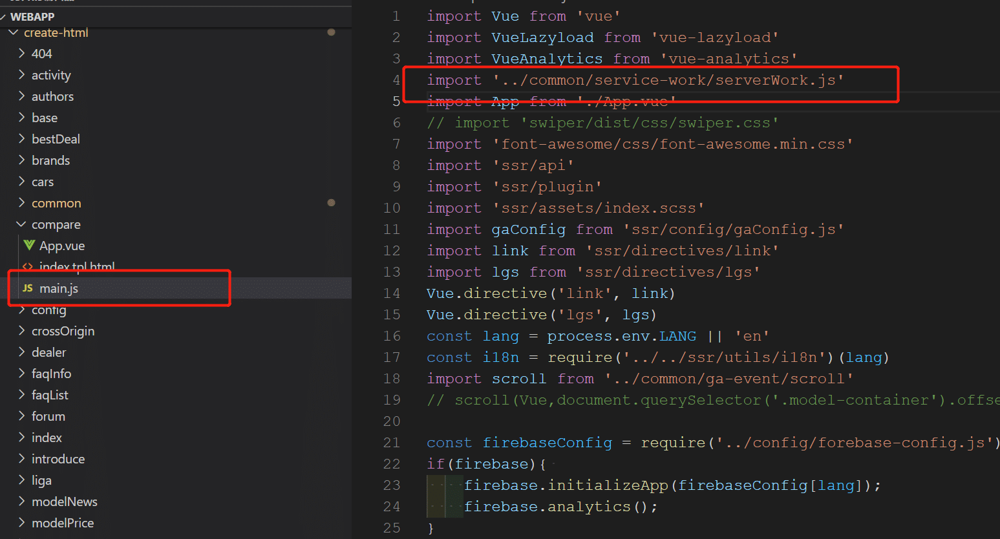

* 在构建客户端激活脚本 main.js 时，将 客户端清单文件 service worker 脚本 sw.js 通过 webpack 的 CopyPlugin 插件复制到构建的页面资源中。

  

### 参考资料

[渐进式 Web 应用 MDN](https://developer.mozilla.org/zh-CN/docs/Web/Progressive_web_apps)

[PWA实现](https://segmentfault.com/a/1190000012353473)

[PWA面试题汇总](https://juejin.cn/post/6844904052166230030)

## SEO 相关

* [搜索引擎优化 (SEO) 新手指南](https://support.google.com/webmasters/answer/7451184?hl=zh-Hans)

### TDK

* 概述： TDK 指页面 title、descrition、keywords；

  * 

  * tdk 对 seo 影响：

    * [网站TDK对SEO有什么影响](http://www.tianying888.com/gongsidongtai/70326.html)

  * 静态化页面 tkd 注入：tkd 保存在 `create-html/config/页面名称` ，在静态化时候 引入 context 中。

  * SSR页面 tdk 注入：页面/组件中定义 `head()` 方法返回页面 tdk

    * 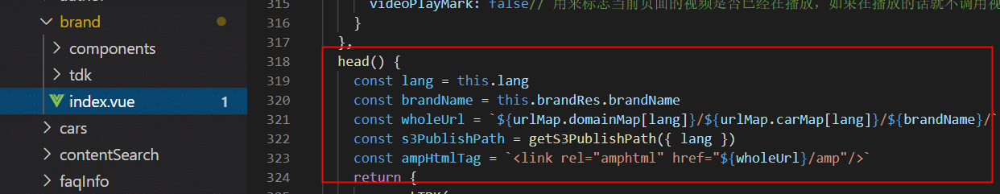

    * 在 `src/mixins/tdk.js` 中获取页面/组件中 head 对象，并解析对象注入字段到  context (服务端) 和 document
    * 在模板 `index.template.html` 中定义 tdk 并注入数据

### 结构化数据

* [google 结构化数据介绍](https://developers.google.com/search/docs/guides/search-gallery?hl=zh-cn)

### 站点地图 sitemap

* [了解站点地图](https://support.google.com/webmasters/answer/156184?hl=zh-Hans)

### CSS 对 SEO影响

* 隐藏内容元素对SEO影响：
  * css 中隐藏内容元素：
    * `display: none `
    * `visibility: hidden` 可见性为隐藏
    * `overflow:hidden` 隐藏溢出
  * `display:none` 和 `overflow:hidden` 大量地被使用会被SEO认为作弊
  * 常见问题： 
    * 使用 `display: none` 控制 tab 元素显示隐藏，但是  `display: none` 大量地被使用会被SEO认为作弊
      * 解决方式： 使用` height: 0`；控制不显示元素方式代替 `display:none`；

**参考**

* [浅谈Google SEO里的结构化数据优化](https://zhuanlan.zhihu.com/p/76258427)

### 反爬虫

* 需求： 经销商详细信息页面为防止被爬虫，需要加密处理
* 反爬虫方案：
* 经销商详细信息页面反爬虫方案：
  * 接口数据加密：
    * 加密库: [`xxtea-node`](https://www.npmjs.com/package/xxtea)
    * 解密方法：在经销商静态化脚本中，获取数据后通过 `decryptToString` 解密。
  * 前端展示数据反爬虫: 
    * 使用技术： `@font-face` 字体反爬虫
    * 使用步骤： 
      * 创建指定字符的自定义字体
      * ttf 转 svg
      * 构建映射关系
      * 前端使用 css 字体
        * 下载字体资源：字体资源保存在 `ssr/assets/font/iconfont/`
        * 注入字体资源： 页面静态化时，通过 context对象 中注入字体文件
        * 解析字体资源：模板文件增加 `<link/>` 引入字体文件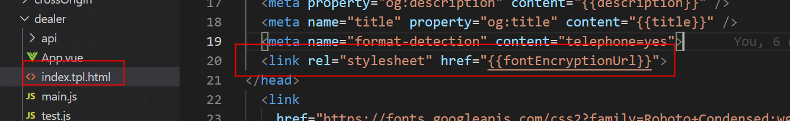 
        * 测试：通过打开 chrome 浏览器元素查看器查看 `<link/>` 中资源中是否有 fontFamily。  
        * 显示结果：加密以后字体显示chrome工具查看时为乱文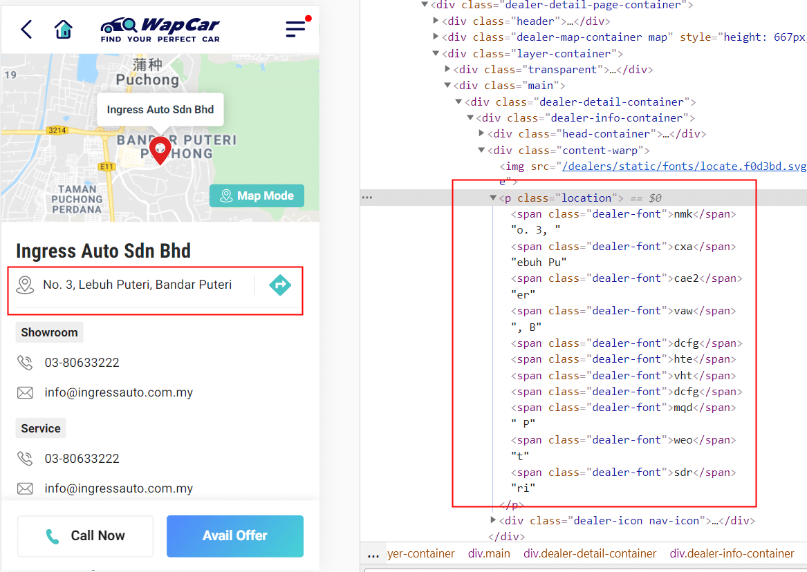

### 参考资料

* [[深入细枝末节，字体反爬虫到底怎么一回事](https://segmentfault.com/a/1190000021403816)](https://segmentfault.com/a/1190000021403816)
* [反爬虫之FONT-FACE拼凑式](https://blog.csdn.net/weixin_44321942/article/details/89192588)

* [反击爬虫，前端工程师的脑洞可以有多大？](https://cloud.tencent.com/developer/article/1008733)

## 项目优化

### SEO 相关优化

* 原本使用` <a> `标签包裹` ` 和` <p>` ，这种结构对爬虫不好，爬虫爬取 `<a>` 标签内应该需要文本，但又需要保持点击图片和文本跳转 
  * 优化： 使用 `<a>` 标签包裹链接，使用自定义指令 `v-link` 获取点击区域 `<div>` 内的` <a>` 标签的链接，添加点击事件

### Webpack 相关优化

* 文件引入使用 `require.context` 统一引入语言字典和 VueX 模块

### Vue 相关优化

* axios创建实例方式优化

  * 项目中 axios 使用方法:

    * 直接引入axios默认实例，并修改axios默认配置

    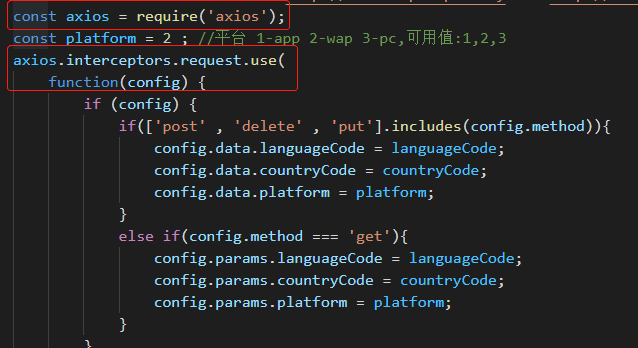

    * 问题： 
      * 当其他地方多处引入axios默认实例并修改默认配置，导致axios默认配置被覆盖
      * 共用axios拦截器
    * 分析：
      *  axios中会使用默认配置创建一个默认实例，并导出默认实例，当引入 axios时，引入axios默认实例 (lib/core/axios.js)  
      *  [源码](https://github.com/axios/axios/blob/master/lib/axios.js)
      *  

  * 优化: 

    * 引入地方创建新的实例，修改实例配置，避免配置被覆盖
    * 


### 性能优化

### HTML 优化

* 页面静态化:
  *  [VUE-SSR](https://ssr.vuejs.org/zh/)

* 预渲染： 
  * 使用插件： [prerender-spa-plugin](https://github.com/vuejs/vue-cli/tree/dev/packages/%40vue)
* 骨架屏：等待页面加载的时间越长，用户在页面加载完成之前离开的概率就越大。为了达到这个目的，网页加载完成前，我们应该用占位符在最终资源将会加载的地方展示最起码的视图骨架。
  * 使用插件： [vue-skeleton-webpack-plugin](https://github.com/lavas-project/vue-skeleton-webpack-plugin)

### JS 优化

* JS 脚本延迟加载和异步加载

###  CSS优化

### VUE 优化

### 打包优化

大部分用户不会用到一个网站的所有页面，但我们通常的做法却是把所有的功能都打包进一个很大的文件里面。一个 `bundle.js` 文件的大小可能会有几 M，一个打包后的 `style.css` 会包含网站的一切样式，从 CSS 结构定义到网站在各个版本的样式：移动端、平板、桌面、打印版等等。

通常来说，只加载一个较大的打包后文件会比加载很多个小文件要快一些，但如果用户并不是一开始就需要所有的资源，我们就可以首先加载那些关键的资源，其他的资源等到需要的时候再去加载它。

将所有文件打包到一起是不良做法，因为浏览器在把计算结果渲染到屏幕之前，需要先把 HTML、CSS 和 JavaScript 下载下来

### 图片优化

* 图片懒加载： [vue-lazyload](https://github.com/hilongjw/vue-lazyload)
* 本地图片压缩: tinyPNG，可以在不过分降低画质的情况下压缩文件的大小
* 网络图片裁剪
* 使用预加载图
* 使用合适图片格式
  * 大小：`PNG ≈ JPG > GIF `
  * 透明性：`PNG > GIF > JPG `
  * 色彩丰富程度：`JPG > PNG >GIF `
  * 兼容程度：`GIF ≈ JPG > PNG`
* 直接使用CSS替代部分背景图片
  * 404 页面背景图中小圆圈使用 css 绘制
* 雪碧图(未使用)
  * 优点：减少了大量的http请求。
  * 缺点：背景定位麻烦

### 网络优化

* Service Worker
* 避免 waterfall requests
  * [简单前端性能优化之Waterfall](https://www.jianshu.com/p/c7e0dad634db)

### 参考资料

* [使用RAIL模型评估性能](https://web.dev/rail/)
* [性能测评工具lighthouse的使用](https://www.cnblogs.com/wenxuehai/p/14236426.html)
* [搞懂性能优化](https://juejin.cn/post/6844904099515727886?from=timeline&isappinstalled=0%3Ffrom%3Dtimeline&isappinstalled=0)
* [项目中的优化](https://juejin.im/post/6844904131686039559#heading-2)
* [前端性能优化总结](https://juejin.im/post/6844904195707895816)

## 协作流程管理

### 协作工具

* 开发流程协作工具： git + gitee
* 自动化构建工具：jekiens

###  规范

#### Git 规范

* git分支类型主要有：
  * maste分支：上线分支；
  * 功能分支：针对某个功能开发，基于master分支创建一个功能分支，命名为feat-xxxx；
  * bug修复分支：针对线上某个bug进行修复，基于master分支创建一个bug修复分支，命名为fix-xxxx；
  * t1分支：测试服分支
* 参考： 
  * [Git 使用规范流程](http://www.ruanyifeng.com/blog/2015/08/git-use-process.html 	)

#### 代码规范

* 代码格式化工具：
  * vscode + eslint 自动格式化
  * 参考 [ESlint + stylelint + VSCode自动格式化代码(2020)](https://segmentfault.com/a/1190000021143326)
* 代码格式规范
  * 组件名称： 大驼峰命名
  * 重复使用两次以上的模块封装成组件

>[amp](https://amp.dev/documentation/guides-and-tutorials/develop/custom-javascript/)  
>[vue ssr](https://ssr.vuejs.org/zh/)  
>[jenkins地址](http://jenkins.wapcar.my/)  
>[接口文档](http://swagger.wapcar.my/doc.html)  
>[多国翻译文案](https://docs.google.com/spreadsheets/d/1EKSN7ttAfY1oCfQ8UiTrm7OjMsxKyJG5njsvaotJtgg/edit#gid=0)


## 项目难点和解决方案

### 平台兼容性

#### H5平台兼容性

兼容平台：

* android
* ios
* app webview
* facebook app webview
  * android
  * ios


## 相关原理

#### SSR

* [前端渲染模式的探索](http://www.ayqy.net/blog/csr-vs-ssr-vs-prerendering-vs-hydration/#articleHeader3)
* [细数 SSR 的利与弊](https://juejin.cn/post/6889216059832958990)


### 功能需求

#### 经销商

#### 评论

#### 登陆

#### 埋点上报

#### 新增国家

## 其他项目

#### AMP 页面

###### 参考资料

* [AMP文档](https://amp.dev/zh_cn/)

#### Android APP 与 H5 混合 

* 概述：Android APP 中使用 webview 内嵌 H5页面

##### 难点

* h5 跳转 Android 原生页面
* webview 和  h5 用户数据通信
* h5调用 webview 原生登陆弹窗

#### PC 端

##### 路由管理

###### 问题和解决方案

* 路由重复问题： 路由重复如何解决？如： 经销商品牌页面和经销商详细信息页面路由模式相同（固定路由和层级相同），动态路由路由匹配:` "/dealers/:name"` , `"/dealers/:brand" `无法区分页面

  * 解决方案:

    * 页面内通过匹配路由(正则匹配)显示不同组件
    * 组件中添加导航守卫(正则匹配)
    * 路由[高级匹配模式](https://router.vuejs.org/zh/guide/essentials/dynamic-matching.html#%E6%8D%95%E8%8E%B7%E6%89%80%E6%9C%89%E8%B7%AF%E7%94%B1%E6%88%96-404-not-found-%E8%B7%AF%E7%94%B1)

  * 三种方案都需要正则匹配路径

    * 原因：

      * new VueRouter() -> createMatcher() -> createRouteMap(routes) -> pathList/pathMap/nameMap （path/name -> RouteRecord映射表）[github](https://github.com/vuejs/vue-router/blob/dev/src/index.js) 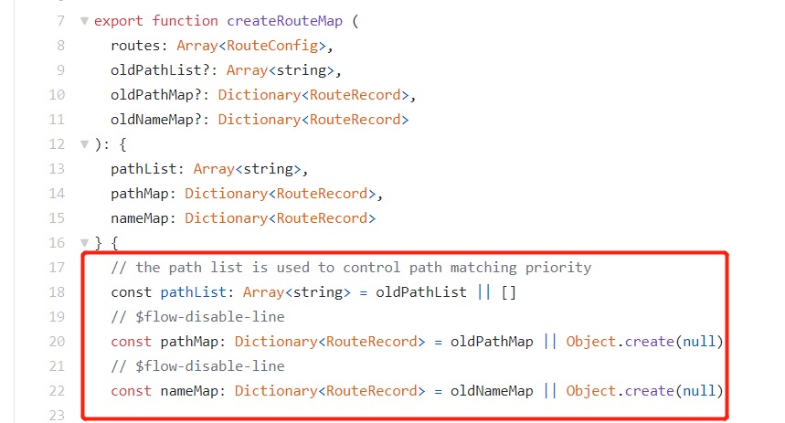

      * RouteRecord结构

        

      * `vue-router` 使用 [path-to-regexp](https://github.com/pillarjs/path-to-regexp/tree/v1.7.0) 作为路径匹配引擎，path-to-regexp 解析路由：

        * 
        * "/dealers/:name" , "/dealers/:brand" 最终解析的 Regexp 相同
        * "/dealers/:name" , "/dealers/:brand" 路由相同，同一个路径可以匹配多个路由，此时，匹配的优先级就按照路由的定义顺序：谁先定义的，谁的优先级就最高。

### 参考资料

[vue ssr](https://ssr.vuejs.org/zh/#%E4%B8%BA%E4%BB%80%E4%B9%88%E4%BD%BF%E7%94%A8%E6%9C%8D%E5%8A%A1%E5%99%A8%E7%AB%AF%E6%B8%B2%E6%9F%93-ssr-%EF%BC%9F)


