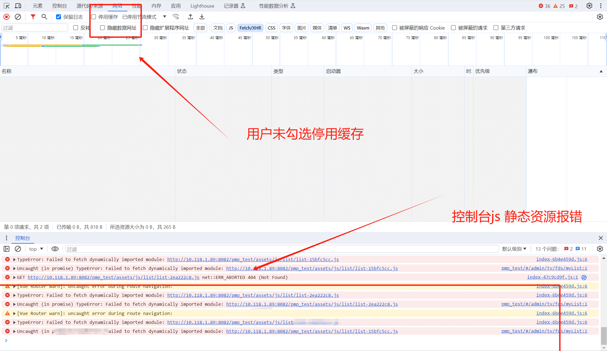
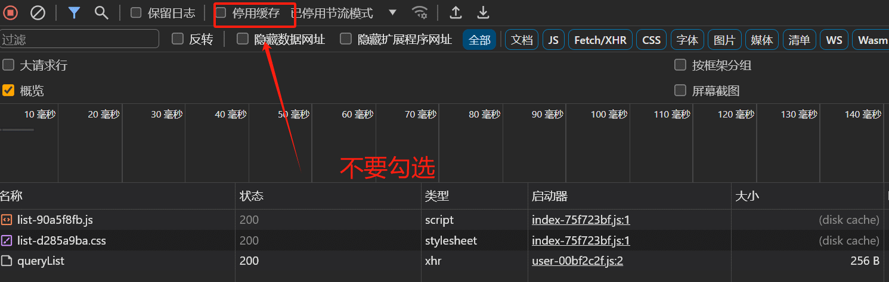
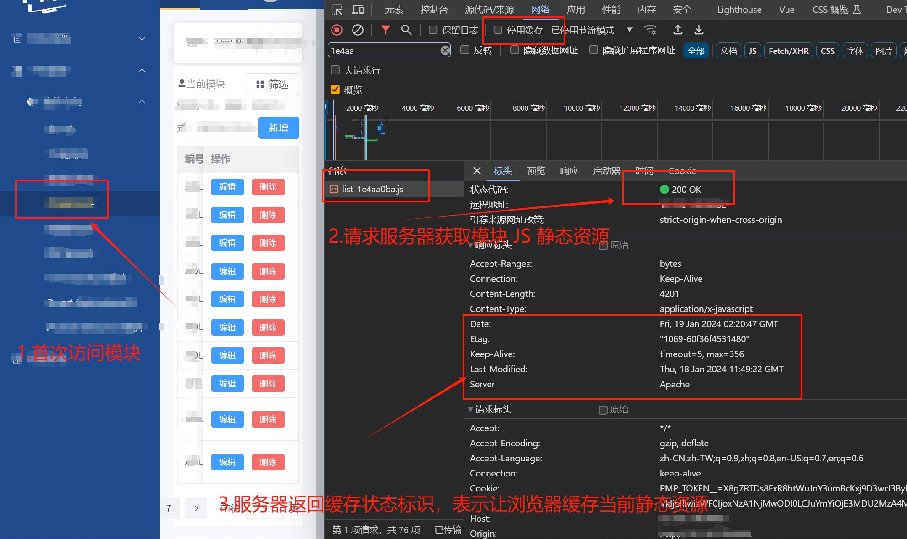
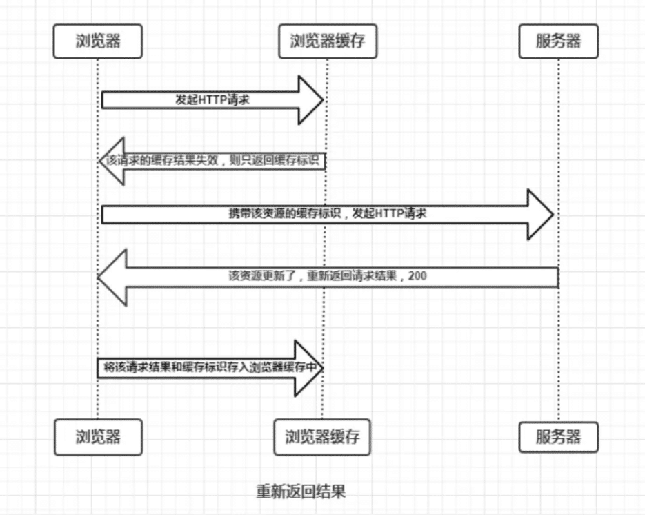
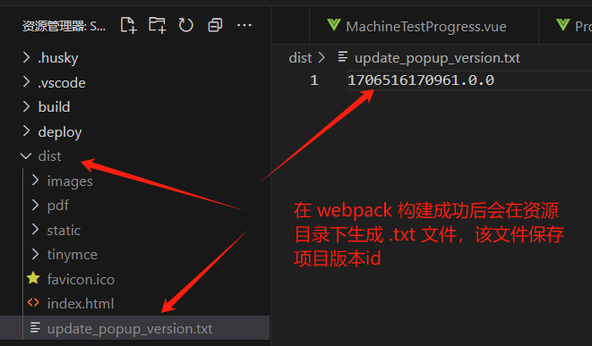

---
category:
  - 项目部署
tag:
  - 前端发版静态资源404问题
---
# 前端发版静态资源404问题

## 背景

> 一个使用 Vue 开发的单页面应用，在一次测试在使用中，发现使用着使用着，突然页面点击无效果（使用中前端进行过一次发版），测试打开控制台，发现控制台一堆 js 文件的 404 报错：
>
> 


## 现象描述

根据测试反馈现象如下：

1. 用户在使用过程中，之前点击某个页面是正常，(当前发版之后)，点击其他页面无任何反应;
2. 打开控制台，点击任何一个页面时候，会动态加载的一个 JS 文件，然后 JS 文件加载显示 404 报错；
3. 测试员浏览器 -> 开发者工具 -> 控制台 -> 网络 -> 停用缓存 ， 停用缓存 选项未勾选。
4. 当测试员刷新页面后，又能重新正常加载静态资源。


## **问题复现**

1. 打开浏览器 -> 开发者工具 -> 控制台 -> 网络 -> 停用缓存 ， 停用缓存 选项未勾选；
2. 打开项目，进入模块 A，页面停留在模块 A 不动；
3. 前端打包资源并发布版本；
4. 回到项目，点击模块 B 页面；
5. 查看浏览器 -> 开发者工具 -> 控制台 -> 网络，发现 B 模块静态资源 JS 文件加载失败，显示  404 状态；
6. 浏览器刷新页面后，模块 B 静态资源加载成功，但是此时模块 B 的静态资源 JS 文件名称发生了变化；
7. 对比本地构建后的静态资源文件，发现可以找到 B 模块的 JS 资源文件，证明刷新后重新获取了更新发版后的 JS 资源文件；


## 原因分析

>  通过分析现象发现，实际是前端更新已上线的项目，用户的浏览器显示的却是旧版的页面（浏览器缓存），没有及时获取到更新的资源，浏览器请求旧版本资源，但是旧版本资源已经被新版本资源覆盖，已经不存在，所以产生 404 报错；
>
> 此时，如果用户刷新一下页面，就得到更新后的资源

在分析产生浏览器缓存之前，我们先需要了解，在我们单页面应用中，静态资源是如何被分割和缓存的；

在我们们开发时候，经常会在项目中使用模块按需加载：

### **模块按需加载问题**

* 在使用 Vue/React 构建的单页面应用中，因为许多功能都集中的做到了一个 HTML中， 为了避免一次性的加载所有功能对应的代码，解决加载缓慢、交互卡顿问题；我们通常会在项目中使用 动态加载模块机制 ，通过使用 webpack  按需加载机制，把每一类合并为一个 Chunk，按需加载对应的 Chunk，**不同模块的同类静态资源通过在文件名称后添加hash区分**；（参考资料：[《深入浅出webpack-分割代码按需加载》](https://webpack.wuhaolin.cn/4%E4%BC%98%E5%8C%96/4-12%E6%8C%89%E9%9C%80%E5%8A%A0%E8%BD%BD.html)）

* 在使用 Vue/React 构建的单页面应用中，通过使用路由的按需加载，实现根据路由动态加载路由模块：

  * Vue 项目路由配置中通过动态引入组件实现路由模块按需加载：

  * 产生现象：

    * 点击模块 A 时，网络请求加载以下静态资源文件：

      

    * 点击模块 B 时，加载模块 B 的静态资源文件： 

从上图分析可看出，通过 动态引入组件实现路由模块按需加载，webpack 在构建时候会将不同路由组件打包成不同的代码 chunk，通过文件名称+hash 的方式区分相同类型的不同文件。

### **浏览器缓存问题**

> 浏览器缓存是前端优化的一个重要问题，缓存可以带来很多好处：
>
> 1. 减少冗余的数据传输，节省带宽；
> 2. 减轻服务器的请求负担，有缓存就可以少向服务器发送请求，尤其是对于一些访问量大的网站这点还是很重要的；
> 3. 资源从缓存中读取，无需向服务器发送请求再等待返回，加快了客户端的访问速度。
>
> 但是缓存同样给前端带来了一个很严重的问题：**前端发版静态资源404问题**
>
> * 如果前端重新构建资源发布新的版本，但是用户访问时浏览器读取的是缓存资源，那么用户就获取不到最新的页面，影响用户使用。 
>
> 浏览器缓存主要指http缓存，其机制是根据http报文的缓存标识进行相应操作。

#### **浏览器缓存介绍**

浏览器缓存位置有：

- **Service Worker**：运行在浏览器背后的独立线程，可以让我们自由控制缓存哪些文件、如何匹配缓存、如何读取缓存，并且缓存是持续性的；
- **Memory Cache**： 内存中的缓存；缓存持续性很短，会随着进程的释放而释放。**一旦我们关闭 Tab 页面，内存中的缓存也就被释放了**。
- **Disk Cache**：存储在硬盘中的缓存；根据 HTTP Herder 中的字段判断哪些资源需要缓存，哪些资源可以不请求直接使用，哪些资源已经过期需要重新请求。
- **Push Cache**：HTTP/2 中的内容，**只在会话（Session）中存在，一旦会话结束就被释放，并且缓存时间也很短暂**，在Chrome浏览器中只有5分钟左右，同时它也并非严格执行HTTP头中的缓存指令。

>  *详细的浏览器缓存知识参考我的博客：[前端存储 | Sewen 博客 (sewar-x.github.io)](https://sewar-x.github.io/browser/前端存储/#浏览器缓存机制)*


#### **浏览器缓存检查**

通过以下操作，可以查看浏览器是否使用了缓存：

**第一步：**

禁止勾选浏览器开发者工具中 “禁用缓存选项”：打开浏览器  -> 开发者工具 -> 控制台 -> 网络




**第二步：**

打开浏览器  -> 开发者工具 -> 控制台 -> 网络 -> 查看全部资源-> 点击模块资源 ->  检查 http 状态码：

**首次点击加载模块**，查看资源请求状态：



> 从上图可以看到，首次请求时候：
>
> 1. 浏览器会直接请求服务器，从服务器获取当前JS资源
>
> 2. 然后浏览器会返回当前资源的缓存标识，告诉浏览器需要缓存当前JS资源，浏览器会将此资源缓存到内存缓存中；
>
> 


**第三步：**

刷新当前页面，查看资源请求状态：


> 从上图可以看到，当刷新页面时候：
>
> 1. 浏览器判断当前资源缓存标识，发现缓存尚未失效，强制缓存生效；
> 2. 浏览器直接通过浏览器内存缓存中获取该资源，并返回；
>    


**第四步**

1. 关闭当前页面，重新打开浏览器tab并打开页面；
2. 刷新当前页面，查看资源请求状态：


> 从 上图可以看到，刷新页面后，再次请求资源时，进行**协商缓存**：
>
> 1. 浏览器发现资源缓存的内存缓存已经失效；
> 2. 浏览器携带缓存标识请求服务器资源；
> 3. 服务器返回 304 表示该静态资源无更新；
> 4. 浏览器发现 304 资源无更新，则从本地磁盘缓存中查找该资源；
>
> 


**第五步**

1. 前端重新构建项目，重新发布版本；
2. 打开模块页面，刷新，查看资源请求状态：


> 从上图可以看到，当我们重新构建前端项目，重新发布版本之后，再次打开原来项目，刷新页面后：
>
> 1. 浏览器根据缓存标识，向浏览器缓存中获取JS资源；
> 2. 浏览器缓存发现JS缓存失效，则返回告诉浏览器，资源缓存失效；
> 3. 浏览器会拿到缓存标识，向服务器发送请求；
> 4. 服务器返回 200 状态和最新的 JS 资源；
> 5. 浏览器根据缓存标识，将资源存入本地缓存；
> 6. 当用户再次刷新页面时候，浏览器缓存标识，从本地获取资源；
>
> 


### **资源404原因分析**

通过以上按需加载和浏览器缓存过程分析可知：

1. 项目中通过模块按需加载将项目静态资源进行分割，因此不同页面模块的 JS 资源不同，在点击项目不同模块时候，为了减少项目体积，会进行按需加载资源，动态请求当前模块资源；

2. 首次请求时候，浏览器会请求模块对应资源；

3. 浏览器在首次加载模块时可能会对静态资源文件进行缓存，并设置了一个过期时间。当重新发布静态资源后，新的模块的静态资源文件的URL与旧的模块的静态资源文件的URL不同，浏览器可能仍然使用了旧的缓存文件，导致加载失败；

4. 由于浏览器的缓存策略导致态资源HTML文件被缓存，浏览器获取的是旧版本的 HTML 资源，而其他静态资源通过 HTML 文件中定义的名称获取，因此当发布新的版本时，浏览器依旧通过旧版本HTML文件中定义的其他资源旧名称获取资源，导致加载 404 错误。

   

> 可能导致静态资源加载失败的原因：
>
> 1. **页面缓存**：
>    * 虽然静态资源文件名称每次发版后都会发生变化 (hash值发生变化)，但浏览器可能仍然缓存了旧版本的HTML文件。
>    * 当重新发布静态资源后，浏览器会请求新的静态资源文件，但仍然使用缓存的旧版本HTML文件中引用的静态资源文件名称，导致加载失败。
>    * 解决方案是在HTML文件的`<link>`或`<script>`标签中，添加版本号或哈希值来确保引用的静态资源文件名称与实际发布的文件名称保持一致。
> 2. **引用路径问题**：
>    * 在更新项目版本后，除了静态资源文件名称发生变化外，还需要确保HTML文件中引用的静态资源文件的路径正确。
>    * 如果路径不正确，浏览器无法找到对应的静态资源文件，导致加载失败。
>    * 因此需要确保HTML文件中引用的静态资源文件的路径与实际发布的路径一致。
> 3. **服务器配置**：
>    * 在静态资源服务器上，可能存在配置问题，导致无法正确访问新版本的静态资源文件。
>    * 确保静态资源服务器配置正确，并能够正确地提供新版本的静态资源文件。
>
> 总结起来，静态资源加载失败的原因可能包括： 浏览器缓存旧版本HTML文件、引用路径不正确以及服务器配置问题。
>
> 可以尝试清除浏览器缓存、检查HTML文件中的静态资源引用路径，以及确保静态资源服务器能够正确提供新版本的静态资源文件，以解决静态资源加载失败的问题。


## 解决方案

### **nginx反向代理**

> 以 Vue 为例，Vue 在打包的时候，`css` 和 `js` 名字都加了哈希值，所以改动后打包生成的js和css是唯一的，页面请求的是新资源，不会有缓存问题。
>
> 但是入口文件 `index.html` 会因为缓存造成更新问题，如果我们更新了，但是浏览器使用的是缓存，就会出现问题。
>
> 所以需要对入口文件设置不使用强制缓存，需要每次去服务器验证文件是否修改，即使用协商缓存。
>
> 使用 `nginx` 反向代理，在 `nginx.conf `文件的对应 `server `中设置 ` Cache-Control no-store`

`nginx` 反向代理配置示例：

```nginx
server {
    listen  监听端口号;
    server_name  域名;
    root   文件目录;
    index  index.html;

    location / {  // 不加这一句，会出现nginx欢迎页面，无法正确加载资源
      try_files $uri /index.html;
    }

    location ~ .*\.(html)$ {  // 对html文件限制缓存
      add_header Cache-Control no-store;  // 在此时添加，对 html 页面不缓存
     // 或者用add_header Cache-Control no-cache;替代上面那一句，协商缓存
      add_header Pragma no-cache;
    }

```


注意：

`Cache-Control: no-cache` 和 `Cache-Control: no-store `区别 :

> 它们都是HTTP响应头中控制缓存行为的指令。但存在一些区别：
>
> * `Cache-Control: no-cache`：这个指令告诉浏览器在使用缓存前需要先进行验证。
>   * 当浏览器接收到带有此指令的响应时，它会发送一个条件请求到服务器，以确定缓存的副本是否仍然有效。
>   * 服务器可以通过检查响应的条件头（如 `ETag` 或 `Last-Modified `）来判断是否返回新的内容。
>   * 如果服务器返回了状态码 304（Not Modified），则表示缓存的副本仍然有效，浏览器可以使用缓存。
>   * 如果服务器返回了新的内容，浏览器将使用新的内容并更新缓存。
>
> * `Cache-Control: no-store` ：这个指令告诉浏览器不要缓存任何响应内容，即使是临时的或私有的数据。
>   * 每次请求都必须从服务器获取完整的响应。
>   * 这意味着响应的内容不会被保存在缓存中，也不会被写入磁盘或其他持久存储。
>   * 这可以用于确保敏感数据不会被缓存，以增加安全性。
>
> 总结起来，区别在于：
>
> * `no-cache` 指令要求浏览器在使用缓存前进行验证，确保缓存的副本仍然有效，如果无效则获取新的内容更新缓存。
> * `no-store` 指令则要求浏览器不要缓存任何响应内容，每次请求都必须从服务器获取完整的响应，且不会将响应内容保存在


`Pragma: no-cache` 和 `Cache-Control: no-cache` 区别

> 都是用于控制缓存行为的HTTP头字段，但它们之间存在一些区别：
>
> 1. `Pragma: no-cache`：这个头字段是 `HTTP/1.0` 时代的遗留字段，用于向旧版的HTTP客户端和缓存代理服务器传达不缓存响应的指令。在现代的 `HTTP/1.1` 中，推荐使用`Cache-Control`头字段来控制缓存行为。尽管 `Pragma: no-cache` 在一些情况下仍然被使用，但它不是HTTP/1.1规范中定义的首选方式。
>
> 2. `Cache-Control: no-cache`：这个头字段是HTTP/1.1引入的，并成为控制缓存行为的主要方式。它指示浏览器在使用缓存之前需要发送一个验证请求到服务器，以确定缓存的副本是否仍然有效。如果服务器返回了状态码304（Not Modified），则表示缓存的副本仍然有效，浏览器可以使用缓存。如果服务器返回了新的内容，浏览器将使用新的内容并更新缓存。
>
> 建议在现代的Web应用程序中使用 `Cache-Control: no-cache` 来控制缓存行为，而不是使用 `Pragma: no-cache`。


### **在 html 页面加 `meta` 标签**

```html
<meta http-equiv="pragram" content="no-cache">
<meta http-equiv="cache-control" content="no-cache, no-store, must-revalidate">
<meta http-equiv="expires" content="0">
```


### **输出文件添加版本号**

#### **使用 `Vue` 脚手架的情况下：`vue.config.js`**

```js
// 动态版本号
const version = new Date().getTime()
// 配置
module.exports = {
  devServer: {},
  filenameHashing: false, // 打包的时候不使用 hash 值，因为后面自行添加时间戳或者版本号了
  css: {
    // 是否使用 css 分离插件 ExtractTextPlugin
    extract: {
      // 输出编译后的文件名称：【文件名称.时间戳】、【文件名称.版本号.时间戳】...
      filename: `css/[name].${version}.css`,   
      chunkFilename: `css/[name].${version}.css`
       // 或使用如下配置，通过固定版本号+动态版本号
      // filename: `css/[name].${process.env.VUE_APP_VERSION}.${version}.css`,   
     // chunkFilename: `css/[name].${process.env.VUE_APP_VERSION}.${version}.css`
    }
  },
  configureWebpack: {
    output: { // 输出编译后的文件名称：【文件名称.时间戳】、【文件名称.版本号.时间戳】...
      filename: `js/[name].${version}.js`,
      chunkFilename: `js/[name].${version}.js`
        // 或使用如下配置，通过固定版本号+动态版本号
       // filename: `js/[name].${process.env.VUE_APP_VERSION}.${version}.js`,
      // chunkFilename: `js/[name].${process.env.VUE_APP_VERSION}.${version}.js`
    }
  }
}

```


#### **使用 `Vue` 脚手架的情况下：`vue.config.js`**

```js
// 动态版本号
const version = new Date().getTime()
// 配置
module.exports = {
  devServer: {},
  filenameHashing: false, // 打包的时候不使用 hash 值，因为后面自行添加时间戳或者版本号了
  css: {
    // 是否使用 css 分离插件 ExtractTextPlugin
    extract: {
      // 输出编译后的文件名称：【文件名称.时间戳】、【文件名称.版本号.时间戳】...
      filename: `css/[name].${version}.css`,   
      chunkFilename: `css/[name].${version}.css`
      // 或使用如下配置，通过固定版本号+动态版本号
     // filename: `css/[name].${process.env.VUE_APP_VERSION}.${version}.css`,   
    // chunkFilename: `css/[name].${process.env.VUE_APP_VERSION}.${version}.css`
    }
  },
  configureWebpack: {
    output: { // 输出编译后的文件名称：【文件名称.时间戳】、【文件名称.版本号.时间戳】...
      filename: `js/[name].${version}.js`,
      chunkFilename: `js/[name].${version}.js`
       // 或使用如下配置，通过固定版本号+动态版本号
      // filename: `js/[name].${process.env.VUE_APP_VERSION}.${version}.js`,
     // chunkFilename: `js/[name].${process.env.VUE_APP_VERSION}.${version}.js`
    }
  }
}

```


### **版本更新检查插件**

**思路：**

1. 将在创建项目时候，自动在本地使用随机数生成一个版本号；
2. 在项目路由中，切换页面或显示页面时，检查服务器是否有新版本：
   * 有新版本则直接强制刷新或提示用户刷新，拉取最新版本代码


**实现：**

```js
// 使用细节：
// 1、导入方式：在 src 文件夹中使用可以 const version = require('@/utils/version') 这样引入使用，在根目录也就是 src 之外的文件夹则只能 const version = require('./src/utils/version') 这样引入使用

/** 
  * 引入请求库（如果想使用 axios 请求，打开注释即可，下面 get 方法中也需要打开注释，默认使用JS原生请求）
  * const axios = require('axios')
  * 引入文件管理模块（基于 node 环境，如果为原生前端开发，则注释掉 fs 相关的代码即可，直接手动创建一个文件使用 get 方法获   
  * 取即可，注意统一存储内容格式看 create 方法注释）
 **/
const fs = require('fs')

// 本地版本号缓存 key
const storageKey = 'currentVersion'

/**
* 创建版本文件（由于 fs 基于 node，且只需要每次编译时创建更新一遍，所以推荐放置于 vue.config.js 文件顶部使用，然后使用 * build 命令时会被成功执行创建好文件）
* path: 文件路径以及文件名称（例如：verify.text, public/verify.json 都是存在 public 文件夹中）
* version: 版本号（例如：版本号、时间戳 ...，统一存储内容为：{ version: xxx }）
* result: 回调创建于写入结果
**/ 
function create (path = 'public/verify.json', version = (new Date().getTime()), result) {
  // 在指定目录中添加校验文件
  fs.writeFile(path, JSON.stringify({ version }), (err) => {
    const isOK = !!err
    if (result) { result({ isOK }) }
  })
}

/**
 * 获取版本号（下面 get 方法）升级版（返回：当前版本号、是否有新版本。样例：{ version: xxx，new: true }，并缓存好新的版本号，可选择直接刷新页面。
vue 推荐放到路由守卫 router.afterEach(路由跳转后) 回调中，切换页面时随时检查版本是否更新，这个请求很快的，占用的时间几乎可以忽略，而且就是切换页面完成之后，就算失败或者网不好也不影响正常操作）
 *  path: 看下面 get 方法中的注释
 *  isReload: 如果有新版本使用，是否重新加载当前页面，强制浏览器重服务器获取当前页面资源，false 为后续自行手动刷新
 **/
function getVersion (path = 'verify.json', isReload = true) {
  return new Promise((resolve, reject) => {
    // 获取版本号
    get(path).then(res => {
      // 服务器版本号
      const version = res.version
      // 检查是否有新版本
      const isNew = isNewAvailable(version)
      // 缓存版本号
      save(version)
      // 有新版本的话是否重新从服务器加载页面数据
      if (isNew && isReload) { reload() }
      // 返回
      resolve({ version: version, new: isNew })
    }).catch(err => {
      // 返回
      reject(err)
    })
  })
}

/**
 * 获取版本号（返回：当前版本号。样例：{ version: xxx }，vue 推荐放到路由守卫 router.afterEach(路由跳转后) 回调中，切换页面时随时检查版本是否更新，这个请求很快的，占用的时间几乎可以忽略，而且就是切换页面完成之后，就算失败或者网不好也不影响正常操作）
 * path: 服务器文件路径（例如上 create() 中的路径，文件存 build 后存放在 public 文件夹中，服务器路径则直接域 + 文件名既可，如果为原生前端开发也是一样）
 **/
function get (path = 'verify.json') {
  // 服务器文件路径
  const url = `${ window.location.origin }/${ path }?timestamp=${ new Date().getTime() }`
  
  // axios 请求
  // return new Promise((resolve, reject) => {
  //   // 获取内容
  //   axios.get(url).then(res => {
  //     resolve(res)
  //   }).catch(err => {
  //     reject(err)
  //   })
  // })

  // JS原生请求
  return new Promise((resolve, reject) => {
    // 创建 XMLHttpRequest 对象
    var xhr = null
    if (window.XMLHttpRequest) {
      // 现代主流浏览器的写法
      xhr = new XMLHttpRequest()
    } else {
      // IE浏览器的写法
      xhr = new ActiveXObject('Microsoft.XMLHTTP')
    }
    // 创建网络请求对象
    xhr.open('get', url, true)
    // 发送请求
    xhr.send()
    // 请求回调
    xhr.onreadystatechange = () => {
      // 连接成功
      if (xhr.status === 200) {
        // 请求成功
        if (xhr.readyState === 4) {
          // 返回
          resolve(JSON.parse(xhr.responseText))
        }
      } else {
        // 连接失败
        reject(new Error('获取失败'))
      }
    }
  })
}

/**
 * 缓存版本号
 * version: 版本号（服务器获取到的版本号）
 **/
function save (version) {
  localStorage.setItem(storageKey, version)
}

/**
 * 检查是否有新版本（true：有新版本 false：没有新版本）
 * version: 版本号（服务器获取到的版本号）
 **/
function isNewAvailable (version) {
  // 没值（不清楚是否为新版本，默认返回 false, 如果这种情况下需要刷新，可修改返回 true）
  if (!version) { return false }
  // 获取本地缓存的版本号
  const storageVersion = localStorage.getItem(storageKey)
  // 本地没有版本号，说明本机第一次加载，不算新版本
  if (!storageVersion || storageVersion === 'undefined') { return false }
  // 本地有版本号，进行对比
  return `${version}` !== `${storageVersion}`
}

// 刷新当前网页
function reload () {
  // 重新加载当前页面，强制浏览器重服务器获取当前页面资源
  window.location.reload(true)
}

// 导出
module.exports = {
  // 创建版本文件
  create,
  // 获取版本号
  get,
  // 获取版本号升级版
  getVersion,
  // 缓存版本号
  save,
  // 检查是否有新版本
  isNewAvailable,
  // 刷新当前页面，强制浏览器重服务器获取当前页面资源
  reload
}

```


**使用:**

1. 在构建文件中引入脚本，在项目构建时，自动创建新版本：

   ```js
   // 在 build 时，每次创建/更新版本文件
   const version = require('./src/utils/version')
   version.create()
   ```

2. 方式一：在路由守卫中添加版本检查，当路由发生变化时候，获取项目版本号

   ```js
   import router from '@/router'
   const version = require('@/utils/version')
   // 路由跳转后执行
   router.afterEach((to, from) => {
     // 如果不想每个路由都检查是否有新版本，只需要在特定的页面才需要检查版本，可以在这里做白名单判断
     // 兼容版本，如果是新版本则进行刷新并缓存
     version.getVersion()
   })
   // 路由跳转前执行
   router.beforeEach((to, from, next) => {
     next()
   })
   
   ```

3. 方式二：当浏览器 页面显示时候，获取项目版本号

   1. 创建页面显示检测插件：

      ```js
      (function() {
        var hidden = "hidden";
      
        // 检测浏览器是否支持Page Visibility API
        if (hidden in document) {
          document.addEventListener("visibilitychange", handleVisibilityChange);
        } else if ((hidden = "mozHidden") in document) {
          document.addEventListener("mozvisibilitychange", handleVisibilityChange);
        } else if ((hidden = "webkitHidden") in document) {
          document.addEventListener("webkitvisibilitychange", handleVisibilityChange);
        } else if ((hidden = "msHidden") in document) {
          document.addEventListener("msvisibilitychange", handleVisibilityChange);
        } else if ("onfocusin" in document) {
          // 兼容旧版IE
          document.onfocusin = document.onfocusout = handleVisibilityChange;
        } else {
          // 兼容其他浏览器
          window.onpageshow = window.onpagehide = window.onfocus = window.onblur = handleVisibilityChange;
        }
      
        function handleVisibilityChange(event) {
          var visible = true;
      
          if (hidden in document) {
            visible = !document[hidden];
          } else if ("mozHidden" in document) {
            visible = !document.mozHidden;
          } else if ("webkitHidden" in document) {
            visible = !document.webkitHidden;
          } else if ("msHidden" in document) {
            visible = !document.msHidden;
          }
      
          if (visible) {
            // 用户切换到当前项目的浏览器选项卡，执行回调函数
            if (typeof pluginCallback === "function") {
              pluginCallback();
            }
          }
        }
      
        // 在插件中定义的回调函数
        var pluginCallback = function() {
          // 在这里执行你的逻辑
          console.log("用户切换到当前项目的浏览器选项卡");
        };
      
        // 暴露插件的回调函数，允许外部设置
        window.setPluginCallback = function(callback) {
          if (typeof callback === "function") {
            pluginCallback = callback;
          }
        };
      })();
      ```

      > 1. 将以上代码保存为一个 JavaScript 文件，例如 `tabVisibilityPlugin.js`。
      >
      > 2. 在你的 HTML 文件中引入该插件：`<script src="tabVisibilityPlugin.js"></script>`，或者在 main.js 文件中引入。
      >
      > 3. 在需要执行回调函数的地方，使用 `setPluginCallback` 函数来设置回调函数，例如：
      >
      >    ```js
      >    setPluginCallback(function() {
      >      // 当用户切换到当前项目的浏览器选项卡时，执行的逻辑
      >      console.log("用户切换到当前项目的浏览器选项卡");
      >    });
      >    ```
      >
      > 4. 当用户切换到你的项目所在的浏览器选项卡时，会执行设置的回调函数。你可以根据需要在回调函数中编写自己的逻辑。

   2. 在使用的文件中，引入版本检查插件和显示页面检查插件：

      ```js
      import router from '@/router'
      const version = require('@/utils/version')
      setPluginCallback(function() {
        // 当用户切换到当前项目的浏览器选项卡时，执行的逻辑
        // 兼容版本，如果是新版本则进行刷新并缓存
        version.getVersion()
        console.log("用户切换到当前项目的浏览器选项卡");
      });
      ```

      


#### **FEMessage/update-popup**

##### **文档地址**

 [FEMessage/update-popup: 💬Display an update message at right bottom (github.com)](https://github.com/FEMessage/update-popup) 

##### **作用**

检查当前应用是否是最新版本。如果不是，它会提醒您重新加载当前页面。


##### **原理**

1. 在 webpack 每次构建时候，在资源目录下生成一个版本更新文件，文件内容保存版本值：

   

2.  监听文档 visibilitychange 事件, 当文档显示时候触发该事件，执行定时器；
3. 使用 JS 方法`startInterval` 定时获取版本文件的版本，比较当前内存中存在的版本id和文件中记录的版本id 是否相同，不相同则使用弹窗提示。
4. 用户点击刷新，调用 `window.location.reload()` 方法刷新页面。


##### **插件使用**

**Vue2 中使用**

在 `vue.config.js` 文件中配置如下：

```js
// 1.引入插件
const UpdatePopup = require('@femessage/update-popup') // 版本更新提醒插件

// 2.配置 webpack 插件， 在 chainWebpack 属性中使用插件
  chainWebpack(config) {
    // 版本更新提醒插件
    config.plugin('femessage-update-popup').use(UpdatePopup, [{
      auto: true
    }])
  }
```


##### **源码分析**

插件位于 `./node_modules/@femessage/update-popup` 目录下。

**入口文件分析：**

入口文件为 `index.js` 文件：

```js
class UpdatePopup {
  /** @param {UpdatePopupOptions} options */
  constructor(options) {
    this.options = Object.assign(
      {
        publicPath: '',
        inject: true, // 自动注入到 webpack.entry
        envKey: 'UPDATE_POPUP_VERSION',
        versionFileName: 'update_popup_version.txt',
        auto: false, // 是否自动生成 version
        versionType: VERSION_TYPES.TIMESTAMP // 自动生成的 version 的方式
      },
      options
    )

    if (this.options.auto) {
      if (!VERSION_TYPES[this.options.versionType]) {
        if (process.env.NODE_ENV === 'production') {
          console.warn(
            `Unknown versionType: ${this.options.versionType}. Falling back to ${VERSION_TYPES.TIMESTAMP}`
          )
        }

        this.options.versionType = VERSION_TYPES.TIMESTAMP
      }

      switch (this.options.versionType) {
        case VERSION_TYPES.TIMESTAMP:
          this.version = `${Date.now()}.0.0`
          break
        default:
          break
      }
    } else {
      this.version = process.env[this.options.envKey] || '1.0.0'
    }
  }
  //暴露 `apply` 方法提供给 webpack 调用；
  /** @type {(compiler: import('webpack').Compiler) => void} */
  apply(compiler) {
    // common
    if (process.env.NODE_ENV !== 'production') return
    // v4
    if (_get(compiler, 'options.mode') !== 'production') return

    // 修改 webpack 入口文件
    if (this.options.inject) {
      compiler.options.entry = resolveWebpackEntry(compiler.options.entry, {
        NAME,
        filePath: resolveApp('main.js')
      })
    }

    // 先生成写入版本号的文件到 app
    compiler.hooks.beforeRun.tap(NAME, () => {
      // 清空缓存文件夹
      fs.emptyDirSync(resolveApp())

      const publicPath =
        _get(this, 'options.publicPath') ||
        _get(compiler, 'options.output.publicPath', '')

      this.generateFile(
        resolveApp('main.js'),
        readFile(resolve('src', 'main.js')),
        {
          VERSION_FILE_PATH: correctPath(
            publicPath,
            this.options.versionFileName
          )
        }
      )
    })

    // 复制文件到 webpack 输出目录
    compiler.hooks.done.tap(NAME, () => {
      const outputPath = _get(compiler, 'outputPath', '')

      // 版本号文件
      fs.outputFileSync(
        join(outputPath, this.options.versionFileName),
        this.version
      )
    })
  }
  // 生成文件
  /** @type {(dest: PathLike, content: string, extraReplacement: obj) => void} */
  generateFile(dest = '', content = '', extraReplacement = {}) {
    fs.outputFileSync(
      dest,
      replaceStr(content, {
        envKey: this.options.envKey,
        currentVersion: this.version,
        ...extraReplacement
      })
    )
  }
}
```

> 该文件主要定义 webpack 插件：
>
> 1. 定义 `UpdatePopup` 类;
> 2. 初始化插件选项；
> 3. 暴露 `apply` 方法提供给 webpack 调用；
> 4.  `apply` 方法中：
>    * 修改 webpack 入口文件；
>    * 生成写入版本号的文件到 app；
>    * 复制文件到 webpack 输出目录；

**main 文件分析**

主要执行文件位于 `./node_modules/@femessage/update-popup/src/main.js` 目录下：


> 该文件定义了：
>
> 1. 一个主要执行函数；
> 2. 版本比较方法：比较当前版本和文件版本；
> 3. 创建定时器方法：定时检测项目版本；

主要执行方法为 `main` ：

```js
// 主要执行函数
function main() {
  if (process.env.NODE_ENV !== 'production') return

  // 当前应用版本
  const currentVersion = '{{currentVersion}}'
  // 上次访问时间 ms
  let lastSeenMS = 0
  // 一秒 ms
  const OneSecondMS = 1000
  // dispatch 分发定时器动作
  const {dispatch} = createInterval(fetchVersion)

  let popupFlag = false
  // 检测文件版本
  checker()
  // 监听文档 visibilitychange 事件
  document.addEventListener('visibilitychange', checker)
  // 显示弹窗提示
  function showRefreshPopup() {
    popupFlag = true
    // 停止监听事件
    dispatch('stopInterval')

    // 延后 1 秒显示以使得没有那么唐突
    setTimeout(() => {
      createToast('发现新版本可用', {
        action: {
          text: '刷新',
          callback: () => {
            // 点击刷新按钮后回调，刷新页面
            window.location.reload()
          }
        }
      })
    }, OneSecondMS)
  }
  // 检测版本
  function checker() {
    if (popupFlag) return

    if (document.hidden) {
      // 离开时
      lastSeenMS = Date.now()
      // 启动定时器，定时检测
      dispatch('stopInterval')
    } else {
      const currentMS = Date.now()

      // 防止10秒之内频繁切换
      if (currentMS - lastSeenMS > OneSecondMS * 10) {
        dispatch('immediate')
        dispatch('startInterval', {interval: OneSecondMS * 60 * 60})
      }
    }
  }
  // 获取文件版本号
  function fetchVersion() {
    fetch('{{VERSION_FILE_PATH}}' + '?_=' + Date.now())
      .then(res => res.text())
      .then(version => {
        if (compareVersion((version || '').trim(), currentVersion)) {
          if (popupFlag) return
          showRefreshPopup()
        }
      })
  }
}
```

> 该方法逻辑如下：
>
> 1. 启动定时器检测文件版本；
>    * 定时获取文件版本号；
>    * 比较文件版本和内存版本号；
>    * 不一致时，使用 `vercel-toast` 插件提示更新；
> 2. 点击更新按钮，`window.location.reload()` 方法刷新页面。


## 参考资料

[浏览器缓存带来的前端项目更新问题及解决方法 - 掘金 (juejin.cn)](https://juejin.cn/post/7050363329142849543)
