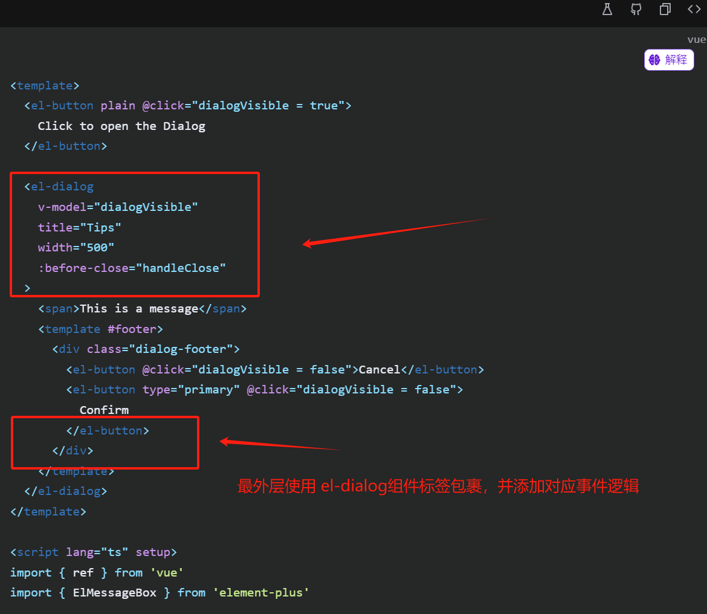

# **从零到一搭建公共组件库**

## **为什么要搭建公共组件库？**

### 公共组件是什么？

看 `ChatGPT` 给出的定义：

> 前端公共组件是指在前端开发过程中，经常会被多个页面或多个项目**复用的组件**。
>
> 这些组件通常具有一定的**独立性和通用性**，可以被封装成独立的模块，供多个页面或项目**共享使用**。
>
> 前端公共组件可以包括但不限于按钮、表单、导航栏、轮播图、模态框、消息提示等常见的UI组件，也可以包括一些业务逻辑相关的组件，如登录组件、购物车组件等。

Vue3 官方文档中对组件定义：[组件基础 | Vue.js (vuejs.org)](https://cn.vuejs.org/guide/essentials/component-basics.html)

> 组件允许我们将 UI 划分为独立的、可重用的部分，并且可以对每个部分进行单独的思考。在实际应用中，组件常常被组织成层层嵌套的树状结构：
>
> 

### **开源组件库与系统关系**

在封装组件库系统之前，我们先来了解一下，目前开源的各大组件库和系统之前的关系，才能明白为什么要封装自己的组件库。

以 [`Element-Plus` 组件库](https://element-plus.org/zh-CN/component/button.html)为例：

> [`Element-Plus` 组件库](https://element-plus.org/zh-CN/component/button.html)官方文档中，将组件库分为：
>
> **Basic 基础组件**：
>
> * Button 按钮、Border 边框、Color 色彩、Container 布局容器、Icon 图标、Layout 布局、Link 链接、Text 文本、Scrollbar 滚动条、Space 间距、Typography 排版；
>
> **配置组件：**
>
> * Config Provider 全局配置；
>
> **Form 表单组件：**
>
> * Autocomplete 自动补全输入框、Cascader 级联选择器、Checkbox 多选框、Color Picker 取色器、Date Picker 日期选择器、DateTime Picker 日期时间选择器、Form 表单、Input 输入框、Input Number 数字输入框、Radio 单选框、Rate 评分、Select 选择器、Virtualized Select 虚拟化选择器、Slider 滑块、Switch 开关、Time Picker 时间选择器、Time Select 时间选择、Transfer 穿梭框、Upload 上传；
>
> **Data 数据展示：**
>
> * Avatar 头像、Badge 徽章、Calendar 日历、Card 卡片、Carousel 走马灯、Collapse 折叠面板、Descriptions 描述列表、Empty 空状态、Image 图片、Infinite Scroll 无限滚动、Pagination 分页、Progress 进度条、Result 结果、Skeleton 骨架屏、Table 表格、Virtualized Table 虚拟化表格、Tag 标签、Timeline 时间线、Tour 漫游式引导、Tree 树形控件、TreeSelect 树形选择、Virtualized Tree 虚拟化树形控件、Statistic 统计组件（2.2.30）；
>
> **Navigation 导航组件：**
>
> * Affix 固钉、Backtop 回到顶部、Breadcrumb 面包屑、Dropdown 下拉菜单、Menu 菜单、Page Header 页头、Steps 步骤条、Tabs 标签页；
>
> **Feedback 反馈组件**：
>
> * Alert 提示、Dialog 对话框、Drawer 抽屉、Loading 加载、Message 消息提示、Message Box 消息弹出框、Notification 通知、Popconfirm 气泡确认框、Popover 弹出框、Tooltip 文字提示；
>
> **Others 其他组件：**
>
> * Divider 分割线、Watermark 水印；

通过以上分类可以看到：Element-Plus 官方将组件库划分的组件粒度非常细，粒度细到按钮级别；Element-Plus 将组件粒度划分为那么细，个人认为是基于以下原因：

1. **可维护性和可复用性**：Element-Plus作为开源组件库，需要考虑各种应用的需求场景，因此将组件拆分成较小的粒度，每个组件都承担特定的功能，这使得组件更易于理解和维护。同时，小粒度的组件也更易于复用，可以在不同的场景和项目中重复使用，提高了组件的利用率。
2. **性能优化**：小粒度的组件通常意味着更小的体积和更快的加载速度。这有助于提升应用的性能。
3. **设计一致性**：通过将组件拆分成较小的粒度，可以更容易地保持设计的一致性。每个组件都有明确的接口和规范，这使得不同组件之间的交互和配合更加顺畅，有助于提升整体的用户体验。

然而，通常系统中，存在许多相同或相似的组件/模块，特别是在 to B 端项目或中台系统中，大量存在各种各样的From 表单组件、表格组件、搜索组件和弹窗表单组件等。这些组件变化灵活，但又属于一类组件，

以From表单组件为例：B端系统表单内容可以灵活多变，但是外部都是需要套用 element-plus 的 From 表单组件，有统一的提交事件和数据格式等；

> 示例表单A:
>
> 
>
> 示例表单B:
>
> 
>
> 表单A和表单B相同点：
>
> * 都是以弹窗的形式弹出让用户填写表单信息，都需要弹窗组件包裹，因此需要统一的弹窗操作事件：关闭，显示等；
> * 都存在统一的操作：确认和取消；
> * 都存在统一的表单组件和数据格式：都需要使用 From 表单组件包裹和返回统一的数据格式给后端；
>
> 表单A和表单B不相同点：
>
> * 表单项和数量不同；
> * 表单二存在提示组件；

以上两个简单的表单组件，假如使用 Element-Plus 开源标签组件模式开发：

* 第一步：两个组件都在最外层使用一个弹窗组件包裹，并添加对应事件逻辑：
* 第二步：添加From组件逻辑：所有 form 组件都需要组件标签，组件字段和组件事件代码。

* 第三步：添加两个操作按钮；
* 第四步：添加表单内容组件；

通过以上步骤可知：在B端系统中，同样是两个弹窗显示的表单组件，都需要重复以上四个步骤，并且以上四个步骤中第一第二步中都是一模一样的代码逻辑，如果采用单页面开发（一个表单一个页面）模式，重复开发弹窗和表单组件逻辑，随着表单数量增加，此类重复工作量将呈现量级增加！除此之外，项目可维护性也将非常差！一旦产品提出需要在所有弹窗中添加 标题或改动标题位置此类需求，需要找到所有弹窗组件进行修改。

### **为什么要搭建组件库？**

通过以上分析。为了减少开发工作量，提高项目的可维护性，我们需要将一些通用的组件代码封装在一起，减少开发工作量和提高项目的可维护性，并统一所有组件的样式风格。

**提高开发效率**

组件化开发将常用的功能或模块封装成独立的组件，开发者在开发过程中可以直接使用这些组件，而不需要从头开始编写代码。这样可以大大减少重复劳动，提高开发效率。

**降低维护成本**

由于组件是独立的，因此当某个组件出现问题时，只需要对该组件进行维护，而不需要对整个项目进行重新开发和测试。这大大降低了维护成本。

**统一风格和样式**

通过搭建前端组件库，可以制定统一的开发标准，包括组件的命名、接口、样式等，这样可以保证团队成员在开发过程中遵循相同的规范和标准，提高代码的可读性和可维护性。

**提高代码质量**

组件库中的组件都是经过严格测试和验证的，可以确保组件的质量和稳定性。同时，组件化开发也鼓励开发者编写高内聚、低耦合的代码，这有助于提高代码质量。

**促进团队协作**

通过搭建前端组件库，团队成员可以共享组件和资源，减少沟通成本和重复开发。同时，组件库也可以作为团队的技术积累和传承，方便新成员快速融入团队和开发工作。

### **为什么要搭建前端公共组件库？**

目前，通过搭建组件库的方式确实可以节省项目开发时间，然而，在每个项目都搭建自己的公共组件库的方式，不仅耗费大量时间，并且项目之间的组件库也是相互独立，每次开发一个新系统，都需要搭建系统自己的组件库，因此极大浪费人力成本。

搭建前端公共组件库的原因主要有以下几点：

**重用性**：

公共组件库允许开发团队在不同项目或同一项目的不同部分中重用组件。这避免了代码的重复编写，提高了开发效率。

**一致性**：

公共组件库确保所有项目都使用相同的组件和接口，从而提高了用户体验的一致性。它还可以帮助维护者更容易地理解代码，因为组件的使用方式和行为在所有项目中都是一致的。

**可维护性**：

当需要更新或修复组件时，只需要在一个地方进行修改，而不需要在整个代码库中查找和替换。这大大减少了维护成本。

**促进团队协作**：

公共组件库可以作为团队的共享资源，帮助新成员更快地理解项目的架构和代码风格。它还可以作为团队内部的知识传递工具，使得团队成员能够共享彼此的经验和最佳实践。

**降低学习曲线**：

对于新加入团队的成员来说，使用公共组件库可以降低学习曲线。他们可以快速了解并使用已经存在的组件，而不需要从头开始学习如何编写每一个细节。

**技术积累和传承**：

公共组件库可以作为技术积累和传承的工具。随着时间的推移，团队可以积累更多的组件和最佳实践，并将其传递给新成员。

## **目标**

第一步：搭建兼容 `Vue3` 版本的组件库；

第二步：组件库兼容 `Vue2` 版本；

第三步：组件库兼容 `React` ；

## **预备知识**

## **技术选型**

## **搭建流程**

## **参考资料**

[快上车！从零开始搭建一个属于自己的组件库！ - 掘金 (juejin.cn)](https://juejin.cn/post/7120893568553582622)
