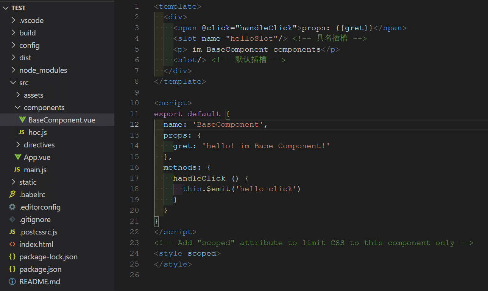
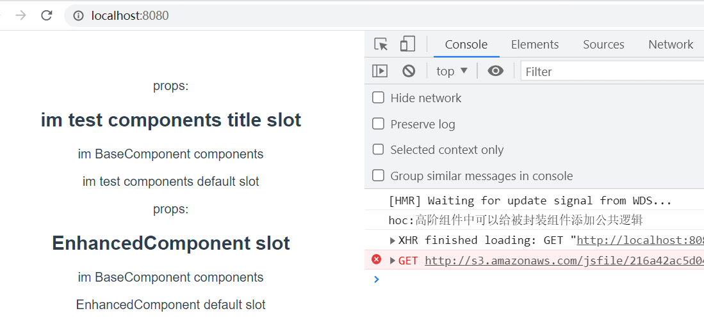

# 组件和组件封装

## Vue2 组件基础

关于 Vue2 组件基础知识总结，可以参考我的博客文章 [Vue2.x 组件](https://sewar-x.github.io/vue/#%E7%BB%84%E4%BB%B6)，文章中包含以下关于组件的知识总结：

* [组件基础](https://sewar-x.github.io/vue/#%E7%BB%84%E4%BB%B6%E5%9F%BA%E7%A1%80)
* [组件注册原理](https://sewar-x.github.io/vue/#%E7%BB%84%E4%BB%B6%E5%9F%BA%E7%A1%80)
* [组件声明周期原理](https://sewar-x.github.io/vue/#%E7%BB%84%E4%BB%B6%E7%94%9F%E5%91%BD%E5%91%A8%E6%9C%9F)
* [组件分类](https://sewar-x.github.io/vue/#%E7%BB%84%E4%BB%B6%E5%88%86%E7%B1%BB)
* [组件通信方式总结](https://sewar-x.github.io/vue/#%E7%BB%84%E4%BB%B6%E9%80%9A%E4%BF%A1)
* [扩展组件方式总结](https://sewar-x.github.io/vue/#%E6%89%A9%E5%B1%95%E7%BB%84%E4%BB%B6%E6%96%B9%E5%BC%8F)
* [高阶组件](https://sewar-x.github.io/vue/#%E9%AB%98%E9%98%B6%E7%BB%84%E4%BB%B6)
* [常见内置组件原理](https://sewar-x.github.io/vue/#%E9%AB%98%E9%98%B6%E7%BB%84%E4%BB%B6)

当前文章是对组件知识点扩展

## Web Components

### 参考资料

[Web Components 入门实例教程](https://www.ruanyifeng.com/blog/2019/08/web_components.html)

[案例实战，一文吃透 Web Components](https://juejin.cn/post/7010595352550047752)

## 高阶组件

### 概念

高阶组件（Higher-Order Component，HOC）是一种在React中用于组件复用和逻辑共享的模式。

它本质上是一个函数，接收一个组件作为参数，并返回一个新的组件。

在 Vue 的世界里，组件是一个对象，所以高阶组件就是一个函数接受一个对象，返回一个新的包装好的对象。Vue 中，高阶组件就是 `f(object) -> 新的object`。

### 特点

HOC具有以下作用和特点：

1. **组件复用：** HOC可以将通用的功能逻辑封装在一个函数中，并应用于多个组件。通过将公共逻辑提取到HOC中，可以避免在多个组件中重复编写相同的代码，提高了代码的复用性。
2. **逻辑共享：** HOC允许你在组件之间共享逻辑，例如状态管理、数据获取、认证等。你可以通过HOC将这些逻辑从组件中分离出来，并在需要的地方应用它们，以实现逻辑的共享和解耦。
3. **属性代理和增强：** HOC可以通过属性代理的方式，将额外的属性和功能注入到被包裹的组件中。这使得你可以修改、增强或覆盖被包裹组件的行为，以满足特定的需求。例如，你可以通过HOC向组件注入路由信息、国际化功能或其他上下文信息。
4. **抽象和组合：** HOC可以将组件的实现细节进行抽象，提供一个更高层次的接口。通过将不相关的实现细节封装到HOC中，你可以更专注于组件的业务逻辑，并实现组件的组合。这样，你可以构建出更复杂和可扩展的组件树。

需要注意的是，HOC本身并不是React的特性或API，而是一种基于React组合特性的设计模式。它可以用来解决一些常见的代码共享和复用问题，但在使用HOC时需要谨慎，避免滥用。滥用HOC可能导致组件关系复杂化、调试困难等问题。在使用HOC时，建议遵循一些最佳实践，如清晰的命名、避免命名冲突、遵循传递不变性等规则。

### 规则

* 高阶组件(`HOC`)应该是无副作用的纯函数，且不应该修改原组件；
  * 高阶组件纯函数，它接收一个组件作为参数并返回了一个新的组件，在新组件的 `render` 函数中仅仅渲染了被包装的组件，并没有侵入式的修改它。
* 高阶组件(`HOC`)不关心你传递的数据(`props`)是什么，并且被包装组件不关心数据来源；
* 高阶组件(`HOC`)接收到的 `props` 应该透传给被包装组件：高阶组件完全可以添加、删除、修改 `props`，但是除此之外，要将其余 `props` 透传，否则在层级较深的嵌套关系中(`这是高阶组件的常见问题`)将造成 `props` 阻塞。

### 实现

* 高阶组件：用于封装组件的公共逻辑组件，给所有被封装的组件添加初始化 console 打印方法。

  

* 测试：

  * 编写被包裹的组件：被封装的组件 `BaseCompoent`。

    

  * 使用方式： 使用高阶组件包裹基础组件 `BaseComponent` 生成一个新的组。

    

  * 测试结果：

## 命令式组件

### 概念

* 命令式组件封装是一种将功能封装在组件内部，并通过命令式的方式进行调用和控制的封装方法。
* 在命令式组件封装中，组件负责封装一定的功能逻辑，并提供一组接口或方法，供外部代码调用来触发和控制组件的行为。

* 在 `element-ui`  [MessageBox 弹框](https://element.eleme.cn/#/zh-CN/component/message-box)，提供了命令式调用组件方法:

  ```js
  <template>
    <el-button type="text" @click="open">点击打开 Message Box</el-button>
  </template>
  
  <script>
    export default {
      methods: {
        open() {
          // 命令式调用弹窗组件
          this.$alert('这是一段内容', '标题名称', {
            confirmButtonText: '确定',
            callback: action => {
              this.$message({
                type: 'info',
                message: `action: ${ action }`
              });
            }
          });
        }
      }
    }
  </script>
  ```


### 为什么要用命令式组件？

* 简化组件使用方式：例如使用 在 `element-ui`  [MessageBox 弹框](https://element.eleme.cn/#/zh-CN/component/message-box) 组件，可以直接通过 `this.$alert`  方法调用该组件，使用简单;
* 使用模板组件方式需引入组件、传入属性、监听组件事件等操作，导致简单组件使用成本高；使用命令组件可以在项目的任何页面快速使用组件。

### Vue2 封装命令式组件

#### 实现

**思路**

1. 使用 `vue2` 插件机制，在创建 vue 实例之前，给 vue 实例对象挂载命令式组件对象，使在组件内可以使用 `this.$yourComponents(options)` 直接通过命令式调用组件；

2. 在插件中，传入 `install` 方法，在 `install ` 方法中执行实例化你的组件操作：

   * 使用 ` Vue.extend()` 实例化组件;

   * 挂载组件并将组件挂载到 `dom` ;


> 下面以封装一个通用弹窗组件为基础示例

**1.编写通用弹窗组件**

```js
<template>
  <div class="dialog-wrapper">
    <!--stop的iframe阻止submit后跳转-->
    <iframe name="stop" class="none" style="display: none" />
    <!--stop的iframe阻止submit后跳转 end-->
    <el-dialog
      ref="dialogWrapper"
      v-el-drag-dialog
      class="dialog-component"
      :title="title"
      :visible="visible"
      :width="width"
      :close-on-click-modal="false"
      v-bind="$attrs"
      v-on="$listeners"
      @close="close"
    >
      <slot name="pre-content" />
      <template slot="title">
        <slot name="dialogTitle" />
      </template>
      <slot name="content" />
      <div v-if="items.length > 0">
        <el-form
          :ref="formRef"
          :model="data"
          :label-width="labelWidth"
          label-position="left"
          target="stop"
          :rules="rules"
        >
          <el-row
            v-for="(row, rowIndex) in items"
            :key="rowIndex"
            :gutter="24"
            :class="`form-row-${rowIndex}`"
          >
            <el-col
              v-for="(item, index) in isArray(row)"
              :key="index"
              :span="item.span || 24 / row.length"
              :class="item.colClassName"
            >
              <el-form-item
                :key="item.label || index"
                :style="item.styles"
                :class="[
                  isRequire(item) ? 'form-item-required' : '',
                  !item.label ? 'hidden-form-item-label' : '',
                  item.className,
                  item.attrs && item.attrs.disabled ? 'hidden-tips' : '',
                ]"
                :label="item.label"
                :prop="item.prop"
                :rules="item.rules"
                :label-width="item.labelWidth || '120px'"
                :name="item.prop"
              >
                <!--自定义插槽-->
                <slot
                  v-if="item.type == $const.DialogCompType.slot"
                  :item="item"
                  :name="item.slotName"
                />
                <!--单行输入框-->
                <el-input
                  v-if="item.type == $const.DialogCompType.input"
                  v-model="data[item.prop]"
                  :name="item.prop"
                  auto-complete="on"
                  class="item-inputs"
                  :style="{ width: `${item.width}` }"
                  :placeholder="placeholderFormate(item)"
                  v-bind="item.attrs"
                  v-on="item.listeners"
                >
                  <template v-if="item.slot" :slot="item.slotName">{{
                    item.slotContent
                  }}</template>
                </el-input>

                <!--远程搜索选择器-->
                <remote-search-selector
                  v-if="item.type == $const.DialogCompType.remoteSearchSelector"
                  :init-value="data[item.prop]"
                  class="item-inputs"
                  :placeholder="placeholderFormate(item)"
                  v-bind="item.attrs"
                  :options="item.optionList"
                  :show-value="item.showValue"
                  :remote-methods="item.remoteMethod"
                  :style="{ width: `${item.width}` }"
                  v-on="item.listeners"
                  @valueChange="remoteSearchValueChage($event, data, item)"
                />
                <!--数字输入-->
                <el-input-number
                  v-if="item.type == $const.DialogCompType.number"
                  v-model="data[item.prop]"
                  class="item-inputs"
                  :style="{ width: `${item.width}` }"
                  :placeholder="placeholderFormate(item)"
                  v-bind="item.attrs"
                  v-on="item.listeners"
                />
                <!--多行输入-->
                <el-input
                  v-if="item.type == $const.DialogCompType.textarea"
                  v-model="data[item.prop]"
                  :name="item.prop"
                  auto-complete="on"
                  class="item-inputs"
                  :style="{ width: `${item.width}` }"
                  type="textarea"
                  :placeholder="placeholderFormate(item)"
                  v-bind="item.attrs"
                  autosize
                  v-on="item.listeners"
                />
                <!--日期选择器-->
                <el-date-picker
                  v-if="item.type == $const.DialogCompType.datePicker"
                  v-model="data[item.prop]"
                  class="item-inputs"
                  :type="(item.attrs && item.attrs.type) || 'date'"
                  :placeholder="placeholderFormate(item)"
                  :style="{ width: `${item.width}` }"
                  v-bind="item.attrs"
                  v-on="item.listeners"
                />
                <!--日期时间选择器-->
                <el-date-picker
                  v-if="item.type == $const.DialogCompType.dateTime"
                  v-model="data[item.prop]"
                  class="item-inputs"
                  type="datetime"
                  :placeholder="placeholderFormate(item)"
                  :style="{ width: `${item.width}` }"
                  v-bind="item.attrs"
                  v-on="item.listeners"
                />
                <!--日期时间选择器-带标记封装组件-->
                <date-picker-wrap
                  v-if="item.type == $const.DialogCompType.datePickerColor"
                  :date="data[item.prop]"
                  class="item-inputs"
                  :placeholder="placeholderFormate(item)"
                  :style="{ width: `${item.width}` }"
                  v-bind="item.attrs"
                  v-on="item.listeners"
                />
                <!--开关-->
                <el-switch
                  v-if="item.type == $const.DialogCompType.switch"
                  v-model="data[item.prop]"
                  v-bind="item.attrs"
                  v-on="item.listeners"
                />
                <!--下拉菜单-->
                <el-dropdown
                  v-if="item.type == $const.DialogCompType.dropdown"
                  v-bind="item.attrs"
                  v-on="item.listeners"
                >
                  <el-button v-bind="item.dropdownButtonsAttrs">
                    {{ item.dropdownLabel }}
                    <i class="el-icon-arrow-down el-icon--right" />
                  </el-button>

                  <el-dropdown-menu slot="dropdown">
                    <el-dropdown-item
                      v-for="dItem in item.dropdownItem"
                      :key="dItem.label"
                      v-bind="dItem.attrs"
                      v-on="dItem.listeners"
                    >
                      {{ dItem.label }}
                    </el-dropdown-item>
                  </el-dropdown-menu>
                </el-dropdown>

                <!--普通下拉选择器-->
                <SelectorWrap
                  v-if="item.type == $const.DialogCompType.select"
                  :key="item.prop"
                  :item="item"
                  :data="data"
                  v-bind="item.attrs"
                  v-on="item.listeners"
                />

                <!--单选框-->
                <el-radio-group
                  v-if="item.type == $const.DialogCompType.radio"
                  v-model="data[item.prop]"
                  class="item-inputs"
                  :style="{ width: `${item.width}` }"
                  v-bind="item.attrs"
                  v-on="item.listeners"
                >
                  <el-radio
                    v-for="option in item.optionList"
                    :key="option.id || option.value"
                    :label="option.value"
                  >
                    {{ option.label }}
                  </el-radio>
                </el-radio-group>
                <!--滑动条-->
                <el-slider
                  v-if="item.type == $const.DialogCompType.slider"
                  v-model="data[item.prop]"
                  class="item-inputs"
                  v-bind="item.attrs"
                  v-on="item.listeners"
                />
                <!--警告-->
                <el-alert
                  v-if="item.type == $const.DialogCompType.alert"
                  v-bind="item.attrs"
                />
                <el-divider
                  v-if="item.type == $const.DialogCompType.divider"
                  v-bind="item.attrs"
                >
                  <span v-if="item.tips">{{ item.tips }}</span>
                </el-divider>
                <!--文件上传-->
                <file-upload
                  v-if="item.type == $const.DialogCompType.files"
                  class="item-inputs"
                  v-bind="item.attrs"
                  v-on="item.listeners"
                />
                <!--按钮组-->
                <div
                  v-if="item.type == $const.DialogCompType.buttons"
                  class="dialog-buttons"
                  :style="{
                    display: 'flex',
                    'justify-content': buttonsAlign[item.align] || 'flex-end',
                  }"
                >
                  <el-button
                    v-for="but in item.buttons"
                    :key="but.label"
                    :type="but.type"
                    v-bind="but.attrs"
                    size="small"
                    @click="submitValidate(but.validate, but.reset, but.event)"
                  >
                    {{ but.label }}
                  </el-button>
                </div>
                <!--富文本编辑器-->
                <tinymce
                  v-if="item.type == $const.DialogCompType.editor"
                  v-model="data[item.prop]"
                  :height="item.height"
                />
              </el-form-item>
            </el-col>
          </el-row>
        </el-form>
      </div>
      <slot name="after-content" />
    </el-dialog>
  </div>
</template>

<script>
import FileUpload from "@/components/fileUpload/index.vue";
import Tinymce from "@/components/Tinymce";
import RemoteSearchSelector from "@/components/RemoteSearchSelector";
import elDragDialog from "@/directive/el-drag-dialog"; // base on element-ui
import DatePickerWrap from "@/components/DatePickerWrap";
import SelectorWrap from "@/components/SelectorWrap";
import { placeholderFormate, eventHandler } from "@/components/FormWrap/config.js";
export default {
  name: "DiallogWrap",
  directives: { elDragDialog },
  components: {
    FileUpload,
    Tinymce,
    RemoteSearchSelector,
    DatePickerWrap,
    SelectorWrap,
  },
  model: {
    prop: "data",
    event: "change",
  },
  props: {
    //是否使用指令式调用弹窗
    isFunctional: {
      type: Boolean,
      default: false,
    },
    title: {
      // title内容
      type: String,
      default: "对话提示",
    },
    visible: {
      // 是否显示对话框
      type: Boolean,
      default: false,
    },
    labelWidth: {
      type: String,
      default: "100px",
    },
    width: {
      type: String,
      default: "500px",
    },
    items: {
      type: Array,
      default: () => {
        return [];
        //   item 格式：
        //   {
        //     prop: '',
        //     itemType: '',
        //     label: 'label名',
        //     tips: '提示输入内容',
        //     optionList: []
        //   }
      },
    },
    data: {
      type: Object,
      default: () => {},
    },
    formRef: {
      type: String,
      default: "dialogform",
    },
    // 规则
    rules: {
      type: Object,
      default: () => {},
    },
    isAutoComplete: {
      type: Boolean,
      default: false,
    },
  },
  data() {
    return {
      buttonsAlign: {
        left: "flex-start",
        right: "flex-end",
        center: "center",
      },
    };
  },
  methods: {
    // 文本提示语格式化
    placeholderFormate,
    eventHandler,
    isArray(obj) {
      if (!(obj instanceof Array)) {
        return [obj];
      }
      return obj;
    },
    isRequire(item) {
      if (!item.rules) return false;
      if (Object.prototype.toString.call(item.rules) === "[object Array]") {
        return item.rules.some((item) => item.required);
      } else if (Object.prototype.toString.call(item.rules) === "[object Object]") {
        return item.rules.required;
      }
    },

    submitValidate(validate, reset, fn) {
      // 表单提交按钮事件
      if (validate) {
        // validate为 true 表示需要验证的表单
        if (this.isAutoComplete) {
          this.$refs[this.formRef].$el.submit();
        }
        this.$refs[this.formRef].validate((valid) => {
          if (valid) {
            fn();
            reset && this.resetForm(); // reset 为 true 表示需要重置的表单
          } else {
            console.log("error submit!!");
            return false;
          }
        });
      } else {
        fn();
      }
    },
    resetForm() {
      this.$refs[this.formRef].resetFields();
      this.$emit("update:data", {});
    },
    show() {
      this.visible = true;
      return new Promise((resolve, reject) => {
        this.resolve = resolve;
        this.reject = reject;
      });
    },
    close() {
      this.$emit("update:visible", false);
      this.$emit("close");
      this.isFunctional && this.hide();
    },
    //指令式调用时移除dom
    hide() {
      this.visible = false;
      this.reject && this.reject("cancel");
      document.body.removeChild(this.$el);
      this.$destroy();
    },
    // 远程搜索内容值修改
    remoteSearchValueChage(value, data, item) {
      data[item.prop] = value;
      this.$emit("valueChange", value);
    },
  },
};
</script>

<style lang="scss" scoped>
.dialog-wrapper {
  &::v-deep .el-dialog__header {
    border-bottom: 1px solid #f0f0f0;
  }
  &::v-deep .el-dialog__body {
    max-height: 90vh;
    overflow: auto;
  }
  &::v-deep .el-dialog__title {
    font-weight: 600;
  }
  &::v-deep .el-form-item__label {
    text-align: right;
    background-color: #f3f3f3;
    padding: 0 10px 0 0;
    border-radius: 5px;
    margin-right: 5px;
    &::before {
      content: "" !important;
    }
  }
  &::v-deep .el-form-item {
    margin-bottom: 20px;
    &:last-child {
      margin-bottom: 5px;
    }
  }
  .item-inputs {
    width: calc(100% - 10px) !important;
  }
  .dialog-buttons {
    display: flex !important;
    justify-content: flex-start;
    margin: 0;
  }
  &::v-deep .el-upload__tip {
    margin: 0 0 0 10px;
  }
  &::v-deep .file-upload-container {
    width: 100%;
  }
  .hidden-form-item-label {
    &::v-deep .el-form-item__content {
      margin-left: 0 !important;
    }
  }
}
.form-item-required {
  &::v-deep .el-form-item__label {
    margin-right: 5px;
    &::after {
      content: "*";
      color: #f56c6c;
      padding-left: 4px;
    }
  }
}
.hidden-tips {
  &::v-deep .el-form-item__error {
    display: none !important;
  }
}
</style>

```

> 该弹窗组件为 Form 表单通用型弹窗组件，适用于常见的后台管理系统，该组件有以下特性：
>
> * 通过 `items` 属性配置弹窗内表单项，通过 `data` 属性传入弹窗表单数据；

**2.编写命令时弹窗插件**

> 使用 vue2 插件机制，将弹窗实例挂载到 vue 实例中，每次调用时候，执行以下操作
>
> * 创建弹窗组件实例
> * 继承选项插槽内容
> * 编译，挂载弹窗到 body
> * 合并组件选项
> * 显示弹窗

```js
//引入使用 template 编写的弹窗组件
import component from './index.vue'
function install(Vue) {
    Vue.prototype.$dialogwrap = (options => {
        // 继承弹窗组件
        let Constructor = Vue.extend(component)
        // 实例化新的组件
        let instance = new Constructor()
        // 将插槽内容传递给组件
        if (options.slots) {
            instance.$slots = options.slots
        }
        // 挂载时，编译组件
        instance.$mount()
        // 将编译后组件挂载到 body 下
        document.body.appendChild(instance.$el)
        // 指令式调用时，添加 isFunctional 为 true 标识
        Object.assign(instance, options, { isFunctional: true })
        // 立即展示弹窗
        return instance.show()
    })
}

export default install
```


**3. 全局使用命令式弹窗插件**

```js
import useDialogWrap from "@/components/DialogWrap/index.js"
export default useDialogWrap
```


**4.使用**

```js
this.$dialogwrap({
    // 传入组件透传属性
    attrs: that.$attrs,
    // 弹窗事件
    on: {
        click: () => that.clickTest(),
    },
    //插槽内容
    slots: {
        content: ' content 插槽组件',
    }, 
	// 弹窗标题
    title: "测试弹窗",
    // 弹窗表单数据
    data: {
        test: "测试数据",
    },
    // 弹窗表单配置项
    items:[]
}).then((comfirm) => {
    console.log("===dialogwrap=comfirm=", comfirm);
}).catch((cancel) => {
    console.log("===dialogwrap=cancel=", cancel);
});
```


### Vue3 封装命令式组件

#### 基础 API

#### 实现思路

### 参考资料

[vue3 封装命令式组件](https://juejin.cn/post/7251515125048213541)

## 展示组件和容器组件

### 概念

在React中，展示组件（Presentational Components）和容器组件（Container Components）是一种常见的组件架构模式，用于分离组件的关注点和职责。

* **展示组件（Presentational Components）：** 展示组件主要关注UI的呈现和交互，通常没有自己的状态（或仅有少量的局部状态），并通过props接收数据和回调函数来进行渲染。展示组件通常是无状态函数组件或纯组件，**只关注如何正确地呈现界面**。
* **容器组件（Container Components）：** 容器组件主要关注数据的获取、状态的管理和业务逻辑的处理，它们通常包含一些展示组件，并通过props向它们传递数据和回调函数。容器组件可以拥有自己的状态，可以订阅数据源（如Redux的store）并**将数据传递给展示组件**。

展示组件和容器组件的分离可以帮助我们更好地组织和管理组件，提高代码的可读性、可维护性和可测试性。这种组件架构模式在React开发中被广泛采用，并与其他设计模式（如HOC、Render Props等）结合使用，以实现更灵活和可扩展的应用程序。

### 特点

展示组件特点：

* 专注于UI的呈现和交互。
* 通过props接收数据和回调函数。
* 通常没有自己的状态。
* 可以被多个容器组件或其他展示组件复用。

容器组件特点：

- 负责数据的获取、状态的管理和业务逻辑的处理。
- 包含一个或多个展示组件。
- 通过props向展示组件传递数据和回调函数。
- 可以有自己的状态。

### 为什么要分离展示组件和容器组件？

- **关注点分离：** 展示组件和容器组件的分离可以帮助我们更清晰地划分关注点。展示组件专注于UI的呈现和交互，而容器组件专注于数据和逻辑处理。这样的分离可以提高代码的可读性和可维护性。
- **可复用性和可测试性：** 通过将展示组件和容器组件分离，展示组件可以更容易地被复用和测试。展示组件只依赖于传入的props，使得它们可以在不同的容器组件中进行组合和复用。而容器组件可以在不同的上下文中使用，以处理不同的数据和业务逻辑。
- **单一职责原则：** 分离展示组件和容器组件符合单一职责原则，每个组件只关注自己的职责。这样的组件架构更易于理解和维护，同时也有助于团队合作和代码的可扩展性。

举个栗子：

在后台管理系统的表单组件中，常常出现会遇到如下需求：

同一个列表中的新增和编辑表单，两个表单字段大体相同，既视图相同，但逻辑不同（比如：新增中存在部分禁填字段，编辑中所有字段可以编辑，存在字段逻辑关联等）

* 新增页面：存在部分禁止填写字段

  

* 编辑页面：所有字段都可以填写

  

以上两个表单页面中，存在相同的视图，不同的操作逻辑；如果将两个页面视图和逻辑写在一个组件中，就需要通过一个 `if` 判断条件显示当前视图，需要维护两个相同的视图模板，并且新增和编辑逻辑将混在一个组件中，通常这种写法会导致以下问题：

* 新增和编辑代码逻辑严重耦合，逻辑不清楚；
* 重复代码多，两个页面视图相同，逻辑不同，视图代码重复；
* 难于维护，在后续扩展中新增/减少字段，需要在两个视图都进行更变，并且逻辑混乱；

通过分析需求可知，两个表单组件视图相同，逻辑不同，因此我们可以通过将 逻辑和视图分离方式重新组织组件：

* 新增一个视图组件，将两个组件视图作为一个公共视图组件，如：`AddEditForm.vue`; 视图组件专门渲染视图和处理公共逻辑；
*  新增两个逻辑组件，新增逻辑放在 `Add.vue` 的逻辑组件，编辑逻辑放在 `Edit.vue` 组件中；逻辑组件处理特定逻辑；

根据以上方式，创建以下文件结构：

```js
components               
├─ Add.vue  // 新增逻辑组件
├─ Edit.vue  // 编辑逻辑组件
└─ AddEditForm.vue // 新增和编辑视图组件
```

### 参考资料

[容器组件和展示组件的使用](https://juejin.cn/post/7215207897520816165)

## Hooks

## JSON 配置组件


