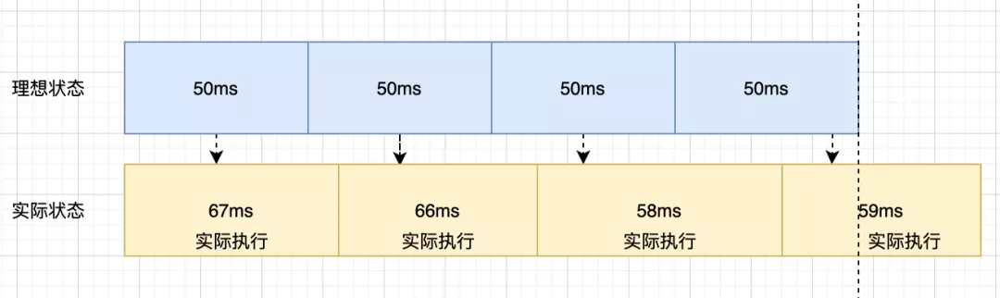

# JS原理实现

### 实现 new 操作符

 new操作符作用: 创建一个给定构造函数的实例

* 原理
  * （1）创建一个空对象；
  * （2）将空对象的[prototype]原型指向构造函数的原型对象；
  * （3）将构造函数的执行上下文this绑定到空对象；
  * （4）返回空对象


```javascript
/**

 \* @param {Function} construct 构造函数

 \* @param {any} args  其余参数

 \* @return obj 绑定了构造函数上下文的空对象

 */

function myNew(construct, ...args) {

  let obj = {} //创建空对象

  obj.__proto__ = construct.prototype //将空对象的[prototype]原型指向构造函数的原型对象

  construct.apply(obj, args) //将构造函数的执行上下文this绑定到空对象

  return obj

}

//-----------------------------------------使用-------------------------------------------------------

function Person(name, age) {

  this.name = name

  this.age = age

}

let person1 = myNew(Person, 'joker', 20)

console.log(`name is ${person1.name}, age is ${person1.age}`)
```


### 实现 instanceof 操作符

* instanceof操作符号作用:  a instanceof B 用于判断a实例是否为B对象的原型

* 原理
  * (1)获取对象的原型prototype；
  * (2)获取实例的__proto__属性；
  * (3) 判断实例__proto__是否等于对象的prototype，相等返回true，否则获取实例原型的原型属性(__proto__.__proto__)；继续判断... 如果循环，直到实例的__proto__属性返回null，则表示退出循环

**实现一**

```javascript
/**

 \* 递归实现instanceof

 \* @param {Object} inst 实例

 \* @param {obj} 对象  其余参数

 \* @return true || false

 */

function myInstanceof(inst, obj) {

  let proto = inst.__proto__ //获取实例的__proto__属性

  if (proto) { //如果实例__proto__属性存在，则沿着__proto__原型链查找

    if (proto === obj.prototype) { //在实例原型链中找到d对象的prototype对象

      return true

    } else { //沿着__proto__原型链递归查找

      return myInstanceof(proto, obj)

    }

  } else { //已经查找达到原型链顶部，不存在对象的prototype对象

    return false

  }

}


/**

 \* 非递归实现instanceof

 \* 分析：非递归版实现可以通过递归版本转换，递归转换非递归实现核心为需要寻找函数的出口条件，没有找到一直循环查找

 \* @param {Object} inst 实例

 \* @param {obj} 对象  其余参数

 \* @return true || false

 */

function myInstanceof(inst, obj) {

  let proto = inst.__proto__ //获取实例的__proto__属性

  while (proto != null) { //出口条件: 实例的__proto__为null，当实例__proto__为null时表示查找到实例原型链的最顶端

​    if (proto === obj.prototype) { //在实例的原型链中查找对象的prototype对象

​      return true

​    }

​    proto = proto.__proto__ //沿着实例的原型链查找

  }

  return false

}
```


**实现二**

```javascript
/*
 * --- 手动实现 instanceof ---
 */

function newInstanceOf (leftValue, rightValue) {
    if (typeof leftValue !== 'object' || rightValue == null) { 
        return false;
    }
    
    let rightProto = rightValue.prototype;
    leftValue = leftValue.__proto__;
    
    while (true) {
        if (leftValue === null) return false;
        if (leftValue === rightProto) return true;
        leftValue = leftValue.__proto__;
    }
}

/*
 * ------ 验证 ------
 */

const a = [];
const b = {};

function Foo () {}

var c = new Foo()
function Child () {}
function Father() {}
Child.prototype = new Father()
var d = new Child()

//------测试用例-----
console.log(newInstanceOf(a, Array)) // true
console.log(newInstanceOf(b, Object)) // true
console.log(newInstanceOf(b, Array)) // false
console.log(newInstanceOf(a, Object)) // true
console.log(newInstanceOf(c, Foo)) // true
console.log(newInstanceOf(d, Child)) // true
console.log(newInstanceOf(d, Father)) // true
console.log(newInstanceOf(123, Object)) // false 
console.log(123 instanceof Object) // false
```

> 这个问题既考察了 instanceof 的原理，又考察了原型链，还考察了代码能力。
>
> 在实现代码中，我们判断 leftValue 是否为 rightValue 的实例，思想是在 leftValue 的原型链上，即 leftValue.__proto__ 上寻找是否存在 rightValue.prototype。原理图如下:
>
> 


### 实现 Object.create()

* 原理： 将传入的对象作为原型

```javascript
function create(obj) {
  function F() {}
  F.prototype = obj
  return new F()

}
```


### 实现 [call()](https://developer.mozilla.org/zh-CN/search?q=call) 

* 作用
      在特定的作域中调用函数，实际上等于设置函数体内 this 对象的值，扩充函数的作用域

* 接收多个参数
      第一个参数:在其中运行函数的作用域，一般为this
      				其余参数:传递给函数的参数必须逐个列举出来

* 返回值
      使用调用者提供的 this 值和参数调用该函数的返回值。若该方法没有返回值，则返回 undefined

* 原理

  * 将"调用call方法的函数"的原型添加到call()方法第一个参数对象的作用域链上

    > ​	添加原型过程：
    >
    > ​	1.当函数调用call()方法时候传入第一个参数为调用者this绑定的对象，参数为空默认为全局对象，既window
    > ​	2.因为call()方法是挂在到Function.prototype指向的对象(既Funtion的原型对象)内的,所以当一个函数调用call()方法时候，call()方法内部的this是指向调用者对象的
    > ​	3.call()内部将this保存到传入的第一个参数对象中(既需要绑定this的对象)，作为参数对象的一个属性
    > ​	4.保存this后，则call()方法的this对象(既调用call方法的函数)与传入参数对象形成一条作用域链，在该作用域链中this对象(既调用call方法的函数）在作用域链的最前端
    > ​	5.然后通过传入参数对象调用“调用call方法的函数”,此时“调用call方法的函数”的this指向与参数对象形成的作用域链
    > ​	6.当查找某个属性时，如果"调用call()方法的函数"没有该属性，就会沿着这条作用域链去参数对象中查找该属性

```javascript
/**
 * 模拟实现call()方法
 * call()方法原理：通过将调用call方法的函数作用域扩展到第一个参数对象的作用域链中,因此调用call的函数通过this可以访问到参数对象的属性和方法
 * @param {Object} context, 扩展的作用域对象
 * @param {any} args  其余参数
 * return result 函数调用结果
 */
Function.prototype.myCall = function (context = window, ...args) {
  if (this === Function.prototype) { //判断当前this是否为函数,防止Function.prototype.myCall() 直接调用;直接调用this指向funcion原型对象
    console.log(this) //输出 ƒ () { [native code] }
    return undefined
  }
  context = context || window //context 为可选参数,如果不传的话默认上下文为 window
  let fn = Symbol() //为context 创建一个 Symbol（保证不会重名）属性,将当前函数赋值给这个属性
  //因为调用myCall方法的函数是调用了自己原型链对象上的myCall方法,所以当前myCall方法内的this指向调用myCall方法的函数
  context[fn] = this  //将调用myCall方法的函数挂在到传入的contex原型对象上,成为context对象的属性;调用函数作用域添加到参数对象的作用域链上
  let result = context[fn](...args) //在context对象上调用调用myCall方法的函数,此时myCall可以访问到参数对象的作用域链上的属性和方法
  delete context[fn]   //调用完成后在context对象上删除调用myCall方法的函数,既从参数对象的作用域链中删除调用myCall的函数的作用域
  return result   //返回结果
}
//myCall使用示例
let obj = { a: 1 }
var a = 2
function greet() {
  console.log('a is ' + this.a + ' greet is ' + this)
}
greet()//输出a is 2 greet is [object Window]
greet.myCall()//a is 2 greet is [object Window]
greet.myCall(obj)//输出a is 1 greet is [object Object]
```


### 实现 [apply()](https://developer.mozilla.org/zh-CN/docs/Web/JavaScript/Reference/Global_Objects/Function/apply)

* 作用
  在特定的作域中调用函数，实际上等于设置函数体内 this 对象的值，扩充函数的作用域
* 接收2个参数
  第一个参数:在其中运行函数的作用域，一般为this
  		第二个参数:参数数组，可以是 Array 的实例，也可以是arguments 对象
* 返回值
  调用有指定this值和参数的函数的结果

```javascript
/**
 * apply()方法原理和callf()方法原理一样,但是第二个参数不同:apply的第二个参数为数组
 * @param {Object} context, 扩展的作用域对象
 * @param {any} args  其余参数
 * return result 函数调用结果
 */
Function.prototype.myApply = function (context = window, args) {
  if (this === Function.prototype) {
    return undefined
  }

  context = context || window
  let result
  let fn = Symbol()
  context[fn] = this
  if (Array.isArray(args)) { //当前参数为数组
    result = context[fn](...args)
  } else { //参数为空
    result = context[fn]()
  }
  delete context[fn]
  return result
}

```

* call() 和 apply()方法比较
  * 区别： call()方法接受的是参数列表，而apply()方法接受的是一个参数数组

### 实现 [bind()](https://developer.mozilla.org/zh-CN/docs/Web/JavaScript/Reference/Global_Objects/Function/bind)

* 创建一个函数的实例，其 this 值会被绑定到传给 bind() 函数的值

```javascript
/**
 * Function.prototype.bind(thisArg[, arg1[, arg2[, ...]]])函数参数
 * 函数参数：
 *  thisArg,  调用绑定函数时作为 this 参数传递给目标函数的值
 *  arg1, arg2, ...  当目标函数被调用时,被预置入绑定函数的参数列表中的参数。
 *  返回值 function 返回一个原函数的拷贝,并拥有指定的 this 值和初始参数
 */

/**
 * 实现方式一
 * bind()最简单的实现
 * 思想：给目标函数指定作用域
 * @param {object} context 绑定的作用域对象
 */
Function.prototype.myBind = function (context) {
  let self = this //保存调用函数的作用域
  return function (context) {
    self.apply(context, arguments)
  }
}

/**
 * 实现方式二
 * 考虑bind()函数柯里化情况？？
 * 思想：获取函数参数,返回一个闭包函数,用于收集函数其余参数
 * @param {object} context 绑定的作用域对象
 */

Function.prototype.myBind = function (context) {
  let self = this //保存调用函数的作用域
  let args = Array.prototype.slice.call(arguments, 1) //获取第二个参数之后的所有参数(第一个参数为context)
  return function () { //返回闭包
    let innerArgs = Array.prototype.slice.call(arguments) //收集第二个以后参数
    self.apply(context, args.concat(innerArgs)) //合并参数并用调用bind()的函数调用apply
  }
}

/**
 * 实现方式三(推荐)
 * Javascript的函数还可以作为构造函数,那么绑定后的函数用这种方式调用时,情况有所不同
 * 思想：通过设置一个中转构造函数F,使绑定后的函数与调用bind()的函数处于同一原型链上,
 * 用new操作符调用绑定后的函数,返回的对象也能正常使用instanceof,因此这是最严谨的bind()实现
 * @param {object} context 绑定的作用域对象
 */
Function.prototype.myBind = function (context) {
  if (this === Function.prototype) { //防止直接调用
    throw TypeError('Error')
  }

  let self = this //保存调用者函数的作用域
  let args = Array.prototype.slice.call(arguments, 1) //获取第二个参数之后的所有参数(第一个参数为context)
  F = function () { } //创建一个中转构造函数
  let bound = function () { //闭包,用于收集bind()的其余参数
    let innerArgs = Array.prototype.slice.call(arguments) //获取回调函数参数
    self.apply(this instanceof F && context ? this : context || window, args.concat(innerArgs))
  }
  F.prototype = self.prototype //F继承当前函数,与调用bind的函数作用域链链接
  bound.prototype = new F() //闭包函数继承F函数,使作用域链接与调用bind()函数的作用域链链接,最总形成 bound -> F -> 调用bind的函数的作用链  
  return bound
}

/**
 * 简化价写法(推荐)
 * @param {object} context 绑定的作用域对象
 */
Function.prototype.myBind = function (context, ...args) {
  if (this === Function.prototype) {
    throw TypeError('Error')
  }
  let self = this //保存调用bind方法的函数作用域
  return function F(...args2) { //返回闭包
    //判断是否为构造函数调用,如果是则使用new调用当前构造函数？？
    if (this instanceof F) {
      return new self(...args, ...args2)
    }
    //否则使用apply，将context和处理好的参数传入
    return self.apply(context, args.concat(args2))
  }
}
```


* 注意问题
  * 显示绑定对箭头函数无效，箭头函数在定义时绑定了外层对象
  * 如果你传入了一个原始值（字符串类型、布尔类型或者数字类型）来当作 this 的绑定对象，这个原始值会被转换成它的对象形式（也就是 new String(..) 、 new Boolean(..) 或者new Number(..) ）。这通常被称为“装箱”
  * 把 null 或者 undefined 作为 this 的绑定对象传入 call 、 apply 或者 bind ，这些值在调用时会被忽略，实际应用的是默认绑定规则
  * 使用null作为绑定方法的绑定对象产生的问题
    * 如果函数并不关心 this 的话，你仍然需要传入一个占位值，这时 null 可能是一个不错的选择
    * 总是使用 null 来忽略 this 绑定可能产生一些副作用。
    * 如果某个函数确实使用了this （比如第三方库中的一个函数），
    * 那默认绑定规则会把 this 绑定到全局对象（在浏览器中这个对象是 window ）
    * 解决方法：
      * 使用空对象作为绑定方法的绑定对象，在 JavaScript 中创建一个空对象最简单的方法都是 Object.create(null)，Object.create(null) 和 {} 很像，但是并不会创建 Object.prototype 这个委托，所以它比 {} “更空”
      * 如果想“更安全”地忽略 this 绑定，你可以使用一个 Object.create(null) 对象，以保护全局对象

### 实现 sort()

>  **讲下 V8 sort 的大概思路，并手写一个 sort 的实现**

* 关于 `Array.prototype.sort()` ，ES 规范并没有指定具体的算法，在 V8 引擎中，  **7.0 版本之前** ，数组长度小于10时， `Array.prototype.sort()` 使用的是插入排序，否则用快速排序。

* 在 V8 引擎 **7.0 版本之后** 就舍弃了快速排序，因为它不是稳定的排序算法，在最坏情况下，时间复杂度会降级到 O(n2)。于是采用了一种混合排序的算法：**TimSort** 。


### 实现准时的 setTimeout

* setTimeout 存在问题：因为 setTimtout 为宏任务，在 setTimeout 任务推入任务队列时，有可能在 JS 时间循环中主线程存在其他任务，因此 setTimeout 任务存在时间误差。参考本节 [定时器](###定时器) 中解释。

* 实现准时 setTomeout 有四种方式：

|            | while | Web Worker | requestAnimationFrame | setTimeout 系统时间补偿 |
| :--------- | :---- | :--------- | :-------------------- | :---------------------- |
| 准确度     | 高    | 高         | 低                    | 高                      |
| 主线程阻塞 | 阻塞  | 一般       | 不阻塞                | 不阻塞                  |
| 评分       | ⭐️⭐️    | ⭐️⭐️⭐️        | ⭐️                     | ⭐️⭐️⭐️⭐️⭐️                   |


**while 循环实现**

```js
function timer(time) {
    const startTime = Date.now();
    while(true) {
        const now = Date.now();
        if(now - startTime >= time) {
            console.log('误差', now - startTime - time);
            return;
        }
    }
}
timer(5000);
```

> 打印：误差 0

* 优点：方式很精确
* 缺点： js 是单线程运行，使用这样的方式强行霸占线程会使得页面进入卡死状态。


**Web Worker**

* 通过 Web Worker 在另一个线程来执行定时任务.

* 一个 worker 的简单的示例

  ```js
  // main.js
  var myWorker = new Worker('worker.js');
  
  // 监听 worker
  myWorker.onmessage = function(e) {
    result.textContent = e.data;
    console.log('Message received from worker');
  }
  first.onchange = function() {
    // 向 worker 发送数据
    myWorker.postMessage([first.value,second.value]);
    console.log('Message posted to worker');
  }
  // worker.js
  onmessage = function(e) {
    // 接受主线程的数据
    console.log('Message received from main script');
    var workerResult = 'Result: ' + (e.data[0] * e.data[1]);
    console.log('Posting message back to main script');
    // 向主线程发送数据
    postMessage(workerResult);
  }
  ```

  那么接下来我们就要加 worker 和 while 相结合，以下为创建 worker 部分

  ```js
  // worker生成器
  const createWorker = (fn, options) => {
      const blob = new Blob(['(' + fn.toString() + ')()']);
      const url = URL.createObjectURL(blob);
      if (options) {
          return new Worker(url, options);
      }
      return new Worker(url);
  } 
  // worker 部分
  const worker = createWorker(function () {
      onmessage = function (e) {
          const date = Date.now();
          while (true) {
              const now = Date.now();
              if(now - date >= e.data) {
                  postMessage(1);
                  return;
              }
          }
      }
  })
  ```

  我们通过在 worker 中写入一个 while 循环，当达到我们的预取时间的时候，再向主线程发送一个完成事件，就不会因为主线程的其他代码的干扰而造成数据不准的情况。

  ```js
  let isStart = false;
  function timer() {
      worker.onmessage = function (e) {
         cb()
          if (isStart) {
              worker.postMessage(speed);
          } 
      }
      worker.postMessage(speed);
  }
  ```

**requestAnimationFrame()**

* [**`window.requestAnimationFrame()`** ](https://developer.mozilla.org/zh-CN/docs/Web/API/Window/requestAnimationFrame):告诉浏览器——你希望执行一个动画，并且要求浏览器在下次重绘之前调用指定的回调函数更新动画。该方法需要传入一个回调函数作为参数，该回调函数会在浏览器下一次重绘之前执行，回调函数执行次数通常是每秒60次，也就是每16.7ms 执行一次，但是并不一定保证为 16.7 ms。

* 实现:

  * ```js
    // 模拟代码
    function setTimeout2 (cb, delay) {
        let startTime = Date.now()
        loop()
      
        function loop () {
          const now = Date.now()
          if (now - startTime >= delay) {
            cb();
            return;
          }
          requestAnimationFrame(loop)
        }
    }
    ```

  * 缺点: 由于 16.7 ms 间隔执行，在使用间隔很小的定时器，很容易导致时间的不准确


**setTimeout 系统时间补偿**

* 原理:当每一次定时器执行时后，都去获取系统的时间来进行修正，虽然每次运行可能会有误差，但是通过系统时间对每次运行的修复，能够让后面每一次时间都得到一个补偿

  * setTimetout 时序:

    

  * setTimeout 时间补偿:

    

* 实现:

  ```js
  function timer() {
     var speed = 500,
     counter = 1, 
     start = new Date().getTime();
     
     function instance()
     {
      var ideal = (counter * speed),
      real = (new Date().getTime() - start);
      
      counter++;
  
      var diff = (real - ideal);
      form.diff.value = diff;
  
      window.setTimeout(function() { instance(); }, (speed - diff)); // 通过系统时间进行修复
  
     };
     
     window.setTimeout(function() { instance(); }, speed);
  }
  ```

  

**参考资料**

[如何实现准时的setTimeout](https://mp.weixin.qq.com/s/1ComSa7Rw-p_NIfg0dup7Q)

### 实现深拷贝

深拷贝考虑问题：

* 基础类型 
* 引用类型 
  * RegExp、Date、函数 不是 JSON 安全的 
  * 会丢失 constructor，所有的构造函数都指向 Object 
  * 破解循环引用


实现一：

```javascript
function deepCopy(obj) {
  //基本类型和null是不可变的，无需进行深拷贝
  if (typeof obj !== 'object' || obj === null) {
    return obj;
  }
  
  let copy;
  
  if (Array.isArray(obj)) {
    copy = [];
    for (let i = 0; i < obj.length; i++) {
      copy[i] = deepCopy(obj[i]);//递归调用deepCopy函数来对对象的每个属性进行深拷贝
    }
  } else {
    copy = {};
    for (let key in obj) {
      //在遍历对象属性时，通过hasOwnProperty方法来确保只复制对象自身的属性，而不包括继承的属性。
      if (obj.hasOwnProperty(key)) {
        copy[key] = deepCopy(obj[key]);//递归调用deepCopy函数来对对象的每个属性进行深拷贝
      }
    }
  }
  
  return copy;
}
```

实现二：


### 实现防抖

* 防抖作用：防止触发频率过高

* 思想：不管事件触发频率多高，事件总是在n秒后执行；如果一个事件在触发后n秒内再次触发，就清除前一次事件的计时，以后一次事件触发事件为准冲重新计时n秒，n秒后执行


* 原理：当调用debounce以后立即执行，返回闭包函数给调用者，往后执行都是执行闭包函数，闭包中可以访问debounce中定义的定时器变量

* 实现流程：

  * 1.通过计时延迟事件执行；

  * 2.当事件在计时事件内触发，则重新计时；

  * 3.通过闭包来保存计时变量；

  * 4.为了使this指向明确，返回闭包用普通函数，重新计时用箭头函数（this并非指向debounce的调用者，而是执行返回闭包的调用）

  * 5.对参数透传

    ```javascript
    /**
     * @param {Function} callback  事件回调函数
     * @param {Number} time  延迟执行时间
     * @return funcion 闭包
     */
    function debounce(callback, time) {
      let timer = null //设置定时器变量
      return function (...args) { //返回闭包来保存定时器变量(闭包中的this指向闭包的调用者)
        clearTimeout(timer) //清除定时器
        timer = setTimeout(() => { //重新定时(箭头函数的this绑定定义时外层对象的this，既闭包的this，闭包的this指向闭包的调用者)
          callback.apply(this, args) //注意通过apply绑定回调的this
        }, time);
      }
    }
    ```

* 扩展题：实现防抖中调用立即执行一次，往后触发事件等待n秒后执行

  * 思想：给debounce函数添加标记，用于标记是否为第一次执行

    ```javascript
    /** 
     * @param {Function} callback  事件回调函数
     * @param {Number} time  延迟执行时间
     * @return funcion 闭包
     */
    function debounce(callback, time, flag) {
      let timer = null
      return function (...args) {
        if (!timer && flag) {
          console.log('立即执行一次')
          callback.apply(this, args)
        }
        clearTimeout(timer)
        timer = setTimeout(() => {
          callback.apply(this, args)
        }, time)
      }
    }
    ```

* debounce的应用场景:

  ```javascript
  function print(params) {
    console.log('print param is', params)
  }
  //窗口大小变化，调整样式
  window.addEventListener('resize', debounce(print, 200, true)) //调整窗口,输出为 event事件
  //搜索框，输入后1000毫秒搜索
  debounce(fetchSelectData, 300)
  //表单验证，输入1000毫秒后验证
  debounce(validator, 1000)
  ```

  

### 实现节流

* 思想：当持续触发事件时，保证一定时间段内只调用一次事件处理函数；在一次事件触发后在触发后的指定时间内触发事件都忽略，只有在指定时间间隔后触发事件生效

* 实现方式：使用时间戳、使用定时器、结合时间戳和定时器三种实现方式

* 实现一：**使用时间戳实现节流**

  * 思想：调用函数时保存当前时间戳，立即返回闭包，闭包中计算下次调用时间戳和上次调用时间戳差值，如果差值大于节流时间，则调用回调

  * 缺点：第一次事件一定触发，最后一次事件不触发 ？？（测试现象：返回闭包时候会立即执行一次回调，原因：？？）

    ```javascript
     /**
     * @param {Function} callback  事件回调函数
     * @param {Number} time  延迟执行时间
     * @return function 闭包
     */
    function throttle(callback, time) {
      let pretime = Date.now() //记录前一次调用时时间戳
      return function (...args) { //返回闭包比较时间差
        let nexttime = Date.now() //记录当前调用时时间戳
        if (nexttime - pretime >= time) { //时间戳差值大于节流时间，执行回调
          pretime = Date.now() //重新记录执行时间戳
          callback.apply(this, args)
        }
      }
    }
    ```

* 实现二：**使用定时间实现节流**

  * 思想：调用函数时候定义定时器变量，立即返回闭包，闭包中判断定时器变量是否为空，如果为空执行回调

  * 缺点：第一次事件不触发，最后一次事件一定触发？？（测试现象：返回闭包时候不执行回调，原因：？？）

    ```javascript
    /**
    * @param {Function} callback  事件回调函数
     * @param {Number} time  延迟执行时间
     * @return function 闭包
     */
    function throttle(callback, time) {
      let timer = null //定义定时器变量
      return function (...args) { //返回闭包
        if (!timer) { //定时器变量为空，设置time时间后执行回调
          timer = setTimeout(() => {
            timer = null //清空计时变量(该操作要在调用回调之前清空)
            callback.apply(this, args)
          }, time);
        }
      }
    }
    ```

* 实现三：**结合使用时间戳和定时器**

  * 思想：时间戳方式第一次事件触发时候执行，在限流时间内再次触发用定时器延迟执行执行事件，如果在限流时间过后再次调用，清除定时时间事件

  * 优点： 第一次触发事件和最后一次触发事件都会执行

    ```javascript
    /*
     * @param {Function} callback  事件回调函数
     * @param {Number} time  延迟执行时间
     * @return function 闭包
     */
    function throttle(callback, time) {
      let pretime = Date.now()
      let timer = null
      return function (...args) {
        if (Date.now() - pretime > time) { //在限流时间后触发事件
          clearTimeout(timer) //当限流时间过后并在定时时间到达之前再次触发事件，就清除定时事件
          timer = null //清空定时器
          pretime = Date.now()
          callback.apply(this, args) //执行事件
        } else if (!timer) { //如果在限流时间内触发事件并且定时为空(既定时事件不存在)，添加定时事件
          timer = setTimeout(() => {
            callback.apply(this, args)
          }, time);
        }
      }
    }
    
    ```


### 实现函数柯里化

* 概念: 用于创建已经设置好了一个或多个参数的函数,将多参数函数转变成单参数函数

* 思想: 通过收集传入被柯里化函数fn的参数(n1,n2,n3...),返回一个函数curry，该curry函数中将传入的被柯里化函数fn的参数(n1,n2,n3...)设置为默认参数,并接收fn函数的其余参数

* 实现方式一：

  ```javascript
  /** 
   * 实现方法一
   * @param {Function} fn 被柯里化函数
   * @param  {any} args 柯里化默认参数
   */
  function currying(fn, ...args) {
    //参数个数大于需要被柯里化的函数参数个数或则参数收集完毕,直接调用被柯里化的函数fn并传入参数
    if (args.length >= fn.length) {
      return fn(...args);
    } else { //如果参数个数小于被柯里化的函数参数个数,则递归调用fn,继续收集fn的参数
      return (...args2) => currying(fn, ...args, ...args2);
    }
  }
  ```

* 实现方式二：

  ```javascript
  /**
   * 实现方法二
   * @param {Function} fn 被柯里化函数
   * @param  {any} args 柯里化默认参数
   */
  function curring(fn, ...args) {
    let _this = this //保存当前作用域
    let args = args || []
    let len = fn.length //获取函数参数长度
    //返回柯里化函数
    return function () {
      //获取柯里化函数参数
      let _args = Array.prototype.slice.call(arguments)
      //收集柯里化函数参数(将新传入的参数push进入之前传入的默认参数中)
      Array.prototype.push.apply(args, _args)
      //如果参数个数小于fn函数需要的参数个数,则柯里化函数递归继续收集参数
      if (_args.length < len) {
        return curring.call(_this, fn, _args) //注意使用call修改作用域,将新的参数传入
      } else { //否则参数收集完毕,调用函数fn
        return curring.apply(this, _args)
      }
    }
  }
  ```

* 柯里化函数使用:

  ```javascript
  //定义打印函数
  function print(param1, param2, param3) {
    console.log(`param1 is ${param1}, param2 is ${param2}, param3 is ${param3}`)
  }
  //进行打印柯里化,传入一个默认参数:1,返回curryingFun函数,该函数设置1为print函数的默认参数,并接收其余参数
  const curryingFun = currying(print)(1)
  //调用柯里化后的打印函数,传入打印函数其余参数
  curryingFun(2, 3) //输出param1 is 1, param2 is 2, param3 is 3
  //注意: 如果curryingFun函数参数个数小于print函数的参数,将返回curring函数,继续收集其余参数
  curryingFun(2) // 输出函数(...args2) => currying(fn, ...args, ...args2)
  //进行打印柯里化,传入一个默认参数:4,5
  const curryingFun2 = currying(print)(4)(5) //注意:该写法等价于curryingFun2 = currying(print)(4,5) 
  curryingFun2(6) //输出param1 is 4, param2 is 5, param3 is 6
  //传入打印函数柯里化后的函数的参数大于打印函数的函数的参数个数时,多余参数将被忽略
  curryingFun2(6)(7)//输出param1 is 4, param2 is 5, param3 is 6
  
  /**
   * currying(print)(4)(5) 与 currying(print)(4,5) 区别：
   * currying(print)(4)(5) 会递归两次,收集两次函数的默认参数
   * currying(print)(4,5)  会递归一次,收集一次函数的默认参数
   */
  ```

### 柯里化函数题目

* 题目一：

  >  实现一个add方法，使计算结果能够满足如下预期：
  >
  >  add(1)(2)(3) = 6;  
  >
  >  add(1, 2, 3)(4) = 10;
  >
  >  add(1)(2)(3)(4)(5) = 15;

  ```javascript
  function add(params) {
    //保存第一次传入的参数
    let _args = Array.prototype.slice.call(arguments)
  
    //返回闭包来收集将第二次以后执行的参数
    let _adder = function () {
      _args.push(...arguments)
      return _adder
    }
    //重写toString方法,返回参数相加结果
    _adder.toString = function () {
      return _args.reduce((a, b) => {
        return a + b
      })
    }
    return _adder
  }
  
  add(1)(2)(3)                // 6
  add(1, 2, 3)(4)             // 10
  add(1)(2)(3)(4)(5)          // 15
  add(2, 6)(1)                // 9
  ```


### 实现图片懒加载

* html: 加载loading图片是在html部分就实现的.

  

* javascript:

  ```javascript
  // onload是等所有的资源文件加载完毕以后再绑定事件
  window.onload = function(){
  	// 获取图片列表，即img标签列表
  	var imgs = document.querySelectorAll('img');
  
  	// 获取到浏览器顶部的距离
  	function getTop(e){
  		return e.offsetTop;
  	}
  
  	// 懒加载实现
  	function lazyload(imgs){
  		// 可视区域高度
  		var h = window.innerHeight;
  		//滚动区域高度
  		var s = document.documentElement.scrollTop || document.body.scrollTop;
  		for(var i=0;i<imgs.length;i++){
  			//图片距离顶部的距离大于可视区域和滚动区域之和时懒加载
  			if ((h+s)>getTop(imgs[i])) {
  				// 真实情况是页面开始有2秒空白，所以使用setTimeout定时2s
  				(function(i){
  					setTimeout(function(){
  						// 不加立即执行函数i会等于9
  						// 隐形加载图片或其他资源，
  						//创建一个临时图片，这个图片在内存中不会到页面上去。实现隐形加载
  						var temp = new Image();
  						temp.src = imgs[i].getAttribute('data-src');//只会请求一次
  						// onload判断图片加载完毕，真是图片加载完毕，再赋值给dom节点
  						temp.onload = function(){
  							// 获取自定义属性data-src，用真图片替换假图片
  							imgs[i].src = imgs[i].getAttribute('data-src')
  						}
  					},2000)
  				})(i)
  			}
  		}
  	}
  	lazyload(imgs);
  
  	// 滚屏函数
  	window.onscroll =function(){
  		lazyload(imgs);
  	}
  }
  ```


### 实现 JSONP

* 实现步骤：

  * 1.将传入的data数据转化为url字符串形式

  * 2.处理url中的回调函数

  * 3.创建一个script标签并插入到页面中

  * 4.挂载回调函数

    ```javascript
    (function (window, document) {
      "use strict"
      var jsonp = function (url, data, callback) {
        // 1.将传入的data数据转化为url字符串形式
        // {id:1,name:'jack'} => id=1&name=jack
        var dataString = url.indexof('?') == -1 ? '?' : '&'
        for (var key in data) {
          dataString += key + '=' + data[key] + '&'
        }
        // 2 处理url中的回调函数
        // cbFuncName回调函数的名字 ：my_json_cb_名字的前缀 + 随机数（把小数点去掉）
        var cbFuncName = 'my_json_cb_' + Math.random().toString().replace('.', '')
        dataString += 'callback=' + cbFuncName
        // 3.创建一个script标签并插入到页面中
        var scriptEle = document.createElement('script')
        scriptEle.src = url + dataString
        // 4.挂载回调函数
        window[cbFuncName] = function (data) {
          callback(data)
          // 处理完回调函数的数据之后，删除jsonp的script标签
          document.body.removeChild(scriptEle)
        }
        document.body.appendChild(scriptEle)
      }
      window.$jsonp = jsonp
    })(window, document)
    ```

    


### 实现单例模式

* 概念：单例模式涉及到一个单一的类，该类负责创建自己的对象，同时确保只有单个对象被创建，这个类提供了一种访问其唯一的对象的方式，可以直接访问，不需要实例化该类的对象

* 要点：

  *  1、单例类只能有一个实例；
  *  2、单例类必须自己创建自己的唯一实例；
  *  3、单例类必须给所有其他对象提供这一实例

* 实现：通过闭包保存对象实例的变量，每次新建/获取实例时候，判断该变量是否为空，为空则新建实例对象并返回，否则直接返回该实例

  ```javascript
  let Singleton = function (params) {
    this.params = params
  }
  
  Singleton.prototype.getParams = function () {
    return this.params
  }
  
  Singleton.prototype.getInstance = (function(params){
    let instance = null
    return function(){
      if(instance){
        return instance
      }else {
        instance = new Singleton(params)
      }
    }
  })()
  
  //---------------使用--------------
  var a = Singleton.getInstance('ConardLi');
  var b = Singleton.getInstance('ConardLi2');
  
  console.log(a===b);   //true
  ```


### 观察者模式

* 定义：指多个对象间存在一对多的依赖关系，当一个对象的状态发生改变时，所有依赖于它的对象都得到通知并被自动更新。

* 优点：
  * 降低了目标与观察者之间的耦合关系，两者之间是抽象耦合关系。符合依赖倒置原则。
  * 目标与观察者之间建立了一套触发机。

* 缺点：
  * 目标与观察者之间的依赖关系并没有完全解除，而且有可能出现循环引用。
  * 当观察者对象很多时，通知的发布会花费很多时间，影响程序的效率。

* 结构：

​	实现观察者模式时要注意具体目标对象和具体观察者对象之间不能直接调用，否则将使两者之间紧密耦合起来，这违反了面向对象的设计原则。

观察者模式的主要角色:

1. 抽象主题（Subject）角色：也叫抽象目标类，它提供了一个用于保存观察者对象的聚集类和增加、删除观察者对象的方法，以及通知所有观察者的抽象方法。
2. 具体主题（Concrete Subject）角色：也叫具体目标类，它实现抽象目标中的通知方法，当具体主题的内部状态发生改变时，通知所有注册过的观察者对象。
3. 抽象观察者（Observer）角色：它是一个抽象类或接口，它包含了一个更新自己的抽象方法，当接到具体主题的更改通知时被调用。
4. 具体观察者（Concrete Observer）角色：实现抽象观察者中定义的抽象方法，以便在得到目标的更改通知时更新自身的状态。

观察者模式结构图：


观察者模式：


#### 通用实现

ObserverList 实现：

```javascript
function ObserverList(){ //观察者队列，保存观察者对象
  this.observerList = [];
}
 
ObserverList.prototype.add = function( obj ){ //添加观察者
  return this.observerList.push( obj );
};
 
ObserverList.prototype.count = function(){ //观察者数量
  return this.observerList.length;
};
 
ObserverList.prototype.get = function( index ){ //获取观察者
  if( index > -1 && index < this.observerList.length ){
    return this.observerList[ index ];
  }
};
  
ObserverList.prototype.indexOf = function( obj, startIndex ){  //获取观察者位置
  let i = startIndex;
  while( i < this.observerList.length ){
    if( this.observerList[i] === obj ){
      return i;
    }
    i++;
  }
 
  return -1;
};
 
ObserverList.prototype.removeAt = function( index ){ //移除观察者
  this.observerList.splice( index, 1 );
};
```


Subject对象 实现

```javascript
function Subject(){ 
  this.observers = new ObserverList();
}
 
Subject.prototype.addObserver = function( observer ){
  this.observers.add( observer );
};
 
Subject.prototype.removeObserver = function( observer ){
  this.observers.removeAt( this.observers.indexOf( observer, 0 ) );
};
 
Subject.prototype.notify = function( context ){ //通知观察者变更
  let observerCount = this.observers.count();
  for(let i=0; i < observerCount; i++){
    this.observers.get(i).update( context );
  }
};
```

Observer对象实现

```javascript
function Observer ( data = '' ) {
    this.data = data
    Observer.prototype.update = function () {
        console.log(`更新数据: ${this.data}`)
    }
}
```

测试结果

```javascript
var subject = new Subject();
var observer1 = new Observer('im observer1');
var observer2 = new Observer('im observer2');
var observer3 = new Observer('im observer3');

subject.addObserver(observer1);
subject.addObserver(observer2);
subject.addObserver(observer3);
subject.notify();

// 输出结果：
// 更新数据: im observer1
// 更新数据: im observer2
// 更新数据: im observer3
```

#### [defineProperty](https://developer.mozilla.org/en-US/docs/Web/JavaScript/Reference/Global_Objects/Object/defineProperty) 实现

```javascript
const person = {
  name: 'Sewend',
  age: 26
};

Object.keys(person).forEach(function(key) { //循环遍历观察对象属性
  Object.defineProperty(person, key, {
    enumerable: true,
    configurable: true,
    get: function() {
      console.log('get data:', key);
    },
    set: function(newVal) {
      // 当属性值发生变化时我们可以进行额外操作
      console.log(`set new value ${newVal}`);
    },
  });
});

person.name = 'my blog';
//输出：set new value my blog
```

#### [Proxy](https://es6.ruanyifeng.com/#docs/proxy)实现

```javascript
const observerList = new Set(); //观察者队列
const subject = fn => observerList.add(fn); //订阅观察者对象
const observable = obj => new Proxy(obj, {  //可观察对象
  	set: function(target, key, value, receiver) {
      const result = Reflect.set(target, key, value, receiver);
      observerList.forEach(observer => observer()); //通知观察者队列所有观察者更新数据
      return result;
	} 
});

const person = observable({
  name: 'Sewend',
  age: 26
});

function update() {
  console.log(`update: ${person.name}, ${person.age}`)
}

subject(update);

//测试
person.age = 25
//输出 update: Sewend, 25
```

### 发布订阅者模式

* 定义:

发布订阅者模式（Publish/Subscribe），事件的发布者只发布事件，不关心这个事件被谁获取了，通常将事件发给一个中间件，由中间件再去分发事件

事件的订阅者只关心事件本身，不关心这个事件是谁发布的，通常在中间件中去注册观察某个事件。

中间件中去维护事件类别对应的订阅者列表，当收到事件后，去对应列表中通知订阅者

* 结构


* 实现

```javascript
const Observer = (function () {
    let topics = {}; // 回调函数存放的数组
    return {
        // 订阅方法,将订阅者注册的消息推入到消息队列中，因此我们需要接受两个参数：消息类型以及相应的处理动作
        subscribe: function (type, fn) {
            if (!topics[type]) { // 如果此消息不存在则创建
                topics[type] = [];
            }
            topics[type].push(fn);  // 将动作推入到该消息对应的动作执行序列中
        },
      // 发布方法,当观察者发布一个消息时将所有订阅者订阅的消息一次执行。因此应接受两个参数：消息类型以及动作执行时需要传递的参数
        publish: function (type, args) {
            if (!topics[type]) {  // 如果该消息没有被注册，则返回
                return;
            }
            let self = this;
            setTimeout(function () {
                let subscribers = topics[type], len = subscribers ? subscribers.length: 0;
                for (let i = 0; i < len; i++) {
                    subscribers[i].call(self, args); // 依次执行注册的消息对应的动作序列
                }
            }, 0);
        },
        // 取消订阅方法,将订阅者注销的消息从消息队列中清除，因此应接受两个参数：消息类型以及执行的某一动作。
        unsubscribe:function (type, fn) {
            let subscribers = topics[type];
            if (subscribers instanceof Array) { // 判断是否存在
                let i = subscribers.length - 1;
                for (;i >= 0; i-- ) {
                    // 如果存在该动作则在消息动作序列中移除响应动作
                    subscribers[i] === fn && subscribers.splice(i, 1);
                }
            }
        }
    }
})();

//-----------测试--------------------

var listener1 = function (data) {
	console.log('listener1:' + data);
}
var listener2 = function (data) {
	console.log('listener2:' + data);
}
Observer.subscribe('example1', listener1);
Observer.subscribe('example1', listener2);
 
//发布通知
Observer.publish('example1', 'hello world!');
Observer.publish('example1', ['test', 'a', 'b', 'c']);

//----结果-----
listener1:hello world!
listener2:hello world!
listener1:test,a,b,c
listener2:test,a,b,c
```


### 实现Generator

* [Generator](https://es6.ruanyifeng.com/#docs/generator)使用示例:

  ```javascript
  function* foo() {
   yield 'result1'
   yield 'result2'
   yield 'result3'
  }
  
  const gen = foo()
  console.log(gen.next().value)
  console.log(gen.next().value)
  console.log(gen.next().value)
  ```

* 根据示例模式实现:

  * 原理：Generator实现的核心在于上下文的保存，函数并没有真的被挂起，每一次yield，其实都执行了一遍传入的生成器函数，只是在这个过程中间用了一个context对象储存上下文，使得每次执行生成器函数的时候，都可以从上一个执行结果开始执行，看起来就像函数被挂起了一样

  * [源码参考](https://juejin.im/post/5bd85cfbf265da0a9e535c10)

    ```javascript
    /**
     * 生成器函数根据yield语句将代码分割为switch-case块，后续通过切换_context.prev和_context.next来分别执行各个case
     */ 
    function gen$(_context) {
      while (1) {
        switch (_context.prev = _context.next) {
          case 0:
            _context.next = 2;
            return 'result1';
    
          case 2:
            _context.next = 4;
            return 'result2';
    
          case 4:
            _context.next = 6;
            return 'result3';
    
          case 6:
          case "end":
            return _context.stop();
        }
      }
    }
    
    // context 用于储存函数执行上下文
    var context = {
      next: 0,
      prev: 0,
      done: false,
      stop: function stop() {
        this.done = true
      }
    }
    
    /**
     * invoke 定义next()，用于执行gen$(_context)来跳到下一步
     * 当我们调用g.next()，就相当于调用invoke()方法
     */
    let gen = function () {
      return {
        next: function () {
          value = context.done ? undefined : gen$(context)
          done = context.done
          return {
            value,
            done
          }
        }
      }
    }
    
    // 测试使用
    var g = gen()
    g.next()  // {value: "result1", done: false}
    g.next()  // {value: "result2", done: false}
    g.next()  // {value: "result3", done: false}
    g.next()  // {value: undefined, done: true}
    ```


### 实现 async await 

* async 函数的实现原理，就是将 Generator 函数和自动执行器，包装在一个函数里

* 实现一：[《ES6 教程》中实现](https://es6.ruanyifeng.com/#docs/async#async-%E5%87%BD%E6%95%B0%E7%9A%84%E5%AE%9E%E7%8E%B0%E5%8E%9F%E7%90%86)

  ```javascript
  async function fn(args) {
    // ...
  }
  
  // 等同于
  
  function fn(args) {
    return spawn(function* () {
      // ...
    });
  }
  
  // spawn 方法实现
  function spawn(genF) {
    return new Promise(function(resolve, reject) {
      const gen = genF();
      function step(nextF) {
        let next;
        try {
          next = nextF();
        } catch(e) {
          return reject(e);
        }
        if(next.done) {
          return resolve(next.value);
        }
        Promise.resolve(next.value).then(function(v) {
          step(function() { return gen.next(v); });
        }, function(e) {
          step(function() { return gen.throw(e); });
        });
      }
      step(function() { return gen.next(undefined); });
    });
  }
  ```

  * 所有的`async`函数都可以写成上面的第二种形式，其中的`spawn`函数就是自动执行器

  

* 实现二：

```javascript
function asyncToGenerator(generatorFunc) {
  // 返回的是一个新的函数
  return function () {

    // 先调用generator函数 生成迭代器
    // 对应 var gen = testG()
    const gen = generatorFunc.apply(this, arguments)

    // 返回一个promise 因为外部是用.then的方式 或者await的方式去使用这个函数的返回值的
    // var test = asyncToGenerator(testG)
    // test().then(res => console.log(res))
    return new Promise((resolve, reject) => {

      // 内部定义一个step函数 用来一步一步的跨过yield的阻碍
      // key有next和throw两种取值，分别对应了gen的next和throw方法
      // arg参数则是用来把promise resolve出来的值交给下一个yield
      function step(key, arg) {
        let generatorResult

        // 这个方法需要包裹在try catch中
        // 如果报错了 就把promise给reject掉 外部通过.catch可以获取到错误
        try {
          generatorResult = gen[key](arg)
        } catch (error) {
          return reject(error)
        }

        // gen.next() 得到的结果是一个 { value, done } 的结构
        const { value, done } = generatorResult

        if (done) {
          // 如果已经完成了 就直接resolve这个promise
          // 这个done是在最后一次调用next后才会为true
          // 以本文的例子来说 此时的结果是 { done: true, value: 'success' }
          // 这个value也就是generator函数最后的返回值
          return resolve(value)
        } else {
          // 除了最后结束的时候外，每次调用gen.next()
          // 其实是返回 { value: Promise, done: false } 的结构，
          // 这里要注意的是Promise.resolve可以接受一个promise为参数
          // 并且这个promise参数被resolve的时候，这个then才会被调用
          return Promise.resolve(
            // 这个value对应的是yield后面的promise
            value
          ).then(
            // value这个promise被resove的时候，就会执行next
            // 并且只要done不是true的时候 就会递归的往下解开promise
            // 对应gen.next().value.then(value => {
            //    gen.next(value).value.then(value2 => {
            //       gen.next() 
            //
            //      // 此时done为true了 整个promise被resolve了 
            //      // 最外部的test().then(res => console.log(res))的then就开始执行了
            //    })
            // })
            function onResolve(val) {
              step("next", val)
            },
            // 如果promise被reject了 就再次进入step函数
            // 不同的是，这次的try catch中调用的是gen.throw(err)
            // 那么自然就被catch到 然后把promise给reject掉啦
            function onReject(err) {
              step("throw", err)
            },
          )
        }
      }
      step("next")
    })
  }
}

```

* 参考来源：[《手写async await的最简实现（20行）》](