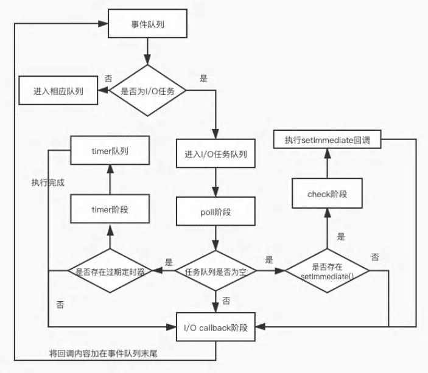
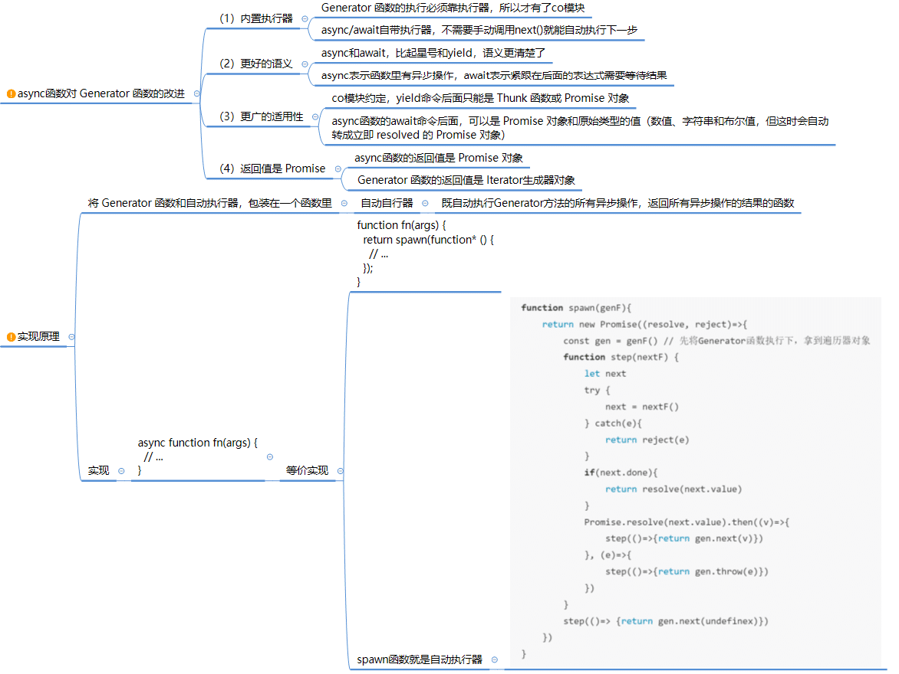
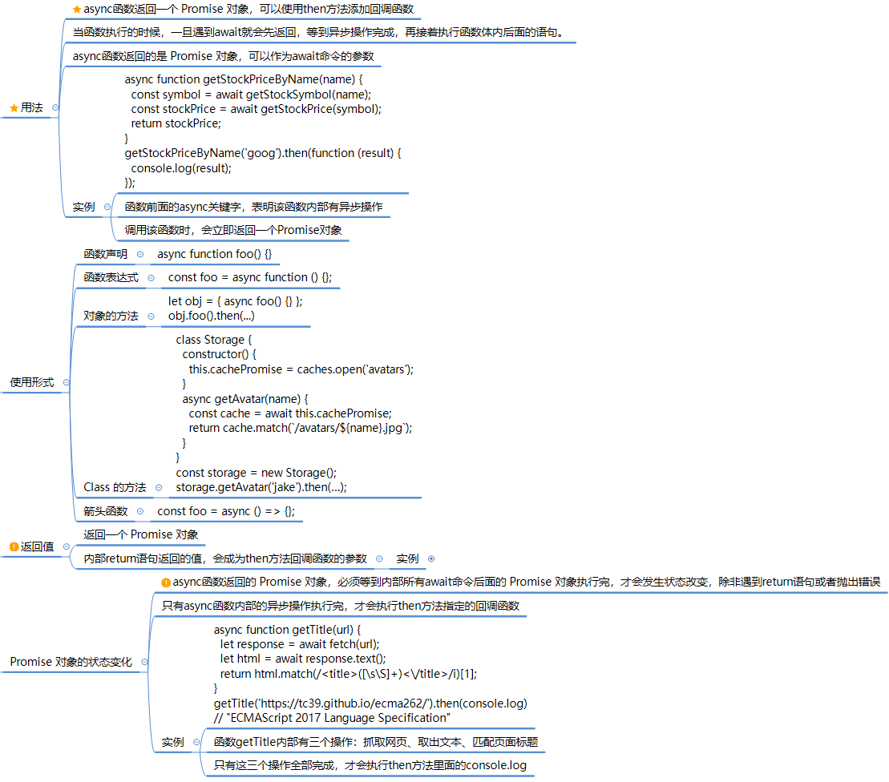
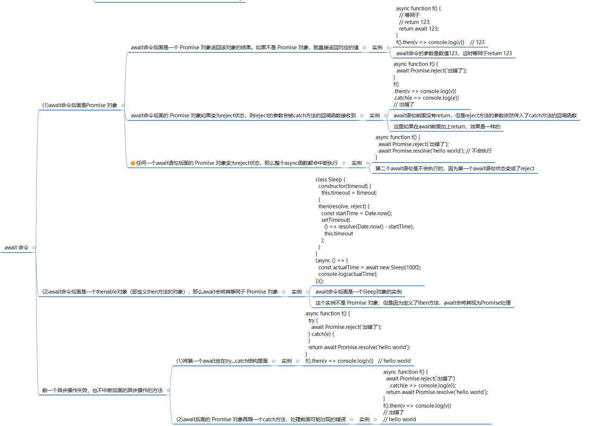

# 异步编程

## 宏任务&微任务

**事件循环**：event loop 宏任务：macrotask 也称为 task 微任务：microtask 也称为 jobs

**微任务**

- process.nextTick (Node)
- promise.then()，Promise.resolve()
- Object.observe
- MutationObserver (浏览器)

**宏任务**

- script(主程序代码)
- setTimeout, setInterval, setImmediate,
- I/O, UI rendering 
- 回调函数（事件、ajax等）

 

**过程**： 在一次事件循环中，会先执行js线程的主任务，然后会去查找是否有微任务microtask（promise），如果有那就优先执行所有微任务，如果没有，在去查找宏任务macrotask（setTimeout、setInterval）进行执行。

一个事件循环的执行步骤：

- 执行同步代码，这属于宏任务
  - 在执行宏任务时，如遇到微任务，将微任务添加到本次循环的微任务队列中；
- 执行所有微任务
- 渲染 UI
- 然后开始下一轮 Event loop，执行宏任务中的异步代码


## 浏览器事件循环 


浏览器的事件循环（Event Loop）是一种机制，用于管理 JavaScript 代码的执行顺序和处理异步事件。

它确保 JavaScript 代码能够按照正确的顺序执行，并且能够响应用户交互、网络请求、计时器等异步事件。

浏览器事件循环过程：

JS 是**单线程**（指 JS 引擎线程）运行的，在代码执行的时候，通过将不同函数的执行上下文压入执行栈中来保证代码的有序执行：

1. **执行同步代码**：
   - JavaScript 代码从上到下按顺序执行，遇到同步任务就立即执行。
   - 同步任务包括函数调用、变量赋值、计算等。
   - 在执行同步代码的时候，如果遇到了异步事件，将异步事件添加到事件队列，继续执行执行栈中的其他任务。

2. **处理微任务（Microtask）队列**：
   - 在执行完所有同步代码后，浏览器会检查是否存在微任务队列。
   - 微任务包括 Promise 的回调函数、MutationObserver 的回调函数等。
   - 如果存在微任务，会按顺序执行微任务队列中的所有任务，直到队列为空。

3. **渲染页面**：
   - 在执行完微任务后，浏览器会根据需要更新页面的显示。
   - 渲染页面通过 GUI 渲染线程渲染。
   - 这包括执行布局计算、样式计算等，以确保页面的可见部分保持最新状态。
   
4. **处理宏任务（Macrotask）队列（Web APIS）**：
   - 在执行完微任务并完成页面渲染后，浏览器会检查是否存在宏任务队列。
   - 宏任务包括DOM 操作、定时器（setTimeout、setInterval）、事件回调（如点击事件、AJAX 请求的回调）等。
   - 如果存在宏任务，会从队列中取出一个任务执行。执行完当前宏任务后，再次检查微任务队列。
   - 宏任务通过其他线程（非 JS 线程）：事件触发线程、定时触发器线程、异步 http 请求线程 执行。
   
5. 重复执行：
   - 上述步骤会不断重复，即先执行微任务，然后渲染页面，再执行宏任务，以此类推。
   - 这个过程就是事件循环的基本流程。

注意：**微任务优先级高于宏任务，即在每个宏任务执行完毕后，会先执行所有的微任务，然后再执行下一个宏任务**。这保证了微任务的优先级和响应性能。

总结：

* 浏览器的事件循环机制确保 JavaScript 代码的按序执行，并处理异步事件。

* 它包括执行同步代码、处理微任务队列、渲染页面、处理宏任务队列等步骤，不断重复以实现异步任务的执行和页面的更新。

* 微任务优先级高于宏任务，确保微任务能够及时响应和执行。

关于浏览器的线程，可以参考另一篇 [浏览器进程](https://sewar-x.github.io/browser/browser/#%E6%B5%8F%E8%A7%88%E5%99%A8%E8%BF%9B%E7%A8%8B) 文章。

**参考资料**

[一次弄懂Event Loop](https://juejin.cn/post/6844903764202094606#heading-26)

## Node 事件循环

* Node 事件循环模型：

  * Node 的 event loop 分为6个阶段，它们会按照顺序反复运行，分别如下:

    * `timers`：执行 `setTimeout()` 和 `setInterval()` 中到期的callback;
    * `I/O callbacks`：上一轮循环中有少数的 `I/O callback` 会被延迟到这一轮的这一阶段执行;
    * `idle, prepare`：队列的移动，仅内部使用;
    * `poll`：最为重要的阶段，执行 `I/O callback`，在适当的条件下会阻塞在这个阶段
    * `check`：执行 `setImmediate` 的 callback
    * `close callbacks`：执行 close 事件的 callback，例如 `socket.on("close",func)`

    

  * 不同于浏览器的是，在每个阶段完成后，而不是 macroTask 任务完成后，microTask队列就会被执行。这就导致了**同样的代码在不同的上下文环境下会出现不同的结果**.

  * 如果在 timers 阶段执行时创建了 setImmediate 则会在此轮循环的 check 阶段执行，如果在 timers 阶段创建了 setTimeout，由于 timers 已取出完毕，则会进入下轮循环，check 阶段创建 timers 任务同理。

* 流程：

  * 在Node中，同样存在宏任务和微任务，与浏览器中的事件循环相似

    * 微任务对应有：

      * **next tick queue**:process.nextTick

      * **other queue**:Promise的then回调、queueMicrotask

    * 宏任务对应有：

      * **timer queue**:setTimeout、setlnterval

      * **poll queue**:IO事件

      * **check queue**:setlmmediate
      * **close queue**:close事件

    * 其执行顺序为：next tick microtask queue

      * other microtask queue
      * timer queue
      * poll queue
      * check queue
      * close queue

* Node 事件循环底层实现：

  * `Node`中的`Event Loop`是基于`libuv`实现的，而`libuv`是 `Node` 的新跨平台抽象层，libuv使用异步，事件驱动的编程方式，核心是提供`i/o`的事件循环和异步回调。

  * libuv的`API`包含有时间，非阻塞的网络，异步文件操作，子进程等等。 `Event Loop`就是在`libuv`中实现的。

    

  

* 事件顺序的示例:

  ```js
  console.log("Hello => number 1");
  
  setImmediate(() => {
    console.log("Running before the timeout => number 3");
  });
  
  setTimeout(() => {
    console.log("The timeout running last => number 4");
  }, 0);
  
  process.nextTick(() => {
    console.log("Running at next tick => number 2");
  });
  
  //输出结果
  //Hello => number 1
  //Running at next tick => number 2
  //Running before the timeout => number 3
  //The timeout running last => number 4
  ```

  

## 浏览器&Node 事件循环区别

* 执行顺序区别：

  * 浏览器先执行所有宏任务，然后再执行所有微任务

  * Node 按 6 阶段顺序执行，先执行 timer 任务，后执行microtask队列的所有任务

  * ```js
    setTimeout(()=>{
        console.log('timer1')
    
        Promise.resolve().then(function() {
            console.log('promise1')
        })
    }, 0)
    
    setTimeout(()=>{
        console.log('timer2')
    
        Promise.resolve().then(function() {
            console.log('promise2')
        })
    }, 0)
    
    浏览器输出：
    time1
    promise1
    time2
    promise2
    
    Node输出：
    time1
    time2
    promise1
    promise2
    ```

    * 浏览器：两个setTimeout作为两个MacroTask, 所以先输出timer1, promise1，再输出timer2，promise2；
    * Node：最初timer1和timer2就在timers阶段中。开始时首先进入timers阶段，执行timer1的回调函数，打印timer1，并将promise1.then回调放入microtask队列，同样的步骤执行timer2，打印timer2；
      至此，timer阶段执行结束，event loop进入下一个阶段之前，执行microtask队列的所有任务，依次打印promise1、promise2。

## 异步编程方式

* 回调函数（Callback）：将一个函数作为参数传递给另一个函数，在异步操作完成后，通过回调函数处理结果。
  * 优点：简单、容易理解；
  * 缺点：导致回调地狱和代码可读性差的问题，不利于维护，代码耦合高

* 事件监听: 采用时间驱动模式，取决于某个事件是否发生
  * 优点：容易理解，可以绑定多个事件，每个事件可以指定多个回调函；
  * 缺点：事件驱动型，流程不够清晰

* 发布/订阅(观察者模式):  类似于事件监听，但是可以通过 消息中心，了解现在有多少发布者，多少订阅者 Promise对象 
  * 优点：可以利用 then方法，进行链式写法；可以书写错误时的回调函数；
  * 缺点：编写和理解，相对比较难
* Promise 函数：Promise对象表示一个异步操作的最终完成或失败，并可链式调用`.then()`和`.catch()`等方法处理操作结果。

* Generator 函数
  * 优点：函数体内外的数据交换、错误处理机制；
  * 缺点：流程管理不方便
* async 函数：异步函数是ES7引入的一种基于Promise的语法糖，使异步代码看起来更像同步代码。
  * 优点：内置执行器、更好的语义、更广的适用性、返回的是Promise、结构清晰；
  * 缺点：错误处理机制

异步处理方法的比较: 参考 [《ES6》](https://es6.ruanyifeng.com/#docs/async#%E4%B8%8E%E5%85%B6%E4%BB%96%E5%BC%82%E6%AD%A5%E5%A4%84%E7%90%86%E6%96%B9%E6%B3%95%E7%9A%84%E6%AF%94%E8%BE%83)


## 模拟异步操作方式


## Pomise 对象 

promise 相关知识点和题目参考: [promise 总结](https://gitee.com/jokerxw/myNotes/tree/master/javascript/%E5%8E%9F%E7%90%86%E5%AE%9E%E7%8E%B0/promise)

## async await 









 async 函数，使得异步操作变得更加方便，它就是 Generator 函数的语法糖

* 内置执行器：Generator 函数的执行必须靠执行器，`async`函数自带执行器
* 更好的语义
* 更广的适用性：`async`函数的`await`命令后面，可以是 Promise 对象和原始类型的值（数值、字符串和布尔值，但这时会自动转成立即 resolved 的 Promise 对象）
* 返回值是 Promise

**注意：**

* await 后面代码会立即执行，执行后结果和 await 下面代码会被当做回调函数内容添加到微任务队列中

  * 示例：

    ```javascript
    async function async1 () {
        console.log('async1 start');
        await async2();
        console.log('async1 end');
    }
    
    async function async2 () {
        console.log('async2');
    }
    
    console.log('script start');
    
    setTimeout(function () {
        console.log('setTimeout');
    }, 0);
    
    async1() 
    
    new Promise (function (resolve) {
        console.log('promise1');
        resolve();
    }).then (function () {
        console.log('promise2');
    })
    
    console.log('script end');
    
    //------输出--------
    script start
    async1 start
    async2
    promise1
    script end
    async1 end
    promise2
    setTimeout
    
    ```

    > 注意以下几点:
    >
    > * 定义 async1()，async2()，不会立即执行
    > * await async2(); 表示先执行 async2()，然后将 await 后面的代码当作 .then() 中的回调来处理，因此执行 async2() 以后，返回值和后面代码添加到微任务队列中
    > * 初始化 promise，promise 中的代码会立即执行

     

参考：[《ES6 教程》](https://es6.ruanyifeng.com/#docs/async)


## 异步循环

> 异步循环：在循环中包含异步操作

* 解决思路： promise + async wait: 使用promise封装异步操作，使用async await执行循环

  ```javascript
  let getSomething = function (param) {
    return new Promise((reslove, reject) => {
      setTimeout(() => {
        reslove(`get ${param}`)
      }, 1000);
    })
  }
  
  let getAll = async function () {
    for (let i = 0; i < 10; i++) {
      let result = await getSomething(i)
      console.log(result)
    }
  }
  
  getAll()
  ```


## 异步串行

> 异步方案有：
>
> * 回调
> * promise
> * async await

### 回调实现

```js
// operations defined elsewhere and ready to execute
const operations = [
  { func: function1, args: args1 },
  { func: function2, args: args2 },
  { func: function3, args: args3 },
];

function executeFunctionWithArgs(operation, callback) {
  // executes function
  const { args, func } = operation;
  func(args, callback); // 传入参数并执行函数
}

function serialProcedure(operation) {
  if (!operation) process.exit(0); // finished
  executeFunctionWithArgs(operation, function (result) {
    // continue AFTER callback
    serialProcedure(operations.shift());//回调中执行下一个异步函数
  });
}

serialProcedure(operations.shift());

```


## 异步并行

### 全并行

* 全并行：全部异步函数同时并发执行，不限制数据量
* 题目：实现通过电子邮件发送 1,000,000 个电子邮件收件人的列表。

#### 回调实现

```js
let count = 0;
let success = 0;
const failed = [];
const recipients = [
  { name: 'Bart', email: 'bart@tld' },
  { name: 'Marge', email: 'marge@tld' },
  { name: 'Homer', email: 'homer@tld' },
  { name: 'Lisa', email: 'lisa@tld' },
  { name: 'Maggie', email: 'maggie@tld' },
];

function dispatch(recipient, callback) {
  // `sendEmail` is a hypothetical SMTP client
  sendMail(
    {
      subject: 'Dinner tonight',
      message: 'We have lots of cabbage on the plate. You coming?',
      smtp: recipient.email,
    },
    callback
  );
}

function final(result) {
  console.log(`Result: ${result.count} attempts \
      & ${result.success} succeeded emails`);
  if (result.failed.length)
    console.log(`Failed to send to: \
        \n${result.failed.join('\n')}\n`);
}

recipients.forEach(function (recipient) {
  dispatch(recipient, function (err) {
    if (!err) {
      success += 1;
    } else {
      failed.push(recipient.name);
    }
    count += 1;

    if (count === recipients.length) {
      final({
        count,
        success,
        failed,
      });
    }
  });
});

```


### 有限并行

* 优先并行：通过控制限制并发数量，实现并发请求

#### 回调实现

```js
let successCount = 0; // 记录成功发送的邮件数量
let parallelCount = 100; // 并发执行数量
function final() {
  console.log(`dispatched ${successCount} emails`); // 打印成功发送的邮件数量
  console.log('finished'); // 打印任务完成的消息
}

function dispatch(recipient, callback) {
  // `sendEmail` 是一个假设的 SMTP 客户端，用于发送邮件
  sendMail(
    {
      subject: 'Dinner tonight',
      message: 'We have lots of cabbage on the plate. You coming?',
      smtp: recipient.email,
    },
    callback
  );
}

function sendOneMillionEmailsOnly() {
  getListOfTenMillionGreatEmails(function (err, bigList) {
    if (err) throw err;

    function parallel(recipients) {
      let count = 0; // 并行发送的邮件计数器
      let index = 0; // 收件人列表的索引

      function sendNext() {
        if (count >= 1000000) return final(); // 达到发送限制时调用 final 函数结束发送
        if (index >= recipients.length) return; // 所有收件人都已处理完毕时直接返回

        dispatch(recipients[index], function (_err) {
          if (!_err) {
            successCount += 1; // 更新成功发送的邮件数量
            count += 1; // 更新并行发送的邮件计数器
          }
          index += 1; // 更新收件人列表的索引
          sendNext(); // 递归调用 sendNext 处理下一个收件人
        });
      }

      for (let i = 0; i < parallelCount; i++) {
        sendNext(); // 启动并行发送任务
      }
    }

    parallel(bigList.slice(0, parallelCount)); // 将收件人列表切片为大小为 parallelCount 的子列表作为初始并行任务的输入
  });
}

sendOneMillionEmailsOnly(); // 启动发送一百万封电子邮件的过程
```


## 异步题目

### 异步API执行顺序

* 题目一：以下代码输出结果

  ```js
  async function async1() {
   console.log('async1 start')
   await async2()
   console.log('async1 end')
  }
  
  async function async2() {
   console.log('async2')
  }
  
  console.log('script start')
  
  setTimeout(function () {
   console.log('setTimeout0')
  }, 0)
  
  setTimeout(function () {
   console.log('setTimeout2')
  }, 300)
  
  setImmediate(() => console.log('setImmediate'))
  
  process.nextTick(() => console.log('nextTick1'))
  
  async1()
  
  process.nextTick(() => console.log('nextTick2'))
  
  new Promise(function (resolve) {
   console.log('promise1')
   resolve();
   console.log('promise2')
  }).then(function () {
   console.log('promise3')
  })
  
  console.log('script end')
  ```

  * 结果：

    ```js
    script start
    async1 start
    async2
    promise1
    promise2
    script end
    nextTick1
    nextTick2
    async1 end
    promise3
    setTimeout0
    setImmediate
    setTimeout2
    ```

  * 分析：

    > 1. 首先，代码从顶部开始执行，**输出`script start`。**
    >2. 接下来，`async1()`函数被调用，**输出`async1 start`。**
    > 3. 在`async1()`函数内部，遇到了`await async2()`语句。由于`async2()`函数是一个异步函数，所以它会返回一个Promise并暂停`async1()`函数的执行（async await 后面的函数被放入微任务列队）。
    >4. 此时，JavaScript引擎继续执行后面的代码。**输出`async2`**，这是由于`async2()`函数被调用。
    > 5. 紧接着，**输出`promise1`**，这是因为`new Promise`的回调函数立即执行。
    >6. 继续执行，**输出`promise2`**，然后调用`resolve()`。
    > 7. Promise的`resolve()`方法并不会立即执行`then`方法中的回调函数，而是将其放入事件队列中，等待当前执行栈为空后执行。
    >8. 继续执行主任务，**输出`script end`**。
    > 9. **输出`nextTick1`**，这是由于`process.nextTick()`方法的回调函数会在当前执行栈执行完成后立即执行。
    >10. **输出`nextTick2`**，这是因为在上一个`nextTick`回调函数之后，又调用了`process.nextTick()`方法。
    > 11. 回到`async1()`函数，**输出`async1 end`**。
    >12. 然后，`promise.then()`中的回调函数被放入事件队列中，等待当前执行栈为空后执行。
    > 13. **输出`promise3`**，这是因为`then`方法中的回调函数在上一步骤中被调用。
    >14. `setTimeout0`回调函数被放入事件队列中，等待至少达到设定的延迟时间（0ms）后执行，**输出`setTimeout0`**。
    > 15. `setImmediate`回调函数被放入事件队列中，等待当前执行栈为空后执行，**输出`setImmediate`**。
    >16. `setTimeout2`回调函数被放入事件队列中，等待至少达到设定的延迟时间（300ms）后执行，**输出`setTimeout2`**。
    > 
    >最后，根据事件循环机制和各个定时器的规则，事件循环会按照一定的顺序处理事件队列中的回调函数。因此，`setImmediate`回调函数会在`setTimeout`回调函数之前执行，而`setTimeout0`回调函数会在`setTimeout2`回调函数之前执行。

### setTimeout 与 setImmediate 输出顺序

* 以下代码输出结果为：

  ```js
  setTimeout(() => {
      console.log("setTimeout");
  }, 0);
  setImmediate(() => {
      console.log("setImmediate");
  });
  ```

  * 结果：

    ```js
    情况一：
    setTimeout
    setImmediate
    情况二：
    setImmediate
    setTimeout
    ```

  * 分析：

    > ● 外层同步代码一次性全部执行完，遇到异步API就塞到对应的阶段
    >
    > ● 遇到setTimeout,虽然设置的是0毫秒触发，但实际上会被强制改成1ms,时间到了然后塞入times阶段
    >
    > ● 遇到setImmediate塞入check 阶段
    >
    > ● 同步代码执行完毕，进入Event Loop
    >
    > ● 先进入times阶段，检查当前时间过去了1毫秒没有，如果过了1毫秒，满足setTimeout条件，执行回调，如果没过1毫秒，跳过
    >
    > ● 跳过空的阶段，进入check阶段，执行setImmediate回调
    >
    > 这里的关键在于这1ms,如果同步代码执行时间较长，进入Event Loop的时候1毫秒已经过了，setTimeout先执行，如果1毫秒还没到，就先执行了setImmediate

