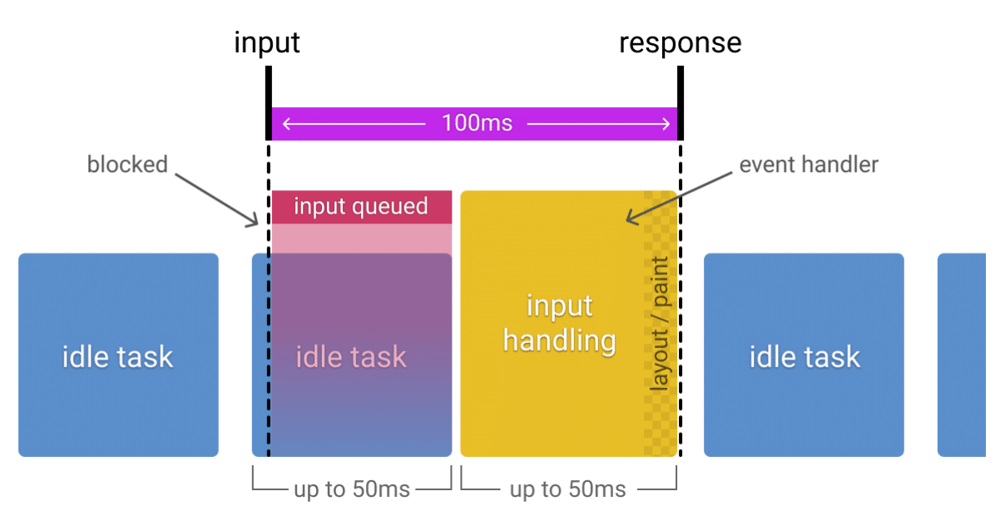
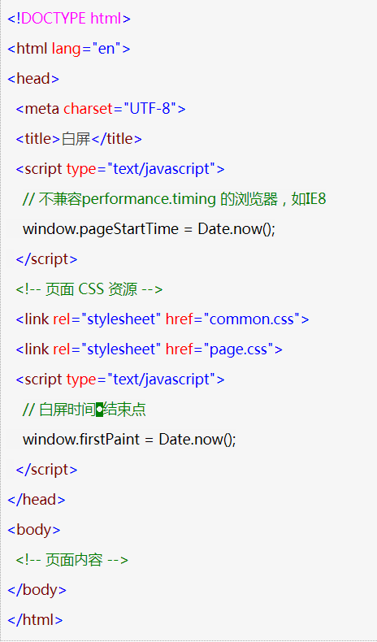
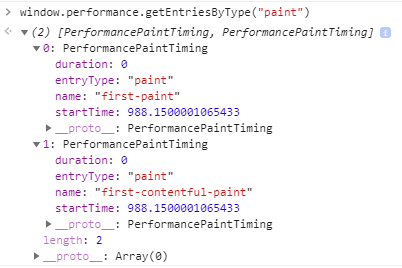
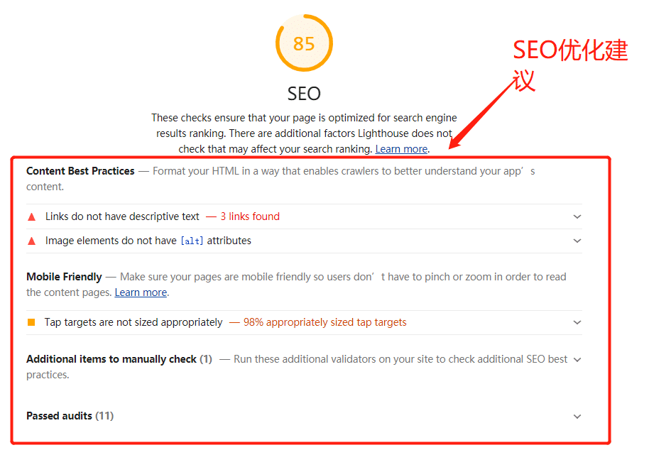

# 性能优化指标和监控

## RAIL 性能模型

* **RAIL**是一种以**用户为中心的**性能模型，它提供了一种考虑性能的结构。该模型将用户体验分解为关键操作（例如，点击、滚动、加载），并帮助您为每个操作定义性能目标。

* 关键操作：

* 聚焦用户：

  * 以下是用户对性能延迟的感知：

  | 延迟时间        | 用户感知                   |
  | --------------- | -------------------------- |
  | 0-16ms          | 很流畅                     |
  | 0-100ms         | 基本流畅                   |
  | 100-1000ms      | 感觉到网站上有一些加载任务 |
  | 1000ms or more  | 失去耐心了                 |
  | 10000ms or more | 直接离开，不会再访问了     |

* **Response：** 事件处理最好在50ms内完成。

  * 目标：用户的输入到响应的时间不超过100ms，给用户的感受是瞬间就完成了。
  * 优化方案：
    - 事件处理函数在50ms内完成，考虑到idle task的情况，事件会排队，等待时间大概在50ms。适用于click，toggle，starting animations等，不适用于drag和scroll。
    - 复杂的js计算尽可能放在后台，如web worker，避免对用户输入造成阻塞
    - 超过50ms的响应，一定要提供反馈，比如倒计时，进度百分比等。
  * idle task：除了要处理输入事件，浏览器还有其它任务要做，这些任务会占用部分时间，一般情况会花费50ms的时间，输入事件的响应则排在其后。
    * idle task 对 input response 的影响：

* **Animation：**  在10ms内产生一帧。

  * 目标：产生每一帧的时间不要超过10ms，为了保证浏览器60帧，每一帧的时间在16ms左右，但浏览器需要用6ms来渲染每一帧。旨在视觉上的平滑。用户对帧率变化感知很敏感。一般情况下，每一帧都必须完成下面的所有：

    

    * 16秒的时间中包含浏览器将新帧绘制到屏幕上的时间，所以留给上述5步的时间几乎之后10ms。

  * 优化方案：

    * 在一些高压点上，比如动画，不要使用 cpu，如：取offset，设置style等操作。尽可能地保证60帧的体验。
    * 在渲染性能上，针对不同的动画做一些特定优化

  * 动画不只是UI的视觉效果，以下行为都属于

    - 视觉动画，如渐隐渐显，tweens，loading等
    - 滚动，包含弹性滚动，松开手指后，滚动会持续一段距离
    - 拖拽，缩放，经常伴随着用户行为

* **Idle：**  最大化空闲时间

  * 目标：最大化空闲时间，以增大50ms内响应用户输入的几率

  * 优化方案：
    * 用空闲时间来完成一些延后的工作，如先加载页面可见的部分，然后利用空闲时间加载剩余部分，此处可以使用 ；[requestIdleCallback API](https://developer.mozilla.org/en-US/docs/Web/API/Window/requestIdleCallback)
    * 在空闲时间内执行的任务尽量控制在50ms以内，如果更长的话，会影响input handle的pending时间；
    * 如果用户在空闲时间任务进行时进行交互，必须以此为最高优先级，并暂停空闲时间的任务；

* **Load:**  传输内容到页面可交互的时间不超过5秒

  * 如果页面加载比较慢，用户的交点可能会离开。加载很快的页面，用户平均停留时间会变长，跳出率会更低，也就有更高的广告查看率

  * 目标:
    * 优化加载速度，可以根据设备、网络等条件。目前，比较好的一个方式是，让你的页面在一个中配的3G网络手机上打开时间不超过5秒
    * 对于第二次打开，尽量不超过2秒
  * 优化方案
    * 在手机设备上测试加载性能，选用中配的3G网络（400kb/s，400ms RTT），可以使用 [WebPageTest](https://www.webpagetest.org/easy) 来测试
    * 要注意的是，即使用户的网络是4G，但因为丢包或者网络波动，可能会比预期的更慢
    * [禁用渲染阻塞的资源，延后加载](https://web.dev/render-blocking-resources/)
    * 可以采用 [lazy load](https://web.dev/native-lazy-loading/)，[code-splitting](https://web.dev/reduce-javascript-payloads-with-code-splitting/) 等 [其他优化](https://web.dev/fast/) 手段，让第一次加载的资源更少

* 分析RAIL用的工具

  - [Chrome DevTools](https://developers.google.com/web/tools/chrome-devtools)
  - [Lighthouse](https://web.dev/measure/)
  - [WebPageTest](https://webpagetest.org/easy)

**参考资料**

[The RAIL Performance Model](https://developers.google.com/web/tools/chrome-devtools/profile/evaluate-performance/rail?hl=en)

## 优化指标


###  **LightHouse 性能指标**

Lighthouse 中指标 (Metric) 包括以下内容：

* [First Contentful Paint](https://web.dev/first-contentful-paint/)：FCP 测量在用户导航到您的页面后浏览器呈现第一段 DOM 内容所需的时间。页面上的图像、非白色`<canvas>`元素和 SVG 被视为 DOM 内容；不包括iframe 内的任何内容。

* [First Meaningful Paint](https://web.dev/first-meaningful-paint/)：(FMP)

  * 概念：FMP度量用户何时可以看到页面的主要内容。FMP的原始分数是用户初始化页面加载到页面呈现主要折叠内容之间的时间(以秒为单位)。FMP本质上显示了在最大的折叠上的布局变化发生之后的显示时间。
  * 在 Lighthouse 6.0 中已不推荐使用 FMP，建议使用 [Largest Contentful Paint](https://web.dev/largest-contentful-paint/) 代替。

* [Speed Index](https://web.dev/speed-index/)：（SI）Speed Index度量页面加载过程中内容可视化显示的速度。Lighthouse首先在浏览器中捕捉页面加载的视频，并计算帧间的视觉进程。然后Lighthouse使用Speedline Node.js模块生成速度指数分数。

* [First CPU Idle](https://web.dev/first-cpu-idle/)：页面第一次可以响应用户输入的时间。

  * 在 Lighthouse 6.0 中，已不推荐使用 FCI，原因是虽然 FCI 提供了比 TTI 更有意义的度量，但这种差异还不足以证明维护两个类似度量的合理性。建议考虑使用 [Total Blocking Time](https://web.dev/lighthouse-total-blocking-time/) 和 TTI。

* [Time to Interactive](https://web.dev/interactive/)：（TTI）表示网页第一次 **完全达到可交互状态** 的时间点，浏览器已经可以持续性的响应用户的输入。完全达到可交互状态的时间点是在最后一个长任务（Long Task）完成的时间, 并且在随后的 5 秒内网络和主线程是空闲的。

  * 

  * 长任务是需要 50 毫秒以上才能完成的任务

  * 测量方式：TTI 的计算依赖于对 Long Task 和主线程是否空闲的观察，目前并不在 Web 性能标准规范中，但在一些性能监视工具中实现了。Google 提供了采集 TTI 的 API：[tti-polyfill](https://github.com/GoogleChromeLabs/tti-polyfill)

    ```javascript
    const ttiPolyfill = require('tti-polyfill');
    ttiPolyfill.getFirstConsistentlyInteractive().then((tti) => {
      window.perfData.push({
        'tti': tti
      });
    });
    ```

* [Max Potential First Input Delay](https://web.dev/lighthouse-max-potential-fid/)：（FID）

  * 从用户第一次与页面交互（例如单击链接、点击按钮等）到浏览器实际能够响应该交互的时间。
  * 输入延迟是因为浏览器的主线程正忙于做其他事情，所以不能响应用户。发生这种情况的一个常见原因是浏览器正忙于解析和执行应用程序加载的大型 JavaScript 文件。
  * 第一次输入延迟通常发生在第一次内容绘制（FCP）和可持续交互时间（TTI）之间，因为页面已经呈现了一些内容，但还不能可靠地交互。
  * 如果用户刚好在主线程最忙时与页面交互，延迟响应的时间就会较长，如果与页面交互是在主线程空闲期间，浏览器可能会立即响应。所以对于 FID 这个指标，我们需要关注的是整体的 FID 值分布，而不是单一值。
  * 
  * 测量方式：Google 提供了一个 JS 库 [github.com/GoogleChrom…](https://github.com/GoogleChromeLabs/first-input-delay) 用于测量 FID

  

* [Total Blocking Time](https://web.dev/lighthouse-total-blocking-time/)：TBT测量页面被阻止响应用户输入(如鼠标点击、屏幕点击或键盘按下)的总时间。该总和是通过添加所有长任务的阻塞部分之间的第一次有内容的绘制和时间到交互式。任何执行时间超过50毫秒的任务都是长任务。50ms后的时间量为阻塞部分。例如，如果Lighthouse检测到一个70毫秒长的任务，那么阻塞部分将是20毫秒

* [Largest Contentful Paint](https://web.dev/lighthouse-largest-contentful-paint/)：（LCP）

  * 可视区域中最大的内容元素呈现到屏幕上的时间，用以估算页面的主要内容对用户可见时间。

  * 测量方法：

    ```js
    try {
      const po = new PerformanceObserver((entryList) => {
        const entries = entryList.getEntries();
        const lastEntry = entries[entries.length - 1];
    
        // 优先取 renderTime，如果没有则取 loadTime
        let lcp = lastEntry.renderTime || lastEntry.loadTime;
        window.perfData.push({
          'LCP', lcp
        });
      });
      po.observe({type: 'largest-contentful-paint'});
    } catch (e) {
      // Do nothing 
    }
    ```

    

### **关键指标**

* 当从浏览器打开一个页面，经历：白屏 → 背景图 → 出现部分内容 → 首屏内容全部出现，但图片还在加载中 → 首屏内容全部出现，图片也已经加载完成。

  

* 在此过程中的关键指标：

  | 用户体验核心指标     | 定义                                       | 衡量指标 |
  | -------------------- | ------------------------------------------ | -------- |
  | **白屏时间**         | 页面开始有内容的时间，在没有内容之前是白屏 | FP       |
  | **首次渲染内容**     | 浏览器首次绘制来自 DOM 的内容的时间        | FCP      |
  | **重要内容渲染时间** | 主要内容绘制到屏幕上的时间                 | FMP      |
  | **首屏时间**         | 可视区域内容已完全呈现的时间               | FSP      |
  | **可交互时间**       | 用户第一次可以与页面交互的时间             | FCI      |
  | **可流畅交互时间**   | 用户第一次可以持续与页面交互的时间         | TTI      |


**白屏时间（FP或FCP）：**

* 概念：

  * 从开始加载到浏览器**首次绘制像素**到屏幕上的时间，也就是页面在屏幕上首次发生视觉变化的时间。
  * 变化可能是简单的背景色更新或不引人注意的内容
  * First Paint 不包括默认的背景绘制，但包括非默认的背景绘制。
  * 通常认为浏览器开始渲染 `<body>` 标签或者解析完 `<head> `标签的时刻就是页面白屏结束的时间点

* 

* 计算白屏时间:

  * 可使用 Performance API 时：白屏时间 = firstPaint - performance.timing.navigationStart

  * 不可使用 Performance API 时：白屏时间 = firstPaint - performance.timing.navigationStart

    

  

**首屏时间（FSP）：**

* 概念：页面从开始加载到首屏内容全部绘制完成的时间，用户可以看到首屏的全部内容。

  

* 计算首屏时间方法：

  * 首屏模块标签标记法：	一种传统的采集方式，通常适用于首屏内容不需要通过拉取数据才能生存以及页面不考虑图片等资源加载的情况。
    * 首屏时间= firstScreen - performance.timing.navigationStart;
    * 
  * 统计首屏内加载最慢的图片的时间：通常首屏内容加载最慢的就是图片资源,因此会把首屏内加载最慢的图片的时间当做首屏的时间。
    * 方法：首屏时间=加载最慢的图片的时间点 - performance.timing.navigationStart
    * 由于浏览器对每个页面的 TCP 连接数有限制，使得并不是所有图片都能立刻开始下载和显示，因此在 DOM树 构建完成后将会去遍历首屏内的所有图片标签，并且监听所有图片标签 onload 事件，最终遍历图片标签的加载时间的最大值，并用这个最大值减去 navigationStart 即可获得近似的首屏时间
  * 自定义首屏内容计算法：由于统计首屏内图片完成加载的时间比较复杂。因此我们在业务中通常会通过自定义模块内容，来简化计算首屏时间。
    * 方法：忽略图片等资源加载情况，只考虑页面主要 DOM，只考虑首屏的主要模块，而不是严格意义首屏线以上的所有内容。

* 现代浏览器问题：不会等待CSS树（所有CSS文件下载和解析完成）和DOM树（整个body标签解析完成）构建完成而是马上开始显示中间结果，所以经常在低网速的环境中，观察到页面由上至下缓慢显示完，或者先显示文本内容后再重绘成带有格式的页面内容		

* 影响首屏内容完整绘制：避免横向屏幕外和纵向屏幕外元素的绘制阻塞首屏内容的渲染。

  * 如在开发过程中，把内容列表代码放在导航代码前面，浏览器会先渲染完列表内容再渲染导航，如果超过屏幕外的列表内容很长，会严重影响首屏内导航显示到屏幕的时间。


# 性能监控


* 前端性能监控：代码监控、工具监控、插件分析工具。
  * **代码监控：**依托于js代码并部署到需监控的页面，手动计算时间差或者使用浏览器的的API进行数据统计。
    * 影响代码监控数据的因素：
      * 浏览器渲染机制；
      * 浏览器对API的实现程度，如：`performance API`；
  * **工具监控：**不用将统计代码部署到页面中，输入需统计的url并且选择运行次url的浏览器版本，通过工具对 url 进行请求分析后便可以给出各种性能指标，比如瀑布流、静态文件数量、首屏渲染时间等。
  * **插件分析工具：** 通过插件分析开发时各依赖包的大小，通过减少主要包体积优化。


## 代码监控

* 代码监控主要使用[**Navigation Timing API**](https://developer.mozilla.org/zh-CN/docs/Web/API/Navigation_timing_API) 提供的可用于衡量一个网站性能的数据。主要提供以下两个接口：
  * [`Performance`](https://developer.mozilla.org/zh-CN/docs/Web/API/Performance)：获取到当前页面中与性能相关的信息。它是 High Resolution Time API 的一部分，同时也融合了 Performance Timeline API、[Navigation Timing API](https://developer.mozilla.org/en-US/docs/Web/API/Navigation_timing_API)、 [User Timing API](https://developer.mozilla.org/en-US/docs/Web/API/User_Timing_API) 和 [Resource Timing API](https://developer.mozilla.org/en-US/docs/Web/API/Resource_Timing_API)。
  * [`PerformanceNavigationTiming`](https://developer.mozilla.org/zh-CN/docs/Web/API/PerformanceNavigationTiming)：提供了方法和属性来存取关于游览器文档navigation事件的相关数据。如文档实际加载/卸载的时间。

### Performance API

* [`window.performance`](https://www.w3.org/TR/2014/WD-navigation-timing-2-20140325/) 是W3C性能小组引入的新的API，目前IE9以上的浏览器都支持。

* Performance API 用于精确度量、控制、增强浏览器的性能表现。这个 API 为测量网站性能， 提供以前没有办法做到的精度。

* 结构：

  * ​	`memory`：JavaScript 占用的内存。

  * `navigation`：统计网页导航相关的数据：

    1. `redirectCount`:重定向的数量（只读），但是这个接口有同源策略限制，即仅能检测同源的重定向；
    2. type 返回值：
       - 0 : TYPE_NAVIGATE (用户通过常规导航方式访问页面，比如点一个链接，或者一般的get方式)
       - 1 : TYPE_RELOAD (用户通过刷新，包括JS调用刷新接口等方式访问页面)
       - 2 : TYPE_BACK_FORWARD (用户通过后退按钮访问本页面)

  * `timing`：统计数据 网络、解析等时间数据。

    

    * > - `startTime`：有些浏览器实现为[`navigationStart`](https://msdn.microsoft.com/en-us/library/ff974724(v=vs.85).aspx)，代表浏览器开始unload前一个页面文档的开始时间节点。比如我们当前正在浏览 baidu.com，在地址栏输入google.com并回车，浏览器的执行动作依次为：**unload当前文档（即baidu.com）->请求下一文档（即google.com）**。navigationStart的值便是触发unload当前文档的时间节点。
      >
      >   > 如果当前文档为空，则navigationStart的值等于fetchStart。
      >
      > - `redirectStart`和`redirectEnd`：如果页面是由redirect而来，则redirectStart和redirectEnd分别代表redirect开始和结束的时间节点；
      >
      > - `unloadEventStart`和`unloadEventEnd`：如果前一个文档和请求的文档是同一个域的，则`unloadEventStart`和`unloadEventEnd`分别代表浏览器unload前一个文档的开始和结束时间节点。否则两者都等于0；
      >
      > - `fetchStart`是指在浏览器发起任何请求之前的时间值。在fetchStart和`domainLookupStart`之间，浏览器会检查当前文档的缓存；
      >
      > - `domainLookupStart`和`domainLookupEnd`分别代表DNS查询的开始和结束时间节点。如果浏览器没有进行DNS查询（比如使用了cache），则两者的值都等于`fetchStart`；
      >
      > - `connectStart`和`connectEnd`分别代表TCP建立连接和连接成功的时间节点。如果浏览器没有进行TCP连接（比如使用持久化连接webscoket），则两者都等于`domainLookupEnd`；
      >
      > - `secureConnectionStart`：可选。如果页面使用HTTPS，它的值是安全连接握手之前的时刻。如果该属性不可用，则返回undefined。如果该属性可用，但没有使用HTTPS，则返回0；
      >
      > - `requestStart`代表浏览器发起请求的时间节点，请求的方式可以是请求服务器、缓存、本地资源等；
      >
      > - `responseStart`和`responseEnd`分别代表浏览器收到从服务器端（或缓存、本地资源）响应回的第一个字节和最后一个字节数据的时刻；
      >
      > - `domLoading`代表浏览器开始解析html文档的时间节点。我们知道IE浏览器下的document有`readyState`属性，`domLoading`的值就等于`readyState`改变为`loading`的时间节点；
      >
      > - `domInteractive`代表浏览器解析html文档的状态为`interactive`时的时间节点。`domInteractive`并非DOMReady，它早于DOMReady触发，代表html文档解析完毕（即dom tree创建完成）但是内嵌资源（比如外链css、js等）还未加载的时间点；
      >
      > - `domContentLoadedEventStart`：代表`DOMContentLoaded`事件触发的时间节点：
      >
      >   > 页面文档完全加载并解析完毕之后,会触发DOMContentLoaded事件，HTML文档不会等待样式文件,图片文件,子框架页面的加载(load事件可以用来检测HTML页面是否完全加载完毕(fully-loaded))。
      >
      > - `domContentLoadedEventEnd`：代表`DOMContentLoaded`事件完成的时间节点，此刻用户可以对页面进行操作，也就是jQuery中的domready时间；
      >
      > - `domComplete`：html文档完全解析完毕的时间节点；
      >
      > - `loadEventStart`和`loadEventEnd`分别代表onload事件触发和结束的时间节点

  * **计算性能指标：**

    * DNS查询耗时 = domainLookupEnd - domainLookupStart
    * TCP链接耗时 = connectEnd - connectStart
    * request 请求耗时 = responseEnd - responseStart
    * 解析 dom 树耗时 = domComplete - domInteractive
    * 白屏时间 = domloadng - fetchStart
    * domready 时间 = domContentLoadedEventEnd - fetchStart
    * onload 时间 = loadEventEnd - fetchStart

* 使用 getTime 来计算脚本耗时:

  * 缺点: 
  * getTime 方法（以及 Date 对象的其他方法） 都只能精确到毫秒级别（一秒的千分之一），无法计算更小的时间差。
    * 这种写法只能获取代码运行过程中的时间进度，无法知道一些后台事件的时间进度，比如浏览器用 了多少时间从服务器加载网页。
  * 实现:

  ```javascript
  // 计算加载时间
  function getPerformanceTiming () { 
      var performance = window.performance;
    
      if (!performance) {
          // 当前浏览器不支持
          console.log('你的浏览器不支持 performance 接口');
          return;
      }
    
      var t = performance.timing;
      var times = {};
    
      //【重要】页面加载完成的时间
      //【原因】这几乎代表了用户等待页面可用的时间
      times.loadPage = t.loadEventEnd - t.navigationStart;
    
      //【重要】解析 DOM 树结构的时间
      //【原因】反省下你的 DOM 树嵌套是不是太多了！
      times.domReady = t.domComplete - t.responseEnd;
    
      //【重要】重定向的时间
      //【原因】拒绝重定向！比如，http://example.com/ 就不该写成 http://example.com
      times.redirect = t.redirectEnd - t.redirectStart;
    
      //【重要】DNS 查询时间
      //【原因】DNS 预加载做了么？页面内是不是使用了太多不同的域名导致域名查询的时间太长？
      // 可使用 HTML5 Prefetch 预查询 DNS ，见：[HTML5 prefetch](http://segmentfault.com/a/1190000000633364)           
      times.lookupDomain = t.domainLookupEnd - t.domainLookupStart;
    
      //【重要】读取页面第一个字节的时间
      //【原因】这可以理解为用户拿到你的资源占用的时间，加异地机房了么，加CDN 处理了么？加带宽了么？加 CPU 运算速度了么？
      // TTFB 即 Time To First Byte 的意思
      // 维基百科：https://en.wikipedia.org/wiki/Time_To_First_Byte
      times.ttfb = t.responseStart - t.navigationStart;
    
      //【重要】内容加载完成的时间
      //【原因】页面内容经过 gzip 压缩了么，静态资源 css/js 等压缩了么？
      times.request = t.responseEnd - t.requestStart;
    
      //【重要】执行 onload 回调函数的时间
      //【原因】是否太多不必要的操作都放到 onload 回调函数里执行了，考虑过延迟加载、按需加载的策略么？
      times.loadEvent = t.loadEventEnd - t.loadEventStart;
    
      // DNS 缓存时间
      times.appcache = t.domainLookupStart - t.fetchStart;
    
      // 卸载页面的时间
      times.unloadEvent = t.unloadEventEnd - t.unloadEventStart;
    
      // TCP 建立连接完成握手的时间
      times.connect = t.connectEnd - t.connectStart;
    
      return times;
  }
  ```

* 获取首次渲染、首次有内容的渲染
  

### Resource Timing API

* [`Resource Timing API `](https://developer.mozilla.org/zh-CN/docs/Web/API/Resource_Timing_API) 为网络事件(如重定向的开始和结束事件, DNS查找的开始和结束事件, 请求开始, 响应开始和结束时间等)生成有高分辨率时间戳( [high-resolution timestamps](https://developer.mozilla.org/zh-CN/docs/Web/API/DOMHighResTimeStamp) )的资源加载时间线, 并提供了资源大小和资源类型.

* PerformanceResourceTiming 接口在 Performance Timeline 面板上有展现，并且其扩展 PerformanceEntry 接口。

* 使用 **performance.getEntries()方法**  数组形式，返回一个 PerformanceEntry 列表，这些请求的时间统计信息，有多少个请求，返回数组就会有多少个成员。有以下属性：

  * name：这个属性必须返回请求资源的解析URL。如果重定向到其他URL，此属性也不更改。

  * entryType：entryType属性返回 DOMString “resource”。entryType 类型不同数组中的对象结构也不同。initiatorType 表：

  * | **值 **  | **描述 **                             |
    | -------- | ------------------------------------- |
    | mark     | 通过 mark() 方法添加到数组中的对象    |
    | paint    | 通过 measure() 方法添加到数组中的对象 |
    | measure  | first-contentful-paint 首次内容绘制   |
    | resource | 所有资源加载时间，用处最多            |

  * startTime：startTime属性返回一个 DOMHighResTimeStamp [ HR-TIME-2 ]，表示用户代理获取资源开始排队等待之前的时间。如果在获取资源时存在 HTTP 重定向或类同情况，并且所有重定向或类同情况都来自与当前文档同源，或者通过了timing  allow check 算法，则此属性返回 redirectStart 的值。否则，此属性返回 fetchStart 的值。

  * duration：该duration属性返回一个 DOMHighResTimeStamp，等于 responseEnd 和 startTime 之间的差。

  

## 工具监控

### LightHouse

#### 安装/使用

针对不同的适用场景，我们可以通过多种方式来安装并使用 Lighthouse：

- 浏览器插件。Chrome 插件的形式提供了更加友好的用户界面，方便读取报告。
- Chrome DevTools。该工具集成在最新版本的 Chrome 浏览器中，无需安装即可使用。
- Lighthouse CLI 命令行工具。方便将 Lighthouse 集成到持续集成系统中。
- 编程的方式。我们也能通过 Node.js 模块引入 Lighthouse 工具包，以编程的形式来使用它。

具体安装方式查看 [使用 Lighthouse](https://lavas-project.github.io/pwa-book/appendix01/1-lighthouse.html#%E4%BD%BF%E7%94%A8-lighthouse-%E6%B5%8B%E8%AF%84-pwa)

#### 测评报告

* 使用 Lighthouse 对网站进行测评后，我们会得到一份评分报告，它包含了：

  * 性能（Performance）
  * 访问无障碍（Accessibility）
  * 最佳实践（Best Practice）
  * 搜索引擎优化（SEO）
  * PWA（Progressive Web App）

  

* 报告中带有相关优化建议：

  * 性能（Performance）结果:
    * 性能评分分为了三部分：
      * [Metrics](https://web.dev/lighthouse-performance/#metrics) 部分的指标项会直接影响分数，可以作为我们的主要参考点。
      * [Opportunities](https://web.dev/lighthouse-performance/#opportunities) 提供了详细的建议和文档，来解释低分的原因，帮助我们具体进行实现和改进。
      * [Diagnostics](https://web.dev/lighthouse-performance/#diagnostics) 部分的列表项则为进一步改善性能的实验和调整，给出了指导。
  * 访问无障碍（Accessibility）测试结果：
  * 最佳实践（Best Practice）测试结果：
  * SEO 测试结果：
  * PWA 测试结果：

#### Performance 评分

* 性能评分的分值区间是：0到100。

  * 如果出现0分，通常是在运行 Lighthouse 时发生了错误，满分100分代表了站点已经达到了98分位值的数据，而50分则是75分位值的数据。
  * 分值区间和颜色的对应关系如下：
    - 0 - 49（慢）：红色
    - 50 - 89（平均值）： 橙色
    - 90 - 100（快）： 绿色

* 性能指标评分的计算方式：每一项性能指标对评分的贡献都有其计算逻辑，Lighthouse 会将原始的性能值映射成为 0-100 之间的数字。评分使用 HTTPArchive 上的真实站点性能数据作为样本，统计出对数正态分布。

  * 例如，您的 FCP 分数是基于[HTTP 存档中的数据](https://httparchive.org/reports/loading-speed#fcp)，您的页面的 FCP 时间与真实网站的 FCP 时间的比较。例如，在 99% 中执行的站点在大约 1.2 秒内呈现 FCP。如果您网站的 FCP 为 1.2 秒，则您的 FCP 分数为 99。请参阅[如何确定指标分数](https://web.dev/performance-scoring/#metric-scores)以了解如何设置 Lighthouse 分数阈值。参考[Lighthouse 如何确定分数](https://web.dev/first-contentful-paint/#how-lighthouse-determines-your-fcp-score)

* 性能评分的分配权重：各个指标对性能评分的贡献并不相同，Lighthouse 提供了[评分详情表](https://docs.google.com/spreadsheets/d/1Cxzhy5ecqJCucdf1M0iOzM8mIxNc7mmx107o5nj38Eo/edit#gid=0)，形式如下图，来查阅具体权重分配情况。权重较大的指标，对性能评分的影响更大一些，最终的总体性能评分是这些性能指标分数的加权平均值。我们可以用这个分数计算的[表格](https://docs.google.com/spreadsheets/d/1dXH-bXX3gxqqpD1f7rp6ImSOhobsT1gn_GQ2fGZp8UU/edit?ts=59fb61d2#gid=283330180)作为参考，以了解不同的指标是如何影响最终评分的。

  从表中可以看出，性能的指标项权重分配如下：

  * 3X - 首次内容绘制
  * 1X - 首次有效绘制
  * 2X - 首次 CPU 空闲
  * 5X - 可交互时间
  * 4X - 速度指标
  * 0X - 输入延迟估值

* 不同 Lighthouse 版本对权重不同：

  * [Lighthouse 8 ](https://web.dev/performance-scoring/#lighthouse-8)

  | Audit                                                        | Weight |
  | :----------------------------------------------------------- | :----- |
  | [First Contentful Paint](https://web.dev/first-contentful-paint/) | 10%    |
  | [Speed Index](https://web.dev/speed-index/)                  | 10%    |
  | [Largest Contentful Paint](https://web.dev/lcp/)             | 25%    |
  | [Time to Interactive](https://web.dev/interactive/)          | 10%    |
  | [Total Blocking Time](https://web.dev/lighthouse-total-blocking-time/) | 30%    |
  | [Cumulative Layout Shift](https://web.dev/cls/)              | 15%    |

  * [Lighthouse 6 ](https://web.dev/performance-scoring/#lighthouse-6)

  | Audit                                                        | Weight |
  | :----------------------------------------------------------- | :----- |
  | [First Contentful Paint](https://web.dev/first-contentful-paint/) | 15%    |
  | [Speed Index](https://web.dev/speed-index/)                  | 15%    |
  | [Largest Contentful Paint](https://web.dev/lcp/)             | 25%    |
  | [Time to Interactive](https://web.dev/interactive/)          | 15%    |
  | [Total Blocking Time](https://web.dev/lighthouse-total-blocking-time/) | 25%    |
  | [Cumulative Layout Shift](https://web.dev/cls/)              | 5%     |

  * Lighthouse 5

  | Audit                                                        | Weight |
  | :----------------------------------------------------------- | :----- |
  | [First Contentful Paint](https://web.dev/first-contentful-paint/) | 20%    |
  | [Speed Index](https://web.dev/speed-index/)                  | 27%    |
  | [First Meaningful Paint](https://web.dev/first-meaningful-paint/) | 7%     |
  | [Time to Interactive](https://web.dev/interactive/)          | 33%    |
  | [First CPU Idle](https://web.dev/first-cpu-idle/)            | 13%    |


* 使用[Lighthouse 评分计算器](https://googlechrome.github.io/lighthouse/scorecalc/)来帮助了解您应该为达到某个 Lighthouse 性能分数而设定的阈值。

**参考资料**

[Lighthoust Performance audits](https://web.dev/lighthouse-performance/)