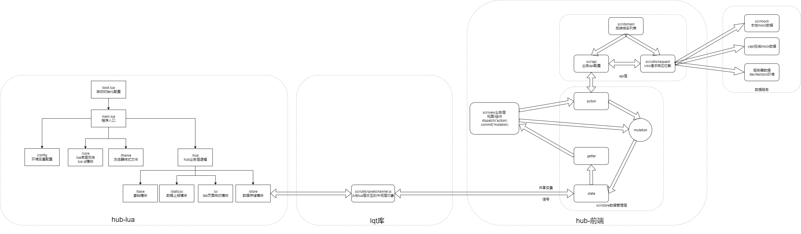
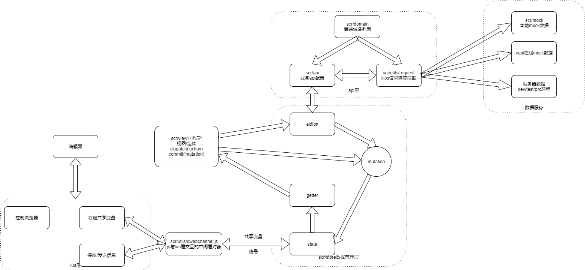

# 混合桌面应用开发

## 技术选型

> 背景： 某个游戏引擎中用户模块当前是做在游戏引擎中，用户必须先打开游戏引擎，等待游戏引擎初始化完成后，才能打开用户模块，导致游戏引擎底层架构庞大，打开游戏引擎速度变慢；
>
> 为了加快引擎初始化加载速度，并且将用户模块与游戏引擎独立出来，使不需要加载完游戏引擎可以直接加载用户模块，将用户模块与游戏引擎解耦。
>
> 设计方案：将用户模块独立，打开游戏引擎后，优先加载登录页面，登陆后进入用户模块，用户模块展示用户的创作作品等。

现状分析：

当前引擎为桌面客户端模式，游戏引擎使用当前技术栈为：

| 技术栈 | 作用                                        |
| ------ | ------------------------------------------- |
| C++    | 引擎核心编程语言                            |
| Lua    |                                             |
| imgui  | 编辑器ui                                    |
| love2d | 基于Lua编写的轻量级游戏框架，用于图形渲染层 |

为了将用户模块与游戏引擎独立，需要将用户模块单独出来，当启动游戏引擎时，优先加载用户模块，并且初始化游戏引擎；

将用户模块作为单独的游戏引擎启动器；

用户模块展示用户创作作品和商城公开demo作品，用户打开demo作品时，可以唤起游戏引擎，加载对应游戏。

因此，为了适配现有游戏引擎，用户模块需要使用桌面应用技术。

**桌面应用技术选型**

1. **Qt**：[Qt](https://www.qt.io/zh-cn/) 是一个用于开发GUI应用程序的跨平台框架。它允许使用C++或Python等语言编写代码，并提供了丰富的库和工具来创建具有高度自定义界面的应用程序。
2. **Electron**：对于需要构建跨平台桌面应用程序的开发人员来说，Electron是一个很好的选择。它使用Web技术（HTML, CSS, JavaScript）来构建桌面应用程序，并提供了一个框架来访问本地系统功能。这意味着你可以使用熟悉的Web技术来构建桌面应用程序。
3. **Flutter**：Flutter是Google开发的跨平台开发框架，用于构建高性能的桌面应用程序。它使用Dart语言，并允许开发人员使用单一代码库构建多个平台的桌面应用程序。

由于游戏引擎底层使用 C++ 开发，使用 QT 能更容易适配引擎的技术栈。


## QT5 +  QtWebEngine + Vue

### Qt 嵌入网页技术介绍

在当前QT [v5.x](https://link.zhihu.com/?target=https%3A//doc.qt.io/qt-5/qt5-intro.html%23related-topics) 版本中，存在下文两种混合应用的实现方式[DOC](https://link.zhihu.com/?target=https%3A//doc.qt.io/qt-5/topics-web-content.html)：

1. [Qt WebView](https://link.zhihu.com/?target=https%3A//doc.qt.io/qt-5/qtwebview-index.html)，该模块已在 [v5.5](https://link.zhihu.com/?target=https%3A//doc.qt.io/qt-5/qtwebengine-overview.html%23related-modules) 中被**弃用**，并被 [Qt WebEngine](https://link.zhihu.com/?target=https%3A//doc.qt.io/qt-5/qtwebengine-overview.html) 代替[DOC](https://link.zhihu.com/?target=https%3A//doc.qt.io/qt-5/qtwebengine-overview.html%23related-modules)，[API](https://link.zhihu.com/?target=https%3A//doc.qt.io/qt-5/qtwebview-index.html%23api-reference)。之前主要应用在移动端，且在不包含完整的 web 浏览器栈的情况下，而使用原生 API （即使用原生端的浏览器引擎）实现在一个 [QML](https://link.zhihu.com/?target=https%3A//doc.qt.io/qt-5/qmlapplications.html%23what-is-qml) 应用中展示网页的方法。
2. [Qt WebEngine](https://link.zhihu.com/?target=https%3A//doc.qt.io/qt-5/qtwebengine-overview.html)，它本身提供一个 web 引擎，用于在 Qt 应用中嵌入任意的网页内容。这是一种 **不依赖** 外部 Web 引擎的混合应用的实现方式，也是最简单的一种方式。值得注意的是 Qt WebEngine 是基于 [Chromium](https://link.zhihu.com/?target=http%3A//www.chromium.org/Home) 项目实现的，所以它并不包含一些 Google 另外在 Google Chrome 上实现的功能，可在 Chromium 项目的 [上游源码库](https://link.zhihu.com/?target=https%3A//chromium.googlesource.com/chromium/src/%2B/master/docs/chromium_browser_vs_google_chrome.md) 中找到 [Chromium](https://link.zhihu.com/?target=http%3A//www.chromium.org/Home) 和 Google Chrome 的区别。

### 原理

对于 client 中的 JS 本质上来说，**[Qt WebEngine](https://link.zhihu.com/?target=https%3A//doc.qt.io/qt-5/qtwebengine-overview.html%23embedding-web-content-into-widget-based-application) 主要是提供了一个 JS 的宿主环境（runtime）** —— [Chromium](https://link.zhihu.com/?target=http%3A//www.chromium.org/Home) 项目下 [v8](https://link.zhihu.com/?target=https%3A//v8.dev/) 引擎。另外在 Qt 提供的 web 渲染引擎是 [Chromium](https://link.zhihu.com/?target=http%3A//www.chromium.org/Home) 项目中的 [blink](https://link.zhihu.com/?target=https%3A//chromium.googlesource.com/chromium/src/%2B/master/third_party/blink/)。

### **技术方案**

启动器架构分为两个部分：

#### **lqt5 服务端**

作用：

* 负责启动游戏引擎，与游戏引擎交互；
* 内嵌 Chrome 内核，展示内嵌 web；

技术栈：

| 技术栈                                                       | 作用                                                         |
| ------------------------------------------------------------ | ------------------------------------------------------------ |
| Lua                                                          | Lua 提供了非常易于使用的扩展接口和机制，宿主语言（通常是 C 或 C++）提供这些功能，Lua 可以使用它们，就像是本来就内置的功能一样。这使得 Lua 可以方便地与宿主语言进行交互，并且可以在运行时动态地加载和卸载模块。 |
| [lqt5](https://github.com/lqt5/lqt)                          | 基于 Qt5 的库，它提供了一系列用于开发图形用户界面（GUI）的工具和组件。 |
| c++                                                          | 编写游戏引擎底层扩展接口                                     |
| [Qt WebEngine](https://link.zhihu.com/?target=https%3A//doc.qt.io/qt-5/qtwebengine-overview.html) | 提供一个 web 引擎，用于在 Qt 应用中嵌入任意的网页内容。      |


#### **Web  层（hub)**

作用：

* 展示用户管理模块，商城、作品列表等；
* 与启动器交互，调用游戏引擎；

技术栈：

| 技术栈                                                       | 作用                                     |
| ------------------------------------------------------------ | ---------------------------------------- |
| vue2                                                         | mvvm 框架                                |
| vuex                                                         | 数据状态存储，存储与引擎的交互数据       |
| vue-router                                                   |                                          |
| qwebchannel.js                                               | 于启动器通信，调用启动器底层游戏引擎接口 |
| axios                                                        | http库                                   |
| element-ui                                                   | ui框架                                   |
| node-sass + postcss                                          | css处理器                                |
| eslint + stylelint                                           | 代码规范                                 |
| webpack                                                      | 构建工具                                 |
| [yapi](https://gitee.com/link?target=http%3A%2F%2Fyapi.demo.qunar.com%2F) | 在线数据模拟和接口文档管理               |
| mock.js                                                      | 本地数据模拟                             |


### Qt v5+ 中与 JS 通信

#### **概念**

Qt 引入了 [Qt WebChannel](https://link.zhihu.com/?target=https%3A//doc.qt.io/qt-5/qwebchannel.html%23details)（后文简称 QWebChannel） 的概念。

这是为了在不能影响各端代码执行的前提下实现 Qt 端与 web 端的无缝 **双向** 通信。

* [QWebChannel](https://link.zhihu.com/?target=https%3A//doc.qt.io/qt-5/qwebchannel.html%23details) 提供了在 Server（C++应用）和 web 端（HTML/JS）之间点对点的通信能力。
  * 通过向 web 端的 [QWebChannel](https://link.zhihu.com/?target=https%3A//doc.qt.io/qt-5/qwebchannel.html%23details) 发布 [QObject](https://link.zhihu.com/?target=https%3A//doc.qt.io/qt-5/qobject.html) 的 **派生对象**，进而实现在 web 端无缝读取来自 Qt 端的 公共插槽 和 [QObject](https://link.zhihu.com/?target=https%3A//doc.qt.io/qt-5/qobject.html) 的 属性值 和 方法。
  * 在整个通信过程中，无需任何手动序列化传入的参数。
  * 所有 Qt 端的属性更新，signal 触发，都会 **自动且异步** 更新到 web 端。

- [QObject](https://link.zhihu.com/?target=https%3A//doc.qt.io/qt-5/qobject.html) 是 Qt 中对象模型的核心。该模型的核心特性是被称为 **[signal](https://link.zhihu.com/?target=https%3A//doc.qt.io/qt-5/signalsandslots.html%23) 和 [slot](https://link.zhihu.com/?target=https%3A//doc.qt.io/qt-5/signalsandslots.html%23) 的对象通信机制**。


#### **QWebChannel 分析介绍**

Qt WebChannel 的 JavaScript 实现为 `qwebchannel.js` ，它允许在 Qt 和 Web 应用程序之间进行双向通信。

 `qwebchannel.js` 的核心代码原理分析：

1. **初始化**:

   - `qwebchannel.js` 在浏览器中创建了一个全局对象 `QWebChannel`。
   - 用户可以通过 `new QWebChannel(qt.webChannelTransport, function (channel) {...})` 来初始化一个通道。
     - 其中 `qt.webChannelTransport` 是 Qt 应用程序提供的传输对象。

2. **通信流程**:

   -  **异步通信**: qwebchannel.js 确保了 Web 页面与 Qt 应用程序之间的通信是异步的。
   - 当 Web 页面想要与 Qt 应用程序通信时，它会通过 `QWebChannel` 对象发送一个请求。
   - `qwebchannel.js` 将这个请求转换为 Qt 能理解的格式，并通过 `qt.webChannelTransport` 发送给 Qt 应用程序。
   - Qt 应用程序收到请求后，处理它，并发送一个响应。
   - `qwebchannel.js` 将 Qt 的响应转换回 JavaScript 可以理解的格式，并通过回调函数返回给 Web 页面。

3. **数据格式**:

   - 通信的数据格式是 JSON。Web 页面发送给 Qt 的消息是 JSON 字符串，而从 Qt 收到的响应也是 JSON 字符串。

4. **事件驱动模型**: 

   * qwebchannel.js 采用**事件驱动模型**来处理通信。
   * 当接收到一个消息或发生某个事件时，它会触发相应的事件处理函数。通过注册事件处理函数，Web 页面可以响应来自 Qt 的各种消息和事件。

5. **回调与事件**:

   - `qwebchannel.js` 使用**回调函数**来处理从 Qt 应用程序接收到的消息。
     - 例如，当接收到一个消息时，可以注册一个回调函数来处理该消息。
   - 它还允许注册事件，当特定事件发生时，可以触发这些事件的处理函数。

6. **安全性**:

   - 由于 `qwebchannel.js` 是用于浏览器和 Qt 应用程序之间的通信，因此它必须处理安全性和跨域问题。Qt WebChannel 有内置的安全措施，如仅允许同源通信等。

7. **错误处理**:

   - `qwebchannel.js` 提供了一些机制来处理可能发生的错误，例如网络错误、传输错误等。
     - 它允许用户注册错误处理函数，以便在发生错误时得到通知。

8. **使用场景**:

   - `qwebchannel.js` 主要用于与 Qt Quick 应用程序进行通信，允许 Web 页面与原生应用程序进行交互。
     - 例如，你可以从 Web 页面控制 Qt Quick 中的元素或接收其状态更新。

9. **与其他库/框架的集成**:

   - 由于其设计目的，`qwebchannel.js` 可以与任何基于 Qt 的应用程序集成，不仅仅是 Qt Quick。
     - 这意味着它也可以与传统的 Qt Widgets 应用或使用其他 UI 框架的应用程序通信。


   

#### **web 端使用[QWebChannel](https://link.zhihu.com/?target=https%3A//doc.qt.io/qt-5/qwebchannel.html%23details)**

##### **启动器Qt与web通信流程**

在图中，启动器 QT 为 `lua-hub` 层，web 层 为 `hub-前端`层：



web(hub) 层 通过 qwebchannel 异步事件与 启动器( lua  Qt) 通信， web 层统一通过 vuex 异步事件管理，使用 vuex 的 dispatch 通知 启动器，启动器通过回调方法，返回通知 web 层。 

1. 打开引擎时，首先进入 boot.lua，进行启动器初始化；
2. 初始化完成后，进入 web（hub）；
3. web 层中，通过 vuex 的 dispatch 方法分发事件，通知启动器事件；
4. 启动器完成事件后，通过事件回调方法，通知 web层事件完成；

**实现**

在 Qt 端实现 [QWebChannel](https://link.zhihu.com/?target=https%3A//doc.qt.io/qt-5/qwebchannel.html%23details) 只需要引入对应的 Qt 模块即可。

web 端的 [QWebChannel](https://link.zhihu.com/?target=https%3A//doc.qt.io/qt-5/qwebchannel.html%23details)，必须引入 Qt 官方提供的 [qwebchannel.js](https://link.zhihu.com/?target=https%3A//github.com/qt/qtwebchannel/blob/5.12/examples/webchannel/shared/qwebchannel.js)，[official](https://link.zhihu.com/?target=https%3A//code.qt.io/cgit/qt/qtwebchannel.git/tree/examples/webchannel/shared/qwebchannel.js) 的 [JS 库](https://link.zhihu.com/?target=https%3A//doc.qt.io/qt-5/qtwebchannel-javascript.html%23setting-up-the-javascript-api)。该库的目的在于封装了一系列的 **通信接口** 和传输信息时的序列化信息的方法。

对于不同端的 Web 站点，而有不同的静态文件引入方式：

1. [QWebEngine](https://link.zhihu.com/?target=https%3A//doc.qt.io/qt-5/qtwebengine-overview.html%23embedding-web-content-into-widget-based-application) 中的本地化站点：通过` qrc:///qtwebchannel/qwebchannel.js `引入。
2. 远程 web 站点，则必须将官方提供的 qwebchannel.js 复制到目标 web 服务器上。

在实现通信之前，必须实例化一个 [QWebChannel](https://link.zhihu.com/?target=https%3A//doc.qt.io/qt-5/qwebchannel.html%23details) 对象并传递一个用于传输功能的对象（称为 [transport 对象](https://zhuanlan.zhihu.com/write#transport-对象)）和一个回调函数。一旦 [QWebChannel](https://link.zhihu.com/?target=https%3A//doc.qt.io/qt-5/qwebchannel.html%23details) 完成实例化并 **发布对象** 变得可用时，将调用之前实例化时提供的回调函数。在回调函数被调用时，即表明通道建立。

示例代码如下：

```js
import QWebChannel from './qwebchannel.js'

/**
 * @description window.qt.webChannelTransport 可用 WebSocket 实例代替。
 * 经实践发现，Qt 向全局注入的 window.qt 仅有属性 webChannelTransport，并且该对象仅有
 * 两个属性方法：send 和 onmessage
 * send 方法用于 js 端向 Qt 端传输 `JSON` 信息
 * onmessage 用于接受 `Qt` 端发送的 `JSON` 信息
 */
new QWebChannel(window.qt.webChannelTransport, initCallback)
```

> `window.qt.webChannelTransport` 即是 transport 对象，而 `initCallback` 是在 `QWebChannel` 完成实例化且接受到来自 Qt 端的发布对象后才会被调用的回调函数。
>
> 在回调函数被调用时，**发布对象** 一定是可用的，而且包含了所有来自 Qt 端的共享信息，如 属性和方法，可被监听的 `cpp signal` 等信息。


##### **web 端封装 qwebchannel**

web 端与 QT (server 端) 通信机制：




qwebchannel 使用方式有两种：

1. 以工具扩展函数方式使用 qwebchannel；
2. 以 Vue.js 插件形式集成；

**扩展函数方式使用 qwebchannel**

通过将 `QWebChannel` 通信模块封装成一个工具函数 `'@/utils/qWebChannel.js'`:

```js
/**
 *qt使用webchannel与js进行通信
 *Qt WebChannel JavaScript API文档:https://doc.qt.io/qt-5/qtwebchannel-javascript.html
 *qtwebchannel.js源码:https://github.com/qt/qtwebchannel/blob/5.12/examples/webchannel/shared/qwebchannel.js
 */

/**
 * 初始化Qt/Web数据交互模块
 * window.qt.webChannelTransport 可用 WebSocket 实例代替。
 * Qt 向全局注入的 window.qt 仅有属性 webChannelTransport，并且该对象仅有两个属性方法：send 和 onmessage
 * send 方法用于 js 端向 Qt 端传输 `JSON` 信息
 * onmessage 用于接受 `Qt` 端发送的 `JSON` 信息
 */
const qWebChannel = () => {
  return new Promise((resolve, reject) => {
    /* eslint-disable no-new */
    /* eslint-disable no-undef */
    try {
      // qt.webChannelTransport 对象是一个transport 对象，该对象是由 Qt 端通过 C++ 代码注入到 client 端的全局环境中的
      // QtWebEngine借助v8的单一实例获取到JS的全局对象，然后在全局global对象上实现挂载qt对象，及其下属webChannelTransport
      new QWebChannel(qt.webChannelTransport, (channel) => { // 在回调函数被调用时，即表明通道建立
        console.log('==============获取编辑器数据====================')
        console.log(channel.objects)
        // channel.objects包含了所有来自 Qt 端的共享信息，如 属性，方法
        resolve(channel.objects)
      })
    } catch (error) {
      console.log('=======脱离编辑器环境========================')
      // require('qwebchannel')
    }
  })
}

async function getQWebChannelContent () {
  let qWebChannelContent = await qWebChannel()
  return qWebChannelContent
}

// let QWebChannelContent = {}
// QWebChannelContent.install = function (Vue, options) {
//   Vue.prototype.$QWebChannelContent = getQWebChannelContent()
// }
export default getQWebChannelContent()

```


在  web 端，是使用 Vue-cli 创建的基础 Vue 项目应用，包含 vuex、vue-router 插件；

在 Vue 项目中，store 目录的 module 下创建一个模块，用于 qwebchannel 通信：

`/src/store/modules/qWebChannel.js`:

```js
/**
*Qt通信相关状态和动作
*/
import QWebchannel from '@/utils/qWebChannel.js'
export default {
  state: {
    webchannelObject: {}
  },
  mutations: {
    /** --------------------------------------------------------------
     *保存webchannelObject
     * --------------------------------------------------------------
     */
    SET_WEBCHANNELOBJECT: (state, data) => {
      state.webchannelObject = data
    }
  },
  actions: {

    /** --------------------------------------------------------------
     *获取Qtwebchannel的content数据
     * --------------------------------------------------------------
     */
    GetQWebchannelContent (context) {
      return new Promise((resolve, reject) => {
        QWebchannel.then(response => {
          console.log('================来自QtWebChanne的初始化数据=====================')
          console.log(response)
          context.commit('SET_WEBCHANNELOBJECT', response)
          context.commit('SET_APP', response.main)
          context.commit('SET_LOGIN', response.login)
          context.commit('SET_INVAKE', response.invoke)
          context.commit('SET_STATISTICS', response.statistics)
          resolve(response)
        })
      })
    }
  }
}

```

> 在项目初始化时，通过 this.$store.dispatch('GetQWebchannelContent') 方法获取初始化时，启动器发送到 web 的端所有初始化数据


**以 Vue.js 插件形式集成**

这里借助 Vue.js 的 [插件机制](https://link.zhihu.com/?target=https%3A//cn.vuejs.org/v2/guide/plugins.html) 实现对 QWebChannel 的优雅集成： 

* 向模块外部暴露一个 QWebChannel 实例，并在实例化 [QWebChannel](https://link.zhihu.com/?target=https%3A//doc.qt.io/qt-5/qwebchannel.html%23details) 的初始化回调中将 channel.objects 注册到 Vue 原型上，使其成为一个 Vue 的 **原型属性**。

* 此方法可避免官方示例中将`channel.objects`  中所有的发布自 Qt 端的信息对象泄漏到全局。

实现代码：

```js
export default {
  install(Vue: Vue) {
   

    new QWebChannel(window.qt.webChannelTransport, function init(channel) {
      const qtContext = channel.objects.context
      // 官方示例直接在此，将整个 channel.objects 对象注册到全局对象上，这里并不推荐这样做。
      /**
       * @description 这里笔者采用的方法是注册到 Vue 的原型对象上，实现在任意子组件中都可访问 `Qt` 的所有发布在 context 下的发布对象。
       */
      Vue.prototype.$_bridge = qtContext

      /**
       * @description 此处时调用了 Cpp 的同名方法 onPageLoaded
       * @destination 用于通知 Qt 端 client 的 Vue.js 应用已经初始化完成
       * @analysis 后文将会分析为什么此处回调可表示 Vue.js 应用已经完成初始化
       */
      qtContext.onPageLoaded('', function(payload: string) {
        dispatch(payload)
        console.info(` Bridge load ! `)
      })

      // 若有需求，可继续在此注册 C++ signal 的监听回调函数
      // qtContext.onSignalFromCpp.connect(() => {})
      // 以上注册了一个回调函数用于监听名为 onSignalFromCpp 的 signal
    })
  }
}
```


## 性能优化

### 首屏加载白屏时间优化

 问题描述:

* 启动hub时前端白屏时间有时候超过6s;

问题分析：

* 由于 Hub 是集成在游戏引擎中，在 Hub 中打开 Chrome 开发调试工具需要 QT-lua 层单独调并开发 Chrome 开发工具接口，因此采用了数据统计的检测方案。

检测白屏时间方法:

* 使用浏览器[window.performance](https://gitee.com/link?target=https%3A%2F%2Fdeveloper.mozilla.org%2Fzh-CN%2Fdocs%2FWeb%2FAPI%2FPerformanceTiming)接口,该接口提供了在加载和使用当前页面期间发生的各种事件的性能计时信息;

* 根据这些信息能计算出页面加载完成的时间,解析 DOM 树结构的时间,重定向的时间,DNS 查询时间等;

* 通过封装该接口(在目录src/utils/performance.js文件),即可在控制台打印出页面各个时间段时间:

  ```js
  let AppPerformance = function () {
    let performance = window.performance
    console.log('execute AppPerformance api...')
    if (!performance) {
      // 当前浏览器不支持
      console.log('你的浏览器不支持 performance 接口')
      return
    }
  
    let t = performance.timing
    let times = {}
  
    // 【重要】页面加载完成的时间
    // 【原因】这几乎代表了用户等待页面可用的时间
    times.loadPage = t.loadEventEnd - t.navigationStart
  
    // 【重要】解析 DOM 树结构的时间
    // 【原因】反省下你的 DOM 树嵌套是不是太多了！
    times.domReady = t.domComplete - t.responseEnd
  
    // 【重要】重定向的时间
    // 【原因】拒绝重定向！比如，http://example.com/ 就不该写成 http://example.com
    times.redirect = t.redirectEnd - t.redirectStart
  
    // 【重要】DNS 查询时间
    // 【原因】DNS 预加载做了么？页面内是不是使用了太多不同的域名导致域名查询的时间太长？
    // 可使用 HTML5 Prefetch 预查询 DNS ，见：[HTML5 prefetch](http://segmentfault.com/a/1190000000633364)
    times.lookupDomain = t.domainLookupEnd - t.domainLookupStart
  
    // 【重要】读取页面第一个字节的时间
    // 【原因】这可以理解为用户拿到你的资源占用的时间，加异地机房了么，加CDN 处理了么？加带宽了么？加 CPU 运算速度了么？
    // TTFB 即 Time To First Byte 的意思
    // 维基百科：https://en.wikipedia.org/wiki/Time_To_First_Byte
    times.ttfb = t.responseStart - t.navigationStart
  
    // 【重要】内容加载完成的时间
    // 【原因】页面内容经过 gzip 压缩了么，静态资源 css/js 等压缩了么？
    times.request = t.responseEnd - t.requestStart
  
    // 【重要】执行 onload 回调函数的时间
    // 【原因】是否太多不必要的操作都放到 onload 回调函数里执行了，考虑过延迟加载、按需加载的策略么？
    times.loadEvent = t.loadEventEnd - t.loadEventStart
  
    // DNS 缓存时间
    times.appcache = t.domainLookupStart - t.fetchStart
  
    // 卸载页面的时间
    times.unloadEvent = t.unloadEventEnd - t.unloadEventStart
  
    // TCP 建立连接完成握手的时间
    times.connect = t.connectEnd - t.connectStart
  
    return times
  }
  window.AppPerformance = AppPerformance
  export default AppPerformance
  
  ```

  

检测结果: 

* 通过执行performance.js文件分析得出: loadPage页面加载时间在6s左右;

分析问题：

* 可能有三个方向可能导致白屏:客户端方向，服务端方向以及网络方向;

  1. 由于该项目是直接由qt框架中直接读取index.html方式嵌入,因此因网络加载缓慢可能性排除;

  2. 网络加载缓慢时候应该能加载出页面静资源和整体框架;
  3. 由于在头部加载 JavaScript和资源的加载顺序会导致页面渲染阻塞,因此应该检查页面加载顺序和js加载资源是否有误;

定位问题: 

* 在index.html文件中,因为把 qwebchannel.js文件放在header中加载,该文件的加载会阻塞css资源加载和渲染,导致白屏时间长;

解决方案: 

* 通过将qwebchannel.js放入body中加载，并添加async属性进行异步加载

结果：

* 首次加载白屏时间减少至2s左右；

----


##  FAQ

###  js如何在qt中运行?

Qt中使用Qt WebEngine模块,它提供了一个web浏览器引擎，用于在 Qt 应用中嵌入任意的网页内容。[Qt WebEngine模块链接](https://gitee.com/link?target=https%3A%2F%2Fdoc.qt.io%2Fqt-5%2Fqtwebengine-overview.html)

### js是如何通过qtwebchannel与qt通信的?

1. Qt WebChannel支持在服务器（QML / C ++应用程序）和客户端（HTML / JavaScript或QML应用程序）之间进行对等通信, vue的main.js入口中初始化QWebChannel对象,初始化QWebChannel对象时候传入一个transport对象(websockets实例)，该对象是由Qt端通过C++代码注入到js中的全局环境中的;
2. 初始化完成后回调参数中的objects对象包含了所有来自 Qt 端的共享信息:如属性、方法;
3. vue 中通过 vuex 保存objects对象中的属性和方法（这些方法是底层qt提供的一些调用的api）;
4. 通过vuex再次封装 objects对象中的属性和方法,通过dispatch和commit的方式来获取/修改数据或调用qt的api;
5. 底层中当js向Qt发送数据时候是调用了webchannel对象中的transport对象的send()方法(实际为websockes的send方法),之后触发Qt中相应的槽(Qt中的signal/slot机制);当Qt向js发送消息的时候，Qt发送一个signal,然后触发webChannel中transport对象的onmessage属性,通过此方法在JS端分发不同类型的Qt消息，之后将调用在初始化QWebChannel回调中定义的回调函数;底层中js与qt实际是通过websokets通信
   [qtwebchannel接口文档](https://gitee.com/link?target=https%3A%2F%2Fdoc.qt.io%2Fqt-5%2Fqtwebchannel-javascript.html)

### 在该项目中vue中的做数据持久化是怎么做的？

> 通过测试发现Qt的web引擎中localStorage存储失效(应该是bug),失效结果是存储在localStorage的数据在关闭Hub进程时候也会随之清除;

使用了一个替代方案: 使用Qt做数据本地存盘;

1. 当打开hub时候,通过qt读取本地存储数据初始化参数;
2. 然后将数据通过调用QWebChannel中的回调参数中返回给js;
3. 当js对数据进行操作时候,js是改变内存中的数据,只有当hub关闭时候才将数据写入磁盘。

### 项目中的vue有什么难点?

> qt中发送信号给js时,js中的所有同名事件都会触发该信号对应的事件,因此js中需要分辨触发的同名事件; 

在项目中使用的解决方案是: 

1. 在vue初始化时,通过生成ms的时间加随机数作为窗口windowsid;
2. 在js中掉用qt方法时候传入一个windowsid 和 eventid （windowid和eventid生成方式相同）;
3. qt执行回调时候在 js 回调中带回该参数;
4. js通过判断该参数是否为当前事件id来决定是否执行;

文件调用方法：`launcher/hub/src/store/modules/invoke.js`

```js
/** --------------------------------------------------------------------------------------------
*文件操作相关状态和动作
* --------------------------------------------------------------------------------------------
*/

export default {
  state: {
    invoke: '',
    invokeCallback: '', // 调用编辑器事件的事件回调方法
    downLoadingStatus: false, // 下载状态
    singleDownloadingObj: { // 下载任务对象
      type: '', // 下载类型
      data: {}// 下载数据
    },

    /** --------------------------------------------------------------------------------------------
     * 下载列表结构
     *  下载事件id作为key,下载数据作为value
     * {
     *    id: {
     *         "type": "template",                               --下载文件类型： template: 下载游戏模板,
     *         "url": "http://www.baidu.com/index.html",         --下载文件url
     *         "id": "download unique id 1",                     --下载文件id
     *         "info":{}                                         --下载事件的附加信息，用于保存前端显示的数据
     *        }
     *    id: {
     *         "type": "template",                               --下载文件类型： template: 下载游戏模板,
     *         "url": "http://www.baidu.com/index.html",         --下载文件url
     *         "id": "download unique id 1",                     --下载文件id
     *         "info":{}                                         --下载事件的附加信息，用于保存前端显示的数据
     *        }
     * }
     * --------------------------------------------------------------------------------------------
     */
    downLoadList: {}
  },
  mutations: {
    /** --------------------------------------------------------------
     * invoke保存用户数据和主要与编辑器交互相关的数据
     * @param data: 与编辑器交互的invoke对象
     * --------------------------------------------------------------
     */
    SET_INVAKE: (state, data) => {
      console.log('=====================设置invoke状态=============')
      console.log(data)
      state.invoke = data
      state.invokeCallback = data.ret.connect
    },

    /** --------------------------------------------------------------------------------------------
     *调用编辑器中的方法的接口
     *@param {*} data = {
     *  func      --调用编辑器的事件/函数: string
     *  eventId   --调用事件/函数的唯一id
     *  param     --调用事件/函数的参数： string
     *}
     *--------------------------------------------------------------------------------------------
     * 接收编辑器回调方式: state.invoke.invoke.ret.connect((event, id, results) => {})
     * 回调参数@param:
     *  event     --回调事件名
     *  id        --回调事件id，id由前端维护, 传入invoke.call的eventId == id
     *  results   --回调结果
     * --------------------------------------------------------------------------------------------
     */
    INVOKE_CALL: (state, data) => {
      console.log('======================调用invok的call方法,参数为:==========')
      console.log(data)
      let param = data.param
      if (!param) {
        state.invoke.call(data.func, data.eventId, JSON.stringify('[]'))
      } else {
        state.invoke.call(data.func, data.eventId, JSON.stringify(param))
      }
    },

    /** --------------------------------------------------------------------------------------------
     *触发编辑器中的信号接口
     *@param {*} data = {
     *  func      --触发编辑器的事件名: string
     *  param     --触发编辑器的事件名参数： string 参数必须是数组[],数组包含传递给func信号的参数
     *}
     */
    EMIT_INVOKE: (state, data) => {
      console.log('======================invoke中emit信号,参数为:==================')
      console.log(data)
      if (!data.param) {
        state.invoke.emit(data.func, '[]')
      } else if ((typeof data.param === 'object') && (data.param instanceof Array)) {
        state.invoke.emit(data.func, JSON.stringify([JSON.stringify(data.param)]))
      } else {
        console.log('======================invoke中emit信号参数错误==================')
      }
    },

    /** --------------------------------------------------------------------------------------------
     * 启动下载任务
     * --------------------------------------------------------------------------------------------
     */
    START_DOWNLOADING: (state) => {
      console.log('======================启动下载任务======================')
      state.downLoadingStatus = true
    },

    /** --------------------------------------------------------------------------------------------
     * 结束下载任务
     * --------------------------------------------------------------------------------------------
     */
    END_DOWNLOADING: (state) => {
      console.log('======================结束下载任务======================')
      state.downLoadingStatus = false
    },

    /** --------------------------------------------------------------------------------------------
     *设置单次下载对象
     *@param {*} param = {
     *  type               --下载的数据类型
     *  data               --下载的数据对象：object
     *}
     *--------------------------------------------------------------------------------------------
     */
    SET_SINGLEDOWNLOADINGOBJECT: (state, param) => {
      console.log('======================设置单次下载的对象======================')
      console.log(param)
      state.singleDownloadingObj = param
    },

    /** --------------------------------------------------------------------------------------------
     * 向下载列表添加下载事件
     * @param data:
     * --------------------------------------------------------------------------------------------
     */
    ADD_DOWNLOADLIST: (state, jobs) => {
      console.log('======================设置本地下载的列表参数======================')
      console.log(jobs)
      for (let i = 0; i < jobs.length; i++) {
        let key = jobs[i].id
        if (!state.downLoadList.hasOwnProperty(key)) {
          state.downLoadList[key] = jobs[i]
        }
      }
      console.log('======================本地下载列表为======================')
      console.log(state.downLoadList)
    },

    /** --------------------------------------------------------------------------------------------
     *  向下载列表移除下载事件
     * @param data:
     * --------------------------------------------------------------------------------------------
     */
    DELETE_DOWNLOADLIST_ITEM: (state, id) => {
      console.log('======================下载列表移除下载事件参数======================')
      console.log(id)
      delete state.downLoadList[id]
      console.log('======================本地下载列表为======================')
      console.log(state.downLoadList)
    }
  },
  actions: {

    /** --------------------------------------------------------------------------------------------
    *异步获取invoke.call的回调函数(调用lua层方法后通过该方法获取lua层的回调数据,根据事件名称&事件标记id&和事件回调结果返回回调数据给调用的方法)
    * @param data:
    --------------------------------------------------------------------------------------------
    */
    GetInvokeCallBack (context, param) {
      console.log('======================GetInvokeCallBack回调函数参数===================')
      console.log(param)
      return new Promise((resolve, reject) => {
        context.state.invokeCallback((event, id, results) => {
          if (param.event === event && param.id === id && results) {
            console.log('======================GetInvokeCallBack回调函数返回结果===================')
            console.log(event, id, results)
            // 接收到的result为string,转换为object类型返回前端业务逻辑
            let result = JSON.parse(results)
            resolve(result)
          }
        })
      })
    },

    /** --------------------------------------------------------------------------------------------
    * SaveFile保存文件
    * @param {*} param = {
    *   caption: 'Open file',   --标题：保存文件默认为 Open file
    *   dir                     --文件保存路径
    *   filter                  --文件过滤器: '唤境引擎项目文件 (*.evk)'
    *   selectedFilter          --选择文件过滤器:'*.evk',
    * }
    * --------------------------------------------------------------------------------------------
    */
    /** --------------------------------------------------------------------------------------------
    * getSaveFileName 保存文件
    * @param {*} param = {
    *   caption: 'Open file',   --标题：保存文件默认为 Open file
    *   dir                     --文件保存路径
    *   filter                  --文件过滤器: '唤境引擎项目文件 (*.evk)'
    *   selectedFilter          --选择文件过滤器:'*.evk',
    *   fileName = 'test.evk',
    * }
    *
    *@return:  results          --文件保存的路径
    *--------------------------------------------------------------------------------------------
    */
    SaveFile (context, param) {
      // 生成事件id
      let eventId = JSON.stringify(Date.now()) + JSON.stringify(context.getters.windowsId)

      console.log('=========================保存文件参数==================')
      console.log(param)
      console.log('=========================当前保存文件的事件id===========')
      console.log(eventId)
      // 调用lua层的getSaveFileName方法
      context.commit('INVOKE_CALL', {func: 'getSaveFileName', eventId: eventId, param: param})
      // 获取回调结果
      return context.dispatch('GetInvokeCallBack', {event: 'getSaveFileName', id: eventId}).then(result => {
        console.log('=========================当前保存文件的回调结果===========')
        console.log(result)
        return result
      })
    },

    /** --------------------------------------------------------------------------------------------
    * OpenFile打开文件
    * @param {*} param = {
    *   caption: 'Open file',   --标题：保存文件默认为 Open file
    *   dir                     --文件保存路径
    *   filter                  --文件过滤器: '唤境引擎项目文件 (*.evk)'
    *   selectedFilter          --选择文件过滤器:'*.evk',
    * }
    * --------------------------------------------------------------------------------------------
    */

    /** --------------------------------------------------------------------------------------------
    * getOpenFileName 保存文件
    * @param {*} param = {
    *   caption: 'Open file',   --标题：保存文件默认为 Open file
    *   dir                     --文件保存路径
    *   filter                  --文件过滤器: '唤境引擎项目文件 (*.evk)'
    *   selectedFilter          --选择文件过滤器:'*.evk',
    * }
    *
    *@return:  results          --文件保存的路径
    *--------------------------------------------------------------------------------------------
    */
    OpenFile (context, param) {
    // 生成事件id
      let eventId = JSON.stringify(Date.now()) + JSON.stringify(context.getters.windowsId)

      console.log('=========================打开文件参数==================')
      console.log(param)
      console.log('=========================当前打开文件的事件id===========')
      console.log(eventId)

      context.commit('INVOKE_CALL', {func: 'getOpenFileName', eventId: eventId, param: param})
      return context.dispatch('GetInvokeCallBack', {event: 'getOpenFileName', id: eventId}).then(result => {
        console.log('=========================打开文件的回调结果===========')
        console.log(result)
        return result
      })
    },

    /** --------------------------------------------------------------------------------------------
    * DownLoadFileSingle单个文件下载
    * @param {*} jobs = {
    *       "type": "template",                               --下载文件类型： template: 下载游戏模板,
    *       "url": "http://www.baidu.com/index.html",         --下载文件url
    *   },
    *--------------------------------------------------------------------------------------------
    */

    /** --------------------------------------------------------------------------------------------
      * requestDownload文件下载方法参数:
      * @param {*} jobs = [
      *   {
      *       "type": "template",                               --下载文件类型： template: 下载游戏模板,
      *       "url": "http://www.baidu.com/index.html",         --下载文件url
      *       "id": "download unique id 1",                     --下载文件id
      *   },
      *   {
      *       "type": "template",
      *       "url": "http://www.baidu.com/index.html",
      *       "id": "download unique id 2",
      *    }
      *]
      * @return: {
      *   "state": "DownloadInProgress",      --下载状态: DownloadInProgress:正在下载,   DownloadCompleted:下载完成
      *   "total": 86244398,                  --下载的文件大小
      *   "received": 3248927,                --已经下载的文件大小
      *   "id": "15718997779731571899728073"
      * } --下载的文件id,标记下载的文件
      * --------------------------------------------------------------------------------------------
      */
    // DownLoadFileSingle (context, param) {
    //   // 生成事件id
    //   let eventId = JSON.stringify(Date.now()) + JSON.stringify(context.getters.windowsId)
    //   // 下载地址加入下载列表
    //   let jobs = []
    //   jobs.push({
    //     type: param.type,
    //     url: param.url,
    //     id: eventId
    //   })

    //   console.log('=======================下载文件参数===============')
    //   console.log(jobs)
    //   console.log('========================当前下载文件的事件id=======')
    //   console.log(eventId)
    //   // 调用下载函数
    //   context.commit('INVOKE_CALL', {func: 'requestDownload', eventId: eventId, param: jobs})
    //   // 设置下载状态标记

    //   return new Promise((resolve, reject) => {
    //     // 单次下载事件返回下载事件的id 和 事件名
    //     resolve({eventId: eventId, eventName: 'downloadStatus'})
    //   })
    // },

    /** --------------------------------------------------------------------------------------------
    * DownLoadFile多个文件下载
    * @param {*} jobs = [{
    *       "type": "template",
    *       "key": "download unique key",                     --下载文件类型： template: 下载游戏模板,
    *       "url": "http://www.baidu.com/index.html",         --下载文件url
    *       "info":{}                                         --下载事件的附加信息，用于保存前端显示的数据
    *   },
    *   {
    *       "type": "template",
    *       "key": "download unique key",                     --下载文件类型： template: 下载游戏模板,
    *       "url": "http://www.baidu.com/index.html",         --下载文件url
    *       "info":{}                                         --下载事件的附加信息，用于保存前端显示的数据
    *   }
    * ],
    *
    * --requestDownload 函数请求下载文件参数
    -- jobs = [
    --  {
    --     "type": "template",
    --     "key": "download unique key",
    --     "url": "http://www.baidu.com/index.html",
    --     "id": "download unique id 1",
    --     "tag": "custom tag 1",
    --  },
    --  {
    --    "type": "template",
    --    "key": "download unique key",
    --    "url": "http://www.baidu.com/index.html",
    --    "id": "download unique id 2",
    --    "tag": "custom tag 2",
    --  },
    -- ]
    *--------------------------------------------------------------------------------------------
    */
    DownLoadFile (context, jobs) {
      console.log('=======================下载文件参数===============')
      console.log(jobs)
      // 生成事件id
      let eventId = JSON.stringify(Date.now()) + JSON.stringify(context.getters.windowsId)
      let windowsId = JSON.stringify(context.getters.windowsId)
      let downLoadList = []
      let param = [] // 传入编辑器的下载事件参数
      // 遍历生成下载事件id
      for (let i = 0; i < jobs.length; i++) {
        // 生成事件id
        let id = JSON.stringify((Date.now() + i + 1)) + windowsId
        // 获取下载事件,通过序列化拷贝对象
        let job = JSON.parse(JSON.stringify(jobs[i]))
        // 向下载事件添加id
        job['id'] = id
        // 将下载事件加入下载任务表
        downLoadList.push(job)
        // 拷贝传递到编辑器的下载事件对象
        let editJob = JSON.parse(JSON.stringify(job))
        editJob['tag'] = JSON.parse(JSON.stringify(editJob.info))
        // 删除传递给编辑器的下载事件列表info参数
        delete editJob.info
        // 设置传递给编辑器的下载事件列表
        param.push(editJob)
      }
      console.log('========================处理后传入编辑器下载文件事件列表参数为=========================')
      console.log(param)

      // 将下载事件添加进入下载列表
      context.commit('ADD_DOWNLOADLIST', downLoadList)
      // 调用下载函数
      context.commit('INVOKE_CALL', {func: 'requestDownload', eventId: eventId, param: param})
    },

    /** --------------------------------------------------------------------------------------------
    *判断文件是否已经下载
    * @param {*} param = {
    *   type: "template/tutorial/...",
    *   url: "http://www.baidu.com/index.html",
    *   md5: "C02TD084H03Q123456789987654321",
    * }
    * --------------------------------------------------------------------------------------------
    */
    IsDownloaded (context, param) {
      console.log('=========================判断文件是否已经下载参数=======================')
      console.log(param)
      // 生成事件id
      let eventId = JSON.stringify(Date.now()) + JSON.stringify(context.getters.windowsId)
      context.commit('INVOKE_CALL', {func: 'isDownloaded', eventId: eventId, param: param})

      // 获取回调结果
      return context.dispatch('GetInvokeCallBack', {event: 'isDownloaded', id: eventId}).then(result => {
        console.log('=========================判断文件是否已经下载结果=======================')
        console.log(result)
        return result
      })
    },

    /** --------------------------------------------------------------------------------------------
     * 获取已经下载的文件列表
     * @param {*} type 查询的文件类型,前端自定义,编辑器根据前端定义的type分文件夹存储文件
     * @return eventId   -- 事件id
     * [                 --   文件下载列表
     *  {
     *    url = "http://www.baidu.com/index.html",
     *    tag = "custom tag 1",
     *    path = "C:/Users/admin/Desktop/bug/Platformer_level3.evk",
     *  },
     *  {
     *    url = "http://www.baidu.com/index.html",
     *    tag = "custom tag 2",
     *    path = "C:/Users/admin/Desktop/bug/Platformer_level3.evk",
     *  },
     * ]
     * --------------------------------------------------------------------------------------------
     */
    GetDownloadList (context, type) {
      console.log('=========================获取已经下载的文件列表参数=======================')
      console.log(type)
      // 生成事件id
      let eventId = JSON.stringify(Date.now()) + JSON.stringify(context.getters.windowsId)
      // 调用下载函数
      context.commit('INVOKE_CALL', {func: 'getDownloadList', eventId: eventId, param: type})
      // 获取回调结果
      return context.dispatch('GetInvokeCallBack', {event: 'getDownloadList', id: eventId}).then(result => {
        console.log('=========================获取已经下载的文件列表参数结果=======================')
        console.log(result)
        return result
      })
    },

    /** --------------------------------------------------------------------------------------------
    *打开文件位置
    *@param {*} path --打开文件路径
    *--------------------------------------------------------------------------------------------
    */
    OpenFolder (context, path) {
      // 生成事件id
      let eventId = JSON.stringify(Date.now()) + JSON.stringify(context.getters.windowsId)
      context.commit('INVOKE_CALL', {func: 'openFolder', eventId: eventId, param: path})
      return context.dispatch('GetInvokeCallBack', {event: 'openFolder', id: eventId}).then(result => {
        console.log('=========================打开文件位置的回调结果===========')
        console.log(result)
        return result
      })
    },

    /** --------------------------------------------------------------------------------------------
    *选择文件保存目录
    *--------------------------------------------------------------------------------------------
    */
    SelectFileDirectory (context) {
    // 生成事件id
      let eventId = JSON.stringify(Date.now()) + JSON.stringify(context.getters.windowsId)
      context.commit('INVOKE_CALL', {func: 'getExistingDirectory', eventId: eventId, param: {caption: '选择保存目录', dir: ''}})
      return context.dispatch('GetInvokeCallBack', {event: 'getExistingDirectory', id: eventId}).then(result => {
        console.log('=========================选择文件保存目录的回调结果===========')
        console.log(result)
        return result
      })
    },

    /** --------------------------------------------------------------------------------------------
    *判断某路径下文件是否存在
    *@param {*} path --文件路径
    *--------------------------------------------------------------------------------------------
    */
    isFileExists (context, path) {
    // 生成事件id
      let eventId = JSON.stringify(Date.now()) + JSON.stringify(context.getters.windowsId)
      context.commit('INVOKE_CALL', {func: 'isFileExists', eventId: eventId, param: path})
      return context.dispatch('GetInvokeCallBack', {event: 'isFileExists', id: eventId}).then(result => {
        console.log('=========================判断某路径下文件是否存在的回调结果===========')
        console.log(result)
        return result
      })
    },
    /** --------------------------------------------------------------------------------------------
    *获取不同模式下的初始目录
    *@param {*}  mode:
    * open 打开文件
    * save 保存文件
    * dir  选择已存在的目录 --文件路径
    *--------------------------------------------------------------------------------------------
    */
    getInitialDir (context, mode) {
    // 生成事件id
      let eventId = JSON.stringify(Date.now()) + JSON.stringify(context.getters.windowsId)
      context.commit('INVOKE_CALL', {func: 'getInitialDir', eventId: eventId, param: mode})
      return context.dispatch('GetInvokeCallBack', {event: 'getInitialDir', id: eventId}).then(result => {
        console.log('=========================获取不同模式下的初始目录的回调结果===========')
        console.log(result)
        return result
      })
    }
  }
}

```


### 为什么要用vuex？

1. 项目中多个视图/组件依赖于同一状态：比如项目中监听断网时候进入断网ui的功能,所有页面都共享网络状态;
2. 来自不同视图的行为需要变更同一状态

### 为什么要用vuex来管理qt数据和接口?

1. 不同视图有共享qt中的数据和接口，不同视图也需要调用相同的qt接口;
2.  js和qt通信方式是异步的,整体方式跟vue和后端服务器通信方式相识,项目中也需要和服务端通信,因为统一用vuex做数据管理,并且通过vuex以方便地跟踪每一个状态的变化.


## 业务流程

### 登录流程


## 参考资料

[基于 QWebChannel 的前端通信方案](https://zhuanlan.zhihu.com/p/88620573)

[唤境引擎-欢迎页](https://www.evkworld.net/wiki/49)
