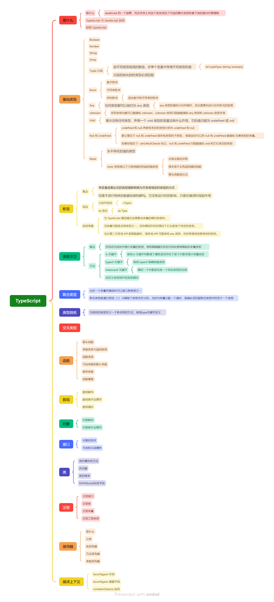

# TypeScript



## TypeScript 是什么

TypeScript 是一种由微软开发的自由和开源的编程语言。它是 JavaScript 的一个超集，而且本质上向这个语言添加了可选的静态类型和基于类的[面向对象编程](https://so.csdn.net/so/search?q=面向对象编程&spm=1001.2101.3001.7020)。

TypeScript 提供最新的和不断发展的 JavaScript 特性，包括那些来自 2015 年的 [ECMAScript](https://so.csdn.net/so/search?q=ECMAScript&spm=1001.2101.3001.7020) 和未来的提案中的特性，比如异步功能和 Decorators，以帮助建立健壮的组件。下图显示了 TypeScript 与 ES5、ES2015 和 ES2016 之间的关系：


###  TypeScript 与 JavaScript 的区别

|                            |                      TypeScript                      |                     JavaScript                     |
| :------------------------: | :--------------------------------------------------: | :------------------------------------------------: |
|        **类型系统**        |             静态类型系统，编译时检查类型             |            动态类型系统，运行时检查类型            |
|        **类型推断**        |      支持类型推断，可以根据变量赋值自动推断类型      |         支持类型推断，但不如TypeScript强大         |
|        **类型注解**        |      支持类型注解，可以显式声明变量或函数的类型      |                   不支持类型注解                   |
|   **接口（Interfaces）**   |             支持接口，用于定义对象的结构             |                     不支持接口                     |
|    **泛型（Generics）**    |          支持泛型，可以用于创建可重用的组件          |                     不支持泛型                     |
|     **枚举（Enums）**      |           支持枚举，用于定义一组命名的常量           |        不支持枚举，但可以通过对象或数组模拟        |
|     **元组（Tuples）**     |         支持元组，允许表示具有不同类型的数组         |           不支持元组，但可以通过数组模拟           |
| **命名空间（Namespaces）** |            支持命名空间，可以避免命名冲突            |    不支持命名空间，但可以通过对象或模块模式模拟    |
|    **可选参数和默认值**    |                 支持可选参数和默认值                 |                支持可选参数和默认值                |
|        **函数重载**        |          支持函数重载，允许函数具有多个签名          |                   不支持函数重载                   |
|  **装饰器（Decorators）**  | 支持装饰器，用于添加或修改类、方法、属性或参数的行为 |        不支持装饰器，但可以通过其他方式模拟        |
|        **工具支持**        | 强大的开发工具支持，如Visual Studio Code、WebStorm等 |  良好的开发工具支持，但可能没有TypeScript那么丰富  |
|         **兼容性**         |     是JavaScript的超集，可以直接转换为JavaScript     |              原生JavaScript，无需转换              |
|        **学习曲线**        |   对于已熟悉JavaScript的开发者来说，学习曲线较平缓   |           原生JavaScript，学习曲线较简单           |
|     **社区和生态系统**     | 庞大的社区和生态系统，有大量的库和框架支持TypeScript | 庞大的社区和生态系统，但可能没有TypeScript那么广泛 |
|        **大型项目**        |   更适合大型项目，有助于提高代码的可维护性和可读性   | 适合小型到中型项目，但对于大型项目可能显得不够强大 |
|       **浏览器支持**       |    最终被编译成 JavaScript 代码，使浏览器可以理解    |               可以直接在浏览器中使用               |
|         **ES支持**         |             支持 ES3，ES4，ES5 和 ES6 等             |      不支持编译其他 ES3，ES4，ES5 或 ES6 功能      |

### 获取 TypeScript

命令行的 TypeScript 编译器可以使用 Node.js 包来安装。

**1.安装 TypeScript**

```js
$ npm install -g typescript
```

**2.编译 TypeScript 文件**

```js
$ tsc helloworld.ts
# helloworld.ts => helloworld.js
```

当然，对于刚入门 TypeScript 的小伙伴，也可以不用安装 `typescript`，而是直接使用线上的 TypeScript Playground 来学习新的语法或新特性。

> TypeScript Playground：https://www.typescriptlang.org/play/

## **TypeScript 核心概念**

|        核心概念        |                           描述说明                           |
| :--------------------: | :----------------------------------------------------------: |
|      **类型系统**      | TypeScript扩展了JavaScript的动态类型系统，引入了静态类型。这允许开发者在编写代码时明确变量的类型，从而增强代码的可读性和可维护性。 |
|      **类型注解**      | 类型注解是一种显式指定变量、函数参数或函数返回值类型的方式。例如：`let name: string = "Alice";` |
|        **接口**        | 接口定义了一个对象的结构，包括它应该具有的属性和方法。接口在TypeScript中广泛用于定义对象的形状，以及确保对象满足某种预期的结构。 |
|         **类**         | 类是面向对象编程的一个核心概念，用于定义对象的结构。TypeScript中的类可以包含属性、方法和构造函数。 |
|        **泛型**        | 泛型允许在定义函数、接口或类时，不预先指定具体的类型，而在使用的时候再为其指定类型。这增加了代码的重用性和灵活性。 |
|        **模块**        | 模块是封装代码的一种方式，它可以包含变量、函数、类、接口等。模块允许将代码分割成独立的部分，并在需要时导入和使用。 |
|      **命名空间**      | 命名空间提供了一种避免命名冲突的方式。它允许开发者将相关的代码组织在一起，并为其指定一个唯一的名称。 |
|     **访问修饰符**     | 访问修饰符（如`public`、`private`和`protected`）用于控制类成员的可见性和可访问性。这有助于封装数据和控制对数据的访问。 |
|       **装饰器**       | 装饰器是一种特殊类型的声明，它可以被附加到类声明、方法、属性或参数上。装饰器使用`@expression`这样的形式，其中`expression`必须计算为一个函数，该函数将在运行时被调用。 |
| **联合类型与交叉类型** |         联合类型表示一个值可以是几种类型之一（使用`          |
|      **类型推断**      | TypeScript编译器会根据赋值的值或其他上下文信息自动推断变量的类型。这减少了显式类型注解的需要，使代码更加简洁。 |
|        **枚举**        | 枚举是一种定义命名常量的方式。它允许开发者为一组相关的值（如状态码、颜色等）创建有意义的名称。 |
|        **元组**        | 元组是一种可以包含不同类型元素的数组。这允许开发者在一个数组中存储不同类型的值。 |
|   **可选属性与参数**   | 可选属性或参数表示在对象或函数调用中，该属性或参数是可选的，不需要总是提供。这增加了代码的灵活性。 |
|      **默认参数**      | 默认参数允许在函数定义时为参数指定默认值。如果在调用函数时没有提供该参数的值，将使用默认值。 |
|      **剩余参数**      | 剩余参数允许函数接受任意数量的参数，并将它们收集到一个数组中。这有助于处理可变数量的参数。 |
|      **类型别名**      | 类型别名是为现有类型创建新名称的一种方式。这有助于简化复杂的类型声明，提高代码的可读性。 |
|      **映射类型**      | 映射类型允许开发者基于一个已存在的类型创建新的类型，并对其进行修改或扩展。 |
|      **条件类型**      | 条件类型是一种基于条件表达式的结果来选择类型的方式。它允许开发者在类型级别进行条件逻辑。 |
|      **索引类型**      | 索引类型允许开发者通过字符串或数字索引来访问对象的属性。这有助于处理具有动态属性名的对象。 |
|     **关键字类型**     | TypeScript提供了一些内置的关键字类型，如`any`、`void`、`null`、`undefined`等，用于处理特殊的类型情况。 |

## TypeScript 基础类型

### Boolean 类型

```js
let isDone: boolean = false;
// ES5：var isDone = false;
```

### Number 类型

```js
let count: number = 10;
// ES5：var count = 10;
```

### String 类型

```js
let name: string = "Semliker";
// ES5：var name = 'Semlinker';
```

### Array 类型

```js
解释let list: number[] = [1, 2, 3];
// ES5：var list = [1,2,3];

let list: Array<number> = [1, 2, 3]; // Array<number>泛型语法
// ES5：var list = [1,2,3];
```

### Enum 类型

使用枚举我们可以定义一些带名字的常量。 使用枚举可以清晰地表达意图或创建一组有区别的用例。 TypeScript 支持数字的和基于字符串的枚举。

#### **1.数字枚举**

```js
enum Direction {
  NORTH,
  SOUTH,
  EAST,
  WEST,
}

let dir: Direction = Direction.NORTH;
```

默认情况下，NORTH 的初始值为 0，其余的成员会从 1 开始自动增长。换句话说，Direction.SOUTH 的值为 1，Direction.EAST 的值为 2，Direction.WEST 的值为 3。上面的枚举示例代码经过编译后会生成以下代码：

```js
"use strict";
var Direction;
(function (Direction) {
  Direction[(Direction["NORTH"] = 0)] = "NORTH";
  Direction[(Direction["SOUTH"] = 1)] = "SOUTH";
  Direction[(Direction["EAST"] = 2)] = "EAST";
  Direction[(Direction["WEST"] = 3)] = "WEST";
})(Direction || (Direction = {}));
var dir = Direction.NORTH;
```

当然我们也可以设置 NORTH 的初始值，比如：

```js
enum Direction {
  NORTH = 3,
  SOUTH,
  EAST,
  WEST,
}
```

#### **2.字符串枚举**

在 TypeScript 2.4 版本，允许我们使用字符串枚举。在一个字符串枚举里，每个成员都必须用字符串字面量，或另外一个字符串枚举成员进行初始化。

```js
enum Direction {
  NORTH = "NORTH",
  SOUTH = "SOUTH",
  EAST = "EAST",
  WEST = "WEST",
}
```

以上代码对于的 ES5 代码如下：

```js
"use strict";
var Direction;
(function (Direction) {
    Direction["NORTH"] = "NORTH";
    Direction["SOUTH"] = "SOUTH";
    Direction["EAST"] = "EAST";
    Direction["WEST"] = "WEST";
})(Direction || (Direction = {}));
```

#### **3.异构枚举**

异构枚举的成员值是数字和字符串的混合：

```js
enum Enum {
  A,
  B,
  C = "C",
  D = "D",
  E = 8,
  F,
}
```

以上代码对于的 ES5 代码如下：

```js
"use strict";
var Enum;
(function (Enum) {
    Enum[Enum["A"] = 0] = "A";
    Enum[Enum["B"] = 1] = "B";
    Enum["C"] = "C";
    Enum["D"] = "D";
    Enum[Enum["E"] = 8] = "E";
    Enum[Enum["F"] = 9] = "F";
})(Enum || (Enum = {}));
```

通过观察上述生成的 ES5 代码，我们可以发现数字枚举相对字符串枚举多了 “反向映射”：

```js
console.log(Enum.A) //输出：0
console.log(Enum[0]) // 输出：A
```

### Any 类型

在 TypeScript 中，任何类型都可以被归为 any 类型。这让 any 类型成为了类型系统的顶级类型（也被称作全局超级类型）。

```js
let notSure: any = 666;
notSure = "Semlinker";
notSure = false;
```

`any` 类型本质上是类型系统的一个逃逸舱。作为开发者，这给了我们很大的自由：TypeScript 允许我们对 `any` 类型的值执行任何操作，而无需事先执行任何形式的检查。比如：

```js
解释let value: any;

value.foo.bar; // OK
value.trim(); // OK
value(); // OK
new value(); // OK
value[0][1]; // OK
```

在许多场景下，这太宽松了。使用 `any` 类型，可以很容易地编写类型正确但在运行时有问题的代码。如果我们使用 `any` 类型，就无法使用 TypeScript 提供的大量的保护机制。为了解决 `any` 带来的问题，TypeScript 3.0 引入了 `unknown` 类型。

### Unknown 类型

就像所有类型都可以赋值给 `any`，所有类型也都可以赋值给 `unknown`。这使得 `unknown` 成为 TypeScript 类型系统的另一种顶级类型（另一种是 `any`）。下面我们来看一下 `unknown` 类型的使用示例：

```js
let value: unknown;

value = true; // OK
value = 42; // OK
value = "Hello World"; // OK
value = []; // OK
value = {}; // OK
value = Math.random; // OK
value = null; // OK
value = undefined; // OK
value = new TypeError(); // OK
value = Symbol("type"); // OK
```

对 `value` 变量的所有赋值都被认为是类型正确的。但是，当我们尝试将类型为 `unknown` 的值赋值给其他类型的变量时会发生什么？

```js
let value: unknown;

let value1: unknown = value; // OK
let value2: any = value; // OK
let value3: boolean = value; // Error
let value4: number = value; // Error
let value5: string = value; // Error
let value6: object = value; // Error
let value7: any[] = value; // Error
let value8: Function = value; // Error
```

`unknown` 类型只能被赋值给 `any` 类型和 `unknown` 类型本身。直观地说，这是有道理的：只有能够保存任意类型值的容器才能保存 `unknown` 类型的值。毕竟我们不知道变量 `value` 中存储了什么类型的值。

现在让我们看看当我们尝试对类型为 `unknown` 的值执行操作时会发生什么。以下是我们在之前 `any` 章节看过的相同操作：

```js
let value: unknown;

value.foo.bar; // Error
value.trim(); // Error
value(); // Error
new value(); // Error
value[0][1]; // Error
```

将 `value` 变量类型设置为 `unknown` 后，这些操作都不再被认为是类型正确的。通过将 `any` 类型改变为 `unknown` 类型，我们已将允许所有更改的默认设置，更改为禁止任何更改。

### Tuple 类型

众所周知，数组一般由同种类型的值组成，但有时我们需要在单个变量中存储不同类型的值，这时候我们就可以使用元组。在 JavaScript 中是没有元组的，元组是 TypeScript 中特有的类型，其工作方式类似于数组。

元组可用于定义具有有限数量的未命名属性的类型。每个属性都有一个关联的类型。使用元组时，必须提供每个属性的值。为了更直观地理解元组的概念，我们来看一个具体的例子：

```js
let tupleType: [string, boolean];
tupleType = ["Semlinker", true];
```

在上面代码中，我们定义了一个名为 `tupleType` 的变量，它的类型是一个类型数组 `[string, boolean]`，然后我们按照正确的类型依次初始化 tupleType 变量。与数组一样，我们可以通过下标来访问元组中的元素：

```js
console.log(tupleType[0]); // Semlinker
console.log(tupleType[1]); // true
```

在元组初始化的时候，如果出现类型不匹配的话，比如：

```js
tupleType = [true, "Semlinker"];
```

此时，TypeScript 编译器会提示以下错误信息：

```js
[0]: Type 'true' is not assignable to type 'string'.
[1]: Type 'string' is not assignable to type 'boolean'.
```

很明显是因为类型不匹配导致的。在元组初始化的时候，我们还必须提供每个属性的值，不然也会出现错误，比如：

```js
tupleType = ["Semlinker"];
```

此时，TypeScript 编译器会提示以下错误信息：

```js
Property '1' is missing in type '[string]' but required in type '[string, boolean]'.
```

### Void 类型

某种程度上来说，void 类型像是与 any 类型相反，它表示没有任何类型。当一个函数没有返回值时，你通常会见到其返回值类型是 void：

```js
// 声明函数返回值为void
function warnUser(): void {
  console.log("This is my warning message");
}
```

以上代码编译生成的 ES5 代码如下：

```js
"use strict";
function warnUser() {
  console.log("This is my warning message");
}
```

需要注意的是，声明一个 void 类型的变量没有什么作用，因为它的值只能为 `undefined` 或 `null`：

```js
let unusable: void = undefined;
```

### Null 和 Undefined 类型

TypeScript 里，`undefined` 和 `null` 两者有各自的类型分别为 `undefined` 和 `null`。

```js
let u: undefined = undefined;
let n: null = null;
```

默认情况下 `null` 和 `undefined` 是所有类型的子类型。 就是说你可以把 `null` 和 `undefined` 赋值给 `number` 类型的变量。**然而，如果你指定了`--strictNullChecks` 标记，`null` 和 `undefined` 只能赋值给 `void` 和它们各自的类型。**

### Never 类型

`never` 类型表示的是那些永不存在的值的类型。 例如，`never` 类型是那些总是会抛出异常或根本就不会有返回值的函数表达式或箭头函数表达式的返回值类型。

```js
// 返回never的函数必须存在无法达到的终点
function error(message: string): never {
  throw new Error(message);
}

function infiniteLoop(): never {
  while (true) {}
}
```

在 TypeScript 中，可以利用 never 类型的特性来实现全面性检查，具体示例如下：

```js
type Foo = string | number;

function controlFlowAnalysisWithNever(foo: Foo) {
  if (typeof foo === "string") {
    // 这里 foo 被收窄为 string 类型
  } else if (typeof foo === "number") {
    // 这里 foo 被收窄为 number 类型
  } else {
    // foo 在这里是 never
    const check: never = foo;
  }
}
```

注意在 else 分支里面，我们把收窄为 never 的 foo 赋值给一个显示声明的 never 变量。如果一切逻辑正确，那么这里应该能够编译通过。但是假如后来有一天你的同事修改了 Foo 的类型：

```js
type Foo = string | number | boolean;
```

然而他忘记同时修改 `controlFlowAnalysisWithNever` 方法中的控制流程，这时候 else 分支的 foo 类型会被收窄为 `boolean` 类型，导致无法赋值给 never 类型，这时就会产生一个编译错误。通过这个方式，我们可以确保

`controlFlowAnalysisWithNever` 方法总是穷尽了 Foo 的所有可能类型。 通过这个示例，我们可以得出一个结论：**使用 never 避免出现新增了联合类型没有对应的实现，目的就是写出类型绝对安全的代码。**

## TypeScript 断言

有时候你会遇到这样的情况，你会比 TypeScript 更了解某个值的详细信息。通常这会发生在你清楚地知道一个实体具有比它现有类型更确切的类型。

通过类型断言这种方式可以告诉编译器，“相信我，我知道自己在干什么”。类型断言好比其他语言里的类型转换，但是不进行特殊的数据检查和解构。它没有运行时的影响，只是在编译阶段起作用。

类型断言的语法使用尖括号 `<Type>` 或者 `as Type` 来实现。这是两种等效的语法，你可以选择使用其中的一种。

### **尖括号 `<Type>` 的语法**

```typescript
let someValue: any = "this is a string";  
let strLength: number = (<string>someValue).length;
```

###  **`as Type` 的语法**

```typescript
let someValue: any = "this is a string";  
let strLength: number = (someValue as string).length;
```

在这两个例子中，我们都将一个 `any` 类型的变量 `someValue` 断言为 `string` 类型，以便可以安全地访问其 `length` 属性。

类型断言在以下情况中非常有用：

- 当 TypeScript 编译器无法推断出变量的确切类型时。
- 当变量可能是多种类型之一，但你确信在特定情况下它会是某个特定的类型。
- 当从第三方库或 API 获取数据时，该库或 API 可能使用 `any` 类型，但你希望使用更具体的类型。

## **类型别名**

在 TypeScript 中，类型别名（Type Aliases）是一种为现有的类型定义一个新名称的方式。这有助于简化复杂的类型声明，提高代码的可读性和可维护性。

类型别名可以使用 `type` 关键字来定义。

下面是一些使用类型别名的例子：

### 基本类型别名

```typescript
// 定义 string 类型别名为 Name
type Name = string;  
// 定义 number 类型别名为 Age
type Age = number;  
  
const name: Name = "Alice";  
const age: Age = 30;
```

>  在这个例子中，我们为 `string` 和 `number` 类型分别定义了别名 `Name` 和 `Age`。

### 联合类型别名

```typescript
// 定义联合类型的别名为 Shape
type Shape =  
  | { kind: "circle"; radius: number }  
  | { kind: "rectangle"; width: number; height: number };  
  
const circle: Shape = { kind: "circle", radius: 10 };  
const rectangle: Shape = { kind: "rectangle", width: 20, height: 10 };
```


### 交叉类型别名

```typescript
type Loggable = {  
  log(): void;  
}  
  
type Named = {  
  name: string;  
}  
// 定义 Loggable & Named 交叉类型别名为 LoggableNamed
type LoggableNamed = Loggable & Named;  
  
const obj: LoggableNamed = {  
  name: "Alice",  
  log() {  
    console.log(this.name);  
  }  
};
```

> 在这个例子中，我们定义了 `Loggable` 和 `Named` 两个类型，并使用 `&` 符号创建了一个交叉类型别名 `LoggableNamed`，它结合了 `Loggable` 和 `Named` 的所有成员。

### 泛型类型别名

```typescript
// 定义 泛型类型别名 `Id`
type Id<T> = {  
  id: T;  
};  
  
const numberId: Id<number> = { id: 1 };  
const stringId: Id<string> = { id: "hello" };
```

>  在这个例子中，我们定义了一个泛型类型别名 `Id`，它接受一个类型参数 `T`，并创建了一个具有 `id` 属性的对象类型，该属性的类型是 `T`。

类型别名有助于简化代码，特别是在处理复杂的类型时。它们不仅提高了代码的可读性，而且还允许我们更灵活地组织和复用类型定义。

## **类型守卫**

**概念**

TypeScript 中的类型守卫（Type Guards）是一种在运行时用于检查和过滤变量类型的技术。它定义了在语句的块级作用域（如 if 语句内或条目运算符表达式内）缩小变量类型的一种行为。

**作用**

帮助 TypeScript 编译器在特定的代码块中更明确地指定变量的类型。当 TypeScript 编译器遇到类型守卫时，它会在语句的块级作用域内缩小变量的类型。这种类型推断的行为被称为类型守卫。

类型守卫是一种强大的功能，因为它可以帮助开发者避免类型错误，同时还能利用 TypeScript 的类型系统来提供更好的代码智能提示和自动补全。这对于提高代码的可读性、可维护性和安全性非常有帮助。

**注意**

类型守卫是在运行时执行的，而不是在编译时。这意味着在编译 TypeScript 代码时，编译器不会执行类型守卫的逻辑。而是在代码运行时，根据条件表达式的结果来动态地确定变量的类型。

**思想**

类型保护与特性检测并不是完全不同，其主要思想是尝试检测属性、方法或原型，以确定如何处理值。

**实现**

目前主要有四种的方式来实现类型保护：

###  in 关键字

> 在 JavaScript 中，`in` 是一个操作符，用于**检查一个对象是否包含特定的属性**。换句话说，它用于检查对象是否有某个属性作为其直接属性或继承自其原型链的属性。

```js
interface Admin { // 定义Admin类
  name: string;
  privileges: string[];
}

interface Employee {// 定义Employee类
  name: string;
  startDate: Date;
}
 
type UnknownEmployee = Employee | Admin; // UnknownEmployee 类型为 Admin类或Employee类

function printEmployeeInformation(emp: UnknownEmployee) {
  console.log("Name: " + emp.name); // 输出 Admin类或Employee类 的相同的属性
  if ("privileges" in emp) { //检查 privileges 属性是否存在emp，如果是，则emp是Admin类
    console.log("Privileges: " + emp.privileges);
  }
  if ("startDate" in emp) {//检查 startDate 属性是否存在emp，如果是，则emp是Employee类
    console.log("Start Date: " + emp.startDate);
  }
}
```


### typeof 关键字

> 在JavaScript中，`typeof` 是一个一元操作符，用于获取一个变量或表达式的类型，并返回一个字符串来表示该类型。
>
> `typeof` 返回的类型是以下这些字符串之一：
>
> - `"undefined"`：如果变量未定义。
> - `"boolean"`：如果变量是布尔值。
> - `"string"`：如果变量是字符串。
> - `"number"`：如果变量是数值。
> - `"object"`：如果变量是对象或null。
> - `"function"`：如果变量是函数。
> - `"symbol"`：如果变量是Symbol（ECMAScript 2015 新增）。
>
> `typeof` 的一个常见用途是在编程中检查变量的类型，以便进行条件判断或执行特定的操作。

```js
function padLeft(value: string, padding: string | number) { // 使用 typeof 明确参数类型
  if (typeof padding === "number") { 
      return Array(padding + 1).join(" ") + value;
  }
  if (typeof padding === "string") {
      return padding + value;
  }
  throw new Error(`Expected string or number, got '${padding}'.`);
}
```

### instanceof 关键字

> 在JavaScript中，`instanceof` 是一个操作符，用于**测试构造函数的 `prototype` 属性是否出现在对象的原型链中的任何位置**。换句话说，它用于**确定一个对象是否是一个特定类型的实例**。
>
> `instanceof` 的基本语法是：
>
> ```javascript
> object instanceof constructor
> ```

```js
interface Padder { // 定义边距类
  getPaddingString(): string;
}

class SpaceRepeatingPadder implements Padder { // 定义数字类型的边距类
  constructor(private numSpaces: number) {}
  getPaddingString() {
    return Array(this.numSpaces + 1).join(" ");
  }
}

class StringPadder implements Padder { // 定义字符串类型的边距类
  constructor(private value: string) {}
  getPaddingString() {
    return this.value;
  }
}

let padder: Padder = new SpaceRepeatingPadder(6);

if (padder instanceof SpaceRepeatingPadder) { // 使用 instanceof 判断实例的具体类型
  // padder的类型收窄为 'SpaceRepeatingPadder'
}
```

### 自定义类型保护的类型谓词

```js
/**
*
这个函数接受一个参数 x，其类型为 any，意味着它可以接受任何类型的值。
函数返回一个布尔值，表明 x 是否是 number 类型。这是通过检查 x 的类型是否为 "number" 来实现的。
返回类型 x is number 是一个类型守卫的返回类型。它告诉 TypeScript，如果这个函数返回 true，那么在后续的代码中，x 可以被当作 number 类型来安全地使用。
**/
function isNumber(x: any): x is number {
  return typeof x === "number";
}

function isString(x: any): x is string {
  return typeof x === "string";
}

//使用示例：
const value: any = /* some value */;  

if (isNumber(value)) {  
  console.log(value.toFixed(2)); // TypeScript 知道 value 是 number 类型  
} else if (isString(value)) {  
  console.log(value.length); // TypeScript 知道 value 是 string 类型  
}
```

> 这段代码定义了两个 TypeScript 的用户定义类型守卫（User-Defined Type Guards）。这些类型守卫用于在运行时检查某个值是否属于特定的类型，并返回一个布尔值来表明这个检查结果。如果返回 `true`，则 TypeScript 会认为在后续的代码块中，该变量是所检查的类型。


## **联合类型**

在 TypeScript 中，联合类型（Union Types）允许一个变量在编译时可以是几种类型之一。

联合类型是通过竖线（`|`）分隔每个类型来定义的。当你为变量分配一个值时，该值必须匹配联合类型中的至少一个类型。

例如：

```typescript
let myVar: string | number;  
  
myVar = "hello"; // string 类型，可以赋值  
myVar = 42;     // number 类型，也可以赋值  
  
// myVar = true; // 错误，因为 true 不是 string 也不是 number 类型
```

>  在这个例子中，`myVar` 可以是 `string` 类型或 `number` 类型。

### **可识别联合类型**

然而，当你试图访问一个联合类型对象的属性或方法时，TypeScript 不一定知道你要使用的是哪个类型，因此可能不会提供类型安全。为了解决这个问题，TypeScript 提供了可识别联合类型（Discriminated Unions）的概念。

可识别联合类型是指每个成员类型都有一个独特的属性，这个属性在其他成员类型中不存在。这个独特的属性被称为“识别符”（discriminant）。当使用这个识别符时，TypeScript 可以确定变量当前的具体类型，从而提供类型安全。

```typescript
type Shape =  
  | { kind: "circle"; radius: number }  
  | { kind: "rectangle"; width: number; height: number };  
  
function area(s: Shape) {  
  switch (s.kind) {  
    case "circle":  
      return Math.PI * s.radius ** 2;  
    case "rectangle":  
      return s.width * s.height;  
  }  
}  
  
const circle = { kind: "circle", radius: 10 };  
const rectangle = { kind: "rectangle", width: 20, height: 10 };  
  
console.log(area(circle)); // 输出圆的面积  
console.log(area(rectangle)); // 输出矩形的面积
```

> 在这个例子中，`Shape` 是一个可识别联合类型，因为它有一个 `kind` 属性，该属性在每个成员类型中都有不同的值（`"circle"` 或 `"rectangle"`）。这使得我们可以安全地根据 `kind` 的值来确定如何计算面积。

通过使用可识别联合类型，我们可以编写更加类型安全的代码，因为 TypeScript 能够在编译时确定每个变量的具体类型。

## **交叉类型**

TypeScript的交叉类型（Intersection Types）是将多个类型合并为一个类型的方式。这意味着你可以将现有的多种类型叠加到一起，形成一个新的类型，这个新类型将包含所有原类型的特性。

交叉类型是通过使用`&`运算符来定义的。

例如，假设你有两个接口`IPerson`和`IWorker`，分别定义了人的基本信息和工作信息。你可以使用交叉类型来创建一个新的类型`IStaff`，这个类型将同时包含`IPerson`和`IWorker`的所有成员。

```typescript
interface IPerson {  
  id: string;  
  age: number;  
}  
  
interface IWorker {  
  companyId: string;  
}  
  
type IStaff = IPerson & IWorker;  
  
const staff: IStaff = {  
  id: 'E1006',  
  age: 33,  
  companyId: 'EXE'  
};
```

> 在这个例子中，`IStaff`类型就是一个交叉类型，它包含了`IPerson`和`IWorker`的所有成员。因此，当你创建一个`IStaff`类型的变量时，你需要提供所有这些成员的值。

交叉类型在TypeScript中非常有用，特别是在你需要组合多个类型的特性时。例如，在混入（Mixins）或其他不适合典型面向对象模型的地方，你经常会看到交叉类型的使用。

## **函数**

### **TypeScript 函数与 JavaScript 函数的区别**

| TypeScript     | JavaScript         |
| -------------- | ------------------ |
| 含有类型       | 无类型             |
| 箭头函数       | 箭头函数（ES2015） |
| 函数类型       | 无函数类型         |
| 必填和可选参数 | 所有参数都是可选的 |
| 默认参数       | 默认参数           |
| 剩余参数       | 剩余参数           |
| 函数重载       | 无函数重载         |

### **函数类型**

以下是几种常见的函数分类以及它们的特点：

|     分类     |                             特点                             |                             示例                             |
| :----------: | :----------------------------------------------------------: | :----------------------------------------------------------: |
| **普通函数** |            最基本的函数形式，没有特殊修饰或特性。            | function greet(name: string): string {<br> return `Hello, ${name}!`;<br>} |
| **箭头函数** | 使用 `=>` 语法定义，更简洁的语法，没有自己的 `this`、`arguments`、`super` 或 `new.target`。 | `const greet = (name: string): string => `Hello, ${name}!`;` |
| **构造函数** |   使用 `new` 关键字调用的函数，通常用于创建和初始化对象。    | class Person {<br> constructor(public name: string) {}<br>}<br>const person = new Person("Alice"); |
| **工厂函数** |         返回一个对象的函数，而不是直接创建一个对象。         | function createPerson(name: string): Person {<br> return new Person(name);<br>}<br>const person = createPerson("Alice"); |
|   **方法**   |      定义在对象或类上的函数，通过对象或类的实例来调用。      | class Person {<br> greet(): string {<br> return `Hello, ${this.name}!`;<br> }<br>}<br>const person = new Person("Alice");<br>person.greet(); |
|  **访问器**  |             允许你读取、设置或修改类的私有属性。             | class Person {<br> private _name: string;<br> get name(): string {<br> return this._name;<br> }<br> set name(value: string) {<br> this._name = value;<br> }<br>}<br>const person = new Person();<br>person.name = "Alice";<br>console.log(person.name); |
| **重载函数** |         同一个函数名，但参数列表不同的多个函数定义。         | function greet(name: string): string;<br>function greet(age: number): string;<br>function greet(input: string) |
| **抽象方法** |        在类中声明但没有实现的方法，必须在子类中实现。        | abstract class Animal {<br> abstract makeSound(): void;<br>}<br>class Dog extends Animal {<br> makeSound(): void {<br> console.log("Woof!");<br> }<br>} |

### **函数参数**

TypeScript 的函数参数具有以下特点：

|     特点     |                             说明                             |                             示例                             |
| :----------: | :----------------------------------------------------------: | :----------------------------------------------------------: |
| **类型注解** |   参数可以有明确的类型注解，这有助于增强代码的类型安全性。   | function greet(name: string): void {<br> console.log(`Hello, ${name}!`);<br>} |
|  **默认值**  | 参数可以指定默认值，当调用函数时未提供该参数时，将使用默认值。 | function greet(name: string = "Anonymous"): void {<br> console.log(`Hello, ${name}!`);<br>} |
| **可选参数** |  使用 `?` 标记的参数是可选的，调用函数时可以省略这些参数。   | function greet(name: string, greeting?: string): void {<br> const msg = greeting<br/>} |
| **剩余参数** | 使用 `...` 标记的参数可以接收任意数量的参数，这些参数被收集到一个数组中。 | function sum(...numbers: number[]): number {<br> return numbers.reduce((a, b) => a + b, 0);<br>} |
| **参数解构** |        可以使用解构赋值来直接提取对象或数组的参数值。        | function introduce({ name, age }: { name: string, age: number }): void {<br> console.log(`My name is ${name} and I'm ${age} years old.`);<br>} |
| **参数验证** | TypeScript 会在编译时检查参数的类型和数量，确保调用者提供了正确类型和数量的参数。 |                              -                               |
|   **重载**   | 函数可以有多个重载定义，允许**同一个函数名接受不同类型的参数**。 | function reverse(s: string): string;<br>function reverse(a: number[]): number[];<br>function reverse(input: any): any {<br> return Array.isArray(input) ? input.reverse() : input.split('').reverse().join('');<br>} |

### **箭头函数**

在 TypeScript 中，箭头函数 (`arrow function`) 提供了一种更简洁、更优雅的函数表达式语法。箭头函数使用 `=>` 符号来定义，并且它们有自己的特性，与常规函数（也被称为“函数声明”或“函数表达式”）有所不同。

**特点**：

1. **简洁的语法**：箭头函数语法更简洁，尤其是对于没有自己 `this`、`arguments`、`super` 或 `new.target` 的函数。
2. **不绑定自己的 `this`**：箭头函数不会创建自己的 `this` 上下文，它们只是从包含它们的代码中继承 `this`。这使得它们非常适合于回调函数和作为对象的方法，因为它们不会意外地改变 `this` 的绑定。
3. **不绑定 `arguments` 对象**：箭头函数也没有 `arguments` 对象。如果你需要在函数内部访问所有参数，可以使用剩余参数语法（`...args`）。
4. **不能用作构造函数**：箭头函数不能用作构造函数，也就是说，它们不能配合 `new` 关键字使用来创建对象。
5. **没有 `prototype` 属性**：箭头函数没有 `prototype` 属性，因此它们不能用作类构造函数。
6. **更短的函数体**：如果函数体只有一个表达式，可以省略大括号，并且该表达式的结果将自动作为函数的返回值。

**示例**：

```typescript
// 简单的箭头函数  
const greet = (name: string) => `Hello, ${name}!`;  
  
// 作为回调函数使用  
const numbers = [1, 2, 3, 4, 5];  
const squares = numbers.map(x => x * x); // [1, 4, 9, 16, 25]  
  
// 在类中使用箭头函数作为方法  
class MyClass {  
  value: number;  
  
  constructor(value: number) {  
    this.value = value;  
  }  
  
  // 使用箭头函数来确保 `this` 指向 MyClass 实例  
  increment = () => {  
    this.value++;  
  }  
  
  // 常规函数，`this` 绑定到调用上下文  
  regularFunction() {  
    this.value++;  
  }  
}  
  
const obj = new MyClass(5);  
obj.increment(); // 使用箭头函数，`this` 指向 obj  
obj.regularFunction(); // 调用错误，因为 `this` 可能是 undefined 或 null  
  
// 使用箭头函数作为对象字面量中的方法  
const obj2 = {  
  value: 10,  
  increment: () => {  
    this.value++; // 注意：这里的 `this` 不是 obj2，因为箭头函数不绑定自己的 `this`
    console.log(this) // 执行时输出 windows 对象
  }  
};  
  
obj2.increment(); // `this` 在这里不会指向 obj2，所以不会报错，但也不会按预期工作，此时 this 指向 windows

const obj3 = {  
  value: 20,  
  increment: function() {  
    this.value++; // 注意：这里的 `this` 绑定当前对象
    console.log(this) // 输出 obj3
  }  
};  
  
obj3.increment(); // 会按预期工作
```

> 在上面的示例中，可以看到箭头函数 `increment` 在 `MyClass` 类中被用来确保 `this` 指向的是类的实例。相比之下，`regularFunction` 方法在调用时可能会遇到 `this` 绑定错误的问题，因为常规函数有自己的 `this` 上下文。
>
> 在最后一个示例中，箭头函数 `increment` 作为对象 `obj2` 的方法被定义，但由于箭头函数不绑定自己的 `this`，所以 `this` 在函数内部不会指向 `obj2`。这展示了箭头函数在处理 `this` 时的特殊行为。

