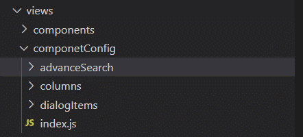
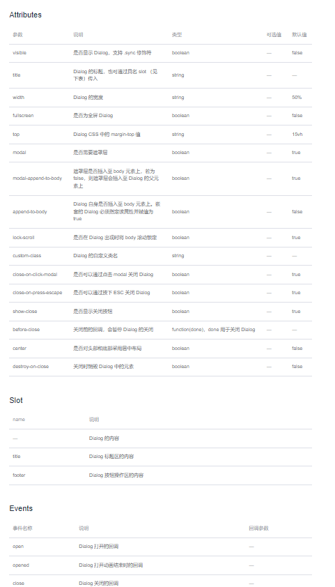
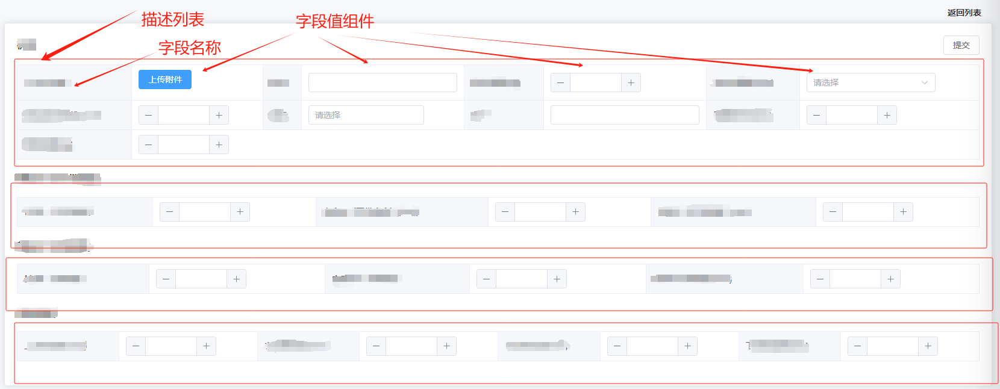

# Element ui 与 Element-plus ui 二次封装

---


## 背景

在后台管理系统中，存在大量重复相似的页面：

例如：

在列表页面中，通常列表包含以下部分：

* 数据统计项

* 高级搜索

* 列表：列表中包含表头、固定列、操作下拉、分页器

  

然而在 elements 组件中，组件的粒度划分更加小，通常像这种列表组件，包含的 elements 组件有：

* `<el-statistic>` 统计数值 组件
* 高级搜索框：
  * 实际为 `<el-form >` 表单组件，通常包含常见的 Form 表单组件：下拉、搜索、远程搜索、单选/多选、switch 开关、上传、按钮等
* 表格组件中，包含以下 element 组件：
  * ` <el-table>` 表格组件；
  * ` <el-pagination>` 分页组件：实现对列表内容页面动态切换；
  * `  <el-dropdown-menu>` 下拉菜单组件： 实现对列表操作的统一管理；
  * `<el-dialog>` 弹窗组件： 弹窗显示不同操作的内容表单；
  * ` <el-form >` 表单组件：通常包含常见的 Form 表单组件：下拉、搜索、远程搜索、单选/多选、switch 开关、上传、按钮等`，用于提交不同操作内容。

在后台管理系统中，存在大量的这类表格组件

如果不将以上 element 组件封装成一个表格组件，每次开发时，将需要重复大量的开发工作，将出现以下现象：

* 方案一：复制以上 elements 组件，修改以上组件组成列表组件，重复大量使用以上 elements 组件;
* 方案二：复制以上开发好的表格所有代码，在原来基础上修改；
  * 方案二存在大量弊端：
    * 1. 大量重复代码，难于维护
      2. 修改相同组件时（如统计组件样式）需要修改大量代码

为了提高开发效率，更好的解决方案是将列表的组成项封装成统一的页面组件，在使用时使用属性控制组件显示

---


## 封装方案

在 Vue 中，开发组件方式有：

* 模板语法： 使用 template 方式开发单文件组件；
* 渲染函数： 使用  JavaScript 完全的编程能力，调用 vue 的 render 函数，传入 vnode 渲染组件

使用 template 开发单文件组件模式是常规的 vue 组件开发方式

## 使用 Template 封装

> 组件基础知识，参考 Vue 相关文档：
>
> * [vue2 组件](https://v2.cn.vuejs.org/v2/guide/components.html)
> * [vue3 组件](https://cn.vuejs.org/api/component-instance.html)

### 组件封装目的

前端组件封装的目的是将可重用的UI元素、功能和逻辑封装成独立的组件，以提高开发效率、代码可维护性和可复用性。以下是前端组件封装的主要目的：

1. **代码复用**：组件封装使得开发者可以将相似的功能和UI元素进行抽象和封装，以便在不同的项目和场景中重复使用。通过组件的复用，可以减少重复编写类似的代码，提高开发效率。
2. **模块化和可维护性**：通过将功能和逻辑拆分成独立的组件，可以实现代码的模块化。每个组件负责自己的功能，易于理解、测试和维护。当需要修改某个功能时，只需修改对应的组件，而不会影响其他部分的代码。
3. **抽象复杂性**：组件封装可以将复杂的功能和逻辑进行封装，提供简单的接口和抽象层，使得组件的使用变得简单和直观。通过组件的抽象，开发者可以关注于业务逻辑，而无需关注底层的实现细节。
4. **提高可测试性**：独立封装的组件可以更容易进行单元测试，因为它们具有清晰的输入和输出，可以针对组件的接口编写测试用例，验证其功能和行为是否符合预期。
5. **团队协作**：组件封装使得不同的开发者可以并行工作，每个人负责开发和维护自己的组件。这种分工协作的方式有助于团队的协作和项目的进度管理。
6. **提高用户体验**：通过封装可重用的UI组件，可以确保在不同的页面和应用中保持一致的用户界面和交互，提供更好的用户体验和用户界面的一致性。

>  以上是封装的理由，但是 Elements 组件为什么还要再封装呢？

在常见的后台管理系统项目中，通常视图大题都相同，根据后台管理系统页面组件，可以将组件划分为以下常见几类组件：

*  Form 组件
* 表格组件
* 弹窗表单组件（实际为弹窗中显示提交表单）
* 高级搜索组件（实际为表单组件+按钮等）

在后台管理系统中大量重复使用以上基础组件，因此如果不对以上基础组件进行二次封装，项目中将出现大量重复的以上组件的代码，不利于提高开发效率和维护；


### 封装示例

B端项目中，常见的两个组件是 Form 组件和表格组件

下面以封装一个vue2 element  [form](https://element.eleme.cn/#/zh-CN/component/form)   和 表格 [table](https://element.eleme.cn/#/zh-CN/component/table) 组件为例，说明组件封过程

**需求分析**

一个B端 form 组件，通常用于提交表单数据给后端，表单组件内提交形式有多种多样，通常包含 elements 组件中的 form 组件：


除了以上 elements 官方文档中列举的一些组件外，通常 form 组件还会包含额外的组件：

* 富文本组件
* 远程搜索组件（需要对 elements select 组件做二次封装，接口也应定义固定结构，适配远程搜索）

一个典型 form 表单组件样式：


因此，一个通用的B端 form 组件应该能够配置信息动态渲染以上组件；

在后台管理系统中，大部分 Form 表单视图相同（如：都有label标签对应组件，form 组件最后为一行操作按钮），每个表单组件逻辑不同，因此可以**采用逻辑和视图分离的方式，对 Form 组件二次封装** 。


#### **Form 二次封装**

>  **采用逻辑和视图分离的方式，对 Form 组件二次封装** ，将 Form 表单视图封装为一个视图组件，但每个 Form 组件视图又不相同，该如何生成特定的视图组件？

我们来看看 [Element 官方 Form表单组件](https://element.eleme.cn/#/zh-CN/component/form)的写法:

```vue
<el-form ref="form" :model="form" label-width="80px">
  <el-form-item label="活动名称">
    <el-input v-model="form.name"></el-input>
  </el-form-item>
  <el-form-item label="活动区域">
    <el-select v-model="form.region" placeholder="请选择活动区域">
      <el-option label="区域一" value="shanghai"></el-option>
      <el-option label="区域二" value="beijing"></el-option>
    </el-select>
  </el-form-item>
  <el-form-item label="活动时间">
    <el-col :span="11">
      <el-date-picker type="date" placeholder="选择日期" v-model="form.date1" style="width: 100%;"></el-date-picker>
    </el-col>
    <el-col class="line" :span="2">-</el-col>
    <el-col :span="11">
      <el-time-picker placeholder="选择时间" v-model="form.date2" style="width: 100%;"></el-time-picker>
    </el-col>
  </el-form-item>
  <el-form-item label="即时配送">
    <el-switch v-model="form.delivery"></el-switch>
  </el-form-item>
  <el-form-item label="活动性质">
    <el-checkbox-group v-model="form.type">
      <el-checkbox label="美食/餐厅线上活动" name="type"></el-checkbox>
      <el-checkbox label="地推活动" name="type"></el-checkbox>
      <el-checkbox label="线下主题活动" name="type"></el-checkbox>
      <el-checkbox label="单纯品牌曝光" name="type"></el-checkbox>
    </el-checkbox-group>
  </el-form-item>
  <el-form-item label="特殊资源">
    <el-radio-group v-model="form.resource">
      <el-radio label="线上品牌商赞助"></el-radio>
      <el-radio label="线下场地免费"></el-radio>
    </el-radio-group>
  </el-form-item>
  <el-form-item label="活动形式">
    <el-input type="textarea" v-model="form.desc"></el-input>
  </el-form-item>
  <el-form-item>
    <el-button type="primary" @click="onSubmit">立即创建</el-button>
    <el-button>取消</el-button>
  </el-form-item>
</el-form>
<script>
  export default {
    data() {
      return {
        form: {
          name: '',
          region: '',
          date1: '',
          date2: '',
          delivery: false,
          type: [],
          resource: '',
          desc: ''
        }
      }
    },
    methods: {
      onSubmit() {
        console.log('submit!');
      }
    }
  }
</script>
```

通过分析以上官方的 Form 表单组件我们可以发现：

* 表单组件都通过单个 `<el-form>` 标签包裹，然后每个操作组件通过 ` <el-form-item>` 标签包裹；
*  `<el-form>` 标签是唯一固定的， ` <el-form-item>` 标签是根据操作组件决定的；

因此，我们可以将 `<el-form>` 标签包裹` <el-form-item>` 标签，` <el-form-item>` 标签通过遍历 一个配置项生成。

`Form` 组件视图可以通过一个配置项和视图组件确定，逻辑通过父组件确定；

##### **组件特征**

下面通过对 [vue2 elements Form 组件](https://element.eleme.cn/#/zh-CN/component/form)二次封装，该组件有以下特性：

* 组件视图：
  * 封装所有Form 表单的操作组件视图和公共逻辑；并能够动态扩展 Form 组件；
  * 通过 **JSON 配置动态生成表单项**，用于生成视图；

* Form 表单逻辑和数据通过父组件（使用 Form 的组件）确定；

#####  **Form 视图组件封装**

通过 `<el-form>` 标签和` <el-form-item>` 标签，将所有操作组件封装到自定义的 Form 组件中：`FormWrap.vue` 组件

```js
<template>
  <div :class="{ 'form-label-container': !isForm, 'form-container': isForm }">
    <!--stop的iframe阻止submit后跳转-->
    <iframe name="stop" class="none" style="display: none" />
    <!--stop的iframe阻止submit后跳转 end-->
    <!--form表单集合-->
    <el-form
      :ref="formRef"
      :model="data"
      :label-width="labelWidth"
      label-position="left"
      v-bind="$attrs"
      target="stop"
    >
      <el-row
        v-for="(row, rowIndex) in items"
        :key="rowIndex"
        :gutter="24"
        :class="`form-row-${rowIndex}`"
      >
        <el-col
          v-for="(item, index) in row"
          :key="index"
          :span="item.span || 24 / row.length"
          :class="item.colClassName"
        >
          <el-form-item
            :key="item.label || index"
            :label="item.label"
            :prop="item.prop"
            :rules="item.rules"
            :class="[
              isRequire(item) ? 'form-item-required' : '',
              item.className,
              item.attrs && item.attrs.disabled ? 'hidden-tips' : '',
            ]"
            :style="item.styles"
            :label-width="item.labelWidth || '120px'"
            :name="item.prop"
          >
            <slot
              v-if="item.type == $const.FormCompType.slot"
              :item="item"
              :name="item.slotName"
            />
            <!--输入框-->
            <el-input
              v-if="item.type == $const.FormCompType.input"
              v-model="data[item.prop]"
              :name="item.prop"
              auto-complete="on"
              class="item-inputs"
              :style="{ width: `${item.width || width || '100%'}` }"
              :placeholder="placeholderFormate(item)"
              v-bind="item.attrs"
              v-on="item.listeners"
            />
            <!--数字输入框-->
            <el-input-number
              v-if="item.type == $const.FormCompType.number"
              v-model="data[item.prop]"
              class="item-inputs"
              :style="{ width: `${item.width || width || '100%'}` }"
              :placeholder="placeholderFormate(item)"
              v-bind="item.attrs"
              v-on="item.listeners"
            />
            <!--多行输入框-->
            <el-input
              v-if="item.type == $const.FormCompType.textarea"
              v-model="data[item.prop]"
              class="item-inputs"
              :name="item.prop"
              auto-complete="on"
              :style="{ width: `${item.width || width || '100%'}` }"
              type="textarea"
              :placeholder="placeholderFormate(item)"
              v-bind="item.attrs"
              :autosize="(item.attrs && item.attrs.autosize) || true"
              v-on="item.listeners"
            />
            <!--富文本编辑器-->
            <tinymce
              v-if="item.type == $const.FormCompType.editor"
              v-model="data[item.prop]"
              class="item-inputs form-wrap-richtext"
              v-bind="item.attrs"
              v-on="item.listeners"
            />
            <!--日期选择-->
            <el-date-picker
              v-if="item.type == $const.FormCompType.datePicker"
              v-model="data[item.prop]"
              class="item-inputs"
              :type="(item.attrs && item.attrs.type) || 'date'"
              :placeholder="placeholderFormate(item)"
              :style="{ width: `${item.width || width || '100%'}` }"
              v-bind="item.attrs"
              v-on="item.listeners"
              @change="
                eventHandler($event, {
                  name: 'change',
                  events: item.listeners,
                  item,
                })
              "
            />
            <!--日期时间选择器-带标记封装组件-->
            <date-picker-wrap
              v-if="item.type == $const.FormCompType.datePickerColor"
              :date="data[item.prop]"
              class="item-inputs"
              :placeholder="placeholderFormate(item)"
              :style="{ width: `${item.width}` }"
              v-bind="item.attrs"
              v-on="item.listeners"
            />
            <el-date-picker
              v-if="item.type == $const.FormCompType.daterange"
              v-model="data[item.prop]"
              class="item-inputs"
              :type="(item.attrs && item.attrs.type) || 'daterange'"
              :placeholder="placeholderFormate(item)"
              :style="{ width: `${item.width || width || '100%'}` }"
              v-bind="item.attrs"
              v-on="item.listeners"
              @change="
                eventHandler($event, {
                  name: 'change',
                  events: item.listeners,
                  item,
                })
              "
            />
            <!--时间范围选择-->
            <el-time-select
              v-if="item.type == $const.FormCompType.timePicker"
              v-model="data[item.prop]"
              class="item-inputs"
              :placeholder="placeholderFormate(item)"
              :style="{ width: `${item.width || width || '100%'}` }"
              v-bind="item.attrs"
              v-on="item.listeners"
              @change="
                eventHandler($event, {
                  name: 'change',
                  events: item.listeners,
                  item,
                })
              "
            />

            <!--普通下拉选择器-->
            <SelectorWrap
              v-if="item.type == $const.FormCompType.select"
              :key="item.prop"
              :item="item"
              :data="data"
              :check-all="item.checkAll"
              v-bind="$attrs"
              v-on="$listeners"
            />

            <!--级联下拉选择器-->
            <el-cascader
              v-if="item.type == $const.FormCompType.cascader"
              v-model="data[item.prop]"
              :placeholder="placeholderFormate(item)"
              class="item-inputs"
              popper-class="form-wrap-cascader"
              :options="item.optionList"
              :style="{ width: `${item.width || width || '100%'}` }"
              v-bind="item.attrs"
              @change="
                eventHandler($event, {
                  name: 'change',
                  events: item.listeners,
                  item,
                })
              "
            />
            <!--级联面板下拉选择器-->
            <el-cascader-panel
              v-if="item.type == $const.FormCompType.cascaderPanel"
              v-model="data[item.prop]"
              :placeholder="placeholderFormate(item)"
              class="item-inputs"
              popper-class="form-wrap-cascader"
              :options="item.optionList"
              :style="{ width: `${item.width || width || '100%'}` }"
              v-bind="item.attrs"
              @change="
                eventHandler($event, {
                  name: 'change',
                  events: item.listeners,
                  item,
                })
              "
            />
            <!--穿梭面板-->
            <el-transfer
              v-if="item.type == $const.FormCompType.transfer"
              v-model="data[item.prop]"
              :data="item.data"
              v-bind="item.attrs"
              v-on="item.listeners"
            >
              <template
                v-if="item.type == $const.FormCompType.transfer && item.slotContent"
              >
                <BasicComponent :options="item.slotContent" />
              </template>
              <template
                v-if="item.type == $const.FormCompType.transfer && item.slotLeftFooter"
                slot="left-footer"
              >
                <BasicComponent :options="item.slotLeftFooter" />
              </template>
              <template
                v-if="item.type == $const.FormCompType.transfer && item.slotRightFooter"
                slot="right-footer"
              >
                <BasicComponent :options="item.slotRightFooter" />
              </template>
            </el-transfer>
            <!--远程搜索选择器-->
            <remote-search-selector
              v-if="item.type == $const.FormCompType.remoteSearchSelector"
              class="item-inputs"
              :init-value="data[item.prop]"
              :placeholder="placeholderFormate(item)"
              v-bind="item.attrs"
              :options="item.optionList"
              :show-value="item.showValue"
              :remote-methods="item.remoteMethod"
              :style="{ width: `${item.width || width || '100%'}` }"
              v-on="item.listeners"
              @valueChange="remoteSearchValueChage($event, data, item)"
            />
            <!--开关-->
            <el-switch
              v-if="item.type == $const.FormCompType.switch"
              v-model="data[item.prop]"
              v-bind="item.attrs"
              v-on="item.listeners"
              @change="
                eventHandler($event, {
                  name: 'change',
                  events: item.listeners,
                  item,
                })
              "
            />
            <!--下拉菜单-->
            <el-dropdown
              v-if="item.type == $const.FormCompType.dropdown"
              v-bind="item.attrs"
              v-on="item.listeners"
            >
              <el-button v-bind="item.dropdownButtonsAttrs">
                {{ item.dropdownLabel }}
                <i class="el-icon-arrow-down el-icon--right" />
              </el-button>

              <el-dropdown-menu slot="dropdown">
                <el-dropdown-item
                  v-for="dItem in item.dropdownItem"
                  :key="dItem.label"
                  v-bind="dItem.attrs"
                  v-on="dItem.listeners"
                >
                  {{ dItem.label }}
                </el-dropdown-item>
              </el-dropdown-menu>
            </el-dropdown>
            <!--单选-->
            <el-radio-group
              v-if="item.type == $const.FormCompType.radio"
              v-model="data[item.prop]"
              v-bind="item.attrs"
              @change="
                eventHandler($event, {
                  name: 'change',
                  events: item.listeners,
                  item,
                })
              "
            >
              <el-radio
                v-for="radio in item.optionList"
                :key="radio.label"
                :label="radio.value"
                :disabled="radio.disabled"
              >
                {{ radio.label }}
              </el-radio>
            </el-radio-group>

            <!--checkbox多选-->
            <el-checkbox-group
              v-if="item.type == $const.FormCompType.checkbox"
              v-model="data[item.prop]"
              v-bind="item.attrs"
              v-on="item.listeners"
            >
              <el-checkbox
                v-for="option in item.optionList"
                :key="option.id"
                :label="option.label"
                :value="option.value"
                :name="item.name"
              />
            </el-checkbox-group>
            <!--滑动条-->
            <el-slider
              v-if="item.type == $const.FormCompType.slider"
              v-model="data[item.prop]"
              class="item-inputs form-wrap-slider"
              v-bind="item.attrs"
              v-on="item.listeners"
            />
            <!--文件上传-->
            <file-upload
              v-if="item.type == $const.FormCompType.files"
              class="item-inputs"
              v-bind="item.attrs"
              v-on="item.listeners"
            />

            <div
              v-if="item.type == $const.FormCompType.buttons"
              class="form-buttons"
              :style="{
                'justify-content': buttonsAlign[item.align] || 'flex-start',
              }"
            >
              <el-button
                v-for="but in item.buttons"
                :key="but.label"
                :type="but.type"
                v-bind="but.attrs"
                @click="submitValidate(but.validate, but.reset, but.event, data)"
              >
                {{ but.label }}
              </el-button>
            </div>
          </el-form-item>
        </el-col>
      </el-row>
    </el-form>
  </div>
</template>

<script>
import BasicComponent from "@/components/BasicComponent";
import FileUpload from "@/components/fileUpload/index.vue";
import RemoteSearchSelector from "@/components/RemoteSearchSelector";
import Tinymce from "@/components/Tinymce";
import DatePickerWrap from "@/components/DatePickerWrap";
import SelectorWrap from "@/components/SelectorWrap";
import { placeholderFormate, eventHandler } from "@/components/FormWrap/config.js";
export default {
  name: "FormWrap",
  components: {
    BasicComponent,
    FileUpload,
    RemoteSearchSelector,
    Tinymce,
    DatePickerWrap,
    SelectorWrap,
  },
  model: {
    prop: "data",
    event: "change",
  },
  props: {
    isForm: {
      type: Boolean,
      default: true,
    },
    labelWidth: {
      type: String,
      default: "100px",
    },
    width: {
      type: String,
      default: "",
    },
    items: {
      type: Array,
      default: () => {
        return [
          {
            prop: "",
            itemType: "",
            label: "label名",
            tips: "提示输入内容",
            optionList: [],
          },
        ];
      },
    },
    data: {
      type: Object,
      default: () => {},
    },
    formRef: {
      type: String,
      default: "dialogform",
    },
  },
  data() {
    return {
      buttonsAlign: {
        left: "flex-start",
        right: "flex-end",
        center: "center",
      },
    };
  },
  methods: {
    // 文本提示语格式化
    placeholderFormate,
    // 事件统一处理函数
    eventHandler,
    // 必填项数据格式化
    isRequire(item) {
      if (!item.rules) return false;
      if (Object.prototype.toString.call(item.rules) === "[object Array]") {
        return item.rules.some((item) => item.required);
      } else if (Object.prototype.toString.call(item.rules) === "[object Object]") {
        return item.rules.required;
      }
    },

    // 提交验证
    submitValidate(validate, reset, fn, params) {
      // 表单提交按钮事件
      if (validate) {
        // validate为 true 表示需要验证的表单
        this.$refs[this.formRef].$el.submit();
        this.$refs[this.formRef].validate((valid) => {
          if (valid) {
            fn(params);
            reset && this.resetForm(); // reset 为 true 表示需要重置的表单
          } else {
            console.log("error submit!!");
            return false;
          }
        });
      } else {
        fn(params);
      }
    },
    // 表单重置
    resetForm() {
      this.$refs[this.formRef].resetFields();
      this.$emit("update:data", {});
    },
    // 远程搜索内容值修改
    remoteSearchValueChage(value, data, item) {
      data[item.prop] = value;
      this.$emit("valueChange", value);
    },
  },
};
</script>

<style lang="scss" scoped>
.form-container {
  &::v-deep .el-form-item__label {
    text-align: right;
    background-color: #f3f3f3;
    padding: 0 10px 0 0;
    margin-right: 10px;
    &::before {
      content: "" !important;
    }
  }
  &::v-deep .el-form-item {
    margin-bottom: 20px;
  }

  &::v-deep .el-upload-dragger {
    width: fit-content;
    height: fit-content;
  }
  &::v-deep .el-upload__tip {
    margin: 0 0 0 10px;
  }
  &::v-deep .el-form-item__error {
    right: 0px;
    left: auto;
    bottom: 0;
    z-index: 2;
    margin-top: -4px !important;
  }
  .item-inputs {
    width: calc(100% - 10px) !important;
  }
  .form-wrap-slider,
  .form-wrap-richtext {
    margin-left: 15px;
  }
}
.form-label-container {
  &::v-deep .el-form--label-left .el-form-item__label {
    text-align: right;
  }
  &::v-deep label {
    font-weight: normal;
  }
}
.form-buttons {
  display: flex;
  justify-content: flex-start;
  padding: 4px 0 2px 10px;
}
.form-item-required {
  &::v-deep .el-form-item__label {
    &::before {
      content: "" !important;
    }
    &::after {
      content: "*";
      color: #f56c6c;
      padding-left: 4px;
    }
  }
}
.hidden-tips {
  &::v-deep .el-form-item__error {
    display: none !important;
  }
}
</style>

```

该组件所有支持的操作组件配置：

```js
export const FormCompType = {
  slot: 'slot', // 插槽
  input: 'input',//输入框
  number: 'number',//数字输入框
  textarea: 'textarea',//多行输入框
  editor: 'editor', // 富文本编辑器
  datePicker: 'date-picker',//日期选择器
  datePickerColor: 'date-picker-color',//自定义日期选择器-带颜色
  daterange: 'daterange',//日期范围选择器
  timePicker: 'time-picker',//时间选择器
  select: 'select',//下拉选择器
  cascader: 'cascader',//级联选择器
  cascaderPanel: 'cascader-panel',//级联面板
  transfer: 'transfer',// 穿梭框
  remoteSearchSelector: 'remote-search-selector',//自定义远程搜索组件
  switch: 'switch',//开关
  dropdown: 'dropdown',//下拉
  radio: 'radio',//单选
  checkbox: 'checkbox',//多选
  slider: 'slider',//滑动条
  files: 'files', // 文件上传
  alert: 'alert', // 警告
  divider: 'divider', // 分割线
  buttons: 'buttons' // 按钮组
}
```

#####  **组件 props 配置**

> * `items`: form 组件配置对象，通过 items 属性动态渲染 form 表单内组件；
>
>   * 类型： 二维数组
>
>   * 示例：
>
>     ```js
>     [
>         [
>             {
>               prop: '属性key', //传递给后端的属性值，对应后端传入数据的字段值
>               type: 'select', // 组件类型
>               label: '组件label',
>               tips: '组件 placeholder',
>               optionList: [], // 下拉选择器下拉选项
>               labelWidth: '60px', // label 宽度
>               span: 4, // 组件占据一行的比例，一共 24，使用 elements layout  <el-col/>
>               filterable: true, // filterable 属性
>               attrs: { // elements 属性，使用属性透传传入
>                 clearable: true,
>                 size: 'mini',
>                 multiple: true,
>                 'collapse-tags': true
>               }
>             }
>         ]
>     ]
>     ```
>
>     > form 表单组件配置 JSON 是一个二维数据，二维数组第二维表示一行
>
> * `data`: 表单数据，通过传入 data，将后端数据绑定到 form 表单；
>
>   * 类型：对象
>
>   * 结构示例：
>
>     ```
>     {
>     	key: value // key 对象 item 配置对象中的 prop 属性，value 对应后端返回的值
>     }
>     ```
>
>     

#####  **组件使用示例**

通过使用以上 Form 组件，开个一个高级搜索组件，该高级搜索组件视图如下：


该组件可以分为两个部分：

* 上半部分为表单组件，该表单组件包括下拉，输入框等，并且根据业务模块不同动态变化；
* 下班部分为公共相同部分：筛选，搜索和其他操作按钮；

该组件的 Form 表单可以进行动态配置，其他部分可以封装成固定逻辑和视图：

```vue
<template>
  <!-- 高级搜索 -->
  <div class="advaced-search-container">
    <!-- Form 视图组件 -->
    <form-wrap
      v-show="showAdvanceSearch"
      form-ref="AdvancedSearch"
      class="advaced-search-buttons animate__animated"
      :class="{
        animate__fadeIn: showAdvanceSearch,
      }"
      :items="advanceSearchItems"
      :data="listQuery"
      :is-form="false"
      @change="formChange"
    />
    <!-- 搜索 -->
    <div class="search-container">
      <slot name="prepend-buttons" />
      <el-input
        v-model="search"
        clearable
        autocomplete="on"
        class="search-button"
        placeholder="请输入搜索内容"
        suffix-icon="el-icon-search"
        size="mini"
        debounce="300"
        @input="inputChange"
        @keyup.enter.native="fuzzySearch"
      />
      <el-button-group>
        <!-- 刷新按钮 -->
        <el-button
          size="mini"
          icon="el-icon-refresh"
          @click="$emit('refresh', search)"
        />
        <!--按钮：高级搜索-->
        <el-button
          size="mini"
          :icon="showAdvanceSearch ? 'el-icon-zoom-out' : 'el-icon-zoom-in'"
          @click="showAdvanceSearch = !showAdvanceSearch"
        />
        <!--按钮：列表-->
        <el-dropdown
          v-if="columns && columns.length>0"
          trigger="click"
          :hide-on-click="false"
          class="advance-search"
        >
          <el-button size="mini" icon="el-icon-menu" />
          <el-dropdown-menu slot="dropdown">
            <el-checkbox-group
              v-model="checkColumnList"
              @change="columnsChange"
            >
              <el-dropdown-item v-for="col in columns" :key="col.prop">
                <el-checkbox :label="col.prop" :checked="col.checked">{{
                  col.label
                }}</el-checkbox>
              </el-dropdown-item>
            </el-checkbox-group>
          </el-dropdown-menu>
        </el-dropdown>

      </el-button-group>
      <!-- 按钮组后置插槽 -->
      <slot name="append-buttons" />
    </div>
  </div>
  <!-- 新增 -->
</template>

<script>
import FormWrap from '@/components/FormWrap'
import { getMovement } from '@/api/npi'

export default {
  name: 'AdvancedSearch',
  components: {
    FormWrap
  },
  props: {
    listQuery: {
      type: Object,
      default: () => {}
    },
    productType: {
      type: Object,
      default: () => {}
    },
    columns: {
      // 表头数据
      type: Array,
      default: () => []
    }
  },
  data() {
    return {
      checkList: [1, 2, 3],
      search: '',
      showAdvanceSearch: true,
      checkColumnList: [],
      addPredev: false
    }
  },
  computed: {
    optionList() {
      return this.$store.state.odf.indexSearchOption
    },
    majorList() {
      const majorList = JSON.parse(JSON.stringify(this.optionList.major)) || []
      majorList.push({
        id: 9,
        label: '跨专业',
        name: '跨专业',
        value: 9
      })
      return majorList
    },
    //  表单配置项
    advanceSearchItems() {
      return [[
        {
          prop: 'order_nature',
          type: 'select',
          label: this.$t('odfSearch.professionType'),
          tips: this.$t('odf.orderNature'),
          optionList: this.optionList.order_nature,
          filterable: true,

          labelWidth: '80px',
          attrs: {
            clearable: true,
            size: 'mini'
          }
        },
        {
          prop: 'product_type',
          type: 'select',
          label: this.$t('odfSearch.productType'),
          tips: this.$t('odf.productType'),
          optionList: this.optionList.product_type,
          filterable: true,
          labelWidth: '80px',
          attrs: {
            clearable: true,
            size: 'mini',
            multiple: true
          }
        },
        {
          prop: 'movement',
          type: 'remote-search-selector',
          label: this.$t('odfSearch.movement'),
          tips: this.$t('odf.movement'),

          remoteMethod: this.getMovement,
          labelWidth: '60px',
          attrs: {
            clearable: true,
            size: 'mini',
            formates: {
              labelKey: 'name',
              valueKey: 'id'
            }
          }
        },
        {
          prop: 'status',
          type: 'select',
          label: this.$t('odfSearch.status'),
          tips: this.$t('odf.status'),

          optionList: this.optionList.status,
          filterable: true,
          labelWidth: '50px',
          attrs: {
            clearable: true,
            size: 'mini'
          }
        },
        {
          prop: 'sw_status',
          type: 'select',
          label: this.$t('odf.swStatus'),
          tips: this.$t('odf.swStatus'),

          optionList: this.optionList.sw_status,
          labelWidth: '70px',
          filterable: true,
          attrs: {
            clearable: true,
            size: 'mini'
          }
        },
        {
          prop: 'prototype_time',
          type: 'daterange',
          label: this.$t('odfSearch.prototypeTime'),
          tips: this.$t('odf.prototypeTime'),
          labelWidth: '80px',

          attrs: {
            startPlaceholder: '开始日期',
            endPlaceholder: '结束日期',
            valueFormat: 'yyyy-MM-dd',
            size: 'mini'
          }
        }
      ],
      [
        {
          type: 'buttons',
          align: 'left',
          labelWidth: '0px',
          span: 24,
          buttons: [
            {
              label: this.$t('systemCommon.filter'),
              type: 'primary',
              event: () => this.$emit('search'),
              attrs: {
                size: 'mini',
                icon: 'el-icon-search'
              }
            },
            {
              label: this.$t('systemCommon.resetButon'),
              event: () => this.$emit('reset'),
              reset: true,
              attrs: {
                size: 'mini',
                icon: 'el-icon-delete'
              }
            }
          ]
        }]
      ]
    }
  },
  created() {
    this.$store.dispatch('odf/GetIndexSearchOption')
  },
  methods: {
    getMovement,

    columnsChange(col) {
      const showColumn = []
      this.columns.forEach((colItem) => {
        if (col.indexOf(colItem.prop) > -1) {
          showColumn.push(colItem)
        }
      })
      this.$emit('columnsChange', showColumn)
    },
    fuzzySearch() {
      this.$emit('fuzzySearch', { keyword: this.search })
    },
    inputChange(value) {
      this.search = value && value.trim && value.trim()
      this.fuzzySearch()
    },
    formChange(value) {
      const { item, params } = value
      this.$emit('formChange', {
        label: item.label,
        prop: item.prop,
        value: params,
        data: value
      })
    }
  }
}
</script>

<style lang="scss" scoped>
@import "~@/styles/common/advance-search.scss";
</style>
```

##### **组件优化：配置项抽离**

通过使用 `FormWrap.vue` 组件封装高级高级组件过程中我们可以发现，不同的 ` <form-wrap/>` 组件中，视图相同，不同表单组件仅仅只有 `data` 和 `items`（form 视图配置） 属性不同，但在以上封装的组件中 ， `items`（form 视图配置） 属性代码占用多行，导致代码查看不清晰；

除此之外，在实际开发过程中，我们发现，常常遇到此类需求：

* form 表单项动态变化：如同一个弹窗组件中显示的一个表单的 新增，编辑，审核等操作；不同操作显示的字段和操作组件不同；
* 通过同一个页面或者组件动态显示不同的 form 表单操作；

根据以上封装的 `FormWrap.vue` 组件中我们可以知道，不同  `FormWrap.vue`  组件的视图差异在于 `items` 配置项的差异；

因此可以通过将 `items` 表单配置项目单独抽离管理，通过单独抽离管理，有以下优点：

1. 可实现`FormWrap.vue` 组件复用，表单项 `items` 动态变化：复用`FormWrap.vue` 组件，通过动态变化表单项 `items`，可以实现组件/代码的最大复用，提高开发效率，并且能实现较复杂需求；
2. 代码逻辑结构清晰， `items` 单独管理配置，可实现不同模块 `items` 相互调用和配置；

为了统一管理组件的配置项，我在项目视图下创建一个文件夹，统一管理所有组件的配置，包括表单，表格，高级搜索等：



```js
├── componentConfig
│  ├── advanceSearch  高级搜索配置项目
│  ├── columns 表格列配置
│  ├── dialogItems 弹窗配置项
│  ├── index.js   入口文件

```

 为了能在 Vue 实例中任意组件获取表单/表格/高级搜索项 `items` ，我在项目中封装了一个 Vue 实例的方法：`views/componentConfig/index.js` 

```js
/**
 * 该文件为获取表格配置文件夹统一管理入口，表格配置列统一在 columns 文件夹中管理：
 * 通过 公共方法 this.$getTableColumns() 获取表格配置列
 */

//  require.context返回modules文件夹下所有的文件对象,参考https://webpack.js.org/guides/dependency-management/#requirecontext

const fileFolders = {
  columns: {
    files: require.context('./columns', true, /\.js$/),
    fileModules: []
  },
  advanceSearch: {
    files: require.context('./advanceSearch', true, /\.js$/),
    fileModules: []
  },
  dialogItems: {
    files: require.context('./dialogItems', true, /\.js$/),
    fileModules: []
  }
}

/*
 *通过直接获取modules文件夹下的所有文件添加进入modules对象
 *回调函数参数：
 *modules：文件对象
 *modulePath：文件路径
 */

for (const key in fileFolders) {
  const files = fileFolders[key].files

  fileFolders[key].fileModules = files.keys().reduce((module, modulePath) => {
    // 获取文件名称
    const moduleName = modulePath.replace(/^\.\/(.*)\.\w+$/, '$1')

    // 获取路径保存在modulePath文件内容
    const value = files(modulePath)
    // 修改modules对象
    module[moduleName] = value
    fileFolders[key].fileModules.push(module)

    return module
  }, {})
}

/**
 * 获取表格列配置项
 * @param {*} that 组件实例对象
 * @param {*} moduleName 模块名称
 * @param {*} pageName 页面名称
 * @returns
 */
export function getTableColumns({
  instance = null,
  moduleName = null,
  pageName = null,
  params = null
}) {
  if (!instance || !moduleName || !pageName) return {}
  const methods = fileFolders.columns.fileModules[moduleName][pageName]
  return methods({
    instance,
    params
  })
}

/**
 * 获取高级搜索列配置项
 * @param {*} that 组件实例对象
 * @param {*} moduleName 模块名称
 * @param {*} pageName 页面名称
 * @param {*} params 参数
 * @returns
 */
export function getAdvanceSearchItems({
  instance = null,
  moduleName = null,
  pageName = null,
  params = null
}) {
  if (!instance || !moduleName || !pageName) return {}
  const methods = fileFolders.advanceSearch.fileModules[moduleName][pageName]
  return methods({
    instance,
    params
  })
}

/**
 * 获取高级搜索列配置项
 * @param {*} that 组件实例对象
 * @param {*} moduleName 模块名称
 * @param {*} pageName 页面名称
 * @param {*} params 参数
 * @returns
 */
export function getDialogItems({
  instance = null,
  moduleName = null,
  pageName = null,
  params = null
}) {
  if (!instance || !moduleName || !pageName) return {}
  const methods = fileFolders.dialogItems.fileModules[moduleName][pageName]
  return methods({
    instance,
    params
  })
}

```

使用方法：

在组件中，通过调用 `this.getAdvanceSearchItems` 方法即可获取配置项；

```vue
    advanceSearchItems() {
      return this.$getAdvanceSearchItems({
        instance: this, //组件实例
        moduleName: 'demo', // 文件名称
        pageName: 'DemoSearch' //方法名称
      })
    }
```

高级搜索表单配置项：在`/componentConfig/advanceSearch`  文件夹下面创建 `demo.js` 文件，文件内暴露 `DemoSearch` 方法：

```js
import { PAGEVIEWS } from '@/views/project/npi/assets/config.js'
import { rangetimePickerOptionsList } from '@/utils/index.js'
import { formateOptions } from '@/utils/index.js'
// ============================ NPI ======================================================
/**
 * NPI 列表
 * @param {*} instance 组件实例
 * @returns
 */
export function DemoSearch({ instance, params }) {
  if (!instance) return {}
  const commonItem = [
    {
      prop: 'demo', //搜索项属性，传递给后端
      type: 'input', // 组件类型
      label: 'label 名称', // 标签名称
      tips: '组件提示语', // 组件提示语
      optionList: [], // 下拉选项
      filterable: true, // 组件是否过滤
      labelWidth: '70px',
      attrs: { // 组件透传属性
        clearable: true,
        size: 'mini',
        'collapse-tags': true,
        props: {
          multiple: true,
          value: 'key',
          emitPath: false
        }
      },
      listeners: {// 组件透传事件
        change: instance.DemoSearchChange
      },
      span: 4
    },

  ]
  return  commonItem
}

```


#### **Table 二次封装**

表格组件分析：

一个 to B端后台管理系统中，表格组件通常包括以下组件

* [elements  table](https://element.eleme.cn/#/zh-CN/component/table) 表格组件
*  [` <el-pagination/ >`](https://element.eleme.cn/#/zh-CN/component/pagination)分页器

表格组件通常包括以下功能特性：

* 通过 JSON 对象动态配置表格列内容；

* 自定义头部显示内容；
* 首列固定列，能自定义首列：如序号，复选框等；
* 能自定义列插槽
* 自定义头部插槽


属性 props 设置：

> * `columns`: 表头配置；
>
>   * 类型： 数组；
>
>   * 示例：
>
>     ```js
>         {
>           prop: '列属性', // 后端传入数据
>           label: '列 label',
>           width: 150,//列宽度
>           align: 'left', // 列对齐方式
>           attrs: { // elements 列属性，使用属性穿透，对象内部为 elements 表格组件原生属性
>             fixed: true
>           },
>           slot: true, // 列插槽，是否使用列插槽
>           slotName: '列插槽名称'
>         }
>     ```
>
> * `data`: 后端传入的表格数据
>
>   * 类型： 数组；
>
>   * 示例：
>
>     ```js
>     [
>         {
>     		key1: value1, // key 对应列属性 prop ，value 对应列值
>     		key2: value2
>         }
>     ]
>     ```
>
> * `listQuery`:  列表查询参数，传递给后端，通常用于高级搜索参数和分页参数。
>
>   * 类型：对象；
>
>   * 示例：
>
>     ```js
>       {
>            	page: 1, //列表分页页码
>             page_size: this.$const.MIDDLE_PAGE_SIZE, //列表分页大小
>     		key1: value1, // key 对应列属性 prop ，value 对应列值
>     		key2: value2
>        }
>     ```
>
>     

代码实现：

```vue
<template>
  <div class="table-wrapper" :class="{ 'show-border': outerBorder }">
    <el-skeleton :loading="loading" animated :throttle="500" :count="3">
      <div class="header-wrap">
        <slot name="header" />
      </div>
      <!-- 头部分页 -->
      <div v-if="showTopPagination" class="pagination-container">
        <el-pagination
          background
          :hide-on-single-page="fixPageConf.hideOnSinglePage"
          :layout="fixPageConf.layout"
          :total="total"
          :current-page="listQuery.page"
          :page-sizes="fixPageConf.pageSizes"
          :page-size="listQuery.page_size"
          @size-change="eventEmit('size-change', $event)"
          @current-change="eventEmit('current-page-change', $event)"
        />
      </div>
      <el-table
        ref="table"
        :border="border"
        fit
        v-bind="$attrs"
        :element-loading-text="loadingText"
        :data="tableData"
        :header-cell-style="headerCellStyles"
        :cell-style="cellStyles"
        v-on="$listeners"
      >
        <!-- 复选框 -->
        <el-table-column
          v-if="showSelection"
          column-key="selection"
          v-bind="$attrs"
          type="selection"
          width="35"
          align="center"
          fixed
        />

        <!-- 序号 -->
        <el-table-column
          v-if="showIndex"
          column-key="index"
          label="序号"
          type="index"
          width="55"
          align="left"
          fixed
        />

        <!-- 所有列可扩展 -->
        <el-table-column v-if="showExpand" type="expand" width="25" align="center" fixed>
          <slot
            slot-scope="scope"
            name="expand"
            :elCol="scope.column"
            :row="scope.row"
            :rowIndex="scope.$index"
          />
        </el-table-column>

        <!-- 表头数据 -->
        <el-table-column
          v-for="(column, cIndex) in tableColumns"
          :key="cIndex"
          :align="column.align || 'center'"
          :prop="column.prop"
          :label="column.label"
          :width="column.width"
          :sortable="column.sortable || false"
          :type="column.type"
          :fixed="column.fixed || (cIndex === 0 && firstColumnFixed)"
          v-bind="column.attrs"
          v-on="column.listeners"
        >
          <!-- 表头的自定义插槽, 使用 slotHeaderName 和 slotHeaderIcon 定义-->
          <template v-if="column.slotHeaderName || column.slotHeaderIcon" #header>
            <!-- 表头自定义插槽-->
            <slot
              v-if="column.slotHeaderName"
              :name="column.slotHeaderName"
              :row="column"
            />
            <span v-if="column.slotHeaderIcon">{{ column.label }}</span>
            <!-- 表头图标插槽：使用表头图标，默认添加弹出层，弹出层内容插槽名称为：表头插槽名称 + PopContent -->
            <el-popover
              v-if="column.slotHeaderIcon"
              class="header-slot-popup"
              placement="bottom"
              :title="column.slotHeaderIconPopTitle || column.label"
              :width="column.slotHeaderPopWidth"
              trigger="click"
            >
              <div class="filter-content">
                <slot
                  v-if="column.slotHeaderIcon"
                  class="filter-slot"
                  :name="column.slotHeaderPopName + 'PopContent'"
                />
              </div>
              <!-- 列对象中添加 slotHeaderIcon 属性，表示使用头部图标插槽-->
              <svg-icon
                v-if="column.slotHeaderIcon"
                slot="reference"
                class="header-icon-slot"
                :class="column.slotHeaderIconClass"
                :icon-class="column.slotHeaderIcon"
                @click="headerIconClick(column)"
              />
            </el-popover>
          </template>

          <!-- 插入自定义模板到列中 -->
          <slot
            v-if="column.slot"
            slot-scope="scope"
            :name="column.slotName || 'slotCol'"
            :colConf="column"
            :elCol="scope.column"
            :row="scope.row"
            :rowIndex="scope.$index"
            :colIndex="cIndex"
            :rowspan="column.rowspan"
          />

          <!-- 扩展列插槽 -->
          <template v-else-if="column.expandSlot">
            <slot
              v-if="column.expandSlot"
              :name="column.expandSlot || 'slotExpend'"
              :colConf="column"
              :elCol="scope.column"
              :row="scope.row"
              :rowIndex="scope.$index"
              :colIndex="cIndex"
              :rowspan="column.rowspan"
            />
          </template>

          <!--列内容插槽 -->
          <template v-else slot-scope="scope">
            <div class="content">
              <el-checkbox
                v-if="column.checkbox"
                :value="checked(scope.row, column)"
                @change="checkboxChange($event, scope.row, column)"
                >{{ scope.row[column.prop] }}</el-checkbox
              >
              <el-tooltip
                v-else
                class="tootip-container"
                effect="dark"
                placement="top-start"
                :disabled="!column.tooltip"
              >
                <template slot="content">
                  <!-- 字符串长度大于 80 格式化 -->
                  <span
                    v-if="String(scope.row[column.prop]).length > 80"
                    :class="{ 'cursor-pointer hoveTitle': column.tooltip }"
                    v-html="formateTooltip(String(scope.row[column.prop]))"
                  />
                  <span v-else>{{ String(scope.row[column.prop]) }}</span>
                </template>
                <p>
                  <span :class="{ 'cursor-pointer hoveTitle': column.tooltip }">{{
                    column.formatter(
                      scope.row,
                      scope.column,
                      scope.row[column.prop],
                      scope.$index
                    )
                  }}</span>
                </p>
              </el-tooltip>
            </div>
          </template>
        </el-table-column>

        <!-- 固定列数据 -->
        <el-table-column
          v-if="showButtons"
          column-key="buttons"
          :label="fixButConfig.label"
          :align="fixButConfig.align"
          :fixed="fixButConfig.fixed"
          :width="fixButConfig.width"
        >
          <slot
            slot="default"
            slot-scope="scope"
            name="buttons"
            :$index="scope.$index"
            :row="scope.row"
            :column="scope.column"
          />
        </el-table-column>

        <!-- 默认插槽 -->
        <slot />
      </el-table>

      <!-- 分页 -->
      <div v-if="isShowPagination" class="pagination-container">
        <el-pagination
          background
          :hide-on-single-page="fixPageConf.hideOnSinglePage"
          :layout="fixPageConf.layout"
          :total="total"
          :current-page="listQuery.page"
          :page-sizes="fixPageConf.pageSizes"
          :page-size="listQuery.page_size"
          @size-change="eventEmit('size-change', $event)"
          @current-change="eventEmit('current-page-change', $event)"
        />
      </div>
    </el-skeleton>
  </div>
</template>

<script>
import variables from "@/styles/variables.scss";
import { isEmpty } from "@/utils/index.js";
export default {
  name: "TableWrap",

  props: {
    showIndex: {
      // 是否显示序号
      type: Boolean,
      default: false,
    },
    border: {
      // 默认没有border
      type: Boolean,
      default: true,
    },
    outerBorder: {
      // 默认没有border
      type: Boolean,
      default: false,
    },
    showExpand: {
      type: Boolean,
      default: false,
    },
    showSelection: {
      // 是否选择复选框
      type: Boolean,
      default: false,
    },
    loading: {
      // 是否loading
      type: Boolean,
      default: false,
    },
    loadingText: {
      // loading显示的文本
      type: String,
      default: "loading......",
    },
    columns: {
      // 表头数据
      type: Array,
      default: function () {
        return [];
      },
    },
    data: {
      // 表格数据
      type: [Array, Object],
      default: function () {
        return [];
      },
    },
    showButtons: {
      // 是否显示固定列
      type: Boolean,
      default: false,
    },
    buttonsConf: {
      // 固定列配置信息
      type: Object,
      default() {
        return {
          label: "操作",
          align: "center",
          fixed: false,
          width: 100,
        };
      },
    },
    cellStyle: {
      type: Object,
      default() {
        return {};
      },
    },
    headerCellStyle: {
      type: Object,
      default() {
        return {};
      },
    },
    total: {
      // 总数据条数
      type: Number,
      default: 0,
    },
    showPagination: {
      // 是否显示分页,作为表单初始值属性,组件内控制是否显示使用 isShowPagination
      type: Boolean,
      default: true,
    },
    showTopPagination: {
      // 是否显示头部分页
      type: Boolean,
      default: false,
    },
    pageConf: {
      // 分页配置
      type: Object,
      default() {
        return {
          hideOnSinglePage: false,
          layout: "total, sizes, prev, pager, next, jumper",
          pageSizes: [10, 15, 20, 50, 100, 200, 500, 1000, 2000, 5000, 10000],
        };
      },
    },
    listQuery: {
      type: Object,
      default() {
        return {
          page: 1,
          page_size: this.$const.MIDDLE_PAGE_SIZE,
        };
      },
    },
    // 表格第一列固定，默认固定;(注意：在 expand 表格中,默认固定列会渲染两次扩展内的组件)
    firstColumnFixed: {
      // 是否显示分页
      type: Boolean,
      default: true,
    },
  },
  data() {
    return {
      // tableColumns: []
      isShowPagination: this.showPagination,
    };
  },
  computed: {
    tableColumns() {
      this.colFormatter();
      return this.columns;
    },
    tableData() {
      if (!(this.data instanceof Array)) {
        console.error("table data must be an array");
        return [this.data];
      }
      if (isEmpty(this.data)) {
        this.hiddenPagination();
      }
      if (this.showPagination && !isEmpty(this.data)) {
        this.setShowPagination();
      }
      return this.data;
    },
    headerCellStyles() {
      return Object.assign(
        {
          fontSize: variables.fontSizePrimary,
          padding: "5px",
          color: variables.regularText,
          // fontFamily: 'Microsoft YaHei',
          backgroundColor: variables.tableTitleBgColor,
          fontWeight: "normal",
        },
        this.headerCellStyle
      );
    },
    cellStyles() {
      return Object.assign(
        {
          // fontFamily: 'Microsoft YaHei',
          fontSize: variables.fontSizePrimary,
          padding: "0",
        },
        this.cellStyle
      );
    },
    // 固定分页配置
    fixPageConf() {
      const defaultConfig = {
        hideOnSinglePage: false,
        layout: "total, sizes, prev, pager, next, jumper",
        pageSizes: [10, 15, 20, 50, 100, 200, 500, 1000, 2000, 5000, 10000],
      };
      return Object.assign(defaultConfig, this.pageConf);
    },
    // 固定列操作默认配置
    fixButConfig() {
      const defaultConfig = {
        label: "操作",
        align: "center",
        fixed: false,
        width: 60,
      };
      return Object.assign(defaultConfig, this.buttonsConf);
    },
  },

  beforeMount() {
    this.colFormatter();
  },
  methods: {
    hiddenPagination() {
      this.isShowPagination = false;
    },
    setShowPagination() {
      this.isShowPagination = true;
    },
    checked(row, column) {
      const keyName = `${column.prop}_checked`;
      return row[keyName];
    },
    /**
     * 列格式化函数， 没有formatter的列要添加默认的formatter,不然数据无法显示
     * @description
     * @param {string} str - 格式化字符串
     */
    colFormatter() {
      if (this.columns.length === 0) return;
      this.columns.forEach((value) => {
        // 没有formatter的列要添加默认的formatter,不然数据无法显示
        if (value.formatter === undefined || value.formatter === null) {
          value.formatter = (row, column, value) => value;
        }
      });
    },
    eventEmit(eventName, value) {
      this.$emit(eventName, value);
    },
    /**
     * 格式化输入提示
     * @description
     * @param {string} str - 格式化字符串
     */
    formateTooltip(str) {
      let temp = str;
      let result = "";
      while (temp.length > 80) {
        result = result + temp.slice(0, 80) + "<br/>";
        temp = temp.slice(80);
      }
      return (result = result + temp);
    },
    checkboxChange(value, row, col) {
      this.$emit("checkboxChange", { value, row, col });
    },
    // 表头icon 点击事件
    headerIconClick(column) {
      this.$emit("header-icon-click", column.prop);
    },
  },
};
</script>

<style lang="scss" scoped>
.table-wrapper {
  width: 100%;
  height: 100%;
  overflow: auto;
  background-color: white;
  border-radius: 4px;
  border: 1px solid #ebeef5;

  .el-table {
    height: calc(100% - 52px);
  }
  .el-table__expanded-cell[class*="cell"] {
    padding: 0;
    & p {
      margin: 0px;
    }
  }
  .pagination-container {
    margin: 5px;
    float: right;
    &::v-deep .number,
    &::v-deep .el-pager li,
    &::v-deep .btn-next,
    &::v-deep .btn-prev {
      font-weight: 500;
      background-color: white;
      border: 1px solid $borderPrimary;
    }
    &::v-deep .el-pager li:not(.disabled).active {
      border-radius: 4px;
    }
  }
  .content {
    width: 100%;
    display: inline-block;
    &::v-deep p {
      margin: 7px 0px;
      overflow: hidden;
      text-overflow: ellipsis;
      white-space: nowrap;
    }
    .cursor-pointer {
      cursor: pointer;
    }
  }
  &::v-deep .cell {
    line-height: 15px;
    margin: 1px 0;
    padding-right: 0px;
    padding-left: 5px;
  }
  &::v-deep thead .cell {
    line-height: 20px;
  }
  &::v-deep .appraise-buttons {
    margin: 0px;
  }

  th {
    padding: 0px;
  }
  .table_1_column_8 {
    padding: 0px;
  }
}
.show-border {
  border: 1px solid #ebeef5;
  border-radius: 4px;
}
.hoveTitle {
  text-align: left;
  width: 140px;
  overflow: hidden;
  text-overflow: ellipsis;
  white-space: nowrap;
}
.header-filter-icon {
  margin-left: 5px;
  cursor: pointer;
  font-size: $fontSizePrimary;
  &:hover {
    color: $primary;
  }
}
.header-icon-slot {
  font-size: 16px !important;
  margin-left: 3px !important;
  filter: opacity(0.6) !important;
  cursor: pointer;
  &:hover {
    filter: opacity(1) !important;
  }
}
</style>

```


### 组件封装技巧

通过分析以上 form 组件和 table 组件，我们可以发现，elements 组件二次封装技巧：

* 熟悉 elements 组件的属性、事件、插槽；
* 在封装的组件中，必须能够透传原组件属性、事件和插槽，通常使用属性透传完成；
* 组件的视图配置和数据配置分离：
  * 视图配置 form 组件的 `items` 属性和 表格组件的 `columns` 属性，用于配置组件样式；
  * 数据配置  form 组件和表格组件的 ` data `属性 通常决定组件显示的数据内容；
  * 通过将视图配置和数据配置分离，可以将接口和视图组件分离；
* 自定义扩展的属性和插槽不能影响原组件的属性和插槽

****


## JSON 配置组件封装

### 背景

通过开发大量后台管理系统发现，在使用单文件组件开发组件时，存在以下问题：

1. 在开发初期，如果组件粒度拆分不够细，在后期开发中发现已有组件需要二次拆分时候，需要重新创建一个 `.vue ` 单文件组件，并需要将原组件的视图和逻辑拆离，造成工作量大；

2. 使用组件的地方，需要通过 impoer 预先引入组件文件，vue2 中且需要在 components 组件中预先声明使用的组件，导致部分需求无法实现：

   * 如：现已在其它模块中开发了` A、B、C、D....Z` 模块的表单，现在 test 模块中需要在同一个弹窗中，根据后端返回的字段，显示不同的弹窗表单内容（弹窗表单内容有N中形式）；

   * 如果使用单文件组件模式，需要预先在 test 模块中引入 ` A、B、C、D....Z` 模块的表单组件，并在 components 属性中声明 ` A、B、C、D....Z` 组件。无法根据后端字段动态加载组件。

3. 在不断抽离公共组件后发现，在大量的重复组件中，大量组件差异仅在于逻辑差异，视图几乎相似：

   * 如：表格组件中，视图都存在高级搜索项、表头、操作项、分页器，所有的表格差异，仅仅在于数据不同，因此可以将表格组件拆分为固定的视图组件和动态的逻辑组件，视图固定为高级搜索项、表头、操作、分页器，逻辑根据后端数据返回高级搜索项、表头、操作项；

根据以上问题，我们需要解决组件封装中的两大问题：

1. **组件能够动态引入，无需预先 import 导入；**
2. **将视图组件和逻辑组件拆分管理，统一视图组件，逻辑组件动态变化**

通过调研发现，[百度低代码 amis ](https://github.com/baidu/amis) 框架实现思想有惊人的相似，通过 json 配置化生成组件模式，能巧妙解决以上两大问题。

### **百度 amis 框架思想**

### **JSON 配置组件实现方案**

对 elements 的二次封装，首先需要研究 [elements ui](https://element.eleme.cn/#/zh-CN) 文档，在 elements 组件中，组件主要包含以下部分：

* 组件属性 Attributes
* 组件方法 Methods
* 组件事件Events
* 组件插槽 Slot

示例：一个 element [Dialog 对话框](https://element.eleme.cn/#/zh-CN/component/dialog) 组件包含 Attributes、Slot、Events



因此，一个 element  组件的 json 描述，通常包含以下几个部分：

* **component  组件标签**，如： `<el-form >` ;
* **attributes 组件属性**；
* **events 组件事件**；
* **slot 组件插槽**：组件插槽内容也是一个组件，即一个组件的 json 描述。

根据以上描述，**可以将一个 elements 组件转化为一个 json 描述对象**，该 json 描述对象中包含 组件标签描述、组件属性描述、组件事件描述和组件插槽描述。

```js
<elementOption> = {
  comp: "", // 渲染组件名（字符串形式）或组件
  data: "", // 绑定的响应式数据
  key: "", // 绑定的响应式数据对象的属性名
  attr: {}, // 渲染组件的属性
  event: {}, // 渲染组件的事件
  ref: ref(), // 渲染组件的实例对象
  content: {  // 渲染组件的文本内容
    text: "",
    key: ""
    attr: {},
    event: {},
    ref: ref(),
  }, 
  children: [
    {
      comp: "",
      data: "",
      attr: "",
      event: "",
      ref: ref()
      content: "",
      children: "",
    }
  ], // 渲染组件的子组件
  type: "component", // 只为Dialog组件服务，用来辨别Dialog内容区所渲染的组件
}

// 注：content属性和children属性只会渲染其中一个，优先children
```

总结：通过对 elements 组件参数进行封装，可以将 elements 组件转化为一个 JSON 对象描述。

### **elements 组件二次封装**

**动态组件**

在 Vue 中，[`<component>`](https://cn.vuejs.org/api/built-in-special-elements.html#component) 可以渲染动态组件或元素的“元组件”。

以下引用自vue3官方文档：

> **`<component>`**
>
> - **Props**
>
>   ts
>
>   ```vue
>   interface DynamicComponentProps {
>     is: string | Component
>   }
>   ```
>
> - **详细信息**
>
>   要渲染的实际组件由 `is` prop 决定。
>
>   - 当 `is` 是字符串，它既可以是 HTML 标签名也可以是组件的注册名。
>   - 或者，`is` 也可以直接绑定到组件的定义。
>
> - **示例**
>
>   按注册名渲染组件 (选项式 API)：
>
>   vue
>
>   ```vue
>   <script>
>   import Foo from './Foo.vue'
>   import Bar from './Bar.vue'
>     
>   export default {
>     components: { Foo, Bar },
>     data() {
>       return {
>         view: 'Foo'
>       }
>     }
>   }
>   </script>
>     
>   <template>
>     <component :is="view" />
>   </template>
>   ```
>
>   按定义渲染组件 (`<script setup>` 组合式 API)：
>
>   vue
>
>   ```vue
>   <script setup>
>   import Foo from './Foo.vue'
>   import Bar from './Bar.vue'
>   </script>
>     
>   <template>
>     <component :is="Math.random() > 0.5 ? Foo : Bar" />
>   </template>
>   ```
>
>   渲染 HTML 元素：
>
>   template
>
>   ```vue
>   <component :is="href ? 'a' : 'span'"></component>
>   ```
>
>   [内置组件](https://cn.vuejs.org/api/built-in-components.html)都可以传递给 `is`，但是如果想通过名称传递则必须先对其进行注册。举例来说：
>
>   vue
>
>   ```vue
>   <script>
>   import { Transition, TransitionGroup } from 'vue'
>     
>   export default {
>     components: {
>       Transition,
>       TransitionGroup
>     }
>   }
>   </script>
>     
>   <template>
>     <component :is="isGroup ? 'TransitionGroup' : 'Transition'">
>       ...
>     </component>
>   </template>
>   ```
>
>   如果将组件本身传递给 `is` 而不是其名称，则不需要注册，例如在 `<script setup>` 中。
>
>   如果在 `<component>` 标签上使用 `v-model`，模板编译器会将其扩展为 `modelValue` prop 和 `update:modelValue` 事件监听器，就像对任何其他组件一样。但是，这与原生 HTML 元素不兼容，例如 `<input>` 或 `<select>`。因此，在动态创建的原生元素上使用 `v-model` 将不起作用：
>
>   vue
>
>   ```vue
>   <script setup>
>   import { ref } from 'vue'
>     
>   const tag = ref('input')
>   const username = ref('')
>   </script>
>     
>   <template>
>     <!-- 由于 'input' 是原生 HTML 元素，因此这个 v-model 不起作用 -->
>     <component :is="tag" v-model="username" />
>   </template>
>   ```
>
>   在实践中，这种极端情况并不常见，因为原生表单字段通常包裹在实际应用的组件中。如果确实需要直接使用原生元素，那么你可以手动将 `v-model` 拆分为 attribute 和事件。
>
> - **参考**[动态组件](https://cn.vuejs.org/guide/essentials/component-basics.html#dynamic-components)

通过以上官方文档思路可以发现，通过 `<component>` 标签可以动态渲染任意的 Vue 组件。

因此，**通过对 `<component>` 标签做二次封装，通过 JSON 描述符，可以将渲染任意 Vue 组件**。

**BasicComponent 组件**

```js
<template>
  <component
    :is="compName"
    v-model="value"
    v-bind="elementOption.attr"
    v-on="elementOption.event || {}"
    :ref="elementOption.ref"
    :class="elementOption.className"
  >
    <div v-if="elementOption.children && elementOption.children.length !== 0">
      <BasicComponent
        v-for="(element, index) of elementOption.children"
        :key="index"
        :elementOption="element"
      />
    </div>
    <template v-if="elementOption.content">
      {{ content }}
    </template>
  </component>
</template>

<script setup lang="ts">
import { toRef } from "vue";

const props = defineProps<{
  elementOption: CompType;
}>();

const compName =
  typeof props.elementOption.comp === "string"
    ? `${props.elementOption.comp}`
    : props.elementOption.comp;

/**
 * 依据 elementOption 中 data 属性和 key 属性确定渲染组件的响应数据
 * 1.存在key：响应数据是响应数据对象中的某个属性，需传响应对象 data 和属性名 key
 * 2.不存在key：响应数据类型是除对象类型外的所有类型，但该数据必须是由 ref 或 reactive 包裹形成的响应数据
 */
const value =
  props.elementOption.data && props.elementOption.hasOwnProperty("key")
    ? toRef(props.elementOption.data, props.elementOption.key as string)
    : props.elementOption.data;

/**
 * 依据 elementOption 中 content 属性的 text 属性和 key 属性确定渲染组件的渲染文本内容
 * 1.存在key：渲染文本内容是响应数据对象中的某个属性，需传响应对象 data 和属性名 key
 * 2.不存在key：渲染文本内容类型是除对象类型外的所有类型，但该数据必须是由 ref 或 reactive 包裹形成的响应数据
 */
const content =
  props.elementOption.content && props.elementOption.content?.hasOwnProperty("key")
    ? toRef(props.elementOption.content.text, props.elementOption.content.key as string)
    : props.elementOption.content?.text;
</script>

<style scoped lang="less"></style>

```

* 特性

  1. 通用性强，可设置`comp`对象属性`component`的值为原生HTML元素或Element-plus的字符串形式和自定义组件来渲染
  2. 采用了递归的方法，可以依据渲染数据对象进行循环渲染

* 参数`json`格式

  ```js
  <elementOption> = {
    comp: "", // 渲染组件名（字符串形式）或组件
    data: "", // 绑定的响应式数据
    key: "", // 绑定的响应式数据对象的属性名
    attr: {}, // 渲染组件的属性
    event: {}, // 渲染组件的事件
    ref: ref(), // 渲染组件的实例对象
    content: {  // 渲染组件的文本内容
      text: "",
      key: ""
      attr: {},
      event: {},
      ref: ref(),
    }, 
    children: [
      {
        comp: "",
        data: "",
        attr: "",
        event: "",
        ref: ref()
        content: "",
        children: "",
      }
    ], // 渲染组件的子组件
    type: "component", // 只为Dialog组件服务，用来辨别Dialog内容区所渲染的组件
  }
  
  // 注：content属性和children属性只会渲染其中一个，优先children
  
  ```

  

### **业务组件封装**

**设计思路**


一个业务组件，是对基础组件的二次封装，可以将业务组件拆分为以下几个部分：

* 视图组件 JSON 对象：描述视图有哪些组件组成的 JSON 对象；
* 业务逻辑 JSON 对象：描述组件的逻辑，包括组件事件描述，组件对象描述；
* 服务端数据 JSON 对象： 渲染组件数据内容，通过数据动态渲染组件内容；

业务逻辑组件通过对以上 JSON 对象处理，生成 业务组件 JSON，然后通过业务 JSON 对象传递给 elements 组件，elements 组件中底层使用 elements 组件和 component 标签 组件解析 JSON 对象，生成最终的业务组件 。

### **组件封装示例**

开发一个 JSON 组件，一般流程为：

1. 分析需求，拆分组件；
2. 分析数据结构，拆分数据和视图，将数据渲染内容抽离出来，交给后端存储处理；
3. 封装 elements 组件；
4. 封装业务视图组件；
5. 处理后端数据和视图 JSON，生成组件 JSON;

下面以开发一个描述列表组件为示例，讲解如何使用 JSON 组件开发业务组件：

> 需求：现需要开发一个页面，页面显示字段和值，字段和值可能会动态变化，并且能够编辑字段值

#### **第一步：需求分析**

* 页面能够显示字段和值，应该选用描述列表组件: [`<el-descriptions />` ](https://element-plus.org/zh-CN/component/descriptions.html)；
* 字段和值能够动态变化，则字段和值都应该由后端数据库管理，根据接口返回字段和值动态渲染；
* 能够编辑字段值，则字段值需要有组件能够动态支持更新，组件类型可能是下拉选择，输入框等，因此需要将 form 所有组件预先定义，然后根据后端字段动态渲染对应组件

#### **页面设计**



> 通过需求分析，将组件设计成以上样式：
>
> * 将多个模块分块，一个模块一个描述列表表示；
> * 组件值可以通过编辑转成各种组件，对描述列表值的控制；

**第二步：接口设计**

根据以上需求分析可知，后端动态控制的字段有如下：

* 描述列表分块、标题
* 描述列表字段和值，各字段对应组件类型、组件值

因此，后端数据结构可以设计为：


> 用一个二维数组表示描述列表内容：
>
> * 第一维：表示描述列表的分块；
> * 第二维：表示每个字段的控制，包括 字段id、字段名称、字段值、权限控制、字段组件


#### **第三步：封装 [Descriptions 描述列表](https://element-plus.org/zh-CN/component/descriptions.html) 描述组件**

二次封装 [Descriptions 描述 列表](https://element-plus.org/zh-CN/component/descriptions.html) 组件组件目的：

* JSON 配置化：将组件转化为 JSON 配置化对象，通过 JSON 配置模式生成组件样式；

* 分离视图和数据：将组件样式 JSON 和数据 JSON 分离，达到样式 JSON 由前端定义控制，数据后端保存控制；

  

要封装一个 elements 描述组件的 JSON 组件，首先需要熟悉 [Descriptions 描述列表](https://element-plus.org/zh-CN/component/descriptions.html) 组件，在组件封装时，需要注意：

* 二次封装的组件需要能将 descriptions 组件 属性、事件和插槽能透传到 原生组件；
* 注意将插槽转化为 JSON 配置模式，插槽可以是任意组件，插槽内容可以使用自定义组件 `BasicComponent`


代码实现:

```vue
<template>
  <el-descriptions
    v-bind="descriptionsOption.attr"
    v-on="descriptionsOption.event || {}"
    :ref="descriptionsOption.ref"
  >
    <template #title v-if="descriptionsOption.titleSlotName || descriptionsOption.titleSlotConfig">
      <slot v-if="descriptionsOption.titleSlotConfig">
        <BasicComponent :elementOption="descriptionsOption.titleSlotConfig" />
      </slot>
      <slot v-if="descriptionsOption.titleSlotName" :name="descriptionsOption.titleSlotName"></slot>
    </template>
    <template #extra v-if="descriptionsOption.extraSlotName || descriptionsOption.extraSlotConfig">
      <slot v-if="descriptionsOption.extraSlotConfig">
        <BasicComponent :elementOption="descriptionsOption.extraSlotConfig" />
      </slot>
      <slot v-if="descriptionsOption.extraSlotName" :name="descriptionsOption.extraSlotName"></slot>
    </template>
    <el-descriptions-item
      v-for="(descriptionsItem, index) of descriptionsOption.itemArr"
      :key="index + `${descriptionsItem.attr?.label}`"
      v-bind="descriptionsItem.attr"
      v-on="descriptionsItem.event || {}"
    >
      <template #label v-if="descriptionsItem.labelSlotName || descriptionsItem.labelSlotConfig">
        <slot v-if="descriptionsItem.labelSlotConfig">
          <BasicComponent :elementOption="descriptionsItem.labelSlotConfig" />
        </slot>
        <slot v-if="descriptionsItem.labelSlotName" :name="descriptionsItem.labelSlotName"></slot>
      </template>
      <template #default>
        <BasicComponent
          v-if="descriptionsItem.defaultSlotConfig"
          :elementOption="descriptionsItem.defaultSlotConfig"
        />
        <slot
          v-if="descriptionsItem.defaultSlotName"
          :name="descriptionsItem.defaultSlotName"
        ></slot>
      </template>
    </el-descriptions-item>
  </el-descriptions>
</template>

<script setup lang="ts">
  import type { DescriptionsType } from "../type";

  defineProps<{
    descriptionsOption: DescriptionsType;
  }>();
</script>

<style scoped lang="less">
.el-input__wrapper{
  flex-grow: 0;
}
</style>

```

> descriptionsOption 类型定义：
>
> ```tsx
> import type { Ref } from "vue";
> export interface DescriptionsType {
>   attr?: Recordable; // 属性对象
>   event?: Recordable; // 事件对象
>   ref?: Ref<T>; // 实例引用
>   itemArr: Array<DescriptionsItemType>; // 子组件列表
>   titleSlotConfig?: CompType; // 描述列表标题插槽配置对象（使用配置对象方式生成插槽组件）
>   titleSlotName?: string; // 描述列表标题插槽名称（使用模板插入插槽方式）
>   extraSlotConfig?: CompType; // 	自定义操作区配置对象，显示在右上方
>   extraSlotName?: string; // 	自定义操作区插槽名称，显示在右上方
> }
> 
> interface DescriptionsItemType {
>   attr?: Recordable;
>   event?: Recordable;
>   labelSlotName?: string;  // 自定义标签插槽名称
>   labelSlotConfig?: CompType; // 自定义标签配置对象
>   defaultSlotConfig?: CompType;  // 默认插槽配置对象
>   defaultSlotName?: string; // 默认插槽名称
> }
> 
> ```

#### **第四步：封装业务视图组件**

根据以上需求，描述列表值是动态组件，需要根据后端字段组件类型动态渲染组件，因此需要对描述列表做二次封装。

该业务逻辑组件需要处理后端返回的数据结构，根据后端数据，生成描述列表 JSON 对象，再将 JSON 对象传入 `BasicComponent `组件，将 JSON 渲染成描述列表组件

>  该组件主要逻辑为：
>
> 1. 处理后端数据结构：解析后端数据，解析动态组件添加事件，参数等；
> 2. 定义描述列表 JSON 结构和动态组件 JSON 结构；
> 3. 根据解析的后端数据，传入描述列表JSON结构和动态组件JSON，最终生成组件JSON；
> 4. 将组件 JSON 传入 `BasicComponent ` 组件渲染；

* 封装业务逻辑组件，用于处理后端数据生成组件 JSON:

  ```js
  import { reactive } from "vue";
  import { BasicForm } from "@/components/Form";
  import renderFormComponent from "./FormComponents";
  import { s } from "$locale";
  
  
  
  /**
   *  处理数据，为每一个描述列表项的数据对象增加相关表的table_id和table_name
   * @param {Recordable} description 单独一个描述列表的数据对象
   * @return {*}
   */
  function handleData(description: Recordable): Array<Recordable> {
    description.data.forEach((descriptionItem: Recordable) => {
      descriptionItem["table_name"] = description.table_name;
      descriptionItem["table_id"] = description.table_id;
    });
    return description.data;
  }
  
  /**
   * 返回描述列表编辑按钮的渲染配置对象
   * @param {Boolean} isEdit
   * @param {Function} submitFun
   * @return {*} 描述列表编辑按钮的渲染配置对象
   */
  function renderExtra(descriptions: Array<Recordable>, submitFun: Function, params: any, component?: Function) {
    return component ? component(descriptions, submitFun, params) : {
      comp: "el-button",
      attr: {
        style: {
          cursor: "pointer",
        },
      },
      event: {
        click: () => submitFun(descriptions),
  
      },
      children: [
        {
          comp: "span",
          content: {
            text: s(params?.subName ? params.subName : "提交"),
          },
        },
      ],
    };
  }
  
  
  /**
   * 返回描述列表项内容的编辑按钮的渲染配置对象
   * @param {Recordable} descriptionItem
   * @param {Recordable} descriptionItemObj
   * @return {*}  {Recordable}
   */
  function renderDescriptionItemDefaultEditComp(
    descriptionItem: Recordable,
    descriptionItemObj: Recordable,
    selectList?: any,
    events?: any,//组件事件集合
    params?: any
  ): Recordable {
    if (!descriptionItem.isEdit || Number(descriptionItem.isEdit) !== 1) return {};
    return {
      comp: BasicForm,
      attr: {
        formOption: {
          mode: descriptionItemObj,
          itemArr: [
            [
              {
                span: 24,
                attr: {
                  prop: "value",
                  style: {
                    "margin-bottom": "0px",
                  },
                  required: descriptionItem.require || descriptionItem.require === 1,
                  "show-message": false,
                  label: " ",
                },
                component: renderFormComponent(descriptionItem.type, { selectList, descriptionItem, events, params })
              },
  
            ],
          ],
        },
      },
    };
  }
  
  /**
   * 返回描述列表项内容的渲染配置对象
   * @param {Recordable} descriptionItem
   * @return {*} 描述列表项内容的渲染配置对象
   */
  function renderDescriptionItemDefault(
    descriptionItem: Recordable,
    selectList?: any,
    events?: any, //组件事件集合
    params?: any
  ) {
    const descriptionItemObj = reactive(descriptionItem);
    return {
      comp: "div",
      children: [
        renderDescriptionItemDefaultEditComp(descriptionItem, descriptionItemObj, selectList, events, params),
      ],
    };
    // }
  }
  
  /**
   * 返回描述列表项的渲染配置对象数组
   * @param {Array<Recordable>} descriptionItems
   * @return {Array<{*}>} 描述列表项的渲染配置对象数组
   */
  function renderDescriptionItem(
    descriptionItems?: Array<Recordable>,
    selectList?: any,
    events?: any, //组件事件集合
    params?: any
  ) {
  
    if (typeof descriptionItems === "undefined") return;
    return descriptionItems.map((descriptionItem: Recordable) => {
      return {
        attr: {
          label: descriptionItem.field_name || descriptionItem.fieldName,
          span: descriptionItem.type === 'textarea' ? 4 : 1,
        },
        defaultSlotConfig: renderDescriptionItemDefault(descriptionItem, selectList, events, params), //描述列表内容对象
      };
    });
  }
  
  /**
   * 返回一个描述列表的渲染配置对象
   * @export
   * @param {Recordable} description  描述列表的数据内容对象
   * @param {String} title  描述列表的标题
   * @param {Function} submitFun 启用描述列表进行编辑的函数，通常是对  进行取反
   * @return {*}
   */
  export function renderDescriptionEdit(
    descriptions: Array<Recordable>,
    description: Recordable,
    selectList: any,
    index: Number,
    submitFun: Function,
    events?: any, //组件事件集合
    params?: any,
    component?: Function
  ) {
  
  
    return {
      attr: {
        title: description.title,
        column: 4,
        border: true,
      },
      extraSlotConfig: index === 0 ? renderExtra(descriptions, submitFun, params, component) : null, //渲染提交按钮插槽
      itemArr: renderDescriptionItem(handleData(description), selectList, events, params), //渲染描述列表内容
    };
  }
  
  /**
   * 返回多个描述列表的渲染配置对象数组
   * @export
   * @param {Array<Recordable>} descriptions
   * @param {Recordable} titles (命名格式：{ <table_name>: "" })
   * @param {JudgeType} judges  (命名格式：{ <table_name>: Ref<Boolean> })
   * @param {Function} submitFuns (命名格式：{ <table_name>: Function })
   * @return {*}
   */
  export function renderDescriptionEditArr(
    descriptions: Array<Recordable>, //描述列表数据对象
    submitFun: Function, //提交按钮事件
    selectList?: any, //下拉选项集合
    events?: any, //组件事件集合
    params?: any,
    component?: Function
  ): Array<Recordable> {
  
  
    return descriptions
      .map((description: Recordable, index: Number) => {
  
        if (!description.hasOwnProperty("data")) return {};
        return renderDescriptionEdit(
          descriptions,
          description,
          selectList,
  
          index,
          submitFun,
          events,
          params,
          component
        );
      })
      .filter((item: any) => {
        return item.hasOwnProperty("itemArr");
      });
  }
  
  ```

* 动态组件 JSON 生成：(根据后端 type 字段，动态生成描述列表值对应的组件)

  ```js
  import { ref, reactive } from "vue";
  import { BasicUpload } from "@/components/Upload";
  import { RemoteSearch } from "@/components/RemoteSearch";
  import { remoteSearch } from "@/api/admin/mnt";
  import { isEmpty } from "@/utils/is";
  const formComponents = {
    //文本输入框
    input: (options: any) => {
      const { descriptionItem = null, events = {} } = options;
      const attr = options.descriptionItem?.attr || options.params?.attr || { size: "default" };
      return {
        comp: "el-input",
        attr: attr,
        event: {
          click: () => {
            const id = descriptionItem?.bName ?? descriptionItem?.fieldId;
            const e = isEmpty(events) ? null : events[id]?.click;
            return e && e(options);
          },
        },
      };
    },
    //多文本输入框
    textarea: (options: any) => {
      const attr = options.descriptionItem?.attr ||
        options.params?.attr || {
        size: "default",
        type: "textarea",
      };
      return {
        comp: "el-input",
        attr: attr,
      };
    },
    //数字输入框
    number: (options: any) => {
      const attr = options.descriptionItem?.attr || options.params?.attr || {};
      return {
        comp: "el-input-number",
        attr: attr,
      };
    },
    //下拉选择器-单选
    select: (options: any) => {
      const { selectList = {}, descriptionItem = null, events = {} } = options;
      const attr = options.descriptionItem?.attr || options.params?.attr || { size: "default" };
      // selectList 为外部传入下拉选项，如果外部传入下拉选项，则使用外部传入，否则使用服务端返回的描述对象中 options 选项
      const opt =
        !descriptionItem?.options || isEmpty(descriptionItem?.options)
          ? selectList && selectList[descriptionItem?.fieldName]
          : descriptionItem?.options;
      return {
        comp: "el-select",
        attr: attr,
        event: {
          change: ($event: any) => {
            const id = descriptionItem?.bName ?? descriptionItem?.fieldId;
            const e = isEmpty(events) ? null : events[id]?.change;
            return e && e($event, descriptionItem);
          },
        },
        children: opt?.map((item: any) => {
          return {
            comp: "el-option",
            attr: {
              label: item?.label,
              value: item?.value,
            },
  
            content: {
              text: item?.label,
            },
          };
        }),
      };
    },
    //下拉选择器-多选
    multiselect: (options: any) => {
      const attr = options.descriptionItem?.attr ||
        options.params?.attr || {
        size: "default",
        multiple: true,
      };
      const { selectList = null, descriptionItem = null, events = {} } = options;
      // selectList 为外部传入下拉选项，如果外部传入下拉选项，则使用外部传入，否则使用服务端返回的描述对象中 options 选项
      const opt =
        !descriptionItem?.options || isEmpty(descriptionItem?.options)
          ? selectList && selectList[descriptionItem?.fieldName]
          : descriptionItem?.options;
      return {
        comp: "el-select",
        attr: attr,
        event: {
          change: ($event: any) => {
            const id = descriptionItem?.bName ?? descriptionItem?.fieldId;
            const e = isEmpty(events) ? null : events[id]?.change;
            return e && e($event, descriptionItem);
          },
        },
        children: opt?.map((item: any) => {
          return {
            comp: "el-option",
            attr: {
              label: item.label,
              value: item.value,
            },
  
            content: {
              text: item.label,
            },
          };
        }),
      };
    },
    //下拉选择器-级联
    cascader: (options: any) => {
      const { selectList = null, descriptionItem = null, events = {} } = options;
      const prpos = options.descriptionItem?.attr?.prpos || {};
      // selectList 为外部传入下拉选项，如果外部传入下拉选项，则使用外部传入，否则使用服务端返回的描述对象中 options 选项
      const opt = isEmpty(selectList)
        ? selectList.value[descriptionItem?.fieldName]
        : descriptionItem?.options;
      return {
        comp: "el-cascader",
        attr: {
          props: prpos,
          options: opt?.map((item: any) => {
            return {
              comp: "el-option",
              attr: {
                label: item.label,
                value: item.value,
              },
  
              content: {
                text: item.label,
              },
            };
          }),
        },
        event: {
          change: ($event: any) => {
            const e = isEmpty(events) ? events[descriptionItem?.fieldName]?.change : null;
            return e && e($event);
          },
        },
      };
    },
    //远程搜索
    remotesearchselector: (options: any) => {
      const { descriptionItem = null, events = {} } = options;
      const { data = null, attr = null } = options?.params?.remotesearchselector || {};
      const type_extra = JSON.parse(JSON.stringify(descriptionItem?.type_extra || {}));
      return {
        comp: RemoteSearch,
        attr: {
          size: "default",
          options: {
            attr: attr,
            params: type_extra,
          },
        },
      };
    },
    //单选
    radio: (options: any) => {
      const { selectList = null, descriptionItem = null, events = {} } = options;
  
      // selectList 为外部传入下拉选项，如果外部传入下拉选项，则使用外部传入，否则使用服务端返回的描述对象中 options 选项
      const opt = isEmpty(selectList)
        ? selectList.value[descriptionItem?.fieldName]
        : descriptionItem?.options;
      return {
        comp: "el-radio-group",
        attr: {
          size: "default",
        },
        children: opt?.map((item: Recordable) => {
          return {
            comp: "el-radio",
            attr: {
              label: item.label,
              value: item.value,
            },
            content: {
              text: item.label,
            },
          };
        }),
      };
    },
    //多选
    checkbox: (options: any) => {
      const checkList = ref([]);
      const { selectList = null, descriptionItem = null, events = {} } = options;
  
      // selectList 为外部传入下拉选项，如果外部传入下拉选项，则使用外部传入，否则使用服务端返回的描述对象中 options 选项
      const opt = isEmpty(selectList)
        ? selectList.value[descriptionItem?.fieldName]
        : descriptionItem?.options;
      return {
        comp: "el-checkbox-group",
        attr: {
          size: "default",
          modelValue: descriptionItem.value,
        },
        children: opt?.map((item: Recordable) => {
          return {
            comp: "el-checkbox",
            attr: {
              key: item.value,
              label: item.label,
              checked: item?.checked || descriptionItem?.value?.includes(item.value),
            },
  
            event: {
              change: ($event: any) => {
                const defaultEvent = () => {
                  item.checked = $event;
                  descriptionItem.value = opt.filter((o: any) => o.checked).map((o: any) => o.value);
                };
                const e = isEmpty(events) ? events[descriptionItem?.fieldName]?.change : defaultEvent;
                return e && e($event);
              },
            },
            content: {
              text: item.label,
            },
          };
        }),
      };
    },
    //开关
    switch: (options: any) => {
      const attr = options.descriptionItem?.attr || {};
      return {
        comp: "el-switch",
        attr: attr,
      };
    },
    //附件上传
    upload: (options: any) => {
      const descriptionItem = options?.descriptionItem || {};
      const { data = null, attr = null } = options?.params?.upload || {};
      let dataPrams = null;
  
      if (typeof data === "function") {
        dataPrams = data(options);
      } else {
        dataPrams = data
          ? data
          : {
            ...descriptionItem,
            type: options?.descriptionItem?.modelName || options.listType,
          };
      }
      return {
        comp: BasicUpload,
        attr: {
          size: "default",
          options: {
            attr: attr,
            data: dataPrams,
            fileList: descriptionItem?.value || [],
          },
        },
      };
    },
    //日期选择
    datePicker: (options: any) => {
      const attr = options.descriptionItem?.attr || {};
      return {
        comp: "el-date-picker",
        attr: attr,
      };
    },
    //时间范围选择器
    daterange: (options: any) => {
      const attr = options.descriptionItem?.attr || {};
      return {
        comp: "el-date-picker",
        attr: {
          type: "daterange",
          ...attr,
        },
      };
    },
    //时间选择器
    timepicker: (options: any) => {
      const attr = options.descriptionItem?.attr || {};
      return {
        comp: "el-time-select",
        attr: attr,
      };
    },
  };
  
  export default function renderFormComponent(type: string, params?: any) {
    const comp = formComponents[type] as any;
    const compConfig = comp ? formComponents[type](params) : {};
    return reactive(compConfig);
  }
  
  ```

* 组件使用示例：

  ```js
  <template>
    <el-breadcrumb class="breadcrumb-style" :separator="''">
      <el-breadcrumb-item :to="{  name:MNTEnums[tableName.toUpperCase() as string].LIST}">{{
        s("返回列表")
      }}</el-breadcrumb-item>
      <el-breadcrumb-item />
    </el-breadcrumb>
    <el-card>
      <BasicDescriptions
        v-for="(item, index) of subDescriptions"
        :key="index"
        :descriptions-option="item"
      />
    </el-card>
  </template>
  
  <script setup lang="ts">
  import { ref, onBeforeMount, shallowRef } from "vue";
  import { s } from "$locale";
  import { BasicDescriptions } from "@/components/Descriptions";// 使用描述列表组件渲染
  import { renderDescriptionEditArr } from "@/hooks/components/DescriptionAdd";
  import { detail, add } from "@/api/admin/mnt";
  import { MNTEnums } from "@/router/routes/enums/routeName/mnt";
  import { listType } from "@/views/admin/mnt/enums/listType";
  import { handleDesData } from "@/utils/component";
  import ReqConfig from "@/settings/requestSetting";
  import { router } from "@/router";
  import { MNT_API_ENUMS } from "@/api/enums/mnt";
  const tableName = listType.model as string;
  /**
   * 判断每一个描述列表是否开启编辑功能
   */
  
  // 描述列表信息
  const descriptionsInfo = ref();
  
  // 子描述列表
  const subDescriptions = shallowRef([] as Array<T>);
  // 上传文件列表
  const fileList: Object = {};
  // 上传文件字段
  const fileNameList: Array = [];
  /**
   * 新增表单提交事件
   */
  const submit = async (params: Object | Array<T>) => {
    fileNameList.forEach((fileNames) => {
      params[0].data.forEach((item: any) => {
        if (item.fieldName == fileNames) {
          item.value = fileList[fileNames];
        }
      });
    });
    try {
      await add({
        type: tableName,
        data: params,
      });
      router.push({
        name: MNTEnums.MODEL.LIST,
      });
    } catch (err) {
      console.error(err);
    }
  };
  
  //图片上传成功回调函数
  const onSuccess = (
    response: any,
    uploadFile: UploadFile,
    uploadFiles: UploadFiles,
    data: any
  ) => {
    const { fieldName } = data.descriptionItem;
    data.descriptionItem.value = uploadFiles.map((f) => f.response.data[0].id);
  };
  
  //图片移除回调函数
  const onRemove = (uploadFile: UploadFile, uploadFiles: UploadFiles, data: any) => {
    const { fieldName } = data.descriptionItem;
    data.descriptionItem.value = uploadFiles.map((f) => f.response.data[0].id);
  };
  
  //图片预览回调函数
  const onPreview = (uploadFile: UploadFile) => {
    const url = uploadFile?.response?.data[0].url;
    url && window.open(url, "_blank");
  };
  
  //描述对象
  const getInformation = async function () {
    try {
      const result = await detail({
        type: tableName,
      });
      descriptionsInfo.value = result;
      let params = {
        upload: {
          attr: {
            onSuccess,
            onPreview,
            onRemove,
            action: `${ReqConfig.MntBaseUrl}${MNT_API_ENUMS.upload}`,
          },
          data: (opt: any) => opt,
        },
      };
      subDescriptions.value = renderDescriptionEditArr(
        handleDesData(descriptionsInfo.value),
        submit,
        null,
        null,
        params
      );
    } catch (err) {
      console.error(err);
    }
  };
  
  onBeforeMount(() => {
    getInformation();
  });
  </script>
  
  <style scoped lang="less">
  .el-descriptions {
    margin-bottom: 20px;
  }
  
  .breadcrumb-style {
    margin-bottom: 10px;
    display: flex;
    flex-direction: row-reverse;
  }
  </style>
  
  ```

  

#### **第五步：使用组件**


---

## **对比 Template 封装和 JSON 配置**

> 两种使用方案对比参考自我的前端小伙伴博客：[Vue组件封装方案对比——v-if方式与内置component方式-CSDN博客](https://blog.csdn.net/Vivien_CC/article/details/136759554?spm=1001.2014.3001.5501)

### **现有系统的组件设计思路**

​        目前，A系统和B系统两个项目中各自有设计自己的组件库，但由于底层封装方案不同，使用时的配置信息也有一些差别，可以通过比较常见的表格、表单组件作为例子直观感受一下。

### **组件封装的方式选择**

第一种，先设置好各种类型的组件，使用v-if逐个判断渲染（例子：A系统）
```vue
<el-form-item>
    <el-input v-if="item.type == $const.FormCompType.input" />
    <el-input-number v-if="item.type == $const.FormCompType.number" />
    <slot v-if="item.type == $const.FormCompType.slot" :item="item" :name="item.slotName" />
</el-form-item>
```

第二种，利用vue内置的component组件，直接传入Element UI组件（例子：B系统）
```vue
<el-form-item>
  <component :is="item.type" />
</el-form-item>
```

组件封装在实现表单动态渲染、实现表单可视化配置这方面的应用会比较丰富和直观一些，正好以上A系统中就采用了v-if方法，而B系统则采用了内置component的方法。

下面，笔者将通过一个表格，从多个角度分析展示两种方案的区别:

| 比较维度     | v-if方式                                                     | component方式                                                |
| ------------ | ------------------------------------------------------------ | ------------------------------------------------------------ |
| 封装繁琐程度 | 封装代码冗长<br/><br/>需要全面考虑到各种类型                 | 代码简单直接<br/><br/>依靠`<component :is="">`可以实现任何组件 |
| 上手难易     | 上手简单                                                     | 需要先学习配置规则                                           |
| 可维护性     | 因配置结构扁平而更容易定位一些                               | 需要清楚地知道数据结构才能定位                               |
| 配置方式     | 层级较少、集中且直观<br/><br/>但只能使用预先设计好的类型、或者更新丰富组件 | 层级较深、不够直观且容易形成套娃<br/><br/>但可设置的属性更加全面、无需在有新类型时更新组件，只要elementUI有的组件都能直接实现 |
| 扩展性       | 扩展性较好<br/><br/>每次有新的表单控件类型，都必须预先封装、引入并注册才能使用<br/>添加或功能时，只需要在已有的框架内进行扩展，增加相应的判断逻辑和组件即可，不需要修改其他部分的代码 | 扩展性有限<br/><br/>当需要添加新的表单控件类型或功能时，可能需要修改多处代码，或依赖于ElementUI的更新<br/>对于复杂的表单控件或自定义功能，可能需要重新编写大量代码，难以在现有基础上进行扩展 |
| 优势         | 抽象和重用：提供抽象层，代码更清晰可维护，同时提高了组件的重用性<br/><br/>自定义和扩展性：通过type属性可方便地扩展新的控件类型，添加自定义逻辑和样式以满足项目的特定需求<br/><br/>易于管理和维护：方便地调整界面结构和行为，需要修改表单控件时，只需修改相应组件，无需在多个地方更改和修改底层的UI组件库组件<br/> | 灵活性：能够直接利用Element UI提供的丰富组件和特性，无需额外封装，开发效率高<br/><br/>减少封装成本：无需投入时间和资源去封装每个表单控件和处理所有可能的边界情况<br/><br/>与库保持同步：UI组件库通常会持续更新和修复问题，直接使用库中的组件可以确保应用始终获得最新的功能和修复，降低了维护成本<br/><br/>快速集成：直接利用现有的 ElementUI 组件，可以快速集成到项目中，减少开发时间<br/> |
| 劣势         | 封装成本高：需要投入时间和资源去封装每个表单控件，并确保它们能够正确响应传入的配置<br/><br/>性能损失：可能会导致不必要的渲染和销毁，可能导致一定的性能损失，尤其是在渲染大型表单时。但是这种损失通常是可接受的，可得到优化的<br/><br/>维护性挑战：随着控件类型、数量和复杂度的增加，组件内部逻辑可能会变得复杂，维护起来较为困难<br/><br/>代码冗余：使用 v-if 进行条件渲染可能会导致代码冗余，尤其是在控件类型较多时<br/> | 配置复杂性：对于复杂的表单或界面，直接传入Element UI组件可能需要更复杂的配置和属性管理，增加了开发的复杂性<br/><br/>缺乏抽象层：代码更依赖于特定的库实现，缺乏抽象层，代码结构可能不够清晰和易于维护<br/><br/>更难以定制：封装组件可根据需要添加额外的逻辑或样式来定制组件的行为或外观。对于需要高度定制化的表单控件，直接使用库中的组件可能不够灵活<br/><br/>复用性差：每个表单控件都直接使用ElementUI组件，无法对它们进行统一的封装和扩展<br/><br/>维护成本高：随着组件类型的增加，代码变得难以维护，特别是当需要调整表单控件的样式或行为时，可能需要修改多个地方，维护较为繁琐<br/> |
| 其它         | 上传文件场景下配置依然简洁<br/>可给各组件添加自定义事件<br/>多个表单控件统一样式时，在封装层统一处理就好<br/>可在组件中设计好通用的校验规则 | 上传文件场景下配置较麻烦<br/>应该如何给el-xxx添加这些事件呢？<br/>多个表单控件统一样式时，需要在JSON配置项里面重复写<br/>校验规则需要在每次使用的时候就写一遍 |


### **采取折中方式**

方案一和方案二都有各自的优势和不足，所以也许将两者综合一下，设计出第三种方案。

①先单独封装好各种类型的表单控件小组件

②再通过`<component :is="">`来动态渲染，保证高度的组件复用性和扩展性，并避开v-if判断；

③对配置的数据结构进行调整使其更扁平化，降低使用门槛并提高开发效率。

此时，整个组件封装的设计思路 be like:


> ①在表单Form 上通过`<component :is="">`来动态渲染不同类型的表单控件小组件，
>
> ②对各种类型的控件进行独立封装、分开管理，并导入和注册
>
> ③根据需要，在各个小组件中添加一些自定义属性、样式和其他定制化功能等

#### **优势**

▷ 高复用性：通过单独封装各种类型的表单控件小组件，实现了高度的组件复用

▷ 灵活性：通过封装各种表单控件小组件，可以确保每个组件都具备较高的可重用性和可扩展性。同时，使用`<component :is="">`可以根据配置动态渲染不同的组件，提供了更大的灵活性

▷ 易于维护：每一种特定的表单控件都有独立的封装组件，易于进行单独的维护和测试。每个表单控件都有明确的封装边界(内部实现细节被隐藏起来，只暴露必要的接口供外部使用)，这有助于保持代码的模块化和可维护性

▷ 良好的扩展性：添加新的控件类型时，只需要创建新的封装组件并注册到组件库中即可

▷ 数据结构扁平化：通过调整数据结构，使得配置更加扁平、简洁直观和易于管理，更容易理解和操作，降低了使用门槛

####     **潜在问题**

▷ 初期投入大：需要投入较多的时间和精力来单独封装各种类型的表单控件小组件

▷ 组件间的耦合度：如果小组件之间的耦合度较高，可能会导致代码难以维护和扩展。因此，在封装组件时需要注意组件的独立性和可重用性

▷ 配置复杂性：虽然通过扁平化数据结构可以简化配置，但如果配置项过多或过于复杂，仍然可能导致配置过程变得繁琐。因此，需要仔细设计配置结构，确保其既简洁又易于理解

需要确保所有可能的组件都已经正确地引用和注册

####   **优化措施**

♢ 1. 优化配置结构

○ 减少嵌套层级：将原有的嵌套配置结构扁平化，减少层级深度，使配置更加直观。

○ 使用枚举或常量：对于配置中的某些固定值或选项，使用枚举或常量进行替换，避免硬编码和魔法值。

○ 提供默认值：为配置项提供合理的默认值，减少开发者在配置时的必要输入。

♢ 2. 简化组件接口

○ 明确输入输出：每个小组件应该有清晰的输入(props)和输出(events)，避免过多的配置选项和复杂的事件处理。

○ 使用统一的接口规范：确保所有小组件都遵循相同的接口规范，这样开发者在使用时就不需要为不同组件学习不同的配置方式。

♢ 3. 提高组件复用性

○ 使用插槽(Slots)：在小组件中预留插槽，允许开发者自定义内容或扩展功能，提高组件的复用性和灵活性。

○ 提供通用功能：对于一些通用的表单控件功能(如验证、格式化等)，可以在小组件中统一实现，减少开发者在每个表单字段上的重复工作。还可以预留一些前缀、后缀等配置。

♢ 4. 优化渲染性能

○ 使用v-show代替v-if：对于频繁切换显示/隐藏的场景，使用v-show可以避免不必要的组件销毁和重建，提高渲染性能。

○ 按需加载：如果项目较大，可以考虑使用代码分割和异步组件技术，按需加载需要的表单控件小组件。

♢ 5. 提供示例和文档

○ 编写清晰的文档：为小组件和配置结构提供详细的文档说明，包括输入输出的参数、用法示例、注意事项等。

○ 提供示例代码：为常见使用场景提供示例代码，帮助开发者快速上手和理解如何使用这些小组件和配置。

♢ 6. 进行单元测试和集成测试

○ 编写单元测试：为每个小组件编写单元测试，确保它们的功能正确性和稳定性。

○ 进行集成测试：对整个表单系统的不同配置和组合进行集成测试，确保在各种场景下都能正常工作。
————————————————

                            版权声明：本文为博主原创文章，遵循 CC 4.0 BY-SA 版权协议，转载请附上原文出处链接和本声明。

原文链接：https://blog.csdn.net/Vivien_CC/article/details/136759554

## 参考资料

[百度 amis ](https://github.com/baidu/amis)