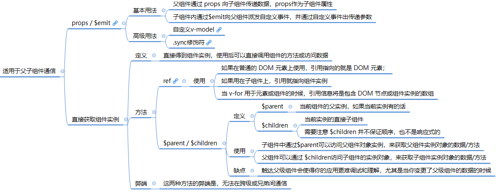
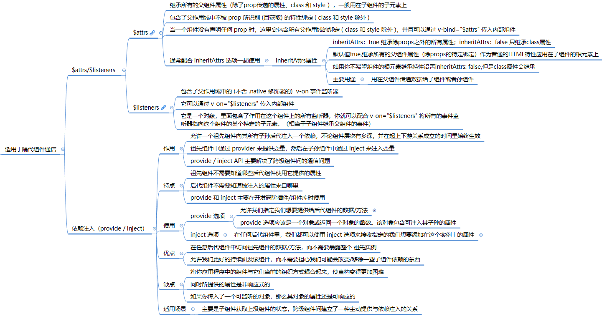

# 组件

## [组件基础](https://cn.vuejs.org/v2/guide/components.html)


## 组件注册

* 组件注册有两种方式
  * 全局注册：使用 [Vue.component( id, [definition] )](https://cn.vuejs.org/v2/api/#Vue-component)
  * 局部注册

**全局注册**

* 原理：将全局注册的组件扩展到 `Vue.options` 中，在所有组件创建的过程中，都会从全局的 `Vue.options.components` 扩展到当前组件的 `vm.$options.components` 下。

* 要注册一个全局组件，可以使用 `Vue.component(tagName, options)`。例如：

  ```js
  Vue.component('my-component', {
    // 选项
  })
  ```

* `Vue.component` 函数： 定义过程发生在最开始初始化 Vue 的全局函数的时候： `import Vue from vue` 引入 vue -> `initGlobalAPI`在 Vue 上扩展的一些全局方法的定义 -> `initAssetRegisters` 注册全局 api

  * `initAssetRegisters`代码在 `src/core/global-api/assets.js` 中：

    ```javascript
    export function initAssetRegisters (Vue: GlobalAPI) {
      /**
       * Create asset registration methods.
       */
      ASSET_TYPES.forEach(type => {
        //遍历 ASSET_TYPES，得到 type 后挂载到 Vue 上
        Vue[type] = function ( 
          id: string,
          definition: Function | Object
        ): Function | Object | void {
          if (!definition) {
            return this.options[type + 's'][id]
          } else {
            /* istanbul ignore if */
            if (process.env.NODE_ENV !== 'production') {
              if (type === 'component' && config.isReservedTag(id)) {
                warn(
                  'Do not use built-in or reserved HTML elements as component ' +
                  'id: ' + id
                )
              }
            }
    
            if (type === 'component' && isPlainObject(definition)) {
              definition.name = definition.name || id
              //把组件转换成一个继承于 Vue 的构造函数
              definition = this.options._base.extend(definition) 
            }
            if (type === 'directive' && typeof definition === 'function') {
              definition = { bind: definition, update: definition }
            }
            //挂载到 Vue.options
            this.options[type + 's'][id] = definition 
            return definition
          }
        }
      })
    }
    ```

* 全局组件执行过程：在创建 `vnode` 的过程中 `init()` -> `render()` -> `update()` ->  `_createElement()`  创建Vnode -> `resolveAsset()` 解析全局组件 -> `createComponent()` 创建组件

  * `_createElement` 方法中 调用 `resolveAsset()` 解析全局组件：

    ```javascript
    export function _createElement (
      context: Component,
      tag?: string | Class<Component> | Function | Object,
      data?: VNodeData,
      children?: any,
      normalizationType?: number
    ): VNode | Array<VNode> {
      // ...
      let vnode, ns
      if (typeof tag === 'string') {
        let Ctor
        ns = (context.$vnode && context.$vnode.ns) || config.getTagNamespace(tag)
        if (config.isReservedTag(tag)) {
          // platform built-in elements
          vnode = new VNode(
            config.parsePlatformTagName(tag), data, children,
            undefined, undefined, context
          )//调用 `resolveAsset()` 解析全局组件
        } else if (isDef(Ctor = resolveAsset(context.$options, 'components', tag))) {
          // component
          vnode = createComponent(Ctor, data, context, children, tag)
        } else {
          // unknown or unlisted namespaced elements
          // check at runtime because it may get assigned a namespace when its
          // parent normalizes children
          vnode = new VNode(
            tag, data, children,
            undefined, undefined, context
          )
        }
      } else {
        // direct component options / constructor
        vnode = createComponent(tag, data, context, children)
      }
      // ...
    }
    ```

  * `resolveAsset` 解析全局组件，定义在 `src/core/utils/options.js` 中：

    ```javascript
    /**
     * Resolve an asset.
     * This function is used because child instances need access
     * to assets defined in its ancestor chain.
     * 先通过 const assets = options[type] 拿到 assets，然后再尝试拿 assets[id]，
     * 这里有个顺序，先直接使用 id 拿，如果不存在，则把 id 变成驼峰的形式再拿，
     * 如果仍然不存在则在驼峰的基础上把首字母再变成大写的形式再拿，如果仍然拿不到则报错。
     * 这样说明了我们在使用 Vue.component(id, definition) 全局注册组件的时候，
     * id 可以是连字符、驼峰或首字母大写的形式
     */
    export function resolveAsset (
      options: Object,
      type: string,
      id: string,
      warnMissing?: boolean
    ): any {
      /* istanbul ignore if */
      if (typeof id !== 'string') {
        return
      }
      /*分别用id本身、驼峰以及大写开头驼峰寻找是否存在，存在则返回，不存在则打印*/
      const assets = options[type]
      // check local registration variations first
      if (hasOwn(assets, id)) return assets[id]
      /*转化为驼峰命名*/
      const camelizedId = camelize(id)
      if (hasOwn(assets, camelizedId)) return assets[camelizedId]
      /*驼峰首字母大写*/
      const PascalCaseId = capitalize(camelizedId)
      if (hasOwn(assets, PascalCaseId)) return assets[PascalCaseId]
      // fallback to prototype chain
      //在原型链中查找
      const res = assets[id] || assets[camelizedId] || assets[PascalCaseId]
      if (process.env.NODE_ENV !== 'production' && warnMissing && !res) {
        warn(
          'Failed to resolve ' + type.slice(0, -1) + ': ' + id,
          options
        )
      }
      return res
    }
    ```

    * 通过 `resolveAsset` 解析结果作为 ` createComponent` 参数创建组件。


**局部注册**

* 原理： 局部注册组件扩展到当前组件的 `vm.$options.components` 下，只有当前组件可以访问。

* 注册方法：在一个组件内部使用 `components` 选项做组件的局部注册，例如：

  ```js
  import HelloWorld from './components/HelloWorld'
  
  export default {
    components: {
      HelloWorld
    }
  }
  ```

* 过程：在组件的 Vue 的实例化阶段有一个合并 `option` 的逻辑，就把 `components` 合并到当前组件的 `vm.$options.components` 上，这样我们就可以在 `resolveAsset` 的时候拿到这个组件的构造函数，并作为 `createComponent` 的钩子的参数。


## 组件生命周期

* **流程分析**

  * 整体执行顺序:

  

  * 加载渲染过程: 父 beforeCreate -> 父 created -> 父 beforeMount -> 子 beforeCreate -> 子 created -> 子 beforeMount -> 子 mounted -> 父 mounted
  * 组件更新过程:  父 beforeUpdate -> 子 beforeUpdate -> 子 updated -> 父 updated
  * 销毁过程: 父 beforeDestroy -> 子 beforeDestroy -> 子 destroyed -> 父 destroyed

* 父组件监听到子组件的生命周期方法

  * 方法1： 在父组件引用子组件时通过 @hook 来监听

    ```javascript
    // 父组件 Parent.vue
    <Child @hook:mounted="doSomething" ></Child>
    doSomething() {
       console.log('父组件监听到 mounted 钩子函数 ...');
    },
    			
    //子组件  Child.vue
    mounted(){
       console.log('子组件触发 mounted 钩子函数 ...');
    },  
    
    //输出顺序
    // 子组件触发 mounted 钩子函数 ...
    // 父组件监听到 mounted 钩子函数 ...  
    ```

  * 方法2: 父组件监听到子组件生命周期事件，子组件生命周期内emit事件

    ```javascript
    // 父组件Parent.vue
    <Child @mounted="doSomething"/>
    			
    // 子组件Child.vue
    mounted() {
      this.$emit("mounted");
    }
    ```

    

* 常见问题:

  * > 在哪个生命周期内调用异步请求？

    在created、beforeMount、mounted中data 已经创建，可以将服务端端返回的数据进行赋值

  * > 在什么阶段才能访问操作DOM？

    		在钩子函数 mounted 被调用前，Vue 已经将编译好的模板挂载到页面上，所以在 mounted 中可以访问操作 DOM

  * > 为什么beforeMount先父组件后子组件执行而mount先子组件父后组件执行？

    在组件挂载过程中调用mountComponent()，mountComponent中立即调用breforeMount钩子，后调用mount钩子；

    在组件的 VNode patch 到 DOM 后，会执行 invokeInsertHook 函数，把 insertedVnodeQueue（在执行createElm函数中如果发现子组件包含insert方法，则将子组件添加到insertedVnodeQueue中；在createComponent中所有子组件path完毕以后执行initComponent,在initComponent中把子组件添加到insertedVnodeQueue） 里保存的钩子函数依次执行一遍，该函数会执行 insert 这个钩子函数，每个子组件都是在这个钩子函数中执行 mounted 钩子函数，insertedVnodeQueue 的添加顺序是先子后父，所以对于同步渲染的子组件而言，mounted 钩子函数的执行顺序也是先子后父 


## 组件分类

* 按组件定义分类：
  * 内置的组件： `keep-alive`、`component`、`transition`、`transition-group` 等；
  * 用户自定义组件：在使用前必须注册。

* 按逻辑分类
  * 异步组件
  * 动态组件： [`<component />`](https://v2.cn.vuejs.org/v2/api/#component)
  * 递归组件
* 按功能分类
  * 视图组件
  * 逻辑组件

### [异步组件](https://cn.vuejs.org/v2/guide/components-dynamic-async.html)


#### 异步组件注册方式

* 全局注册

  * 使用工厂函数组件创建

    ```javascript
    Vue.component('async-webpack-example', function (resolve) {
      // 这个特殊的 `require` 语法将会告诉 webpack
      // 自动将你的构建代码切割成多个包，这些包
      // 会通过 Ajax 请求加载
      require(['./my-async-component'], resolve)
    })
    ```

    

  * 使用 Promise 创建

    ```javascript
    Vue.component(
      'async-webpack-example',
      // 这个动态导入会返回一个 `Promise` 对象。
      () => import('./my-async-component')
    )
    ```

    

  * 高级异步组件

    ```javascript
    const AsyncComponent = () => ({
      // 需要加载的组件 (应该是一个 `Promise` 对象)
      component: import('./MyComponent.vue'),
      // 异步组件加载时使用的组件
      loading: LoadingComponent,
      // 加载失败时使用的组件
      error: ErrorComponent,
      // 展示加载时组件的延时时间。默认值是 200 (毫秒)
      delay: 200,
      // 如果提供了超时时间且组件加载也超时了，
      // 则使用加载失败时使用的组件。默认值是：`Infinity`
      timeout: 3000
    })
    ```

    

* 局部注册

  * 使用 `Promise` 创建

    ```javascript
    new Vue({
      // ...
      components: {
        'my-component': () => import('./my-async-component')
      }
    })
    ```

#### **源码分析**

* 原理：异步组件实现的本质是 2 次渲染

  * 第一次渲染生成一个注释节点；
  * 当异步获取组件成功后，再通过 `forceRender` 强制重新渲染，这样就能正确渲染出我们异步加载的组件了；

* 0 delay 的高级异步组件第一次直接渲染成 loading 组件，只有一次渲染。

* 异步组件创建时机：

  * 在组件创建一节中提到，组件创建时两个过程：

    * 第一次：render 方法调用的 _createElement() 方法中的 createComponent() 的实现，此处主要创建组件的占位符节点；
    * 第二次：path 方法调用 createElem() 方法中： 调用 createComponent() 的实现，此处递归创建组件组件实例，通过 new Vue() 创建组件；

  * 异步组件创建时机是在第一次 render 方法中调用 createComponents() 中 `resolveAsyncComponent` 时创建：

    ```javascript
    export function createComponent (
      Ctor: Class<Component> | Function | Object | void,
      data: ?VNodeData,
      context: Component,
      children: ?Array<VNode>,
      tag?: string
    ): VNode | Array<VNode> | void {
      if (isUndef(Ctor)) {
        return
      }
    
      const baseCtor = context.$options._base
    
      // plain options object: turn it into a constructor
      if (isObject(Ctor)) { // 异步组件中传入的 Ctor 为函数，因此此处逻辑跳过
        Ctor = baseCtor.extend(Ctor)
      }
      
      // ...
    
      // async component
      let asyncFactory
      if (isUndef(Ctor.cid)) { //异步组件未定义 cid
        asyncFactory = Ctor
        Ctor = resolveAsyncComponent(asyncFactory, baseCtor, context) //解析异步组件
        if (Ctor === undefined) {
          // return a placeholder node for async component, which is rendered
          // as a comment node but preserves all the raw information for the node.
          // the information will be used for async server-rendering and hydration.
          // 创建异步组件的占位符 VNode 
          return createAsyncPlaceholder(
            asyncFactory,
            data,
            context,
            children,
            tag
          )
        }
      }
    }
    ```

    * 通过 `resolveAsyncComponent` 函数解析后返回 VNode 占位符节点。

  * `resolveAsyncComponent` 函数：

    * 加载异步组件，处理三种类型的异步组件，当组件加载完成后根据加载状态进行处理。
    * 加载成功时调用 `forceRender` 强制重新渲染组件。函数定义在 [src/core/vdom/helpers/resolve-async-component.js](https://github.com/vuejs/vue/blob/v2.3.0/https://github.com/vuejs/vue/blob/v2.3.0/)

    ```javascript
    /**
     * resolveAsyncComponent处理 3 种异步组件的创建方式：
     * 1.工厂函数方式；
     * 2.Promise 创建组件；
     * 3.高级异步组件
     * @param {*} factory 
     * @param {*} baseCtor 
     * @param {*} context 
     */
    export function resolveAsyncComponent(
      factory: Function,
      baseCtor: Class<Component>,
      context: Component
    ): Class<Component> | void {
      /*配置错误选项工厂返回出错组件*/
      if (isTrue(factory.error) && isDef(factory.errorComp)) {
        return factory.errorComp
      }
    
      /*resoved时候返回resolved组件*/
      if (isDef(factory.resolved)) {
        return factory.resolved
      }
    
      /*如果异步组件加载中并未返回，这时候会走到这个逻辑，执行 loading 组件*/
      if (isTrue(factory.loading) && isDef(factory.loadingComp)) {
        return factory.loadingComp //返回 factory.loadingComp，渲染 loading 组件
      }
      /**多个地方同时初始化一个异步组件，那么它的实际加载应该只有一次 */
      if (isDef(factory.contexts)) {
        // already pending
        factory.contexts.push(context)
      } else {
        const contexts = factory.contexts = [context]
        let sync = true
    	// forceRender 函数定义
        const forceRender = () => { 
          //遍历调用每一异步组件的forceUpadate方法
          for (let i = 0, l = contexts.length; i < l; i++) {
            /**
             * 强制触发组件渲染，之所以这么做是因为 Vue 通常是数据驱动视图重新渲染，
             * 但是在整个异步组件加载过程中是没有数据发生变化的，所以通过执行 $forceUpdate 可以强制组件重新渲染一次
             */
            contexts[i].$forceUpdate() //定义在 src/core/instance/lifecycle.js 中
          }
        }
        //resolve函数定义： 异步组件加载成功时候执行，利用闭包和一个标志位保证了它包装的函数只会执行一次
        const resolve = once((res: Object | Class<Component>) => {
          // cache resolved
          //把加载结果缓存到 factory.resolved
          factory.resolved = ensureCtor(res, baseCtor)
          // invoke callbacks only if this is not a synchronous resolve
          // (async resolves are shimmed as synchronous during SSR)
          if (!sync) { //异步加载组件成功后sync设置为false
            forceRender()
          }
        })
        //reject 方法方法定义：once 包装 reject 方法，异步组件加载失败时执行，加载失败和加载超时时执行
        const reject = once(reason => {
          process.env.NODE_ENV !== 'production' && warn(
            `Failed to resolve async component: ${String(factory)}` +
            (reason ? `\nReason: ${reason}` : '')
          )
          if (isDef(factory.errorComp)) {//定义了加载错误组件，则强制渲染
            factory.error = true //设置错误标记为true，显示加载错误组件
            forceRender()
          }
        })
        /*
        开始加载组件: 执行传入组件的工厂函数，同时把 resolve 和 reject 函数作为参数传入，组件的工厂函数通常会先发送请求去加载我们的异步组件的 JS 文件，拿到组件定义的对象 res 后，执行 resolve(res) 逻辑
         */
        const res = factory(resolve, reject)
    
        if (isObject(res)) {
          /*使用Promise 异步组件,执行完 res = factory(resolve, reject)，返回的值就是 import('./my-async-component') 的返回值，它是一个 Promise 对象
          */
          if (typeof res.then === 'function') {
            // () => Promise
            if (isUndef(factory.resolved)) {
              res.then(resolve, reject)
            }////高级异步组件执行逻辑
          } else if (isDef(res.component) && typeof res.component.then === 'function') { 
            res.component.then(resolve, reject)
            /**判断 res.error 是否定义了 error 组件，如果有的话则赋值给 factory.errorComp */
            if (isDef(res.error)) {
              factory.errorComp = ensureCtor(res.error, baseCtor)
            }
    
            if (isDef(res.loading)) { //判断组件中是否定义Loading组件
              factory.loadingComp = ensureCtor(res.loading, baseCtor)
              if (res.delay === 0) { //没有定义延时
                factory.loading = true
              } else {
                setTimeout(() => { //延时执行
                  if (isUndef(factory.resolved) && isUndef(factory.error)) {
                    factory.loading = true
                    forceRender()
                  }
                }, res.delay || 200)
              }
            }
    
            if (isDef(res.timeout)) { //如果定义了timeout，并在指定时间内没有加载成功，执行reject
              setTimeout(() => {
                reject(
                  process.env.NODE_ENV !== 'production'
                    ? `timeout (${res.timeout}ms)`
                    : null
                )
              }, res.timeout)
            }
          }
        }
    
        sync = false
        // return in case resolved synchronously
        return factory.loading
          ? factory.loadingComp
          : factory.resolved
      }
    }
    
    /**
     * 函数目的是为了保证能找到异步组件 JS 定义的组件对象，并且如果它是一个普通对象，
     * 则调用 Vue.extend 把它转换成一个组件的构造函数
     * @param {*} comp 
     * @param {*} base 
     */
    function ensureCtor(comp, base) {
      return isObject(comp)
        ? base.extend(comp)
        : comp
    }
    ```


### 递归组件

#### 概念

* 递归组件是指在**组件定义中使用组件自身**的情况。
* 换句话说，一个组件的模板中包含对自身的使用。
* 递归组件通常通过**使用组件的名称来实现递归**，这使得组件能够在自身内部进行嵌套。

#### 原理

1. 通过在组件定义中使用组件的名称来实现递归。
2. 当组件渲染时，它会检测到自身的引用，并继续递归地渲染嵌套的组件，直到达到终止条件。
3. 这个过程会一直进行下去，直到渲染完整个组件树。
4. 为了避免无限递归导致的堆栈溢出错误，通常需要在递归组件中设置终止条件。终止条件是一个条件判断，当满足条件时，停止递归并返回一个基本的组件或占位符。

#### 用途

* **树形结构**：递归组件非常适合用于展示树形结构的数据，例如评论列表、目录结构等。使用递归组件可以方便地处理不同层级的数据，并以递归的方式构建嵌套的组件结构。

* **动态组件**：递归组件可以根据数据的层级动态地渲染组件。这使得在不同层级上使用不同的组件成为可能，从而使应用程序更加灵活和可扩展。

* 可伸缩性：递归组件的使用可以有效地处理未知层级的数据。无论数据有多少层级，递归组件都可以自我调用并渲染嵌套的组件，因此具有很强的可伸缩性。

#### 示例

```js
<template>
  <div>
    <span>{{ node.name }}</span>
    <ul>
      <li v-for="childNode in node.children" :key="childNode.id">
        <!-- 递归调用自身 -->
        <recursive-component :node="childNode" />
      </li>
    </ul>
  </div>
</template>

<script>
export default {
  name: 'RecursiveComponent',
  props: {
    node: {
      type: Object,
      required: true
    }
  }
}
</script>
```

> * `RecursiveComponent` 是一个递归组件。它接受一个名为 `node` 的 prop，该 prop 包含了节点的数据。
> * 在模板中，它通过递归地渲染 `RecursiveComponent` 组件来处理每个子节点，并以树形结构展示节点数据。
>
> * 请注意，在递归组件中，需要确保递归调用处的组件名称与当前组件的名称一致，以实现递归的效果。


#### 实现一个动态递归组件

**思路**

* 动态组件是通过 Vue2 内置组件 `<component />` 实现，通过该标签可以实现渲染任意自定义组件；
* 递归组件是通过引用组件名称，递归组件自身实现:
  * 通过传入参数，判断是否有子节点，有子节点，递归调用自身渲染。

以下通过内置组件 `<component />`  和递归组件实现一个 `BasicComponent` 组件：

```js
<template>
  <div v-if="options.comp">
    <component
      :is="typeof options.comp === 'string' ? options.comp : `${options.comp}`"
      :ref="options.ref"
      v-model="options.data"
      v-bind="options.attr"
      v-on="options.listeners || {}"
    >
      <div v-if="options.children && options.children.length !== 0">
        <BasicComponent
          v-for="(chilOpt, index) of options.children"
          :key="index"
          :options="chilOpt"
        />
      </div>
      <template v-if="options.content">
        {{ options.content }}
      </template>
    </component>
  </div>
</template>

<script>
import BasicComponent from '@/components/BasicComponent/index.vue'
export default {
  name: 'BasicComponent',
  component: {
    BasicComponent
  },
  props: {
    options: {
      type: [Object, String],
      default: function() {
        return {
          comp: null, // 组件标签
          ref: null, // 组件引用对象
          data: null, // 组件数据
          attr: null, // 组件属性
          listeners: null, // 组件监听事件
          content: null, // 组件内容
          children: [
            {
              comp: null, // 组件标签
              ref: null, // 组件引用对象
              data: null, // 组件数据
              attr: null, // 组件属性
              listeners: null, // 组件监听事件
              children: []
            }
          ]
        }
      }
    }
  },
  data() {
    return {}
  },
  created() {},
  mounted() {},
  methods: {}
}
</script>

```

> * 该组件接收一个 `options` 选项：
>   * 该选项为组件配置对象，通过该配置对象渲染递归组件。

## 组件通信

* 组件通信方式分类

  

  

  

### **$attrs 和 $listeners 通信**

* [vm.$attrs](https://cn.vuejs.org/v2/api/#vm-attrs): 继承所有的父组件属性（除了prop传递的属性、class 和 style ）， 一般用在子组件的子元素上，如第一个例子的 `<input v-bind="$attrs"/>`

* [vm.$listeners](https://cn.vuejs.org/v2/api/#vm-listeners): 属性，它是一个对象，里面包含了作用在这个组件上的所有监听器，你就可以配合` v-on="$listeners" `将所有的事件监听器指向这个组件的某个特定的子元素。（相当于子组件继承父组件的事件）
* [查看示例](https://gitee.com/jokerxw/myNotes/blob/master/vue/vue%E6%A0%B8%E5%BF%83/%E7%BB%84%E4%BB%B6%E9%80%9A%E4%BF%A1/$attrs%E5%92%8C$listeners.vue)

### **props/$emit通信**

* 父组件通过props传递数据给子组件事件并通过监听子组件事件获取子组件数据
* 子组件通过props接受父组件数据并通过$emit()触发事件并传入数据给父组件
* [查看示例](https://gitee.com/jokerxw/myNotes/blob/master/vue/vue%E6%A0%B8%E5%BF%83/%E7%BB%84%E4%BB%B6%E9%80%9A%E4%BF%A1/props%E5%92%8C$emit.vue)

### **$emit/$on通信**

* 这种方法通过一个空的Vue实例作为中央事件总线（事件中心），用它来触发事件和监听事件,巧妙而轻量地实现了任何组件间的通信
* 包括父子、兄弟、跨级
* 具体实现方式：
  *   1.创建一个空的vue实例：var Event=new Vue()
  *   2.在发送数据实例中使用：Event.$emit(事件名,数据) 发送数据
  *   3.接受数据实例中使用：Event.$on(事件名,data => {}) 接数据
* [查看示例](https://gitee.com/jokerxw/myNotes/blob/master/vue/vue%E6%A0%B8%E5%BF%83/%E7%BB%84%E4%BB%B6%E9%80%9A%E4%BF%A1/$emit%E5%92%8C$on.vue)

### **[provide / inject](https://cn.vuejs.org/v2/api/#provide-inject)通信**

* [查看示例](https://gitee.com/jokerxw/myNotes/blob/master/vue/vue%E6%A0%B8%E5%BF%83/%E7%BB%84%E4%BB%B6%E9%80%9A%E4%BF%A1/provide%E5%92%8Cinject.js)

### **EventBus**

* `EventBus` 又称为事件总线。创建一个事件中心，相当于中转站，可以用它来传递事件和接收事 件。
* 本质是通过创建一个空的 Vue 实例来作为消息传递的 对象，通信的组件引入这个实例，通信的组件通过在这个实例上监听和触发事件，来实现消息的传递。
* 如果业务逻辑复杂，很多组件之间需要同时处理一些公共的数据，这个时候采用上面这一些方法 可能不利于项目的维护，因此才需要更完善的 Vuex 作为状态管理中心，将通知的概念上升到共享状态层次。
* 参考资料：
  * [Vue事件总线（EventBus）使用详细介绍](https://zhuanlan.zhihu.com/p/72777951)


按照父子组件通信、兄弟组件通信和隔代组件通信的分类：

### 父子组件通信

|        通信方式        |                             说明                             |
| :--------------------: | :----------------------------------------------------------: |
|       **Props**        | 父组件通过props向子组件传递数据。子组件在模板中通过声明props选项来接收父组件传递的数据。 |
|     **自定义事件**     | 子组件通过`this.$emit('eventName', payload)`触发自定义事件，父组件在模板中监听这些事件，并执行相应的处理函数。 |
|   **插槽（Slots）**    | 父组件可以在模板中定义插槽，并在插槽中插入HTML内容，子组件则可以在其模板中引用这些插槽，实现内容的分发。 |
| **attrs 和 listeners** | `attrs`用于传递父组件中未被识别为props的attributes，`listeners`用于传递父组件中的事件监听器，可以通过`v-bind="$attrs"`和`v-on="$listeners"`传递给子组件。 |

### 兄弟组件通信

|         通信方式          |                             说明                             |
| :-----------------------: | :----------------------------------------------------------: |
| **事件总线（Event Bus）** | 创建一个新的Vue实例作为事件中心，兄弟组件通过`$emit`触发事件，并通过`$on`监听事件，实现组件间的通信。 |
|         **Vuex**          | Vuex适用于大型应用，它采用集中式存储管理应用的状态，并通过actions、mutations和getters等机制实现兄弟组件间的状态共享和通信。 |
|       **状态提升**        | 通过将兄弟组件之间状态提升到公共父组件中，通过公共父组件之间通信 |

### 隔代组件通信

|       通信方式       |                             说明                             |
| :------------------: | :----------------------------------------------------------: |
| **Provide / Inject** | 允许祖先组件向其所有子孙组件提供一个依赖，不论组件层次有多深，该依赖都可以注入进来。这在隔代组件通信时非常有用。 |
|       **Vuex**       | Vuex同样适用于隔代组件通信，因为它管理的是全局状态，任何组件都可以访问和修改状态，实现跨组件的数据共享和通信。 |

需要注意的是，虽然Vuex通常用于大型应用中的状态管理，但它也可以用于兄弟组件和隔代组件间的通信。然而，对于简单的应用或简单的通信需求，可能不需要引入Vuex，而可以使用其他更轻量级的通信方式。

在选择通信方式时，应根据具体的应用场景和需求进行权衡和选择。


## 扩展组件方式

扩展 Vue 组件最流行的方法有以下四种：

- [Composition API](https://vue3js.cn/docs/zh/guide/composition-api-introduction.html#%E4%BB%80%E4%B9%88%E6%98%AF%E7%BB%84%E5%90%88%E5%BC%8F-api)
- [mixin](https://vuejsdevelopers.com/2017/06/11/vue-js-extending-components/#mixins)
- [高阶组件（HOC）](https://vuejsdevelopers.com/2017/06/11/vue-js-extending-components/#higher-order-components)
- [无渲染组件](https://vuejsdevelopers.com/2017/06/11/vue-js-extending-components/#renderless-components)

## 高阶组件

### 概念

高阶组件（Higher-Order Component，HOC）是一种在React中用于组件复用和逻辑共享的模式。

它本质上是一个函数，接收一个组件作为参数，并返回一个新的组件。

在 Vue 的世界里，组件是一个对象，所以高阶组件就是一个函数接受一个对象，返回一个新的包装好的对象。Vue 中，高阶组件就是 `f(object) -> 新的object`。

### 特点

HOC具有以下作用和特点：

1. **组件复用：** HOC可以将通用的功能逻辑封装在一个函数中，并应用于多个组件。通过将公共逻辑提取到HOC中，可以避免在多个组件中重复编写相同的代码，提高了代码的复用性。
2. **逻辑共享：** HOC允许你在组件之间共享逻辑，例如状态管理、数据获取、认证等。你可以通过HOC将这些逻辑从组件中分离出来，并在需要的地方应用它们，以实现逻辑的共享和解耦。
3. **属性代理和增强：** HOC可以通过属性代理的方式，将额外的属性和功能注入到被包裹的组件中。这使得你可以修改、增强或覆盖被包裹组件的行为，以满足特定的需求。例如，你可以通过HOC向组件注入路由信息、国际化功能或其他上下文信息。
4. **抽象和组合：** HOC可以将组件的实现细节进行抽象，提供一个更高层次的接口。通过将不相关的实现细节封装到HOC中，你可以更专注于组件的业务逻辑，并实现组件的组合。这样，你可以构建出更复杂和可扩展的组件树。

需要注意的是，HOC本身并不是React的特性或API，而是一种基于React组合特性的设计模式。它可以用来解决一些常见的代码共享和复用问题，但在使用HOC时需要谨慎，避免滥用。滥用HOC可能导致组件关系复杂化、调试困难等问题。在使用HOC时，建议遵循一些最佳实践，如清晰的命名、避免命名冲突、遵循传递不变性等规则。


### 规则

* 高阶组件(`HOC`)应该是无副作用的纯函数，且不应该修改原组件；
  * 高阶组件纯函数，它接收一个组件作为参数并返回了一个新的组件，在新组件的 `render` 函数中仅仅渲染了被包装的组件，并没有侵入式的修改它。
* 高阶组件(`HOC`)不关心你传递的数据(`props`)是什么，并且被包装组件不关心数据来源；
* 高阶组件(`HOC`)接收到的 `props` 应该透传给被包装组件：高阶组件完全可以添加、删除、修改 `props`，但是除此之外，要将其余 `props` 透传，否则在层级较深的嵌套关系中(`这是高阶组件的常见问题`)将造成 `props` 阻塞。

### 实现

* 高阶组件：用于封装组件的公共逻辑组件，给所有被封装的组件添加初始化 console 打印方法。

  

* 测试：

  * 编写被包裹的组件：被封装的组件 `BaseCompoent`。

    

  * 使用方式： 使用高阶组件包裹基础组件 `BaseComponent` 生成一个新的组。

    

  * 测试结果：

**参考资料**

[探索Vue高阶组件](http://hcysun.me/2018/01/05/%E6%8E%A2%E7%B4%A2Vue%E9%AB%98%E9%98%B6%E7%BB%84%E4%BB%B6/)

## 内置组件

### [`<keep-alive>`](https://cn.vuejs.org/v2/api/#keep-alive)


* keep-alive 组件： 是一个抽象组件，它自身不会渲染一个 DOM 元素，也不会出现在组件的父组件链中

* 作用：

  * 主要用于保留组件状态或避免重新渲染，组件实例能够被在它们第一次被创建的时候缓存下来
  * 当组件在 `<keep-alive>` 内被切换，它的 `activated` 和 `deactivated` 这两个生命周期钩子函数将会被对应执行

* 缓存对象：

  * 缓存子组件的 `vnode` 对象

* Props：

  - `include` - 字符串或正则表达式。只有名称匹配的组件会被缓存。
  - `exclude` - 字符串或正则表达式。任何名称匹配的组件都不会被缓存。
  - `max` - 数字。定义缓存组件上限，超出上限使用[LRU的策略](https://baike.baidu.com/item/LRU)置换缓存数据

* 应用场景:

  * 用户在某个列表页面选择筛选条件过滤出一份数据列表，由列表页面进入数据详情页面，再返回该列表页面，我们希望：列表页面可以保留用户的筛选（或选中）状态
  * 避免组件反复创建和渲染，有效提升系统性能

* 注意：

  * `<keep-alive> `只处理第一个子元素，所以一般和它搭配使用的有 component 动态组件或者是 router-view
  * 被 `<keep-alive>` 包裹的组件在有缓存的时候就不会在执行组件的 `created`、`mounted` 等钩子函数
  * activated 和 deactivated 钩子将会在` <keep-alive> `树内的所有嵌套组件中触发

* 用法：

  * [动态组件中使用](https://cn.vuejs.org/v2/guide/components-dynamic-async.html#%E5%9C%A8%E5%8A%A8%E6%80%81%E7%BB%84%E4%BB%B6%E4%B8%8A%E4%BD%BF%E7%94%A8-keep-alive)

    * ```vue
      <keep-alive :include="whiteList" :exclude="blackList" :max="amount">
        <component :is="currentComponent"></component>
      </keep-alive>
      ```

  * 在vue-router中的应用

    * 在需要缓存的组件中的路由配置中 meta 自定义字段 keepAlive 配置为 true
    * 
    * 在路由组件中添加 keep-alive 组件，通过 this.$route.meta.keepAlive 获取当前路由中 meta 的 keepAlive 字段,通过该字段判断页面是否需要缓存
    * 

* 源码分析

  * [源码](https://github.com/vuejs/vue/blob/dev/src/core/components/keep-alive.js)

  * [源码分析](http://caibaojian.com/vue-analysis/extend/keep-alive.html#%E5%86%85%E7%BD%AE%E7%BB%84%E4%BB%B6)

  * ```js
    export default {
      name: 'keep-alive,
      abstract: true,
    
      props: {
        include: patternTypes,
        exclude: patternTypes,
        max: [String, Number]
      },
    
      created () {
        this.cache = Object.create(null)
        this.keys = []
      },
    
      destroyed () {
        for (const key in this.cache) {
          pruneCacheEntry(this.cache, key, this.keys) //删除缓存
        }
      },
    
      mounted () { 
     //观测 include 和 exclude 变化，当有新的组件名称加入这两个数组，则通过 pruneCache() 遍历所有缓存组件，查找缓存组件中是否包含新增加到这两个数组的组件，如果存在则在缓存剔除该组件
        this.$watch('include', val => {
         //新增组件不在 include 中，从缓存中剔除新增组件
          pruneCache(this, name => matches(val, name))
        })
        this.$watch('exclude', val => {
        // 新增组件在 exclude 中，从缓存中剔除新增组件
          pruneCache(this, name => !matches(val, name))
        })
      },
    
      render () {
      //注意：<keep-alive> 是用在其一个直属的子组件被开关的情形，所以<keep-alive> 只处理第一个子元素
     //一般和它搭配使用的有 component 动态组件或者是 router-view
     //由于我们也是在 <keep-alive> 标签内部写 DOM，所以可以先获取到它的默认插槽，然后再获取到它的第一个子节点
        const slot = this.$slots.default // 获取组件内默认插槽
        const vnode: VNode = getFirstComponentChild(slot) //获取插槽第一个子节点
        const componentOptions: ?VNodeComponentOptions = vnode && vnode.componentOptions
        if (componentOptions) {
          // check pattern
          const name: ?string = getComponentName(componentOptions)
          const { include, exclude } = this
          //组件名如果配置了include 且不存在于 include 或者是配置了 exclude 且匹配，那么就直接返回这个组件的 vnode
          if (
            // not included
            (include && (!name || !matches(include, name))) ||
            // excluded
            (exclude && name && matches(exclude, name))
          ) {
            return vnode
          }
    
          const { cache, keys } = this
          const key: ?string = vnode.key == null
            // same constructor may get registered as different local components
            // so cid alone is not enough (#3269)
            ? componentOptions.Ctor.cid + (componentOptions.tag ? `::${componentOptions.tag}` : '')
            : vnode.key
          // 以下缓存使用 LRU 最近最久未使用算法
          if (cache[key]) { //命中缓存
            vnode.componentInstance = cache[key].componentInstance
            // make current key freshest
            //重新调整了 key 的顺序放在了最后一个
            remove(keys, key) 
            keys.push(key)
          } else { // 未命中缓存直接加入缓存
            cache[key] = vnode
            keys.push(key)
            // prune oldest entry
            //如果配置了 max 并且缓存的长度超过了 this.max，还要从缓存中删除第一个
            if (this.max && keys.length > parseInt(this.max)) {
              pruneCacheEntry(cache, keys[0], keys, this._vnode) //删除缓存
            }
          }
    
          vnode.data.keepAlive = true
        }
    		return vnode || (slot && slot[0])
      }
    }
    ```

* 缓存流程分析

  

* 相关问题

  * 缓存中缓存组件的什么数据？
    * 缓存中主要通过数组缓存子组件Vnode


### [`<transition>`](https://cn.vuejs.org/v2/api/#transition)

* `<transition>` 元素作为**单个**元素/组件的过渡效果。

* `<transition>` 是抽象组件：只会把过渡效果应用到其包裹的内容上，而不会额外渲染 DOM 元素，也不会出现在可被检查的组件层级中。

  * 不能在抽象组件中使用 `v-if` 和 `v-for` 指令：因为抽象组件不会渲染成 DOM 元素。
  * 内置抽象组件包括：`<keep-alive>`、`<transition>`

* `<transition>` 组件是只能包裹一个子节点。

* Vue 的过渡实现分为以下几个步骤：

  * 自动嗅探目标元素是否应用了 CSS 过渡或动画，如果是，在恰当的时机添加/删除 CSS 类名。
  * 如果过渡组件提供了 JavaScript 钩子函数，这些钩子函数将在恰当的时机被调用。
  * 如果没有找到 JavaScript 钩子并且也没有检测到 CSS 过渡/动画，DOM 操作 (插入/删除) 在下一帧中立即执行。

  所以真正执行动画的是我们写的 CSS 或者是 JavaScript 钩子函数，而 Vue 的 `<transition>` 只是帮我们很好地管理了这些 CSS 的添加/删除，以及钩子函数的执行时机。

* `<transition>` 的定义在 `src/platforms/web/runtime/component/transtion.js` 中，之所以在这里定义，是因为 `<transition>` 组件是 web 平台独有的：

  ```js
  export default {
    name: 'transition',
    props: transitionProps,
    abstract: true,
  
    render (h: Function) {
       //从默认插槽中获取 <transition> 包裹的子节点
      let children: any = this.$slots.default
      if (!children) {//子节点的长度，如果长度为 0，则直接返回
        return
      }
  
      // filter out text nodes (possible whitespaces)
      children = children.filter((c: VNode) => c.tag || isAsyncPlaceholder(c))
      /* istanbul ignore if */
      if (!children.length) {//子节点的长度，如果长度为 0，则直接返回
        return
      }
  
      // warn multiple elements
      //如果大于 1，也会在开发环境报警告，因为 <transition> 组件是只能包裹一个子节点的。
      if (process.env.NODE_ENV !== 'production' && children.length > 1) {
        warn(
          '<transition> can only be used on a single element. Use ' +
          '<transition-group> for lists.',
          this.$parent
        )
      }
  	
      const mode: string = this.mode
  
      // warn invalid mode
      //过渡组件的对 mode 的支持只有 2 种，in-out 或者是 out-in
      if (process.env.NODE_ENV !== 'production' &&
        mode && mode !== 'in-out' && mode !== 'out-in'
      ) {
        warn(
          'invalid <transition> mode: ' + mode,
          this.$parent
        )
      }
  	//rawChild 就是第一个子节点 vnode
      const rawChild: VNode = children[0]
  
      // if this is a component root node and the component's
      // parent container node also has transition, skip.
      //当前 <transition> 如果是组件根节点并且外面包裹该组件的容器也是 <transition> 的时候要跳过
      if (hasParentTransition(this.$vnode)) {
        return rawChild
      }
  
      // apply transition data to child
      // use getRealChild() to ignore abstract components e.g. keep-alive
      //getRealChild 的目的是获取组件的非抽象子节点，因为 <transition> 很可能会包裹一个 keep-alive
      //getRealChild 会递归找到第一个非抽象组件的 vnode 并返回  
      const child: ?VNode = getRealChild(rawChild)
      /* istanbul ignore if */
      if (!child) {
        return rawChild
      }
  
      if (this._leaving) {
        return placeholder(h, rawChild)
      }
  
      // ensure a key that is unique to the vnode type and to this transition
      // component instance. This key will be used to remove pending leaving nodes
      // during entering.
      const id: string = `__transition-${this._uid}-`
      child.key = child.key == null
        ? child.isComment
          ? id + 'comment'
          : id + child.tag
        : isPrimitive(child.key)
          ? (String(child.key).indexOf(id) === 0 ? child.key : id + child.key)
          : child.key
  	//从当前通过 extractTransitionData 组件实例上提取出过渡所需要的数据
      const data: Object = (child.data || (child.data = {})).transition = extractTransitionData(this)
      const oldRawChild: VNode = this._vnode
      const oldChild: VNode = getRealChild(oldRawChild)
  
      // mark v-show
      // so that the transition module can hand over the control to the directive
      if (child.data.directives && child.data.directives.some(d => d.name === 'show')) {
        child.data.show = true
      }
  
      if (
        oldChild &&
        oldChild.data &&
        !isSameChild(child, oldChild) &&
        !isAsyncPlaceholder(oldChild) &&
        // #6687 component root is a comment node
        !(oldChild.componentInstance && oldChild.componentInstance._vnode.isComment)
      ) {
        // replace old child transition data with fresh one
        // important for dynamic transitions!
        const oldData: Object = oldChild.data.transition = extend({}, data)
        // handle transition mode
        if (mode === 'out-in') {
          // return placeholder node and queue update when leave finishes
          this._leaving = true
          mergeVNodeHook(oldData, 'afterLeave', () => {
            this._leaving = false
            this.$forceUpdate()
          })
          return placeholder(h, rawChild)
        } else if (mode === 'in-out') {
          if (isAsyncPlaceholder(child)) {
            return oldRawChild
          }
          let delayedLeave
          const performLeave = () => { delayedLeave() }
          mergeVNodeHook(data, 'afterEnter', performLeave)
          mergeVNodeHook(data, 'enterCancelled', performLeave)
          mergeVNodeHook(oldData, 'delayLeave', leave => { delayedLeave = leave })
        }
      }
  
      return rawChild
    }
  }
  ```


