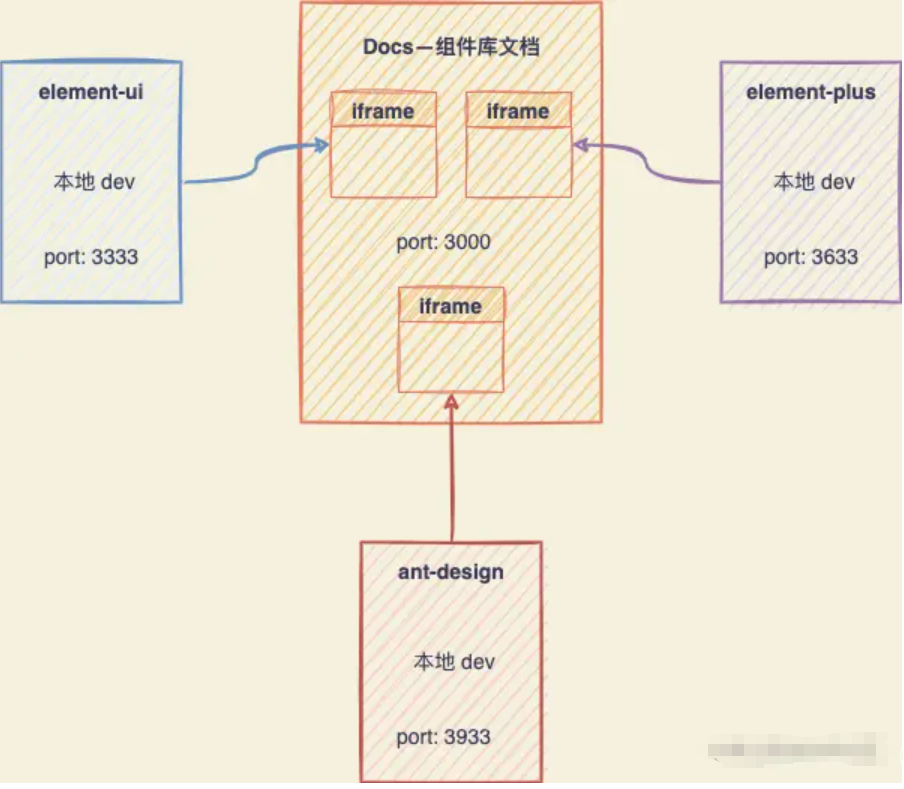

# **从零到一搭建公共组件库**

## **为什么要搭建公共组件库？**

### 公共组件是什么？

看 `ChatGPT` 给出的定义：

> 前端公共组件是指在前端开发过程中，经常会被多个页面或多个项目**复用的组件**。
>
> 这些组件通常具有一定的**独立性和通用性**，可以被封装成独立的模块，供多个页面或项目**共享使用**。
>
> 前端公共组件可以包括但不限于按钮、表单、导航栏、轮播图、模态框、消息提示等常见的UI组件，也可以包括一些业务逻辑相关的组件，如登录组件、购物车组件等。

Vue3 官方文档中对组件定义：[组件基础 | Vue.js (vuejs.org)](https://cn.vuejs.org/guide/essentials/component-basics.html)

> 组件允许我们将 UI 划分为独立的、可重用的部分，并且可以对每个部分进行单独的思考。在实际应用中，组件常常被组织成层层嵌套的树状结构：
>
> 

实际上，在实际前端开发过程中，当接到一个新页面需求时候，一般流程为：

1. **将页面进行组件分析**：分析页面中的模块，将页面拆分成一个个组件，分析复用部分，将复用部分封装成组件；
2. **接口拆分**：将页面拆成组件后，分析组件格式规范，并将接口拆分到不同组件。
3. **开发组件**：罗列所有拆分好的组件，分任务开发；
4. **组合页面**：将组件进行拼装组合形成页面。
5. **组件联调**：将拆分的组件组成一个页面之后，进行组件之间通信和交互联调；
6. **接口联调测试**：最后通过与后端联调测试页面。

### **开源组件库与系统关系**

在封装组件库系统之前，我们先来了解一下，目前开源的各大组件库和系统之前的关系，才能明白为什么要封装自己的组件库。

以 [`Element-Plus` 组件库](https://element-plus.org/zh-CN/component/button.html)为例：

> [`Element-Plus` 组件库](https://element-plus.org/zh-CN/component/button.html)官方文档中，将组件库分为：
>
> **Basic 基础组件**：
>
> * Button 按钮、Border 边框、Color 色彩、Container 布局容器、Icon 图标、Layout 布局、Link 链接、Text 文本、Scrollbar 滚动条、Space 间距、Typography 排版；
>
> **配置组件：**
>
> * Config Provider 全局配置；
>
> **Form 表单组件：**
>
> * Autocomplete 自动补全输入框、Cascader 级联选择器、Checkbox 多选框、Color Picker 取色器、Date Picker 日期选择器、DateTime Picker 日期时间选择器、Form 表单、Input 输入框、Input Number 数字输入框、Radio 单选框、Rate 评分、Select 选择器、Virtualized Select 虚拟化选择器、Slider 滑块、Switch 开关、Time Picker 时间选择器、Time Select 时间选择、Transfer 穿梭框、Upload 上传；
>
> **Data 数据展示：**
>
> * Avatar 头像、Badge 徽章、Calendar 日历、Card 卡片、Carousel 走马灯、Collapse 折叠面板、Descriptions 描述列表、Empty 空状态、Image 图片、Infinite Scroll 无限滚动、Pagination 分页、Progress 进度条、Result 结果、Skeleton 骨架屏、Table 表格、Virtualized Table 虚拟化表格、Tag 标签、Timeline 时间线、Tour 漫游式引导、Tree 树形控件、TreeSelect 树形选择、Virtualized Tree 虚拟化树形控件、Statistic 统计组件（2.2.30）；
>
> **Navigation 导航组件：**
>
> * Affix 固钉、Backtop 回到顶部、Breadcrumb 面包屑、Dropdown 下拉菜单、Menu 菜单、Page Header 页头、Steps 步骤条、Tabs 标签页；
>
> **Feedback 反馈组件**：
>
> * Alert 提示、Dialog 对话框、Drawer 抽屉、Loading 加载、Message 消息提示、Message Box 消息弹出框、Notification 通知、Popconfirm 气泡确认框、Popover 弹出框、Tooltip 文字提示；
>
> **Others 其他组件：**
>
> * Divider 分割线、Watermark 水印；

通过以上分类可以看到：Element-Plus 官方将组件库划分的组件粒度非常细，粒度细到按钮级别；Element-Plus 将组件粒度划分为那么细，个人认为是基于以下原因：

1. **可维护性和可复用性**：Element-Plus作为开源组件库，需要考虑各种应用的需求场景，因此将组件拆分成较小的粒度，每个组件都承担特定的功能，这使得组件更易于理解和维护。同时，小粒度的组件也更易于复用，可以在不同的场景和项目中重复使用，提高了组件的利用率。
2. **性能优化**：小粒度的组件通常意味着更小的体积和更快的加载速度。这有助于提升应用的性能。
3. **设计一致性**：通过将组件拆分成较小的粒度，可以更容易地保持设计的一致性。每个组件都有明确的接口和规范，这使得不同组件之间的交互和配合更加顺畅，有助于提升整体的用户体验。

然而，通常系统中，存在许多相同或相似的组件/模块，特别是在 to B 端项目或中台系统中，大量存在各种各样的From 表单组件、表格组件、搜索组件和弹窗表单组件等。这些组件变化灵活，但又属于一类组件，

以From表单组件为例：B端系统表单内容可以灵活多变，但是外部都是需要套用 element-plus 的 From 表单组件，有统一的提交事件和数据格式等；

> 示例表单A:
>
> 
>
> 示例表单B:
>
> 
>
> 表单A和表单B相同点：
>
> * 都是以弹窗的形式弹出让用户填写表单信息，都需要弹窗组件包裹，因此需要统一的弹窗操作事件：关闭，显示等；
> * 都存在统一的操作：确认和取消；
> * 都存在统一的表单组件和数据格式：都需要使用 From 表单组件包裹和返回统一的数据格式给后端；
>
> 表单A和表单B不相同点：
>
> * 表单项和数量不同；
> * 表单二存在提示组件；

以上两个简单的表单组件，假如使用 Element-Plus 开源标签组件模式开发：

* 第一步：两个组件都在最外层使用一个弹窗组件包裹，并添加对应事件逻辑：
* 第二步：添加From组件逻辑：所有 form 组件都需要组件标签，组件字段和组件事件代码。


* 第三步：添加两个操作按钮；
* 第四步：添加表单内容组件；

通过以上步骤可知：在B端系统中，同样是两个弹窗显示的表单组件，都需要重复以上四个步骤，并且以上四个步骤中第一第二步中都是一模一样的代码逻辑，如果采用单页面开发（一个表单一个页面）模式，重复开发弹窗和表单组件逻辑，随着表单数量增加，此类重复工作量将呈现量级增加！除此之外，项目可维护性也将非常差！一旦产品提出需要在所有弹窗中添加 标题或改动标题位置此类需求，需要找到所有弹窗组件进行修改。


### **为什么要搭建组件库？**

通过以上分析。为了减少开发工作量，提高项目的可维护性，我们需要将一些通用的组件代码封装在一起，减少开发工作量和提高项目的可维护性，并统一所有组件的样式风格。

**提高开发效率**

组件化开发将常用的功能或模块封装成独立的组件，开发者在开发过程中可以直接使用这些组件，而不需要从头开始编写代码。这样可以大大减少重复劳动，提高开发效率。

**降低维护成本**

由于组件是独立的，因此当某个组件出现问题时，只需要对该组件进行维护，而不需要对整个项目进行重新开发和测试。这大大降低了维护成本。

**统一风格和样式**

通过搭建前端组件库，可以制定统一的开发标准，包括组件的命名、接口、样式等，这样可以保证团队成员在开发过程中遵循相同的规范和标准，提高代码的可读性和可维护性。

**提高代码质量**

组件库中的组件都是经过严格测试和验证的，可以确保组件的质量和稳定性。同时，组件化开发也鼓励开发者编写高内聚、低耦合的代码，这有助于提高代码质量。

**促进团队协作**

通过搭建前端组件库，团队成员可以共享组件和资源，减少沟通成本和重复开发。同时，组件库也可以作为团队的技术积累和传承，方便新成员快速融入团队和开发工作。

### **为什么要搭建前端公共组件库？**

目前，通过搭建组件库的方式确实可以节省项目开发时间，然而，目前只是基于当前项目对组件进行二次封装。

* **每个项目独立维护组件库**：新增一个组件时，需要复制组件副本到其他项目并进行适配。


* **公共组件库**：维护统一的组件库，所有系统引用公共组件库。

  

这种模式存在以下问题：

1. **跨项目复用难**：在每个项目都搭建自己的公共组件库的方式，不仅耗费大量时间，并且项目之间的组件库也是相互独立，每次开发一个新系统，都需要搭建系统自己的组件库或者将有组件库系统的系统重新 copy 一份适配新的项目，这种方式极大浪费人力成本。

2. **缺乏文档管理**：除此之外，每个项目中的组件库都缺少文档，这样导致一个问题就是自己封装的组件别人不会用、不知道在哪里用，甚至不知道有这么个东西。
3. **维护成本高**：在每个项目都搭建自己的公共组件库的方式，一旦发现某个公共组件存在 bug，就需要在每个项目都修改对应 Bug，然后所有项目都要重新发版，修改公共组件中的 Bug 效率非常低下。

搭建前端公共组件库的原因主要有以下几点：

**重用性**：

公共组件库允许开发团队在不同项目或同一项目的不同部分中重用组件。这避免了代码的重复编写，提高了开发效率。

**一致性**：

公共组件库确保所有项目都使用相同的组件和接口，从而提高了用户体验的一致性。它还可以帮助维护者更容易地理解代码，因为组件的使用方式和行为在所有项目中都是一致的。

**可维护性**：

当需要更新或修复组件时，只需要在一个地方进行修改，而不需要在整个代码库中查找和替换。这大大减少了维护成本。

**促进团队协作**：

公共组件库可以作为团队的共享资源，帮助新成员更快地理解项目的架构和代码风格。它还可以作为团队内部的知识传递工具，使得团队成员能够共享彼此的经验和最佳实践。

**降低学习曲线**：

对于新加入团队的成员来说，使用公共组件库可以降低学习曲线。他们可以快速了解并使用已经存在的组件，而不需要从头开始学习如何编写每一个细节。

**技术积累和传承**：

公共组件库可以作为技术积累和传承的工具。随着时间的推移，团队可以积累更多的组件和最佳实践，并将其传递给新成员。


## **项目目标**

搭建公司统一组件库，所有前端项目在此贡献并共享组件:

- 将组件库发布到`NPM`官网上，可以通过`npm install` 的方式引入组件库；

- 组件库能按需引入；

- 组件库配套文档；


**最终目标**：

* 沉淀 Vue2、Vue3、React 组件库；
* 打造不同平台上的通用组件库。


## **架构设计**

> 整体架构参考 [Introduction 介绍 - Semi Design](https://semi.design/zh-CN/start/introduction) 设计方案


搭建适配层跨前端框架技术方案，F/A 分层设计，将每个组件的 JavaScript 拆分为两部分：Foundation 和 Adapter，这使得我们可以通过仅重新实现适配器来跨框架重用 Foundation 代码，例如 React、Vue 或者 WebComponent，快速打造不同平台上的通用组件库。。


### Foundation

Foundation 包含最能代表组件交互的业务逻辑，包括 UI 行为触发后的各种计算、分支判断等逻辑，它并不直接操作或者引用 DOM，任意需要 DOM 操作，驱动组件渲染更新的部分会委派给 Adapter 执行。

### Adapter

Adapter 是一个接口，具有 Foundation 实现组件库业务逻辑所需的所有方法，并负责：

1. 组件 DOM 结构声明；
2. 负责所有跟 DOM 操作/更新相关的逻辑，通常会使用框架 API 进行 setState、getState、addEventListener、removeListener 等操作。适配器可以有许多实现，允许与不同框架的互操作性。

## **实施计划**

### **实施步骤**

第一步：搭建兼容 `Vue3` 版本的组件库；

第二步：组件库兼容 `Vue2` 版本；

第三步：组件库兼容 `React` ；

第四步：新增组件库适配层，将不同框架组件库通过适配层编译后形成统一的规范，在任意类型的框架中使用。

该组件库主要适配 PC 端，面向中后台管理系统常见的各种业务场景，主要封装通用组件，如：表单，弹窗等，包括一些特殊组件复用到其他项目中，如：项目进度管理组件等。

### **详细计划**

| 方向                           | 内容                                                         | 详细内容                                        | 状态 |
| ------------------------------ | ------------------------------------------------------------ | ----------------------------------------------- | ---- |
| **组件库搭建**                 | 文档库搭建                                                   |                                                 | 完成 |
|                                | 组件库框架搭建                                               |                                                 | 完成 |
|                                | 文档站点配置                                                 |                                                 |      |
|                                | 文档发布脚本                                                 |                                                 |      |
|                                | 组件自动化测试项目搭建                                       |                                                 |      |
|                                | 文档库和组件库、测试项目联调                                 | 输出组件demo 和文档，测试项目结果，完成相关文档 |      |
|                                | 组件库和文档构建联调                                         |                                                 |      |
|                                | NPM私有仓库搭建                                              |                                                 |      |
|                                | 项目于组件库开发联调测试                                     |                                                 |      |
|                                | 组件库更新发版测试                                           |                                                 |      |
| **组件库封装设计方案选型**     | 对比纯 JSON 和 JSON 配置化方式哪个更好                       |                                                 |      |
|                                |                                                              |                                                 |      |
| **ElementPlus 组件库封装**     |                                                              |                                                 |      |
| **ElementUI 组件封装**         |                                                              |                                                 |      |
| **Ant Design  React 组件封装** | [Ant Design - 一套企业级 UI 设计语言和 React 组件库 (antgroup.com)](https://ant-design.antgroup.com/index-cn) |                                                 |      |
| **Ant Design Vue 组件封装**    | [Ant Design of Vue - Ant Design Vue (antdv.com)](https://www.antdv.com/docs/vue/introduce-cn) |                                                 |      |
| **Echarts 封装**               |                                                              |                                                 |      |
|                                |                                                              |                                                 |      |


## **技术选型**

| 项目         | 技术                                                         | 作用 |
| ------------ | ------------------------------------------------------------ | ---- |
| Vue3 组件库  | Element-Plus                                                 |      |
| Vue2 组件库  | Element-UI                                                   |      |
| React 组件库 | Ant Design                                                   |      |
| 组件文档     | VitePress                                                    |      |
| 站点部署     | githubpage                                                   |      |
| 包管理       | pnpm                                                         |      |
| 仓库管理     | MonoRepo                                                     |      |
| 打包工具     | Vite                                                         |      |
| 单元测试     | [Vitest](https://link.juejin.cn/?target=https%3A%2F%2Fcn.vitest.dev%2F) |      |
| 集成测试     | [Playwright](https://link.juejin.cn/?target=https%3A%2F%2Fplaywright.dev%2F) |      |
| 版本发布     | [Changesets](https://link.juejin.cn/?target=https%3A%2F%2Fgithub.com%2Fchangesets%2Fchangesets) |      |
| 持续集成服务 | [Github Actions](https://link.juejin.cn/?target=https%3A%2F%2Fdocs.github.com%2Fen%2Factions) |      |


### **仓库管理**

### **MonoRepo** 

MonoRepo 是一种将多个项目代码存储在一个仓库中的软件开发策略。这种策略的主要优势包括代码复用、简化第三方库管理和原子提交。但是，使用 MonoRepo 也需要注意，因为需要拉取仓库中的全部代码，所以可能需要更多的存储空间。

**MonoRepo 管理工具**：

|    工具名称     |                     描述                     |                    特点                    |                  优点                  |                      缺点                      |
| :-------------: | :------------------------------------------: | :----------------------------------------: | :------------------------------------: | :--------------------------------------------: |
|      Lerna      | 一个用于管理具有多个包的JavaScript项目的工具 |           独立的包管理，版本控制           | 易于维护和管理多个包，支持多个版本控制 |       配置相对复杂，依赖管理需要额外注意       |
| Yarn Workspaces | Yarn提供的一个功能，用于管理多个包的MonoRepo |     包之间的依赖关系优化，安装速度提升     |    简化依赖管理，提升构建和安装速度    | 对Yarn版本有一定依赖，社区支持可能不如其他工具 |
|       Nx        |    强大的MonoRepo工具，支持多种语言和框架    | 智能构建缓存，性能优化，支持多种语言和框架 |   高度可定制，性能优化，支持大型项目   |       学习曲线较陡峭，初始配置可能较复杂       |
|     RushJS      |    用于管理大型JavaScript MonoRepo的工具     |     灵活的构建和部署系统，支持并发操作     |       构建速度快，易于扩展和定制       |           文档相对较少，社区支持有限           |
|      Turbo      |   高效的构建工具，支持MonoRepo和分布式构建   |        增量构建，并行构建，缓存优化        |        构建速度快，资源利用率高        |     专注于构建，可能不适合所有MonoRepo场景     |

如果你使用 pnpm 这样的新一代包管理工具，可以通过指定工作空间的方式来支持 MonoRepo。

**pnpm本身并不是一个MonoRepo工具**，而是一个包管理工具。然而，它原生支持MonoRepo，可以在这种项目结构下有效地管理依赖和包。

MonoRepo是一种项目管理方式，将多个项目放在一个仓库里面，而pnpm能够很好地支持这种管理方式，通过软链模式实现包的更小体积和更快下载速度。

请注意，虽然pnpm可以在MonoRepo中使用，但有效的MonoRepo管理通常还需要其他工具或实践的配合，例如使用Lerna、Yarn Workspaces等工具来管理多个包和它们的依赖关系。在选择和管理MonoRepo工具时，建议根据项目需求、团队技术栈和社区支持等因素进行综合考虑。

## **搭建流程**

## **pnpm 创建 MonoRepo**

### **搭建流程**

使用 pnpm Workspaces 创建 MonoRepo 的流程大致如下：

1. **初始化项目**：首先，你需要初始化一个新的 npm 项目。在项目的根目录下运行 `npm init`，并按照提示进行初始化操作。

2. **安装 pnpm**：由于我们要使用 pnpm 进行依赖管理，所以需要在项目中安装 pnpm。可以通过运行 `npm install -g pnpm` 来全局安装 pnpm。

3. **幽灵依赖**：创建 `.npmrc` 文件，并添加以下代码：

   ```shell
   shared-workspace-lockfile = false # 如果启用此选项，pnpm 会在工作空间的根目录中创建一个唯一的 pnpm-lock.yaml 文件, docs: https://pnpm.io/zh/next/npmrc#shared-workspace-lockfile
   shamefully-hoist = true # 解决幽灵依赖问题
   ```

4. **创建 TypeScript 配置**：在项目根目录下创建 `tsconfig.json` 文件，并添加以下代码：

   ```tsx
   {
     "compilerOptions": {
       "target": "esnext",
       "module": "esnext",
       "moduleResolution": "node",
       "strict": true,
       "jsx": "react-jsx",
       "sourceMap": true,
       "resolveJsonModule": true,
       "esModuleInterop": true,
       "lib": ["esnext", "dom"],
       "allowJs": true,
       "baseUrl": ".",
       "paths": {
         "@xw-ui/*": [
           "./packages/*",
           "./*"
         ]
       }
     },
     "include": [
       "packages/*.d.ts",
       "packages/element-plus/components", // element-ui用js开发
       "docs"
     ],
     "exclude": [
       "node_modules"
     ]
   }
   
   ```

5. **创建 packages 目录**：在项目的根目录下创建一个名为 `packages` 的目录，这个目录将用于存放各个子项目。

6. **创建子项目**：在 `packages` 目录下创建各个子项目。每个子项目都应该是一个独立的 npm 包，拥有自己的 `package.json` 文件。你可以手动创建这些子项目，也可以使用一些脚手架工具来快速生成。

   ```js
   - packages
   |--ant-design # React 组件库
   |--element-plus # Vue3 组件库
   |--element-ui # Vue2 组件库
   |--shared
   ```

7. **配置 pnpm-workspace.yaml**：在项目的根目录下创建一个名为 `pnpm-workspace.yaml` 的文件，用于配置 pnpm Workspaces。在这个文件中，你需要指定哪些目录被视为工作空间的一部分。例如，如果你的子项目都位于 `packages` 目录下，你可以这样配置：

   ```shell
   packages:
     - packages/* # 将 packages 目录下所有文件夹项目视为独立项目，能独立安装 node_modules
     - test/packages/* # 将 test/packages/ 目录下所有文件夹项目视为独立项目，能独立安装 node_modules
     - docs
   ```

7. **安装依赖**：运行 `pnpm install` 命令来安装所有子项目的依赖。由于我们已经配置了 pnpm Workspaces，所以这个命令会自动处理子项目之间的依赖关系，并创建符号链接，使得各个子项目可以相互引用。

8. **开发和管理子项目**：进入子项目目录下，初始化 `pnpm`。如进入 `element-plus` 目录下，执行 `pnpm init` ，初始化 node 项目，将生成一个 `package.json` 文件，将该文件的 name 字段改成组件库名称：

   ```json
   {
     "name": "@xw-ui/xw-element-plus", // 将改名字改成组件库名称，后面安装依赖时候需要使用
     "version": "1.0.0",
     "description": "二次封装 element-plus",
     "main": "dist/xw-element-plus.cjs.js",
     "moudle": "dist/xw-element-plus.es.js",
     "scripts": {
       "dev": "vite",
       "build": "vite build",
       "docs:build": "vite build --mode docs"
     },
     "author": "",
     "license": "ISC",
     "peerDependencies": {
       "vue": "^3.2.0",
       "element-plus": "^2.2.0"
     },
     "dependencies": {
       "@element-plus/icons-vue": "^2.0.6",
       "@xw-ui/xw-shared": "workspace:*",
       "@xw-ui/hooks": "workspace:*",
       "lodash": "^4.17.21"
     },
     "devDependencies": {
       "@vitejs/plugin-vue": "^2.3.3",
       "element-plus": "^2.2.8",
       "vue": "^3.2.36",
       "vue-router": "4",
       "less": "^4.1.3"
     }
   }
   
   ```

   同样方式，初始化 `element-ui` 和 `ant-design` 项目。

9. **将组件库连接到全局 `node_modules` 中**：三个包的组件库需要相互调用，因此需要将三个包组件库连接到全局的`node_modules` 中：通过在根目录安装组件包。

   ```shell
   cd ../../ # 回到根目录
   pnpm install @xw-ui/xw-element-plus -w #全局安装你开发的 element-plus 组件包
   pnpm install @xw-ui/xw-element-ui -w #全局安装你开发的 element-ui 组件包
   pnpm install @xw-ui/xw-ant-design -w #全局安装你开发的 ant-design 组件包
   ```

   > **`pnpm install` 命令的 -w 参数**:
   >
   > 在 `pnpm install` 命令中，`-w` 或 `--workspace` 参数是用来指定多工作区安装的。当你有一个 Monorepo（单仓库）项目，其中包含了多个独立的包或项目时，你可以使用 `-w` 参数来同时安装这些包的所有依赖。
   >
   > 具体来说，`-w` 参数会告诉 `pnpm` 去查找 `package.json` 文件中定义的 `workspaces` 字段，并基于该字段中列出的包来安装依赖。这样，你可以确保整个 Monorepo 中的所有包都使用了正确版本的依赖，并且这些依赖只会被安装一次，从而节省了磁盘空间。

### **项目目录**


### **包管理**

#### **`package.json` 文件解析**

在`package.json`文件中，`dependencies`和`peerDependencies`字段用于指定不同的依赖关系，它们在安装和使用上有明显的区别。

**peerDependencies**

`peerDependencies` 用于指定一个库或框架所依赖的其他库或框架的版本范围。这些依赖项不是由当前项目直接安装的，而是由使用当前项目的其他项目来安装和管理。`peerDependencies` 主要用于插件或库，这些插件或库需要与其他特定的库或框架一起使用。

例如，一个 Vue 组件库可能会有一个 `peerDependencies` 指向 Vue 的特定版本，因为它需要这个版本的 Vue 来正确运行。

**dependencies**

`dependencies`字段列出了项目运行所直接依赖的包。这些包是项目代码的一部分，通常用于实现项目的核心功能。当你使用npm或yarn安装一个项目时，`dependencies`中列出的包会被自动安装到项目的`node_modules`目录下。这些依赖包会被打包进最终的发布版本中，因此它们对于项目的运行是必需的。

**devDependencies**

`devDependencies` 字段列出了只在开发过程中需要的库和框架，例如测试工具、构建工具、代码格式化工具等。这些依赖项不会在生产环境中使用，因此在安装项目依赖时，可以使用 `--production` 标志来跳过它们。

**区别**

1. **安装时机**：`dependencies`中的包在安装项目时会被自动安装；而`peerDependencies`中的包则需要开发者手动安装。
2. **用途**：`dependencies`中的包是项目运行所必需的，它们会被打包进最终的发布版本中；而`peerDependencies`中的包则是为了满足某些特定的功能或API要求，它们不会被打包进你的项目的发布版本中。
3. **版本管理**：`dependencies`中的包由你的项目直接管理，你可以通过更新`package.json`中的版本号来升级或降级这些包；而`peerDependencies`中的包则由项目的使用者来管理，你的项目只是声明了对这些包的版本要求。

**选择 peerDependencies 还是 devDependencies ？**

如果某个包既是运行时的依赖（应该在 `peerDependencies` 中配置），又是开发时的依赖（应该在 `devDependencies` 中配置），那么应该只在 `peerDependencies` 中配置它。这样可以确保使用当前项目的其他项目能够正确地安装和管理这个包，同时避免在开发环境和生产环境中出现版本冲突或其他问题。

**构建项目和使用项目时的区别？**

在构建项目时，`dependencies`中的包会被包含进最终的构建产物中，因为它们是实现项目功能所必需的。而`peerDependencies`则不会被包含进构建产物中，因为它们是由项目的使用者来提供的。

在使用项目时，如果开发者没有安装`peerDependencies`中指定的包或安装的版本不符合要求，那么项目可能会在运行时出现错误或功能异常。因此，在使用一个项目之前，开发者需要确保已经安装了所有必需的`peerDependencies`，并且它们的版本满足项目的要求。


### **代码规范集成**

- 保证脚本代码规范的 [ESLint](https://link.juejin.cn/?target=https%3A%2F%2Feslint.org%2Fdocs%2Flatest%2Fuse%2Fconfigure%2Fconfiguration-files)
- 保证样式代码规范的 [Stylelint](https://link.juejin.cn/?target=https%3A%2F%2Fgithub.com%2Fstylelint%2Fstylelint)
- 保证 git 提交信息规范的 [commitlint](https://link.juejin.cn/?target=https%3A%2F%2Fgithub.com%2Fconventional-changelog%2Fcommitlint)
- 设置编码风格的 [Prettier](https://link.juejin.cn/?target=https%3A%2F%2Fprettier.io%2Fdocs%2Fen%2Findex.html)

#### **Eslint**

#### **CommitLint**

## **搭建组件库**

### **模块导入导出规范**

### **组件库样式方案**

### **elementPlus 组件库**

### **AntDesign 组件库**


### **使用组件**


## **搭建组件库文档**

### **目标**

组件源码直接复用到文档

自动生成侧边栏

搭建在线演示 Playground

### **技术栈**

| 库           | 作用               |
| ------------ | ------------------ |
| Vitepress    | 搭建静态组件库文档 |
| element-plus | 组件库             |
| less         | css 预处理器       |
| vue^3.2.37   |                    |

### **项目结构搭建**

1. **初始化项目**：首先，创建一个新的项目文件夹 docs，并在终端中进入该文件夹。然后，使用`pnpm init`命令初始化项目，并按照提示填写相关信息。
2. **安装Vite**：在项目中安装 Vite 作为构建工具。运行`pnpm add vite --save-dev`命令来安装 `Vite`。
3. **创建Vite配置文件**：在项目的根目录下创建一个名为`vite.config.js`的文件，并添加以下内容：

```javascript
import sideBarPlugin from './plugins/side-bar-plugin'
import sourceCode from './plugins/source-code'
import { defineConfig } from 'vite'
import path from 'path'
import { alias } from '../scripts'

export default defineConfig(async ({ command, mode }) => {
  return {
    server: {
      proxy: {
        '/assets': {
          target: 'http://localhost:8080',
          changeOrigin: true
        }
      }
    },
    plugins: [
      sideBarPlugin(), // 自动生成文档侧边栏插件
      sourceCode()//将 Markdown 文件中的代码示例转换为可显示在网页上的代码片段
    ],
    resolve: {
      alias: [
        ...await alias(), // 统一项目包别名
        {
          find: '@/',
          replacement: path.join(__dirname, '/')
        }
      ]
    }
  }
})

```

4. **创建组件库文档目录结构**：在项目的`docs`目录下创建你的组件库目录结构，创建 `.vitepress` 目录，在该目录下搭建 `vitepress` 文档结构。详细搭建流程参考官方文档：[快速开始 | VitePress](https://vitepress.dev/zh/guide/getting-started)

5. **创建组件文档目录**：在项目的`docs` 目录下创建 `zh-CN` 目录。该目录下分别存放组件库开发手册和组件文档。

   ```js
   
   |-docs
   |-- zh-CN  # 中文文档目录
   |   |-- components  # 组件库文档
   |   |   |-- ant-design 
   |   |   |-- element-plus 
   |   |   |-- element-ui 
   |   |-- guide # 开发手册
   ```


### **编写组件文档**

在完成一个组件开发后，下一步工作即为编写组件文档。

**编写组件文档步骤**：

以编写一个 `element-plus` 的 `button` 组件文档为例，详细讲解如何编写组件文档：

1. **创建文件夹**：在 `docs/zh-CN/components/element-plus/` 目录下创建 	`button` 组件的分类文件夹： `/Basic 基础` 文件夹，并创建 `button.md` 组件文档： `/Basic 基础/button.md`。

   > 组件库文档会根据 `button.md` 的分类和目录，以 `Basic 基础` 为名称，生成一个`Basic 基础` 栏目和 button 文档。

2. **编写文档**：文档一级标题表示组件文档侧边栏名称，如果文档内容中没有设置一级标题，则使用文档名称作为组件文档名称；

3. **启动文档服务**：启动文档服务后，自动生成文档配置。

### **自动生成文档目录**

启动文档服务后，Vite 会通过插件，自动遍历 `docs/zh-CN/components/element-plus/` 目录下问价夹，自动生成文档侧边栏配置。

Vite 通过自定义文档目录插件，生成文档目录，插件位于 `docs/plugins/side-bar-plugin.ts`:

```ts
import * as path from 'path'
import * as fsPromises from 'fs/promises'

// 组件文档目录
const componentBasePath = () => {
  return path.resolve(__dirname, '../zh-CN/components')
}

// 输出配置目录
const outPutBasePath = () => {
  return path.resolve(__dirname, '../.vitepress/pages')
}

// 生成组件文档侧边栏配置项
const getComponentsSideBar = async (path: string) => {
  // 组件文档路径
  const resolvePath = componentBasePath() + path
  // 文件数组
  const dirArr = await fsPromises.readdir(resolvePath)

  return Promise.all(dirArr.map(async (dirItemPath: string) => {
    // 文件路径
    const dirPath = `${resolvePath}/${dirItemPath}`
    // 文件内容
    const fileArr = await fsPromises.readdir(dirPath)
    // 返回侧边栏配置项
    return {
      text: dirItemPath,
      collapsible: true,
      collapsed: false,
      items: await Promise.all(fileArr.map(async (fileName: string) => {
        const buffer = await fsPromises.readFile(`${dirPath}/${fileName}`)
        const fileStr = buffer.toString()
        const reg = /(?<=#\s).*?(?=\n)/
        const regOpt = /^(#+)[ \t]*(.+?)[ \t]*$/

		// 使用文档中一级标题作为侧边栏名称，没有设置一级标题则使用文档名称作为组件名称
        const sideName = (reg.exec(fileStr) && (reg.exec(fileStr) as Array<string>)[0]) || `${fileName.split('.')[0]}`
        return {
          text: sideName,
          link: `/zh-CN/components${path}/${dirItemPath}/${fileName.split('.')[0]}`
        }
      }))
    }
  }))
}

const mdFilePath = ['/element-plus', '/element-ui', '/ant-design']

export default function sideBarPlugin() {
  return {
    //在服务器启动时被调用
    buildStart: async () => {
      for (const filePath of mdFilePath) {
        // 侧边栏配置
        const sideBarArr = await getComponentsSideBar(filePath)
        // 输出路径
        const outPutFile = `${outPutBasePath()}/${filePath}.json`
        // 写入文件
        await fsPromises.writeFile(outPutFile, JSON.stringify(sideBarArr), {
          encoding: 'utf-8'
        })
      }
    }
  }
}

```


### **组件 Demo 展示组件**

为了展示组件库组件的用法，我们需要开发一个类似 [Element-Plus 官方文档](https://element-plus.org/zh-CN/component/button.html)中组件展示的组件。以官方文档中按钮组件展示示例：

**扩展vitepress主题**

由于需要修改 Vue 应用实例，开发注册自定义组件Demo展示组件，因此需要扩展 vitepress 主题。

> 扩展 vitepress 主题步骤参考 [扩展默认主题 | VitePress](https://vitepress.dev/zh/guide/extending-default-theme#extending-the-default-theme)

可以通过创建一个 `/docs/.vitepress/theme/index.js` 或 `/docs/.vitepress/theme/index.ts` 文件 (即“主题入口文件”) 来启用自定义主题：

```
├─ docs                # 项目根目录
│  ├─ .vitepress
│  │  ├─ theme
│  │  │  └─ index.ts   # 主题入口
│  │  └─ config.ts     # 配置文件
│  └─ index.md
└─ package.json
```

当检测到存在主题入口文件时，VitePress 总会使用自定义主题而不是默认主题。

使用扩展组件：（ `.vitepress/theme/index.ts` 文件）

```ts
import { App, Component } from 'vue'
import Theme from 'vitepress/theme'
import '../../public/css/custom-style.css'
import 'element-plus/dist/index.css'
import 'element-plus/theme-chalk/dark/css-vars.css'
import XWComponents from '@xw-ui/xw-element-plus'
import { globals } from '../components'

export default {
  // 使用 vitepress 默认主题
  ...Theme,
  //扩展另一个主题，在我们的主题之前调用它的 `enhanceApp`
  enhanceApp({ app }: { app: App }) {
    // 全局注册 element-plus 组件库，在 markdown 中使用
    app.use(XWComponents)
    // 全局注册 demo 展示组件
    globals.forEach((comp: Component) => {
      app.component(comp.name as string, comp)
    })
  }
}

```

> * 将文档 Demo 展示组件在 enhanceApp 中引入 ` globals` 全局注册组件，文档中能直接 demo 组件，文档中使用 demo 组件示例：
>
>   ```vue
>   <xw-demo
>       demo-height="100px"
>       source-code="element-plus:::button/button-demo"
>   />
>   ```
>
>   使用 demo 组件展示组件示例，通过 `xw-demo` 组件展示，并传入 `sourceCode` 属性，属性配置如下：
>
>   - `sourceCode` : 配置 demo 组件源码, `sourceCode` 最终通过插件会得到个经过 `encode` 的 html 代码。
>
>     - 必填项
>
>     - 示例： `sourceCode=element-plus:::table/table-custom-columns`
>
>     - 属性值模式： `项目名:::组件路由地址` ，通过 `:::` 符号对项目名和组件路由地址进行分割;
>
>     - 分割得到项目名 `element-plus` 会采用 `element-plus` 对应的 dev 端口，且会在 `element-plus` 项目中读取源代码。
>
>       ```
>       开发环境下 element-plus对应值为： 'http://localhost:3333/'
>       生产环境下 element-plus对应值为： '/element-plus/'
>       详细值通过 docs/ 文件下 .env 和 .env.production 环境变量中配置
>       ```
>
>     - 分割得到路径 `table/table-custom-columns` ，插件会到对应项目的 demo 目录下读取源码文件 (源码文件位于`packages/element-plus/demo/table/table-custom-columns`)，并通过 `prismjs` 对源码进行高亮等处理。
>
>     - 注意 **demo 组件的文件名需要和对应的路由path 一致**（对应案例中的：`/table-custom-columns`），插件会根据文件名拼接 dev 环境的 demo 组件访问地址。


开发 Demo 展示组件，在 `/docs/.vitepress/components` 下创建自定义文档组件 `xw-demo.vue`

```vue
<template>
  <div class="container" :class="{ 'full-screen-container': isFullScreen }">
    <div class="demo">
      <!--操作菜单-->
      <div class="menu">
        <i
          class="icon"
          v-for="icon in iconColorArr"
          :key="icon.color"
          :style="{ backgroundColor: icon.color }"
        >
          <el-icon
            v-if="icon.name === 'scale'"
            class="d-caret"
            @click="handleToggleFullScreen"
            ><DCaret
          /></el-icon>
        </i>
      </div>
       <!--demo展示组件，使用 iframe 内嵌组件-->
      <iframe
        class="elp-iframe"
        :class="{ 'full-screen-iframe': isFullScreen }"
        :src="`${baseUrl[props.libType]}#/${props.iframeSrc}`"
        :style="{ height: demoHeight }"
      />
    </div>
    <div class="options">
      <el-tooltip content="全屏预览" placement="bottom">
        <el-icon class="option-item" @click="handleToggleFullScreen"
          ><FullScreen
        /></el-icon>
      </el-tooltip>
      <el-tooltip content="复制代码" placement="bottom">
        <el-icon class="option-item" @click="copyCode"><CopyDocument /></el-icon>
      </el-tooltip>
      <el-tooltip content="查看源码" placement="bottom">
        <span class="option-item code-btn" @click="handleToggleCode">&lt;/&gt;</span>
      </el-tooltip>
    </div>
    <El-collapse-transition>
      <div class="source-code" v-if="isShowCode">
        <!--demo 源码内嵌显示-->
        <div class="decode" v-html="decoded" />
        <div class="hide-code-btn">
          <el-button type="info" link :icon="CaretTop" @click="handleToggleCode"
            >隐藏源代码</el-button
          >
        </div>
      </div>
    </El-collapse-transition>
  </div>
</template>

<script setup>
import { ref, computed, onMounted } from "vue";
import {
  ElIcon,
  ElTooltip,
  ElCollapseTransition,
  ElButton,
  ElMessage,
} from "element-plus";
import { FullScreen, DCaret, CaretTop, CopyDocument } from "@element-plus/icons-vue";
import { useClipboard } from "@vueuse/core";
import "prismjs/themes/prism-tomorrow.css";

const props = defineProps({
  libType: { // 组件库名称
    type: String,
    default: "element-plus",
  },
  iframeSrc: {
    type: String,
    default: "",
  },
  demoHeight: {
    type: String,
    default: "320px",
  },
  sourceCode: {
    type: String,
    default: "",
  },
  rawSource: {
    type: String,
    default: "",
  },
});

const decoded = computed(() => {
  return decodeURIComponent(props.sourceCode);
});
// 组件库 demo 构建地址
const baseUrl = {
  "element-plus": import.meta.env.VITE_ELP_DEV_BASE,
  "element-ui": import.meta.env.VITE_ELU_DEV_BASE,
  "ant-design": import.meta.env.VITE_ANT_DEV_BASE,
};

const iconColorArr = [
  { name: "", color: "#fe5f57" },
  { name: "", color: "#ffbc2d" },
  { name: "scale", color: "#27c83e" },
];

const isFullScreen = ref(false);
const isShowCode = ref(false);
//全屏预览
const handleToggleFullScreen = () => (isFullScreen.value = !isFullScreen.value);
//查看源码
const handleToggleCode = () => (isShowCode.value = !isShowCode.value);
//复制源码
const { copy, isSupported } = useClipboard({
  source: decodeURIComponent(props.rawSource),
  read: false,
});

const copyCode = async () => {
  if (!isSupported) {
    ElMessage.error("不支持复制");
  }
  try {
    await copy();
    ElMessage.success("复制成功");
  } catch (e) {
    ElMessage.error(e.message);
  }
};

onMounted(() => {
  // 监听键盘 esc键，退出全屏
  document.addEventListener("keyup", (e) => {
    if (e.key === "Escape" || e.key === "Esc") isFullScreen.value = false;
  });
});
</script>

<script>
export default {
  name: "XwDemo",
};
</script>

<style scoped lang="less">
@menu-height: 32px;

.container {
  border: 1px solid #dcdfe6b2;
  border-radius: var(--xw-border-radius-base);
}
.full-screen-container {
  position: fixed;
  left: 0;
  top: 0;
  width: 100vw;
  height: 100vh;
  background-color: #fff;
  z-index: 10000;
}
.demo {
  .menu {
    border-radius: var(--xw-border-radius-base) var(--xw-border-radius-base) 0 0;
    height: @menu-height;
    line-height: @menu-height;
    background-color: var(--xw-custom-block-details-bg);
    padding: 0 16px;
    .icon {
      position: relative;
      display: inline-block;
      width: 12px;
      height: 12px;
      margin-right: 6px;
      border-radius: 50%;
      &:hover {
        .d-caret {
          display: block;
        }
      }
      .d-caret {
        display: none;
        position: absolute;
        left: 50%;
        top: 50%;
        transform: translate(-50%, -50%) rotate(-45deg);
        color: var(--xw-c-text-2);
        font-size: 12px;
      }
    }
  }
  .elp-iframe {
    width: 100%;
    padding: 24px;
    border: 0;
  }
  .full-screen-iframe {
    width: 100vw;
    height: calc(100vh - @menu-height) !important;
  }
}
.options {
  border-top: 1px solid #dcdfe6b2;
  height: 40px;
  display: flex;
  align-items: center;
  justify-content: flex-end;
  .option-item {
    margin-right: 8px;
    cursor: pointer;
    color: var(--xw-c-text-2);
    font-size: 12px;
    &:hover {
      color: var(--xw-c-text-1);
    }
  }
}
.source-code {
  background-color: #f6f8fa;
  position: relative;
  border-top: 1px solid #dcdfe6b2;
  .decode {
    padding: 0 16px;
  }
  .hide-code-btn {
    border-top: 1px solid #dcdfe6b2;
    border-radius: 0 0 var(--xw-border-radius-base) var(--xw-border-radius-base);
    position: sticky;
    bottom: 0;
    height: 40px;
    display: flex;
    align-items: center;
    justify-content: center;
    font-size: 14px;
    background-color: var(--xw-c-bg);
    z-index: 10;
    .icon {
      margin-right: 8px;
    }
    &::hover{
      color: black;
    }
  }
}
</style>

```

> 该组件主要用于展示组件Demo 示例和源码：
>
> * 组件内通过 `iframe` 展示 Demo 组件示例：
>
>   ```vue
>    <!--demo展示组件，使用 iframe 内嵌组件-->
>         <iframe
>           class="elp-iframe"
>           :class="{ 'full-screen-iframe': isFullScreen }"
>           :src="`${baseUrl[props.libType]}#/${props.iframeSrc}`"
>           :style="{ height: demoHeight }"
>         />
>   ```
>
>   其中:
>
>   * `props.iframeSrc` 表示 demo 组件的路由地址；（`iframeSrc` 为 示例组件开发时，配置的组件路由地址，配置位于 `packages/element-plus/demo/router.ts` ）
>
>   * `base Url` : 为 `vitepress` 根目录中：
>
>     * 开发环境 `.env` 文件中配置，配置如下：
>
>       ```shell
>       VITE_BASE = '/public/'
>       # 开发环境下预览文档 demo iframe 服务地址
>       VITE_ELP_DEV_BASE = 'http://localhost:3333/' # element plus demo 开发服务地址
>       VITE_ELU_DEV_BASE = 'http://localhost:3633/' # element ui demo 开发服务地址
>       VITE_ANT_DEV_BASE = 'http://localhost:3933/' # ant design demo 开发服务地址
>       ```
>
>     * 生产环境中在`.env.production` 配置：
>
>       ```shell
>       # 生产环境下预览文档 demo iframe 服务地址
>       VITE_ELP_DEV_BASE = '/element-plus/' # element plus demo 部署地址
>       VITE_ELU_DEV_BASE = '/element-ui/'   # element ui demo 部署地址
>       VITE_ANT_DEV_BASE = '/ant-design/'   # ant design demo 部署地址
>       ```
>
>   * 通过以上配置，最终在测试服务，生成的 `iframe` 的 `src` 属性为 `http://localhost:3633/#/组件路由地址` （以 `element ui ` 为例）。以下图中是文档中 demo 组件展示的调试源码，可以看到组件是通过 `iframe` 内嵌到页面中：
>
>     
>
> * 开发环境实现原理如下：
>
> 
>
> 如上图所示，不同的 ui框架 启动的 dev server 端口号不同。在文档项目的开发环境中，即是通过不同的端口号在 `iframe` 中导入用不同的UI框架组件库，所以如果要正确预览组件，也需要把对应项目的 `dev server `给启动起来。


### **源码展示解析插件**

Demo 展示组件中，除了展示组件的示例外，还需要展示示例用法的代码，示例组件的源码，在组件库中 `demo` 目录下，以 `element-ui` 组件库中 table 组件 demo 用法为例，文档中展示结果如下：


上半部分为组件效果，下半部分为使用代码示例。组件的使用代码示例在 `packages/element-ui/demo/table/table-custom-columns.vue` 下：

```vue
<template>
  <x-table :data="tableData" :default-columns="defaultColumns">
    <el-table-column
        prop="date"
        label="日期"
        width="90">
    </el-table-column>
    <el-table-column
        prop="name"
        label="姓名"
        width="90">
    </el-table-column>
    <el-table-column
        prop="age"
        label="年龄"
        width="90">
    </el-table-column>
    <el-table-column
        prop="address"
        label="地址">
    </el-table-column>
  </x-table>
</template>

<script>
import { XTable } from '@xw-ui/xw-element-ui'
export default {
  name: 'TableCustomColumns',
  components: { XTable },
  data () {
    return {
      defaultColumns: ['日期', '姓名', '地址'],
      tableData: [{
        date: '2016-05-02',
        name: '王小虎',
        age: 20,
        address: '上海市普陀区金沙江路 1518 弄'
      }, {
        date: '2016-05-04',
        name: '王小虎',
        age: 20,
        address: '上海市普陀区金沙江路 1517 弄'
      }, {
        date: '2016-05-01',
        name: '王小虎',
        age: 20,
        address: '上海市普陀区金沙江路 1519 弄'
      }, {
        date: '2016-05-03',
        name: '王小虎',
        age: 20,
        address: '上海市普陀区金沙江路 1516 弄111'
      }]
    }
  }
}
</script>

```

从以上代码可以看到，table 组件使用示例源码和文档中展示的源码一模一样。

**在 demo 目录下编写的代码将映射到文档的组件使用示例源码中。**

文档中引入示例组件方式：

```vue
<xw-demo
    demo-height="100px"
    source-code="element-plus:::button/button-demo"
/>
```

**源码解析插件主要作用是解析示例组件的 `source-code` 属性**（该属性值为 `项目名:::组件路由地址` ，通过 `:::` 符号对项目名和组件路由地址进行分割），解析该属性指定的 demo 组件的源码，将源码进行编码成字符串，作为 `xw-demo` 的值传入。

源码解析插件位于 `docs/plugins/source-code.ts`，该插件通过使用 `vite` 编译的  `transform` 钩子，在每个传入 markdown 文件被请求时候，解析出 markdown 中 `xw-demo` 组件中的  `source-code` 对应的源码，转为字符串：

```ts
import * as path from 'path'
import * as fsPromises from 'fs/promises'
import Prism from 'prismjs'
import loadLanguages from 'prismjs/components/index' // 语法高亮

loadLanguages(['markup', 'css', 'javascript'])
// 将源码使用 <pre> 标签包裹
const warp = code => `<pre v-pre><code>${code}</code></pre>`
/**
 * 实现原理是将一个字符串按照特定的模式（.*?source-code="(.*)"）进行匹配，然后将匹配到的结果按照:::分割成数组
 * @param _ 
 * @returns 
 */
function sourceSplit(_: string) {
  const result = /.*?source-code="(.*)"/.exec(_)
  const originPath = (result && result[1]) ?? ''
  return originPath.split(':::')
}

// 项目包路径
const packagesPath = path.resolve(__dirname, '../../packages/')
/**
 * 用于将 Markdown 文件中的代码示例转换为可显示在网页上的代码片段。
 * 它首先会提取模块代码中的 source-code 属性，然后读取相应的文件，并将文件内容替换到属性中。
 * 这样，浏览器就可以直接解析模块代码中的代码片段了
 * docs:https://rollupjs.org/plugin-development/#transform
 * @param src string 源代码字符串
 * @param id  string | SourceMap;
 * @returns 
 */
const sourceCode = () => {
  return {

    //在每个传入模块请求时被调用  transform 钩子
    async transform(src: string, id: string) {
      const mdFile = '.md' // 文件类型
      // 文件非 markodwn 类型，返回
      if (!id.includes(mdFile)) return
      // 提取示例组件中source-code属性值
      const reg = /source-code="(.*)"/g
      // 示例组件中不存在source-code属性，返回
      if (!src.match(reg)) return
      //使用正则表达式从模块代码中提取 source-code 属性，并将其替换为实际的代码内容。
      const match = src.match(reg)?.map(_ => {
        // 获取示例组件项目名和文件地址，通过 “项目名:::组件路由地址” 进行分割
        const [packageName, compPath] = sourceSplit(_)
        // 获取项目类型，react 使用ant design 组件，使用 jsx 语法， Vue 使用
        const suffix = packageName.includes('ant') ? 'jsx' : 'vue'
        // 返回读取的文件内容
        return fsPromises.readFile(path.resolve(packagesPath, `${packageName}/demo/${compPath}.${suffix}`), 'utf-8')
      })
      const filesRes = await Promise.all(match)

      //正则表达式 /source-code="(.*)"/g 可能会匹配到多个匹配项，因此在替换时需要使用 i++ 来确保每次替换都是唯一的。
      let i = 0
      //读取模块代码中的所有文件，并将其内容合并到模块代码中
      return src.replace(reg, (str) => {
         // 获取示例组件项目名和文件地址，通过 “项目名:::组件路由地址” 进行分割
        const [packageName, compPath] = sourceSplit(str)
        // 获取示例组件地址
        const compPathStrArr = compPath.split('/')
        // iframe src 地址
        const iframeSrc = compPathStrArr[compPathStrArr.length - 1]
        const file = filesRes[i]
        i++
        // 返回编码后的源码文件内容
        return `source-code="${encodeURIComponent(warp(Prism.highlight(file, Prism.languages.markup, 'markup')))}" raw-source="${encodeURIComponent(file)}" lib-type="${packageName}" iframe-src="${iframeSrc}"`
      })
    }
  }
}
export default sourceCode
```


## **组件单元测试和集成测试**

## **版本管理和发布机制**

### **目标**

提交分支代码自动执行以下操作：

1. 代码合并门禁检查
2. 单元测试和集成测试
3. 自动构建所有项目
4. 构建成功自动部署项目，文档和 npm 仓库
5. 自动基于发布分支，用版本号给代码仓打 `tag`，[CHANGELOG](https://link.juejin.cn/?target=https%3A%2F%2Fgithub.com%2Felement-plus%2Felement-plus%2Fblob%2Fdev%2FCHANGELOG.en-US.md) 文件会自动根据 github 相关信息，生成特性更新条目


### **版本管理**

要将整个项目发布到私有npm仓库，首先需要将项目进行构建，不能将整个源码发布到npm（源码托管到私有仓库）,因此需要配置整个项目的入口文件和 npm 仓库包的文件。

项目根目录 `package.json` 中配置项目入口文件名称和 npm 包仓库文件：

```json
{
 //private 属性表示这个npm包是私有的，不应该被发布到npm仓库。私有包通常用于内部项目或库，它们不是为公开消费而设计的。组件库源码本身并不直接作为npm包供开发者使用，而是编译和打包后的版本才会被发布。因此，将其设置为私有可以避免误将其源码发布到npm上。
  "private": true, 
  "name": "xw-ui",
  "version": "1.0.0",
  "description": "支持 Vue2/Vue3/React 的配置化组件库",
  "main": "index.cjs.js",// 指向 CommonJS 格式的入口文件  
  "module": "index.es.js",// 指向 ES Module 格式的入口文件  
  "unpkg": "index.umd.js",// 指向 UMD 格式的入口文件，用于 CDN 
  "jsdelivr": "index.umd.js",// 同上  
  "files": [ // files 字段指定要发布到 npm 时包含的文件
    "index.cjs.js",
    "index.es.js",
    "index.umd.js",
    "dist"
  ],
  "scripts": {
    "docs:dev": "pnpm run -C docs docs:dev",
    "docs:build": "pnpm run -C docs docs:build && pnpm run -C packages/element-plus docs:build && pnpm run -C packages/element-ui docs:build &&  pnpm run -C packages/ant-design docs:build",
    "docs:preview": "pnpm run -C docs docs:preview",
    "demo:dev-elp": "pnpm run -C packages/element-plus dev",
    "demo:dev-elu": "pnpm run -C packages/element-ui dev",
    "demo:dev-ant": "pnpm run -C packages/ant-design dev",
    "test:elp": "pnpm run -C test/packages/element-plus dev",
    "build": "pnpm run build:elp && pnpm run build:elu && pnpm run build:ant",
    "build:elp": "pnpm run -C packages/element-plus build",
    "build:elu": "pnpm run -C packages/element-ui build",
    "build:ant": "pnpm run -C packages/ant-design build",
    "build:shared": "pnpm run -C packages/shared build"
  },
  "keywords": [
    "xw-ui",
    "vue",
    "react",
    "element",
    "element-plus",
    "ant-design"
  ],
  "author": "Sewen",
  "license": "ISC",
  "devDependencies": {
    "@types/node": "^18.0.3",
    "chalk": "^4.1.2",
    "execa": "^5.1.0",
    "fs-extra": "^10.1.0",
    "vite": "^2.9.13"
  }
}
```

### **自动构建**


### **部署发布**

完成一个组件开发后，编写组件项目文档，测试完成后进行部署

部署分为两个部分：

1. 部署组件库文档
2. 发布 npm 组件库

#### **文档部署**

**使用 Git page 部署**

使用 Git page 部署有两种方式：

1. GitHub Pages 站点配置为在将更改推送到特定分支时发布；
2. 编写 GitHub Actions 工作流程来发布站点

> 详细部署流程参考文档：[为 GitHub Pages 站点配置发布源 - GitHub 文档](https://docs.github.com/en/pages/getting-started-with-github-pages/configuring-a-publishing-source-for-your-github-pages-site)

**GitHub Pages 站点配置**

使用GitHub Pages 站点配置部署流程：

1. 创建部署分支 (`gh-deploy`): 部署分支用于编辑发布部署相关代码，如：部署脚本和部署配置项；
2. 创建页面发布分支 (`gh-pages`)： 页面发布分支保存构建出来的静态页面，并在设置为 github pages 的页面分支；
3. 配置页面站点(`gh-pages`)：页面站点配置展示静态页面的分支 。

站点分支配置如下：


> `mater`: 主分支，保护，确认版本后发布到主分支；
>
> `gh-deploy`: git page 发布分支，完成组件开发后，合并到该分支进行 git page 发布；
>
> `gh-pages`:  git page 静态页面分支，主要用于发布构建出的静态页面到 git page；
>
> `main`:  GitHub Actions 工作流程发布分支，使用  GitHub Actions 工作流程发布 发布时，组件开发完成后，合并到该分支进行线上构建和发布；

**部署分支 (`gh-deploy`)**
部署分支用于编辑发布部署相关代码，当使用本地构建发布时， 完成组件开发后，合并到该分支进行 git page 发布；

该分支主要区别为保存了 `git page  ` 发布的 vitepress 配置和 `deploy.sh` 发布脚本；

`deploy.sh` 发布脚：

```shell
#!/usr/bin/env sh

# 确保脚本抛出遇到的错误
set -e

# 生成静态文件
pnpm docs:build

# 进入生成的文件夹
cd docs/.vitepress/dist

# 如果是发布到自定义域名
# echo 'www.yourwebsite.com' > CNAME

# 初始化git仓库（如果尚未初始化）
if [ ! -d ".git" ]; then
    git init
fi

# 检查deploy分支是否存在
git branch -a | grep -qw "gh-pages"

# 根据是否存在deploy分支，创建临时分支
if [ $? -eq 0 ]; then
    # deploy分支存在，直接切换到该分支
    git checkout gh-pages
else
    # deploy分支不存在，创建并切换到该分支
    git checkout -b gh-pages
fi
git add -A
git commit -m 'deploy'

# 如果发布到 https://USERNAME.github.io/<REPO>  REPO=github上的项目
git push -f https://github.com/Sewar-x/X-UI.git gh-pages:gh-pages

cd -

```

**发布 git page 流程**：

1. 切换分支 `git checkout git gh-deploy`
2. 使用 shell 执行发布脚本命令：`pnpm run docs:deploy`


**使用 GitHub Actions 工作流程发布站点**

使用该模式，需要在项目中添加自动 action 构建脚本，并推送到仓库中，会自动触发构建脚本进行线上构建；

创建工作流脚本：

1. 配置github page 通过 action 工作量构建：

   1. 在 GitHub 上，导航到站点的存储库。

   2. 在存储库名称下，单击**“设置**”。如果您看不到“设置”选项卡，请选择下拉菜单，然后单击**设置**。

      

   3. 在边栏的“代码和自动化”部分，点击**页面**.

   4. 在“生成和部署”下的“源”下，选择 **GitHub Actions**

2. 创建构建脚本：

   1. 在项目根目录下创建脚本： `.github/workflows/deploy.yml` 

      ```yaml
      # 构建 VitePress 站点并将其部署到 GitHub Pages 的示例工作流程
      #
      name: Deploy VitePress site to Pages
      
      on:
        # 在针对 `main` 分支的推送上运行。如果你
        # 使用 `master` 分支作为默认分支，请将其更改为 `master`
        push:
          branches: [main]
      
        # 允许你从 Actions 选项卡手动运行此工作流程
        workflow_dispatch:
      
      # 设置 GITHUB_TOKEN 的权限，以允许部署到 GitHub Pages
      permissions:
        contents: read
        pages: write
        id-token: write
      
      # 只允许同时进行一次部署，跳过正在运行和最新队列之间的运行队列
      # 但是，不要取消正在进行的运行，因为我们希望允许这些生产部署完成
      concurrency:
        group: pages
        cancel-in-progress: false
      
      jobs:
        # 构建工作
        build:
          runs-on: ubuntu-latest
          steps:
            - name: Checkout
              uses: actions/checkout@v4
              with:
                fetch-depth: 0 # 如果未启用 lastUpdated，则不需要
            - uses: pnpm/action-setup@v2.1.0  
              with:  
                version: 6.x # 你可以指定你需要的 pnpm 版本  
            - name: Setup Node
              uses: actions/setup-node@v4
              with:
                node-version: 18
                cache: pnpm # 或 pnpm / yarn
            - name: Setup Pages
              uses: actions/configure-pages@v4
            - name: Install dependencies
              run:  pnpm install # 或 pnpm install / yarn install / bun install
            - name: Build with VitePress
              run:  pnpm run docs:build # 或 pnpm docs:build / yarn docs:build / bun run docs:build
            - name: Upload artifact
              uses: actions/upload-pages-artifact@v3
              with:
                path: docs/.vitepress/dist
      
        # 部署工作
        deploy:
          environment:
            name: github-pages
            url: ${{ steps.deployment.outputs.page_url }}
          needs: build
          runs-on: ubuntu-latest
          name: Deploy
          steps:
            - name: Deploy to GitHub Pages
              id: deployment
              uses: actions/deploy-pages@v4
      ```

   2. 修改代码，推送代码到main分支，线上会根据以上脚本配置，自动触发 action 工作流。

## **组件列表**

### **组件分类**

#### **基础组件**

#### **扩展组件**

## **参考资料**

[快上车！从零开始搭建一个属于自己的组件库！ - 掘金 (juejin.cn)](https://juejin.cn/post/7120893568553582622)

[【从 0 到 1 搭建 Vue 组件库框架】0. 系列导论 - 掘金 (juejin.cn)](https://juejin.cn/post/7254341178258505788?share_token=8331941e-26ed-414f-a71c-410ed6c74797#heading-4)

[【从 0 到 1 搭建 Vue 组件库框架】1. 基于 pnpm 搭建 monorepo 工程目录结构 - 掘金 (juejin.cn)](https://juejin.cn/post/7254369672823586873)
