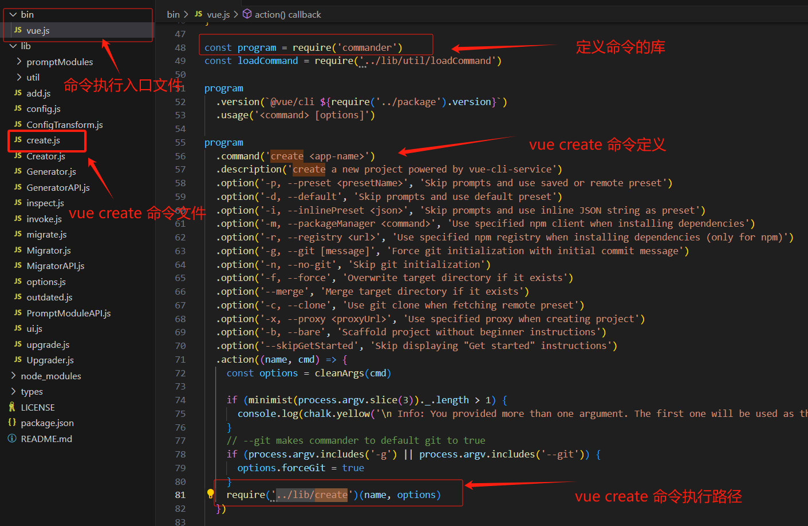
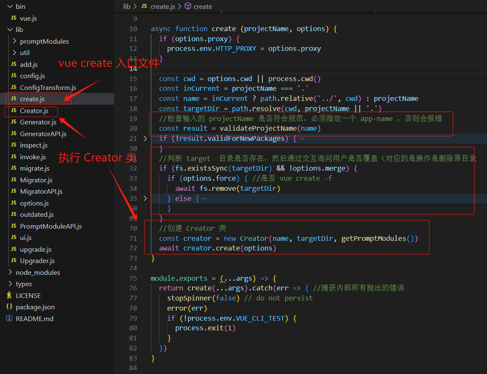
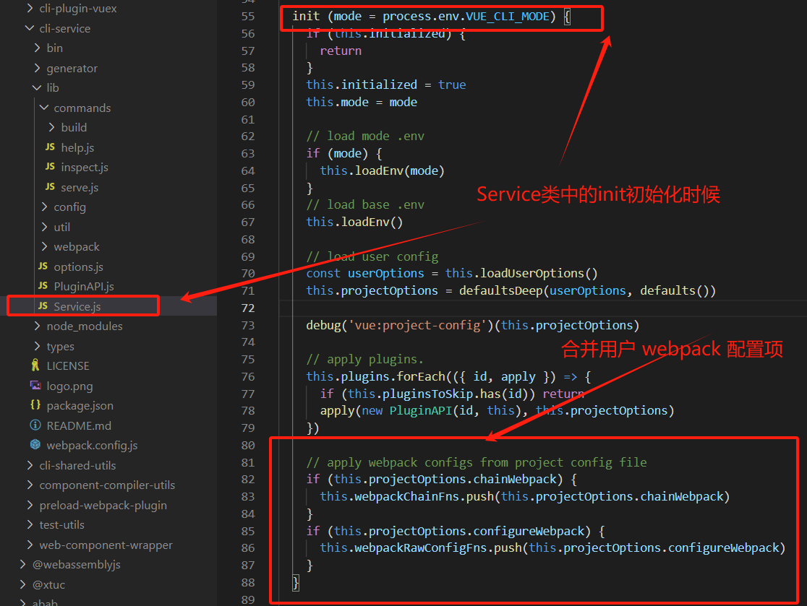
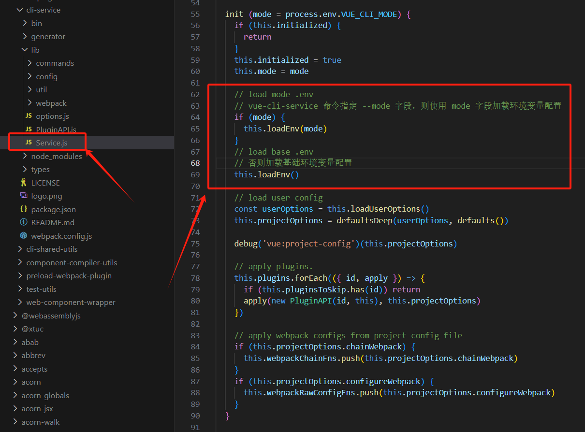

# VueCli源码分析

## **是什么**

Vue CLI（Vue Command Line Interface）是一个官方提供的命令行工具，用于快速搭建和管理Vue.js项目。

它提供了一整套完整的开发解决方案，包括代码构建、热更新、代码分割、代码压缩、版本控制等功能，大大简化了Vue.js项目的开发过程。

## **为什么**

在开发Vue.js项目时，如果没有一个统一的构建工具，开发人员需要手动配置各种工具和插件，这不仅浪费时间，还容易出错。

而Vue CLI作为官方的构建工具，提供了预先配置好的最佳实践，使得开发人员可以专注于编写业务逻辑，而不是花费大量时间在配置上。

Vue CLI还可以自动化处理许多繁琐的任务，如代码压缩、热更新等，从而提高开发效率。


## **Vue-cli 集成插件/库**

| 技术           | 作用                                                         |
| :------------- | :----------------------------------------------------------- |
| Vue.js         | 用于构建用户界面的流行JavaScript前端框架                     |
| Webpack        | 静态模块打包工具，处理项目中的资源文件并打包成可用的文件     |
| Babel          | JavaScript 编译器，将ES6+代码转换为向后兼容的JavaScript版本  |
| ESLint         | 可插拔的JavaScript代码检查工具，帮助保持一致的代码风格和发现潜在问题 |
| Vue Router     | Vue.js官方提供的路由管理器，用于构建单页应用程序的路由系统   |
| Vuex           | Vue.js官方提供的状态管理库，用于管理应用程序的全局状态       |
| Axios          | 用于发起 GET 、或 POST 等 http请求，基于 Promise 设计        |
| Jest           | 单元测试框架，用于编写和运行单元测试                         |
| Cypress        | 端到端测试框架，用于编写和运行整个应用程序的端到端测试       |
| Sass           | CSS预处理器，增强CSS的编程能力和可维护性                     |
| Less           | CSS预处理器，增强CSS的编程能力和可维护性                     |
| Prettier       | 代码格式化工具，用于自动格式化代码                           |
| 代码分割       | 将代码拆分成多个小块，实现按需加载和提高应用程序性能         |
| 懒加载         | 延迟加载页面中的资源，提高应用程序的性能                     |
| `emit.js` 文件 | 用于 vue 事件机制的管理                                      |


## 创建项目过程分析

### **安装 Vue-Cli**

可以使用下列任一命令安装这个新的包：

```shell
npm install -g @vue/cli
# OR
yarn global add @vue/cli
```

安装之后，你就可以在命令行中访问 `vue` 命令。

以上通过全局安装 `vue-cli`，默认情况下 windows 会安装到 `C:\Users\{{YourUserName}}\AppData\Roaming\npm\node_modules\@vue\cli` 目录中;

### **命令解析**

运行以下命令来创建一个新项目：(详细参考官方文档：[创建一个项目 | Vue CLI (vuejs.org)](https://cli.vuejs.org/zh/guide/creating-a-project.html#vue-create))

```shell
vue create hello-world
```

当运行 `vue create` 命令时，默认会执行安装的 `vue-cli` 项目下的 `/bin/vue.js` 文件（以下是全局安装的 `vue-cli` 项目目录）：


> `/bin/vue.js` 文件执行流程：
>
> 1. 检查 Node.js 版本；
>
> 2. 定义所有 vue 命令;
>
>    * vue 使用 commander 库定义命令的配置项，并在配置中指明命令的执行文件；
>
>    * `vue create` 命令在文件中的定义和执行路径如下：
>
>      
>
> 3. 解析 shell 命令，并根据命令执行路径执行命令；

### **`vue create` 命令执行过程**

1. 终端输入`vue create vue-test-app`;
2. 终端解析出`vue`主命令;
3. 终端在环境变量中找到`vue`命令;
4. 终端根据`vue`命令链接到实际可执行文件vue.js;
5. 终端利用 node 执行 vue.js;
6. vue.js 解析 command 和 option;
7. vue.js 执行 command;
8. 执行完毕，退出执行;

### **`vue create` 命令解析**

执行 `vue create` 命令时，最终是解析 `./@vue/cli/lib/create.js` 文件：



> `vue create` 命令主要执行以下逻辑：
>
> 1. 检查输入的 projectName 是否符合规范；必须指定一个 `app-name `，否则会报错；
> 2. 判断 target  目录是否存在，然后通过交互询问用户是否覆盖（对应的是操作是删除原目录;
> 3. 创建 Creator 类,并执行`creator.create(options)`;


## **CLI 服务分析**

### **使用**

在一个 Vue CLI 项目中，`@vue/cli-service` 安装了一个名为 `vue-cli-service` 的命令。

可以在 npm scripts 中以 `vue-cli-service`、或者从终端中以 `./node_modules/.bin/vue-cli-service` 访问这个命令。

这是你使用默认 preset 的项目的 `package.json`：

```shell
{
  "scripts": {
    "serve": "vue-cli-service serve",
    "build": "vue-cli-service build"
  }
}
```

你可以通过 npm 或 Yarn 调用这些 script：

```shell
npm run serve
# OR
yarn serve
```

如果你可以使用 [npx](https://github.com/npm/npx) (最新版的 npm 应该已经自带)，也可以直接这样调用命令：

```shell
npx vue-cli-service serve
```


### **Shell 命令解析**

1. 在 shell 命令行中输入 `npm run serve` 时候，会执行 `vue-cli-service serve`
2. 当遇到 `vue-cli-service` 命令时，会在 `./node_modules/.bin` 目录下根据 windows 或 mac 平台查找 shell 或 cmd 脚本执行，在 windows 平台下会执行 `./node_modules/.bin/vue-cli-service.cmd` :


3. 该批处理脚本的主要作用是找到并设置Vue CLI服务的执行路径，然后使用Node.js来运行Vue CLI服务，Vue CLI服务的执行路径执行路径为 `..\@vue\cli-service\bin\vue-cli-service.js`

`vue-cli-service.js` 文件主要作用是**检查运行环境、解析命令行参数，并运行 Vue CLI 服务**:

```js

// 设定脚本的解释器为 node，这样这个脚本就是一个 node 脚本，可以在命令行中运行。  
#!/usr/bin/env node  
  
// 从 '@vue/cli-shared-utils' 模块中引入 'semver' 和 'error' 函数。'semver' 用于处理语义版本，'error' 用于输出错误信息。  
const { semver, error } = require('@vue/cli-shared-utils')  
  
// 从 '../package.json' 文件中获取 'engines.node' 的值，这个值是运行这个脚本所需要的 Node.js 的版本。  
const requiredVersion = require('../package.json').engines.node  
  
// 检查当前运行的 Node.js 版本是否满足 'requiredVersion'，如果不满足，则输出错误信息并退出进程。  
if (!semver.satisfies(process.version, requiredVersion)) {  
  error(  
    `You are using Node ${process.version}, but vue-cli-service ` +  
    `requires Node ${requiredVersion}.\nPlease upgrade your Node version.`  
  )  
  process.exit(1)  
}  
  
// 从 '../lib/Service' 文件中引入 'Service' 类，并创建一个新的 'Service' 实例。  
const Service = require('../lib/Service')  
const service = new Service(process.env.VUE_CLI_CONTEXT || process.cwd())  
  
// 获取命令行参数（除了脚本名和路径参数），并存储到 'rawArgv' 中。  
const rawArgv = process.argv.slice(2)  
  
// 使用 'minimist' 库解析 'rawArgv' 中的参数。这里定义了一些布尔类型的参数。  
const args = require('minimist')(rawArgv, {  
  boolean: [  
    // build  
    'modern',  
    'report',  
    'report-json',  
    'inline-vue',  
    'watch',  
    // serve  
    'open',  
    'copy',  
    'https',  
    // inspect  
    'verbose'  
  ]  
})  
  
// 获取 'args._[0]'，即第一个命令行参数（不包括参数名），这个参数通常表示命令。  
const command = args._[0]  
  
// 运行 'service' 的 'run' 方法，传入命令、参数和原始的命令行参数。如果运行过程中出现错误，则捕获并输出错误信息，然后退出进程。  
service.run(command, args, rawArgv).catch(err => {  
  error(err)  
  process.exit(1)  
})

```

> 以上代码主要执行以下操作：
>
> 1. **检查运行环境**：首先，脚本检查当前运行的 Node.js 版本是否满足所需的版本要求。如果不满足，它会输出错误信息并退出进程。
> 2. **解析命令行参数**：然后，脚本使用 'minimist' 库解析命令行参数。它定义了一些布尔类型的参数，并根据这些参数的值设置相应的数据结构。
> 3. **运行 Vue CLI 服务**：最后，脚本运行 'service' 的 'run' 方法，传入命令、参数和原始的命令行参数。如果运行过程中出现错误，它会捕获并输出错误信息，然后退出进程。

`vue-cli-service` 常用命令：

* **`vue-cli-service serve` 命令:** 启动一个开发服务器 (基于 [webpack-dev-server](https://github.com/webpack/webpack-dev-server)) 并附带开箱即用的模块热重载 (Hot-Module-Replacement)。

  ```shell
  用法：vue-cli-service serve [options] [entry]
  ```

* **`vue-cli-service build` 命令:**  会在 `dist/` 目录产生一个可用于生产环境的包，带有 JS/CSS/HTML 的压缩，和为更好的缓存而做的自动的 vendor chunk splitting。它的 chunk manifest 会内联在 HTML 里。

  ```shell
  用法：vue-cli-service build [options] [entry|pattern]
  ```

通过以上代码可知，`vue-cli-service` 命令执行前，先创建了一个 Service 类，并通过 `service.run()` 方法执行执行命令。

### **Service 对象初始化**

Service 对象定义位于 `./node_modules/@vue/cli-service/lib/Service.js` 中;

`Service`的类包含了Vue CLI中的服务对象。

服务对象负责**处理命令行选项、插件加载、Webpack配置和其他与项目构建相关的任务**:

```js
module.exports = class Service {
  constructor (context, { plugins, pkg, inlineOptions, useBuiltIn } = {}) {
    process.VUE_CLI_SERVICE = this
    this.initialized = false
    this.context = context
    this.inlineOptions = inlineOptions
    this.webpackChainFns = []
    this.webpackRawConfigFns = []
    this.devServerConfigFns = []
    this.commands = {}
    // Folder containing the target package.json for plugins
    this.pkgContext = context//context参数，它是一个包含项目路径和其他配置的环境对象
    // package.json containing the plugins
    this.pkg = this.resolvePkg(pkg)//解析pkg参数，如果pkg是相对路径，它会相对于context目录来解析。
    // If there are inline plugins, they will be used instead of those
    // found in package.json.
    // When useBuiltIn === false, built-in plugins are disabled. This is mostly
    // for testing.
    //根据plugins参数和useBuiltIn标志来加载插件。如果useBuiltIn为false，则禁用内置插件。
    this.plugins = this.resolvePlugins(plugins, useBuiltIn)//
    // pluginsToSkip will be populated during run()
    this.pluginsToSkip = new Set() //用于记录要跳过的插件的集合
    // resolve the default mode to use for each command
    // this is provided by plugins as module.exports.defaultModes
    // so we can get the information without actually applying the plugin.
    //默认模式对象，用于定义每个命令的默认模式。这个对象是通过插件的apply对象中的defaultModes来构建的。
    this.modes = this.plugins.reduce((modes, { apply: { defaultModes }}) => {
      return Object.assign(modes, defaultModes)
    }, {})
  }
  //解析pkg参数，如果pkg是相对路径，它会相对于context目录来解析
 //如果inlinePkg存在，则直接返回。
  //否则，使用resolvePkg方法来解析context目录下的包。
  //如果解析后的包包含vuePlugins属性，则设置pkgContext属性为context与vuePlugins.resolveFrom的路径分辨率。
  //递归调用resolvePkg方法，直到pkgContext被设置为止。
  resolvePkg (inlinePkg, context = this.context) {
    // ...
    return pkg
  }
  //初始化
  init (mode = process.env.VUE_CLI_MODE) {
  // ...
  }
  //根据环境变量VUE_CLI_MODE来加载相应的配置文件
  loadEnv (mode) {
   // ...
  }
  //用于记录要跳过的插件的集合
  setPluginsToSkip (args) {
  // ...
  }
  //根据plugins参数和useBuiltIn标志来加载插件。如果useBuiltIn为false，则禁用内置插件。
  resolvePlugins (inlinePlugins, useBuiltIn) {
    // ...
    return plugins
  }

// async函数，用于运行name，args，rawArgv
 async run (name, args = {}, rawArgv = []) {
    // ...
    return fn(args, rawArgv)
  }
 //加载用户提供的chainable配置文件。链入Webpack配置处理函数，以便在构建过程中使用。
 resolveChainableWebpackConfig () {
   	// ...
    return chainableConfig
  }

  	//链入Webpack配置处理函数，以便在构建过程中使用。
  	//解析用户提供的chainable配置文件。
    //执行配置文件处理函数，以便在构建过程中使用。
    //检查配置项entry的类型，并将其转换为数组。
    //将entry文件解析为具体的路径，并设置环境变量VUE_CLI_ENTRY_FILES。
  resolveWebpackConfig (chainableConfig = this.resolveChainableWebpackConfig()) {
    // ...
    return config
  }
  //加载用户提供的选项，并使用默认值来填充缺失的选项。
  loadUserOptions () {
    // ...
    return resolved
  }
}
```

> 以上代码为 `Service` 类的定义，在该类中定义了`Service` 类的属性和方法：
>
> 1. 初始化`Service`类时：
>    * 会设置一些基本的状态：如`initialized`、`context`、`inlineOptions`、`webpackChainFns`、`webpackRawConfigFns`、`devServerConfigFns`、`commands`和`pkgContext`。
> 2. 构造函数： 会接收一个`context`参数，它是一个包含项目路径和其他配置的环境对象。
> 3. `resolvePkg`方法：用于解析`pkg`参数，如果`pkg`是相对路径，它会相对于`context`目录来解析。
> 4. `resolvePlugins`方法：会根据`plugins`参数和`useBuiltIn`标志来加载插件。如果`useBuiltIn`为`false`，则禁用内置插件。
> 5. `pluginsToSkip`：是一个用于记录要跳过的插件的集合。
> 6. `modes`：是一个默认模式对象，用于定义每个命令的默认模式。这个对象是通过插件的`apply`对象中的`defaultModes`来构建的。
> 7. `init` 方法：
>    * 初始化`Service`类，设置一些基本的状态。
>    * 根据环境变量`VUE_CLI_MODE`来加载相应的配置文件（`vue-cli-service serve [options] [entry]` 命令通过 `--mode` 参数指定环境模式 ，默认值为 development，该参数会加载当前目录下指定环境的下配置文件）。
>    * 加载用户提供的选项，并使用默认值来填充缺失的选项。
>    * 遍历插件列表，并执行它们的方法。
>    * 链入Webpack配置处理函数，以便在构建过程中使用。
>    * 创建一个新的Webpack配置处理函数，以便在构建过程中使用。
> 8. `run`方法：用于启动项目构建过程，它会遍历插件列表，并执行它们的方法。
>
> 这些方法、属性和状态的定义允许服务对象在项目构建过程中执行各种任务，如加载插件、配置Webpack和处理开发服务器配置等。

通过以上 Service 对象定义可知：

1. 在 shell 执行命令时候，首先解析参数，并将参数传递给 Service 类: `new Service(process.env.VUE_CLI_CONTEXT || process.cwd())  `;
2.  Service 类初始化时，调用 `resolvePkg(pkg)` 解析解析参数指定目录下的包；
3. 初始化完成后调用 `run`方法，用于启动项目构建过程，它会遍历插件列表，并执行它们的方法。

### **`Service.run ` 启动构建**

`Service.run ` 方法详细代码：

```js
// async函数，用于运行name，args，rawArgv
 async run (name, args = {}, rawArgv = []) {
    // resolve mode
    // prioritize inline --mode
    // fallback to resolved default modes from plugins or development if --watch is defined
    //解析`args.mode`和`args.watch`参数，确定当前模式
    const mode = args.mode || (name === 'build' && args.watch ? 'development' : this.modes[name])

    // --skip-plugins arg may have plugins that should be skipped during init()
    // set plugins to skip
    //设置要跳过的插件
    this.setPluginsToSkip(args)

    // load env variables, load user config, apply plugins
    // 加载环境变量，加载用户配置，应用插件
    this.init(mode)

    // resolve args
    // 解析参数
    args._ = args._ || []
    let command = this.commands[name]
    if (!command && name) {
      error(`command "${name}" does not exist.`)
      process.exit(1)
    }
    if (!command || args.help || args.h) {
      command = this.commands.help
    } else {
      args._.shift() // remove command itself
      rawArgv.shift()
    }
    const { fn } = command
    return fn(args, rawArgv)
  }

```

> 该方法执行以下操作：
>
> * 解析`args.mode`和`args.watch`参数，确定当前模式。
> * 设置要跳过的插件。
> * 加载环境变量和用户配置。
> * 应用插件。
> * 解析参数。
> * 调用`command`方法，并返回结果。

根据以上 "Shell 命令解析" 部分代码中，`vue-cli-service.js` 文件中调用了 `service.run`：

```js
service.run(command, args, rawArgv).catch(err => {  
  error(err)  
  process.exit(1)  
})
```

而`vue-cli-service` 命令用法为：（以 serve参数为例） `vue-cli-service serve [options] [entry]`，则 `service.run` 方法的 command 参数为该命令的 `serve` 方法；

在  `service.run` 方法中最后执行 :

```js
const { fn } = command
return fn(args, rawArgv)
```

说明在 `vue-cli-service serve [options] [entry]` 命令中最后执行 `serve` 方法并传入 `[options] [entry]` 参数。


### **解析插件**

以 `serve` 方法为例，`vue-cli-service` 构建命令为： `vue-cli-service serve[options] [entry|pattern]`

通过以上代码分析可知，命令行参数方法 serve 通过 `command` 参数执行， `command` 参数在 Service 构造函数中定义，并通过 `Service.resolvePlugins` 方法初始化，该方法定义如下：

```js
 // 解析插件
  resolvePlugins (inlinePlugins, useBuiltIn) {
    // 根据id获取插件
    const idToPlugin = id => ({
      id: id.replace(/^.\//, 'built-in:'),
      apply: require(id)
    })

    let plugins

    // 内置插件
    const builtInPlugins = [
      './commands/serve',
      './commands/build',
      './commands/inspect',
      './commands/help',
      // config plugins are order sensitive
      './config/base',
      './config/css',
      './config/prod',
      './config/app'
    ].map(idToPlugin)

    // 判断是否使用内置插件
    if (inlinePlugins) {
      // 判断是否使用内置插件
      plugins = useBuiltIn !== false
        ? builtInPlugins.concat(inlinePlugins)
        : inlinePlugins
    } else {
      // 获取项目插件
      const projectPlugins = Object.keys(this.pkg.devDependencies || {})
        .concat(Object.keys(this.pkg.dependencies || {}))
        .filter(isPlugin)
        .map(id => {
          // 判断是否可选依赖
          if (
            this.pkg.optionalDependencies &&
            id in this.pkg.optionalDependencies
          ) {
            let apply = () => {}
            try {
              // 尝试加载插件
              apply = require(id)
            } catch (e) {
              // 加载失败，输出警告
              warn(`Optional dependency ${id} is not installed.`)
            }

            return { id, apply }
          } else {
            // 根据id获取插件
            return idToPlugin(id)
          }
        })
      // 合并内置插件和项目插件
      plugins = builtInPlugins.concat(projectPlugins)
    }

    // Local plugins
    // 判断是否有本地插件
    if (this.pkg.vuePlugins && this.pkg.vuePlugins.service) {
      // 获取文件
      const files = this.pkg.vuePlugins.service
      // 判断文件类型是否为数组
      if (!Array.isArray(files)) {
        // 不是数组，抛出错误
        throw new Error(`Invalid type for option 'vuePlugins.service', expected 'array' but got ${typeof files}.`)
      }
      // 合并插件
      plugins = plugins.concat(files.map(file => ({
        id: `local:${file}`,
        apply: loadModule(`./${file}`, this.pkgContext)
      })))
    }

    return plugins
  }
```

> 该方法主要解析插件：
>
> 1.  根据id获取插件;
> 2. 判断是否使用内置插件，获取项目插件
> 3.  合并内置插件和项目插件；
> 4. 判断是否有本地插件，合并插件
> 5. 返回合并后的插件。

根据以上`resolvePlugins` 方法可知，  `serve` 方法 插件定义在`./commands/serve`，所有内置插件定义如下：


> 自定义开发插件可以参考官方文档： [插件开发指南 | Vue CLI (vuejs.org)](https://cli.vuejs.org/zh/dev-guide/plugin-dev.html#service-插件)

### **serve 命令解析**  

`vue-cli-service serve` 命令：

#### **使用**

```shell
用法：vue-cli-service serve [options] [entry]

选项：

  --open    在服务器启动时打开浏览器
  --copy    在服务器启动时将 URL 复制到剪切版
  --mode    指定环境模式 (默认值：development)
  --host    指定 host (默认值：0.0.0.0)
  --port    指定 port (默认值：8080)
  --https   使用 https (默认值：false)
```

通过 npm script 执行该命令：

```js
  "scripts": {
    "dev": "vue-cli-service serve",
    "prod": "cross-env NODE_ENV=production && vue-cli-service serve",
  },
```

#### **原理**

`vue-cli-service serve` 命令会启动一个开发服务器 (基于 [webpack-dev-server](https://github.com/webpack/webpack-dev-server)) 并附带开箱即用的模块热重载 (Hot-Module-Replacement)。

#### **源码分析**

在通过以上“解析插件” 步骤时，执行`vue-cli-service serve`命令时，最终是通过调用 `serve` 插件方法，serve 命令脚本在 `cli-service/lib/commands/serve.js` 中：

```js
module.exports = (api, options) => {
  //调用 registerCommand 注册一个 serve 命令
  api.registerCommand('serve', {
    description: 'start development server',
    usage: 'vue-cli-service serve [options] [entry]',
    options: {
      '--open': `open browser on server start`,
      '--copy': `copy url to clipboard on server start`,
      '--stdin': `close when stdin ends`,
      '--mode': `specify env mode (default: development)`,
      '--host': `specify host (default: ${defaults.host})`,
      '--port': `specify port (default: ${defaults.port})`,
      '--https': `use https (default: ${defaults.https})`,
      '--public': `specify the public network URL for the HMR client`,
      '--skip-plugins': `comma-separated list of plugin names to skip for this run`
    }
  }, async function serve (args) {
    info('Starting development server...')
 	// 启动一个开发服务器，以下代码省略...
    })
  })
}
```

>  在 `serve.js` 中主要调用了 ` api.registerCommand` 进行注册命令，并传入三个参数:
>
> * 第一个参数：serve 命令名称；
> * 第二个参数：命令选项；
> * 第三个参数：命令回调函数，在该回调函数中使用 webpack 启动一个本地开发服务;
>
> ` api.registerCommand`  方式实际上在 `cli-service/lib/PluginAPI.js` 中定义：主要作用是在 Service 类中注册一个命令
>
> ```js
>   registerCommand (name, opts, fn) {
>     if (typeof opts === 'function') {
>       fn = opts
>       opts = null
>     }
>     this.service.commands[name] = { fn, opts: opts || {}}
>   }
> ```

该命令的主要执行逻辑为` api.registerCommand` 的第三个参数回调方法，下面分析该回调 `serve` 方法 :

#### **`serve` 回调**

serve 回调中主要**使用 webpack 启动一个启动一个本地开发服务**,内部主要逻辑：

1. **配置初始化**： webpack 和 webpack 开发服务配置项初始化；
2. 创建 webpack 实例 和 开发服务实例；
3. 返回 HTTP 服务实例，并启动本地 HTTP 服务;

代码简化逻辑为：

```js
async function serve (args) {
    info('Starting development server...')
  
    // although this is primarily a dev server, it is possible that we
    // are running it in a mode with a production env, e.g. in E2E tests.
    const isInContainer = checkInContainer()
    const isProduction = process.env.NODE_ENV === 'production'

    const url = require('url')
    const { chalk } = require('@vue/cli-shared-utils')
    const webpack = require('webpack')
    const WebpackDevServer = require('webpack-dev-server')
    const portfinder = require('portfinder')
    const prepareURLs = require('../util/prepareURLs')
    const prepareProxy = require('../util/prepareProxy')
    const launchEditorMiddleware = require('launch-editor-middleware')
    const validateWebpackConfig = require('../util/validateWebpackConfig')
    const isAbsoluteUrl = require('../util/isAbsoluteUrl')
   // ==================webpack 和 webpack 开发服务配置项 初始化====================
    // 往 service.webpackChainFns 队列中添加回调...
    // 1.设置开发环境下 webpack 开发工具...
    // 2.解析 webpack 配置
    // 3.检查常见的 webpack 配置错误
    // 4.暴露高级统计信息...
    //5.解析 webpack 入口参数...
    // 6.解析服务器选项...
    // 7.非生产环境下，注入开发和热重载中间件...
  
    //========== webpack 配置项初始化完成 ====================
    //========== 创建 webpack 实例 和 开发服务实例============
    // create compiler
    // 核心：创建 webpack 实例，返回一个编译器对象
    const compiler = webpack(webpackConfig)

    // create server
    // 核心：创建一个 webpack 开发服务, 传入一个编译器实例 和 参数选项
    const server = new WebpackDevServer(compiler, {
     //配置项省略...
    })
	// 返回一个 HTTP 服务实例
    return new Promise((resolve, reject) => {
      // log instructions & open browser on first compilation complete
      let isFirstCompile = true
      // 监听 webpack 插件 done 事件
      compiler.hooks.done.tap('vue-cli-service serve', stats => {
  	  // 配置操作....
      // 启动服务，并监听
      server.listen(port, host, err => {
        if (err) {
          reject(err)
        }
      })
    })
  }
```


完整代码和注释为：

```js
async function serve (args) {
    info('Starting development server...')
    // ==================webpack 和 webpack 开发服务配置项 初始化====================
    // although this is primarily a dev server, it is possible that we
    // are running it in a mode with a production env, e.g. in E2E tests.
    const isInContainer = checkInContainer()
    const isProduction = process.env.NODE_ENV === 'production'

    const url = require('url')
    const { chalk } = require('@vue/cli-shared-utils')
    const webpack = require('webpack')
    const WebpackDevServer = require('webpack-dev-server')
    const portfinder = require('portfinder')
    const prepareURLs = require('../util/prepareURLs')
    const prepareProxy = require('../util/prepareProxy')
    const launchEditorMiddleware = require('launch-editor-middleware')
    const validateWebpackConfig = require('../util/validateWebpackConfig')
    const isAbsoluteUrl = require('../util/isAbsoluteUrl')

    // configs that only matters for dev server
    // 往 service.webpackChainFns 队列中添加回调
    api.chainWebpack(webpackConfig => {
      // 设置开发环境下 webpack 开发工具
      if (process.env.NODE_ENV !== 'production' && process.env.NODE_ENV !== 'test') {
        webpackConfig
          .devtool('cheap-module-eval-source-map')

        // 添加 webpack 热更新插件
        webpackConfig
          .plugin('hmr')
            .use(require('webpack/lib/HotModuleReplacementPlugin'))

        // https://github.com/webpack/webpack/issues/6642
        // https://github.com/vuejs/vue-cli/issues/3539
        // https://v3.vuejs.org/api/global-api.html#definecomponnet
        // 设置 webpack 全局对象 一些插件需要它来正确工作
        webpackConfig
          .output
            .globalObject(`(typeof self !== 'undefined' ? self : this)`)

        // 添加 webpack 进度条
        if (!process.env.VUE_CLI_TEST && options.devServer.progress !== false) {
          webpackConfig
            .plugin('progress')
            .use(require('webpack/lib/ProgressPlugin'))
        }
      }
    })

    // resolve webpack config 解析 webpack 配置
    const webpackConfig = api.resolveWebpackConfig()

    // check for common config errors
    // 检查常见的 webpack 配置错误
    validateWebpackConfig(webpackConfig, api, options)

    // load user devServer options with higher priority than devServer
    // in webpack config
    // 加载用户 devServer 选项，具有比 webpack 配置中的 devServer 更高的优先级
    const projectDevServerOptions = Object.assign(
      webpackConfig.devServer || {},
      options.devServer
    )

    // expose advanced stats
    // 暴露高级统计信息
    if (args.dashboard) {
      // https://github.com/FormidableLabs/webpack-dashboard
      const DashboardPlugin = require('../webpack/DashboardPlugin')
      ;(webpackConfig.plugins = webpackConfig.plugins || []).push(new DashboardPlugin({
        type: 'serve'
      }))
    }

    // entry arg
    //解析 webpack 入口参数
    const entry = args._[0]
    if (entry) {
      webpackConfig.entry = {
        app: api.resolve(entry)
      }
    }

    // resolve server options
    // 解析服务器选项
    const useHttps = args.https || projectDevServerOptions.https || defaults.https   
    const protocol = useHttps ? 'https' : 'http'
    const host = args.host || process.env.HOST || projectDevServerOptions.host || defaults.host
    portfinder.basePort = args.port || process.env.PORT || projectDevServerOptions.port || defaults.port
    const port = await portfinder.getPortPromise()
    const rawPublicUrl = args.public || projectDevServerOptions.public
    const publicUrl = rawPublicUrl
      ? /^[a-zA-Z]+:\/\//.test(rawPublicUrl)
        ? rawPublicUrl
        : `${protocol}://${rawPublicUrl}`
      : null

    const urls = prepareURLs(
      protocol,
      host,
      port,
      isAbsoluteUrl(options.publicPath) ? '/' : options.publicPath
    )
    const localUrlForBrowser = publicUrl || urls.localUrlForBrowser
    // proxy config
    const proxySettings = prepareProxy(
      projectDevServerOptions.proxy,
      api.resolve('public')
    )

    // inject dev & hot-reload middleware entries
    // 非生产环境下，注入开发和热重载中间件
    if (!isProduction) {
      // socket 连接路径
      const sockPath = projectDevServerOptions.sockPath || '/sockjs-node'
      const sockjsUrl = publicUrl
        // explicitly configured via devServer.public
        ? `?${publicUrl}&sockPath=${sockPath}`
        : isInContainer
          // can't infer public network url if inside a container...
          // use client-side inference (note this would break with non-root publicPath)
          ? ``
          // otherwise infer the url
          : `?` + url.format({
            protocol,
            port,
            hostname: urls.lanUrlForConfig || 'localhost'
          }) + `&sockPath=${sockPath}`
      const devClients = [
        // dev server client
        require.resolve(`webpack-dev-server/client`) + sockjsUrl,
        // hmr client
        require.resolve(projectDevServerOptions.hotOnly
          ? 'webpack/hot/only-dev-server'
          : 'webpack/hot/dev-server')
        // TODO custom overlay client
        // `@vue/cli-overlay/dist/client`
      ]
      if (process.env.APPVEYOR) {
        devClients.push(`webpack/hot/poll?500`)
      }
      // inject dev/hot client
      // 添加开发和热重载客户端到 entry
      addDevClientToEntry(webpackConfig, devClients)
    }
    //========== webpack 配置项初始化完成 ====================
    //========== 创建 webpack 实例 和 开发服务实例============
    // create compiler
    // 核心：创建 webpack 实例，返回一个编译器对象
    const compiler = webpack(webpackConfig)

    // handle compiler error
    // webpack 处理编译错误，监听错误，发生错误时退出程序
    compiler.hooks.failed.tap('vue-cli-service serve', msg => {
      error(msg)
      process.exit(1)
    })

    // create server
    // 核心：创建一个 webpack 开发服务, 传入一个编译器实例 和 参数选项
   const server = new WebpackDevServer(compiler, Object.assign({
      // 关闭 webpack 的日志
      logLevel: 'silent',
      // 关闭 webpack-dev-server 的日志
      clientLogLevel: 'silent',
      // 支持页面跳转
      historyApiFallback: {
        // 禁用点式规则
        disableDotRule: true,
        // 生成历史api回退重写
        rewrites: genHistoryApiFallbackRewrites(options.publicPath, options.pages)
      },
      // 指定内容基础
      contentBase: api.resolve('public'),
      // 非生产环境时，监听内容基础
      watchContentBase: !isProduction,
      // 非生产环境时，启用热更新
      hot: !isProduction,
      // 禁用注入客户端
      injectClient: false,
      // 压缩
      compress: isProduction,
      // 指定publicPath
      publicPath: options.publicPath,
      // 非生产环境时，启用覆盖
      overlay: isProduction // TODO disable this
        ? false
        : { warnings: false, errors: true }
    }, projectDevServerOptions, {
      // 使用https
      https: useHttps,
      // 代理设置
      proxy: proxySettings,
      // 注册中间件
      // eslint-disable-next-line no-shadow
      before (app, server) {
        // launch editor support.
        // this works with vue-devtools & @vue/cli-overlay
        // 启动编辑器支持
        // 此功能与vue-devtools和@vue/cli-overlay一起工作
        app.use('/__open-in-editor', launchEditorMiddleware(() => console.log(
          `To specify an editor, specify the EDITOR env variable or ` +
          `add "editor" field to your Vue project config.\n`
        )))
        // allow other plugins to register middlewares, e.g. PWA
        // 允许其他插件注册中间件，例如PWA
        api.service.devServerConfigFns.forEach(fn => fn(app, server))
        // apply in project middlewares
        // 应用项目中间件
        projectDevServerOptions.before && projectDevServerOptions.before(app, server)
      },
      // avoid opening browser
      // 避免打开浏览器
      open: false
    }))

   // 注册 node 信号
   ;['SIGINT', 'SIGTERM'].forEach(signal => {
      // 当收到SIGINT或SIGTERM信号时，关闭服务器
      process.on(signal, () => {
        server.close(() => {
          // 退出进程
          process.exit(0)
        })
      })
    })

   // 判断args.stdin是否存在
   if (args.stdin) {
      // 当标准输入流结束时
      process.stdin.on('end', () => {
        // 关闭服务器
        server.close(() => {
          // 退出进程
          process.exit(0)
        })
      })

      // 恢复标准输入流
      process.stdin.resume()
    }

   // on appveyor, killing the process with SIGTERM causes execa to
    // throw error
    if (process.env.VUE_CLI_TEST) {
      process.stdin.on('data', data => {
        if (data.toString() === 'close') {
          console.log('got close signal!')
          server.close(() => {
            process.exit(0)
          })
        }
      })
    }

    return new Promise((resolve, reject) => {
      // log instructions & open browser on first compilation complete
      let isFirstCompile = true
      // 监听 webpack 插件 done 事件
      compiler.hooks.done.tap('vue-cli-service serve', stats => {
        if (stats.hasErrors()) {
          return
        }

        let copied = ''
        // 首次编译将服务地址添加到粘贴板
        if (isFirstCompile && args.copy) {
          try {
            require('clipboardy').writeSync(localUrlForBrowser)
            copied = chalk.dim('(copied to clipboard)')
          } catch (_) {
            /* catch exception if copy to clipboard isn't supported (e.g. WSL), see issue #3476 */
          }
        }

        const networkUrl = publicUrl
          ? publicUrl.replace(/([^/])$/, '$1/')
          : urls.lanUrlForTerminal

        console.log()
        console.log(`  App running at:`)
        console.log(`  - Local:   ${chalk.cyan(urls.localUrlForTerminal)} ${copied}`)
        if (!isInContainer) {
          console.log(`  - Network: ${chalk.cyan(networkUrl)}`)
        } else {
          console.log()
          console.log(chalk.yellow(`  It seems you are running Vue CLI inside a container.`))
          if (!publicUrl && options.publicPath && options.publicPath !== '/') {
            console.log()
            console.log(chalk.yellow(`  Since you are using a non-root publicPath, the hot-reload socket`))
            console.log(chalk.yellow(`  will not be able to infer the correct URL to connect. You should`))
            console.log(chalk.yellow(`  explicitly specify the URL via ${chalk.blue(`devServer.public`)}.`))
            console.log()
          }
          console.log(chalk.yellow(`  Access the dev server via ${chalk.cyan(
            `${protocol}://localhost:<your container's external mapped port>${options.publicPath}`
          )}`))
        }
        console.log()

        if (isFirstCompile) {
          isFirstCompile = false

          if (!isProduction) {
            const buildCommand = hasProjectYarn(api.getCwd()) ? `yarn build` : hasProjectPnpm(api.getCwd()) ? `pnpm run build` : `npm run build`
            console.log(`  Note that the development build is not optimized.`)
            console.log(`  To create a production build, run ${chalk.cyan(buildCommand)}.`)
          } else {
            console.log(`  App is served in production mode.`)
            console.log(`  Note this is for preview or E2E testing only.`)
          }
          console.log()
          // 打开浏览器
          if (args.open || projectDevServerOptions.open) {
            const pageUri = (projectDevServerOptions.openPage && typeof projectDevServerOptions.openPage === 'string')
              ? projectDevServerOptions.openPage
              : ''
            openBrowser(localUrlForBrowser + pageUri)
          }

          // Send final app URL
          // 发送 url 到粘贴板
          if (args.dashboard) {
            const ipc = new IpcMessenger()
            ipc.send({
              vueServe: {
                url: localUrlForBrowser
              }
            })
          }

          // resolve returned Promise
          // so other commands can do api.service.run('serve').then(...)
          resolve({
            server,
            url: localUrlForBrowser
          })
        } else if (process.env.VUE_CLI_TEST) {
          // signal for test to check HMR
          console.log('App updated')
        }
      })
      // 启动服务，并监听
      server.listen(port, host, err => {
        if (err) {
          reject(err)
        }
      })
    })
  }
```


## **WebPack 配置原理**

### **配置方式**

在 `vue.config.js` 中的 `configureWebpack` 选项提供一个对象：

```js
// vue.config.js
module.exports = {
  configureWebpack: {
    plugins: [
      new MyAwesomeWebpackPlugin()
    ]
  }
}
```

该对象将会被 [webpack-merge](https://github.com/survivejs/webpack-merge) 合并入最终的 webpack 配置。

使用 Vue-Cli 创建的项目 `vue.config.js` 配置为：

```js
'use strict'
const path = require('path')
const defaultSettings = require('./src/settings/projectSettings.js')
const LodashModuleReplacementPlugin = require('lodash-webpack-plugin')
const UpdatePopup = require('@femessage/update-popup') // 版本更新提醒插件
function resolve(dir) {
  return path.join(__dirname, dir)
}

const name = defaultSettings.title page title

// If your port is set to 80,
// use administrator privileges to execute the command line.
// For example, Mac: sudo npm run
// You can change the port by the following methods:
// port = 8080 npm run dev OR npm run dev --port = 8080
const port = process.env.port || process.env.npm_config_port || 8080 // dev port

// All configuration item explanations can be find in https://cli.vuejs.org/config/
module.exports = {
  /**
   * You will need to set publicPath if you plan to deploy your site under a sub path,
   * for example GitHub Pages. If you plan to deploy your site to https://foo.github.io/bar/,
   * then publicPath should be set to "/bar/".
   * In most cases please use '/' !!!
   * Detail: https://cli.vuejs.org/config/#publicpath
   */
  publicPath: './',
  outputDir: 'dist',
  assetsDir: 'static',
  lintOnSave: process.env.NODE_ENV === 'development',
  productionSourceMap: false,
  devServer: {
    port: port,
    open: true,
    overlay: {
      warnings: false,
      errors: true
    },
    hot: true,
    // websocket 配置代理
    proxy: {
      '/socket.io': {
        target: 'http://localhost:3000', // target host
        changeOrigin: true, // needed for virtual hosted sites
        logLevel: 'debug'
      }
    }
  },
  configureWebpack: {
    // provide the app's title in webpack's name field, so that
    // it can be accessed in index.html to inject the correct title.
    name: name,
    resolve: {
      alias: {
        '@': resolve('src')
      }
    }
  },
  chainWebpack(config) {
    // it can improve the speed of the first screen, it is recommended to turn on preload
    config.plugin('preload').tap(() => [
      {
        rel: 'preload',
        // to ignore runtime.js
        // https://github.com/vuejs/vue-cli/blob/dev/packages/@vue/cli-service/lib/config/views/App.js#L171
        fileBlacklist: [/\.map$/, /hot-update\.js$/, /runtime\..*\.js$/],
        include: 'initial'
      }
    ])
    // 版本更新提醒插件
    config.plugin('femessage-update-popup').use(UpdatePopup, [{
      auto: true
    }])
    // when there are many pages, it will cause too many meaningless requests
    config.plugins.delete('prefetch')

    // set svg-sprite-loader
    config.module
      .rule('svg')
      .exclude.add(resolve('src/icons'))
      .end()
    config.module
      .rule('icons')
      .test(/\.svg$/)
      .include.add(resolve('src/icons'))
      .end()
      .use('svg-sprite-loader')
      .loader('svg-sprite-loader')
      .options({
        symbolId: 'icon-[name]'
      })
      .end()

    config
      .when(process.env.NODE_ENV !== 'development',
        config => {
          config
            .plugin('ScriptExtHtmlWebpackPlugin')
            .after('html')
            .use('script-ext-html-webpack-plugin', [{
            // `runtime` must same as runtimeChunk name. default is `runtime`
              inline: /runtime\..*\.js$/
            }])
            .end()
          config
            .optimization.splitChunks({
              chunks: 'all',
              cacheGroups: {
                libs: {
                  name: 'chunk-libs',
                  test: /[\\/]node_modules[\\/]/,
                  priority: 10,
                  chunks: 'initial' // only package third parties that are initially dependent
                },
                elementUI: {
                  name: 'chunk-elementUI', // split elementUI into a single package
                  priority: 20, // the weight needs to be larger than libs and app or it will be packaged into libs or app
                  test: /[\\/]node_modules[\\/]_?element-ui(.*)/ // in order to adapt to cnpm
                },
                commons: {
                  name: 'chunk-commons',
                  test: resolve('src/components'), // can customize your rules
                  minChunks: 3, //  minimum common number
                  priority: 5,
                  reuseExistingChunk: true
                }
              }
            })
          // https:// webpack.js.org/configuration/optimization/#optimizationruntimechunk
          config.optimization.runtimeChunk('single')
        }
      )

    config.plugin('loadshReplace').use(new LodashModuleReplacementPlugin())
  },
  css: {
    loaderOptions: {
      sass: {
        prependData: `@import "~@/styles/variables.scss";`
      }
    }
  }
}

```

#### **`configureWebpack`  属性**

> Type: `Object | Function`
>
> webpack 配置属性：
>
> * 如果这个值是一个对象，则会通过 [webpack-merge](https://github.com/survivejs/webpack-merge) 合并到最终的配置中。
>
> * 如果这个值是一个函数，则会接收被解析的配置作为参数。该函数既可以修改配置并不返回任何东西，也可以返回一个被克隆或合并过的配置版本。

**原理**

`configureWebpack` 属性在 CLI 服务对象 `Service` 类初始化 `init` 方法中，通过将用户配置的 webpack 项存储到 `webpackRawConfigFns`，最后通过 [webpack-merge](https://github.com/survivejs/webpack-merge) 合并到最终的配置中：



### **链式操作 (高级)**

Vue CLI 内部的 webpack 配置是通过 [webpack-chain](https://github.com/mozilla-neutrino/webpack-chain) 维护的。

这个库提供了一个 webpack 原始配置的上层抽象，使其可以定义具名的 loader 规则和具名插件，并有机会在后期进入这些规则并对它们的选项进行修改。
链式操作通过  `vue.config.js` 中的 `chainWebpack` 属性配置：

#### **`chainWebpack` 属性**

> Type: `Function`
>
> 是一个函数，会接收一个基于 [webpack-chain](https://github.com/mozilla-neutrino/webpack-chain) 的 `ChainableConfig` 实例。
>
> 允许对内部的 webpack 配置进行更细粒度的修改。

 `chainWebpack` 属性使用方式参考 [webpack-chain](https://github.com/mozilla-neutrino/webpack-chain) 官方文档使用方式。

####  **[webpack-chain](https://github.com/mozilla-neutrino/webpack-chain)** 

**webpack-chain 是什么？**

> `webpack-chain` 是一个工具，它通过链式 API 生成和简化 webpack 2-4 版本的配置的修改

**为什么要使用 webpack-chain ？**

> Webpack-chain 的出现是为了解决 webpack 配置的问题。
>
> Webpack 的配置过程极其复杂，需要输入大量的信息来保证打包结果符合预期。
>
> Webpack-chain 通过提供一个链式 API 来解决这个问题:
>
> 1. 它允许用户以链式方式创建和修改 webpack 配置，这使得配置过程更加直观和易于管理。
> 2. API 的 Key 部分可以由用户指定的名称引用，这有助于标准化跨项目的配置修改方式。


## **[模式和环境变量](https://cli.vuejs.org/zh/guide/mode-and-env.html#模式和环境变量)**

### **模式**

**模式**是 Vue CLI 项目中一个重要的概念。默认情况下，一个 Vue CLI 项目有三个模式：

- 开发模式：`development` 字段表示，使用 `vue-cli-service serve` 命令启动；
- 测试模式：`test` 字段表示，使用 `vue-cli-service test:unit` 命令启动；
- 生产模式：`production` 字段表示，使用  `vue-cli-service build` 命令启动；

你可以通过传递 `--mode` 选项参数为命令行覆写默认的模式。例如，如果你想要在构建命令中使用开发环境变量：

```
vue-cli-service build --mode development
```

当运行 `vue-cli-service` 命令时，所有的环境变量都从对应的[环境文件](https://cli.vuejs.org/zh/guide/mode-and-env.html#环境变量)中载入。

通过以上 "serve 命令解析" 部分可知：`vue-cli-service` 中 `serve` 和 `build` 命令最终实际执行 `server.js` 和 `build` 插件，插件目录如下：


### **环境变量**

项目根目录中放置下列文件来指定环境变量：

```shell
.env                # 在所有的环境中被载入
.env.local          # 在所有的环境中被载入，但会被 git 忽略
.env.[mode]         # 只在指定的模式中被载入
.env.[mode].local   # 只在指定的模式中被载入，但会被 git 忽略
```

一个环境文件只包含环境变量的“键=值”对：

```shell
FOO=bar
VUE_APP_NOT_SECRET_CODE=some_value
```


### **源码分析**

模式和环境变量初始化在 Service 类初始化时 `init` 方法中，通过 `loadEnv` 方法初始化：



`loadEnv` 方法定义：


## **参考资料**

[vue-cli](https://cli.vuejs.org/zh/guide/)

[剖析 Vue CLI 实现原理](https://cloud.tencent.com/developer/article/1781202#:~:text=Vue%20CLI%20%E6%98%AF%E4%B8%80%E4%B8%AA%E5%9F%BA%E4%BA%8E%20Vue.js%20%E8%BF%9B%E8%A1%8C%E5%BF%AB%E9%80%9F%E5%BC%80%E5%8F%91%E7%9A%84%E5%AE%8C%E6%95%B4%E7%B3%BB%E7%BB%9F%EF%BC%8C%E6%8F%90%E4%BE%9B%E4%BA%86%E7%BB%88%E7%AB%AF%E5%91%BD%E4%BB%A4%E8%A1%8C%E5%B7%A5%E5%85%B7%E3%80%81%E9%9B%B6%E9%85%8D%E7%BD%AE%E8%84%9A%E6%89%8B%E6%9E%B6%E3%80%81%E6%8F%92%E4%BB%B6%E4%BD%93%E7%B3%BB%E3%80%81%E5%9B%BE%E5%BD%A2%E5%8C%96%E7%AE%A1%E7%90%86%E7%95%8C%E9%9D%A2%E7%AD%89%E3%80%82,%E6%9C%AC%E6%96%87%E6%9A%82%E4%B8%94%E5%8F%AA%E5%88%86%E6%9E%90%20%E9%A1%B9%E7%9B%AE%E5%88%9D%E5%A7%8B%E5%8C%96%20%E9%83%A8%E5%88%86%EF%BC%8C%E4%B9%9F%E5%B0%B1%E6%98%AF%E7%BB%88%E7%AB%AF%E5%91%BD%E4%BB%A4%E8%A1%8C%E5%B7%A5%E5%85%B7%E7%9A%84%E5%AE%9E%E7%8E%B0%E3%80%82%200.%20%E7%94%A8%E6%B3%95)