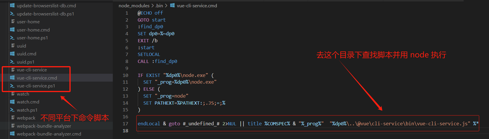

# VueCli源码分析

## **是什么**

## **为什么**

## **怎么用**

## 原理

## **源码分析**


## 基础

* 构建的 vue-cli 工程都到了哪些技术，它们的作用分别是什么？
  * `vue.js`：`vue-cli` 工程的核心。
  * `vue-router`：vue官方推荐使用的路由框架。
  * `vuex`：专为 Vue.js 应用项目开发的状态管理器，主要用于维护vue组件间共用的一些 变量 和 方法。
  * `axios`（ 或者 fetch 、ajax ）：用于发起 GET 、或 POST 等 http请求，基于 Promise 设计。
  * `vux` 等组件库：一个专为 vue 设计的移动端UI组件库。
  * `emit.js` 文件，用于 vue 事件机制的管理。
  * `webpack`：模块加载和 vue-cli 工程打包器。
* vue-cli 工程常用的 npm 命令有哪些？
  * 下载 node_modules 资源包的命令：`npm install`
  * 启动 vue-cli 开发环境的 npm命令：`npm run dev`
  * vue-cli 生成 生产环境部署资源 的 npm命令：`npm run build`
  * 用于查看 vue-cli 生产环境部署资源文件大小的 npm命令：`npm run build --report`
* 自定义脚本命令： 在 `script` 添加命令，使用 `npm run 命令` 执行命令。
* vue-cli目录解析：
  * `build` 文件夹：用于存放 `webpack` 相关配置和脚本。开发中仅 偶尔使用 到此文件夹下 `webpack.base.conf.js`用于配置 `less`、`sass `等 `css `预编译库，或者配置一下 UI 库。
  * config 文件夹：主要存放配置文件，用于区分开发环境、线上环境的不同。 常用到此文件夹下 `config.js` 配置开发环境的 端口号、是否开启热加载 或者 设置生产环境的静态资源相对路径、是否开启gzip压缩、`npm run build` 命令打包生成静态资源的名称和路径等。
  * `dist` 文件夹：默认` npm run build` 命令打包生成的静态资源文件，用于生产部署。
  * `node_modules`：存放npm命令下载的开发环境和生产环境的依赖包。
  * `src`: 存放项目源码及需要引用的资源文件。
  * `src/assets`：存放项目中需要用到的资源文件，css、js、images等。
  * `src/componets`：存放vue开发中一些公共组件：`header.vue`、`footer.vue` 等。
  * `src/emit`：自己配置的vue集中式事件管理机制。
  * `src/router`：vue-router vue路由的配置文件。
  * `src/service`：自己配置的vue请求后台接口方法。
  * `src/page`：存在vue页面组件的文件夹。
  * `src/util`：存放vue开发过程中一些公共的.js方法。
  * `src/vuex`：存放 vuex 为vue专门开发的状态管理器。
  * `src/app.vue`：使用标签`<route-view></router-view>`渲染整个工程的.vue组件。
  * `src/main.js`：vue-cli工程的入口文件。
  * `index.html`：设置项目的一些meta头信息和提供`<div id="app"></div>`用于挂载 vue 节点。
  * `package.json`：用于 node_modules资源部 和 启动、打包项目的 npm 命令管理。

## 原理

### **执行过程**

1. 终端输入`vue create vue-test-app`
2. 终端解析出`vue`主命令
3. 终端在环境变量中找到`vue`命令
4. 终端根据`vue`命令链接到实际可执行文件vue.js
5. 终端利用node执行vue.js
6. vue.js解析command和option
7. vue.js执行command
8. 执行完毕，退出执行


## CLI 服务分析

### **使用**

在一个 Vue CLI 项目中，`@vue/cli-service` 安装了一个名为 `vue-cli-service` 的命令。

可以在 npm scripts 中以 `vue-cli-service`、或者从终端中以 `./node_modules/.bin/vue-cli-service` 访问这个命令。

这是你使用默认 preset 的项目的 `package.json`：

```shell
{
  "scripts": {
    "serve": "vue-cli-service serve",
    "build": "vue-cli-service build"
  }
}
```

你可以通过 npm 或 Yarn 调用这些 script：

```shell
npm run serve
# OR
yarn serve
```

如果你可以使用 [npx](https://github.com/npm/npx) (最新版的 npm 应该已经自带)，也可以直接这样调用命令：

```shell
npx vue-cli-service serve
```


### **Shell 命令解析**

1. 在 shell 命令行中输入 `npm run serve` 时候，会执行 `vue-cli-service serve`
2. 当遇到 `vue-cli-service` 命令时，会在 `./node_modules/.bin` 目录下根据 windows 或 mac 平台查找 shell 或 cmd 脚本执行，在 windows 平台下会执行 `./node_modules/.bin/vue-cli-service.cmd` :



3. 该批处理脚本的主要作用是找到并设置Vue CLI服务的执行路径，然后使用Node.js来运行Vue CLI服务，Vue CLI服务的执行路径执行路径为 `..\@vue\cli-service\bin\vue-cli-service.js`

`vue-cli-service.js` 文件主要作用是检查运行环境、解析命令行参数，并运行 Vue CLI 服务:

```js

// 设定脚本的解释器为 node，这样这个脚本就是一个 node 脚本，可以在命令行中运行。  
#!/usr/bin/env node  
  
// 从 '@vue/cli-shared-utils' 模块中引入 'semver' 和 'error' 函数。'semver' 用于处理语义版本，'error' 用于输出错误信息。  
const { semver, error } = require('@vue/cli-shared-utils')  
  
// 从 '../package.json' 文件中获取 'engines.node' 的值，这个值是运行这个脚本所需要的 Node.js 的版本。  
const requiredVersion = require('../package.json').engines.node  
  
// 检查当前运行的 Node.js 版本是否满足 'requiredVersion'，如果不满足，则输出错误信息并退出进程。  
if (!semver.satisfies(process.version, requiredVersion)) {  
  error(  
    `You are using Node ${process.version}, but vue-cli-service ` +  
    `requires Node ${requiredVersion}.\nPlease upgrade your Node version.`  
  )  
  process.exit(1)  
}  
  
// 从 '../lib/Service' 文件中引入 'Service' 类，并创建一个新的 'Service' 实例。  
const Service = require('../lib/Service')  
const service = new Service(process.env.VUE_CLI_CONTEXT || process.cwd())  
  
// 获取命令行参数（除了脚本名和路径参数），并存储到 'rawArgv' 中。  
const rawArgv = process.argv.slice(2)  
  
// 使用 'minimist' 库解析 'rawArgv' 中的参数。这里定义了一些布尔类型的参数。  
const args = require('minimist')(rawArgv, {  
  boolean: [  
    // build  
    'modern',  
    'report',  
    'report-json',  
    'inline-vue',  
    'watch',  
    // serve  
    'open',  
    'copy',  
    'https',  
    // inspect  
    'verbose'  
  ]  
})  
  
// 获取 'args._[0]'，即第一个命令行参数（不包括参数名），这个参数通常表示命令。  
const command = args._[0]  
  
// 运行 'service' 的 'run' 方法，传入命令、参数和原始的命令行参数。如果运行过程中出现错误，则捕获并输出错误信息，然后退出进程。  
service.run(command, args, rawArgv).catch(err => {  
  error(err)  
  process.exit(1)  
})

```

> 以上代码主要执行以下操作：
>
> 1. **检查运行环境**：首先，脚本检查当前运行的 Node.js 版本是否满足所需的版本要求。如果不满足，它会输出错误信息并退出进程。
> 2. **解析命令行参数**：然后，脚本使用 'minimist' 库解析命令行参数。它定义了一些布尔类型的参数，并根据这些参数的值设置相应的数据结构。
> 3. **运行 Vue CLI 服务**：最后，脚本运行 'service' 的 'run' 方法，传入命令、参数和原始的命令行参数。如果运行过程中出现错误，它会捕获并输出错误信息，然后退出进程。

`vue-cli-service` 常用命令：

* **`vue-cli-service serve` 命令:** 启动一个开发服务器 (基于 [webpack-dev-server](https://github.com/webpack/webpack-dev-server)) 并附带开箱即用的模块热重载 (Hot-Module-Replacement)。

  ```shell
  用法：vue-cli-service serve [options] [entry]
  ```

* **`vue-cli-service build` 命令:**  会在 `dist/` 目录产生一个可用于生产环境的包，带有 JS/CSS/HTML 的压缩，和为更好的缓存而做的自动的 vendor chunk splitting。它的 chunk manifest 会内联在 HTML 里。

  ```shell
  用法：vue-cli-service build [options] [entry|pattern]
  ```

通过以上代码可知，`vue-cli-service` 命令通过 `service.run()` 方法执行

### **Service 对象初始化**

Service 对象定义位于 `./node_modules/@vue/cli-service/lib/Service.js` 中;

`Service`的类包含了Vue CLI中的服务对象。服务对象负责处理命令行选项、插件加载、Webpack配置和其他与项目构建相关的任务:

```js
module.exports = class Service {
  constructor (context, { plugins, pkg, inlineOptions, useBuiltIn } = {}) {
    process.VUE_CLI_SERVICE = this
    this.initialized = false
    this.context = context
    this.inlineOptions = inlineOptions
    this.webpackChainFns = []
    this.webpackRawConfigFns = []
    this.devServerConfigFns = []
    this.commands = {}
    // Folder containing the target package.json for plugins
    this.pkgContext = context//context参数，它是一个包含项目路径和其他配置的环境对象
    // package.json containing the plugins
    this.pkg = this.resolvePkg(pkg)//解析pkg参数，如果pkg是相对路径，它会相对于context目录来解析。
    // If there are inline plugins, they will be used instead of those
    // found in package.json.
    // When useBuiltIn === false, built-in plugins are disabled. This is mostly
    // for testing.
    //根据plugins参数和useBuiltIn标志来加载插件。如果useBuiltIn为false，则禁用内置插件。
    this.plugins = this.resolvePlugins(plugins, useBuiltIn)//
    // pluginsToSkip will be populated during run()
    this.pluginsToSkip = new Set() //用于记录要跳过的插件的集合
    // resolve the default mode to use for each command
    // this is provided by plugins as module.exports.defaultModes
    // so we can get the information without actually applying the plugin.
    //默认模式对象，用于定义每个命令的默认模式。这个对象是通过插件的apply对象中的defaultModes来构建的。
    this.modes = this.plugins.reduce((modes, { apply: { defaultModes }}) => {
      return Object.assign(modes, defaultModes)
    }, {})
  }
  //解析pkg参数，如果pkg是相对路径，它会相对于context目录来解析
 //如果inlinePkg存在，则直接返回。
  //否则，使用resolvePkg方法来解析context目录下的包。
  //如果解析后的包包含vuePlugins属性，则设置pkgContext属性为context与vuePlugins.resolveFrom的路径分辨率。
  //递归调用resolvePkg方法，直到pkgContext被设置为止。
  resolvePkg (inlinePkg, context = this.context) {
    // ...
    return pkg
  }
  //初始化
  init (mode = process.env.VUE_CLI_MODE) {
  // ...
  }
  //根据环境变量VUE_CLI_MODE来加载相应的配置文件
  loadEnv (mode) {
   // ...
  }
  //用于记录要跳过的插件的集合
  setPluginsToSkip (args) {
  // ...
  }
  //根据plugins参数和useBuiltIn标志来加载插件。如果useBuiltIn为false，则禁用内置插件。
  resolvePlugins (inlinePlugins, useBuiltIn) {
    // ...
    return plugins
  }

// async函数，用于运行name，args，rawArgv
 async run (name, args = {}, rawArgv = []) {
    // ...
    return fn(args, rawArgv)
  }
 //加载用户提供的chainable配置文件。链入Webpack配置处理函数，以便在构建过程中使用。
 resolveChainableWebpackConfig () {
   	// ...
    return chainableConfig
  }

  	//链入Webpack配置处理函数，以便在构建过程中使用。
  	//解析用户提供的chainable配置文件。
    //执行配置文件处理函数，以便在构建过程中使用。
    //检查配置项entry的类型，并将其转换为数组。
    //将entry文件解析为具体的路径，并设置环境变量VUE_CLI_ENTRY_FILES。
  resolveWebpackConfig (chainableConfig = this.resolveChainableWebpackConfig()) {
    // ...
    return config
  }
  //加载用户提供的选项，并使用默认值来填充缺失的选项。
  loadUserOptions () {
    // ...
    return resolved
  }
}
```

> 以上代码为 `Service` 类的定义，在该类中定义了`Service` 类的属性和方法：
>
> 1. 初始化`Service`类时：
>    * 会设置一些基本的状态：如`initialized`、`context`、`inlineOptions`、`webpackChainFns`、`webpackRawConfigFns`、`devServerConfigFns`、`commands`和`pkgContext`。
> 2. 构造函数： 会接收一个`context`参数，它是一个包含项目路径和其他配置的环境对象。
> 3. `resolvePkg`方法：用于解析`pkg`参数，如果`pkg`是相对路径，它会相对于`context`目录来解析。
> 4. `resolvePlugins`方法：会根据`plugins`参数和`useBuiltIn`标志来加载插件。如果`useBuiltIn`为`false`，则禁用内置插件。
> 5. `pluginsToSkip`：是一个用于记录要跳过的插件的集合。
> 6. `modes`：是一个默认模式对象，用于定义每个命令的默认模式。这个对象是通过插件的`apply`对象中的`defaultModes`来构建的。
> 7. `init` 方法：
>    * 初始化`Service`类，设置一些基本的状态。
>    * 根据环境变量`VUE_CLI_MODE`来加载相应的配置文件。
>    * 加载用户提供的选项，并使用默认值来填充缺失的选项。
>    * 遍历插件列表，并执行它们的方法。
>    * 链入Webpack配置处理函数，以便在构建过程中使用。
>    * 创建一个新的Webpack配置处理函数，以便在构建过程中使用。
> 8. `run`方法：用于启动项目构建过程，它会遍历插件列表，并执行它们的方法。
>
> 这些方法、属性和状态的定义允许服务对象在项目构建过程中执行各种任务，如加载插件、配置Webpack和处理开发服务器配置等。

通过以上 Service 对象定义可知：

1. 在 shell 执行命令时候，首先解析参数，并将参数传递给 Service 类: `new Service(process.env.VUE_CLI_CONTEXT || process.cwd())  `;
2.  Service 类初始化时，调用 `resolvePkg(pkg)` 解析解析参数指定目录下的包；
3. 初始化完成后调用 `run`方法，用于启动项目构建过程，它会遍历插件列表，并执行它们的方法。

### **`Service.run ` 启动构建**

`Service.run ` 方法详细代码：

```js
// async函数，用于运行name，args，rawArgv
 async run (name, args = {}, rawArgv = []) {
    // resolve mode
    // prioritize inline --mode
    // fallback to resolved default modes from plugins or development if --watch is defined
    //解析`args.mode`和`args.watch`参数，确定当前模式
    const mode = args.mode || (name === 'build' && args.watch ? 'development' : this.modes[name])

    // --skip-plugins arg may have plugins that should be skipped during init()
    // set plugins to skip
    //设置要跳过的插件
    this.setPluginsToSkip(args)

    // load env variables, load user config, apply plugins
    // 加载环境变量，加载用户配置，应用插件
    this.init(mode)

    // resolve args
    // 解析参数
    args._ = args._ || []
    let command = this.commands[name]
    if (!command && name) {
      error(`command "${name}" does not exist.`)
      process.exit(1)
    }
    if (!command || args.help || args.h) {
      command = this.commands.help
    } else {
      args._.shift() // remove command itself
      rawArgv.shift()
    }
    const { fn } = command
    return fn(args, rawArgv)
  }

```

> 该方法执行以下操作：
>
> * 解析`args.mode`和`args.watch`参数，确定当前模式。
> * 设置要跳过的插件。
> * 加载环境变量和用户配置。
> * 应用插件。
> * 解析参数。
> * 调用`command`方法，并返回结果。

根据以上 "Shell 命令解析" 部分代码中，`vue-cli-service.js` 文件中调用了 `service.run`：

```js
service.run(command, args, rawArgv).catch(err => {  
  error(err)  
  process.exit(1)  
})
```

而`vue-cli-service` 命令用法为：（以 serve参数为例） `vue-cli-service serve [options] [entry]`，则 `service.run` 方法的 command 参数为该命令的 `serve` 方法；

在  `service.run` 方法中最后执行 :

```js
const { fn } = command
return fn(args, rawArgv)
```

说明在 `vue-cli-service serve [options] [entry]` 命令中最后执行 `serve` 方法并传入 `[options] [entry]` 参数。


### **解析插件**

以 `serve` 方法为例，`vue-cli-service` 构建命令为： `vue-cli-service serve[options] [entry|pattern]`

通过以上代码分析可知，命令行参数方法 serve 通过 `command` 参数执行， `command` 参数在 Service 构造函数中定义，并通过 `Service.resolvePlugins` 方法初始化，该方法定义如下：

```js
 // 解析插件
  resolvePlugins (inlinePlugins, useBuiltIn) {
    // 根据id获取插件
    const idToPlugin = id => ({
      id: id.replace(/^.\//, 'built-in:'),
      apply: require(id)
    })

    let plugins

    // 内置插件
    const builtInPlugins = [
      './commands/serve',
      './commands/build',
      './commands/inspect',
      './commands/help',
      // config plugins are order sensitive
      './config/base',
      './config/css',
      './config/prod',
      './config/app'
    ].map(idToPlugin)

    // 判断是否使用内置插件
    if (inlinePlugins) {
      // 判断是否使用内置插件
      plugins = useBuiltIn !== false
        ? builtInPlugins.concat(inlinePlugins)
        : inlinePlugins
    } else {
      // 获取项目插件
      const projectPlugins = Object.keys(this.pkg.devDependencies || {})
        .concat(Object.keys(this.pkg.dependencies || {}))
        .filter(isPlugin)
        .map(id => {
          // 判断是否可选依赖
          if (
            this.pkg.optionalDependencies &&
            id in this.pkg.optionalDependencies
          ) {
            let apply = () => {}
            try {
              // 尝试加载插件
              apply = require(id)
            } catch (e) {
              // 加载失败，输出警告
              warn(`Optional dependency ${id} is not installed.`)
            }

            return { id, apply }
          } else {
            // 根据id获取插件
            return idToPlugin(id)
          }
        })
      // 合并内置插件和项目插件
      plugins = builtInPlugins.concat(projectPlugins)
    }

    // Local plugins
    // 判断是否有本地插件
    if (this.pkg.vuePlugins && this.pkg.vuePlugins.service) {
      // 获取文件
      const files = this.pkg.vuePlugins.service
      // 判断文件类型是否为数组
      if (!Array.isArray(files)) {
        // 不是数组，抛出错误
        throw new Error(`Invalid type for option 'vuePlugins.service', expected 'array' but got ${typeof files}.`)
      }
      // 合并插件
      plugins = plugins.concat(files.map(file => ({
        id: `local:${file}`,
        apply: loadModule(`./${file}`, this.pkgContext)
      })))
    }

    return plugins
  }
```

> 该方法主要解析插件：
>
> 1.  根据id获取插件;
> 2. 判断是否使用内置插件，获取项目插件
> 3.  合并内置插件和项目插件；
> 4. 判断是否有本地插件，合并插件
> 5. 返回合并后的插件。

根据以上`resolvePlugins` 方法可知，  `serve` 方法 插件定义在`./commands/serve`，所有内置插件定义如下：


### **serve 命令解析**  

`vue-cli-service serve` 命令：

#### **使用**

```shell
用法：vue-cli-service serve [options] [entry]

选项：

  --open    在服务器启动时打开浏览器
  --copy    在服务器启动时将 URL 复制到剪切版
  --mode    指定环境模式 (默认值：development)
  --host    指定 host (默认值：0.0.0.0)
  --port    指定 port (默认值：8080)
  --https   使用 https (默认值：false)
```

通过 npm script 执行该命令：

```js
  "scripts": {
    "dev": "vue-cli-service serve",
    "prod": "cross-env NODE_ENV=production && vue-cli-service serve",
  },
```

#### **原理**

`vue-cli-service serve` 命令会启动一个开发服务器 (基于 [webpack-dev-server](https://github.com/webpack/webpack-dev-server)) 并附带开箱即用的模块热重载 (Hot-Module-Replacement)。

#### **源码分析**

通过以上分析可知，serve 命令脚本在 `cli-service/lib/commands/serve.js` 中；

在通过以上“解析插件” 步骤时，执行 `serve` 插件方法：


## **参考资料**

[vue-cli](https://cli.vuejs.org/zh/guide/)

[自己搭建vue开发环境](https://juejin.cn/post/6844903833160646663#heading-22)

[剖析 Vue CLI 实现原理](https://cloud.tencent.com/developer/article/1781202#:~:text=Vue%20CLI%20%E6%98%AF%E4%B8%80%E4%B8%AA%E5%9F%BA%E4%BA%8E%20Vue.js%20%E8%BF%9B%E8%A1%8C%E5%BF%AB%E9%80%9F%E5%BC%80%E5%8F%91%E7%9A%84%E5%AE%8C%E6%95%B4%E7%B3%BB%E7%BB%9F%EF%BC%8C%E6%8F%90%E4%BE%9B%E4%BA%86%E7%BB%88%E7%AB%AF%E5%91%BD%E4%BB%A4%E8%A1%8C%E5%B7%A5%E5%85%B7%E3%80%81%E9%9B%B6%E9%85%8D%E7%BD%AE%E8%84%9A%E6%89%8B%E6%9E%B6%E3%80%81%E6%8F%92%E4%BB%B6%E4%BD%93%E7%B3%BB%E3%80%81%E5%9B%BE%E5%BD%A2%E5%8C%96%E7%AE%A1%E7%90%86%E7%95%8C%E9%9D%A2%E7%AD%89%E3%80%82,%E6%9C%AC%E6%96%87%E6%9A%82%E4%B8%94%E5%8F%AA%E5%88%86%E6%9E%90%20%E9%A1%B9%E7%9B%AE%E5%88%9D%E5%A7%8B%E5%8C%96%20%E9%83%A8%E5%88%86%EF%BC%8C%E4%B9%9F%E5%B0%B1%E6%98%AF%E7%BB%88%E7%AB%AF%E5%91%BD%E4%BB%A4%E8%A1%8C%E5%B7%A5%E5%85%B7%E7%9A%84%E5%AE%9E%E7%8E%B0%E3%80%82%200.%20%E7%94%A8%E6%B3%95)