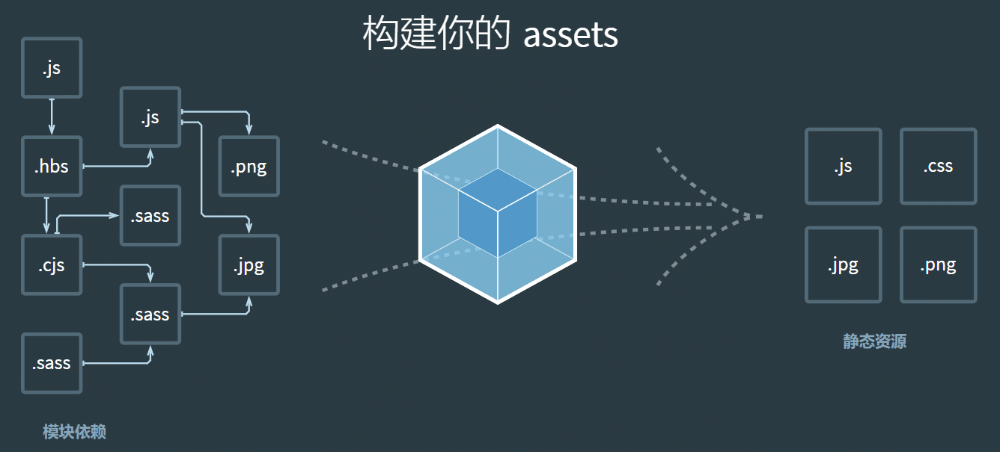
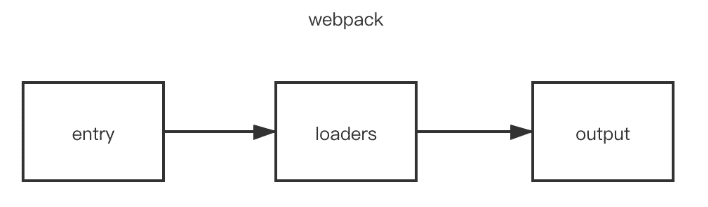

# Loader和Plugin原理

## Loader


### **Loader 是什么？**

>  `loader` 用于 对模块的"源代码"进行转换，在 `import` 或"加载"模块时预处理文件

### **为什么要 Loader?**

>  `webpack`只支持对`js` 和 `json` 文件打包，像`css`、`sass`、`png`等这些类型的文件的时候，`webpack` 需要配置对应的`loader`进行文件内容的解析

`webpack`做的事情，仅仅是分析出各种模块的依赖关系，然后形成资源列表，最终打包生成到指定的文件中。如下图所示：



在`webpack`内部中，任何文件都是模块，不仅仅只是`js`文件

默认情况下，在遇到`import`或者`require`加载模块的时候，`webpack`只支持对`js` 和 `json` 文件打包，像`css`、`sass`、`png`等这些类型的文件的时候，`webpack`则无能为力，这时候就需要配置对应的`loader`进行文件内容的解析

在加载模块的时候，执行顺序如下：



当 `webpack` 碰到不识别的模块的时候，`webpack` 会在配置的中查找该文件解析规则

### **Loader 怎么用？**

配置`loader`的方式有三种：

- 配置方式（推荐）：在 `webpack.config.js` 文件中指定 loader
- 模块导入：在每个 import 语句中显式指定 loader
- CLI 方式：在 shell 命令中指定它们


#### **配置 loader**

`loader`的配置，在`module.rules`属性中，属性介绍如下：

* `rules`属性: 数组的形式，配置多个`loader`；每一个`loader`对应一个对象的形式，对象属性`test` 为匹配的规则，一般情况为正则表达式；
* `test`属性: 正则表达式，匹配文件名称规则；
* `use` 属性:数组的形式，对匹配到文件类型，调用对应的 `loader` 进行处理，use 属性中**Loader 的执行顺序是由后到前的**

**loader 对象配置方式：**

```js
module.exports = {
  // ... 其他配置项
  module: {
    rules: [
      {
        test: /\.css$/,
        use: [
          { loader: 'style-loader' },
          {
            loader: 'css-loader',
            options: {
              modules: true
            }
          },
          { loader: 'sass-loader' }
        ]
      }
    ]
  }
};
```

**loader 数组配置方式：**

```js
 module.exports = {
     // ... 其他配置项
     module: {
        rules: [
          {
            // 用正则去匹配要用该 loader 转换的 CSS 文件
            test: /\.css$/,
            use: ['style-loader', 'css-loader?minimize'],
          }
        ]
      }
  }
```

> `loader`支持链式调用，链中的每个`loader`会处理之前已处理过的资源，最终变为`js`代码。顺序为相反的顺序执行，即上述执行方式为`sass-loader`、`css-loader`、`style-loader`

#### **模块导入**

在源码中引入 loader 

```js
//在源码中指定 Loader 去处理文件,这个文件先采用 css-loader 再采用 style-loader 转换 css
require('style-loader!css-loader?minimize!./main.css');
```


### **Loader 特性**

- **文件加载（File Loading）**：Webpack Loader可以帮助将各种文件加载到Webpack构建中，例如JavaScript文件、CSS文件、图像文件、字体文件等。它们可以处理不同类型的资源，并将其作为模块导入到应用程序中。loader 可以是同步的，也可以是异步的。

- **代码转换（Code Transformation）**：Webpack Loader可以对文件进行代码转换和处理。例如，通过Babel Loader，可以将ES6/ES7代码转换为ES5代码，以便在旧版浏览器中运行。通过CSS Loader和Style Loader，可以将CSS文件转换为JavaScript模块，并将其注入到页面中。loader 能够产生额外的任意文件。

- **模块解析（Module Resolution）**：Webpack Loader可以帮助解析模块之间的依赖关系。它们可以处理模块之间的引用，包括相对路径和绝对路径的解析，以及处理模块的别名和路径映射。

- **预处理器支持（Preprocessor Support）**：Webpack Loader可以与各种预处理器配合使用，如Sass、Less、Stylus等。通过相应的Loader，可以将预处理器语言转换为浏览器可识别的CSS。

- **代码校验（Code Validation）**：Webpack Loader可以进行代码校验，以提供更好的代码质量和可靠性。例如，通过ESLint Loader，可以集成ESLint进行JavaScript代码的静态分析和错误检查。

- **资源优化（Asset Optimization）**：Webpack Loader可以对资源进行优化，以提高应用程序的性能和加载速度。例如，通过Image Loader和File Loader，可以对图像和文件进行压缩、缓存和重命名等处理，以减小文件大小并提高加载速度。

- **插件支持（Plugin Support）**：Webpack Loader可以与Webpack插件一起使用，以提供更丰富的功能和扩展性。它们可以与各种插件配合使用，如热模块替换（Hot Module Replacement）插件、代码压缩插件等，以实现更高级的功能和优化。

  

### **Loader 原理？**

#### **源码转换**

 Webpack 是运行在 Node.js 之上的，一个 Loader 其实就是一个 Node.js 模块，这个模块需要导出一个函数。 这个导出的函数的工作就是获得处理前的原内容，对原内容执行处理后，返回处理后的内容。

一个最简单的 Loader 的源码如下：

```js
module.exports = function(source) {
  // source 为 compiler 传递给 Loader 的一个文件的原内容
  // 该函数需要返回处理后的内容，这里简单起见，直接把原内容返回了，相当于该 Loader 没有做任何转换
  return source;
};
```

由于 Loader 运行在 Node.js 中，你可以调用任何 Node.js 自带的 API，或者安装第三方模块进行调用：

```js
const sass = require('node-sass');
module.exports = function(source) {
  return sass(source);
};
```

#### **单一职责**

一个 Loader 的职责是单一的，只需要完成一种转换。 如果一个源文件需要经历多步转换才能正常使用，就通过多个 Loader 去转换。 在调用多个 Loader 去转换一个文件时，每个 Loader 会链式的顺序执行， 第一个 Loader 将会拿到需处理的原内容，上一个 Loader 处理后的结果会传给下一个接着处理，最后的 Loader 将处理后的最终结果返回给 Webpack。

所以，在开发一个 Loader 时，请保持其职责的单一性，你只需关心输入和输出。

#### **链式处理**

Loader 就像是一个翻译员，能把源文件经过转化后输出新的结果，将结果输出给下一个loader，形成链式翻译。

```js
module.exports = {
  module: {
    rules: [
      {
        // 增加对 SCSS 文件的支持
        test: /\.scss$/,
        // SCSS 文件的处理顺序为先 sass-loader 再 css-loader 再 style-loader
        use: [
          'style-loader',
          {
            loader:'css-loader',
            // 给 css-loader 传入配置项
            options:{
              minimize:true, 
            }
          },
          'sass-loader'],
      },
    ]
  },
};
```

以处理 SCSS 文件为例：

1. SCSS 源代码会先交给 sass-loader 把 SCSS 转换成 CSS；
2. 把 sass-loader 输出的 CSS 交给 css-loader 处理，找出 CSS 中依赖的资源、压缩 CSS 等；
3. 把 css-loader 输出的 CSS 交给 style-loader 处理，转换成通过脚本加载的 JavaScript 代码；

可以看出以上的处理过程需要有顺序的链式执行，先 sass-loader 再 css-loader 再 style-loader。

### **常见 Loader** 

- style-loader: 将css添加到DOM的内联样式标签style里
- css-loader :允许将css文件通过require的方式引入，并返回css代码
- less-loader: 处理less
- sass-loader: 处理sass
- postcss-loader: 用postcss来处理CSS
- autoprefixer-loader: 处理CSS3属性前缀，已被弃用，建议直接使用postcss
- file-loader: 分发文件到output目录并返回相对路径
- url-loader: 和file-loader类似，但是当文件小于设定的limit时可以返回一个Data Url
- html-minify-loader: 压缩HTML
- babel-loader :用babel来转换ES6文件到ES

### **手写 Loader**

下面编写一个 `print-loader.js` 为例，该 loader 作用为打印源码结果。

当编写Webpack Loader步骤：

1. **安装所需的依赖**：首先，需要安装必要的依赖，包括`loader-utils`和`schema-utils`。`loader-utils`提供了一些实用工具函数，`schema-utils`用于验证Loader的选项。

   ````bash
   npm install loader-utils schema-utils --save-dev

2. **创建Loader函数**：创建一个JavaScript文件，命名为`print-loader.js`，并编写Loader的逻辑。

   ````javascript
   const { getOptions } = require('loader-utils'); // 用于获取Loader的选项
   const { validate } = require('schema-utils'); // 用于验证Loader的选项
   const schema = require('./print-loader-options.json'); // 加载选项的JSON模式
   
   module.exports = function(source) {
     const options = getOptions(this); // 获取Loader的选项
     validate(schema, options, {
       name: 'Print Loader',
       baseDataPath: 'options',
     }); // 验证Loader的选项是否符合模式
   
     // 在源代码上添加打印结果
     const result = `console.log('Source Code:', ${JSON.stringify(source)});\n${source}`;
     // 通过 this.callback 告诉 Webpack 返回的结果
     this.callback(null, source, sourceMaps);
     // 当你使用 this.callback 返回内容时，该 Loader 必须返回 undefined，
     // 以让 Webpack 知道该 Loader 返回的结果在 this.callback 中，而不是 return 中 
     return result;
   };
   
   ````

   > 在这个示例中，我们将选项的模式定义在一个独立的JSON文件`print-loader-options.json`中。
   >
   > Loader函数接收一个`source`参数，表示输入的源代码。我们在源代码前面添加一个打印结果，然后返回修改后的源代码。
   >
   > 1. 使用`getOptions`函数从Webpack配置中获取Loader的选项。
   >
   > 2. 使用`validate`函数验证选项是否符合预定义的模式。
   >
   > 3. 通过 `this.callback` 告诉 Webpack 返回的结果.
   >
   >    其中的 `this.callback` 是 Webpack 给 Loader 注入的 API，以方便 Loader 和 Webpack 之间通信。 `this.callback` 的详细使用方法如下：
   >
   >    ```js
   >    this.callback(
   >        // 当无法转换原内容时，给 Webpack 返回一个 Error
   >        err: Error | null,
   >        // 原内容转换后的内容
   >        content: string | Buffer,
   >        // 用于把转换后的内容得出原内容的 Source Map，方便调试
   >        sourceMap?: SourceMap,
   >        // 如果本次转换为原内容生成了 AST 语法树，可以把这个 AST 返回，
   >        // 以方便之后需要 AST 的 Loader 复用该 AST，以避免重复生成 AST，提升性能
   >        abstractSyntaxTree?: AST
   >    );
   >    ```

3. **定义Loader的选项模式**：在与Loader文件相同的目录下，创建一个名为`print-loader-options.json`的JSON文件，并定义Loader的选项模式。

   ````json
   {
     "type": "object",
     "properties": {
       "optionName": {
         "type": "string"
         // 添加其他选项的定义...
       }
     },
     "additionalProperties": false
   }
   ````

   > 定义一个名为`optionName`的字符串类型选项。你可以根据自己的需求添加或修改选项的定义。

4. **配置Webpack**：在Webpack配置中，将我们编写的Loader应用于相应的模块。

   ````javascript
   module.exports = {
     // ...
     module: {
       rules: [
         {
           test: /\.js$/, // 匹配要应用Loader的文件类型,将`print-loader`应用于所有以`.js`结尾的文件，并传递了一个名为`optionName`的选项。
           use: [
             {
               loader: 'print-loader', // 使用我们编写的Loader
               options: {
                 optionName: 'example' // 传递Loader的选项
               }
             }
           ]
         }
       ]
     }
   };
   

现在，当Webpack构建过程中遇到匹配的`.js`文件时，将会应用我们编写的Loader。Loader将在源代码前面添加一个打印结果，然后返回修改后的源代码。


### 参考资料

[《深入浅出webpack - 编写 Loader》](https://webpack.wuhaolin.cn/5%E5%8E%9F%E7%90%86/5-3%E7%BC%96%E5%86%99Loader.html)