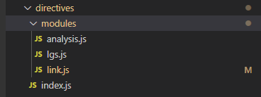

# webpackAPI分析

## webpack 模块方法

[Module Methods document](https://webpack.docschina.org/api/module-methods/#import-1)
[模块-中文文档](https://cloud.tencent.com/developer/section/1477327)

### **require.context 使用和理解**

**使用方式**

[require.context - 文档](https://webpack.docschina.org/guides/dependency-management/#%E5%B8%A6%E8%A1%A8%E8%BE%BE%E5%BC%8F%E7%9A%84-require-%E8%AF%AD%E5%8F%A5)

**使用示例**

* 使用 require.context 引入 ./modules 目录下所有指令文件并在 index.js中遍历全局注册所有指令
* 文件目录：
     
```javascript

/**
 * ./modules目录下保存全局指令,一次性获取所有指令遍历注册
 * 文件名称为指令名
 */

import Vue from 'vue'
//获取/modules目录下全部指令 doc: https://webpack.js.org/guides/dependency-management/#requirecontext
const files = require.context('./modules', true, /\.js$/)
let directives = {}
files.keys().forEach(fileName => {
    const directiveConfig = files(fileName)
    const directiveName = fileName.replace(/^\.\//,'').replace(/\.\w+$/,'')
    directives[directiveName] = directiveConfig.default || directiveConfig
})
/**
 * RegisterDirectives() 注册指令
 * @param { String } 指定指令名称: 参数为空注册所有全局指令，否则注册指定名称指令
 */
export default function RegisterDirectives(...args){
    if(args.length > 0) { //注册传入的指令
        args.map((directiveName) => {
           if(directives[directiveName]) {
                Vue.directive(directiveName, directives[directiveName])
           }else {
               console.error(`${directiveName} directives configuration was not found`)
           }
        })
    }else { //注册所有指令
        for(let directiveName in directives) {
            Vue.directive(directiveName, directives[directiveName])
        }
    }
}

```

* 使用方式

        引入指令： import RegisterDirectives from './directives/index.js'
        注册全部指令： RegisterDirectives()；
        注册指定指令： RegisterDirectives('link')； //注册 link 指令
    

**require.context 原理**

**require.context 优缺点**

* 优点：
* 缺点：
  *  一次性引入所有文件时，webpack打包时会将 require.context匹配中的所有文件都打包，导致没有用到的文件被打包
  * 加大包体积
  * 不能按需加载

**适用场景**

## 参考

[深入理解webpack的require.context](https://juejin.im/post/5d37f1a3e51d45108c59a637)